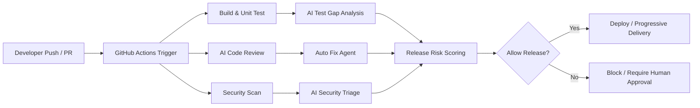

# AI Agent + CI/CD 实战：智能 Code Review、自动化修复、发布决策

过去几年，团队谈论 AI 时，话题通常集中在“写代码更快”“Copilot 能补全多少行”。但当我们把视角从 IDE 挪到软件交付链路，会发现真正能持续放大价值的地方，不是单点编码提效，而是把 AI Agent 嵌进 CI/CD：让它参与代码审查、自动定位和修复缺陷、生成测试、评估发布风险，甚至在上线前给出是否应该继续发布的建议。这样一来，AI 不再只是开发者的副驾驶，而开始成为交付系统中的“自动化质量工程师”“发布守门员”和“安全分析助手”。

本文结合 GitHub Actions、CodeRabbit、Codeium、Sweep、Aider 等工具的实战经验，系统梳理 AI 在 CI/CD 中的可落地场景，并给出可直接改造到项目中的示例配置。文章重点不在“AI 很厉害”的泛泛描述，而在于回答三个更实际的问题：第一，AI 到底应该插在哪些流水线环节；第二，它与传统静态分析、测试、发布审批如何配合；第三，落地过程中有哪些坑，如何避免 AI 变成新的噪声源。

---

## 一、AI 在 CI/CD 中的应用全景：从辅助建议到自动决策

如果把传统 CI/CD 简化成一条流水线，典型阶段通常包括：代码提交、代码审查、构建、测试、安全扫描、制品发布、变更评估、灰度上线和回滚。AI 最容易切入的地方并不是部署本身，而是“高认知成本、规则半结构化、需要上下文理解”的环节。换句话说，凡是过去依赖高级工程师经验判断的地方，都是 AI Agent 的天然舞台。

一个常见的 AI-Enhanced CI/CD 架构可以表示为：



这个流程里，AI 的职责可以拆成五大类：

1. **理解代码变更语义**：识别本次 PR 改的是接口契约、并发逻辑、数据库事务还是前端展示层。
2. **补足规则系统的盲区**：传统 lint 能发现语法与规范问题，但很难理解“这个缓存失效策略可能导致脏读”。
3. **整合多源信号形成判断**：比如把单元测试覆盖、变更文件类型、历史故障模块、依赖漏洞和 reviewer 评论综合成一个风险分值。
4. **生成候选修复方案**：不是只报问题，而是直接给 patch、提交 commit，甚至自动补测试。
5. **面向发布给出决策建议**：例如建议仅灰度 10%、要求额外审批、阻断生产发布。

为了更具体地理解 AI 在流水线中的位置，可以先看一个最小化的 GitHub Actions 流程：

```yaml
name: ai-cicd-overview

on:
  pull_request:
    types: [opened, synchronize, reopened]
  push:
    branches: [main]

jobs:
  review:
    runs-on: ubuntu-latest
    steps:
      - uses: actions/checkout@v4
      - name: Run lint
        run: npm ci && npm run lint
      - name: Run unit test
        run: npm test -- --coverage
      - name: AI review summary
        run: python scripts/ai_review_summary.py
        env:
          OPENAI_API_KEY: ${{ secrets.OPENAI_API_KEY }}

  release-risk:
    if: github.ref == 'refs/heads/main'
    runs-on: ubuntu-latest
    needs: review
    steps:
      - uses: actions/checkout@v4
      - name: Build release evidence
        run: python scripts/release_risk.py
      - name: Upload risk report
        uses: actions/upload-artifact@v4
        with:
          name: release-risk
          path: reports/release-risk.json
```

这个示例看起来很简单，但它已经体现了 AI 落地的关键原则：**AI 不应替代 CI，而应该消费 CI 产出的证据，再输出高价值结论**。很多团队最初会直接把 diff 扔给大模型，让它“做 code review”。结果通常是评价泛泛、上下文不足、误报很多。更好的方式是先跑 lint、测试、覆盖率、依赖扫描、变更统计，再把这些结构化信号连同代码 diff 一并喂给 AI。这样模型输出才更接近工程判断，而不是作文比赛。

在实践中，我建议把 AI 能力按成熟度分成三层：

- **L1：建议层** —— 只评论、不阻断，例如 PR review comment、变更摘要、测试建议。
- **L2：行动层** —— 自动提 patch、自动生成测试、自动创建修复 PR。
- **L3：决策层** —— 结合多项信号给出 release gate 建议，甚至自动控制是否继续发布。

绝大多数团队应该从 L1 起步，在误报率可接受、提示工程稳定后再进入 L2；而 L3 一定要设置人工兜底，尤其是涉及生产环境或合规审批时。

下面这段伪代码演示了一个简单的“风险打分器”，它并不依赖复杂机器学习模型，但非常适合作为 AI 决策的基础框架：

```python
# scripts/release_risk.py
import json
from pathlib import Path

signals = {
    "changed_files": 38,
    "critical_paths_changed": True,
    "unit_test_coverage_drop": 4.2,
    "new_high_vulns": 1,
    "rollback_related_module": True,
    "ai_review_blockers": 2,
}

score = 0
score += min(signals["changed_files"] * 0.5, 20)
score += 20 if signals["critical_paths_changed"] else 0
score += 15 if signals["unit_test_coverage_drop"] > 3 else 0
score += 25 if signals["new_high_vulns"] > 0 else 0
score += 10 if signals["rollback_related_module"] else 0
score += signals["ai_review_blockers"] * 10

level = "low"
if score >= 60:
    level = "high"
elif score >= 30:
    level = "medium"

report = {
    "score": score,
    "level": level,
    "recommendation": (
        "block_release_and_require_approval"
        if level == "high"
        else "allow_canary"
        if level == "medium"
        else "allow_release"
    )
}

Path("reports").mkdir(exist_ok=True)
Path("reports/release-risk.json").write_text(
    json.dumps(report, ensure_ascii=False, indent=2)
)
print(json.dumps(report, ensure_ascii=False, indent=2))
```

它的价值在于：你可以先用可解释规则把基础框架跑起来，再逐步引入大模型做“为什么高风险”的解释与建议。换句话说，**先把 AI 当 reasoning engine，再逐步演进成 action engine**，比一开始就追求全自动闭环更稳。

---

## 二、GitHub Actions 集成 AI Code Review：从 Diff 评论到上下文审查

CI/CD 中最容易见效的 AI 场景，就是 Pull Request 阶段的智能 Code Review。因为这里有天然的触发点、有明确的输入（diff、上下文文件、CI 报告），也有清晰的输出（review comment、approve/request changes、建议修复 patch）。

### 2.1 为什么把 AI Review 放进 GitHub Actions

很多团队已经在 IDE 中使用 Copilot、Cursor 或类似工具，那为什么还要在 GitHub Actions 再做一次 AI Review？原因是两者解决的问题不同：

- IDE AI 面向“作者视角”，帮助写代码；
- CI 中的 AI Review 面向“审查视角”，帮助发现作者没意识到的问题；
- IDE 缺少完整 PR 上下文，CI 能拿到 diff、测试结果、lint 结果、历史评论；
- CI 结果是团队共享资产，可追溯、可审计。

因此，GitHub Actions 中的 AI Review 不是重复劳动，而是把个人辅助升级成团队级质量控制。

### 2.2 一个可落地的 Actions 集成模式

下面给出一个较完整的 GitHub Actions 示例：在 PR 打开或更新时，先执行基础校验，再收集 diff 与测试结果，最后调用一个自定义脚本，把结果提交为 PR 评论。

```yaml
name: ai-pr-review

on:
  pull_request:
    types: [opened, synchronize, reopened]

permissions:
  contents: read
  pull-requests: write

jobs:
  ai-review:
    runs-on: ubuntu-latest
    steps:
      - name: Checkout
        uses: actions/checkout@v4
        with:
          fetch-depth: 0

      - name: Setup Node
        uses: actions/setup-node@v4
        with:
          node-version: 20

      - name: Install dependencies
        run: npm ci

      - name: Run lint and test
        run: |
          npm run lint > lint-report.txt || true
          npm test -- --coverage > test-report.txt || true

      - name: Collect diff
        run: |
          git diff origin/${{ github.base_ref }}...HEAD > pr.diff
          git diff --name-only origin/${{ github.base_ref }}...HEAD > changed_files.txt

      - name: Setup Python
        uses: actions/setup-python@v5
        with:
          python-version: '3.11'

      - name: Generate AI review
        run: python .github/scripts/ai_pr_review.py
        env:
          GITHUB_TOKEN: ${{ secrets.GITHUB_TOKEN }}
          OPENAI_API_KEY: ${{ secrets.OPENAI_API_KEY }}
          PR_NUMBER: ${{ github.event.pull_request.number }}
          REPO: ${{ github.repository }}
```

配套的 `ai_pr_review.py` 通常需要做四件事：

1. 控制输入体积，避免把整个仓库都塞给模型；
2. 提炼 PR 关键信息，如高风险文件、错误日志、覆盖率变化；
3. 明确输出格式，比如 JSON schema，减少模型漂移；
4. 将评论发布回 GitHub。

一个简化脚本如下：

```python
# .github/scripts/ai_pr_review.py
import json
import os
from pathlib import Path

import requests

prompt = f"""
你是资深 Staff Engineer，请审查本次 PR。
请重点关注：
1. 并发安全
2. 空指针/异常路径
3. SQL/缓存一致性
4. API 兼容性
5. 测试是否覆盖新增逻辑

输出 JSON：
{{
  "summary": "总体评价",
  "blockers": ["阻断问题1", "阻断问题2"],
  "warnings": ["警告1"],
  "test_suggestions": ["建议补充的测试"]
}}

变更文件：
{Path('changed_files.txt').read_text()[:4000]}

Diff:
{Path('pr.diff').read_text()[:12000]}

Lint:
{Path('lint-report.txt').read_text()[:4000]}

Test:
{Path('test-report.txt').read_text()[:4000]}
"""

# 这里省略实际模型调用，假设拿到 response_json
response_json = {
    "summary": "本次修改主要集中在订单状态流转和库存扣减逻辑。",
    "blockers": ["库存扣减与订单提交未在同一事务边界内，可能出现超卖。"],
    "warnings": ["新增接口字段未看到向后兼容策略说明。"],
    "test_suggestions": ["补充并发下重复下单测试。"]
}

body = "## AI Code Review\n"
body += f"**总结**：{response_json['summary']}\n\n"
body += "### Blockers\n" + "\n".join(f"- {x}" for x in response_json["blockers"]) + "\n\n"
body += "### Warnings\n" + "\n".join(f"- {x}" for x in response_json["warnings"]) + "\n\n"
body += "### Test Suggestions\n" + "\n".join(f"- {x}" for x in response_json["test_suggestions"]) + "\n"

repo = os.environ["REPO"]
pr_number = os.environ["PR_NUMBER"]
token = os.environ["GITHUB_TOKEN"]

requests.post(
    f"https://api.github.com/repos/{repo}/issues/{pr_number}/comments",
    headers={"Authorization": f"Bearer {token}"},
    json={"body": body},
    timeout=30,
).raise_for_status()
```

### 2.3 深度分析：如何降低 AI Review 的噪声

把模型接进流水线很容易，但让评论“有用”很难。我踩过最典型的三个坑：

**第一，输入过大，输出变泛。**
很多人喜欢把整个 diff、几十个文件、完整测试日志直接发给模型。结果模型只能泛泛而谈：“建议增加错误处理”“建议补充测试”。解决思路是先分层筛选：例如优先纳入 controller/service/repository 层变更、数据库 migration、配置文件和权限逻辑，弱化纯样式变更。

**第二，没有明确角色和输出约束。**
如果 prompt 只是“请 review 这段代码”，模型往往会变成教学博主。要强制它像 reviewer 一样工作，最好限定：只输出 blockers、warnings、test suggestions，并要求每条问题必须关联到变更语义。

**第三，缺乏证据引用。**
AI 说“这段代码可能线程不安全”，作者通常会反问：“为什么？”最有效的方式，是让评论引用具体文件、函数、条件路径，或者把审查结果结构化成带路径和行号的数据，再写回 review comment。

例如，可以要求模型输出这样的结构：

```json
{
  "issues": [
    {
      "severity": "high",
      "file": "src/order/service.ts",
      "line": 87,
      "title": "库存检查与扣减存在竞态",
      "reason": "checkStock 和 deductStock 之间缺少原子性控制",
      "suggestion": "使用数据库行锁或原子 update 条件"
    }
  ]
}
```

随后通过 GitHub Review API 发成逐行评论，review 的接受度会明显高于长篇总结型评论。

### 2.4 与传统规则引擎的分工

AI Code Review 最怕的不是能力不够，而是被迫重复做静态规则该做的事。最佳实践是：

- **lint/formatter** 处理风格问题；
- **CodeQL/Semgrep** 处理已知模式问题；
- **单元/集成测试** 提供行为证据；
- **AI** 负责解释跨文件逻辑、设计风险、测试缺口和修复建议。

如果这一层分工没做好，AI 评论很容易退化成“请修一下命名和格式”，既浪费 token，又打击团队信任。

---

## 三、CodeRabbit / Codeium 等工具实战：如何真正接入团队协作流

现在市场上的 AI Code Review 工具很多，但在团队实际使用中，并不是“接上就行”，而是要考虑：评论质量、上下文理解、与 PR 工作流的贴合度、误报率、权限边界、成本以及是否支持企业合规。

### 3.1 CodeRabbit：最接近“AI Reviewer”的现成方案

CodeRabbit 的优势是接入简单、PR 场景成熟，通常几分钟就能启用。它的核心价值在于：自动读取 PR diff，结合仓库上下文，在 Pull Request 中直接给出评论、摘要和建议。

一个最基础的配置如下：

```yaml
# .github/workflows/coderabbit.yml
name: coderabbit-review

on:
  pull_request:
    types: [opened, synchronize, reopened]

jobs:
  review:
    runs-on: ubuntu-latest
    steps:
      - uses: actions/checkout@v4
      - name: Run CodeRabbit
        uses: coderabbitai/ai-pr-reviewer@latest
        env:
          GITHUB_TOKEN: ${{ secrets.GITHUB_TOKEN }}
          OPENAI_API_KEY: ${{ secrets.OPENAI_API_KEY }}
```

如果项目较大，我建议为 CodeRabbit 增加路径过滤和审查重点，否则它容易在文档、lock file 或生成代码上浪费预算：

```yaml
name: coderabbit-filtered

on:
  pull_request:
    paths:
      - 'src/**'
      - 'api/**'
      - 'db/**'
      - '.github/workflows/**'

jobs:
  review:
    runs-on: ubuntu-latest
    steps:
      - uses: actions/checkout@v4
      - name: AI Review
        uses: coderabbitai/ai-pr-reviewer@latest
        env:
          GITHUB_TOKEN: ${{ secrets.GITHUB_TOKEN }}
          OPENAI_API_KEY: ${{ secrets.OPENAI_API_KEY }}
          REVIEW_SIMPLE_CHANGES: 'false'
          REVIEW_COMMENT_LGTM: 'false'
```

#### CodeRabbit 的优点

- 上手快，几乎零脚本成本；
- PR 评论体验好，适合团队试点；
- 能自动总结改动内容，减少 reviewer 熟悉上下文的时间；
- 对中小型仓库比较友好。

#### CodeRabbit 的局限

- 对大型 monorepo 的上下文控制仍需要额外治理；
- 如果没有结合测试和扫描证据，评论可能偏“经验判断”；
- 私有部署、合规、数据边界要提前评估。

### 3.2 Codeium / Windsurf 类工具：更偏“开发侧智能”，如何融入 CI

严格来说，Codeium 更强的场景是在本地 IDE 中辅助编码与理解代码，而不是像 CodeRabbit 那样天然面向 PR Review。但这不意味着它与 CI/CD 没关系。很多团队实际做法是：

1. 开发者本地使用 Codeium/Windsurf 辅助完成实现；
2. 在提交 PR 前用本地命令生成变更摘要、测试建议；
3. CI 再运行统一的 AI 审查规则，做团队层面验收。

你可以通过 pre-push hook 把“本地 AI 预审查”接到开发流里：

```bash
#!/usr/bin/env bash
set -euo pipefail

echo "[pre-push] running local checks..."
npm run lint
npm test -- --runInBand

echo "[pre-push] generating AI summary..."
python scripts/local_ai_summary.py > .git/AI_SUMMARY.md || true

echo "[pre-push] done"
```

而在 CI 中，则把这份摘要作为辅助材料上传：

```yaml
- name: Upload local AI summary
  if: always()
  uses: actions/upload-artifact@v4
  with:
    name: local-ai-summary
    path: .git/AI_SUMMARY.md
```

这种模式的价值在于：把本地 AI 从“个人效率工具”变成“团队交付证据的一部分”。当然，前提是你不能盲信开发者本地生成的结论，它只能作为补充，而不是最终审查依据。

### 3.3 工具选型建议：不要只看“更聪明”，要看“更可运营”

我在选型时通常用下面这张简单表格评估：

```yaml
evaluation_dimensions:
  - review_quality
  - false_positive_rate
  - context_window_strategy
  - enterprise_compliance
  - on_prem_or_private_network_support
  - pricing_per_pr_or_per_seat
  - integration_with_github_actions
  - support_for_inline_comments
  - custom_prompt_or_policy
  - auditability
```

真正上线后，决定团队是否愿意长期使用的，往往不是模型智商，而是以下三个运营指标：

- **误报率**：如果十条里八条没用，大家会自动忽略它；
- **可配置性**：能不能禁掉某些目录、某些类型问题；
- **稳定性**：在 PR 高峰时不会随机失效或评论风格漂移严重。

### 3.4 AI Code Review 工具对比：选型时该看什么

为了避免“只听过名字就上生产”，我更建议用统一维度比较主流 AI Code Review 工具。下面这张表适合在团队内部做 PoC 选型时直接拿来讨论：

| 工具 | 典型定位 | 与 GitHub Actions / PR 流配合 | 优势 | 局限 | 适合场景 |
| --- | --- | --- | --- | --- | --- |
| CodeRabbit | PR 审查型 SaaS Reviewer | 原生贴合 Pull Request 评论与摘要 | 上手快、评论体验成熟、适合快速试点 | 成本与数据边界需评估，大仓库需额外控上下文 | 想最快把 AI Code Review 接入团队协作 |
| Codeium / Windsurf | IDE 侧编码与理解助手 | 更适合作为 PR 前预检查与摘要来源 | 开发者采用成本低，本地反馈快 | 不天然等于团队级审查，需要 CI 二次收口 | 先提升个人编码效率，再接团队审查 |
| Sweep | Issue → 修复 PR 自动化 Agent | 可作为 CI 失败或 Issue 驱动修复器 | 适合标准化缺陷闭环，能直接生成修复 PR | 对复杂业务语义和高风险改动要谨慎 | 缺陷模板清晰、修复边界明确的仓库 |
| Aider | 本地 / CLI 驱动改码 Agent | 适合在 Actions Job 或本地脚本中受控调用 | 对指定文件修改能力强，适合半自动修复 | 需要你自己设计验证、权限和回归闸门 | 测试失败修复、受限目录 patch 生成 |
| 自定义脚本 + LLM API | 可编排的团队规则引擎 | 可深度嵌入 GitHub Actions、Artifact、审批流 | 可控性最高，能结合测试、安全、风险数据 | 实现与维护成本最高，需要工程治理能力 | 有明确审查策略、合规要求或多 Agent 编排需求 |

如果你的目标是**最短时间验证价值**，CodeRabbit 往往是首选；如果你的目标是**把 AI 审查变成企业内可治理能力**，那么最终通常会走向“现成工具 + 自定义脚本”混合架构。

一个经验是：**现成 SaaS 工具适合快速启动，自定义脚本适合沉淀团队特定规则，两者最好并存**。前者负责快，后者负责深。

---

## 四、自动化 Bug 修复：Sweep / Aider 如何进入修复闭环

如果说 AI Code Review 解决的是“指出问题”，那么自动化 Bug 修复解决的是“问题指出以后谁来改”。这一块最近进步非常快，尤其是 Sweep、Aider 这类工具，已经能在比较明确的问题描述和约束下生成靠谱 patch，甚至自行补测试、开 PR。

### 4.1 适合自动修复的 Bug 类型

不是所有问题都适合交给 AI 自动修。根据经验，最适合自动修复的是：

- 明确报错、有稳定复现步骤的问题；
- 测试失败定位清楚的问题；
- 规则型缺陷，如类型错误、边界遗漏、异常处理缺失；
- 框架升级导致的 API 兼容性修复；
- 已有相似模式可参考的仓库。

最不适合的是：

- 涉及复杂业务决策的问题；
- 需要跨团队对齐需求语义的问题；
- 高风险架构改动；
- 无法稳定复现、缺少失败证据的问题。

### 4.2 Sweep：让 Issue 直接变成修复 PR

Sweep 的典型工作方式是：给它一个 GitHub Issue，它读取 issue 描述、仓库上下文和相关代码，然后自动创建修复 PR。这个模式很适合处理标准化 defect。

你可以在仓库里约定 issue 模板，让 AI 更容易正确理解问题：

```markdown
## Bug Summary
支付回调偶发 500，导致订单状态未更新。

## Expected Behavior
第三方支付回调到达后，应幂等更新订单状态，不因重复请求报错。

## Reproduction Steps
1. 向 `/api/payment/callback` 连续发送相同 transaction_id 两次
2. 第二次请求返回 500

## Logs
Duplicate key value violates unique constraint `payment_events_txn_id_key`

## Suspected Scope
- src/payment/callback.ts
- src/payment/payment-service.ts
- src/db/payment-repository.ts
```

这种模板化输入能显著提升修复质量，因为 AI 不再需要从模糊自然语言里猜测问题边界。

### 4.3 Aider：更适合本地/半自动修复流

Aider 更像一个强力的终端编程搭档，适合开发者或 CI Job 在本地仓库里交互式修改代码。一个很实用的方式，是在 CI 发现失败测试后，把失败日志、相关文件和修复指令喂给 Aider，让它生成 patch，再由机器人创建分支和 PR。

例如：

```bash
aider \
  src/payment/callback.ts \
  src/payment/payment-service.ts \
  tests/payment/callback.test.ts \
  --message "修复重复支付回调导致 500 的问题。要求：1）幂等；2）保留现有事务语义；3）补充重复请求测试；4）不要修改 API 响应结构。"
```

如果你想把它自动化，可以在 GitHub Actions 中这样串起来：

```yaml
name: auto-fix-failed-tests

on:
  workflow_dispatch:
  schedule:
    - cron: '0 * * * *'

jobs:
  auto-fix:
    runs-on: ubuntu-latest
    steps:
      - uses: actions/checkout@v4
        with:
          ref: main
      - uses: actions/setup-node@v4
        with:
          node-version: 20
      - run: npm ci
      - name: Run tests
        run: npm test > failed-tests.txt
        continue-on-error: true
      - name: Run Aider for patch generation
        if: always()
        run: |
          aider src/ tests/ --message "根据 failed-tests.txt 修复失败测试，并补充必要测试"
        env:
          OPENAI_API_KEY: ${{ secrets.OPENAI_API_KEY }}
      - name: Create PR
        run: |
          git checkout -b bot/auto-fix-${{ github.run_id }}
          git add .
          git commit -m "chore: auto-fix failed tests"
          git push origin HEAD
```

### 4.4 深度分析：自动修复要设哪些边界

自动修复最容易让人兴奋，但也是最容易“翻车”的环节。我的经验是至少设三道闸：

**闸门 1：问题必须有客观失败证据。**
没有 failing test、异常日志、复现步骤，就不要让 AI 自动改。否则它很可能在“猜需求”。

**闸门 2：AI 提交必须经过回归验证。**
不仅要跑原本失败的测试，还要跑相关模块测试、lint、类型检查和安全扫描。修好了一个 bug，别引入三个新问题。

**闸门 3：自动修复只允许在受限目录执行。**
例如只允许改 `src/payment/**` 和 `tests/payment/**`，不允许碰 infra、权限、账务核心模块。边界越清晰，自动化越安全。

你甚至可以在脚本里直接限制改动范围：

```bash
changed_files=$(git diff --name-only)
for file in $changed_files; do
  case "$file" in
    src/payment/*|tests/payment/*)
      ;;
    *)
      echo "Unauthorized file change: $file"
      exit 1
      ;;
  esac
done
```

这个做法非常“土”，但在工程上极其有效。AI 自动修复不是展示能力，而是建立可信边界。

---

## 五、AI 辅助测试生成：从补单测到识别测试盲区

测试生成是另一个非常适合 AI 的场景。因为它天然有明确输入（函数/模块/接口变更）和明确目标（覆盖路径、构造数据、断言行为）。但实践里真正有价值的，不只是“多生成几个单元测试”，而是让 AI 帮你识别测试盲区，并把新增风险转化成可执行测试资产。

### 5.1 为什么很多 AI 生成的测试“能跑但没价值”

这是我早期踩得最多的坑。模型很擅长生成 happy path 测试：

- 输入正常参数；
- 调用方法；
- 断言返回值等于预期。

但工程上真正缺的是这些：

- 边界条件；
- 异常路径；
- 并发与时序；
- 数据污染与幂等；
- 依赖故障时的降级逻辑。

因此，测试生成的提示词必须聚焦“风险”，而不是“帮我写测试”。

### 5.2 基于 diff 的测试建议生成

一个有效模式是：先从 diff 中识别变更类型，再让模型输出“应该补哪些测试”，而不是直接吐整段测试代码。待建议合理后，再进入自动生成。

比如在 GitHub Actions 中加一个测试建议步骤：

```yaml
- name: Suggest missing tests
  run: python .github/scripts/test_gap_analysis.py
  env:
    OPENAI_API_KEY: ${{ secrets.OPENAI_API_KEY }}
```

脚本示例：

```python
# .github/scripts/test_gap_analysis.py
from pathlib import Path
import json

diff_text = Path("pr.diff").read_text()
prompt = f"""
请根据以下代码变更，识别缺失的测试场景。
要求按以下分类输出：
1. happy_path
2. edge_cases
3. error_handling
4. concurrency
5. contract_compatibility

Diff:
{diff_text[:12000]}
"""

result = {
    "edge_cases": [
        "当库存为 0 时下单接口应返回明确错误码，而不是 500"
    ],
    "concurrency": [
        "两个并发请求同时扣减最后一件库存时，只允许一个成功"
    ],
    "contract_compatibility": [
        "老版本客户端缺少新字段时，响应仍应可解析"
    ]
}

Path("reports").mkdir(exist_ok=True)
Path("reports/test-gap.json").write_text(
    json.dumps(result, ensure_ascii=False, indent=2)
)
```

### 5.3 自动生成 Jest / Pytest 测试示例

当你确认了测试建议后，再让 AI 生成测试代码，质量会高得多。以下是一个 Jest 示例，演示如何测试支付回调幂等性：

```ts
import request from 'supertest';
import { app } from '../../src/app';
import { resetDb, seedOrder } from '../helpers/db';

describe('payment callback idempotency', () => {
  beforeEach(async () => {
    await resetDb();
    await seedOrder({ orderId: 'o-1', status: 'PENDING' });
  });

  it('should process duplicated callback only once', async () => {
    const payload = { transactionId: 'txn-001', orderId: 'o-1', status: 'PAID' };

    const first = await request(app)
      .post('/api/payment/callback')
      .send(payload);

    const second = await request(app)
      .post('/api/payment/callback')
      .send(payload);

    expect(first.status).toBe(200);
    expect(second.status).toBe(200);
    expect(second.body.idempotent).toBe(true);
  });
});
```

如果是 Python 服务，可以用 Pytest + parametrization 让 AI 更容易覆盖边界：

```python
import pytest
from app.risk import score_release

@pytest.mark.parametrize(
    "changed_files,high_vulns,coverage_drop,expected_level",
    [
        (3, 0, 0.5, "low"),
        (25, 0, 1.0, "medium"),
        (40, 1, 5.0, "high"),
    ],
)
def test_score_release(changed_files, high_vulns, coverage_drop, expected_level):
    result = score_release(
        changed_files=changed_files,
        high_vulns=high_vulns,
        coverage_drop=coverage_drop,
    )
    assert result["level"] == expected_level
```

### 5.4 深度分析：AI 生成测试的最佳位置

我建议把 AI 测试生成分成三层：

- **PR 阶段**：生成测试建议，不自动提交；
- **人工确认后**：生成测试代码到独立 PR；
- **回归失败时**：尝试自动补最小测试来复现缺陷。

为什么不建议一上来就“自动生成并合并测试”？因为低质量测试的危害很大：它会带来虚假的安全感，还会增加维护负担。真正好的策略是让 AI **先暴露盲区，再辅助生成可审查的测试**。

一个额外技巧是：让模型解释“为什么这个测试重要”。例如输出：

```json
{
  "scenario": "并发重复支付回调",
  "why_it_matters": "线上网络抖动可能导致第三方重试，若不幂等会引发重复入账或 500 错误",
  "test_type": "integration"
}
```

这会显著提升团队接受度，因为测试不再只是“AI 瞎补的”，而是与真实风险直接关联。

---

## 六、发布风险评估与决策：让 AI 成为 Release Gate 的解释器

很多团队的发布审批仍然依赖经验：某个负责人看一下改动范围、测试通过没、有没有高危漏洞，然后拍板“上吧”。这个流程在小团队时还能运作，但随着系统复杂度上升，它会越来越不可复制。AI 在这里最适合做的，不是独立决定“发不发”，而是成为一个**聚合证据、量化风险、输出建议**的发布决策辅助器。

### 6.1 发布风险应整合哪些信号

一个比较完整的风险输入通常包括：

- 本次变更文件数、代码行数；
- 是否触达关键路径（支付、鉴权、订单、权限、账务）；
- 单元测试、集成测试、E2E 测试结果；
- 覆盖率变化；
- 新增依赖与依赖漏洞；
- AI Code Review 的 blockers/warnings；
- 历史故障模块热度；
- 变更是否包含 schema migration；
- 发布窗口（工作时间/非工作时间）；
- 是否具备 feature flag 与回滚方案。

一个简化版风险规则可以配置成 YAML：

```yaml
risk_rules:
  critical_paths:
    - src/payment/**
    - src/auth/**
    - src/order/**
  weights:
    changed_files: 0.5
    critical_path_bonus: 20
    schema_migration_bonus: 25
    high_vulnerability_bonus: 25
    ai_blocker_bonus: 10
    coverage_drop_bonus: 15
  thresholds:
    low: 0
    medium: 30
    high: 60
```

然后让程序把这些结构化信号汇总成统一报告：

```python
import fnmatch
import json

changed_files = [
    "src/order/service.ts",
    "src/payment/callback.ts",
    "db/migrations/20260602_add_payment_index.sql",
]

rules = {
    "critical_paths": ["src/payment/**", "src/auth/**", "src/order/**"]
}

critical_hit = any(
    fnmatch.fnmatch(file, pattern)
    for file in changed_files
    for pattern in rules["critical_paths"]
)

report = {
    "changed_files": len(changed_files),
    "critical_hit": critical_hit,
    "schema_migration": any("migrations/" in f for f in changed_files),
    "ai_blockers": 2,
    "high_vulnerabilities": 0,
    "coverage_drop": 1.5,
}

print(json.dumps(report, ensure_ascii=False, indent=2))
```

### 6.2 在 GitHub Actions 中做发布闸门

下面是一个典型的 release gate 工作流：

```yaml
name: release-gate

on:
  workflow_dispatch:
  push:
    branches: [main]

jobs:
  evaluate-risk:
    runs-on: ubuntu-latest
    outputs:
      risk_level: ${{ steps.risk.outputs.risk_level }}
    steps:
      - uses: actions/checkout@v4
        with:
          fetch-depth: 0
      - name: Build risk report
        id: risk
        run: |
          python scripts/release_risk.py > risk.json
          RISK_LEVEL=$(python -c "import json; print(json.load(open('risk.json'))['level'])")
          echo "risk_level=$RISK_LEVEL" >> $GITHUB_OUTPUT
      - name: Upload risk report
        uses: actions/upload-artifact@v4
        with:
          name: risk-report
          path: risk.json

  deploy:
    needs: evaluate-risk
    if: needs.evaluate-risk.outputs.risk_level != 'high'
    runs-on: ubuntu-latest
    steps:
      - name: Deploy to production
        run: ./scripts/deploy.sh

  require-approval:
    needs: evaluate-risk
    if: needs.evaluate-risk.outputs.risk_level == 'high'
    runs-on: ubuntu-latest
    environment:
      name: production-approval
    steps:
      - run: echo "High risk release. Manual approval required."
```

如果你希望在 PR 阶段就把 **AI Agent + GitHub Actions + 自动化 Code Review** 串成一条更完整的流水线，可以采用下面这个更贴近真实项目的工作流。它先跑 lint、测试与 diff 收集，再把结构化证据交给 AI 审查脚本，最后把审查结果作为 PR 评论和构件产物回传：

```yaml
# .github/workflows/ai-code-review.yml
name: ai-code-review

on:
  pull_request:
    types: [opened, synchronize, reopened]

permissions:
  contents: read
  pull-requests: write

jobs:
  ai-review:
    runs-on: ubuntu-latest
    steps:
      - name: Checkout repository
        uses: actions/checkout@v4
        with:
          fetch-depth: 0

      - name: Setup Node.js
        uses: actions/setup-node@v4
        with:
          node-version: 20
          cache: npm

      - name: Install dependencies
        run: npm ci

      - name: Run lint
        run: |
          mkdir -p reports
          npm run lint -- --format json > reports/lint.json || true

      - name: Run unit tests with coverage
        run: npm test -- --coverage --json --outputFile=reports/test-results.json || true

      - name: Collect pull request diff
        run: |
          git diff origin/${{ github.base_ref }}...HEAD > reports/pr.diff
          git diff --name-only origin/${{ github.base_ref }}...HEAD > reports/changed-files.txt

      - name: Setup Python
        uses: actions/setup-python@v5
        with:
          python-version: '3.11'

      - name: Install Python dependencies
        run: python -m pip install requests

      - name: Generate AI review report
        run: python .github/scripts/ai_pr_review.py
        env:
          GITHUB_TOKEN: ${{ secrets.GITHUB_TOKEN }}
          OPENAI_API_KEY: ${{ secrets.OPENAI_API_KEY }}
          PR_NUMBER: ${{ github.event.pull_request.number }}
          REPO: ${{ github.repository }}
          DIFF_PATH: reports/pr.diff
          CHANGED_FILES_PATH: reports/changed-files.txt
          LINT_REPORT_PATH: reports/lint.json
          TEST_REPORT_PATH: reports/test-results.json

      - name: Upload AI review artifacts
        if: always()
        uses: actions/upload-artifact@v4
        with:
          name: ai-review-report
          path: reports/
```

这个版本比前面的最小示例更适合生产使用，原因主要有三点：

1. **先跑传统校验，再让 AI 解释证据**，能显著降低无效评论；
2. **把 diff、lint、测试结果都落到 reports/**，后续可直接扩展成安全 triage、风险打分、自动修复；
3. **保留 artifact 与 PR 评论双通道输出**，方便审计与团队复盘。

### 6.3 AI 在风险决策中的真正价值：解释，而不是拍脑袋

很多人一听“AI 决策”就会担心黑盒。这个担心完全合理。所以最重要的设计原则是：**AI 负责解释风险，规则系统负责执行闸门**。

也就是说：

- 是否阻断发布，应该由规则阈值、审批流、环境保护规则执行；
- AI 输出的是对风险的自然语言解释、建议灰度策略、建议补的验证项；
- 人类据此更快决策，而不是把责任扔给模型。

例如，AI 可以生成这样的发布建议：

```json
{
  "risk_level": "high",
  "reasoning": [
    "本次变更同时触达订单与支付链路，属于历史高故障耦合区域",
    "包含数据库 migration，但未看到回滚脚本",
    "AI Review 发现两个阻断问题：幂等缺失与事务边界不一致"
  ],
  "recommendation": {
    "deployment_strategy": "canary_10_percent",
    "require_manual_approval": true,
    "extra_checks": [
      "支付回调重复请求压测",
      "数据库 migration 回滚演练"
    ]
  }
}
```

这类输出对发布经理、值班同学、TL 都非常有帮助，因为它把分散证据转成了可执行建议。

---

## 七、安全扫描增强：让 AI 负责告警归并、误报消减与修复建议

安全扫描是 CI/CD 里最容易“告警爆炸”的环节之一。SAST、SCA、Secret Scan、Container Scan 一起跑起来后，团队经常面对的是一堆 issue，却不知道哪些真要命、哪些是误报、哪些应该优先修。这里 AI 的价值不是替代扫描器，而是作为“安全告警分析层”。

### 7.1 传统安全扫描的痛点

常见问题包括：

- 告警多，开发者疲劳；
- 缺少业务上下文，不知道是否可利用；
- 修复建议模板化，落不到代码；
- 相同根因在多个工具中重复报警。

例如，CodeQL 可能提示 SQL Injection 风险，Semgrep 也报了一条参数拼接问题，依赖扫描再提示某 ORM 版本存在注入漏洞。对开发者来说，这些很可能是一个根因，但工具会呈现成三类独立问题。

### 7.2 GitHub Actions 中集成安全扫描与 AI 总结

先跑标准工具，再让 AI 汇总解释，是非常高效的组合。

```yaml
name: security-enhanced

on:
  pull_request:
  push:
    branches: [main]

jobs:
  security:
    runs-on: ubuntu-latest
    steps:
      - uses: actions/checkout@v4
      - name: Run Trivy fs scan
        run: trivy fs --format json --output trivy.json .
      - name: Run Semgrep
        run: semgrep scan --config auto --json --output semgrep.json || true
      - name: Run secret scan
        run: gitleaks detect --report-format json --report-path gitleaks.json || true
      - name: AI security triage
        run: python scripts/ai_security_triage.py
        env:
          OPENAI_API_KEY: ${{ secrets.OPENAI_API_KEY }}
```

`ai_security_triage.py` 的目标不是重新发现漏洞，而是把多工具输出转成更有行动性的内容：

```python
import json
from pathlib import Path

inputs = {}
for name in ["trivy.json", "semgrep.json", "gitleaks.json"]:
    path = Path(name)
    if path.exists():
        inputs[name] = path.read_text()[:12000]

prompt = f"""
你是应用安全工程师，请汇总以下扫描结果：
1. 合并可能重复的根因
2. 标记最可能误报的项
3. 给出按优先级排序的修复建议
4. 指出哪些问题应阻断发布

输入：{json.dumps(inputs, ensure_ascii=False)}
"""

report = {
    "blockers": [
        "在 src/db/user-repository.ts 中发现拼接 SQL 的高风险路径，需优先修复"
    ],
    "likely_false_positives": [
        "测试目录中的示例 token 被 gitleaks 标记，但实际为 mock 数据"
    ],
    "fix_plan": [
        "改用参数化查询",
        "为数据库访问层新增注入测试",
        "升级 ORM 到安全版本"
    ]
}

Path("reports").mkdir(exist_ok=True)
Path("reports/security-triage.json").write_text(
    json.dumps(report, ensure_ascii=False, indent=2)
)
```

### 7.3 深度分析：AI 能让安全扫描“更可用”，但不能“更权威”

安全领域要特别强调一个原则：AI 的解释能力很有用，但它不能替代扫描器和安全工程师的权威判断。尤其在以下场景中要谨慎：

- 高危告警被 AI 误判为误报；
- AI 建议的修复方式引入功能回归；
- 对 exploitability 的判断缺少部署环境信息。

因此，我建议把 AI 放在三个增强点：

1. **去重与归因**：把多个扫描结果归并成“同一个根因”；
2. **优先级排序**：结合业务路径判断先修哪个；
3. **修复说明翻译**：把安全术语翻译成开发者可执行任务。

而以下工作仍应由规则或人工把关：

- 最终发布阻断；
- CVE 严重级别定义；
- 合规审计结论；
- 是否接受风险豁免。

简单说，AI 应该把安全结果“翻译成人话、排序成计划”，而不是独自拍板。

---

## 八、自定义 AI Pipeline：把多 Agent 串成可治理的工程系统

当团队对单点 AI 能力有了基础信任后，下一步往往不是接更多单独工具，而是构建自定义 AI Pipeline，把 review、测试、修复、风险评估、安全分析串成可编排的流程。

### 8.1 一个可维护的 Pipeline 设计原则

自定义 AI Pipeline 不应该是“一个大 prompt 干所有事”，而应该拆成多个职责明确的 Agent 或任务：

- **Diff Analyzer**：理解本次变更范围；
- **Review Agent**：给出代码风险点；
- **Test Agent**：识别测试盲区并生成建议；
- **Fix Agent**：在明确失败证据下生成 patch；
- **Security Triage Agent**：归并安全告警；
- **Release Judge**：聚合信号输出风险建议。

下面是一个示意性工作流配置：

```yaml
pipeline:
  stages:
    - name: diff_analysis
      inputs: [git_diff, changed_files]
      outputs: [change_summary, impacted_modules]

    - name: review
      inputs: [change_summary, git_diff, lint_report, test_report]
      outputs: [review_findings]

    - name: test_gap
      inputs: [git_diff, impacted_modules]
      outputs: [missing_tests]

    - name: security_triage
      inputs: [semgrep_json, trivy_json, codeql_sarif]
      outputs: [security_summary]

    - name: release_decision
      inputs: [review_findings, missing_tests, security_summary, quality_metrics]
      outputs: [risk_report, recommendation]
```

### 8.2 在 GitHub Actions 中编排多阶段 AI 流程

你不一定需要额外引入复杂平台，GitHub Actions 本身就足够编排一条多阶段 AI Pipeline：

```yaml
name: custom-ai-pipeline

on:
  pull_request:
    types: [opened, synchronize, reopened]

jobs:
  analyze:
    runs-on: ubuntu-latest
    steps:
      - uses: actions/checkout@v4
      - run: git diff origin/${{ github.base_ref }}...HEAD > pr.diff
      - run: python scripts/diff_analyzer.py
      - uses: actions/upload-artifact@v4
        with:
          name: analysis
          path: reports/change-summary.json

  review:
    runs-on: ubuntu-latest
    needs: analyze
    steps:
      - uses: actions/checkout@v4
      - uses: actions/download-artifact@v4
        with:
          name: analysis
          path: reports
      - run: python scripts/review_agent.py
      - uses: actions/upload-artifact@v4
        with:
          name: review
          path: reports/review-findings.json

  release-judge:
    runs-on: ubuntu-latest
    needs: [analyze, review]
    steps:
      - uses: actions/checkout@v4
      - uses: actions/download-artifact@v4
        with:
          name: review
          path: reports
      - run: python scripts/release_judge.py
```

### 8.3 自定义 Pipeline 的核心不是模型，而是“可治理”

很多团队一开始热衷于比较模型：GPT、Claude、Gemini、开源模型谁更强。但在工程落地上，真正决定成败的是下面这些“枯燥问题”：

- prompt 和输出 schema 是否可版本化；
- 失败重试怎么做；
- token 成本怎么控；
- 超时怎么办；
- 模型输出错误时如何回退；
- 哪些任务必须人工审批。

例如，你完全可以给每个 Agent 定义明确 schema，并在 CI 中做 JSON 校验：

```json
{
  "type": "object",
  "required": ["risk_level", "summary", "recommendations"],
  "properties": {
    "risk_level": {
      "type": "string",
      "enum": ["low", "medium", "high"]
    },
    "summary": {
      "type": "string"
    },
    "recommendations": {
      "type": "array",
      "items": { "type": "string" }
    }
  }
}
```

一旦模型输出不符合 schema，就直接标记为失败并降级到人工流程。这种“保守工程化”会极大提高系统可靠性。

### 8.4 一个更现实的策略：人机协同而非全自动自治

虽然“多 Agent 自治流水线”听起来很酷，但从实战角度看，更推荐的目标是：

- AI 自动收集证据和生成建议；
- 低风险问题自动修复并开 PR；
- 中高风险问题由人审批；
- 发布 gate 始终保留人工 override；
- 所有决策有日志、有依据、可回溯。

这不是保守，而是成熟。CI/CD 的第一原则不是炫技，而是可控。

---

## 九、真实踩坑记录：从“AI 很聪明”到“AI 终于靠谱”

最后这一节，我不讲成功学，专门讲落地时踩过的坑。很多问题不是技术做不到，而是工程现实很复杂。

### 9.1 坑一：把 AI 当成万能审查器，结果评论又多又废

最初接入 AI Review 时，我们几乎把所有 PR 都交给模型审查，包括文档、样式、自动生成文件、依赖锁文件。结果每个 PR 都有长篇评论，但真正有价值的只有一两条。团队很快开始忽略它。

后来我们做了三件事：

1. 过滤无意义路径；
2. 让 AI 只关注高风险模块；
3. 禁止输出纯风格建议。

相关配置大概像这样：

```yaml
review_policy:
  include_paths:
    - src/**
    - api/**
    - db/**
  exclude_paths:
    - docs/**
    - '**/*.snap'
    - '**/package-lock.json'
    - '**/dist/**'
  forbid_comment_types:
    - style_only
    - naming_only
```

这样改完之后，评论数量少了，但命中率高了很多。经验就是：**AI Review 的价值不在于多说，而在于说准。**

### 9.2 坑二：自动修复改对了表面，却破坏了业务约束

有一次我们让 AI 修复一个接口超时重试问题。它确实把异常处理加上了，也让测试通过了，但却悄悄改变了一个业务约束：原来某状态机只能从 `PENDING -> PAID`，它为了“容错”加了重复写入逻辑，结果把非法状态迁移也放过去了。

后来我们总结出一个教训：**自动修复不能只验证测试通过，还要验证关键业务不变量。**

于是我们补了一层 invariant check：

```python
ALLOWED_TRANSITIONS = {
    "PENDING": {"PAID", "CANCELLED"},
    "PAID": set(),
    "CANCELLED": set(),
}


def assert_valid_transition(old_status: str, new_status: str):
    if new_status not in ALLOWED_TRANSITIONS.get(old_status, set()):
        raise ValueError(f"invalid transition: {old_status} -> {new_status}")
```

这段代码不复杂，却极大降低了“AI 为了修 bug 而破坏业务语义”的概率。

### 9.3 坑三：测试生成过量，维护成本飙升

另一个阶段，我们让 AI 每次检测到新增逻辑都自动生成测试。短期看覆盖率很好看，长期看测试库开始膨胀：很多测试重复、断言脆弱、耦合实现细节，重构时大量红灯。

最后我们改成了“测试建议优先、代码生成谨慎”的策略，并引入测试质量规则：

```yaml
test_generation_policy:
  auto_generate_only_when:
    - failed_test_has_clear_root_cause
    - new_branch_without_existing_test
    - public_api_contract_changed
  reject_if:
    - asserts_internal_private_state
    - duplicates_existing_scenario
    - snapshot_without_behavior_assertion
```

这一调整后，测试数量增长慢了，但质量和长期收益高了很多。

### 9.4 坑四：发布风险评估看起来专业，实则没有接入真实数据

有些团队的 AI 发布报告写得很漂亮，但风险分只是根据 diff 大小和几个主观词汇算出来的。这样的报告看起来“像那么回事”，实际上没有决策价值。

我们后来要求所有风险结论都必须能追溯到具体信号源：

- 来自测试结果；
- 来自覆盖率报表；
- 来自安全扫描；
- 来自历史事故标签；
- 来自 AI Review findings。

如果某个结论没有证据链接，就不允许作为阻断依据。这个约束看似严格，但它逼着系统从“会说”走向“有依据”。

### 9.5 坑五：忽视成本与时延，导致开发体验恶化

AI 流水线还有一个现实问题：钱和时间。每次 PR 都调用多个模型、多轮分析，如果不控制，很快就会变成：

- 小改动也要等几分钟；
- 每月 token 成本不可控；
- 高峰期 API 限流导致 CI 不稳定。

后来我们做了几项优化：

1. 小于阈值的简单变更跳过重型 AI Review；
2. PR 更新时增量分析，而不是全量重跑；
3. 对安全 triage、风险解释等任务采用缓存；
4. 失败时优先降级，而不是直接阻断开发流程。

例如：

```yaml
ai_optimization:
  skip_if:
    changed_files_lt: 3
    only_docs_changed: true
  cache_keys:
    - pr_diff_sha
    - dependency_lock_hash
  degrade_strategy:
    on_model_timeout: post_summary_and_continue
    on_schema_parse_error: require_manual_review
```

这类优化不是锦上添花，而是 AI 在工程中能否长期活下来的关键。

---

## 十、落地建议：一条适合多数团队的演进路线

如果你看到这里，可能会有一个问题：这些能力很多，应该从哪开始？我的建议是分四步走。

### 第一步：先做 AI Review + 测试建议

这是 ROI 最高、风险最低的组合。先让 AI 在 PR 中给出结构化评论和测试盲区分析，不阻断、不自动修。这个阶段的目标不是自动化，而是建立团队信任。

### 第二步：接入安全 triage 和发布风险解释

当基础 review 稳定后，把 Semgrep、Trivy、CodeQL 等结果与 AI 汇总结合起来，输出更易理解的安全和发布建议。这个阶段要强调“解释增强”，不要急着全自动放行或拦截。

### 第三步：对低风险问题启用自动修复

选择一两个受控领域，例如测试失败自动修、依赖升级兼容性修复、非核心模块 bug 修复。设定清晰边界、自动回归验证和人工审批。

### 第四步：构建自定义 AI Pipeline

当团队已经沉淀出提示词、规则、schema 和工作习惯，再将多个 Agent 编排成统一系统。到了这一步，AI 才真正成为 CI/CD 的一部分，而不是外挂插件。

一个可以参考的成熟度路线图如下：

```yaml
maturity_model:
  level_1:
    capabilities:
      - ai_pr_summary
      - ai_review_comments
      - test_gap_analysis
  level_2:
    capabilities:
      - security_triage
      - release_risk_explanation
      - structured_review_schema
  level_3:
    capabilities:
      - auto_fix_low_risk_issues
      - auto_generate_tests_with_review
      - canary_recommendation
  level_4:
    capabilities:
      - custom_multi_agent_pipeline
      - policy_driven_release_gate
      - feedback_loop_from_incidents
```

---

## 结语

AI 进入 CI/CD，真正改变的不是某个开发者每天少写了多少样板代码，而是整个团队的软件交付方式：代码审查从“靠资深同学兜底”变成“机器先扫一遍高风险点”；缺陷修复从“发现问题后排期处理”变成“失败后立即生成候选 patch”；发布决策从“凭经验拍板”变成“基于多源证据给出解释型建议”。

但同样重要的是，AI 不是一套魔法。它不会自动创造工程纪律，反而会放大原有流程中的混乱：如果测试本来就不可信、规则系统本来就缺失、发布审批本来就随意，那么接入 AI 只会制造更多噪声。相反，当你已经有基本的 CI/CD 规范、可追踪的质量信号和清晰的权限边界时，AI 才会真正成为乘数。

如果要用一句话总结本文的核心观点，那就是：**在 CI/CD 里，AI 最有价值的角色不是替代人，而是把原本分散、滞后、依赖经验的质量判断，变成持续、结构化、可执行的工程能力。**

从 AI Code Review 开始，逐步扩展到测试建议、安全 triage、自动修复、发布风险评估，再走向自定义 AI Pipeline，是一条现实且可落地的路径。只要你控制好边界、重视证据、保留人工兜底，AI Agent 完全可以成为下一代软件交付体系中的关键组成部分。

## 相关阅读

- [AI Agent + Laravel 实战](/categories/AI%20Agent/AI-Agent-Laravel-LLM-Integration/)
- [RAG 系统实战](/categories/AI%20Agent/RAG-Vector-DB-Chunking-Retrieval/)
- [AI Agent 代码助手](/categories/AI%20Agent/AI-Agent-代码助手实战-代码生成-Review-重构-文档生成/)
- [GitHub Actions 自定义 Action 开发实战](/categories/CI%20CD/GitHub-Actions-自定义-Action-开发实战-复用-CICD-工作流组件踩坑记录/)