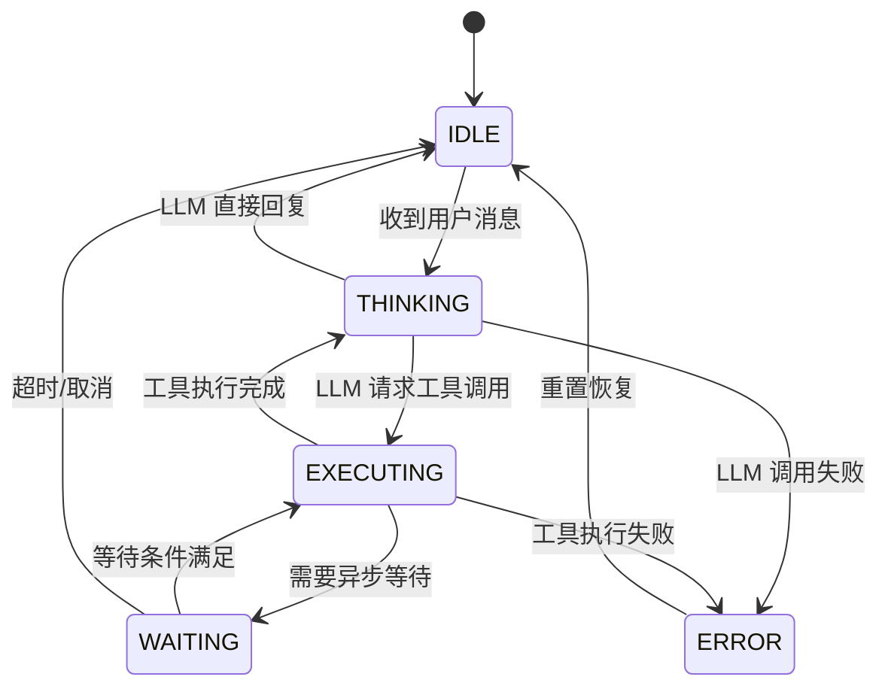
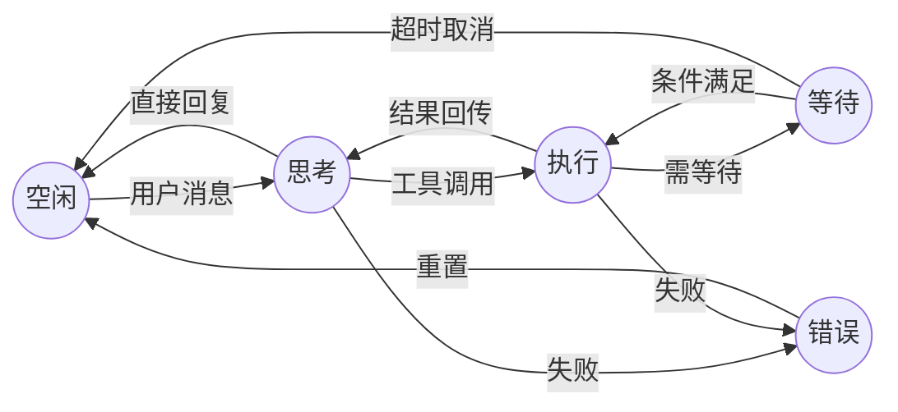

## 引言：为什么 Agent 需要状态管理

随着大语言模型（LLM）驱动的 AI Agent 在企业级应用中的大规模落地，一个看似简单却极其棘手的问题浮出水面：**如何可靠地管理一个 Agent 对话从开始到结束的整个生命周期？**

在早期的原型开发中，很多团队会采用"if-else 大法"来处理 Agent 的行为逻辑——收到用户消息就调 LLM，LLM 返回就执行工具，工具出错就重试。代码写着写着就变成了一团难以维护的意大利面条。当 Agent 需要处理流式输出、多轮工具调用、用户中途取消、网络超时、并发请求等场景时，这种做法几乎必然崩溃。

问题的根源在于：Agent 不是一个简单的请求-响应模型。一个典型的 Agent 对话可能经历"接收消息 → 调用 LLM → LLM 决定调用工具 → 执行工具 → 将工具结果回传 LLM → LLM 继续推理 → 返回最终回复"这样一条多步骤的链路。在这条链路的任意环节，都可能发生超时、异常、用户取消等意外情况。如果没有一个清晰的状态模型，开发者就只能靠各种标志位（`isProcessing`、`isWaiting`、`hasError`）和复杂的条件判断来"模拟"状态，最终代码的复杂度会以 O(n²) 的速度增长。

**状态机（State Machine）** 是解决这类问题的经典方案。它提供了一个清晰的、可预测的模型：Agent 在任意时刻只处于一个明确的状态，状态之间的转换由明确的事件触发，转换规则在设计时就已确定。这种确定性在生产环境中极其宝贵——当凌晨三点收到告警时，你只需要看一眼当前状态就能快速定位问题，而不是去翻阅一堆 if-else 的执行路径。

状态机的另一个核心优势是**防御性编程**。通过定义合法的状态转换矩阵，任何不合法的状态变更都会在第一时间被拦截并抛出异常。这意味着你永远不需要担心"Agent 同时在思考又在执行工具"这种诡异的中间状态。每个状态都是一个明确的、可观察的快照，每个转换都是一个有记录的、可审计的事件。

本文将分享一个在生产环境中验证过的**五态模型**：Idle（空闲）、Thinking（思考）、Executing（执行）、Waiting（等待）、Error（错误），以及围绕它构建的完整技术方案。所有代码示例基于 PHP 8.2+ 和 Laravel 11，但核心思路适用于任何技术栈。

## 五态模型设计：Idle/Thinking/Executing/Waiting/Error 的定义与转换规则

在设计 Agent 状态机时，我们分析了大量生产级 Agent 应用的运行模式，发现绝大多数场景下的生命周期都可以被归纳为五个核心状态。这五个状态涵盖了 Agent 从接收用户输入到返回结果的完整过程，同时也覆盖了等待外部依赖和错误恢复等异常路径。

### 五个状态的详细定义

**IDLE（空闲）** 是 Agent 的初始状态和回归状态。在这个状态下，Agent 正在等待用户输入，没有任何活跃的任务正在执行。数据库连接已就绪，LLM 客户端已初始化，Agent 随时可以接受新的对话请求。这是唯一一个可以安全接收新用户消息的状态。在生产环境中，一个健康的 Agent 系统中，大部分 Agent 实例在大部分时间里都应该处于这个状态。

**THINKING（思考）** 表示 Agent 已经将用户消息发送给 LLM，正在等待 LLM 返回推理结果。在这个状态下，一个或多个 HTTP 请求正在发往 LLM API（如 OpenAI、Claude、本地部署的模型等）。这个状态的典型持续时间从几百毫秒到几十秒不等，取决于模型大小、输入长度、是否使用流式输出等因素。需要注意的是，THINKING 状态可能会被多次进入——当 LLM 返回工具调用请求时，Agent 会先转到 EXECUTING 执行工具，然后带着工具执行结果再次回到 THINKING，让 LLM 继续推理。

**EXECUTING（执行）** 表示 Agent 正在调用外部工具来完成 LLM 指派的任务。这些工具可能是数据库查询、第三方 API 调用、文件系统操作、代码执行等。这个状态的核心特征是：Agent 已经知道要做什么（由 LLM 决定），正在执行具体操作。执行过程可能是同步的（如数据库查询），也可能是异步的（如提交一个长时间运行的任务）。对于异步场景，Agent 会从 EXECUTING 转换到 WAITING 状态。

**WAITING（等待）** 表示 Agent 需要等待某些外部条件满足后才能继续执行。典型的场景包括：等待用户确认一个敏感操作（如删除数据）、等待异步任务的回调（如视频处理完成）、等待第三方系统的审批流程（如支付审批）等。这个状态与其他状态的一个关键区别是：它的持续时间通常不可预测，可能从几秒到几小时甚至几天。因此，WAITING 状态必须配置超时机制，超时后应自动回退到 IDLE 或进入 ERROR 状态。

**ERROR（错误）** 表示发生了不可自动恢复的异常。常见的触发场景包括：LLM API 连续调用失败、工具执行抛出未捕获的异常、数据格式解析错误、系统资源耗尽等。进入 ERROR 状态意味着当前对话的正常流程已被中断。但 ERROR 不是终点——通过设计良好的恢复路径（ERROR → IDLE），Agent 可以在清理上下文后重新开始。

### 状态转换规则矩阵

合法的状态转换路径是状态机的核心约束。以下是完整的转换规则：

- **IDLE → THINKING**：收到用户消息，准备调用 LLM。这是对话的起点。
- **THINKING → IDLE**：LLM 直接返回文本回复，无需调用任何工具，对话回合结束。
- **THINKING → EXECUTING**：LLM 返回了工具调用请求（function calling），Agent 需要执行具体的工具操作。
- **THINKING → ERROR**：LLM 调用失败，可能是网络超时、API 限流（429）、返回格式解析错误等。
- **EXECUTING → THINKING**：工具执行成功，将结果作为上下文回传给 LLM，让 LLM 继续推理。
- **EXECUTING → WAITING**：工具调用触发了一个异步流程，需要等待回调或外部条件满足。
- **EXECUTING → ERROR**：工具执行失败，如 API 返回错误、数据库连接超时等。
- **WAITING → EXECUTING**：等待条件满足（如用户确认、异步回调到达），恢复执行。
- **WAITING → IDLE**：等待超时或用户主动取消，清理等待上下文，回到空闲状态。
- **ERROR → IDLE**：错误恢复完成，清理错误上下文，重新接受用户输入。
- **任意状态 → IDLE**：强制重置（管理员操作或系统看门狗触发），这是一个绕过正常规则的安全阀。

特别注意以下**不允许**的转换，它们是状态机设计中的硬性约束：

- **不允许 IDLE → EXECUTING**：必须先经过 LLM 推理才能决定调用什么工具，跳过思考阶段意味着绕过了 LLM 的决策能力。
- **不允许 ERROR → THINKING / EXECUTING**：必须先重置到 IDLE 状态清理上下文，再重新开始。这确保了每次从错误恢复后都是一个干净的起点。
- **不允许 THINKING → WAITING**：思考阶段不会直接进入等待，必须先经过工具执行才能确定是否需要等待。
- **不允许 WAITING → THINKING**：等待结束后不能直接跳到思考，必须先恢复到执行阶段，由执行结果决定下一步。

## 状态转换图

以下是用 Mermaid 语法绘制的完整状态转换图。这张图可以作为团队沟通和代码审查的核心参考：



从流程视角来看，这五个状态形成了一个清晰的主循环和若干分支路径。主循环是 IDLE → THINKING → EXECUTING → THINKING → IDLE（即 LLM 反复调用工具直到得出最终回复），分支路径则覆盖了等待、错误和各种提前终止的场景。理解这个主循环和分支结构是正确实现状态机的前提。



## PHP 实现：状态机基类 + Agent 状态机具体实现

接下来我们用 PHP 8.2+ 的枚举特性来实现这个五态模型。PHP 8.2 的原生枚举（enum）天生适合表达有限状态集合，配合 match 表达式可以让转换规则既简洁又类型安全。

### 基础枚举定义

枚举中定义了每个状态允许的转换目标列表，这是状态机的核心约束逻辑。通过 `match` 表达式，每个状态与其可转换的目标状态之间的映射关系一目了然。`canTransitionTo` 方法用于快速判断某个转换是否合法，`isTerminal` 方法判断当前状态是否为终态（即本回合对话已结束）。

```php
<?php

declare(strict_types=1);

namespace App\Agent\StateMachine;

enum AgentState: string
{
    case IDLE      = 'idle';
    case THINKING  = 'thinking';
    case EXECUTING = 'executing';
    case WAITING   = 'waiting';
    case ERROR     = 'error';

    /**
     * 获取从当前状态可以转换到的目标状态列表
     */
    public function allowedTransitions(): array
    {
        return match ($this) {
            self::IDLE      => [self::THINKING],
            self::THINKING  => [self::IDLE, self::EXECUTING, self::ERROR],
            self::EXECUTING => [self::THINKING, self::WAITING, self::ERROR],
            self::WAITING   => [self::EXECUTING, self::IDLE],
            self::ERROR     => [self::IDLE],
        };
    }

    public function canTransitionTo(self $target): bool
    {
        return in_array($target, $this->allowedTransitions(), true);
    }

    /**
     * 是否为终态（当前回合结束）
     */
    public function isTerminal(): bool
    {
        return $this === self::IDLE || $this === self::ERROR;
    }
}
```

### 状态机基类

基类封装了状态机的通用逻辑，包括状态转换的核心方法、转换前后的钩子函数、转换日志记录、以及强制重置的安全阀。设计上采用了 Template Method 模式——基类定义算法骨架，子类通过覆盖钩子方法注入具体业务逻辑。

`transition` 方法是整个状态机的心脏。它先验证转换是否合法，然后依次执行"转换前钩子 → 更新状态 → 记录日志 → 转换后钩子"四个步骤。这种严格的顺序保证了每次状态变更都是可追踪、可审计的。

`forceReset` 方法是一个特殊的存在。它绕过所有正常的转换规则，直接将状态重置为 IDLE。这个方法应该仅在两种场景下使用：一是管理员手动干预，二是系统看门狗（watchdog）检测到状态卡死后自动触发。每次强制重置都会在日志中标记 `forced: true`，便于事后审计。

```php
<?php

declare(strict_types=1);

namespace App\Agent\StateMachine;

use App\Agent\Exceptions\InvalidStateTransitionException;
use Illuminate\Support\Facades\Log;

abstract class StateMachine
{
    protected AgentState $currentState;
    protected array $transitionLog = [];

    public function __construct(?AgentState $initialState = null)
    {
        $this->currentState = $initialState ?? $this->defaultState();
    }

    protected function defaultState(): AgentState
    {
        return AgentState::IDLE;
    }

    /**
     * 执行状态转换
     * @throws InvalidStateTransitionException
     */
    public function transition(AgentState $target, array $context = []): void
    {
        $from = $this->currentState;

        if (!$from->canTransitionTo($target)) {
            throw new InvalidStateTransitionException(
                "非法状态转换: {$from->value} → {$target->value}",
                $from,
                $target
            );
        }

        // 转换前钩子
        $this->onBeforeTransition($from, $target, $context);

        $previousState = $this->currentState;
        $this->currentState = $target;

        // 记录转换日志
        $this->logTransition($previousState, $target, $context);

        // 转换后钩子
        $this->onAfterTransition($previousState, $target, $context);

        Log::info('Agent 状态转换', [
            'from'    => $previousState->value,
            'to'      => $target->value,
            'context' => $context,
        ]);
    }

    /**
     * 强制重置到 IDLE（用于异常恢复场景）
     */
    public function forceReset(array $context = []): void
    {
        $previousState = $this->currentState;
        $this->currentState = AgentState::IDLE;

        $this->logTransition($previousState, AgentState::IDLE, array_merge($context, [
            'forced' => true,
        ]));

        Log::warning('Agent 状态强制重置', [
            'from'    => $previousState->value,
            'context' => $context,
        ]);
    }

    public function currentState(): AgentState
    {
        return $this->currentState;
    }

    public function is(AgentState $state): bool
    {
        return $this->currentState === $state;
    }

    public function getTransitionLog(): array
    {
        return $this->transitionLog;
    }

    protected function logTransition(
        AgentState $from,
        AgentState $to,
        array $context
    ): void {
        $this->transitionLog[] = [
            'from'       => $from->value,
            'to'         => $to->value,
            'context'    => $context,
            'timestamp'  => now()->toIso8601String(),
            'microtime'  => microtime(true),
        ];
    }

    // 子类可覆盖的钩子方法
    protected function onBeforeTransition(
        AgentState $from,
        AgentState $to,
        array $context
    ): void {}

    protected function onAfterTransition(
        AgentState $from,
        AgentState $to,
        array $context
    ): void {}
}
```

### Agent 状态机具体实现

子类在基类的基础上，为每一种业务场景提供了语义化的方法名。开发者不需要记住"IDLE → THINKING 应该调用 transition(AgentState::THINKING, ...)"这样的底层细节，而是直接调用 `handleUserMessage()` 这样业务语义清晰的方法。这种封装大大降低了使用状态机的心智负担。

每个业务方法内部都包含了丰富的上下文信息——触发来源（trigger）、相关数据（message、tool_calls、results 等），这些上下文会被记录到转换日志中，为后续的问题排查提供完整的线索。

```php
<?php

declare(strict_types=1);

namespace App\Agent;

use App\Agent\StateMachine\{AgentState, StateMachine};
use App\Events\Agent\{
    AgentStateChanged,
    AgentErrorOccurred,
    AgentRecovered,
};
use Illuminate\Support\Facades\{Cache, Log};

class AgentConversationStateMachine extends StateMachine
{
    public function __construct(
        private readonly string $conversationId,
        ?AgentState $initialState = null,
    ) {
        parent::__construct($initialState);
    }

    /**
     * 处理用户消息 —— 从 IDLE 进入 THINKING
     */
    public function handleUserMessage(string $message, array $metadata = []): void
    {
        $this->transition(AgentState::THINKING, [
            'trigger'  => 'user_message',
            'message'  => $message,
            'metadata' => $metadata,
        ]);
    }

    /**
     * LLM 返回工具调用请求 —— 从 THINKING 进入 EXECUTING
     */
    public function beginToolExecution(array $toolCalls): void
    {
        $this->transition(AgentState::EXECUTING, [
            'trigger'   => 'llm_tool_calls',
            'tool_calls' => $toolCalls,
        ]);
    }

    /**
     * LLM 直接返回文本回复 —— 从 THINKING 回到 IDLE
     */
    public function completeWithTextResponse(string $response): void
    {
        $this->transition(AgentState::IDLE, [
            'trigger'  => 'llm_text_response',
            'response' => $response,
        ]);
    }

    /**
     * 工具执行完成，将结果回传 LLM —— 从 EXECUTING 回到 THINKING
     */
    public function toolExecutionComplete(array $results): void
    {
        $this->transition(AgentState::THINKING, [
            'trigger' => 'tool_execution_complete',
            'results' => $results,
        ]);
    }

    /**
     * 需要等待异步结果 —— 从 EXECUTING 进入 WAITING
     */
    public function enterWaitingState(string $waitReason, ?int $ttlSeconds = null): void
    {
        $this->transition(AgentState::WAITING, [
            'trigger'     => 'async_wait',
            'wait_reason' => $waitReason,
            'ttl_seconds' => $ttlSeconds,
        ]);

        // 设置超时自动回退
        if ($ttlSeconds !== null) {
            Cache::put(
                "agent:wait_timeout:{$this->conversationId}",
                true,
                $ttlSeconds
            );
        }
    }

    /**
     * 等待条件满足，恢复执行 —— 从 WAITING 回到 EXECUTING
     */
    public function resumeExecution(array $callbackData = []): void
    {
        $this->transition(AgentState::EXECUTING, [
            'trigger'       => 'wait_resolved',
            'callback_data' => $callbackData,
        ]);

        Cache::forget("agent:wait_timeout:{$this->conversationId}");
    }

    /**
     * 发生错误 —— 进入 ERROR 状态
     */
    public function reportError(
        \Throwable $exception,
        array $context = []
    ): void {
        $this->transition(AgentState::ERROR, [
            'trigger'      => 'error',
            'error_class'  => get_class($exception),
            'error_message' => $exception->getMessage(),
            'error_code'   => $exception->getCode(),
            'context'      => $context,
        ]);
    }

    /**
     * 从错误恢复 —— 从 ERROR 回到 IDLE
     */
    public function recover(): void
    {
        $this->transition(AgentState::IDLE, [
            'trigger' => 'manual_recovery',
        ]);
    }

    // === 钩子实现 ===

    protected function onAfterTransition(
        AgentState $from,
        AgentState $to,
        array $context
    ): void {
        // 广播状态变更事件
        event(new AgentStateChanged(
            $this->conversationId,
            $from,
            $to,
            $context
        ));

        // 特殊事件处理
        if ($to === AgentState::ERROR) {
            event(new AgentErrorOccurred(
                $this->conversationId,
                $context['error_message'] ?? 'Unknown error',
                $context
            ));
        }

        if ($from === AgentState::ERROR && $to === AgentState::IDLE) {
            event(new AgentRecovered($this->conversationId));
        }
    }
}
```

## Laravel 集成：用 Enum + match 表达式实现状态流转

Laravel 11 对 PHP 8.2 枚举的支持非常成熟。我们可以利用 Eloquent 的 Cast 机制将数据库中的字符串字段自动转换为枚举类型，配合 `match` 表达式实现类型安全的状态流转逻辑。这种方案的优势在于：状态约束逻辑集中在枚举定义中，业务层代码只需要调用语义化的方法，不需要关心底层的转换规则。

### 与 Eloquent 模型集成

模型中定义了三个与状态相关的关键方法：`stateLabel` 返回人类可读的状态描述（适合在管理后台展示），`canAcceptMessage` 判断当前是否可以接受新消息（用于 API 层的请求验证），`availableActions` 返回当前状态下用户可以执行的操作列表（给前端动态渲染按钮）。

```php
<?php

declare(strict_types=1);

namespace App\Models;

use App\Agent\StateMachine\AgentState;
use Illuminate\Database\Eloquent\{Model, Concerns\HasUuids};
use Illuminate\Database\Eloquent\Casts\Attribute;

class AgentConversation extends Model
{
    use HasUuids;

    protected $fillable = [
        'user_id',
        'state',
        'context',
        'retry_count',
        'last_error',
        'version',  // 乐观锁版本号
    ];

    protected $casts = [
        'state'      => AgentState::class,
        'context'    => 'array',
        'last_error' => 'array',
    ];

    /**
     * 状态属性的访问器 —— 确保类型安全
     */
    protected function state(): Attribute
    {
        return Attribute::make(
            get: fn (?string $value) => $value
                ? AgentState::from($value)
                : AgentState::IDLE,
            set: fn (AgentState $value) => $value->value,
        );
    }

    /**
     * 获取人类可读的状态描述
     */
    public function stateLabel(): string
    {
        return match ($this->state) {
            AgentState::IDLE      => '🟢 空闲',
            AgentState::THINKING  => '🟡 思考中',
            AgentState::EXECUTING => '🔵 执行中',
            AgentState::WAITING   => '🟠 等待中',
            AgentState::ERROR     => '🔴 错误',
        };
    }

    /**
     * 判断是否可以接受新的用户消息
     */
    public function canAcceptMessage(): bool
    {
        return match ($this->state) {
            AgentState::IDLE   => true,
            AgentState::ERROR  => true,  // 允许在错误状态下发新消息触发恢复
            default            => false,
        };
    }

    /**
     * 获取当前状态允许的操作列表（给前端用）
     */
    public function availableActions(): array
    {
        return match ($this->state) {
            AgentState::IDLE      => ['send_message'],
            AgentState::THINKING  => ['cancel', 'force_reset'],
            AgentState::EXECUTING => ['cancel', 'force_reset'],
            AgentState::WAITING   => ['resume', 'cancel', 'force_reset'],
            AgentState::ERROR     => ['retry', 'reset', 'send_message'],
        };
    }
}
```

### 使用 Cast 自动序列化状态

自定义 Cast 类可以在数据进出数据库时自动完成枚举与字符串之间的转换，避免在业务代码中到处出现 `AgentState::from($value)` 这样的样板代码。

```php
<?php

declare(strict_types=1);

namespace App\Casts;

use App\Agent\StateMachine\AgentState;
use Illuminate\Contracts\Database\CastsAttributes;

class AgentStateCast implements CastsAttributes
{
    public function get($model, string $key, $value, array $attributes): AgentState
    {
        return AgentState::from($value);
    }

    public function set($model, string $key, $value, array $attributes): string
    {
        if ($value instanceof AgentState) {
            return $value->value;
        }

        return AgentState::from($value)->value;
    }
}
```

## 事件驱动的状态转换：与 Laravel Events 结合

将状态转换与 Laravel 的事件系统深度整合，是实现松耦合架构的关键。状态机本身只负责"何时转换"和"如何转换"的决策，而"转换之后应该做什么"则完全交给事件监听器去处理。这种分离让状态机保持了纯粹性，也让后续的业务扩展变得非常灵活。

例如，当状态从 THINKING 转到 ERROR 时，可能需要同时触发以下操作：更新数据库记录、发送告警通知运维团队、记录 Prometheus 指标、通过 WebSocket 通知前端更新 UI。如果把这些逻辑都塞进状态机的转换方法里，代码很快就会膨胀到不可维护的程度。通过事件机制，每个后续操作都是一个独立的、可测试的监听器。

### 定义事件类

```php
<?php

declare(strict_types=1);

namespace App\Events\Agent;

use App\Agent\StateMachine\AgentState;
use Illuminate\Foundation\Events\Dispatchable;
use Illuminate\Broadcasting\{InteractsWithSockets, PrivateChannel};

class AgentStateChanged
{
    use Dispatchable, InteractsWithSockets;

    public function __construct(
        public readonly string $conversationId,
        public readonly AgentState $from,
        public readonly AgentState $to,
        public readonly array $context,
    ) {}

    public function broadcastOn(): array
    {
        return [
            new PrivateChannel("agent.{$this->conversationId}"),
        ];
    }
}
```

### 监听器实现

状态同步监听器负责将内存中的状态变更持久化到数据库，并同时更新 Prometheus 指标。错误告警监听器则实现了连续错误计数和阈值告警的逻辑——只有当同一对话连续出现多次错误时才触发告警，避免了偶发错误导致的告警风暴。

```php
<?php

declare(strict_types=1);

namespace App\Listeners\Agent;

use App\Agent\StateMachine\AgentState;
use App\Events\Agent\AgentStateChanged;
use App\Models\AgentConversation;
use App\Services\Monitoring\MetricsCollector;
use Illuminate\Contracts\Queue\ShouldQueue;

class SyncConversationState implements ShouldQueue
{
    public function __construct(
        private readonly MetricsCollector $metrics,
    ) {}

    public function handle(AgentStateChanged $event): void
    {
        $conversation = AgentConversation::find($event->conversationId);
        if (!$conversation) {
            return;
        }

        $conversation->update([
            'state' => $event->to,
        ]);

        // 记录 Prometheus 指标
        $this->metrics->increment('agent_state_transitions_total', [
            'from' => $event->from->value,
            'to'   => $event->to->value,
        ]);

        // 记录状态持续时间
        $this->metrics->histogram('agent_state_duration_seconds', [
            'state' => $event->from->value,
        ]);
    }
}
```

```php
<?php

declare(strict_types=1);

namespace App\Listeners\Agent;

use App\Events\Agent\AgentErrorOccurred;
use Illuminate\Contracts\Queue\ShouldQueue;
use Illuminate\Support\Facades\{Notification, Log};

class AlertOnAgentError implements ShouldQueue
{
    public function handle(AgentErrorOccurred $event): void
    {
        Log::error('Agent 进入错误状态', [
            'conversation_id' => $event->conversationId,
            'error'           => $event->errorMessage,
            'context'         => $event->context,
        ]);

        // 连续错误超过阈值时告警
        $recentErrors = cache()->get(
            "agent:error_count:{$event->conversationId}", 0
        );
        cache()->put(
            "agent:error_count:{$event->conversationId}",
            $recentErrors + 1,
            300
        );

        if ($recentErrors + 1 >= 3) {
            // 发送告警通知给运维团队
            // Notification::send(...);
        }
    }
}
```

## 并发场景下的状态保护：乐观锁、悲观锁、Redis 分布式锁

并发是状态机在生产环境中最大的敌人。想象一个场景：用户快速连续发送两条消息，两条消息的处理请求几乎同时到达服务器，两个进程同时读到数据库中状态为 IDLE，都成功通过了 `canTransitionTo(THINKING)` 的校验，都尝试将状态更新为 THINKING。结果就是：两条消息都认为自己成功了，但实际上状态机只能处理一个。更糟糕的是，后续的工具调用和 LLM 回复可能互相覆盖，导致对话内容混乱。

并发保护的核心思想是：**确保同一个对话在同一时刻只有一个状态转换在进行**。下面介绍三种常用的方案，各有适用场景。

### 方案一：乐观锁（推荐，适用于大多数场景）

乐观锁的核心思想是"先更新，后验证"。数据库表中维护一个 `version` 字段，每次更新时使用 CAS（Compare-And-Swap）操作：只有当 version 与读取时一致时才执行更新。如果更新影响的行数为 0，说明在读取和写入之间有其他进程修改了这条记录，此时进入重试逻辑。乐观锁的优势在于不需要长时间持有数据库锁，适合冲突率较低的场景。

```php
<?php

declare(strict_types=1);

namespace App\Agent\Concurrency;

use App\Agent\Exceptions\ConcurrentModificationException;
use App\Models\AgentConversation;
use App\Agent\StateMachine\AgentState;

class OptimisticLockGuard
{
    /**
     * 使用乐观锁执行状态转换
     * 通过 version 字段检测并发冲突
     */
    public static function execute(
        string $conversationId,
        AgentState $targetState,
        callable $operation,
        int $maxRetries = 3,
    ): mixed {
        for ($attempt = 0; $attempt < $maxRetries; $attempt++) {
            $conversation = AgentConversation::findOrFail($conversationId);
            $currentVersion = $conversation->version;

            if (!$conversation->state->canTransitionTo($targetState)) {
                throw new ConcurrentModificationException(
                    "状态已被其他进程修改: 当前={$conversation->state->value}, " .
                    "目标={$targetState->value}"
                );
            }

            $result = $operation($conversation);

            // CAS（Compare-And-Swap）更新
            $affected = AgentConversation::where('id', $conversationId)
                ->where('version', $currentVersion)
                ->update([
                    'state'   => $targetState,
                    'version' => $currentVersion + 1,
                ]);

            if ($affected === 1) {
                return $result;
            }

            // 更新失败，说明有并发修改，随机退避后重试
            usleep(random_int(10000, 50000));
        }

        throw new ConcurrentModificationException(
            "乐观锁重试 {$maxRetries} 次后仍然失败"
        );
    }
}
```

### 方案二：Redis 分布式锁（适用于多服务器部署）

当 Agent 服务部署在多台服务器上时，数据库层面的乐观锁仍然有效，但有些场景需要更严格的操作互斥。Redis 分布式锁可以在多台服务器之间建立全局的互斥区域，确保同一对话的状态转换完全串行化。

使用分布式锁时有两个关键细节需要特别注意：一是锁的 value 必须是随机生成的唯一标识，释放锁时要通过 Lua 脚本验证 value 一致后再删除，防止误删其他进程持有的锁；二是必须在 finally 块中释放锁，避免异常导致死锁。

```php
<?php

declare(strict_types=1);

namespace App\Agent\Concurrency;

use App\Agent\StateMachine\AgentState;
use Illuminate\Support\Facades\Redis;
use App\Agent\Exceptions\LockAcquisitionException;

class DistributedStateLock
{
    private const LOCK_PREFIX  = 'agent:state_lock:';
    private const LOCK_TTL     = 10; // 秒

    public static function withLock(
        string $conversationId,
        callable $operation,
        float $acquireTimeout = 5.0,
    ): mixed {
        $lockKey = self::LOCK_PREFIX . $conversationId;
        $lockValue = uniqid('lock_', true);

        $acquired = self::acquireLock($lockKey, $lockValue, $acquireTimeout);

        if (!$acquired) {
            throw new LockAcquisitionException(
                "无法获取状态锁: conversation={$conversationId}"
            );
        }

        try {
            return $operation();
        } finally {
            self::releaseLock($lockKey, $lockValue);
        }
    }

    private static function acquireLock(
        string $key,
        string $value,
        float $timeout
    ): bool {
        $start = microtime(true);

        do {
            // SET NX EX 原子操作
            $result = Redis::command('SET', [
                $key, $value, 'NX', 'EX', self::LOCK_TTL
            ]);

            if ($result === 'OK') {
                return true;
            }

            usleep(10000); // 10ms 轮询
        } while ((microtime(true) - $start) < $timeout);

        return false;
    }

    private static function releaseLock(string $key, string $value): void
    {
        // Lua 脚本确保只删除自己加的锁
        $script = <<<'LUA'
            if redis.call("get", KEYS[1]) == ARGV[1] then
                return redis.call("del", KEYS[1])
            else
                return 0
            end
        LUA;

        Redis::eval($script, 1, $key, $value);
    }
}
```

### 方案三：悲观锁（适用于高冲突场景）

悲观锁通过 `SELECT ... FOR UPDATE` 在数据库层面直接锁定行，确保在事务提交之前其他事务无法修改同一行。这种方式的优势是实现简单、绝对可靠，代价是会降低并发吞吐量。适用于冲突率很高、但总并发量不大的场景（如管理后台的人工审批操作）。

## 状态持久化：数据库存储 vs Redis vs Event Sourcing

状态数据的持久化策略直接影响系统的可靠性和可恢复性。在生产环境中，选择合适的持久化方案需要综合考虑一致性要求、性能需求、运维成本等多个维度。

**数据库存储**是最传统也最可靠的方案。将当前状态存储在 MySQL 或 PostgreSQL 的字段中，借助数据库的 ACID 事务保证数据一致性。优势是运维简单、查询能力强（可以方便地按状态筛选、统计、JOIN），劣势是高并发下的写入性能受限于数据库的吞吐量。适用于大多数中等规模的 Agent 应用。

**Redis 缓存**适合对读取性能有极致要求的场景。将状态数据缓存在 Redis 中，读取延迟可以降到亚毫秒级。但 Redis 的持久化机制（RDB 快照和 AOF 追加日志）在极端情况下可能丢失最近几秒的数据。如果 Agent 的状态变更非常频繁，需要权衡数据丢失的风险。

**Event Sourcing（事件溯源）** 是一种更高级的持久化范式。它不存储"当前状态"，而是存储所有导致状态变更的事件。当前状态通过重放事件流来重建。这种方案的核心优势是：完整的事件历史天然构成了审计日志，可以追溯 Agent 在每个决策节点的行为；同时支持"时间旅行"——可以重建任意历史时刻的 Agent 状态。代价是实现复杂度较高，查询当前状态需要重放事件（或维护投影表）。

**推荐方案**是 MySQL + Redis 二级缓存：写入时先写 MySQL 再更新 Redis，读取时优先读 Redis、回退到 MySQL。这兼顾了数据可靠性和读取性能。对于有审计要求的场景，在二级缓存的基础上叠加 Event Sourcing 记录事件流。

## 可观测性：状态转换日志、Metrics 指标、Grafana Dashboard

生产环境中的状态机必须是完全可观测的。当线上出现问题时，运维团队需要能在最短时间内回答以下问题：当前有多少个 Agent 处于错误状态？最近五分钟内有多少次从 THINKING 到 ERROR 的转换？哪个 Agent 在 THINKING 状态停留超过了一分钟？这些问题的答案直接决定了故障排查的效率。

### 结构化日志

每一次状态转换都应该输出一条结构化的 JSON 日志。日志中包含对话 ID、源状态、目标状态、触发上下文、持续时间、主机名、进程 ID 等字段。这些字段使得日志可以通过 ELK 或 Loki 进行高效的检索和聚合分析。特别重要的是，状态转换到 ERROR 时应该使用 error 级别，状态持续时间异常时使用 warning 级别，这样告警规则可以直接基于日志级别配置。

```php
<?php

declare(strict_types=1);

namespace App\Agent\Observability;

use App\Agent\StateMachine\AgentState;
use Illuminate\Support\Facades\Log;

class StateTransitionLogger
{
    public static function log(
        string $conversationId,
        AgentState $from,
        AgentState $to,
        array $context,
        float $durationMs = 0,
    ): void {
        $level = match (true) {
            $to === AgentState::ERROR => 'error',
            $durationMs > 30000      => 'warning',
            default                  => 'info',
        };

        Log::channel('agent_states')->log($level, 'state_transition', [
            'conversation_id'  => $conversationId,
            'from'             => $from->value,
            'to'               => $to->value,
            'context'          => $context,
            'duration_ms'      => $durationMs,
            'hostname'         => gethostname(),
            'process_id'       => getmypid(),
        ]);
    }
}
```

### Grafana Dashboard 关键面板

在 Grafana 中建议配置以下几个关键面板，形成 Agent 状态机的核心监控仪表盘：

**状态分布面板**实时展示当前各状态的 Agent 数量。正常情况下，绝大多数 Agent 应该处于 IDLE 状态。如果 THINKING 或 EXECUTING 状态的数量异常偏高，可能意味着 LLM API 或工具服务出现了延迟问题。

**转换速率面板**展示每秒的状态转换次数，按转换类型分组。这个面板可以帮助识别流量模式和异常峰值。例如，如果 IDLE → THINKING 的速率突然飙升但 THINKING → IDLE 的速率没有同步增长，说明有大量请求积压在 LLM 调用环节。

**错误趋势面板**单独监控 ERROR 状态的数量和 ERROR → IDLE 的恢复速率。如果错误数量持续增长而恢复速率没有跟上，需要立即介入排查。

**状态持续时间面板**使用直方图展示每个状态的停留时间分布，重点关注 P99 值。如果某个状态的 P99 持续时间超过了预期的超时阈值，说明存在潜在的状态卡死问题。

**卡死告警规则**是整个监控体系的安全网。当某个 Agent 在非 IDLE 状态停留超过预设阈值（如 5 分钟）时，自动触发告警并通知运维团队。这条规则可以在很多潜在问题变成用户可感知的故障之前提前发现它们。

## 高级模式：嵌套状态机、超时处理、自动降级

### 嵌套状态机：工具执行的内部状态

EXECUTING 状态在实际业务中并不是一个原子操作。一个工具调用可能经历"准备参数 → 调用第三方 API → 处理响应 → 格式化结果"等多个子步骤。当工具执行失败时，需要知道是哪个子步骤出了问题才能做出正确的重试决策。嵌套状态机就是解决这个问题的标准方案。

在父状态机的 EXECUTING 状态内部，引入一个子状态机来管理工具执行的微观生命周期。子状态机的状态变更不会影响父状态机——父状态机看到的始终是 EXECUTING，只有当子状态机到达终态（SUCCESS 或 FAILED）时，父状态机才会根据结果决定下一步转换到 THINKING 还是 ERROR。这种分层设计让每一层的状态机都保持了合理的复杂度。

### 超时处理

超时是防止状态卡死的最后一道防线。建议为 THINKING、EXECUTING、WAITING 三个非终态分别配置超时时间：THINKING 通常设置 1-2 分钟（取决于 LLM 的响应速度），EXECUTING 设置 3-5 分钟（考虑工具调用可能涉及的网络延迟），WAITING 设置较长的超时（如 1 小时，因为等待用户确认或异步回调可能需要更长时间）。

超时检测可以通过 Laravel 的 Scheduler 定期执行一个检查任务来实现。这个任务扫描所有处于非 IDLE 状态且 `updated_at` 超过阈值的对话记录，对它们执行自动重置。重置时需要记录详细的日志，便于事后分析是正常超时还是系统故障。

### 自动降级策略

当一个 Agent 反复进入错误状态时（如同一对话在 5 分钟内出现 3 次以上错误），继续尝试完整的 Agent 流程已经没有意义。此时应该触发自动降级：将 Agent 切换到一个简化的回复模式，直接使用预设的模板回复用户，同时告知用户当前系统正在经历技术问题。这种降级策略的关键在于"优雅地失败"——与其让 Agent 在错误状态中反复挣扎，不如主动承认问题并提供一个可用的（虽然功能有限的）替代方案。

## 生产踩坑记录：状态卡死、并发竞态、回滚策略

以下是生产环境中常见的几个问题及其解决方案。这些坑几乎每个团队在将 Agent 状态机推上生产时都会遇到，提前了解可以避免走弯路。

### 踩坑一：状态卡死

**现象**：Agent 长时间停在 THINKING 或 EXECUTING 状态，既不前进也不超时，前端一直显示"思考中"。

**根因分析**：最常见的原因是 LLM API 的 HTTP 请求没有设置超时参数。当 LLM 服务出现性能问题时，请求会一直挂起，既不会成功也不会失败。另一种常见原因是工具调用的目标服务不可达，TCP 连接的默认超时可能是几分钟甚至更长。

**解决方案**：首先，确保所有 HTTP 请求都设置了合理的超时（建议 LLM 调用 60 秒，工具调用 30 秒）。其次，部署一个看门狗进程，定期扫描长时间停留在非终态的对话记录，对超时的记录执行自动重置。看门狗的检查间隔建议为 1 分钟，这样在最坏情况下，一个卡死的 Agent 也会在超时阈值加 1 分钟内被自动恢复。

### 踩坑二：并发竞态条件

**现象**：同一对话的两条消息几乎同时到达，数据库中状态字段的值变成了 THINKING，但两条消息的处理逻辑都在执行，导致 LLM 被调用了两次，返回了两个不同的回复。

**根因分析**：状态检查和状态更新不是原子操作。两个进程在同一个时间窗口内都读到了 IDLE 状态，都通过了校验，都执行了更新。

**解决方案**：在对话处理的入口处统一加分布式锁，锁的粒度是 conversationId。这确保了同一个对话的所有操作都是串行化的。锁的超时时间要大于单次处理的最大时长，但也不能太长（防止异常时死锁），建议设置为单次处理最大时长的 2-3 倍。同时配合乐观锁作为第二道防线——即使分布式锁因 Redis 故障而失效，乐观锁也能在数据库层面拦截冲突。

### 踩坑三：错误恢复的上下文丢失

**现象**：从 ERROR 状态恢复后，Agent 丢失了之前的对话历史，开始了一个全新的对话，用户需要重新描述问题。

**根因分析**：进入 ERROR 状态时没有保存对话上下文的快照。恢复时状态虽然回到了 IDLE，但 LLM 的消息历史、工具调用的中间结果等关键上下文已经丢失。

**解决方案**：在状态机的 `onBeforeTransition` 钩子中，当目标状态为 ERROR 时，自动创建当前对话上下文的快照并持久化到数据库。恢复时，先从快照中恢复上下文，再执行状态重置。这样用户在错误恢复后可以无缝继续之前的对话。需要注意的是，快照的存储要控制大小，避免将过多的历史消息都保存下来——通常保存最近 10-20 条消息就足够了。

### 踩坑四：测试策略

状态机的正确性至关重要。一个在生产环境中状态转换出错的 Agent 可能导致对话数据错乱、用户体验崩溃、甚至安全风险。因此，状态机的测试覆盖率应该达到 100%——不仅每个合法的转换路径要有测试，每个非法的转换路径也要有测试（验证它们确实会抛出异常）。

测试中还应该覆盖边界场景：并发转换测试（模拟两个进程同时触发状态转换）、强制重置测试（从任意状态验证可以回到 IDLE）、转换日志完整性测试（验证每次转换都有完整的日志记录）。

```php
<?php

declare(strict_types=1);

namespace Tests\Unit\Agent;

use App\Agent\AgentConversationStateMachine;
use App\Agent\Exceptions\InvalidStateTransitionException;
use App\Agent\StateMachine\AgentState;
use Tests\TestCase;

class AgentConversationStateMachineTest extends TestCase
{
    private AgentConversationStateMachine $sm;

    protected function setUp(): void
    {
        parent::setUp();
        $this->sm = new AgentConversationStateMachine('test-conv-001');
    }

    /** @test */
    public function it_starts_in_idle_state(): void
    {
        $this->assertTrue($this->sm->is(AgentState::IDLE));
    }

    /** @test */
    public function it_transitions_from_idle_to_thinking_on_message(): void
    {
        $this->sm->handleUserMessage('你好');
        $this->assertTrue($this->sm->is(AgentState::THINKING));
    }

    /** @test */
    public function it_rejects_direct_idle_to_executing_transition(): void
    {
        $this->expectException(InvalidStateTransitionException::class);
        $this->sm->beginToolExecution(['search' => 'test']);
    }

    /** @test */
    public function it_can_force_reset_from_any_state(): void
    {
        $this->sm->handleUserMessage('test');
        $this->sm->reportError(new \RuntimeException());
        $this->sm->forceReset();
        $this->assertTrue($this->sm->is(AgentState::IDLE));
    }

    /** @test */
    public function it_tracks_transition_log(): void
    {
        $this->sm->handleUserMessage('hi');
        $this->sm->completeWithTextResponse('Hello!');

        $log = $this->sm->getTransitionLog();
        $this->assertCount(2, $log);
        $this->assertEquals('idle', $log[0]['from']);
        $this->assertEquals('thinking', $log[0]['to']);
    }
}
```

## 总结与最佳实践

经过对五态模型在生产环境中的实践，以下是经过验证的最佳实践总结。

**设计层面的核心原则**：状态数量要克制，五态已经能覆盖绝大多数 Agent 场景，除非有明确需求否则不要引入第六个状态——每个新增状态都会指数级增加转换矩阵的复杂度和测试用例的数量。转换方向要尽量单一化，让状态形成清晰的主循环和分支路径。非法转换必须抛出异常，永远不要 silently ignore，宁可中断一次对话也不要让状态机进入不可预测的状态。

**工程层面的实践建议**：乐观锁是并发保护的默认选择，除非冲突率超过 10% 否则不需要升级到悲观锁或分布式锁。每个非终态都必须配置超时机制，这是防止状态卡死的最后一道防线。ERROR 状态不是终点，配合快照机制可以实现优雅的错误恢复。强制重置是安全阀，要限制调用权限并记录审计日志。

**运维层面的关键要素**：可观测性不是"有了更好"而是生产环境的必需品——结构化的状态转换日志、Prometheus 指标、Grafana 面板和告警规则，这些是定位线上问题的基础设施。Event Sourcing 适合有高审计要求的场景，但要接受它带来的实现复杂度。

五态模型虽然简单，但它提供了一个坚实的架构基础。随着业务的演进，你可以在此基础上扩展嵌套状态机、引入并行状态（如同时执行多个工具调用）、甚至构建多 Agent 协作的状态编排系统。但核心永远不变：**让状态可定义、可追踪、可预测、可恢复**。

---

*本文所述方案基于 PHP 8.2+ / Laravel 11，核心思路可应用于 Python、TypeScript、Go 等任何技术栈。状态机作为一种经典的软件工程模式，在 AI Agent 架构中正焕发出新的生命力。*

## 相关阅读

- [AI Agent 编排模式实战：ReAct/Plan-and-Execute/Multi-Agent 协作架构设计](/AI/2026-05-31-ai-agent-orchestration-patterns-react-plan-execute-multi-agent/)
- [LangGraph 实战：有状态的 AI Agent 图编排——条件路由、循环与人机协作节点](/AI/2026-06-02-langgraph-stateful-agent-graph-orchestration/)
- [AI Agent Long-Running Tasks 实战：持久化状态、断点恢复、人机审批节点——生产级 Agent 的长时间运行任务编排](/AI/2026-06-05-ai-agent-long-running-tasks-durable-state-checkpoint-human-approval/)
