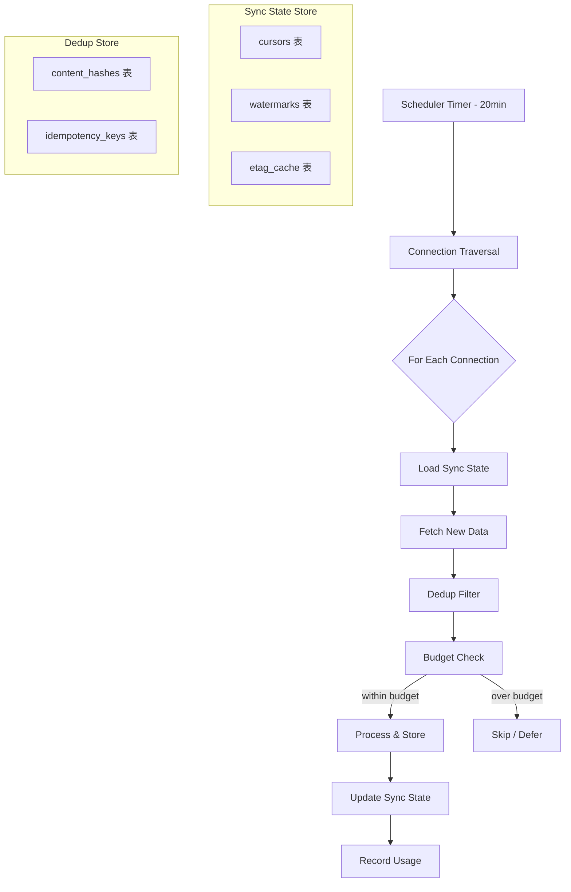
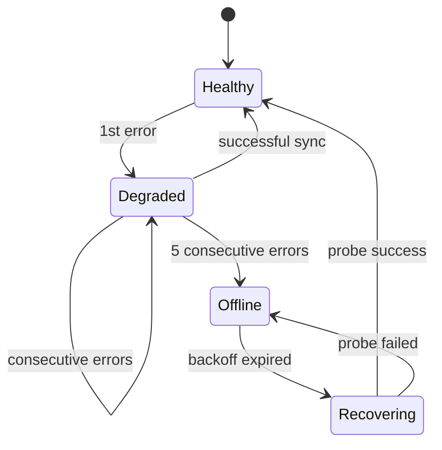

## 前言

一个 AI Agent 的价值很大程度上取决于它能获取多少上下文信息。如果 Agent 只在用户主动提问时才工作，它就只是一个聊天机器人。真正的 Agent 应该像一个勤奋的助手——主动收集信息、追踪变化、在需要时提供洞察。

OpenHuman 的 AutoFetch 调度器就是这样一个"信息收集引擎"。它每 20 分钟遍历用户配置的所有连接（Gmail、Slack、GitHub、Notion 等），同步新数据，去重，并在预算范围内高效运行。本文将深入剖析这个系统的设计与实现。

---

## 一、AutoFetch 的整体架构



### 1.1 核心配置

```yaml
autofetch:
  enabled: true
  interval_minutes: 20
  max_connections_per_cycle: 10
  max_items_per_connection: 100
  timeout_per_connection_seconds: 60
  
  budget:
    daily_api_calls: 10000
    daily_tokens: 500000
    daily_cost_usd: 5.00
    warning_threshold: 0.8
    pause_threshold: 0.95
    
  dedup:
    strategy: "hybrid"  # hash | idempotency | hybrid
    hash_window_hours: 48
    idempotency_window_hours: 168  # 7 天
    
  connections:
    gmail:
      enabled: true
      priority: 1
      max_items: 50
    slack:
      enabled: true
      priority: 2
      max_items: 100
    github:
      enabled: true
      priority: 3
      max_items: 30
    notion:
      enabled: false
      priority: 4
```

---

## 二、连接遍历（Connection Traversal）

### 2.1 连接注册表

OpenHuman 使用统一的连接接口管理所有数据源：

```typescript
interface Connection {
  id: string;
  type: ConnectionType;      // gmail | slack | github | notion | rss | ...
  name: string;
  enabled: boolean;
  priority: number;          // 越小越优先
  config: ConnectionConfig;  // 各类型的特定配置
  lastSyncAt: number;        // 上次同步时间
  errorCount: number;        // 连续错误次数
}

interface ConnectionConfig {
  // Gmail
  emailAddress?: string;
  labelFilter?: string[];
  
  // Slack
  workspaceId?: string;
  channelFilter?: string[];
  
  // GitHub
  owner?: string;
  repos?: string[];
  eventTypes?: string[];
  
  // 通用
  rateLimit?: number;        // 每分钟最大请求数
  timeout?: number;          // 单次请求超时
}
```

### 2.2 遍历调度策略

AutoFetch 在每个周期内按优先级遍历连接，但不会无限制地拉取：

```typescript
class ConnectionTraversal {
  private connections: Connection[];
  private budgetTracker: BudgetTracker;
  private syncStateStore: SyncStateStore;
  
  async traverse(): Promise<TraversalReport> {
    const report = new TraversalReport();
    
    // 按优先级排序
    const sorted = this.connections
      .filter(c => c.enabled)
      .sort((a, b) => a.priority - b.priority);
    
    // 限制每周期的连接数
    const toProcess = sorted.slice(0, this.config.maxConnectionsPerCycle);
    
    for (const connection of toProcess) {
      // 检查预算
      if (!this.budgetTracker.canAffordConnection(connection.type)) {
        report.skipped(connection, 'budget_exceeded');
        continue;
      }
      
      // 检查错误退避
      if (connection.errorCount > 0) {
        const backoff = this.calculateBackoff(connection.errorCount);
        if (Date.now() - connection.lastSyncAt < backoff) {
          report.skipped(connection, 'error_backoff');
          continue;
        }
      }
      
      try {
        const result = await this.syncConnection(connection);
        report.completed(connection, result);
        connection.errorCount = 0;
      } catch (error) {
        connection.errorCount++;
        report.failed(connection, error);
      }
    }
    
    return report;
  }
  
  private calculateBackoff(errorCount: number): number {
    // 指数退避：5min, 10min, 20min, 40min, 80min（上限）
    return Math.min(5 * 60 * 1000 * Math.pow(2, errorCount - 1), 80 * 60 * 1000);
  }
}
```

### 2.3 连接同步流程

每个连接的同步遵循统一的流程：

```typescript
async syncConnection(connection: Connection): Promise<SyncResult> {
  // 1. 加载上次同步状态
  const syncState = await this.syncStateStore.load(connection.id);
  
  // 2. 获取适配器
  const adapter = this.adapterRegistry.getAdapter(connection.type);
  
  // 3. 拉取新数据
  const fetchResult = await adapter.fetch({
    config: connection.config,
    syncState,
    maxItems: connection.config.maxItems || this.config.maxItemsPerConnection,
    signal: this.createTimeoutSignal(this.config.timeoutPerConnectionSeconds),
  });
  
  // 4. 去重
  const deduped = await this.dedupFilter.filter(fetchResult.items);
  
  // 5. 处理和存储
  const processed = await this.processItems(deduped, connection);
  
  // 6. 更新同步状态
  await this.syncStateStore.save(connection.id, fetchResult.newSyncState);
  
  // 7. 记录用量
  this.budgetTracker.recordUsage(connection.type, {
    apiCalls: fetchResult.apiCallCount,
    tokens: fetchResult.tokenUsage,
  });
  
  return {
    fetched: fetchResult.items.length,
    deduped: fetchResult.items.length - deduped.length,
    processed: processed.length,
    syncState: fetchResult.newSyncState,
  };
}
```

---

## 三、Sync State 管理

### 3.1 什么是 Sync State

Sync State 记录了每个连接"同步到哪里了"。不同的数据源使用不同的同步机制，OpenHuman 抽象了三种同步状态模型：

```typescript
// 增量游标（Cursor-based）
interface CursorSyncState {
  type: 'cursor';
  cursor: string;           // API 返回的分页游标
  lastItemId?: string;      // 最后处理的项目 ID
  lastTimestamp?: number;   // 最后处理的时间戳
}

// 水位线（Watermark-based）
interface WatermarkSyncState {
  type: 'watermark';
  highWaterMark: number;    // 最高时间戳
  processedIds: string[];   // 已处理的 ID 列表（用于处理同时间戳的情况）
}

// ETag 缓存（Conditional GET）
interface ETagSyncState {
  type: 'etag';
  etag: string;             // HTTP ETag
  lastModified: string;     // Last-Modified 头
  contentHash?: string;     // 内容哈希（用于无 ETag 的资源）
}
```

### 3.2 各数据源的同步策略

| 数据源 | 同步方式 | 状态字段 | 增量机制 |
|--------|----------|----------|----------|
| Gmail | Cursor | historyId | 使用 history.list API 获取增量 |
| Slack | Cursor + Timestamp | oldest (ts) | conversations.history + oldest 参数 |
| GitHub | Timestamp | last_updated | notifications API + since 参数 |
| RSS | ETag + Last-Modified | etag, lastModified | HTTP 条件请求 |
| Notion | Cursor | start_cursor | databases.query + start_cursor |
| 本地文件 | Watermark | mtime | 文件修改时间比较 |

### 3.3 Sync State 持久化

```typescript
class SyncStateStore {
  private db: Database;
  
  async load(connectionId: string): Promise<SyncState | null> {
    const row = await this.db.get(`
      SELECT * FROM sync_states WHERE connection_id = ?
    `, [connectionId]);
    
    if (!row) return null;
    
    return {
      type: row.type,
      ...JSON.parse(row.state_data),
    };
  }
  
  async save(connectionId: string, state: SyncState): Promise<void> {
    await this.db.run(`
      INSERT OR REPLACE INTO sync_states (connection_id, type, state_data, updated_at)
      VALUES (?, ?, ?, ?)
    `, [connectionId, state.type, JSON.stringify(state), Date.now()]);
  }
  
  async getSyncAge(connectionId: string): Promise<number | null> {
    const row = await this.db.get(`
      SELECT updated_at FROM sync_states WHERE connection_id = ?
    `, [connectionId]);
    
    if (!row) return null;
    
    return Date.now() - row.updated_at;
  }
}
```

### 3.4 增量同步 vs 全量同步

OpenHuman 默认使用增量同步，但在以下情况会自动回退到全量同步：

```typescript
async shouldFullSync(connection: Connection): Promise<boolean> {
  const syncAge = await this.syncStateStore.getSyncAge(connection.id);
  
  // 1. 从未同步过
  if (syncAge === null) return true;
  
  // 2. 同步状态过期（超过 24 小时）
  if (syncAge > 24 * 60 * 60 * 1000) return true;
  
  // 3. 连续错误次数过多（可能游标已失效）
  if (connection.errorCount >= 5) return true;
  
  // 4. 用户手动触发全量同步
  if (connection.forceFullSync) return true;
  
  return false;
}
```

---

## 四、去重策略

### 4.1 混合去重

AutoFetch 使用三种去重策略的组合：

```typescript
class HybridDedupFilter {
  private contentHashStore: ContentHashStore;
  private idempotencyStore: IdempotencyStore;
  
  async filter(items: IncomingItem[]): Promise<IncomingItem[]> {
    const result: IncomingItem[] = [];
    
    for (const item of items) {
      // 策略 1：幂等键（最可靠）
      if (item.idempotencyKey) {
        if (await this.idempotencyStore.exists(item.idempotencyKey)) {
          continue; // 已处理过
        }
      }
      
      // 策略 2：内容哈希（兜底）
      const hash = this.computeContentHash(item);
      if (await this.contentHashStore.exists(hash)) {
        continue; // 内容重复
      }
      
      // 通过去重
      result.push(item);
      
      // 记录
      if (item.idempotencyKey) {
        await this.idempotencyStore.add(item.idempotencyKey);
      }
      await this.contentHashStore.add(hash);
    }
    
    return result;
  }
  
  private computeContentHash(item: IncomingItem): string {
    // 提取关键字段，忽略不重要的差异
    const normalized = {
      source: item.source,
      type: item.type,
      title: this.normalize(item.title),
      content: this.normalize(item.content),
      author: item.author,
    };
    
    return crypto
      .createHash('sha256')
      .update(JSON.stringify(normalized))
      .digest('hex')
      .slice(0, 32);
  }
  
  private normalize(text: string): string {
    return text
      .trim()
      .replace(/\s+/g, ' ')           // 合并空白
      .replace(/[\u200B-\u200D\uFEFF]/g, '') // 移除零宽字符
      .toLowerCase();                    // 忽略大小写
  }
}
```

### 4.2 去重窗口管理

去重记录不会永久保留，而是通过时间窗口自动清理：

```typescript
class DedupWindowManager {
  async cleanup(): Promise<number> {
    const now = Date.now();
    
    // 清理过期的内容哈希
    const hashDeleted = await this.db.run(`
      DELETE FROM content_hashes 
      WHERE created_at < ?
    `, [now - this.config.hashWindowHours * 60 * 60 * 1000]);
    
    // 清理过期的幂等键
    const keyDeleted = await this.db.run(`
      DELETE FROM idempotency_keys 
      WHERE created_at < ?
    `, [now - this.config.idempotencyWindowHours * 60 * 60 * 1000]);
    
    return hashDeleted.changes + keyDeleted.changes;
  }
}
```

### 4.3 各数据源的去重键

| 数据源 | 主去重键 | 备用去重键 | 说明 |
|--------|----------|------------|------|
| Gmail | Message-ID 头 | subject + from + date | Message-ID 可靠 |
| Slack | channel + ts | content hash | ts 是唯一标识 |
| GitHub | notification id | repo + type + subject | notification id 可靠 |
| RSS | guid | link | 优先用 guid |
| Notion | page id + last_edited_time | content hash | 版本控制 |

---

## 五、预算控制

### 5.1 多维度预算

AutoFetch 的预算控制覆盖三个维度：

```typescript
interface BudgetConfig {
  daily_api_calls: number;    // API 调用次数
  daily_tokens: number;       // Token 消耗量
  daily_cost_usd: number;     // 费用上限
}

interface BudgetStatus {
  api_calls: { used: number; limit: number; ratio: number };
  tokens: { used: number; limit: number; ratio: number };
  cost: { used: number; limit: number; ratio: number };
  overall_ratio: number;      // 三个维度中最高的比率
}
```

### 5.2 预算追踪

```typescript
class BudgetTracker {
  private db: Database;
  private config: BudgetConfig;
  
  async canAffordConnection(type: ConnectionType): Promise<boolean> {
    const status = await this.getStatus();
    
    // 任一维度超限即停止
    if (status.overall_ratio >= this.config.pause_threshold) {
      return false;
    }
    
    // 预估本次连接的消耗
    const estimated = this.estimateUsage(type);
    
    // 检查是否会超限
    if (status.api_calls.used + estimated.api_calls > this.config.daily_api_calls) {
      return false;
    }
    
    return true;
  }
  
  private estimateUsage(type: ConnectionType): EstimatedUsage {
    // 基于历史数据预估
    const history = this.getUsageHistory(type);
    
    return {
      api_calls: Math.ceil(history.avgApiCalls * 1.2), // 留 20% 余量
      tokens: Math.ceil(history.avgTokens * 1.2),
      estimated_cost: history.avgCost * 1.2,
    };
  }
  
  async recordUsage(type: ConnectionType, usage: ActualUsage): Promise<void> {
    const today = this.getTodayKey();
    
    await this.db.run(`
      INSERT INTO budget_usage (date, connection_type, api_calls, tokens, cost_usd)
      VALUES (?, ?, ?, ?, ?)
      ON CONFLICT(date, connection_type) DO UPDATE SET
        api_calls = api_calls + excluded.api_calls,
        tokens = tokens + excluded.tokens,
        cost_usd = cost_usd + excluded.cost_usd
    `, [today, type, usage.apiCalls, usage.tokens, usage.cost || 0]);
    
    // 检查告警
    await this.checkAlerts();
  }
  
  private async checkAlerts(): Promise<void> {
    const status = await this.getStatus();
    
    if (status.overall_ratio >= this.config.pause_threshold) {
      this.emit('budget:critical', status);
    } else if (status.overall_ratio >= this.config.warning_threshold) {
      this.emit('budget:warning', status);
    }
  }
}
```

### 5.3 预算自适应

当预算紧张时，AutoFetch 会自动调整策略：

```typescript
class AdaptiveScheduler {
  async getSchedulingStrategy(): Promise<SchedulingStrategy> {
    const budgetStatus = await this.budgetTracker.getStatus();
    
    if (budgetStatus.overall_ratio < 0.5) {
      // 宽裕模式：全量同步
      return {
        maxConnections: 10,
        maxItemsPerConnection: 100,
        fullSyncEnabled: true,
        intervalMinutes: 20,
      };
    }
    
    if (budgetStatus.overall_ratio < 0.8) {
      // 正常模式：增量同步
      return {
        maxConnections: 10,
        maxItemsPerConnection: 50,
        fullSyncEnabled: false,
        intervalMinutes: 20,
      };
    }
    
    if (budgetStatus.overall_ratio < 0.95) {
      // 节约模式：只同步高优先级
      return {
        maxConnections: 3,
        maxItemsPerConnection: 20,
        fullSyncEnabled: false,
        intervalMinutes: 40, // 降低频率
        priorityFilter: [1, 2], // 只同步 Gmail 和 Slack
      };
    }
    
    // 紧急模式：暂停自动同步
    return {
      maxConnections: 0,
      maxItemsPerConnection: 0,
      fullSyncEnabled: false,
      intervalMinutes: 60,
      paused: true,
    };
  }
}
```

---

## 六、数据源适配器

### 6.1 Gmail 适配器

```typescript
class GmailAdapter implements ConnectionAdapter {
  async fetch(params: FetchParams): Promise<FetchResult> {
    const { config, syncState, maxItems } = params;
    const gmail = this.getGmailClient(config);
    
    let messages: GmailMessage[] = [];
    let newSyncState: CursorSyncState;
    
    if (syncState?.type === 'cursor' && syncState.cursor) {
      // 增量同步：使用 history API
      const history = await gmail.users.history.list({
        userId: 'me',
        startHistoryId: syncState.cursor,
        maxResults: maxItems,
      });
      
      messages = this.extractMessagesFromHistory(history.data);
      newSyncState = {
        type: 'cursor',
        cursor: history.data.historyId || syncState.cursor,
      };
    } else {
      // 全量同步：使用 messages list
      const list = await gmail.users.messages.list({
        userId: 'me',
        maxResults: maxItems,
        q: config.labelFilter?.map(l => `label:${l}`).join(' ') || '',
      });
      
      // 获取每封邮件的详情
      messages = await Promise.all(
        (list.data.messages || []).map(m => 
          gmail.users.messages.get({ userId: 'me', id: m.id! })
        )
      );
      
      newSyncState = {
        type: 'cursor',
        cursor: list.data.resultSizeEstimate?.toString() || '',
        lastItemId: messages[messages.length - 1]?.data.id,
      };
    }
    
    return {
      items: messages.map(m => this.toIncomingItem(m)),
      newSyncState,
      apiCallCount: 1 + messages.length,
      tokenUsage: 0, // Gmail API 不消耗 LLM tokens
    };
  }
}
```

### 6.2 Slack 适配器

```typescript
class SlackAdapter implements ConnectionAdapter {
  async fetch(params: FetchParams): Promise<FetchResult> {
    const { config, syncState, maxItems } = params;
    const client = this.getSlackClient(config);
    
    const channels = config.channelFilter || await this.getAllChannels(client);
    const allItems: IncomingItem[] = [];
    let apiCalls = 0;
    
    for (const channel of channels) {
      const oldest = syncState?.type === 'watermark' 
        ? syncState.highWaterMark.toString()
        : '0';
      
      const result = await client.conversations.history({
        channel,
        oldest,
        limit: Math.min(maxItems, 100),
        inclusive: true,
      });
      
      apiCalls++;
      
      if (result.ok && result.messages) {
        for (const msg of result.messages) {
          allItems.push({
            id: `${channel}:${msg.ts}`,
            idempotencyKey: `slack:${channel}:${msg.ts}`,
            source: 'slack',
            type: 'message',
            content: msg.text || '',
            author: msg.user || 'bot',
            timestamp: parseFloat(msg.ts!) * 1000,
            metadata: { channel },
          });
        }
      }
    }
    
    // 更新水位线
    const maxTs = Math.max(...allItems.map(i => i.timestamp), 0);
    
    return {
      items: allItems.slice(0, maxItems),
      newSyncState: {
        type: 'watermark',
        highWaterMark: maxTs || (syncState as WatermarkSyncState)?.highWaterMark || 0,
        processedIds: allItems.map(i => i.id),
      },
      apiCallCount: apiCalls,
      tokenUsage: 0,
    };
  }
}
```

---

## 七、调度周期的调优

### 7.1 为什么是 20 分钟

20 分钟的间隔是经过多轮调优的结果：

- **5 分钟**：太频繁，API 成本高，且大部分数据源不会在 5 分钟内有大量更新
- **10 分钟**：对于高频数据源（Slack）略慢，但对于低频数据源（RSS）仍然太频繁
- **20 分钟**：在大多数场景下的甜蜜点——足够及时，又不会浪费资源
- **60 分钟**：对于需要实时性的场景（如客服 Agent）太慢

### 7.2 自适应间隔

OpenHuman 支持根据数据源的活跃度自动调整同步间隔：

```typescript
class AdaptiveInterval {
  async calculateInterval(connection: Connection): Promise<number> {
    const history = await this.getUpdateHistory(connection.id);
    
    // 计算平均更新频率
    const avgUpdatesPerHour = history.avgUpdatesPerHour;
    
    if (avgUpdatesPerHour > 30) {
      // 高频更新：缩短间隔
      return 10;
    } else if (avgUpdatesPerHour > 5) {
      // 正常频率
      return 20;
    } else if (avgUpdatesPerHour > 0.5) {
      // 低频更新：延长间隔
      return 40;
    } else {
      // 极低频：大幅延长
      return 120;
    }
  }
}
```

---

## 八、错误处理与恢复

### 8.1 常见错误场景

| 错误 | 处理方式 | 恢复策略 |
|------|----------|----------|
| API 限流 (429) | 立即停止该连接 | 等待 Retry-After 后重试 |
| 认证过期 (401) | 标记连接为需要刷新 | 自动刷新 token 或通知用户 |
| 网络超时 | 记录错误，继续其他连接 | 指数退避重试 |
| 数据格式异常 | 跳过异常数据，记录警告 | 下次同步时重试 |
| 服务不可用 (503) | 暂停该连接 | 退避后重试 |

### 8.2 错误恢复状态机



---

## 九、监控与可观测性

### 9.1 运行状态面板

```
📊 AutoFetch 调度器状态
━━━━━━━━━━━━━━━━━━━━━━━━━━━━━━━━━━━━━━━
上次运行: 2 分钟前 | 下次运行: 18 分钟后
运行耗时: 12.3s | 处理连接: 3/5

连接状态:
  ✅ Gmail     (priority: 1) | 同步: 23 条 | 去重: 5 条 | 耗时: 4.2s
  ✅ Slack     (priority: 2) | 同步: 67 条 | 去重: 12 条 | 耗时: 3.8s
  ✅ GitHub    (priority: 3) | 同步: 8 条  | 去重: 2 条  | 耗时: 2.1s
  ⏸️ Notion    (priority: 4) | 已禁用
  🔴 RSS      (priority: 5) | 错误: connection timeout | 退避: 5min

今日预算:
  API 调用: 2,847 / 10,000 (28%)
  Tokens:   124,500 / 500,000 (25%)
  费用:     $1.42 / $5.00 (28%)

去重统计:
  今日去重: 142 条
  去重率:   18.3%
```

---

## 十、最佳实践

### 10.1 连接配置建议

- 为每个连接设置合理的 max_items，避免单次拉取过多
- 使用 labelFilter / channelFilter 缩小同步范围
- 根据实际需求启用/禁用连接

### 10.2 预算管理建议

- 日预算设置为月预算的 1/25（留出余量）
- 为不同类型的任务设置独立预算
- 监控预算消耗趋势，及时调整

### 10.3 去重窗口建议

- 内容哈希窗口：48 小时（覆盖大部分重试场景）
- 幂等键窗口：7 天（覆盖长期重复）
- 定期清理过期记录，避免存储膨胀

---

## 十一、总结

OpenHuman 的 AutoFetch 调度器是一个精心设计的信息收集引擎。它通过统一的连接遍历框架、灵活的 Sync State 管理、高效的去重策略和智能的预算控制，实现了"在有限资源下最大化信息收集"的目标。

关键设计要点：

1. **20 分钟间隔**：在时效性和成本之间的最佳平衡
2. **增量同步优先**：减少 API 调用，降低延迟
3. **混合去重**：幂等键 + 内容哈希，覆盖各种场景
4. **预算自适应**：在资源紧张时自动降级，而非直接失败
5. **统一接口**：所有数据源使用相同的抽象，易于扩展

---

## 参考资料

- [OpenHuman 连接管理文档](https://github.com/nousresearch/openhuman/blob/main/docs/connections.md)
- [Gmail API History](https://developers.google.com/gmail/api/reference/rest/v1/users.history)
- [Slack Conversations API](https://api.slack.com/methods/conversations.history)
- [GitHub Notifications API](https://docs.github.com/en/rest/activity/notifications)

## 相关阅读

- [OpenHuman 模型路由架构：hint:reasoning/fast/vision/summarize 任务驱动路由策略](/categories/AI-Agent/openhuman-model-routing-hint-driven-strategy/)
- [OpenHuman TokenJuice 深度剖析：规则驱动的 token 压缩引擎与分层 JSON overlay 机制](/categories/AI/openhuman-tokenjuice-token-compression-json-overlay/)
- [TokenJuice 成本优化实战：6 个月邮件处理从数百美元降至个位数的技术路径](/categories/AI-Agent/tokenjuice-cost-optimization-email-processing/)
- [OpenHuman 桌面吉祥物架构：状态机驱动的动画、VAD 语音捕获、viseme 口型同步](/categories/AI-Agent/openhuman-desktop-mascot-state-machine-animation-vad-viseme/)
