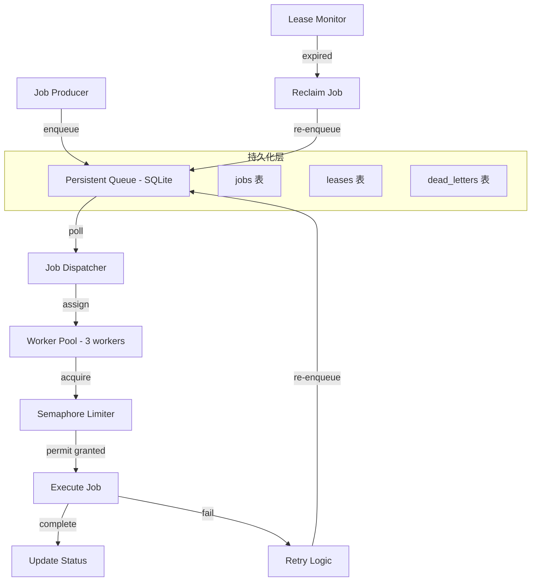
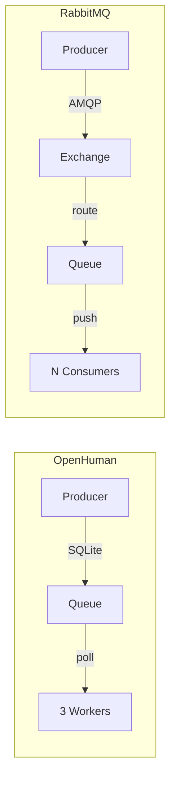

---

title: OpenHuman 后台作业系统：持久化队列、3 worker 池、信号量限流、lease 恢复机制
keywords: [OpenHuman, worker, lease, 后台作业系统, 持久化队列, 信号量限流, 恢复机制]
date: 2026-06-02 12:00:00
tags:
- OpenHuman
- AI Agent
- 作业队列
- 并发控制
- 消息队列
categories:
- ai
description: 深入剖析 OpenHuman 基于 SQLite 的后台作业系统架构，涵盖持久化队列设计、3 Worker 池分工策略、信号量限流与自适应限流、Lease 心跳恢复机制、死信队列管理等核心组件，包含完整的 TypeScript 代码实现与 Schema 设计，对比 RabbitMQ 和 Redis Stream 方案，为本地 AI Agent 提供零外部依赖的可靠作业系统参考。
cover: https://images.unsplash.com/photo-1677442136019-21780ecad995?w=1200&h=630&fit=crop
images:
  - https://images.unsplash.com/photo-1677442136019-21780ecad995?w=1200&h=630&fit=crop
---


## 前言

AI Agent 的日常运行中，大量任务不适合在主循环中同步执行——邮件同步、数据索引、记忆策展、模型微调、报告生成……这些任务耗时长、可重试、且不应阻塞用户交互。一个健壮的后台作业系统是 Agent 可靠性的基石。

OpenHuman 的后台作业系统没有选择引入 RabbitMQ 或 Redis 这样的外部依赖，而是基于 SQLite 构建了一套自包含的持久化队列系统。这个设计决策背后有着深刻的权衡考量：对于一个本地优先（local-first）的 AI Agent 来说，零外部依赖的简洁性比分布式扩展能力更重要。

本文将深入剖析 OpenHuman 后台作业系统的四大核心组件：持久化队列、3 worker 池、信号量限流、lease 恢复机制。

---

## 一、系统总览



### 1.1 核心配置

```yaml
background_jobs:
  database: "~/.openhuman/state/jobs.db"
  worker_pool:
    size: 3
    poll_interval_ms: 1000
    max_concurrent_per_worker: 2
  semaphore:
    global_limit: 10
    per_source_limit: 3
  lease:
    duration_seconds: 300
    heartbeat_interval_seconds: 30
    max_renewals: 5
  retry:
    max_attempts: 3
    backoff_base_seconds: 30
    backoff_multiplier: 2
  dead_letter:
    enabled: true
    max_size: 1000
    retention_days: 7
```

---

## 二、持久化队列

### 2.1 为什么选择 SQLite

在消息队列的选择上，OpenHuman 经历了从 Redis 到 SQLite 的演化：

| 方案 | 优点 | 缺点 | 适用场景 |
|------|------|------|----------|
| Redis Stream | 高性能、Pub/Sub | 需要外部服务、数据可能丢失 | 分布式系统 |
| RabbitMQ | 功能丰富、可靠 | 重量级、运维复杂 | 企业级应用 |
| SQLite | 零依赖、事务性、简单 | 并发有限、单机 | 本地应用 |

OpenHuman 作为本地运行的 Agent，SQLite 的"零依赖 + ACID 事务"完美匹配需求。

### 2.2 数据库 Schema

```sql
-- 作业主表
CREATE TABLE jobs (
    id TEXT PRIMARY KEY,
    type TEXT NOT NULL,                    -- 作业类型：sync_email, curate_memory, etc.
    source TEXT NOT NULL,                  -- 来源标识：gmail, slack, etc.
    payload TEXT NOT NULL,                 -- JSON 格式的作业数据
    priority INTEGER DEFAULT 0,           -- 优先级：越高越先执行
    status TEXT DEFAULT 'pending',         -- pending | running | completed | failed | dead
    attempts INTEGER DEFAULT 0,           -- 已尝试次数
    max_attempts INTEGER DEFAULT 3,       -- 最大尝试次数
    created_at INTEGER NOT NULL,          -- 创建时间戳
    scheduled_at INTEGER,                 -- 计划执行时间（支持延迟执行）
    completed_at INTEGER,                 -- 完成时间
    error_message TEXT,                   -- 最近一次错误信息
    result TEXT,                          -- 执行结果（JSON）
    
    INDEX idx_status_priority (status, priority DESC),
    INDEX idx_type_source (type, source),
    INDEX idx_scheduled (status, scheduled_at)
);

-- 租约表（用于并发控制和故障恢复）
CREATE TABLE leases (
    job_id TEXT PRIMARY KEY REFERENCES jobs(id),
    worker_id TEXT NOT NULL,
    acquired_at INTEGER NOT NULL,
    expires_at INTEGER NOT NULL,
    renewed_at INTEGER,
    renewals INTEGER DEFAULT 0,
    
    INDEX idx_worker (worker_id),
    INDEX idx_expires (expires_at)
);

-- 死信表（最终失败的作业）
CREATE TABLE dead_letters (
    id TEXT PRIMARY KEY,
    original_job_id TEXT,
    type TEXT NOT NULL,
    source TEXT NOT NULL,
    payload TEXT NOT NULL,
    error_message TEXT,
    attempts INTEGER,
    created_at INTEGER NOT NULL,
    died_at INTEGER NOT NULL,
    
    INDEX idx_type (type),
    INDEX idx_died_at (died_at)
);
```

### 2.3 队列操作 API

```typescript
class PersistentQueue {
  private db: Database;
  
  // 入队
  async enqueue(job: JobRequest): Promise<string> {
    const id = crypto.randomUUID();
    
    await this.db.run(`
      INSERT INTO jobs (id, type, source, payload, priority, created_at, scheduled_at)
      VALUES (?, ?, ?, ?, ?, ?, ?)
    `, [
      id,
      job.type,
      job.source,
      JSON.stringify(job.payload),
      job.priority || 0,
      Date.now(),
      job.scheduledAt || Date.now(),
    ]);
    
    return id;
  }
  
  // 批量入队
  async enqueueBatch(jobs: JobRequest[]): Promise<string[]> {
    const ids: string[] = [];
    
    await this.db.transaction(async (tx) => {
      for (const job of jobs) {
        const id = crypto.randomUUID();
        ids.push(id);
        
        await tx.run(`
          INSERT INTO jobs (id, type, source, payload, priority, created_at, scheduled_at)
          VALUES (?, ?, ?, ?, ?, ?, ?)
        `, [id, job.type, job.source, JSON.stringify(job.payload), 
            job.priority || 0, Date.now(), job.scheduledAt || Date.now()]);
      }
    });
    
    return ids;
  }
  
  // 出队（带优先级和调度时间）
  async dequeue(workerId: string, limit: number = 1): Promise<Job[]> {
    return this.db.transaction(async (tx) => {
      // 查询可执行的作业
      const jobs = await tx.all(`
        SELECT * FROM jobs
        WHERE status = 'pending'
          AND (scheduled_at IS NULL OR scheduled_at <= ?)
        ORDER BY priority DESC, created_at ASC
        LIMIT ?
      `, [Date.now(), limit]);
      
      if (jobs.length === 0) return [];
      
      // 为每个作业创建租约
      const now = Date.now();
      const leaseDuration = 300 * 1000; // 5 分钟
      
      for (const job of jobs) {
        await tx.run(`UPDATE jobs SET status = 'running' WHERE id = ?`, [job.id]);
        await tx.run(`
          INSERT OR REPLACE INTO leases (job_id, worker_id, acquired_at, expires_at)
          VALUES (?, ?, ?, ?)
        `, [job.id, workerId, now, now + leaseDuration]);
      }
      
      return jobs.map(j => ({ ...j, payload: JSON.parse(j.payload) }));
    });
  }
}
```

---

## 三、3 Worker 池

### 3.1 设计决策：为什么是 3 个 Worker

Worker 数量的选择是一个经典的权衡问题：

- **1 个 Worker**：最简单，但一个慢作业会阻塞所有后续作业
- **3 个 Worker**：在本地 Agent 场景下的甜蜜点——足够并行处理不同类型的任务，又不会过度消耗系统资源
- **N 个 Worker**：适合分布式系统，但对本地 Agent 来说过于复杂

OpenHuman 的 3 个 Worker 各有分工：

```typescript
enum WorkerRole {
  PRIMARY = 'primary',     // 主要任务：邮件同步、消息处理
  SECONDARY = 'secondary', // 辅助任务：索引、策展
  FLEX = 'flex',           // 弹性任务：溢出处理、低优先级任务
}
```

### 3.2 Worker 实现

```typescript
class Worker {
  readonly id: string;
  readonly role: WorkerRole;
  private queue: PersistentQueue;
  private semaphore: Semaphore;
  private isRunning: boolean = false;
  private currentJobs: Map<string, AbortController> = new Map();
  
  constructor(role: WorkerRole, queue: PersistentQueue, semaphore: Semaphore) {
    this.id = `worker-${role}-${crypto.randomUUID().slice(0, 8)}`;
    this.role = role;
    this.queue = queue;
    this.semaphore = semaphore;
  }
  
  async start(): Promise<void> {
    this.isRunning = true;
    
    while (this.isRunning) {
      try {
        // 获取信号量许可
        await this.semaphore.acquire(this.id);
        
        // 拉取作业
        const jobs = await this.queue.dequeue(this.id, 1);
        
        if (jobs.length === 0) {
          this.semaphore.release(this.id);
          await this.sleep(1000); // 空闲等待
          continue;
        }
        
        // 执行作业
        const job = jobs[0];
        const controller = new AbortController();
        this.currentJobs.set(job.id, controller);
        
        try {
          const result = await this.executeJob(job, controller.signal);
          await this.queue.complete(job.id, result);
        } catch (error) {
          await this.queue.fail(job.id, error.message);
        } finally {
          this.currentJobs.delete(job.id);
          this.semaphore.release(this.id);
        }
        
      } catch (error) {
        console.error(`Worker ${this.id} error:`, error);
        await this.sleep(5000);
      }
    }
  }
  
  async stop(): Promise<void> {
    this.isRunning = false;
    
    // 等待当前作业完成（最多 30 秒）
    const timeout = 30000;
    const start = Date.now();
    
    while (this.currentJobs.size > 0 && Date.now() - start < timeout) {
      await this.sleep(100);
    }
    
    // 超时则强制取消
    for (const [jobId, controller] of this.currentJobs) {
      controller.abort();
      console.warn(`Worker ${this.id} force-cancelled job ${jobId}`);
    }
  }
  
  private async executeJob(job: Job, signal: AbortSignal): Promise<any> {
    const handler = this.getHandler(job.type);
    
    // 设置执行超时
    const timeout = setTimeout(() => {
      signal.dispatchEvent(new Event('abort'));
    }, 240 * 1000); // 4 分钟（小于 5 分钟租约）
    
    try {
      return await handler.execute(job.payload, signal);
    } finally {
      clearTimeout(timeout);
    }
  }
}
```

### 3.3 Worker Pool 管理

```typescript
class WorkerPool {
  private workers: Worker[] = [];
  private queue: PersistentQueue;
  private semaphore: Semaphore;
  
  async initialize(): Promise<void> {
    this.workers = [
      new Worker(WorkerRole.PRIMARY, this.queue, this.semaphore),
      new Worker(WorkerRole.SECONDARY, this.queue, this.semaphore),
      new Worker(WorkerRole.FLEX, this.queue, this.semaphore),
    ];
    
    // 启动所有 Worker
    await Promise.all(this.workers.map(w => w.start()));
    
    // 启动健康监控
    this.startHealthMonitor();
  }
  
  private startHealthMonitor(): void {
    setInterval(() => {
      for (const worker of this.workers) {
        const status = {
          id: worker.id,
          role: worker.role,
          activeJobs: worker.getActiveJobCount(),
          lastActivity: worker.getLastActivity(),
        };
        
        // 如果 Worker 超过 5 分钟没有活动，记录警告
        if (Date.now() - status.lastActivity > 5 * 60 * 1000) {
          console.warn(`Worker ${status.id} appears idle for 5+ minutes`);
        }
      }
    }, 60 * 1000); // 每分钟检查一次
  }
  
  async shutdown(): Promise<void> {
    console.log('Shutting down worker pool...');
    await Promise.all(this.workers.map(w => w.stop()));
    console.log('All workers stopped.');
  }
}
```

---

## 四、信号量限流

### 4.1 为什么需要限流

即使有 3 个 Worker，如果不限制并发，可能会出现：

- 大量 Gmail 同步任务同时执行，触发 API 限流
- 多个 LLM 推理任务同时运行，耗尽 GPU 内存
- 外部 API 调用过于密集，被封禁 IP

### 4.2 信号量实现

```typescript
class Semaphore {
  private globalLimit: number;
  private perSourceLimits: Map<string, number>;
  private globalPermits: number;
  private perSourcePermits: Map<string, number>;
  private waitQueue: Array<{ resolve: Function; reject: Function }> = [];
  
  constructor(config: SemaphoreConfig) {
    this.globalLimit = config.global_limit;
    this.globalPermits = config.global_limit;
    this.perSourceLimits = new Map(Object.entries(config.per_source_limits || {}));
    this.perSourcePermits = new Map(Object.entries(config.per_source_limits || {}));
  }
  
  async acquire(workerId: string, source?: string): Promise<void> {
    // 尝试获取全局许可
    while (this.globalPermits <= 0) {
      await this.waitForPermit();
    }
    this.globalPermits--;
    
    // 尝试获取源级别许可
    if (source && this.perSourceLimits.has(source)) {
      while ((this.perSourcePermits.get(source) || 0) <= 0) {
        await this.waitForPermit();
      }
      this.perSourcePermits.set(source, (this.perSourcePermits.get(source) || 1) - 1);
    }
  }
  
  release(workerId: string, source?: string): void {
    this.globalPermits++;
    
    if (source && this.perSourceLimits.has(source)) {
      const current = this.perSourcePermits.get(source) || 0;
      this.perSourcePermits.set(source, current + 1);
    }
    
    // 唤醒等待的 Worker
    if (this.waitQueue.length > 0) {
      const { resolve } = this.waitQueue.shift()!;
      resolve();
    }
  }
  
  private waitForPermit(): Promise<void> {
    return new Promise((resolve, reject) => {
      this.waitQueue.push({ resolve, reject });
    });
  }
  
  getStatus(): SemaphoreStatus {
    return {
      global: {
        total: this.globalLimit,
        available: this.globalPermits,
        inUse: this.globalLimit - this.globalPermits,
      },
      perSource: Object.fromEntries(
        [...this.perSourceLimits.entries()].map(([source, limit]) => [
          source,
          {
            total: limit,
            available: this.perSourcePermits.get(source) || 0,
            inUse: limit - (this.perSourcePermits.get(source) || 0),
          },
        ])
      ),
    };
  }
}
```

### 4.3 动态限流

OpenHuman 支持根据外部 API 的响应动态调整限流参数：

```typescript
class AdaptiveLimiter {
  private semaphore: Semaphore;
  private rateLimitHeaders: Map<string, RateLimitInfo> = new Map();
  
  onApiResponse(source: string, headers: Headers): void {
    // 解析 API 返回的限流信息
    const remaining = headers.get('x-ratelimit-remaining');
    const resetAt = headers.get('x-ratelimit-reset');
    
    if (remaining && resetAt) {
      const info: RateLimitInfo = {
        remaining: parseInt(remaining),
        resetAt: parseInt(resetAt) * 1000,
      };
      
      this.rateLimitHeaders.set(source, info);
      
      // 如果剩余配额很少，主动降低并发
      if (info.remaining < 5) {
        this.semaphore.setPerSourceLimit(source, 1);
      } else if (info.remaining < 20) {
        this.semaphore.setPerSourceLimit(source, 2);
      } else {
        this.semaphore.setPerSourceLimit(source, 3);
      }
    }
  }
  
  onRateLimited(source: string, retryAfter: number): void {
    // 被限流时，临时禁止该源
    this.semaphore.setPerSourceLimit(source, 0);
    
    // retryAfter 秒后恢复
    setTimeout(() => {
      this.semaphore.setPerSourceLimit(source, 1);
    }, retryAfter * 1000);
  }
}
```

---

## 五、Lease 恢复机制

### 5.1 问题场景

如果 Worker 在执行作业时崩溃（进程被杀、机器重启、网络断开），已经获取的作业会怎样？没有 lease 机制的话，这些作业会永远停留在 `running` 状态，成为"僵尸作业"。

### 5.2 Lease 设计

```typescript
class LeaseManager {
  private db: Database;
  private leaseDuration: number;      // 租约时长（默认 5 分钟）
  private heartbeatInterval: number;  // 心跳间隔（默认 30 秒）
  private maxRenewals: number;        // 最大续租次数（默认 5 次）
  
  // Worker 定期续租
  async renewLease(jobId: string, workerId: string): Promise<boolean> {
    const now = Date.now();
    
    const result = await this.db.run(`
      UPDATE leases 
      SET renewed_at = ?, 
          expires_at = ?,
          renewals = renewals + 1
      WHERE job_id = ? 
        AND worker_id = ? 
        AND expires_at > ?
        AND renewals < ?
    `, [
      now,
      now + this.leaseDuration,
      jobId,
      workerId,
      now,          // 租约未过期才能续
      this.maxRenewals,
    ]);
    
    return result.changes > 0;
  }
  
  // 回收过期租约
  async reclaimExpiredLeases(): Promise<string[]> {
    const now = Date.now();
    
    return this.db.transaction(async (tx) => {
      // 找到过期的租约
      const expired = await tx.all(`
        SELECT l.job_id, l.worker_id, j.type, j.source, j.attempts, j.max_attempts
        FROM leases l
        JOIN jobs j ON j.id = l.job_id
        WHERE l.expires_at <= ?
          AND j.status = 'running'
      `, [now]);
      
      const reclaimedJobIds: string[] = [];
      
      for (const lease of expired) {
        if (lease.attempts < lease.max_attempts) {
          // 重新入队
          await tx.run(`
            UPDATE jobs 
            SET status = 'pending', 
                attempts = attempts + 1,
                error_message = 'lease expired - worker may have crashed'
            WHERE id = ?
          `, [lease.job_id]);
          
          reclaimedJobIds.push(lease.job_id);
        } else {
          // 移入死信队列
          await tx.run(`
            UPDATE jobs SET status = 'dead' WHERE id = ?
          `, [lease.job_id]);
          
          await tx.run(`
            INSERT INTO dead_letters 
            (id, original_job_id, type, source, payload, error_message, attempts, created_at, died_at)
            SELECT ?, id, type, source, payload, error_message, attempts, created_at, ?
            FROM jobs WHERE id = ?
          `, [crypto.randomUUID(), now, lease.job_id]);
        }
        
        // 删除租约
        await tx.run(`DELETE FROM leases WHERE job_id = ?`, [lease.job_id]);
      }
      
      return reclaimedJobIds;
    });
  }
}
```

### 5.3 Lease 心跳

Worker 在执行作业期间，需要定期发送心跳来续租：

```typescript
class LeaseHeartbeat {
  private timers: Map<string, NodeJS.Timeout> = new Map();
  
  startHeartbeat(jobId: string, workerId: string): void {
    const interval = 30 * 1000; // 每 30 秒续租一次
    
    const timer = setInterval(async () => {
      const renewed = await this.leaseManager.renewLease(jobId, workerId);
      
      if (!renewed) {
        // 续租失败（可能已被回收），取消当前执行
        this.emit('lease:lost', { jobId, workerId });
        this.stopHeartbeat(jobId);
      }
    }, interval);
    
    this.timers.set(jobId, timer);
  }
  
  stopHeartbeat(jobId: string): void {
    const timer = this.timers.get(jobId);
    if (timer) {
      clearInterval(timer);
      this.timers.delete(jobId);
    }
  }
}
```

### 5.4 Lease Monitor

独立的 Lease Monitor 进程定期扫描过期租约：

```typescript
class LeaseMonitor {
  private leaseManager: LeaseManager;
  private checkInterval: number;
  
  async start(): Promise<void> {
    setInterval(async () => {
      try {
        const reclaimed = await this.leaseManager.reclaimExpiredLeases();
        
        if (reclaimed.length > 0) {
          console.log(`Reclaimed ${reclaimed.length} expired leases:`, reclaimed);
          
          // 通知调度器有新作业需要处理
          this.emit('jobs:reclaimed', reclaimed);
        }
      } catch (error) {
        console.error('Lease monitor error:', error);
      }
    }, this.checkInterval);
  }
}
```

---

## 六、作业类型与处理器

### 6.1 内置作业类型

| 作业类型 | 描述 | 超时 | 重试 |
|----------|------|------|------|
| sync_email | 邮件同步 | 120s | 3 |
| sync_slack | Slack 消息同步 | 60s | 3 |
| sync_github | GitHub 通知同步 | 60s | 3 |
| curate_memory | 记忆策展 | 300s | 1 |
| generate_report | 报告生成 | 600s | 2 |
| index_content | 内容索引 | 180s | 3 |
| send_notification | 发送通知 | 30s | 5 |
| cleanup | 清理过期数据 | 120s | 1 |

### 6.2 自定义作业处理器

```typescript
interface JobHandler {
  type: string;
  timeout: number;
  execute(payload: any, signal: AbortSignal): Promise<any>;
}

// 注册自定义处理器
class JobRegistry {
  private handlers: Map<string, JobHandler> = new Map();
  
  register(handler: JobHandler): void {
    this.handlers.set(handler.type, handler);
  }
  
  getHandler(type: string): JobHandler {
    const handler = this.handlers.get(type);
    if (!handler) {
      throw new Error(`No handler registered for job type: ${type}`);
    }
    return handler;
  }
}
```

---

## 七、与传统消息队列的对比

### 7.1 OpenHuman vs RabbitMQ



| 维度 | OpenHuman | RabbitMQ |
|------|-----------|----------|
| 部署复杂度 | 零（内嵌） | 需要独立服务 |
| 持久化 | SQLite（本地文件） | 内存 + 磁盘 |
| 消息保证 | at-least-once | at-least-once / exactly-once |
| 适用规模 | 单机、少量任务 | 分布式、高吞吐 |
| 运维成本 | 几乎为零 | 需要监控、备份、集群 |

### 7.2 OpenHuman vs Redis Stream

| 维度 | OpenHuman | Redis Stream |
|------|-----------|--------------|
| 数据安全 | ACID 事务 | 可配置持久化 |
| 消费者组 | 简化版（3 Worker） | 完整消费者组 |
| 内存占用 | 低（SQLite） | 高（内存优先） |
| 网络依赖 | 无 | 需要 Redis 服务 |

---

## 八、监控与运维

### 8.1 作业统计

```
📊 OpenHuman 作业系统状态
━━━━━━━━━━━━━━━━━━━━━━━━━━━━
Worker Pool:
  primary:   运行中 | 活跃作业: 1 | 上次活动: 2s 前
  secondary: 运行中 | 活跃作业: 0 | 上次活动: 15s 前
  flex:      运行中 | 活跃作业: 0 | 上次活动: 45s 前

Semaphore:
  全局: 3/10 已使用
  gmail: 1/3 已使用
  slack: 0/3 已使用

队列状态:
  pending:   12
  running:   1
  completed: 1,247 (今日)
  failed:    3 (今日)
  dead:      0 (今日)

Lease 状态:
  active:  1
  expired: 0
```

### 8.2 死信队列管理

```bash
# 查看死信队列
openhuman jobs dead-letters --limit 10

# 重新入队死信
openhuman jobs retry-dead-letter <job_id>

# 清理过期死信
openhuman jobs cleanup-dead-letters --older-than 7d
```

---

## 九、最佳实践

### 9.1 作业设计原则

1. **幂等性**：作业必须可以安全重试
2. **原子性**：每个作业做一件事，避免长事务
3. **超时设置**：合理设置超时，避免无限执行
4. **错误处理**：区分可重试错误和不可重试错误

### 9.2 Worker 调优

- Worker 数量 = CPU 核心数 / 2（留出资源给 Agent 主进程）
- poll 间隔不要太短（避免忙等待），不要太长（影响响应性）
- 为不同类型的任务设置合理的超时

### 9.3 监控建议

- 监控死信队列大小，及时发现反复失败的作业
- 关注 Worker 空闲时间，判断是否需要调整 Worker 数量
- 追踪作业延迟分布，发现性能瓶颈

---

## 十、总结

OpenHuman 的后台作业系统用最简单的技术栈（SQLite + TypeScript）实现了生产级的可靠性。它的设计哲学是"够用就好"——不追求分布式扩展，但确保单机场景下的数据安全和任务可靠。

关键设计要点：

1. **SQLite 持久化**：ACID 事务保证数据不丢失，零外部依赖
2. **3 Worker 池**：在并行度和资源消耗之间的最佳平衡
3. **信号量限流**：防止对外部 API 的过度调用
4. **Lease 恢复**：崩溃后自动回收和重试，无僵尸作业

对于正在构建本地 AI Agent 的开发者来说，OpenHuman 的作业系统提供了一个"不需要 Kafka 也能做好"的参考实现。

---

## 参考资料

- [OpenHuman 官方文档](https://github.com/nousresearch/openhuman)
- [SQLite WAL 模式](https://www.sqlite.org/wal.html)
- [Distributed Systems: Patterns and Paradigms](https://www.amazon.com/Distributed-Systems-Andrew-Tanenbaum/dp/0132392275)
- [The Art of Multiprocessor Programming](https://www.amazon.com/Art-Multiprocessor-Programming-Maurice-Herlihy/dp/0123705916)

## 相关阅读

- [Redis Stream 实战：消息队列替代方案与消费者组管理](/categories/Redis/redis-stream-guide-laravel/)
- [Redis Pipeline 实战：批量命令优化与网络延迟治理](/categories/Redis/redis-pipeline-guide-commandsoptimization/)
- [Hermes vs OpenClaw vs OpenHuman：三种 AI Agent 记忆架构哲学深度对比](/categories/AI%20Agent/hermes-openclaw-openhuman-memory-architecture-philosophy-comparison/)
