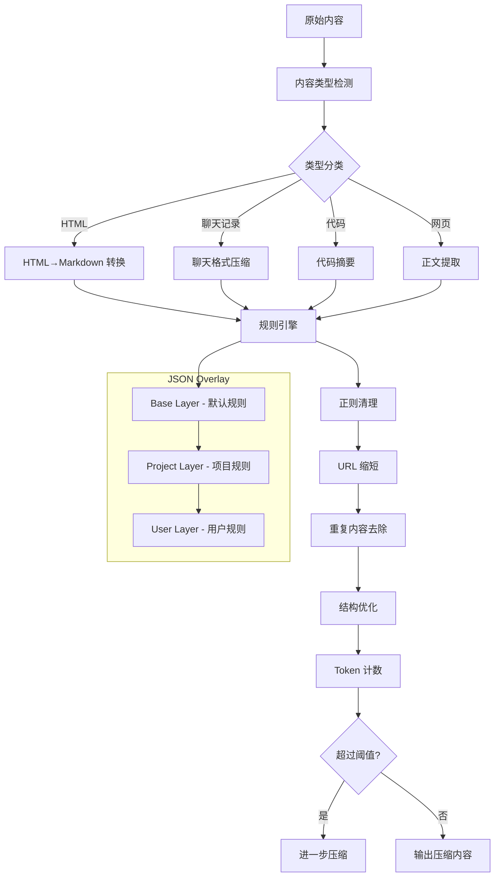
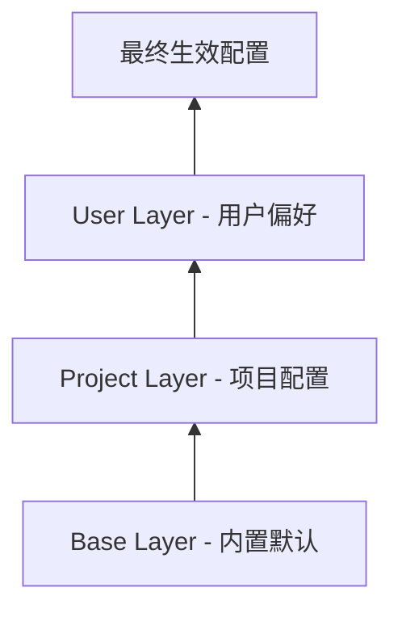
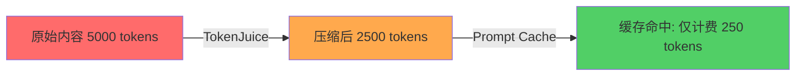

## 前言

Token 是 AI Agent 的血液——每一次推理、每一次对话、每一次工具调用都在消耗 token。当 Agent 需要处理大量外部数据（邮件、聊天记录、网页、代码）时，token 消耗会迅速膨胀。一个典型的场景：Agent 收到一封包含 HTML 格式签名、追踪像素、重复引用的邮件，原始内容可能有 5000 个 token，但真正有用的信息可能只有 500 个 token。

TokenJuice 是 OpenHuman 的 token 压缩引擎，它的使命是：**用最少的 token 传递最多的信息**。它不是简单的文本截断，而是一套规则驱动的智能压缩系统，配合分层 JSON overlay 机制，实现了平均 40-60% 的压缩率，同时保持信息完整性。

---

## 一、TokenJuice 的架构总览



### 1.1 核心配置

```yaml
tokenjuice:
  enabled: true
  max_tokens_per_input: 4000
  target_compression_ratio: 0.5
  
  rules:
    html_to_markdown: true
    url_shortening: true
    duplicate_removal: true
    whitespace_normalization: true
    signature_removal: true
    tracking_pixel_removal: true
    quote_collapse: true
    code_summarization: false  # 默认关闭，需要 LLM 支持
  
  overlay:
    base: "defaults/tokenjuice-base.json"
    project: ".openhuman/tokenjuice.json"
    user: "~/.openhuman/tokenjuice.json"
```

---

## 二、规则驱动的压缩引擎

### 2.1 规则系统设计

TokenJuice 的压缩由一系列可组合的规则驱动，每条规则负责一个特定的压缩任务：

```typescript
interface CompressionRule {
  name: string;
  priority: number;           // 执行优先级（越小越先执行）
  applicableTypes: ContentType[];  // 适用的内容类型
  enabled: boolean;
  
  // 规则的核心逻辑
  apply(content: string, context: CompressionContext): CompressionResult;
}

interface CompressionResult {
  content: string;            // 压缩后的内容
  tokensSaved: number;        // 节省的 token 数
  ruleApplied: string;        // 应用的规则名
  metadata?: Record<string, any>;
}
```

### 2.2 内置压缩规则

#### 规则 1：HTML → Markdown 转换

这是压缩率最高的规则，平均可以减少 60-80% 的 token：

```typescript
class HtmlToMarkdownRule implements CompressionRule {
  name = 'html_to_markdown';
  priority = 10;
  applicableTypes = ['html', 'email'];
  
  apply(content: string, context: CompressionContext): CompressionResult {
    const originalTokens = this.countTokens(content);
    
    // 使用 turndown 进行 HTML → Markdown 转换
    const markdown = this.turndownService.turbdown(content, {
      headingStyle: 'atx',
      codeBlockStyle: 'fenced',
      bulletListMarker: '-',
    });
    
    // 后处理：清理 Markdown 残留
    const cleaned = this.postProcess(markdown);
    
    const newTokens = this.countTokens(cleaned);
    
    return {
      content: cleaned,
      tokensSaved: originalTokens - newTokens,
      ruleApplied: this.name,
    };
  }
  
  private postProcess(markdown: string): string {
    return markdown
      // 移除空链接
      .replace(/\[([^\]]*)\]\(\s*\)/g, '$1')
      // 合并连续空行
      .replace(/\n{3,}/g, '\n\n')
      // 移除 HTML 注释
      .replace(/<!--[\s\S]*?-->/g, '')
      // 移除空的 Markdown 标签
      .replace(/\*\*\s*\*\*/g, '')
      .replace(/__\s*__/g, '');
  }
}
```

#### 规则 2：URL 缩短

```typescript
class UrlShorteningRule implements CompressionRule {
  name = 'url_shortening';
  priority = 20;
  applicableTypes = ['html', 'email', 'chat', 'web'];
  
  apply(content: string, context: CompressionContext): CompressionResult {
    const originalTokens = this.countTokens(content);
    
    const shortened = content.replace(
      /https?:\/\/[^\s<>"{}|\\^`\[\]]+/g,
      (url) => {
        try {
          const parsed = new URL(url);
          
          // 保留域名 + 最后一级路径
          const pathParts = parsed.pathname.split('/').filter(Boolean);
          const lastPart = pathParts[pathParts.length - 1] || '';
          
          // 如果有查询参数，保留关键参数
          const params = new URLSearchParams(parsed.search);
          const keyParams = ['id', 'v', 'q', 'page', 'token'];
          const keptParams = keyParams
            .filter(k => params.has(k))
            .map(k => `${k}=${params.get(k)}`)
            .join('&');
          
          let shortened = `${parsed.hostname}/${lastPart}`;
          if (keptParams) shortened += `?${keptParams}`;
          
          return shortened;
        } catch {
          return url; // 解析失败保留原样
        }
      }
    );
    
    return {
      content: shortened,
      tokensSaved: originalTokens - this.countTokens(shortened),
      ruleApplied: this.name,
    };
  }
}
```

#### 规则 3：邮件签名去除

```typescript
class SignatureRemovalRule implements CompressionRule {
  name = 'signature_removal';
  priority = 30;
  applicableTypes = ['email'];
  
  // 常见签名模式
  private patterns = [
    /^--\s*$/m,                                    // 标准签名分隔符
    /^Best regards,?$/im,                          // 英文敬语
    /^发自我的 iPhone$/m,                           // 手机签名
    /^Sent from my (iPhone|Android|iPad)/im,       // 英文手机签名
    /^_{3,}\s*$/m,                                 // 下划线分隔
    /^-{3,}\s*$/m,                                 // 横线分隔
    /^(Tel|Phone|Mobile|Email|地址)[：:]\s*/im,     // 联系信息
    /^本邮件.{0,20}机密/im,                          // 保密声明
    /CONFIDENTIAL.{0,50}intended/im,               // 英文保密声明
  ];
  
  apply(content: string, context: CompressionContext): CompressionResult {
    const originalTokens = this.countTokens(content);
    let result = content;
    
    for (const pattern of this.patterns) {
      const match = result.search(pattern);
      if (match !== -1) {
        // 从匹配位置截断到末尾
        result = result.slice(0, match).trimEnd();
        break; // 只匹配第一个签名模式
      }
    }
    
    return {
      content: result,
      tokensSaved: originalTokens - this.countTokens(result),
      ruleApplied: this.name,
    };
  }
}
```

#### 规则 4：引用折叠

```typescript
class QuoteCollapseRule implements CompressionRule {
  name = 'quote_collapse';
  priority = 40;
  applicableTypes = ['email', 'chat'];
  
  apply(content: string, context: CompressionContext): CompressionResult {
    const originalTokens = this.countTokens(content);
    
    // 折叠邮件引用（> 开头的行）
    const lines = content.split('\n');
    const result: string[] = [];
    let quoteDepth = 0;
    let collapsedCount = 0;
    
    for (const line of lines) {
      const currentDepth = (line.match(/^>+/) || [''])[0].length;
      
      if (currentDepth > 0) {
        quoteDepth = Math.max(quoteDepth, currentDepth);
        collapsedCount++;
        
        // 只保留引用的前 2 行
        if (collapsedCount <= 2) {
          result.push(line);
        } else if (collapsedCount === 3) {
          result.push(`> [... ${collapsedCount} 行引用已折叠]`);
        }
      } else {
        quoteDepth = 0;
        collapsedCount = 0;
        result.push(line);
      }
    }
    
    const compressed = result.join('\n');
    
    return {
      content: compressed,
      tokensSaved: originalTokens - this.countTokens(compressed),
      ruleApplied: this.name,
    };
  }
}
```

#### 规则 5：重复内容去除

```typescript
class DuplicateRemovalRule implements CompressionRule {
  name = 'duplicate_removal';
  priority = 50;
  applicableTypes = ['html', 'email', 'chat', 'web'];
  
  apply(content: string, context: CompressionContext): CompressionResult {
    const originalTokens = this.countTokens(content);
    
    // 检测并移除连续重复的段落
    const paragraphs = content.split(/\n\s*\n/);
    const unique: string[] = [];
    const seen = new Set<string>();
    
    for (const para of paragraphs) {
      const normalized = para.trim().toLowerCase().replace(/\s+/g, ' ');
      
      if (normalized.length < 10 || !seen.has(normalized)) {
        unique.push(para);
        if (normalized.length >= 10) {
          seen.add(normalized);
        }
      }
    }
    
    const result = unique.join('\n\n');
    
    return {
      content: result,
      tokensSaved: originalTokens - this.countTokens(result),
      ruleApplied: this.name,
    };
  }
}
```

#### 规则 6：追踪像素和隐藏内容移除

```typescript
class TrackingRemovalRule implements CompressionRule {
  name = 'tracking_removal';
  priority = 5;  // 最先执行
  applicableTypes = ['html', 'email'];
  
  apply(content: string, context: CompressionContext): CompressionResult {
    const originalTokens = this.countTokens(content);
    
    let result = content;
    
    // 移除 1x1 追踪像素
    result = result.replace(
      /]*(width=["']?1["']?|height=["']?1["']?)[^>]*>/gi,
      ''
    );
    
    // 移除透明图片（常见追踪方式）
    result = result.replace(
      /]*style=["'][^"']*opacity:\s*0[^"']*["'][^>]*>/gi,
      ''
    );
    
    // 移除 display:none 的内容
    result = result.replace(
      /<[^>]*style=["'][^"']*display:\s*none[^"']*["'][^>]*>[\s\S]*?<\/[^>]+>/gi,
      ''
    );
    
    // 移除空的 span/div
    result = result.replace(
      /<(span|div)[^>]*>\s*<\/(span|div)>/gi,
      ''
    );
    
    return {
      content: result,
      tokensSaved: originalTokens - this.countTokens(result),
      ruleApplied: this.name,
    };
  }
}
```

### 2.3 规则编排

规则引擎按照优先级顺序执行所有适用的规则：

```typescript
class RuleEngine {
  private rules: CompressionRule[];
  
  constructor() {
    // 按优先级排序
    this.rules = [
      new TrackingRemovalRule(),
      new HtmlToMarkdownRule(),
      new SignatureRemovalRule(),
      new UrlShorteningRule(),
      new QuoteCollapseRule(),
      new DuplicateRemovalRule(),
      new WhitespaceNormalizationRule(),
    ].sort((a, b) => a.priority - b.priority);
  }
  
  async compress(content: string, contentType: ContentType): Promise<CompressedContent> {
    let currentContent = content;
    const appliedRules: string[] = [];
    let totalTokensSaved = 0;
    
    for (const rule of this.rules) {
      if (!rule.enabled) continue;
      if (!rule.applicableTypes.includes(contentType)) continue;
      
      const result = rule.apply(currentContent, {
        contentType,
        originalLength: content.length,
      });
      
      currentContent = result.content;
      totalTokensSaved += result.tokensSaved;
      appliedRules.push(result.ruleApplied);
    }
    
    return {
      content: currentContent,
      originalTokens: this.countTokens(content),
      compressedTokens: this.countTokens(currentContent),
      compressionRatio: 1 - (this.countTokens(currentContent) / this.countTokens(content)),
      tokensSaved: totalTokensSaved,
      appliedRules,
    };
  }
}
```

---

## 三、分层 JSON Overlay 机制

### 3.1 设计动机

TokenJuice 的规则需要高度可配置——不同项目、不同用户、不同场景需要不同的压缩策略。但配置不能是一份巨大的 JSON 文件，那样难以维护。

分层 overlay 的解决方案：将配置分为三层，高优先级层覆盖低优先级层。



### 3.2 三层配置结构

#### Base Layer（内置默认）

```json
{
  "$schema": "tokenjuice-config-v1",
  "version": "1.0.0",
  "rules": {
    "html_to_markdown": {
      "enabled": true,
      "priority": 10,
      "options": {
        "headingStyle": "atx",
        "codeBlockStyle": "fenced"
      }
    },
    "url_shortening": {
      "enabled": true,
      "priority": 20,
      "options": {
        "keepQueryParams": ["id", "v", "q"],
        "maxHostnameDepth": 2
      }
    },
    "signature_removal": {
      "enabled": true,
      "priority": 30,
      "options": {
        "patterns": ["auto"]
      }
    },
    "quote_collapse": {
      "enabled": true,
      "priority": 40,
      "options": {
        "maxQuoteLines": 2
      }
    },
    "duplicate_removal": {
      "enabled": true,
      "priority": 50,
      "options": {
        "minParagraphLength": 10
      }
    }
  },
  "limits": {
    "maxTokensPerInput": 4000,
    "targetCompressionRatio": 0.5,
    "minCompressionRatio": 0.1
  }
}
```

#### Project Layer（项目配置）

```json
{
  "rules": {
    "code_summarization": {
      "enabled": true,
      "priority": 60,
      "options": {
        "maxCodeLines": 50,
        "keepFunctionSignatures": true
      }
    },
    "url_shortening": {
      "options": {
        "keepQueryParams": ["id", "v", "q", "page", "token", "ref"]
      }
    }
  },
  "limits": {
    "maxTokensPerInput": 6000
  },
  "content_type_overrides": {
    "code": {
      "maxTokensPerInput": 8000
    },
    "email": {
      "maxTokensPerInput": 3000
    }
  }
}
```

#### User Layer（用户配置）

```json
{
  "rules": {
    "signature_removal": {
      "options": {
        "customPatterns": [
          "^From:.*@company\\.com$",
          "公司名称.*版权所有"
        ]
      }
    }
  },
  "limits": {
    "targetCompressionRatio": 0.6
  },
  "preferences": {
    "preserveFormatting": false,
    "preserveLinks": true,
    "language": "zh-CN"
  }
}
```

### 3.3 Overlay 合并算法

```typescript
class OverlayMerger {
  merge(...layers: JsonObject[]): JsonObject {
    return layers.reduce((merged, layer) => {
      return this.deepMerge(merged, layer);
    }, {});
  }
  
  private deepMerge(target: JsonObject, source: JsonObject): JsonObject {
    const result = { ...target };
    
    for (const key of Object.keys(source)) {
      if (
        key in target &&
        typeof target[key] === 'object' &&
        typeof source[key] === 'object' &&
        !Array.isArray(target[key]) &&
        !Array.isArray(source[key])
      ) {
        // 递归合并对象
        result[key] = this.deepMerge(
          target[key] as JsonObject,
          source[key] as JsonObject
        );
      } else {
        // 直接覆盖
        result[key] = source[key];
      }
    }
    
    return result;
  }
}
```

### 3.4 配置热重载

TokenJuice 支持配置文件变更时自动重载：

```typescript
class ConfigWatcher {
  private watcher: FSWatcher;
  
  start(): void {
    const paths = [
      this.basePath,
      this.projectPath,
      this.userPath,
    ].filter(Boolean);
    
    this.watcher = chokidar.watch(paths, {
      ignoreInitial: true,
      awaitWriteFinish: { stabilityThreshold: 500 },
    });
    
    this.watcher.on('change', async (path) => {
      console.log(`TokenJuice config changed: ${path}`);
      await this.reload();
    });
  }
  
  private async reload(): Promise<void> {
    const base = await this.loadJson(this.basePath);
    const project = await this.loadJson(this.projectPath);
    const user = await this.loadJson(this.userPath);
    
    this.mergedConfig = this.merger.merge(base, project, user);
    this.ruleEngine.updateConfig(this.mergedConfig);
    
    console.log('TokenJuice config reloaded');
  }
}
```

---

## 四、压缩率统计与可视化

### 4.1 统计收集

```typescript
class CompressionStats {
  private db: Database;
  
  async record(entry: CompressionEntry): Promise<void> {
    await this.db.run(`
      INSERT INTO compression_stats 
      (timestamp, content_type, original_tokens, compressed_tokens, 
       compression_ratio, rules_applied, processing_time_ms)
      VALUES (?, ?, ?, ?, ?, ?, ?)
    `, [
      Date.now(),
      entry.contentType,
      entry.originalTokens,
      entry.compressedTokens,
      entry.compressionRatio,
      JSON.stringify(entry.rulesApplied),
      entry.processingTimeMs,
    ]);
  }
  
  async getDailySummary(): Promise<DailySummary> {
    const today = this.getTodayStart();
    
    return this.db.get(`
      SELECT 
        COUNT(*) as total_compressions,
        SUM(original_tokens) as total_original_tokens,
        SUM(compressed_tokens) as total_compressed_tokens,
        AVG(compression_ratio) as avg_compression_ratio,
        SUM(original_tokens - compressed_tokens) as total_tokens_saved,
        AVG(processing_time_ms) as avg_processing_time_ms
      FROM compression_stats
      WHERE timestamp >= ?
    `, [today]);
  }
  
  async getByContentType(): Promise<ContentTypeSummary[]> {
    return this.db.all(`
      SELECT 
        content_type,
        COUNT(*) as count,
        AVG(compression_ratio) as avg_ratio,
        SUM(original_tokens - compressed_tokens) as tokens_saved
      FROM compression_stats
      WHERE timestamp >= ?
      GROUP BY content_type
      ORDER BY tokens_saved DESC
    `, [this.getTodayStart()]);
  }
}
```

### 4.2 统计报告

```
📊 TokenJuice 压缩统计 - 2026-06-02
━━━━━━━━━━━━━━━━━━━━━━━━━━━━━━━━━━━━━━
总压缩次数: 847
总节省 Token: 234,567
平均压缩率: 47.3%
平均处理时间: 12ms

按内容类型:
  HTML    | 压缩率: 62.1% | 节省: 145,230 tokens | 次数: 312
  Email   | 压缩率: 43.8% | 节省: 52,340 tokens  | 次数: 287
  Chat    | 压缩率: 28.5% | 节省: 23,450 tokens  | 次数: 156
  Web     | 压缩率: 51.2% | 节省: 13,547 tokens  | 次数: 92

压缩率分布:
  0-20%   ████████████ 156 (18.4%)
  20-40%  ████████████████████ 287 (33.9%)
  40-60%  ████████████████████████ 312 (36.8%)
  60-80%  ████████ 78 (9.2%)
  80-100% ██ 14 (1.7%)
━━━━━━━━━━━━━━━━━━━━━━━━━━━━━━━━━━━━━━
```

---

## 五、与 Prompt Cache 的协同优化

### 5.1 TokenJuice + Prompt Cache

TokenJuice 的压缩和 Prompt Cache 是互补的优化手段：



- **TokenJuice**：减少输入 token 数量（40-60% 压缩率）
- **Prompt Cache**：对重复的前缀内容打折（最高 90% 折扣）

两者叠加的效果：

```
原始场景：每天 1000 封邮件，每封 5000 tokens
  → 无优化：5,000,000 tokens/天
  → 仅 TokenJuice：2,500,000 tokens/天（-50%）
  → 仅 Prompt Cache：3,500,000 tokens/天（-30%）
  → 两者叠加：1,750,000 tokens/天（-65%）
```

### 5.2 优化策略配置

```yaml
tokenjuice:
  cache_integration:
    enabled: true
    
    # 识别可缓存的内容模式
    cacheable_patterns:
      - type: "system_prompt"
        description: "系统提示词前缀"
        cache_ttl: 3600
        
      - type: "context_template"
        description: "上下文模板"
        cache_ttl: 1800
        
      - type: "email_thread"
        description: "邮件线程的公共部分"
        cache_ttl: 900
    
    # 压缩后的内容是否参与缓存
    compress_before_cache: true
```

---

## 六、不同内容类型的压缩策略

### 6.1 邮件（Email）

邮件是最需要压缩的内容类型，因为：
- 包含大量格式信息（HTML）
- 包含签名、保密声明等模板内容
- 邮件线程会重复引用历史内容

```
压缩前（5000 tokens）:
  - HTML 标签和样式：2000 tokens (40%)
  - 追踪像素和隐藏内容：500 tokens (10%)
  - 签名和保密声明：800 tokens (16%)
  - 引用的历史邮件：1200 tokens (24%)
  - 实际内容：500 tokens (10%)

压缩后（1200 tokens）:
  - 转换为 Markdown：消除 HTML 开销
  - 移除追踪内容：消除隐藏噪声
  - 移除签名：消除模板内容
  - 折叠引用：保留 2 行摘要
  - 实际内容：500 tokens（完整保留）

压缩率：76%
```

### 6.2 聊天记录（Chat）

聊天记录的压缩重点是去除元数据和重复：

```
压缩前（3000 tokens）:
  - 时间戳和用户信息：600 tokens (20%)
  - 表情回应和状态消息：400 tokens (13%)
  - 重复的问候和寒暄：300 tokens (10%)
  - 实际对话内容：1700 tokens (57%)

压缩后（2100 tokens）:
  - 保留关键时间戳：200 tokens
  - 移除表情和状态：0 tokens
  - 合并重复内容：100 tokens
  - 实际对话内容：1700 tokens（完整保留）
  - 格式优化：100 tokens

压缩率：30%
```

### 6.3 代码（Code）

代码压缩是最谨慎的——不能破坏代码结构：

```
压缩前（8000 tokens）:
  - 注释和文档：2000 tokens (25%)
  - 空行和格式：500 tokens (6%)
  - 重复的模式：1500 tokens (19%)
  - 实际代码：4000 tokens (50%)

压缩后（5500 tokens）:
  - 保留关键注释：500 tokens
  - 移除空行：0 tokens
  - 摘要化重复模式：500 tokens
  - 实际代码：4000 tokens（完整保留）
  - 函数签名保留：500 tokens

压缩率：31%
```

### 6.4 网页（Web）

网页压缩依赖正文提取：

```
压缩前（10000 tokens）:
  - HTML 结构和样式：3000 tokens (30%)
  - 导航栏和侧边栏：2000 tokens (20%)
  - 广告和推荐：1500 tokens (15%)
  - 页脚和法律信息：500 tokens (5%)
  - 正文内容：3000 tokens (30%)

压缩后（3500 tokens）:
  - 转换为 Markdown：消除 HTML 开销
  - 正文提取：只保留正文
  - 格式优化：500 tokens

压缩率：65%
```

---

## 七、性能优化

### 7.1 规则执行优化

```typescript
class OptimizedRuleEngine {
  // 预编译正则表达式
  private compiledPatterns: Map<string, RegExp> = new Map();
  
  // 规则缓存：相同内容不重复处理
  private resultCache: LRUCache<string, CompressionResult>;
  
  async compress(content: string, contentType: ContentType): Promise<CompressedContent> {
    // 检查缓存
    const cacheKey = this.computeCacheKey(content, contentType);
    const cached = this.resultCache.get(cacheKey);
    if (cached) return cached;
    
    // 执行压缩
    const result = await this.doCompress(content, contentType);
    
    // 缓存结果
    this.resultCache.set(cacheKey, result);
    
    return result;
  }
}
```

### 7.2 流式处理

对于大文件，TokenJuice 支持流式处理：

```typescript
class StreamingCompressor {
  async *compressStream(
    stream: AsyncIterable<string>,
    contentType: ContentType
  ): AsyncIterable<string> {
    let buffer = '';
    
    for await (const chunk of stream) {
      buffer += chunk;
      
      // 当缓冲区足够大时处理
      while (buffer.length > 4096) {
        const splitPoint = this.findSplitPoint(buffer, 4096);
        const segment = buffer.slice(0, splitPoint);
        buffer = buffer.slice(splitPoint);
        
        const compressed = await this.compress(segment, contentType);
        yield compressed.content;
      }
    }
    
    // 处理剩余内容
    if (buffer.length > 0) {
      const compressed = await this.compress(buffer, contentType);
      yield compressed.content;
    }
  }
}
```

---

## 八、最佳实践

### 8.1 规则配置建议

- 不要禁用 HTML → Markdown 转换——这是压缩率最高的规则
- URL 缩短要谨慎——保留关键参数有助于上下文理解
- 代码压缩要保守——宁可少压缩也不要破坏代码结构

### 8.2 Overlay 设计建议

- Base Layer 保持稳定，只在版本升级时修改
- Project Layer 用于团队共享的配置
- User Layer 用于个人偏好，不应影响他人

### 8.3 监控建议

- 监控平均压缩率——如果突然下降，可能是内容类型变化
- 关注处理时间——如果超过 100ms，需要优化规则
- 追踪 token 节省量——这是最直接的 ROI 指标

---

## 九、与其他方案的对比

| 特性 | TokenJuice | LLMLingua | 自建方案 |
|------|------------|-----------|----------|
| 压缩方式 | 规则驱动 | LLM 驱动 | 自定义 |
| 延迟 | < 50ms | 1-5s | 自建 |
| 依赖 | 无 | 需要 LLM | 自建 |
| 可定制性 | 高（overlay） | 低 | 高 |
| 适用场景 | 结构化内容 | 自然语言 | 自建 |
| 压缩率 | 40-60% | 50-80% | 自建 |
| 信息保留 | 高（规则保证） | 中（可能丢失） | 自建 |

TokenJuice 的优势在于**低延迟 + 高可控**——规则驱动意味着压缩行为是确定性的、可预测的，不会因为 LLM 的随机性而丢失关键信息。

---

## 十、总结

TokenJuice 是 OpenHuman 中一个被低估但极其重要的组件。它通过规则驱动的压缩引擎和分层 JSON overlay 机制，实现了：

1. **高效压缩**：平均 40-60% 的压缩率，HTML 内容最高可达 80%
2. **低延迟**：所有规则都是本地执行，无需 LLM 调用
3. **高度可定制**：三层 overlay 适应不同项目和用户需求
4. **信息完整**：规则驱动确保关键信息不丢失
5. **成本节省**：与 Prompt Cache 协同，最高可节省 65% 的 token 成本

对于正在构建 AI Agent 的开发者来说，TokenJuice 提供了一个值得借鉴的思路：**在把数据送进 LLM 之前，先用规则做一轮"预处理"——这比让 LLM 自己理解冗余信息更高效、更可靠。**

---

## 参考资料

- [OpenHuman TokenJuice 文档](https://github.com/nousresearch/openhuman/blob/main/docs/tokenjuice.md)
- [LLMLingua: Compressing Prompts for Accelerated Inference](https://arxiv.org/abs/2310.05736)
- [Turndown: HTML to Markdown Converter](https://github.com/mixmark-io/turndown)
- [Prompt Caching - Anthropic](https://docs.anthropic.com/en/docs/build-with-claude/prompt-caching)

## 相关阅读

- [OpenHuman 模型路由架构：hint:reasoning/fast/vision/summarize 任务驱动路由策略](/categories/AI-Agent/openhuman-model-routing-hint-driven-strategy/)
- [OpenHuman AutoFetch 调度器：每 20 分钟连接遍历、sync state 管理、去重与预算控制](/categories/AI/openhuman-autofetch-scheduler-connection-traversal-sync-state/)
- [TokenJuice 成本优化实战：6 个月邮件处理从数百美元降至个位数的技术路径](/categories/AI-Agent/tokenjuice-cost-optimization-email-processing/)
- [OpenHuman 桌面吉祥物架构：状态机驱动的动画、VAD 语音捕获、viseme 口型同步](/categories/AI-Agent/openhuman-desktop-mascot-state-machine-animation-vad-viseme/)
