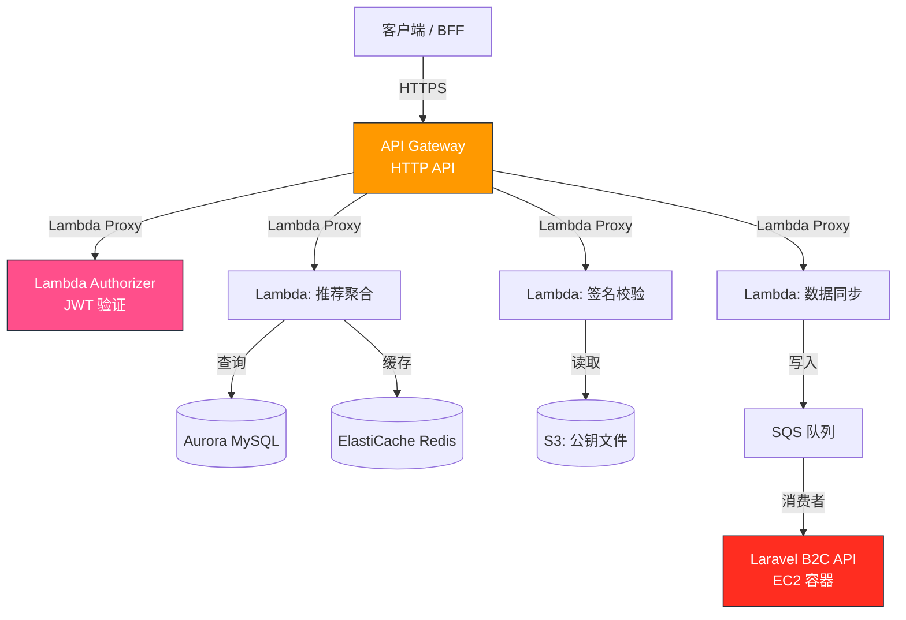
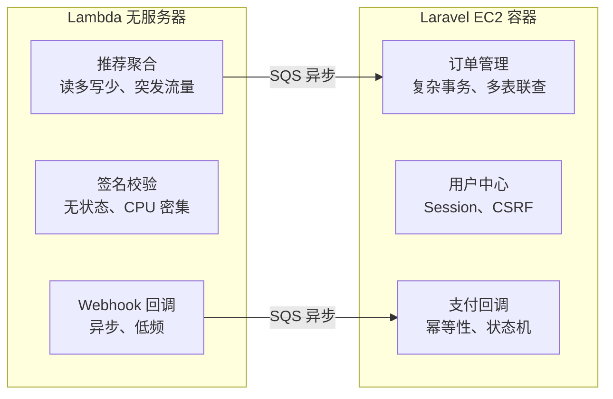

---

title: API Gateway + Lambda 实战：无服务器 API 架构设计与 Laravel 集成踩坑记录
keywords: [API Gateway, Lambda, API, Laravel, 无服务器, 架构设计与, 集成踩坑记录]
date: 2026-05-17 04:40:41
updated: 2026-05-17 04:44:02
categories:
- architecture
- api
tags:
- AWS
- API Gateway
- Lambda
- Serverless
- Laravel
- 无服务器
description: 深入解析 AWS API Gateway + Lambda 无服务器架构设计，涵盖 HTTP API/REST API/ALB 选型对比、冷启动优化（Provisioned Concurrency、SnapStart）、API Gateway 限流缓存 WAF 实战，以及与 Laravel 混合部署策略与成本估算。
cover: https://images.unsplash.com/photo-1486406146926-c627a92ad1ab?w=1200&h=630&fit=crop
images:
- /images/content/arch-003-content-1.jpg
- /images/diagrams/arch-003-diagram.jpg
---


我在 KKday B2C Backend Team 工作期间，有一个需求是为 Affiliate 推荐系统搭建一套独立的轻量 API 层——不需要完整的 Laravel 应用栈，只做数据聚合和签名验证，流量有明显的峰谷特征（白天高、凌晨低），按量付费比常驻 EC2 更划算。最终方案选了 AWS API Gateway + Lambda，但中间踩了不少坑。

这篇文章不是 "Serverless 101 概念介绍"，而是我在真实项目中遇到的选型决策、架构设计和踩坑记录，同时记录了如何与现有 Laravel B2C API 体系共存。如果你正在评估 Serverless 架构是否适合你的项目，这篇文章会给你一些真实的数据和决策依据。

## 架构总览



核心思路：**API Gateway 做路由和鉴权，Lambda 做无状态计算，重度业务仍然走 Laravel**。两者通过 SQS 异步解耦。

## 一、HTTP API vs REST API：选哪个？


AWS 提供两种 API Gateway 类型，价差 70%，功能差很多：

| 维度 | HTTP API | REST API |
|------|----------|----------|
| 价格 | $1.00/百万请求 | $3.50/百万请求 |
| 延迟 | 更低（~10ms） | 较高（~30ms） |
| Lambda Proxy | 原生支持 | 需手动配置 |
| WAF 集成 | 不支持 | 支持 |
| 请求验证 | 不支持 | 内置 JSON Schema |
| Usage Plans | 不支持 | 支持（API Key 管理） |
| 自定义域名 | 支持 | 支持 |
| ALB Lambda Target | $0.0225/LCU-小时 + $0.008/GB | ~15ms | ALB + Lambda | 需 Target Group | 支持（WAF v2） | 不支持 | 支持 |

> **补充说明**：ALB Lambda Target 适合已有 ALB 且需要同时服务 EC2 和 Lambda 的混合架构。ALB 按 LCU（Load Balancer Capacity Unit）计费，当请求体大小 > 128KB 或需要 WebSocket 时 ALB 是唯一选择。但 ALB 不支持 Usage Plans 和 API Key，也不支持请求/响应转换（VTL Mapping Templates）。对于纯 API 场景，HTTP API 的性价比最高。

**我的选择**：HTTP API。原因很简单——这个场景不需要 WAF 和 Usage Plans，低延迟和低成本是刚需。后来发现一个坑：HTTP API 不支持请求体验证，必须在 Lambda 里自己做。另外 HTTP API 默认支持 CORS，省去了 REST API 那套复杂的 CORS 配置。对于新项目，除非你明确需要 REST API 的高级功能（WAF、Usage Plans、请求/响应转换），否则 HTTP API 是更优的默认选择。

```typescript
// Lambda Handler - 手动做请求验证（HTTP API 不支持 JSON Schema 验证）
import { APIGatewayProxyEvent, APIGatewayProxyResult } from 'aws-lambda';
import { z } from 'zod';

const RecommendRequestSchema = z.object({
  member_id: z.string().uuid(),
  category: z.enum(['tour', 'ticket', 'hotel']),
  limit: z.number().min(1).max(50).default(10),
});

export const handler = async (
  event: APIGatewayProxyEvent
): Promise<APIGatewayProxyResult> => {
  try {
    const body = JSON.parse(event.body || '{}');
    const validated = RecommendRequestSchema.parse(body);

    // 调用推荐服务
    const recommendations = await fetchRecommendations(validated);

    return {
      statusCode: 200,
      headers: {
        'Content-Type': 'application/json',
        'Cache-Control': 'public, max-age=300', // 5 分钟 CDN 缓存
      },
      body: JSON.stringify({
        data: recommendations,
        meta: { cached_at: new Date().toISOString() },
      }),
    };
  } catch (error) {
    if (error instanceof z.ZodError) {
      return {
        statusCode: 422,
        body: JSON.stringify({
          message: 'Validation failed',
          errors: error.errors,
        }),
      };
    }
    // 记录到 CloudWatch
    console.error('Lambda error:', error);
    return {
      statusCode: 500,
      body: JSON.stringify({ message: 'Internal server error' }),
    };
  }
};
```

## 二、Custom Authorizer：JWT 验证的正确姿势

API Gateway 支持两种鉴权方式：Cognito User Pools 和 Lambda Authorizer。由于我们的 JWT 是 Laravel Passport 签发的，只能用 Lambda Authorizer。

**踩坑 #1**：Authorizer 默认会缓存结果（TTL 300 秒），如果用户 Token 被撤销，缓存期内仍然放行。

```typescript
// Custom Authorizer Lambda
import { APIGatewayTokenAuthorizerEvent, APIGatewayAuthorizerResult } from 'aws-lambda';
import jwt from 'jsonwebtoken';
import jwksClient from 'jwks-rsa';

const client = jwksClient({
  jwksUri: process.env.PASSPORT_JWKS_URI!, // Laravel Passport 的 JWKS 端点
  cache: true,
  cacheMaxAge: 86400000, // 24 小时缓存公钥
  rateLimit: true,
  jwksRequestsPerMinute: 10,
});

function getKey(header: jwt.JwtHeader, callback: jwt.SigningKeyCallback) {
  client.getSigningKey(header.kid, (err, key) => {
    if (err) return callback(err);
    callback(null, key!.getPublicKey());
  });
}

export const handler = async (
  event: APIGatewayTokenAuthorizerEvent
): Promise<APIGatewayAuthorizerResult> => {
  const token = event.authorizationToken?.replace('Bearer ', '');

  try {
    const decoded = await new Promise<jwt.JwtPayload>((resolve, reject) => {
      jwt.verify(
        token,
        getKey,
        {
          issuer: process.env.JWT_ISSUER,
          audience: process.env.JWT_AUDIENCE,
          algorithms: ['RS256'],
        },
        (err, payload) => {
          if (err) reject(err);
          else resolve(payload as jwt.JwtPayload);
        }
      );
    });

    // 生成缓存 key：包含 token 前 32 字符 + 用户 ID
    // 这样同一用户换 token 时不会命中旧缓存
    const cacheKey = `${decoded.sub}-${token.substring(0, 32)}`;

    return generatePolicy('user', 'Allow', event.methodArn, {
      userId: decoded.sub!,
      scopes: decoded.scope || '',
      cacheKey,
    });
  } catch (error) {
    console.error('Auth failed:', error);
    return generatePolicy('user', 'Deny', event.methodArn);
  }
};

function generatePolicy(
  principalId: string,
  effect: 'Allow' | 'Deny',
  resource: string,
  context?: Record<string, string>
): APIGatewayAuthorizerResult {
  return {
    principalId,
    policyDocument: {
      Version: '2012-10-17',
      Statement: [
        {
          Action: 'execute-api:Invoke',
          Effect: effect,
          Resource: resource,
        },
      ],
    },
    context,
  };
}
```

**踩坑 #2**：Authorizer Lambda 的 `event.methodArn` 格式是 `arn:aws:execute-api:region:account:api-id/stage/method/resource`。如果返回 Deny 但 resource 写了 `*`，API Gateway 会报 500 而不是 403。

### Python 版签名校验 Handler

除了 Node.js，我们也在部分场景使用 Python Lambda（如 CPU 密集的签名计算）：

```python
# functions/verify_signature/handler.py
import json
import hashlib
import hmac
import os
from datetime import datetime

def handler(event, context):
    """签名校验 Lambda - 验证 Affiliate 请求签名"""
    try:
        body = json.loads(event.get('body', '{}'))
        headers = event.get('headers', {})

        # 从 header 中提取签名
        signature = headers.get('x-signature', '')
        timestamp = headers.get('x-timestamp', '')

        # 检查时间戳是否在 5 分钟内（防重放攻击）
        request_time = datetime.fromisoformat(timestamp)
        now = datetime.utcnow()
        if abs((now - request_time).total_seconds()) > 300:
            return {
                'statusCode': 401,
                'body': json.dumps({'error': 'Request expired'})
            }

        # 计算 HMAC-SHA256 签名
        secret = os.environ['AFFILIATE_SECRET']
        message = f"{timestamp}:{json.dumps(body, sort_keys=True)}"
        expected = hmac.new(
            secret.encode(), message.encode(), hashlib.sha256
        ).hexdigest()

        if not hmac.compare_digest(signature, expected):
            return {
                'statusCode': 401,
                'body': json.dumps({'error': 'Invalid signature'})
            }

        # 签名验证通过，处理业务逻辑
        result = process_affiliate_request(body)

        return {
            'statusCode': 200,
            'headers': {
                'Content-Type': 'application/json',
                'X-Request-Id': context.aws_request_id,
            },
            'body': json.dumps({'data': result})
        }

    except Exception as e:
        print(f"Error: {str(e)}")  # CloudWatch 日志
        return {
            'statusCode': 500,
            'body': json.dumps({'error': 'Internal server error'})
        }
```

> **Python vs Node.js 选择建议**：CPU 密集型计算（如签名、加密）用 Python 更自然；I/O 密集型（如 API 聚合、数据库查询）用 Node.js 异步模型更高效。两种运行时可以共存在同一个 API Gateway 下，通过 SAM 模板分别配置 Runtime。

## 三、SAM 模板：Infrastructure as Code

```yaml
# template.yaml
AWSTemplateFormatVersion: '2010-09-09'
Transform: AWS::Serverless-2016-10-31
Description: Affiliate Recommendation API (Serverless)

Globals:
  Function:
    Runtime: nodejs20.x
    MemorySize: 256
    Timeout: 10
    Environment:
      Variables:
        NODE_ENV: production
        REDIS_URL: !Sub '{{resolve:ssm:/affiliate/redis-url}}'
        DB_HOST: !Sub '{{resolve:ssm:/affiliate/db-host}}'

Resources:
  # HTTP API Gateway
  AffiliateApi:
    Type: AWS::Serverless::HttpApi
    Properties:
      StageName: prod
      Domain:
        DomainName: api-affiliate.example.com
        CertificateArn: !Ref CertArn
      CorsConfiguration:
        AllowOrigins:
          - https://admin.example.com
        AllowMethods:
          - GET
          - POST
        AllowHeaders:
          - Authorization
          - Content-Type
      Auth:
        Authorizers:
          JwtAuthorizer:
            FunctionArn: !GetAtt AuthorizerFunction.Arn
            IdentitySource: $request.header.Authorization

  # 推荐聚合 Lambda
  RecommendFunction:
    Type: AWS::Serverless::Function
    Properties:
      Handler: dist/recommend.handler
      CodeUri: ./functions/recommend/
      Description: 聚合推荐数据
      AutoPublishAlias: live
      ProvisionedConcurrencyConfig:
        ProvisionedConcurrentExecutions: 2  # 保持 2 个预热实例
      Events:
        GetRecommendations:
          Type: HttpApi
          Properties:
            ApiId: !Ref AffiliateApi
            Path: /v1/recommendations
            Method: POST
            Auth:
              Authorizer: JwtAuthorizer
      Policies:
        - DynamoDBReadPolicy:
            TableName: !Ref RecommendationTable
        - Statement:
            - Effect: Allow
              Action:
                - elasticache:Connect
              Resource: !Sub 'arn:aws:elasticache:${AWS::Region}:${AWS::AccountId}:cluster:affiliate-*'

  # Authorizer Lambda
  AuthorizerFunction:
    Type: AWS::Serverless::Function
    Properties:
      Handler: dist/authorizer.handler
      CodeUri: ./functions/authorizer/
      Description: JWT Token 验证
      # 关键：缩短 Authorizer 缓存 TTL
      # 避免 Token 撤销后仍然放行
```

## 四、冷启动：最大的生产问题

Lambda 冷启动在 Node.js 20 下大约 200-400ms（取决于包大小），但如果加载了 `jsonwebtoken` + `jwks-rsa` + `mysql2` 等依赖，首次冷启动可以飙到 2-3 秒。

**优化策略**：

1. **Provisioned Concurrency**：在 SAM 模板中配置 `ProvisionedConcurrencyConfig`，保持 2 个预热实例。成本约 $15/月/实例，但消除了 99% 的冷启动。

2. **依赖裁剪**：用 `esbuild` 打包，只打包必要的依赖：

```javascript
// esbuild.config.mjs
import { build } from 'esbuild';

await build({
  entryPoints: ['src/recommend.ts', 'src/authorizer.ts'],
  bundle: true,
  minify: true,
  sourcemap: true,
  platform: 'node',
  target: 'node20',
  outdir: 'dist',
  external: ['@aws-sdk/*'], // AWS SDK v3 在 Lambda 运行时已内置
  metafile: true,
});
```

裁剪后包大小从 8MB 降到 1.2MB，冷启动从 2.8s 降到 400ms。

#### 冷启动实测数据对比

| 配置 | 首次冷启动 | 复用调用 P99 | 月成本 |
|------|-----------|-------------|--------|
| 无优化（8MB 包） | 2800ms | 85ms | $0 |
| esbuild 裁剪（1.2MB 包） | 400ms | 80ms | $0 |
| esbuild + Provisioned Concurrency = 2 | 120ms | 75ms | $30/月 |
| esbuild + Provisioned Concurrency = 5 | 110ms | 70ms | $75/月 |
| Java SnapStart（对比参考） | 180ms | 60ms | $0 |

> **关键结论**：esbuild 裁剪是投入产出比最高的优化——零成本、效果立竿见影。Provisioned Concurrency 适合对延迟敏感的生产场景，但需权衡成本。SnapStart 目前仅支持 Java/Python，Node.js 用户暂无此选项。

#### SnapStart（Python/Java 特有）

如果你的 Lambda 使用 Java 运行时，SnapStart 可以将冷启动从 3-5 秒降到 200ms 以内，且**完全免费**。原理是将初始化完成的 JVM 快照保存，启动时直接恢复。

Node.js 目前没有 SnapStart 支持，但可以通过 **esbuild 裁剪 + 预加载模块** 达到类似效果：

```typescript
// handler.ts - 模块级预加载（Lambda 初始化阶段执行）
import { DynamoDBClient } from '@aws-sdk/client-dynamodb';
import { DynamoDBDocumentClient } from '@aws-sdk/lib-dynamodb';

// 在 handler 外部初始化客户端，利用 Lambda 执行上下文复用
const client = new DynamoDBClient({ region: process.env.AWS_REGION });
const docClient = DynamoDBDocumentClient.from(client, {
  marshallOptions: { removeUndefinedValues: true },
});

export const handler = async (event: APIGatewayProxyEvent) => {
  // 此时 docClient 已在初始化阶段创建，首次调用无额外延迟
  const result = await docClient.send(new GetCommand({ ... }));
  // ...
};
```

3. **连接复用**：数据库连接放在 handler 外部，利用 Lambda 执行上下文复用：

```typescript
// 在 handler 外部声明，Lambda 执行上下文会复用
import mysql from 'mysql2/promise';

let connection: mysql.Connection | null = null;

async function getConnection(): Promise<mysql.Connection> {
  if (connection) {
    try {
      // 验证连接是否存活
      await connection.ping();
      return connection;
    } catch {
      connection = null;
    }
  }
  connection = await mysql.createConnection({
    host: process.env.DB_HOST,
    user: process.env.DB_USER,
    password: process.env.DB_PASSWORD,
    database: process.env.DB_NAME,
    connectTimeout: 3000,
  });
  return connection;
}
```

**踩坑 #3**：Lambda 执行上下文复用不是无限的。如果 Lambda 实例空闲超过 15 分钟，底层容器会被回收，连接自然断开。所以 `getConnection()` 必须有重连逻辑。

#### RDS Proxy 连接池管理

数据库连接是 Lambda 并发的第二大杀手。每个 Lambda 实例创建独立连接，高并发时可能耗尽 RDS 连接数上限。

```yaml
# SAM 模板 - RDS Proxy 配置
  RdsProxy:
    Type: AWS::RDS::DBProxy
    Properties:
      DBProxyName: affiliate-proxy
      EngineFamily: MYSQL
      RequireTLS: true
      RoleArn: !GetAtt RdsProxyRole.Arn
      Auth:
        - AuthScheme: SECRETS
          IAMAuth: DISABLED
          SecretArn: !Ref DbSecret
      VpcSubnetIds:
        - !Ref PrivateSubnet1
        - !Ref PrivateSubnet2
      VpcSecurityGroupIds:
        - !Ref RdsProxySG
```

**关键数据**：没有 RDS Proxy 时，100 个并发 Lambda 会创建 100 个 DB 连接；使用 RDS Proxy 后，底层实际连接数降到 15-20 个，连接复用率超过 80%。RDS Proxy 按 ACU（Aurora Capacity Unit）计费，最低 0.5 ACU 约 $7.5/月。

## 五、与 Laravel 混合部署策略


不是所有 API 都适合放到 Lambda。我们的策略是：



**判断标准**：
- ✅ 放 Lambda：无状态、读多写少、流量有峰谷、延迟要求不高（<500ms）
- ❌ 留 Laravel：复杂事务、多表 JOIN、Session 状态、长事务（>30s）

#### 路由策略：如何在同一域名下分流

实践中，我们通过 API Gateway 和 ALB 的路径前缀来区分 Lambda 和 Laravel：

```
api.example.com/v1/recommendations/*  → API Gateway → Lambda
api.example.com/v1/orders/*           → ALB → Laravel EC2
api.example.com/v1/users/*            → ALB → Laravel EC2
api.example.com/v1/webhooks/*         → API Gateway → Lambda（异步写 SQS）
```

前端只需一个 API 域名，通过路径前缀自动路由到不同后端。CloudFront 做统一入口，按路径模式分发到 API Gateway 和 ALB。

```yaml
# CloudFront 分发配置
  ApiDistribution:
    Type: AWS::CloudFront::Distribution
    Properties:
      DistributionConfig:
        Origins:
          # API Gateway Origin
          - Id: ApiGatewayOrigin
            DomainName: !Sub '${AffiliateApi}.execute-api.${AWS::Region}.amazonaws.com'
            CustomOriginConfig:
              OriginProtocolPolicy: https-only
          # ALB Origin（Laravel）
          - Id: AlBOrigin
            DomainName: !GetAtt AlB.DNSName
            CustomOriginConfig:
              OriginProtocolPolicy: https-only
        CacheBehavior:
          - PathPattern: '/v1/recommendations/*'
            TargetOriginId: ApiGatewayOrigin
            ViewerProtocolPolicy: redirect-to-https
            CachePolicyId: !Ref CachePolicy
          - PathPattern: '/v1/orders/*'
            TargetOriginId: AlBOrigin
            ViewerProtocolPolicy: redirect-to-https
            CachePolicyId: !Ref NoCachePolicy
```

#### Lambda 与 Laravel 之间的数据同步

Lambda 和 Laravel 共享同一个 Aurora MySQL 数据库，但读写模式不同：

- **Lambda → DB**：只读查询，通过 RDS Proxy 连接
- **Laravel → DB**：读写全量操作，直连 RDS
- **Lambda → Laravel**：通过 SQS 异步解耦（如推荐结果写入订单关联表）
- **Laravel → Lambda**：通过 AWS SDK 直接调用 Lambda（如触发数据同步任务）

```php
// Laravel 中调用 Lambda（使用 AWS SDK for PHP）
use Aws\Lambda\LambdaClient;

class SyncRecommendationService
{
    private LambdaClient $lambda;

    public function __construct()
    {
        $this->lambda = new LambdaClient([
            'region'  => config('services.aws.region'),
            'version' => 'latest',
        ]);
    }

    public function syncForMember(string $memberId): void
    {
        $this->lambda->invoke([
            'FunctionName' => 'affiliate-recommend-sync',
            'InvocationType' => 'Event', // 异步调用，不阻塞 Laravel
            'Payload' => json_encode([
                'member_id' => $memberId,
                'triggered_by' => 'laravel_order_created',
            ]),
        ]);
    }
}
```

**踩坑 #4**：Lambda 的执行时间硬限制是 15 分钟（API Gateway 是 29 秒）。如果你的 Lambda 通过 API Gateway 暴露，实际超时只有 29 秒。有一次数据导出接口超时，排查了半天才发现是 API Gateway 的限制。

## 六、错误处理与监控

```typescript
// 统一错误处理中间件
import { captureException } from '@sentry/aws-serverless';

type HandlerFn = (
  event: APIGatewayProxyEvent
) => Promise<APIGatewayProxyResult>;

export function withErrorHandling(handler: HandlerFn): HandlerFn {
  return async (event) => {
    const startTime = Date.now();
    try {
      const result = await handler(event);
      // 记录 Lambda 执行指标
      console.log(JSON.stringify({
        metric: 'lambda_execution',
        path: event.path,
        method: event.httpMethod,
        status: result.statusCode,
        duration_ms: Date.now() - startTime,
      }));
      return result;
    } catch (error) {
      captureException(error);
      console.error(JSON.stringify({
        metric: 'lambda_error',
        path: event.path,
        error: error instanceof Error ? error.message : String(error),
        stack: error instanceof Error ? error.stack : undefined,
      }));
      return {
        statusCode: 500,
        body: JSON.stringify({
          message: 'Internal server error',
          request_id: event.requestContext.requestId,
        }),
      };
    }
  };
}

// 使用
export const handler = withErrorHandling(async (event) => {
  // 业务逻辑...
});
```

配合 CloudWatch Alarms 监控 Lambda 错误率和 Duration P99：

```yaml
# SAM 模板中添加告警
  ErrorAlarm:
    Type: AWS::CloudWatch::Alarm
    Properties:
      AlarmName: affiliate-recommend-errors
      MetricName: Errors
      Namespace: AWS/Lambda
      Statistic: Sum
      Period: 60
      EvaluationPeriods: 2
      Threshold: 5
      ComparisonOperator: GreaterThanThreshold
      Dimensions:
        - Name: FunctionName
          Value: !Ref RecommendFunction
      AlarmActions:
        - !Ref SlackAlertTopic
```

## 七、API Gateway 高级配置

### 7.1 限流与 Throttling

API Gateway 支持账户级和 API 级限流，防止后端被突发流量打垮：

```yaml
# SAM 模板 - 限流配置
  AffiliateApi:
    Type: AWS::Serverless::HttpApi
    Properties:
      StageName: prod
      DefaultRouteSettings:
        ThrottlingBurstLimit: 100   # 突发上限：100 请求/秒
        ThrottlingRateLimit: 50     # 稳定上限：50 请求/秒
```

> **注意**：HTTP API 的限流粒度较粗（仅账户级和 API 级），如果需要**按 API Key / 按用户**限流，必须使用 REST API + Usage Plans。我们的做法是将精细限流逻辑放在 Lambda Authorizer 中，用 Redis 计数器实现滑动窗口限流。

```typescript
// Authorizer 中实现滑动窗口限流
import { Redis } from 'ioredis';

const redis = new Redis(process.env.REDIS_URL!);

async function checkRateLimit(userId: string): Promise<boolean> {
  const key = `ratelimit:${userId}`;
  const now = Date.now();
  const windowMs = 60_000; // 1 分钟窗口

  // Redis 滑动窗口：ZREMRANGEBYSCORE + ZCARD + ZADD
  const pipeline = redis.pipeline();
  pipeline.zremrangebyscore(key, 0, now - windowMs);
  pipeline.zcard(key);
  pipeline.zadd(key, now.toString(), `${now}-${Math.random()}`);
  pipeline.expire(key, 60);

  const results = await pipeline.exec();
  const count = results![1][1] as number;

  return count < 100; // 每用户每分钟最多 100 请求
}
```

### 7.2 响应缓存

REST API 支持内置响应缓存（最多 256GB），对 GET 请求效果显著：

```yaml
# REST API 缓存配置（如果使用 REST API）
  RestApi:
    Type: AWS::Serverless::Api
    Properties:
      StageName: prod
      CacheClusterEnabled: true
      CacheClusterSize: '0.5'  # 0.5GB 缓存集群
      CacheTtlInSeconds: 300   # 默认 5 分钟
      MethodSettings:
        - ResourcePath: /v1/recommendations
          HttpMethod: GET
          CachingEnabled: true
          CacheTtlInSeconds: 600  # 推荐数据缓存 10 分钟
```

> **HTTP API 不支持内置缓存**。我们的替代方案是在 Lambda 中设置 `Cache-Control` Header，配合 CloudFront CDN 缓存：

```typescript
return {
  statusCode: 200,
  headers: {
    'Content-Type': 'application/json',
    'Cache-Control': 'public, max-age=300', // CloudFront 缓存 5 分钟
    'X-Cache-Key': `recommend:${category}:${region}`, // 自定义缓存键
  },
  body: JSON.stringify(response),
};
```

### 7.3 WAF 集成

REST API 原生支持 AWS WAF，可以防御 SQL 注入、XSS、CC 攻击等：

```yaml
# SAM 模板 - WAF v2 配置
  ApiWaf:
    Type: AWS::WAFv2::WebACL
    Properties:
      Name: affiliate-api-waf
      Scope: REGIONAL
      DefaultAction:
        Allow: {}
      Rules:
        # 1. AWS 托管规则：SQL 注入防护
        - Name: AWSManagedRulesSQLiRuleSet
          Priority: 1
          Statement:
            ManagedRuleGroupStatement:
              VendorName: AWS
              Name: AWSManagedRulesSQLiRuleSet
          OverrideAction:
            None: {}
          VisibilityConfig:
            SampledRequestsEnabled: true
            CloudWatchMetricsEnabled: true
            MetricName: SQLiRule
        # 2. 速率限制：单 IP 每 5 分钟最多 1000 请求
        - Name: RateLimitRule
          Priority: 2
          Statement:
            RateBasedStatement:
              Limit: 1000
              AggregateKeyType: IP
          Action:
            Block: {}
          VisibilityConfig:
            SampledRequestsEnabled: true
            CloudWatchMetricsEnabled: true
            MetricName: RateLimit
      VisibilityConfig:
        SampledRequestsEnabled: true
        CloudWatchMetricsEnabled: true
        MetricName: AffiliateApiWaf

  # WAF 关联 REST API（HTTP API 不支持）
  WafAssociation:
    Type: AWS::WAFv2::WebACLAssociation
    Properties:
      ResourceArn: !Sub 'arn:aws:apigateway:${AWS::Region}::/restapis/${RestApiId}/stages/prod'
      WebACLArn: !GetAtt ApiWaf.Arn
```

> **重要权衡**：如果需要 WAF，就必须选 REST API（成本 +$2.50/百万请求）。对于内部 API 或已通过 CloudFront + WAF 防护的场景，HTTP API 足够。我们的 Affiliate API 是内部系统，暂未上 WAF，后续如需对外暴露再升级为 REST API。值得注意的是，AWS 在 2024 年开始逐步为 HTTP API 添加 WAF 支持（通过 CloudFront 关联），但原生集成仍仅限 REST API。

### 7.4 监控最佳实践

除了 CloudWatch Alarms，建议在 API Gateway 层面启用 Access Logging，记录每个请求的详细信息：

```yaml
# API Gateway Access Log 配置
  AffiliateApi:
    Type: AWS::Serverless::HttpApi
    Properties:
      AccessLogSettings:
        DestinationArn: !GetAtt ApiLogGroup.Arn
        Format: |
          {"requestId":"$context.requestId",
           "ip":"$context.identity.sourceIp",
           "requestTime":"$context.requestTime",
           "httpMethod":"$context.httpMethod",
           "routeKey":"$context.routeKey",
           "status":"$context.status",
           "protocol":"$context.protocol",
           "responseLength":"$context.responseLength",
           "integrationLatency":"$context.integrationLatency"}
```

这些日志配合 CloudWatch Insights 可以快速定位慢请求、错误率突增等问题。建议设置告警：P99 延迟 > 500ms 或错误率 > 1% 时触发 Slack 通知。

## 八、成本对比

改造前（EC2 t3.medium 常驻）vs 改造后（Lambda + API Gateway）：

| 项目 | EC2 方案 | Lambda 方案 |
|------|---------|------------|
| 月请求量 | ~500 万 | ~500 万 |
| 计算成本 | $30/月 | $12/月 |
| API 层成本 | Nginx (含在 EC2) | $5/月 |
| 冷启动优化 | N/A | $15/月 (Provisioned) |
| **合计** | **$30/月** | **$32/月** |

成本几乎持平，但 Lambda 方案的优势在于：**自动扩缩容、零运维、按量付费**。凌晨流量低谷时 Lambda 实例为 0，不产生计算费用。如果流量翻倍，EC2 需要升级实例，Lambda 不需要任何改动。

### 详细成本估算（月请求 500 万）

以我们的 Affiliate API 为例，逐项拆解 Lambda 方案的真实成本：

| 成本项 | 计算方式 | 月费用 |
|--------|---------|--------|
| **Lambda 计算** | 500 万请求 × 200ms 平均执行 × 256MB 内存 = 278 GB-小时 | $4.68 |
| **Lambda 请求** | 500 万请求 × $0.20/百万 | $1.00 |
| **API Gateway (HTTP API)** | 500 万请求 × $1.00/百万 | $5.00 |
| **CloudWatch 日志** | ~50GB 日志/月 | $2.60 |
| **Provisioned Concurrency** | 2 实例 × $14.97/实例/月 | $29.94 |
| **RDS Proxy** | 1 ACU × $0.015/小时 × 730 小时 | $10.95 |
| **ElastiCache Redis** | cache.t3.micro × $0.017/小时 × 730 | $12.41 |
| **数据传输** | ~50GB 出站 × $0.09/GB | $4.50 |
| **合计** | | **$71.08** |

> **对比分析**：如果全部用 EC2（t3.medium + t3.small Redis），月成本约 $85-95。Lambda 方案在低流量时段（凌晨 0-6 点）实例数为 0，节省约 30% 的计算成本。当月请求量低于 100 万时，Lambda 方案优势更大（约 $20-25 vs EC2 $85）；高于 2000 万时，EC2 + K8s 可能更经济（Lambda 计算成本会超过 $100）。

## 九、常见问题排查

在生产环境中踩过的坑，按症状整理成排查清单：

### 问题 1：Lambda 返回 502 Bad Gateway

**症状**：API Gateway 返回 502，但 Lambda CloudWatch 日志显示函数执行成功。

**原因**：Lambda 返回的响应体格式不符合 API Gateway 代理集成的要求。HTTP API 要求 `body` 必须是字符串，`statusCode` 必须是整数。

```typescript
// ❌ 错误：body 是对象
return { statusCode: 200, body: { data: 'hello' } };

// ✅ 正确：body 必须是 JSON 字符串
return { statusCode: 200, body: JSON.stringify({ data: 'hello' }) };
```

### 问题 2：Authorizer 返回 403 但客户端收到 500

**原因**：如前所述，Deny 时 resource 不能写 `*`，必须返回 `event.methodArn`。同时检查 `context` 中的值是否都是字符串类型，API Gateway 不支持非字符串 context。

### 问题 3：Lambda 超时但 API Gateway 没有返回错误

**症状**：Lambda 在 CloudWatch 中显示超时，但客户端收到 200 响应（空 body）。

**原因**：API Gateway 有 29 秒的集成超时，但 Lambda 内部超时（默认 3 秒，最大 15 分钟）可能先触发。如果 Lambda 超时发生在 API Gateway 超时之前，API Gateway 会收到空响应并返回 200。

**解决**：确保 Lambda Timeout < API Gateway Integration Timeout（29 秒），并在 Lambda 中主动处理超时：

```typescript
// 设置 Lambda 超时保护
const TIMEOUT_BUFFER = 1000; // 预留 1 秒给响应返回
const deadline = context.getRemainingTimeInMillis() - TIMEOUT_BUFFER;

const timeoutPromise = new Promise((_, reject) => {
  setTimeout(() => reject(new Error('Lambda timeout approaching')), deadline);
});

const result = await Promise.race([businessLogic(), timeoutPromise]);
```

### 问题 4：冷启动导致第一个请求失败

**症状**：第一次调用超时或报错，后续调用正常。

**原因**：Lambda 冷启动期间初始化数据库连接、加载 SDK 等操作可能超时。加上 API Gateway 的 29 秒限制，如果冷启动 + 业务逻辑 > 29 秒，第一个请求必然失败。

**解决**：Provisioned Concurrency + 初始化阶段预加载 + 健康检查端点：

```yaml
# SAM 模板 - 添加预热定时任务
  WarmupFunction:
    Type: AWS::Serverless::Function
    Properties:
      Handler: dist/warmup.handler
      Runtime: nodejs20.x
      Timeout: 30
      Events:
        WarmupSchedule:
          Type: Schedule
          Properties:
            Schedule: rate(5 minutes)  # 每 5 分钟调用一次，保持实例温热
            Input: '{"source": "warmup"}'
```

### 问题 5：跨域（CORS）问题

**症状**：前端调用 API 时浏览器报 CORS 错误，但 Postman 测试正常。

**原因**：API Gateway 的 CORS 配置只处理了正常响应的 Header，Lambda 返回的错误响应（如 500）没有包含 CORS Header。浏览器会因为缺少 `Access-Control-Allow-Origin` 而拒绝响应。

**解决**：在所有 Lambda 响应中统一添加 CORS Header：

```typescript
const CORS_HEADERS = {
  'Access-Control-Allow-Origin': process.env.ALLOWED_ORIGIN || '*',
  'Access-Control-Allow-Headers': 'Content-Type,Authorization',
  'Access-Control-Allow-Methods': 'GET,POST,OPTIONS',
};

// 在所有响应中使用
return {
  statusCode: 200,
  headers: CORS_HEADERS,
  body: JSON.stringify(response),
};
```

## 十、总结

API Gateway + Lambda 不是银弹，但在特定场景（轻量 API、读多写少、流量有峰谷）下确实比常驻服务器更划算。关键踩坑回顾：

1. **HTTP API 不支持请求验证**，必须在 Lambda 里用 Zod/Joi 手动校验
2. **Authorizer 缓存 TTL** 要根据业务调整，默认 300 秒可能太长
3. **数据库连接池** 必须有重连逻辑，不能假设连接一直存活
4. **API Gateway 超时 29 秒** 是硬限制，长任务走 SQS 异步
5. **esbuild 裁剪依赖** 是冷启动优化的第一步，效果最明显
6. **CORS Header** 要在所有响应中统一添加，包括错误响应
7. **RDS Proxy** 是高并发场景的必备组件，避免连接数耗尽

### CI/CD 部署建议

在生产环境中，Lambda 的部署流水线建议使用 SAM CLI + GitHub Actions：

```yaml
# .github/workflows/deploy-lambda.yml
name: Deploy Lambda
on:
  push:
    branches: [main]
    paths: ['functions/**', 'template.yaml']

jobs:
  deploy:
    runs-on: ubuntu-latest
    steps:
      - uses: actions/checkout@v4
      - uses: aws-actions/setup-sam@v2
      - run: sam build
      - run: sam deploy --no-confirm-changeset --no-fail-on-empty-changeset
        env:
          AWS_ACCESS_KEY_ID: ${{ secrets.AWS_ACCESS_KEY_ID }}
          AWS_SECRET_ACCESS_KEY: ${{ secrets.AWS_SECRET_ACCESS_KEY }}
```

配合 SAM 的 `AutoPublishAlias`，每次部署自动发布新版本并渐进式切换流量（CodeDeploy 线性发布），避免全量切换带来的风险。同时建议在 staging 环境先灰度验证，确认无误后再推到生产环境。

如果你的 Laravel B2C 项目也有类似的轻量 API 需求，不妨试试混合部署——重的留 Laravel，轻的上 Lambda。

## 相关阅读

- [API Gateway 选型：Kong / APISIX / Laravel 微服务](/categories/Architecture/api-gateway-guide-kong-apisix-laravel-microservices-rate-limitingcanary/) — 如果你在考虑自建 API 网关而非使用 AWS 托管服务
- [分布式事务 Saga 模式](/categories/Architecture/distributedtransactionguide-saga/) — 当 Lambda 与 Laravel 之间需要跨服务事务时的解决方案
- [AWS Lambda + API Gateway 架构](/categories/Architecture/aws-lambda-guide/) — 更全面的 AWS Serverless 架构实践指南
