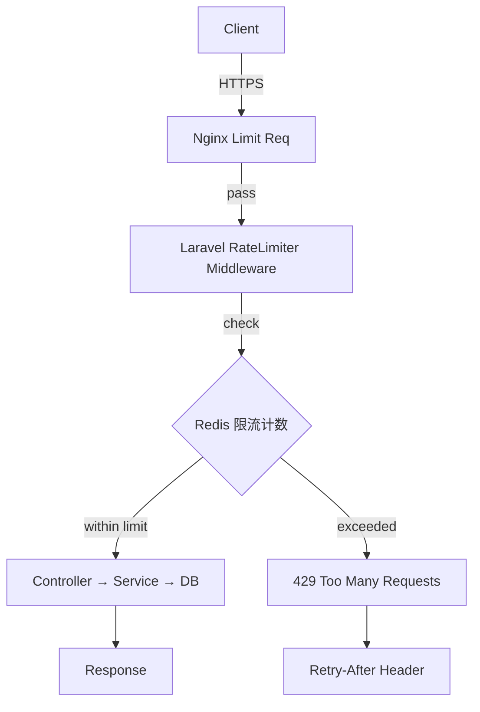
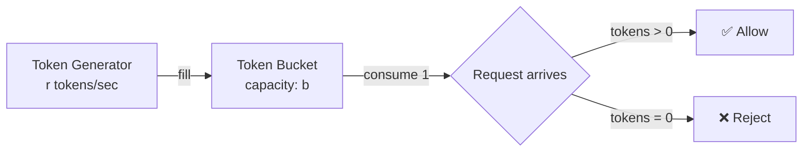

# API 限流实战：Rate Limiting、滑动窗口、令牌桶算法

> 在 B2C 电商 API 中，限流是保护系统稳定性的第一道防线。本文基于 KKday B2C Backend 30+ 仓库的真实经验，从最朴素的固定窗口到生产级的令牌桶，逐层递进讲解三种限流策略的实现、踩坑与选型。

## 为什么需要限流？

在 B2C 场景下，API 面临三类流量冲击：

1. **正常业务高峰**：秒杀、促销活动期间 QPS 暴涨 5-10 倍
2. **爬虫/恶意请求**：竞品爬取商品价格、刷单接口被滥用
3. **客户端 Bug**：移动端重试逻辑失控，同一接口 1 秒内请求 200+ 次

没有限流的 API 就像没有闸门的水坝——一旦洪水来临，数据库连接池耗尽、Redis 命令堆积、PHP-FPM Worker 全部占满，整条链路雪崩。

## 架构总览



实际生产中我们采用**双层限流**：Nginx 层做粗粒度 IP 限流（防 DDoS），Laravel 层做细粒度业务限流（按用户/API Key/接口维度）。


## 策略一：固定窗口（Fixed Window）

最简单的限流思路——每分钟允许 N 次请求。

```php
// app/Http/Middleware/FixedWindowRateLimiter.php
class FixedWindowRateLimiter
{
    public function handle(Request $request, Closure $next, string $key, int $maxAttempts)
    {
        $cacheKey = "rate_limit:{$key}:" . floor(time() / 60);
        $current = (int) Redis::get($cacheKey) ?? 0;

        if ($current >= $maxAttempts) {
            return response()->json([
                'error' => 'Too Many Requests',
                'retry_after' => 60 - (time() % 60),
            ], 429)->header('Retry-After', 60 - (time() % 60));
        }

        Redis::incr($cacheKey);
        Redis::expire($cacheKey, 60);

        return $next($request);
    }
}
```

### 踩坑：窗口边界突刺

固定窗口最大的问题是**边界突刺**（Boundary Spike）：假设限制每分钟 100 次，用户在第 59 秒发了 100 次、第 61 秒又发 100 次——实际 2 秒内通过了 200 次请求，是限制的两倍。

```
时间轴：──────59s──────60s──────61s──────
请求：   ←100次→     ←窗口重置→  ←100次→
实际 2s 内通过 200 次，限流形同虚设
```

这个坑在秒杀场景中尤为致命——竞品爬虫正是利用这个漏洞绕过限流。

## 策略二：滑动窗口（Sliding Window）

滑动窗口通过 Redis Sorted Set 实现精确的请求计数，消除边界突刺。

### Redis Lua 实现

```lua
-- sliding_window_rate_limit.lua
local key = KEYS[1]
local window = tonumber(ARGV[1])   -- 窗口大小（秒）
local max_attempts = tonumber(ARGV[2])
local now = tonumber(ARGV[3])      -- 当前时间戳（微秒）

-- 删除窗口外的旧请求
local window_start = now - window * 1000000
redis.call('ZREMRANGEBYSCORE', key, 0, window_start)

-- 当前窗口内的请求数
local current = redis.call('ZCARD', key)

if current < max_attempts then
    -- 添加当前请求
    redis.call('ZADD', key, now, now .. ':' .. math.random(1000000))
    redis.call('EXPIRE', key, window)
    return {1, max_attempts - current - 1}  -- allowed, remaining
else
    -- 获取最早的请求时间来计算 retry_after
    local oldest = redis.call('ZRANGE', key, 0, 0, 'WITHSCORES')
    local retry_after = 0
    if #oldest > 0 then
        retry_after = math.ceil((tonumber(oldest[2]) + window * 1000000 - now) / 1000000)
    end
    return {0, 0, retry_after}  -- denied, remaining=0, retry_after
end
```

### Laravel 封装

```php
// app/Services/RateLimiter/SlidingWindowLimiter.php
class SlidingWindowLimiter
{
    private string $luaScript;

    public function __construct()
    {
        $this->luaScript = file_get_contents(
            base_path('scripts/sliding_window_rate_limit.lua')
        );
    }

    public function attempt(string $key, int $maxAttempts, int $windowSeconds): RateLimitResult
    {
        $now = (int) (microtime(true) * 1000000);
        $result = Redis::eval(
            $this->luaScript,
            1,                    // number of keys
            "rate_limit:{$key}",  // KEYS[1]
            $windowSeconds,       // ARGV[1]
            $maxAttempts,         // ARGV[2]
            $now                  // ARGV[3]
        );

        return new RateLimitResult(
            allowed: (bool) $result[0],
            remaining: (int) $result[1],
            retryAfter: $result[2] ?? null,
        );
    }
}
```

### 中间件接入

```php
// app/Http/Middleware/SlidingWindowRateLimit.php
class SlidingWindowRateLimit
{
    public function handle(Request $request, Closure $next, string $scope = 'api')
    {
        $limiter = app(SlidingWindowLimiter::class);
        $key = $this->resolveKey($request, $scope);

        $result = $limiter->attempt(
            key: $key,
            maxAttempts: $this->getMaxAttempts($scope),
            windowSeconds: $this->getWindow($scope),
        );

        if (!$result->allowed) {
            return response()->json([
                'error' => 'Rate limit exceeded',
                'retry_after' => $result->retryAfter,
            ], 429)->header('Retry-After', $result->retryAfter);
        }

        $response = $next($request);
        $response->headers->set('X-RateLimit-Remaining', $result->remaining);

        return $response;
    }

    private function resolveKey(Request $request, string $scope): string
    {
        // B2C API 按用户 ID 限流，未登录按 IP
        $userId = $request->user()?->id;
        return $userId ? "user:{$userId}:{$scope}" : "ip:{$request->ip()}:{$scope}";
    }
}
```

### 踩坑：Sorted Set 内存膨胀

**问题**：高流量接口（如商品搜索）QPS 达到 5000+，每个请求在 Sorted Set 中存一条记录，1 分钟窗口 = 300,000 个 member。每个 key 占用约 20MB 内存，50 个接口 × 10,000 用户 = 内存爆炸。

**解决**：对高 QPS 接口改用 `ZREMRANGEBYSCORE` 配合短窗口，或降级为滑动窗口计数器（Sliding Window Counter）——只存上一窗口计数和当前窗口计数，用加权平均估算：

```lua
-- sliding_window_counter.lua（内存优化版）
local prev_key = KEYS[1] .. ':prev'
local curr_key = KEYS[1] .. ':curr'
local window = tonumber(ARGV[1])
local max_attempts = tonumber(ARGV[2])
local now = tonumber(ARGV[3])
local curr_window = math.floor(now / (window * 1000000))
local prev_window = curr_window - 1

-- 窗口切换时，把当前值移到 prev
local prev_count = tonumber(redis.call('GET', prev_key) or 0)
local curr_count = tonumber(redis.call('GET', curr_key) or 0)

if tonumber(redis.call('GET', 'window:' .. KEYS[1]) or 0) ~= curr_window then
    redis.call('SET', prev_key, curr_count)
    redis.call('SET', curr_key, 0)
    redis.call('SET', 'window:' .. KEYS[1], curr_window)
    prev_count = curr_count
    curr_count = 0
end

-- 加权计算：prev_weight + curr_count
local elapsed = (now - curr_window * window * 1000000) / (window * 1000000)
local weighted = prev_count * (1 - elapsed) + curr_count

if weighted < max_attempts then
    redis.call('INCR', curr_key)
    redis.call('EXPIRE', curr_key, window * 2)
    return {1, math.floor(max_attempts - weighted - 1)}
else
    return {0, 0}
end
```

这个优化将内存从 O(N) 降到 O(1)，每个 key 只存 3 个值。

## 策略三：令牌桶（Token Bucket）

令牌桶算法允许**突发流量**——桶满时可以瞬间消费 N 个令牌，然后以固定速率补充。这更符合 B2C 电商的业务特性：用户浏览商品列表时可能瞬间加载多页，但正常速率远低于限制。



### 核心实现

```php
// app/Services/RateLimiter/TokenBucketLimiter.php
class TokenBucketLimiter
{
    /**
     * 令牌桶 Lua 脚本——保证原子性
     *
     * KEYS[1] = bucket key
     * ARGV[1] = capacity (桶容量)
     * ARGV[2] = refill_rate (每秒补充令牌数)
     * ARGV[3] = now (当前时间戳秒)
     * ARGV[4] = requested (请求消耗的令牌数，默认 1)
     */
    private string $lua = <<<LUA
        local key = KEYS[1]
        local capacity = tonumber(ARGV[1])
        local refill_rate = tonumber(ARGV[2])
        local now = tonumber(ARGV[3])
        local requested = tonumber(ARGV[4])

        local data = redis.call('HMGET', key, 'tokens', 'last_refill')
        local tokens = tonumber(data[1]) or capacity
        local last_refill = tonumber(data[2]) or now

        -- 计算应补充的令牌数
        local elapsed = now - last_refill
        local new_tokens = math.min(capacity, tokens + elapsed * refill_rate)

        if new_tokens >= requested then
            new_tokens = new_tokens - requested
            redis.call('HMSET', key, 'tokens', new_tokens, 'last_refill', now)
            redis.call('EXPIRE', key, math.ceil(capacity / refill_rate) * 2)
            return {1, math.floor(new_tokens)}
        else
            redis.call('HMSET', key, 'tokens', new_tokens, 'last_refill', now)
            redis.call('EXPIRE', key, math.ceil(capacity / refill_rate) * 2)
            local wait = math.ceil((requested - new_tokens) / refill_rate)
            return {0, 0, wait}
        end
    LUA;

    public function consume(
        string $key,
        int $capacity,
        float $refillRate,
        int $requested = 1,
    ): TokenBucketResult {
        $result = Redis::eval(
            $this->lua,
            1,
            "token_bucket:{$key}",
            $capacity,
            $refillRate,
            time(),
            $requested,
        );

        return new TokenBucketResult(
            allowed: (bool) $result[0],
            remaining: (int) $result[1],
            retryAfter: $result[2] ?? null,
        );
    }
}
```

### 配置化限流规则

```php
// config/rate_limits.php
return [
    // 商品搜索：每秒补充 10 个令牌，桶容量 50（允许瞬间翻 5 页）
    'product_search' => [
        'capacity' => 50,
        'refill_rate' => 10,
        'scope' => 'user',
    ],
    // 下单接口：每秒 2 个令牌，桶容量 5（防刷单）
    'order_create' => [
        'capacity' => 5,
        'refill_rate' => 2,
        'scope' => 'user',
    ],
    // 支付回调：每秒 20 个，桶容量 100（支付网关批量回调）
    'payment_callback' => [
        'capacity' => 100,
        'refill_rate' => 20,
        'scope' => 'ip',
    ],
    // 短信验证码：每分钟 1 个，桶容量 3
    'sms_code' => [
        'capacity' => 3,
        'refill_rate' => 0.0167,  // 1/60
        'scope' => 'phone',
    ],
];
```

### 踩坑：分布式场景下令牌桶失效

**问题**：Laravel 部署了 4 台 PHP-FPM 服务器，如果令牌桶的 Redis Key 使用本地缓存（`Cache::store('file')`），每台机器各维护一个独立桶，实际吞吐量是配置的 4 倍。

**解决**：令牌桶必须使用 Redis 等共享存储，且 Lua 脚本保证 `HMGET + 计算 + HMSET` 的原子性。我们曾在一个项目中因为用了非原子的 `GET → 计算 → SET`，在高并发下出现令牌超发：

```php
// ❌ 错误：非原子操作，高并发下会超发令牌
$tokens = Redis::get($key);
if ($tokens > 0) {
    Redis::decr($key);  // 另一个进程可能在这之间也读到了 tokens > 0
    return true;
}

// ✅ 正确：Lua 脚本原子操作
$result = Redis::eval($luaScript, 1, $key, ...);
```

## 三种策略对比

| 特性 | 固定窗口 | 滑动窗口 | 令牌桶 |
|------|---------|---------|--------|
| 实现复杂度 | ⭐ | ⭐⭐ | ⭐⭐⭐ |
| 内存占用 | 低 | 中→低(优化版) | 低 |
| 边界突刺 | ❌ 有 | ✅ 无 | ✅ 允许可控突发 |
| 适用场景 | 粗粒度防护 | 精确计数 | 业务 API |
| Redis 操作 | INCR + EXPIRE | ZADD + ZCARD (Lua) | HINCRBY (Lua) |
| 生产推荐 | Nginx 层 | 日志/审计 | **API 业务层首选** |

## 生产环境最佳实践

### 1. 限流响应头规范

```php
// 遵循 IETF draft-ietf-httpapi-ratelimit-headers
$response->headers->set('RateLimit-Limit', $capacity);
$response->headers->set('RateLimit-Remaining', $remaining);
$response->headers->set('RateLimit-Reset', $resetTimestamp);
$response->headers->set('Retry-After', $retryAfter);  // 429 时必带
```

### 2. 限流降级策略

当 Redis 不可用时，不能让限流逻辑阻断所有请求：

```php
public function handle(Request $request, Closure $next)
{
    try {
        $result = $this->limiter->consume(...);
    } catch (\RedisException $e) {
        // Redis 故障时降级放行，记录告警
        report($e);
        return $next($request);  // 放行，但发 Slack 告警
    }
    // ...
}
```

### 3. Nginx 层粗粒度限流

```nginx
# nginx.conf — 作为第一道防线
limit_req_zone $binary_remote_addr zone=api_limit:10m rate=100r/s;
limit_req_status 429;

server {
    location /api/ {
        limit_req zone=api_limit burst=200 nodelay;
        proxy_pass http://laravel_backend;
    }
}
```

### 4. 监控与告警

```php
// 被限流的请求记录到独立日志，用于分析攻击模式
Log::channel('rate_limit')->warning('Rate limit hit', [
    'key' => $key,
    'ip' => $request->ip(),
    'user_id' => $request->user()?->id,
    'path' => $request->path(),
    'user_agent' => $request->userAgent(),
]);
```

## 总结

限流不是"加个中间件"这么简单。在 KKday B2C 30+ 仓库的实践中，我们的经验是：

1. **分层限流**：Nginx（IP 粗粒度）+ Laravel（业务细粒度），不要只靠一层
2. **Lua 原子操作**：Redis 限流必须用 Lua 脚本保证原子性，否则高并发必出 bug
3. **降级放行**：Redis 故障时宁可放行也不能阻断业务，配合告警人工介入
4. **按场景区分**：搜索用令牌桶（允许突发）、下单用滑动窗口（严格计数）、回调用固定窗口（粗粒度）
5. **内存优化**：高 QPS 接口用滑动窗口计数器而非 Sorted Set，否则内存 O(N) 爆炸


选择哪种策略取决于你的业务场景。对于大多数 B2C API，**令牌桶 + Redis Lua** 是最灵活、最实用的方案。

## 相关阅读

- [Redis Lua 脚本原子操作实战：分布式限流、库存扣减、排行榜 — Laravel B2C API 踩坑记录](/databases/redis-lua-guide-distributedrate-limiting/) — 本文限流方案的核心 Redis Lua 脚本详解
- [电商秒杀系统设计：Redis 预扣减 + 消息队列异步下单 + 限流策略实战踩坑记录](/architecture/2026-06-01-flash-sale-system-design-redis-pre-deduction-mq-async-ordering-rate-limiting/) — 秒杀场景下限流与高并发的完整解决方案
- [Redis 实战：缓存穿透/击穿/雪崩防护 — KKday B2C API 真实踩坑记录](/databases/redis-guidecache-penetrationbreakdownavalanche/) — 限流之外的 Redis 生产防护策略
