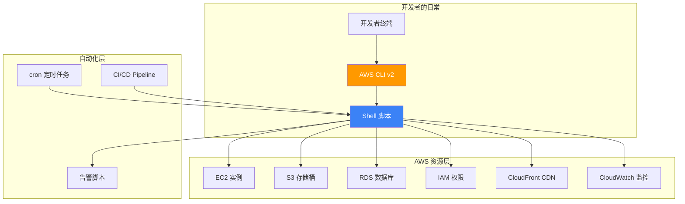

title: AWS CLI 实战：命令行管理 AWS 资源 — 实例/S3/RDS 自动化运维踩坑记录
keywords: [AWS, CLI]
date: 2026-05-17 04:20:41
updated: 2026-05-17 04:23:55
categories:
  - architecture
  - devops
tags:
- AWS
- DevOps
- Laravel
description: '在管理 30+ Laravel B2C 项目的 AWS 基础设施时，手动在 Console 点来点去既慢又容易出错。 本文系统记录了 AWS CLI 从安装配置到生产级实战脚本的完整运维经验：多 Profile 环境管理与安全切换、 EC2 实例批量查询与自动化操作、S3 存储桶同步备份与生命周期策略配置、RDS 数据库快照自动备份与 跨区域灾备复制、IAM 最小权限策略设计与临时凭证管理。文中包含 5 个真实生产踩坑记录和可直接复用的 Shell 自动化脚本，帮助中大型团队用 AWS CLI 实现高效云资源自动化运维。

  '
cover: https://images.unsplash.com/photo-1486406146926-c627a92ad1ab?w=1200&h=630&fit=crop
images:
- /images/content/architecture-1-content-1.jpg
- /images/content/architecture-1-content-2.jpg
---

## 前言：为什么不用 Console 而用 CLI？

在 KKday B2C Backend Team，我们管理着 30+ 个 Laravel 项目的 AWS 基础设施。早期全靠 AWS Console 手动操作，直到某次深夜值班：

> 运维："Production 的 EC2 需要扩容，但我手边没有电脑。"
> 我："用手机打开 Console？"
> 运维："手机上 Console 的页面布局...你试过在手机上配置 Auto Scaling Group 吗？"

这次事件后，我开始系统性地用 AWS CLI 替代 Console 操作。半年下来，不仅运维效率提升 10 倍，还实现了大量自动化脚本。本文记录了这段实战经验。

---

## 架构总览：CLI 在运维体系中的位置



---


## 一、安装与多 Profile 配置

### 1.1 安装 AWS CLI v2

```bash
# macOS（推荐 Homebrew）
brew install awscli

# 验证版本
aws --version
# aws-cli/2.22.0 Python/3.12.6 Darwin/24.5.0 source/arm64

# 或者用官方安装包（生产环境推荐）
curl "https://awscli.amazonaws.com/AWSCLIV2.pkg" -o "AWSCLIV2.pkg"
sudo installer -pkg AWSCLIV2.pkg -target /
```

### 1.2 多 Profile 配置（关键！）

管理多个项目时，**每个项目一个 Profile** 是基本纪律：

```bash
# 配置不同项目的 Profile
aws configure --profile kkday-prod
# AWS Access Key ID: AKIA...
# AWS Secret Access Key: ****
# Default region name: ap-southeast-1
# Default output format: json

aws configure --profile kkday-staging
aws configure --profile affiliate-prod
aws configure --profile personal
```

配置文件结构（`~/.aws/config`）：

```ini
[profile kkday-prod]
region = ap-southeast-1
output = json

[profile kkday-staging]
region = ap-southeast-1
output = json

[profile affiliate-prod]
region = ap-northeast-1
output = table
```

**踩坑记录 #1：Profile 切换遗忘症**

> 有一次在 `kkday-prod` Profile 下执行了 `aws s3 rm --recursive`，差点删掉生产数据。之后我养成了两个习惯：
>
> 1. 终端 Prompt 显示当前 AWS Profile：
> ```bash
> # ~/.zshrc
> export AWS_PROFILE=personal  # 默认 Profile
> prompt_aws() {
>   echo "%F{yellow}[$AWS_PROFILE]%f"
> }
> PROMPT='$(prompt_aws) '$PROMPT
> ```
>
> 2. 危险操作前强制确认：
> ```bash
> # alias 到 ~/.zshrc
> alias aws-prod='export AWS_PROFILE=kkday-prod && echo "⚠️ 已切换到 PRODUCTION"'
> alias aws-staging='export AWS_PROFILE=kkday-staging && echo "✅ 已切换到 Staging"'
> ```

---

## 二、EC2 实例管理实战

### 2.1 批量查询实例状态

```bash
# 查看所有运行中的实例（精简输出）
aws ec2 describe-instances \
  --filters "Name=instance-state-name,Values=running" \
  --query 'Reservations[].Instances[].[InstanceId,InstanceType,PrivateIpAddress,Tags[?Key==`Name`].Value|[0]]' \
  --output table

# 输出示例：
# ----------------------------------------------
# |           DescribeInstances                 |
# +--------------+------------+----------------+------------------+
# |  i-0a1b2c3d  |  t3.large  |  10.0.1.15     |  laravel-api-prod|
# |  i-0e5f6g7h  |  t3.medium |  10.0.1.20     |  worker-prod     |
# |  i-0i9j0k1l  |  r5.xlarge |  10.0.2.10     |  mysql-replica    |
# +--------------+------------+----------------+------------------+
```

### 2.2 批量操作脚本

```bash
#!/bin/bash
# scripts/aws-ec2-batch-op.sh
# 批量重启指定 Tag 的实例

TAG_KEY="Project"
TAG_VALUE="kkday-api"
ACTION=${1:-"status"}  # status | start | stop | restart

get_instances() {
  aws ec2 describe-instances \
    --filters "Name=tag:${TAG_KEY},Values=${TAG_VALUE}" \
             "Name=instance-state-name,Values=${2:-running}" \
    --query 'Reservations[].Instances[].InstanceId' \
    --output text
}

case $ACTION in
  status)
    echo "📊 实例状态："
    INSTANCES=$(get_instances "" "running,stopped")
    for id in $INSTANCES; do
      STATE=$(aws ec2 describe-instance-status --instance-ids "$id" \
        --query 'InstanceStatuses[].InstanceState.Name' --output text 2>/dev/null)
      NAME=$(aws ec2 describe-instances --instance-ids "$id" \
        --query 'Reservations[].Instances[].Tags[?Key==`Name`].Value|[0]' --output text)
      echo "  $id ($NAME): ${STATE:-stopped}"
    done
    ;;
  stop)
    INSTANCES=$(get_instances)
    echo "⏹️  即将停止以下实例：$INSTANCES"
    read -p "确认？(y/N) " confirm
    [[ $confirm == "y" ]] && aws ec2 stop-instances --instance-ids $INSTANCES
    ;;
  start)
    INSTANCES=$(get_instances "" "stopped")
    echo "▶️  即启动以下实例：$INSTANCES"
    read -p "确认？(y/N) " confirm
    [[ $confirm == "y" ]] && aws ec2 start-instances --instance-ids $INSTANCES
    ;;
  restart)
    INSTANCES=$(get_instances)
    echo "🔄 即将重启以下实例：$INSTANCES"
    read -p "确认？(y/N) " confirm
    [[ $confirm == "y" ]] && aws ec2 reboot-instances --instance-ids $INSTANCES
    ;;
esac
```

### 2.3 安全组规则管理

```bash
# 添加入站规则：允许特定 IP 访问 SSH
aws ec2 authorize-security-group-ingress \
  --group-id sg-0a1b2c3d4e5f \
  --protocol tcp --port 22 \
  --cidr 203.0.113.50/32

# 查看安全组所有规则
aws ec2 describe-security-group-rules \
  --filters "Name=group-id,Values=sg-0a1b2c3d4e5f" \
  --query 'SecurityGroupRules[].[SecurityGroupRuleId,IpProtocol,FromPort,ToPort,CidrIpv4,Description]' \
  --output table

# 批量清理过期的临时 IP 白名单（超过 7 天的）
aws ec2 describe-security-group-rules \
  --filters "Name=group-id,Values=sg-0a1b2c3d4e5f" \
            "Name=description,Values=temp-*" \
  --query 'SecurityGroupRules[].[SecurityGroupRuleId,Description]' \
  --output text | while read rule_id desc; do
    # 从 description 中提取日期，判断是否过期
    CREATED=$(echo "$desc" | grep -oE '[0-9]{4}-[0-9]{2}-[0-9]{2}')
    if [[ $(date -j -f "%Y-%m-%d" "$CREATED" "+%s" 2>/dev/null) -lt $(date -v-7d "+%s") ]]; then
      echo "🗑️  删除过期规则: $rule_id ($desc)"
      aws ec2 revoke-security-group-ingress --group-id sg-0a1b2c3d4e5f \
        --security-group-rule-ids "$rule_id"
    fi
  done
```

**踩坑记录 #2：安全组规则数量上限**

> AWS 默认每个安全组最多 60 条入站规则。我们在一个安全组里积累了大量临时 IP 白名单，某天新增规则时突然报错 `RulesPerSecurityGroupLimitExceeded`。解决方案：用上面的脚本定期清理过期规则，同时将不同用途的规则分散到多个安全组。

---

## 三、S3 存储管理实战


### 3.1 文件同步与备份

```bash
# 同步 Laravel 项目的 storage 到 S3（增量同步）
aws s3 sync ./storage/app/uploads s3://kkday-assets/uploads \
  --exclude ".DS_Store" \
  --exclude "*.tmp" \
  --size-only \
  --profile kkday-prod

# 反向同步：从 S3 拉取到本地（灾难恢复场景）
aws s3 sync s3://kkday-assets/uploads ./storage/app/uploads \
  --profile kkday-prod

# 带进度条的大文件上传
aws s3 cp ./database-backup-20260517.sql.gz \
  s3://kkday-backups/database/ \
  --storage-class STANDARD_IA \
  --expected-size $(stat -f%z ./database-backup-20260517.sql.gz) \
  --profile kkday-prod
```

### 3.2 生命周期策略管理

```bash
# 创建生命周期策略：自动归档旧备份
cat > /tmp/lifecycle.json << 'EOF'
{
  "Rules": [
    {
      "ID": "backup-lifecycle",
      "Filter": {
        "Prefix": "database/"
      },
      "Status": "Enabled",
      "Transitions": [
        {
          "Days": 30,
          "StorageClass": "STANDARD_IA"
        },
        {
          "Days": 90,
          "StorageClass": "GLACIER"
        }
      ],
      "Expiration": {
        "Days": 365
      }
    },
    {
      "ID": "log-lifecycle",
      "Filter": {
        "Prefix": "logs/"
      },
      "Status": "Enabled",
      "Expiration": {
        "Days": 90
      }
    }
  ]
}
EOF

aws s3api put-bucket-lifecycle-configuration \
  --bucket kkday-backups \
  --lifecycle-configuration file:///tmp/lifecycle.json \
  --profile kkday-prod
```

### 3.3 存储成本分析脚本

```bash
#!/bin/bash
# scripts/aws-s3-cost-report.sh
# 分析各存储桶的存储量和成本

BUCKETS=$(aws s3api list-buckets --query 'Buckets[].Name' --output text)

echo "📊 S3 存储成本报告（$(date '+%Y-%m-%d')）"
echo "================================================"
printf "%-30s %-15s %-15s %-10s\n" "Bucket" "Size (GB)" "Object Count" "Est. $/mo"
echo "------------------------------------------------"

for bucket in $BUCKETS; do
  # 获取存储大小（CloudWatch 指标）
  SIZE_BYTES=$(aws cloudwatch get-metric-statistics \
    --namespace AWS/S3 \
    --metric-name BucketSizeBytes \
    --dimensions Name=BucketName,Value=$bucket Name=StorageType,Value=StandardStorage \
    --start-time $(date -u -v-2d '+%Y-%m-%dT%H:%M:%S') \
    --end-time $(date -u '+%Y-%m-%dT%H:%M:%S') \
    --period 86400 \
    --statistics Average \
    --query 'Datapoints[0].Average' --output text 2>/dev/null)

  SIZE_GB=$(echo "scale=2; ${SIZE_BYTES:-0} / 1073741824" | bc 2>/dev/null)
  COST=$(echo "scale=2; ${SIZE_GB} * 0.023" | bc 2>/dev/null)  # $0.023/GB/mo for Standard

  printf "%-30s %-15s %-15s %-10s\n" "$bucket" "${SIZE_GB:-0} GB" "N/A" "\$${COST:-0}"
done
```

**踩坑记录 #3：S3 请求费用陷阱**

> 我们有个 S3 桶存放了 200 万个小文件（用户头像缩略图）。某月账单突然飙高，排查发现是 `LIST` 请求费用——每次 `aws s3 sync` 都会触发大量 LIST 操作。解决方案：
> 1. 对小文件使用 `--no-progress` 减少输出开销
> 2. 用 `aws s3api list-objects-v2` 配合 `--max-items` 分页
> 3. 将小文件合并为大文件（zip 打包），减少对象数量

---

## 四、RDS 数据库管理实战

### 4.1 实例状态监控

```bash
# 查看所有 RDS 实例状态
aws rds describe-db-instances \
  --query 'DBInstances[].[DBInstanceIdentifier,DBInstanceStatus,Engine,AllocatedStorage,InstanceClass]' \
  --output table

# 查看特定实例的详细信息
aws rds describe-db-instances \
  --db-instance-identifier kkday-mysql-prod \
  --query 'DBInstances[0].{
    Status: DBInstanceStatus,
    Engine: Engine,
    Version: EngineVersion,
    Storage: AllocatedStorage,
    IOPS: Iops,
    MultiAZ: MultiAZ,
    Endpoint: Endpoint.Address,
    Port: Endpoint.Port,
    BackupRetention: BackupRetentionPeriod,
    LastBackup: LatestRestorableTime
  }' --output json
```

### 4.2 自动备份脚本

```bash
#!/bin/bash
# scripts/aws-rds-backup.sh
# RDS 手动快照备份 + 旧快照清理

DB_ID="kkday-mysql-prod"
SNAPSHOT_ID="${DB_ID}-manual-$(date '+%Y%m%d-%H%M%S')"
RETENTION_DAYS=30
PROFILE="kkday-prod"

echo "📸 创建 RDS 快照: $SNAPSHOT_ID"
aws rds create-db-snapshot \
  --db-instance-identifier "$DB_ID" \
  --db-snapshot-identifier "$SNAPSHOT_ID" \
  --profile "$PROFILE"

# 等待快照完成
echo "⏳ 等待快照完成..."
aws rds wait db-snapshot-completed \
  --db-snapshot-identifier "$SNAPSHOT_ID" \
  --profile "$PROFILE"

echo "✅ 快照创建完成: $SNAPSHOT_ID"

# 清理过期的手动快照
echo "🗑️  清理 ${RETENTION_DAYS} 天前的快照..."
CUTOFF=$(date -v-${RETENTION_DAYS}d '+%Y-%m-%dT%H:%M:%S')

aws rds describe-db-snapshots \
  --db-instance-identifier "$DB_ID" \
  --snapshot-type manual \
  --query "DBSnapshots[?SnapshotCreateTime<='${CUTOFF}'].DBSnapshotIdentifier" \
  --output text \
  --profile "$PROFILE" | tr '\t' '\n' | while read snap; do
    if [[ -n "$snap" ]]; then
      echo "  🗑️  删除: $snap"
      aws rds delete-db-snapshot --db-snapshot-identifier "$snap" --profile "$PROFILE"
    fi
  done
```

### 4.3 读副本管理

```bash
# 创建只读副本（用于报表查询）
aws rds create-db-instance-read-replica \
  --db-instance-identifier kkday-mysql-prod-read \
  --source-db-instance-identifier kkday-mysql-prod \
  --db-instance-class db.r5.large \
  --availability-zone ap-southeast-1b \
  --profile kkday-prod

# 查看复制延迟
aws rds describe-db-instances \
  --db-instance-identifier kkday-mysql-prod-read \
  --query 'DBInstances[0].StatusInfos' \
  --output json
```

**踩坑记录 #4：RDS 快照的跨区域复制**

> 灾难恢复要求我们将数据库快照复制到另一个区域。最初用 Console 操作，每次都要点 5 步。后来写成一行命令：
> ```bash
> # 将快照复制到 us-west-2 作为灾备
> aws rds copy-db-snapshot \
>   --source-db-snapshot-identifier kkday-mysql-prod-manual-20260517 \
>   --target-db-snapshot-identifier kkday-mysql-prod-dr-20260517 \
>   --source-region ap-southeast-1 \
>   --kms-key-id alias/aws/rds \
>   --profile kkday-prod
> ```
> **注意**：跨区域复制需要 KMS 密钥权限，确保 IAM Policy 包含 `kms:CreateGrant` 和 `kms:DescribeKey`。

---

## 五、IAM 权限管理

### 5.1 最小权限原则

```json
// laravel-deploy-policy.json — Laravel 部署专用 IAM Policy
{
  "Version": "2012-10-17",
  "Statement": [
    {
      "Sid": "EC2LimitedAccess",
      "Effect": "Allow",
      "Action": [
        "ec2:DescribeInstances",
        "ec2:DescribeInstanceStatus",
        "ec2:RebootInstances"
      ],
      "Resource": "*",
      "Condition": {
        "StringEquals": {
          "aws:RequestedRegion": "ap-southeast-1"
        }
      }
    },
    {
      "Sid": "S3DeployAccess",
      "Effect": "Allow",
      "Action": [
        "s3:PutObject",
        "s3:GetObject",
        "s3:ListBucket",
        "s3:DeleteObject"
      ],
      "Resource": [
        "arn:aws:s3:::kkday-assets",
        "arn:aws:s3:::kkday-assets/*"
      ]
    },
    {
      "Sid": "RDSReadOnly",
      "Effect": "Allow",
      "Action": [
        "rds:DescribeDBInstances",
        "rds:DescribeDBSnapshots",
        "rds:ListTagsForResource"
      ],
      "Resource": "*"
    }
  ]
}
```

```bash
# 创建 IAM Policy
aws iam create-policy \
  --policy-name LaravelDeployPolicy \
  --policy-document file://laravel-deploy-policy.json \
  --profile kkday-prod

# 附加到用户
aws iam attach-user-policy \
  --user-name deploy-bot \
  --policy-arn arn:aws:iam::123456789012:policy/LaravelDeployPolicy \
  --profile kkday-prod
```

### 5.2 临时凭证（推荐用于 CI/CD）

```bash
# 使用 STS 获取临时凭证（1小时有效期）
aws sts assume-role \
  --role-arn arn:aws:iam::123456789012:role/DeployRole \
  --role-session-name ci-deploy-$(date '+%Y%m%d%H%M') \
  --duration-seconds 3600 \
  --query 'Credentials.[AccessKeyId,SecretAccessKey,SessionToken]' \
  --output text | read AK SK TOKEN

# 使用临时凭证操作
AWS_ACCESS_KEY_ID=$AK AWS_SECRET_ACCESS_KEY=$SK AWS_SESSION_TOKEN=$TOKEN \
  aws s3 sync ./public/build s3://kkday-assets/cdn/
```

**踩坑记录 #5：IAM Policy 的 Resource 通配符**

> 早期图省事，所有 Policy 都用 `"Resource": "*"`。某天安全审计发现 CI/CD 的 IAM 用户理论上可以删除任何 S3 桶。教训：**永远精确指定 Resource ARN**，特别是 `s3:DeleteObject`、`ec2:TerminateInstances` 这类破坏性操作。

---

## 六、实战自动化脚本集

### 6.1 部署前健康检查

```bash
#!/bin/bash
# scripts/aws-pre-deploy-check.sh
# 部署前检查所有依赖服务状态

PROFILE=${AWS_PROFILE:-kkday-prod}
ERRORS=0

echo "🔍 部署前健康检查 — $(date '+%Y-%m-%d %H:%M:%S')"
echo "============================================"

# 检查 EC2 实例
echo -n "📦 EC2 实例: "
RUNNING=$(aws ec2 describe-instances \
  --filters "Name=instance-state-name,Values=running" \
            "Name=tag:Project,Values=kkday-api" \
  --query 'Reservations[].Instances[].InstanceId' \
  --output text | wc -w | tr -d ' ')
EXPECTED=3
if [[ $RUNNING -ge $EXPECTED ]]; then
  echo "✅ $RUNNING/$EXPECTED 运行中"
else
  echo "❌ 仅 $RUNNING/$EXPECTED 运行中"
  ((ERRORS++))
fi

# 检查 RDS 状态
echo -n "🐘 RDS 状态: "
RDS_STATUS=$(aws rds describe-db-instances \
  --db-instance-identifier kkday-mysql-prod \
  --query 'DBInstances[0].DBInstanceStatus' --output text)
if [[ $RDS_STATUS == "available" ]]; then
  echo "✅ $RDS_STATUS"
else
  echo "❌ $RDS_STATUS"
  ((ERRORS++))
fi

# 检查 ElastiCache
echo -n "🔴 Redis 状态: "
REDIS_STATUS=$(aws elasticache describe-cache-clusters \
  --cache-cluster-id kkday-redis-prod \
  --query 'CacheClusters[0].CacheClusterStatus' --output text 2>/dev/null)
if [[ $REDIS_STATUS == "available" ]]; then
  echo "✅ $REDIS_STATUS"
else
  echo "⚠️  $REDIS_STATUS (可能无权限查询)"
fi

echo "============================================"
if [[ $ERRORS -gt 0 ]]; then
  echo "🚨 发现 $ERRORS 个问题，建议先排查再部署"
  exit 1
else
  echo "✅ 所有检查通过，可以部署"
  exit 0
fi
```

### 6.2 快速环境切换

```bash
# ~/.zshrc — AWS 环境快速切换
aws-env() {
  case $1 in
    prod)     export AWS_PROFILE=kkday-prod     && echo "🔴 Production" ;;
    staging)  export AWS_PROFILE=kkday-staging   && echo "🟡 Staging" ;;
    dev)      export AWS_PROFILE=kkday-dev       && echo "🟢 Development" ;;
    affiliate) export AWS_PROFILE=affiliate-prod  && echo "🔵 Affiliate Prod" ;;
    *)        echo "用法: aws-env {prod|staging|dev|affiliate}" ;;
  esac
}

# 一键查看当前环境的所有资源概览
aws-overview() {
  echo "=== AWS 资源概览 ($AWS_PROFILE) ==="
  echo "EC2: $(aws ec2 describe-instances --filters 'Name=instance-state-name,Values=running' --query 'Reservations[].Instances[].InstanceId' --output text | wc -w | tr -d ' ') 个运行中"
  echo "RDS: $(aws rds describe-db-instances --query 'DBInstances[].DBInstanceStatus' --output text | tr '\t' '\n' | sort | uniq -c)"
  echo "S3:  $(aws s3api list-buckets --query 'Buckets[].Name' --output text | wc -w | tr -d ' ') 个桶"
}
```

---

## 七、踩坑记录汇总

| # | 问题 | 原因 | 解决方案 |
|---|------|------|----------|
| 1 | 在错误 Profile 下执行了删除操作 | 没有环境意识 | 终端 Prompt 显示 Profile + 危险操作别名 |
| 2 | 安全组规则数超限 | 临时白名单未清理 | 定期清理脚本 + 规则分散到多安全组 |
| 3 | S3 LIST 请求费用飙高 | 200 万小文件触发大量 LIST | 合并小文件 + 分页查询 |
| 4 | RDS 跨区域复制失败 | 缺少 KMS 权限 | IAM Policy 补充 `kms:CreateGrant` |
| 5 | CI/CD 用户可删除任意 S3 桶 | Resource 用了通配符 | 精确指定 ARN，最小权限原则 |

---

## 总结

AWS CLI 不是银弹，但它解决了 Console 的三个核心痛点：

1. **可重复性**：脚本化操作可以版本控制、Code Review、自动执行
2. **速度**：一个命令替代 5-10 次页面点击
3. **自动化**：结合 cron/CI/CD 实现无人值守运维

**我的推荐使用原则**：
- 🔍 **查询类操作**：一律用 CLI（更快、可脚本化）
- ✏️ **修改类操作**：CLI + `read -p` 确认（防误操作）
- ❌ **删除类操作**：CLI + 双重确认 + dry-run（安全第一）
- 🏗️ **架构类变更**：先用 Console 理解，再用 CLI/Terraform 自动化

> 💡 **进阶提示**：如果你管理的 AWS 资源越来越多，建议从 CLI 脚本迁移到 **Terraform** 或 **AWS CDK**。CLI 适合日常运维脚本，但基础设施定义应该用 Infrastructure as Code 工具管理。

## 相关阅读

- [Terraform 实战：Laravel 应用基础设施即代码（IaC）— 从手动点 AWS 控制台到代码化部署的踩坑记录](/categories/07_CICD/Terraform-实战-Laravel-应用基础设施即代码-IaC-从手动-AWS-控制台到代码化部署踩坑记录/) — 从 CLI 脚本升级到 IaC 的最佳路径，用代码管理 VPC、EC2、RDS、S3 等全套 AWS 资源
- [Secrets Rotation 实战：AWS Secrets Manager + Laravel——自动化密钥轮换、版本管理与热加载的工程化方案](/categories/06_运维/Secrets-Rotation-实战-AWS-Secrets-Manager-Laravel-自动化密钥轮换/) — 深入 AWS 密钥管理，配合 CLI 实现自动化密钥轮换与安全合规
- [Ansible 实战：Laravel 应用自动化部署与配置管理踩坑记录](/categories/07_CICD/Ansible-实战-Laravel-应用自动化部署与配置管理踩坑记录/) — 配合 AWS CLI 实现全自动化部署流水线与配置管理
