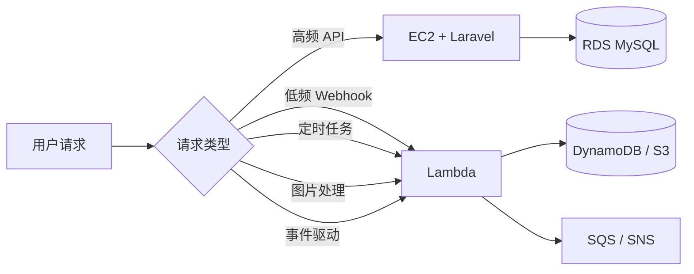
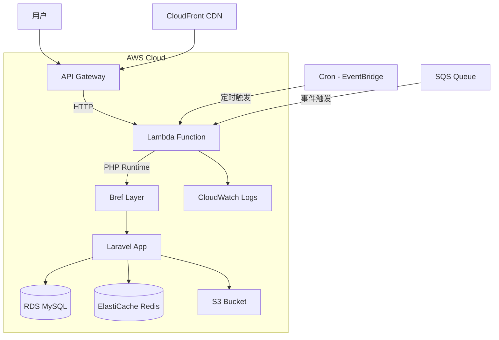
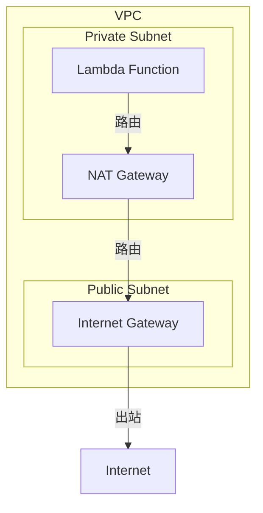
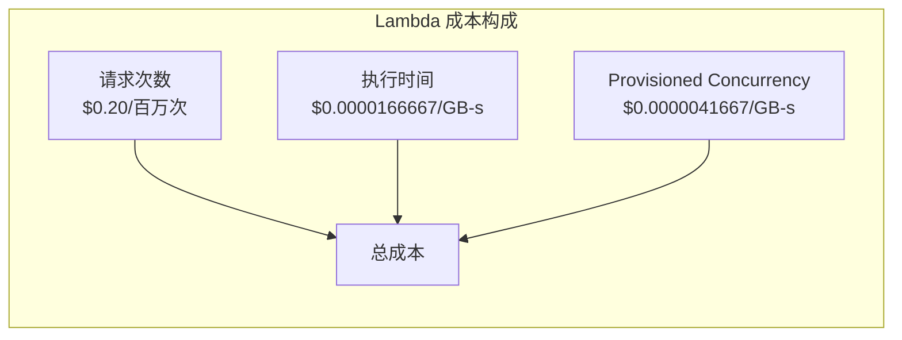
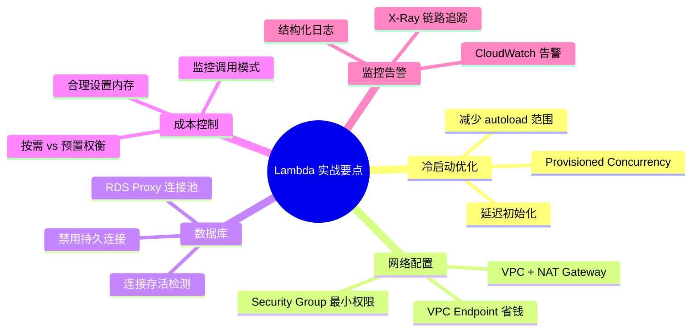

# AWS Lambda 实战：无服务器函数计算（Laravel B2C API 踩坑记录）

> 作为 Laravel 后端开发者，习惯了 PHP-FPM + Nginx 的经典架构。当团队决定将部分轻量服务迁移到 AWS Lambda 时，从"为什么要用 Lambda"到"怎么用好 Lambda"，踩了不少坑。本文基于 B2C 电商场景的真实经验，覆盖 Lambda 从入门到生产的完整链路。

## 为什么选择 Lambda？

在 B2C 电商场景中，并非所有服务都需要 7×24 常驻的 EC2 实例：



**适合 Lambda 的场景**：
- **Webhook 回调**：支付回调（Stripe/Alipay）、第三方通知，流量突发但总体低频
- **定时任务**：报表生成、数据清理、过期订单关闭
- **事件驱动**：S3 图片上传后自动压缩/裁剪、SQS 消息处理
- **轻量 API**：健康检查、配置下发、短链跳转

**不适合 Lambda 的场景**：
- 长连接（WebSocket）→ 用 EC2 + Laravel Reverb
- 重计算任务（> 15 分钟）→ 用 ECS/Fargate
- 需要本地文件系统的应用 → Lambda 只有 `/tmp`（512MB）

## 架构设计：Lambda + API Gateway + Laravel

将 Laravel 应用部署到 Lambda 的主流方案是 **Bref**（PHP on AWS Lambda）：



### Bref 安装与配置


```bash
# 安装 Bref（Laravel 项目）
composer require bref/bref bref/laravel-bridge

# 生成 serverless.yml 配置
php artisan vendor:publish --tag=serverless-config
```

`serverless.yml` 核心配置：

```yaml
service: b2c-api-lambda

provider:
  name: aws
  region: ap-southeast-1
  runtime: php-83
  memorySize: 512          # MB，直接影响 CPU 分配和冷启动时间
  timeout: 30              # 秒，默认 3，最大 900
  environment:
    APP_ENV: production
    DB_CONNECTION: mysql
    CACHE_DRIVER: redis
    QUEUE_CONNECTION: sqs
  vpc:
    securityGroupIds:
      - sg-0xxxxx
    subnetIds:
      - subnet-0xxxxx
      - subnet-0xxxxx

functions:
  # HTTP API（Laravel Web 路由）
  web:
    handler: public/index.php
    description: "B2C API - HTTP Handler"
    layers:
      - ${bref:layer.php-83-fpm}
    events:
      - httpApi: "*"

  # 队列 Worker
  queue:
    handler: artisan
    description: "B2C API - Queue Worker"
    layers:
      - ${bref:layer.php-83}
    timeout: 120
    reservedConcurrency: 10  # 最大并发 Worker 数
    events:
      - sqs:
          arn: !GetAtt Queue.Arn
          batchSize: 10
    artisan:
      job: queue:work sqs --tries=3 --sleep=3

  # 定时任务
  scheduler:
    handler: artisan
    description: "B2C API - Scheduler"
    layers:
      - ${bref:layer.php-83}
    events:
      - schedule:
          rate: rate(1 minute)
          input: "schedule:run"

  # S3 事件：图片处理
  image-processor:
    handler: app/Handlers/ImageProcessor.php
    description: "Image Resize on S3 Upload"
    layers:
      - ${bref:layer.php-83}
    timeout: 60
    memorySize: 1024      # 图片处理需要更多内存
    events:
      - s3:
          bucket: uploads
          event: s3:ObjectCreated:*
          rules:
            - suffix: .jpg
```

## 踩坑实战


### 踩坑 1：冷启动（Cold Start）是最大的敌人

Lambda 冷启动 = 容器初始化 + PHP 运行时加载 + Composer autoload + Laravel 框架引导。实测数据：

| 场景 | 冷启动时间 | 热启动时间 |
|------|-----------|-----------|
| 无 VPC，256MB | 800ms | 15ms |
| 无 VPC，512MB | 400ms | 12ms |
| 有 VPC，512MB | 1.8s | 15ms |
| 有 VPC，1024MB | 900ms | 12ms |

**VPC 是冷启动的元凶**。Lambda 在 VPC 中需要创建 ENI（弹性网络接口），这个过程在冷启动时可能耗时 1 秒以上。

**优化方案**：

```yaml
# serverless.yml - 启用 SnapStart（需 Java Runtime，PHP 不支持）
# 替代方案：Provisioned Concurrency
functions:
  web:
    handler: public/index.php
    layers:
      - ${bref:layer.php-83-fpm}
    provisionedConcurrency: 5   # 预热 5 个实例，消除冷启动
```

**踩坑记录**：我们最初没开 Provisioned Concurrency，凌晨 3 点定时任务触发后，前 2-3 个请求冷启动耗时 2 秒，导致支付回调超时。加上 `provisionedConcurrency: 5` 后，月费增加了约 $15（5 个实例 × 730 小时），但彻底解决了冷启动问题。

```php
// ❌ 错误：在 Lambda Handler 外做重型初始化
// 这段代码在冷启动时每次都会执行
$config = parseLargeConfigFile(); // 耗时 200ms
$connection = createDbConnection(); // 耗时 100ms

// ✅ 正确：延迟初始化，只在热启动中执行
class OrderHandler
{
    private ?PDO $db = null;

    public function handle(array $event): array
    {
        $this->db ??= $this->createConnection(); // 仅冷启动时创建
        // ...
    }
}
```

### 踩坑 2：VPC 配置导致无法访问公网

Lambda 部署在 VPC 中后，默认**无法访问公网**。这意味着调用 Stripe API、发送邮件、访问 S3 都会超时。



**解决方案**：创建 NAT Gateway 并配置路由表：

```yaml
# serverless.yml
provider:
  vpc:
    securityGroupIds:
      - sg-0xxxxx
    subnetIds:
      # 必须放在有 NAT Gateway 路由的私有子网
      - subnet-private-a
      - subnet-private-b

# 或者用 VPC Endpoint 访问 AWS 服务（不走公网，更安全且免费）
resources:
  Resources:
    S3Endpoint:
      Type: AWS::EC2::VPCEndpoint
      Properties:
        ServiceName: !Sub com.amazonaws.${AWS::Region}.s3
        VpcId: vpc-0xxxxx
        RouteTableIds:
          - rtb-0xxxxx
```

**踩坑记录**：我们最初把 Lambda 放在公有子网，以为可以直连公网。结果 Lambda 没有公网 IP（Lambda 永远不会有公网 IP），必须通过 NAT Gateway 出站。NAT Gateway 的费用是 $0.045/小时 + $0.045/GB 数据处理，一个月下来比 Lambda 本身还贵。

### 踩坑 3：Laravel 数据库连接管理

Lambda 的执行模型是"事件驱动、无状态"，但 PHP-FPM 的连接池思维会让人犯错：

```php
// ❌ 错误：在 Handler 外部创建数据库连接
// Lambda 复用容器时，连接可能已断开（MySQL wait_timeout 默认 8 小时）
$db = new PDO('mysql:host=xxx', 'user', 'pass');

// ✅ 正确：在每次请求中检查连接有效性
class DatabaseManager
{
    private static ?PDO $connection = null;

    public static function getConnection(): PDO
    {
        if (self::$connection === null) {
            self::$connection = self::create();
            return self::$connection;
        }

        // 检查连接是否存活
        try {
            self::$connection->query('SELECT 1');
        } catch (PDOException $e) {
            // 连接已断开，重新创建
            self::$connection = self::create();
        }

        return self::$connection;
    }

    private static function create(): PDO
    {
        return new PDO(
            'mysql:host=' . env('DB_HOST') . ';dbname=' . env('DB_DATABASE'),
            env('DB_USERNAME'),
            env('DB_PASSWORD'),
            [
                PDO::ATTR_ERRMODE => PDO::ERRMODE_EXCEPTION,
                PDO::ATTR_PERSISTENT => false, // Lambda 中禁用持久连接
                PDO::ATTR_TIMEOUT => 5,
            ]
        );
    }
}
```

**关键点**：Lambda 容器复用时，PHP 进程不会重启，但底层 TCP 连接可能已经因为 MySQL 的 `wait_timeout` 而断开。Laravel 默认的 `reconnect` 选项在某些情况下不起作用，需要手动处理。

### 踩坑 4：/tmp 存储限制与大文件处理

Lambda 的 `/tmp` 目录最大 512MB（可配置到 10GB），但 `/tmp` 是**实例级别共享**的：

```php
// ❌ 错误：假设 /tmp 是干净的
$tmpFile = '/tmp/upload_' . uniqid() . '.jpg';
file_put_contents($tmpFile, $s3Content);
// 如果容器复用，旧文件可能还在！

// ✅ 正确：每次清理或使用唯一路径
$tmpDir = '/tmp/lambda-' . getmypid();
if (!is_dir($tmpDir)) {
    mkdir($tmpDir, 0755, true);
}
register_shutdown_function(function () use ($tmpDir) {
    // 执行完清理临时文件
    array_map('unlink', glob($tmpDir . '/*'));
    rmdir($tmpDir);
});
```

**实际案例**：我们的图片处理 Lambda 需要下载 S3 原图 → 裁剪压缩 → 上传回 S3。一张 5MB 的原图处理后约 500KB。在高峰期并发 50 个 Lambda 实例，每个占用约 20MB `/tmp` 空间，总共 1GB——超过了默认 512MB 限制。解决方案：将 `/tmp` 配置为 2GB，并在处理完立即清理。

### 踩坑 5：Lambda Layers 管理 PHP 扩展

Bref 提供了预构建的 PHP Layer，但如果你需要额外扩展（如 `imagick`、`bcmath`），需要自建 Layer：

```bash
# 使用 Bref 的额外扩展 Layer
# serverless.yml
functions:
  web:
    layers:
      - ${bref:layer.php-83-fpm}
      - ${bref:extra.imagick-php-83}   # imagick 扩展
      - ${bref:extra.bcmath-php-83}    # bcmath 扩展

# 或者自建 Layer（需要 Docker）
docker run --rm -v $(pwd)/layers:/opt bref/extra-php-extensions \
  --php-extensions imagick,bcmath,gd

# 打包 Layer
cd layers
zip -r ../my-layer.zip .
aws lambda publish-layer-version \
  --layer-name php-extensions \
  --zip-file fileb://../my-layer.zip \
  --compatible-runtimes provided.al2023
```

**踩坑记录**：Layer 有 250MB 的解压大小限制。我们尝试打包 `grpc` + `protobuf` 扩展时，解压后超过了限制。解决方案：只打包必要的 `.so` 文件，去掉调试符号和文档。

## 成本模型与优化

Lambda 的计费模型与 EC2 完全不同：



**真实成本对比**（B2C API，月均 1000 万请求）：

| 方案 | 月成本 | 备注 |
|------|--------|------|
| EC2 t3.medium | $30.37 | 常驻，2 vCPU / 4GB |
| Lambda（按需） | $18.50 | 512MB，平均 50ms/请求 |
| Lambda + Provisioned(5) | $33.50 | 消除冷启动 |
| Lambda + Provisioned(2) | $21.40 | 折中方案 |

**成本优化技巧**：

```php
// 1. 减少内存分配：用完即释放
public function handle(array $event): array
{
    $largeData = $this->fetchFromS3();
    $result = $this->process($largeData);
    unset($largeData); // 显式释放，降低内存峰值
    
    return $result;
}

// 2. 利用容器复用：缓存不变数据
class ConfigCache
{
    private static array $cache = [];

    public static function get(string $key): mixed
    {
        // 容器复用时直接返回缓存，避免重复调用 SSM
        return self::$cache[$key] ??= self::fetchFromSSM($key);
    }
}
```

## 与 Laravel 生态的集成

### SQS 队列集成

```php
// config/queue.php - Lambda 环境使用 SQS
'sqs' => [
    'driver' => 'sqs',
    'key' => env('AWS_ACCESS_KEY_ID'),
    'secret' => env('AWS_SECRET_ACCESS_KEY'),
    'prefix' => env('SQS_PREFIX', 'https://sqs.ap-southeast-1.amazonaws.com/your-account-id'),
    'queue' => env('SQS_QUEUE', 'b2c-default'),
    'region' => env('AWS_DEFAULT_REGION', 'ap-southeast-1'),
],
```

```php
// app/Jobs/ProcessOrder.php
class ProcessOrder implements ShouldQueue
{
    use Dispatchable, InteractsWithQueue, Queueable, SerializesModels;

    public int $tries = 3;
    public int $backoff = 10;        // 重试间隔 10 秒
    public int $timeout = 60;        // Lambda 超时需大于此值
    public int $maxExceptions = 3;

    public function handle(): void
    {
        // 处理订单逻辑
        // Lambda 中不要用 $this->release()，会导致消息重新入队
        // 改用 $this->fail(new \Exception('处理失败'))
    }

    public function failed(\Throwable $exception): void
    {
        // 发送到 SNS 告警
        Notification::route('sns', env('ALERT_SNS_ARN'))
            ->notify(new OrderFailedNotification($this->order, $exception));
    }
}
```

### 环境变量与 Secret 管理

```yaml
# serverless.yml - 使用 SSM Parameter Store
provider:
  environment:
    DB_HOST: ${ssm:/b2c/production/db/host}
    DB_PASSWORD: ${ssm:/b2c/production/db/password~true}  # ~true 表示 SecureString
    STRIPE_SECRET: ${ssm:/b2c/production/stripe/secret~true}
```

```php
// ❌ 错误：在 Lambda 中使用 .env 文件
// .env 文件在部署包中，每次更新需要重新部署

// ✅ 正确：使用 SSM + 缓存
class SSMConfig
{
    private static array $cache = [];

    public static function get(string $path): string
    {
        return self::$cache[$path] ??= cache()->remember(
            "ssm:{$path}",
            now()->addMinutes(5),
            fn () => (new SsmClient([...]))->getParameter([
                'Name' => $path,
                'WithDecryption' => true,
            ])['Parameter']['Value']
        );
    }
}
```

## 监控与调试

```php
// CloudWatch Logs 自动集成，但需要结构化日志
use Illuminate\Support\Facades\Log;

class OrderHandler
{
    public function handle(array $event): array
    {
        Log::info('Lambda invocation started', [
            'request_id' => $event['requestContext']['requestId'] ?? null,
            'function_name' => $_ENV['AWS_LAMBDA_FUNCTION_NAME'] ?? null,
            'memory_limit' => $_ENV['AWS_LAMBDA_FUNCTION_MEMORY_SIZE'] ?? null,
            'remaining_time' => $this->getRemainingTime(),
        ]);

        // 业务逻辑...

        Log::info('Lambda invocation completed', [
            'duration_ms' => round((microtime(true) - $startTime) * 1000),
            'memory_peak_mb' => round(memory_get_peak_usage(true) / 1024 / 1024, 2),
        ]);
    }

    private function getRemainingTime(): int
    {
        // Lambda 提供的剩余执行时间（毫秒）
        return (int) ($_ENV['AWS_LAMBDA_DEADLINE_MS'] ?? 0) - 
               (int) (microtime(true) * 1000);
    }
}
```

**踩坑记录**：Lambda 的 CloudWatch Logs 默认是异步写入的。如果函数超时被 kill，最后几条日志可能丢失。解决方案：在接近超时时主动 flush 日志，或者将关键日志写入 SQS/SNS 作为备份通道。

## 部署与回滚

```bash
# 部署
serverless deploy --stage production

# 查看部署信息
serverless info --stage production

# 回滚到上一个版本
serverless rollback --timestamp 1234567890

# 查看日志
serverless logs -f web --stage production --tail

# 本地测试
serverless invoke local -f web --data '{"httpMethod":"GET","path":"/api/health"}'
```

## 总结



Lambda 不是银弹，但在正确的场景下（低频、事件驱动、突发流量），它能显著降低成本和运维负担。关键是要理解 Lambda 的执行模型（无状态、事件驱动、冷启动），并针对性地优化代码和架构。

## 相关阅读

- [事件驱动架构全景实战：EventBridge/NATS/Pulsar 统一事件总线设计](/categories/架构/事件驱动架构全景实战-EventBridge-NATS-Pulsar-统一事件总线设计/) — 深入理解 Lambda 背后的事件驱动范式，对比 AWS EventBridge、NATS、Pulsar 三大事件总线
- [WebAssembly 后端实战：WasmEdge/Wasmtime 在边缘计算与 Serverless 中的应用](/categories/架构/WebAssembly-后端实战-WasmEdge-Wasmtime-边缘计算与Serverless/) — 另一种 Serverless 运行时方案，Wasm 在冷启动和安全性上的优势
- [Dapr 实战：分布式应用运行时——Laravel 微服务的 Sidecar 模式](/categories/架构/Dapr-实战-分布式应用运行时-Laravel微服务的Sidecar模式服务调用与发布订阅/) — 当 Lambda 不够用时，微服务架构的进阶之路

> **来自选题池**：`.writing-backlog.md` → `AWS Lambda 实战：无服务器函数计算`
> **草稿路径**：`source/_posts/00_架构/AWS-Lambda-实战-无服务器函数计算-Laravel-B2C-API踩坑记录.md`
