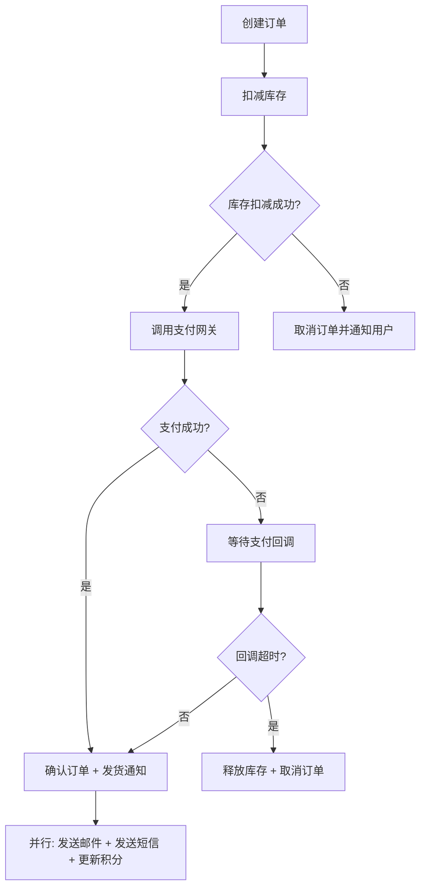
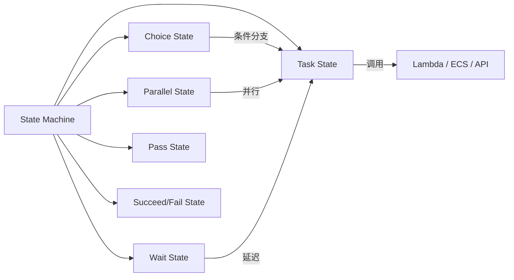
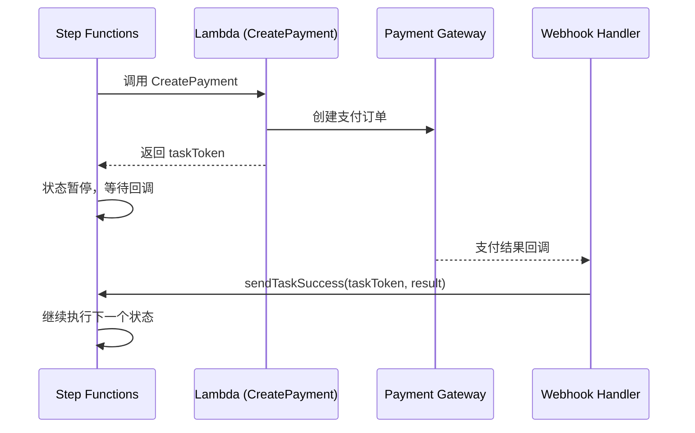
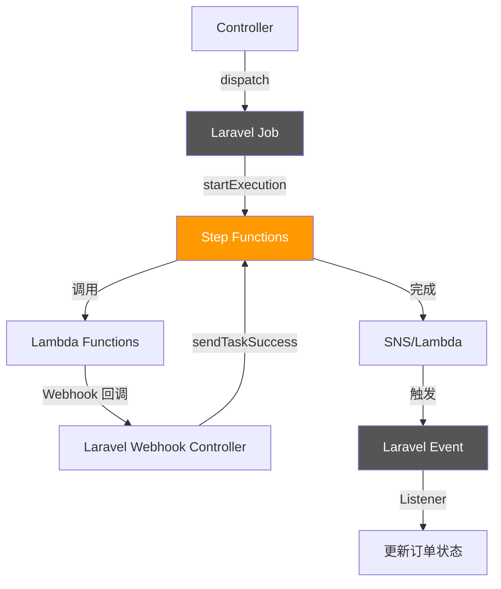

## 前言

在 B2C 电商系统中，一个下单流程往往涉及多个服务的协调：创建订单 → 扣减库存 → 调用支付 → 发送通知 → 更新积分。传统做法是用 Laravel Queue + 事件驱动来串联，但当流程变得复杂（需要条件分支、并行执行、人工审批、超时重试）时，手写编排逻辑就会变成一团意大利面。

AWS Step Functions 是 AWS 提供的**可视化工作流编排服务**，基于状态机（State Machine）模型，用 JSON（Amazon States Language, ASL）定义流程，原生支持并行、等待、重试、回调等能力。本文记录在 KKday B2C 项目中将 Step Functions 引入 Laravel 后端的真实踩坑经验。

<!-- more -->

## 为什么不用 Laravel Queue 直接编排？

先看一个典型的「订单履约」流程：



用 Laravel Queue 串这个流程，你会遇到：

| 痛点 | Queue 方案 | Step Functions 方案 |
|------|-----------|-------------------|
| 条件分支 | `if/else` 散落在 Job 里 | ASL `Choice` 状态声明式定义 |
| 等待回调 | 轮询 DB 或 Redis 标记 | `WaitForTaskToken` 原生支持 |
| 并行执行 | `Bus::batch()` 但错误处理复杂 | `Parallel` 状态自带聚合 |
| 流程可视化 | 无，只能看代码 | AWS Console 直接看执行图 |
| 超时与重试 | 自己写中间件 | ASL 原生 `Retry` / `Catch` |
| 执行历史 | 日志 + Telescope | CloudWatch + 执行详情全链路 |

## Step Functions 核心概念速览




- **State Machine**：工作流的顶层容器
- **Task**：执行实际工作的单元（调用 Lambda、ECS、API Gateway 等）
- **Choice**：条件分支，类似 `switch`
- **Parallel**：并行执行多条分支
- **Wait**：等待指定时间或直到某个时间点
- **Pass**：透传/转换数据，不调用外部服务
- **Catch / Retry**：错误捕获与重试策略

## 实战一：订单履约状态机（ASL 定义）

以下是简化后的订单履约状态机定义：

```json
{
  "Comment": "订单履约工作流 - B2C API",
  "StartAt": "CreateOrder",
  "States": {
    "CreateOrder": {
      "Type": "Task",
      "Resource": "arn:aws:lambda:ap-southeast-1:123456789:function:CreateOrder",
      "Next": "DeductInventory",
      "Retry": [
        {
          "ErrorEquals": ["States.TaskFailed"],
          "IntervalSeconds": 2,
          "MaxAttempts": 3,
          "BackoffRate": 2.0
        }
      ],
      "Catch": [
        {
          "ErrorEquals": ["States.ALL"],
          "Next": "OrderFailed",
          "ResultPath": "$.error"
        }
      ]
    },
    "DeductInventory": {
      "Type": "Task",
      "Resource": "arn:aws:lambda:ap-southeast-1:123456789:function:DeductInventory",
      "InputPath": "$",
      "ResultPath": "$.inventory",
      "Next": "CheckInventoryResult",
      "Retry": [
        {
          "ErrorEquals": ["InventoryInsufficientError"],
          "MaxAttempts": 1
        },
        {
          "ErrorEquals": ["States.TaskFailed"],
          "IntervalSeconds": 3,
          "MaxAttempts": 2,
          "BackoffRate": 2.0
        }
      ],
      "Catch": [
        {
          "ErrorEquals": ["InventoryInsufficientError"],
          "Next": "OrderFailed",
          "ResultPath": "$.error"
        }
      ]
    },
    "CheckInventoryResult": {
      "Type": "Choice",
      "Choices": [
        {
          "Variable": "$.inventory.success",
          "BooleanEquals": true,
          "Next": "InitiatePayment"
        }
      ],
      "Default": "OrderFailed"
    },
    "InitiatePayment": {
      "Type": "Task",
      "Resource": "arn:aws:lambda:ap-southeast-1:123456789:function:InitiatePayment",
      "Next": "WaitPaymentCallback",
      "TimeoutSeconds": 30
    },
    "WaitPaymentCallback": {
      "Type": "Wait",
      "Seconds": 900,
      "Next": "CheckPaymentStatus"
    },
    "CheckPaymentStatus": {
      "Type": "Task",
      "Resource": "arn:aws:lambda:ap-southeast-1:123456789:function:CheckPaymentStatus",
      "Next": "PaymentDecision"
    },
    "PaymentDecision": {
      "Type": "Choice",
      "Choices": [
        {
          "Variable": "$.payment.status",
          "StringEquals": "paid",
          "Next": "ConfirmAndNotify"
        },
        {
          "Variable": "$.retryCount",
          "NumericLessThan": 3,
          "Next": "IncrementRetry"
        }
      ],
      "Default": "PaymentTimeout"
    },
    "IncrementRetry": {
      "Type": "Pass",
      "Parameters": {
        "order.$": "$.order",
        "payment.$": "$.payment",
        "retryCount.$": "States.MathAdd($.retryCount, 1)"
      },
      "Next": "WaitPaymentCallback"
    },
    "ConfirmAndNotify": {
      "Type": "Parallel",
      "Branches": [
        {
          "StartAt": "SendEmail",
          "States": {
            "SendEmail": {
              "Type": "Task",
              "Resource": "arn:aws:lambda:ap-southeast-1:123456789:function:SendEmail",
              "End": true
            }
          }
        },
        {
          "StartAt": "SendSMS",
          "States": {
            "SendSMS": {
              "Type": "Task",
              "Resource": "arn:aws:lambda:ap-southeast-1:123456789:function:SendSMS",
              "End": true
            }
          }
        },
        {
          "StartAt": "UpdateLoyalty",
          "States": {
            "UpdateLoyalty": {
              "Type": "Task",
              "Resource": "arn:aws:lambda:ap-southeast-1:123456789:function:UpdateLoyaltyPoints",
              "End": true
            }
          }
        }
      ],
      "Next": "OrderCompleted"
    },
    "OrderCompleted": {
      "Type": "Succeed"
    },
    "OrderFailed": {
      "Type": "Task",
      "Resource": "arn:aws:lambda:ap-southeast-1:123456789:function:HandleOrderFailure",
      "Next": "OrderCancelled"
    },
    "PaymentTimeout": {
      "Type": "Task",
      "Resource": "arn:aws:lambda:ap-southeast-1:123456789:function:ReleaseInventory",
      "Next": "OrderCancelled"
    },
    "OrderCancelled": {
      "Type": "Fail",
      "Cause": "Order processing failed",
      "Error": "OrderFailedError"
    }
  }
}
```

**关键设计点：**

1. **`Retry` 分层**：`InventoryInsufficientError` 不重试（业务错误），`States.TaskFailed` 指数退避重试（基础设施错误）
2. **`Catch` 粒度**：不同错误类型路由到不同处理状态
3. **`Parallel` 扇出**：邮件/短信/积分并行发送，任一分支失败不影响其他分支（除非需要全部成功）
4. **轮询支付回调**：用 `Wait` + `Choice` + `Pass` 组合实现轮询，比 Lambda 轮询更省成本

## 实战二：Laravel 触发状态机


在 Laravel Controller 中触发 Step Functions 执行：

```php
<?php

namespace App\Services\Workflow;

use Aws\StepFunctions\StepFunctionsClient;
use Illuminate\Support\Facades\Log;

class OrderWorkflowService
{
    private StepFunctionsClient $client;
    private string $stateMachineArn;

    public function __construct()
    {
        $this->client = new StepFunctionsClient([
            'region'      => config('services.aws.region', 'ap-southeast-1'),
            'version'     => 'latest',
            'credentials' => [
                'key'    => config('services.aws.key'),
                'secret' => config('services.aws.secret'),
            ],
        ]);

        $this->stateMachineArn = config('services.aws.step_functions.order_workflow');
    }

    /**
     * 启动订单履约工作流
     */
    public function startOrderWorkflow(array $order): string
    {
        $input = [
            'order' => [
                'id'         => $order['id'],
                'user_id'    => $order['user_id'],
                'amount'     => $order['total_amount'],
                'currency'   => $order['currency'] ?? 'TWD',
                'items'      => $order['items'],
                'created_at' => now()->toIso8601String(),
            ],
            'retryCount' => 0,
        ];

        try {
            $result = $this->client->startExecution([
                'stateMachineArn' => $this->stateMachineArn,
                'name'            => "order-{$order['id']}-" . time(),
                'input'           => json_encode($input),
            ]);

            $executionArn = $result['executionArn'];

            Log::info('Step Functions execution started', [
                'order_id'      => $order['id'],
                'execution_arn' => $executionArn,
            ]);

            // 保存 executionArn 到数据库，方便后续查询/取消
            return $executionArn;

        } catch (\Exception $e) {
            Log::error('Failed to start Step Functions execution', [
                'order_id' => $order['id'],
                'error'    => $e->getMessage(),
            ]);
            throw $e;
        }
    }

    /**
     * 查询执行状态
     */
    public function getExecutionStatus(string $executionArn): array
    {
        $result = $this->client->describeExecution([
            'executionArn' => $executionArn,
        ]);

        return [
            'status'     => $result['status'], // RUNNING, SUCCEEDED, FAILED, TIMED_OUT, ABORTED
            'output'     => $result['output'] ? json_decode($result['output'], true) : null,
            'start_date' => $result['startDate']->format('Y-m-d H:i:s'),
            'stop_date'  => isset($result['stopDate'])
                ? $result['stopDate']->format('Y-m-d H:i:s')
                : null,
        ];
    }

    /**
     * 取消正在执行的工作流
     */
    public function abortExecution(string $executionArn, string $cause = 'User requested abort'): void
    {
        $this->client->stopExecution([
            'executionArn' => $executionArn,
            'cause'        => $cause,
        ]);

        Log::info('Step Functions execution aborted', [
            'execution_arn' => $executionArn,
            'cause'         => $cause,
        ]);
    }
}
```

**踩坑 1：执行名必须唯一**

`startExecution` 的 `name` 参数在同一状态机下必须唯一，否则抛 `ExecutionAlreadyExists` 异常。我一开始用 `order-{id}` 作为名字，如果同一订单因为重试需要重新触发，就会报错。解决方案是加上时间戳或 UUID：

```php
'name' => "order-{$order['id']}-" . uniqid(),
```

**踩坑 2：Input 大小限制**

Step Functions 的输入/输出 JSON 总大小限制为 **256KB**。如果你在 `$.order.items` 里塞了完整的商品快照（包含 SKU 属性、图片 URL 等），很容易超限。实际方案：

```php
// ❌ 不要直接传完整商品数据
$input = [
    'order' => $order->toArray(), // 可能几百 KB
];

// ✅ 只传必要字段，商品详情用 ID 关联
$input = [
    'order' => [
        'id'      => $order->id,
        'item_ids' => $order->items->pluck('id')->toArray(),
        'amount'  => $order->total_amount,
    ],
];
```

**踩坑 3：Lambda 冷启动与超时**

Step Functions 调用 Lambda 时，如果 Lambda 冷启动耗时较长（比如 PHP Bref 运行时），可能触发 `States.Timeout`。解决方案：

```json
{
  "Type": "Task",
  "Resource": "arn:aws:lambda:...:function:DeductInventory",
  "TimeoutSeconds": 60,
  "HeartbeatSeconds": 30,
  "Retry": [
    {
      "ErrorEquals": ["States.Timeout"],
      "IntervalSeconds": 5,
      "MaxAttempts": 2,
      "BackoffRate": 2.0
    }
  ]
}
```

`HeartbeatSeconds` 用于长时间任务的心跳检测——Lambda 函数每 30 秒发送一次心跳，如果超过 60 秒没有心跳，Step Functions 认为超时。

## 实战三：Task Token 回调模式（人工审批场景）

有些场景需要等待外部系统回调，比如支付网关的异步通知。Step Functions 提供了 **Task Token** 机制：



在 ASL 中定义：

```json
{
  "WaitForPaymentCallback": {
    "Type": "Task",
    "Resource": "arn:aws:states:ap-southeast-1:123456789:activity:PaymentCallback",
    "TimeoutSeconds": 3600,
    "Next": "ProcessPaymentResult",
    "Catch": [
      {
        "ErrorEquals": ["States.Timeout"],
        "Next": "PaymentTimeout"
      }
    ]
  }
}
```

Laravel 端发送回调：

```php
<?php

namespace App\Http\Controllers\Webhooks;

use App\Http\Controllers\Controller;
use Aws\StepFunctions\StepFunctionsClient;
use Illuminate\Http\Request;
use Illuminate\Support\Facades\Log;

class PaymentWebhookController extends Controller
{
    public function handle(Request $request)
    {
        $payload = $request->all();

        // 验证支付回调签名（必须！）
        if (!$this->verifySignature($payload, $request->header('X-Signature'))) {
            return response()->json(['error' => 'Invalid signature'], 401);
        }

        // 从自定义字段获取 taskToken（创建支付时存入）
        $taskToken = $this->extractTaskToken($payload['order_id']);
        if (!$taskToken) {
            Log::warning('No taskToken found for order', ['order_id' => $payload['order_id']]);
            return response()->json(['status' => 'ignored']);
        }

        $client = new StepFunctionsClient([
            'region'  => config('services.aws.region'),
            'version' => 'latest',
        ]);

        try {
            if ($payload['status'] === 'paid') {
                $client->sendTaskSuccess([
                    'taskToken' => $taskToken,
                    'output'    => json_encode([
                        'payment' => [
                            'transaction_id' => $payload['transaction_id'],
                            'amount'         => $payload['amount'],
                            'status'         => 'paid',
                            'paid_at'        => $payload['paid_at'],
                        ],
                    ]),
                ]);
            } else {
                $client->sendTaskFailure([
                    'taskToken' => $taskToken,
                    'error'     => 'PaymentFailed',
                    'cause'     => $payload['failure_reason'] ?? 'Unknown',
                ]);
            }

            return response()->json(['status' => 'ok']);

        } catch (\Exception $e) {
            Log::error('Failed to report task result', [
                'error' => $e->getMessage(),
            ]);
            return response()->json(['error' => 'Internal error'], 500);
        }
    }

    private function verifySignature(array $payload, ?string $signature): bool
    {
        $expected = hash_hmac('sha256', json_encode($payload), config('services.payment.webhook_secret'));
        return hash_equals($expected, $signature ?? '');
    }

    private function extractTaskToken(string $orderId): ?string
    {
        // 从 Redis 或 DB 获取创建支付时保存的 taskToken
        return cache()->get("stepfn:task_token:{$orderId}");
    }
}
```

**踩坑 4：Task Token 过期**

Task Token 有 **最长 1 年** 的有效期（由状态机的 `TimeoutSeconds` 控制），但如果状态机执行被取消或超时，Token 立即失效。如果你的 Webhook handler 调用 `sendTaskSuccess` 时 Token 已过期，会收到 `TaskDoesNotExist` 异常。必须优雅处理：

```php
catch (StepFunctionsException $e) {
    if ($e->getAwsErrorCode() === 'TaskDoesNotExist') {
        Log::warning('Task token expired, payment callback ignored', [
            'order_id' => $orderId,
        ]);
        // 记录到 pending_payment 表，人工处理
        return response()->json(['status' => 'token_expired']);
    }
    throw $e;
}
```

## 实战四：Express vs Standard 执行模式

Step Functions 有两种执行模式，选错会多花冤枉钱：

| 特性 | Standard | Express |
|------|----------|---------|
| 最长执行时间 | 1 年 | 5 分钟 |
| 执行历史保留 | 90 天 | CloudWatch Logs |
| 定价 | 按状态转换次数（$0.025/千次） | 按执行次数（$1/百万次） |
| 启动延迟 | 秒级 | 毫秒级 |
| 适用场景 | 长流程、人工审批、ETL | API 背景流程、事件处理 |

**我们的选择：**

- **订单履约（Standard）**：需要等待支付回调，最长可能等 15 分钟
- **库存同步（Express）**：Lambda 触发的批量库存校验，30 秒内完成
- **推荐邮件（Express）**：异步发送，不关心结果

```php
// Express 模式启动（同步等结果，适合短流程）
$result = $client->startSyncExecution([
    'stateMachineArn' => $expressStateMachineArn,
    'input'           => json_encode($input),
]);

// Standard 模式启动（异步，长流程）
$result = $client->startExecution([
    'stateMachineArn' => $standardStateMachineArn,
    'input'           => json_encode($input),
]);
```

## 实战五：本地开发与测试

### 用 SAM Local 测试状态机

```yaml
# template.yaml
AWSTemplateFormatVersion: '2010-09-09'
Transform: AWS::Serverless-2016-10-31

Resources:
  OrderWorkflow:
    Type: AWS::Serverless::StateMachine
    Properties:
      DefinitionUri: statemachine/order_workflow.asl.json
      Type: STANDARD
      Policies:
        - LambdaInvokePolicy:
            FunctionName: !Ref CreateOrderFunction
        - LambdaInvokePolicy:
            FunctionName: !Ref DeductInventoryFunction

  CreateOrderFunction:
    Type: AWS::Serverless::Function
    Properties:
      Runtime: php83
      Handler: create_order.php
      CodeUri: functions/
```

本地测试：

```bash
# 启动本地 Step Functions
sam local start-step-functions

# 执行一次测试
aws stepfunctions start-execution \
  --state-machine-arn arn:aws:states:us-east-1:123456789:stateMachine:OrderWorkflow \
  --input '{"order":{"id":"test-001","user_id":1,"amount":999,"items":[]}}'
```

### 用 Step Functions Local（Docker 方式）

```yaml
# docker-compose.yml
services:
  stepfunctions:
    image: amazon/aws-stepfunctions-local:latest
    ports:
      - "8083:8083"
    environment:
      - AWS_DEFAULT_REGION=ap-southeast-1
      - AWS_ACCESS_KEY_ID=test
      - AWS_SECRET_ACCESS_KEY=test
      - LAMBDA_ENDPOINT=http://host.docker.internal:3001
```

## 实战六：与 Laravel 事件系统集成

完整的集成架构：



```php
<?php

namespace App\Jobs;

use App\Events\OrderWorkflowCompleted;
use App\Services\Workflow\OrderWorkflowService;
use Illuminate\Bus\Queueable;
use Illuminate\Contracts\Queue\ShouldQueue;
use Illuminate\Foundation\Bus\Dispatchable;
use Illuminate\Queue\InteractsWithQueue;
use Illuminate\Queue\SerializesModels;

class StartOrderWorkflow implements ShouldQueue
{
    use Dispatchable, InteractsWithQueue, Queueable, SerializesModels;

    public function __construct(
        private readonly array $orderData,
    ) {}

    public function handle(OrderWorkflowService $service): void
    {
        $executionArn = $service->startOrderWorkflow($this->orderData);

        // 保存 executionArn 到订单表
        \App\Models\Order::where('id', $this->orderData['id'])
            ->update(['workflow_execution_arn' => $executionArn]);
    }
}
```

## 真实踩坑总结

| # | 问题 | 根因 | 解决方案 |
|---|------|------|---------|
| 1 | 执行名重复报错 | 同名执行不会自动覆盖 | 名字加 UUID/时间戳 |
| 2 | Input 超 256KB | 传了完整商品快照 | 只传 ID，Lambda 按需查询 |
| 3 | Lambda 冷启动导致超时 | PHP Bref 冷启动 2-5s | 配置 Provisioned Concurrency 或用 SnapStart |
| 4 | Parallel 分支一个失败全部回滚 | Parallel 默认 ALL 必须成功 | 非关键分支加 `Catch` 静默错误 |
| 5 | 状态机更新后执行混乱 | 更新 ASL 时正在运行的执行用旧定义 | 先 `StopExecution` 再更新，或用版本+别名 |
| 6 | CloudWatch 日志不全 | Express 模式日志量大被采样 | 配置 Log Level 为 `ALL` + 设置保留策略 |
| 7 | API Gateway 触发 Step Functions 超时 | API Gateway 30 秒限制 | 用 `StartSyncExecution` 返回执行 ARN，客户端轮询 |

## 成本估算（真实数据）

以月均 10 万笔订单计算（Standard 模式，每单平均 8 次状态转换）：

```
状态转换费用：100,000 × 8 = 800,000 次
Standard 定价：$0.025 / 1,000 次
月费用：800,000 / 1,000 × $0.025 = $20/月

对比 Express 模式（如果场景允许）：
$1 / 1,000,000 次执行 = $0.1/月
```

**结论**：对于 B2C 订单级别的规模，Step Functions 的成本可以忽略不计，远低于自己维护状态机代码的开发和运维成本。

## 何时该用 / 不该用 Step Functions

**✅ 适合的场景：**
- 多服务协调编排（订单、支付、库存、通知）
- 需要人工审批的流程（合同签署、退款审核）
- 定时 ETL 任务（配合 EventBridge Scheduler）
- 微服务 Saga 模式的编排者

**❌ 不适合的场景：**
- 简单的「发布-订阅」→ 用 SNS + SQS
- 超高并发单步任务 → 直接用 Lambda
- 需要共享状态的实时处理 → 用 ECS Fargate
- 已有成熟的 BPMN 引擎（如 Camunda）→ 不要重复造轮子

## 总结

Step Functions 的本质是「把编排逻辑从代码中抽出来，变成声明式的 JSON 配置」。它的核心价值不是省代码，而是让**流程可视化、错误可追溯、重试可配置**。对于 Laravel 项目来说，Step Functions 不是替代 Queue，而是在 Queue 之上增加了一层编排能力——你的 Job 依然可以跑在 SQS 上，但整体流程由 Step Functions 统一调度。

如果你的订单流程已经复杂到「画个流程图都要一整屏」，那就是时候考虑 Step Functions 了。
