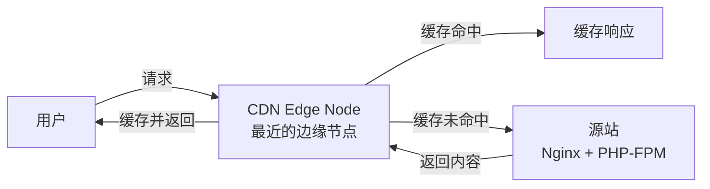
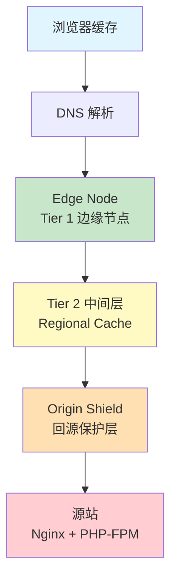
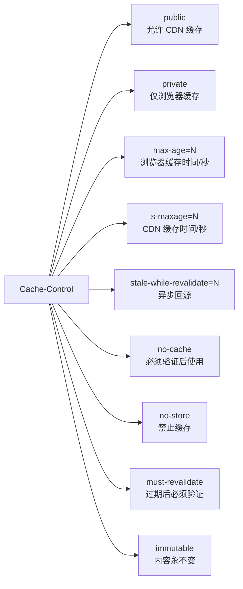
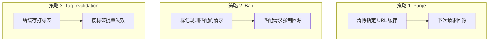

# CDN 配置实战：静态资源加速与缓存失效策略

> "CDN 是离用户最近的缓存层，但也是最容易让开发者掉坑里的缓存层。"

## 一、问题背景与动机

### 1.1 为什么 B2C 电商需要 CDN？

在 KKday B2C API 项目中，我们面临一个典型的性能瓶颈：

- **静态资源加载慢**：商品详情页包含大量图片、CSS、JS，用户分布在亚洲各地区，直连源站延迟 200-500ms
- **API 响应压力大**：热门活动页面并发请求峰值达到 5000 QPS，源站（单台 Nginx + PHP-FPM）扛不住
- **带宽成本高**：每月源站出口带宽账单超过 $3000，其中 70% 是重复请求同一份静态文件

CDN（Content Delivery Network）的核心价值就是三个词：**就近访问、减少回源、降低成本**。



### 1.2 CDN 不只是"把文件放到远方"

很多开发者对 CDN 的理解停留在"把静态文件推到 CDN 就完事了"。但实际生产中，真正的挑战是：

1. **缓存命中率**：如果 CDN 频繁回源，加速效果大打折扣
2. **缓存失效**：新版本上线后，用户还在看旧的 CSS/JS，页面样式错乱
3. **动态内容加速**：API 响应能否也走 CDN 缓存？怎么保证数据新鲜度？
4. **多 CDN 策略**：不同资源走不同 CDN（图片走 CloudFront，API 走 Cloudflare）

本文将从 **架构设计、Cache-Control 协议、缓存失效策略、真实踩坑** 四个维度，深入剖析 CDN 在 Laravel B2C 场景中的实战经验。


---

## 二、CDN 缓存架构设计原理

### 2.1 多层缓存架构

一个生产级的 CDN 缓存架构通常是多层的：



各层职责：

| 层级 | 位置 | TTL 通常设置 | 作用 |
|------|------|-------------|------|
| **浏览器缓存** | 用户设备 | 7-30 天 | 最近的缓存，零网络延迟 |
| **Edge Node** | CDN 边缘节点 | 1-24 小时 | 覆盖用户区域，90%+ 命中率 |
| **Mid-Tier** | CDN 区域中心 | 24-72 小时 | 减少 Edge 层回源压力 |
| **Origin Shield** | CDN 指定回源点 | 不缓存 | 聚合回源请求，保护源站 |

### 2.2 Cache-Control 协议深度解析

CDN 的缓存行为完全由 HTTP 响应头中的 `Cache-Control` 指令驱动。这是最容易被忽略但最关键的部分。

```
HTTP/1.1 200 OK
Cache-Control: public, max-age=3600, s-maxage=86400, stale-while-revalidate=600
ETag: "abc123"
Last-Modified: Wed, 21 May 2026 07:28:00 GMT
```

**核心指令解析：**



**实战配置对比：**

| 资源类型 | Cache-Control 策略 | 说明 |
|---------|-------------------|------|
| **带 Hash 的 JS/CSS** | `public, max-age=31536000, immutable` | 文件名含 hash，内容永不变，缓存 1 年 |
| **HTML 入口页面** | `public, max-age=0, must-revalidate` | 每次都验证，确保引用最新资源 |
| **商品图片** | `public, max-age=86400, s-maxage=604800` | 浏览器 1 天，CDN 7 天 |
| **API JSON 响应** | `public, max-age=60, s-maxage=300, stale-while-revalidate=60` | 短缓存 + 异步回源 |
| **用户个人信息** | `private, no-store` | 禁止 CDN 缓存 |
| **登录/注册页面** | `private, no-cache` | 浏览器可缓存但必须验证 |

### 2.3 条件请求与验证机制

当缓存过期后，CDN 不会直接重新拉取完整内容，而是先用条件请求验证内容是否真的变了：

```
# CDN 向源站发起条件请求
GET /images/product-123.jpg HTTP/1.1
Host: origin.example.com
If-None-Match: "abc123"
If-Modified-Since: Wed, 21 May 2026 07:28:00 GMT

# 源站返回 304（内容未变）
HTTP/1.1 304 Not Modified
ETag: "abc123"
```

**关键理解**：304 响应不含 body，传输数据量极小（通常 < 1KB），但仍然需要一次完整的 HTTP 往返。这就是为什么 `stale-while-revalidate` 如此重要 —— 它允许 CDN 先返回旧内容，同时在后台异步验证。

---

## 三、缓存失效策略深度剖析

缓存失效是 CDN 最复杂的部分，也是最容易出问题的地方。


### 3.1 三种失效策略对比



| 策略 | 机制 | 粒度 | 延迟 | 适用场景 | 代表产品 |
|------|------|------|------|---------|---------|
| **Purge** | 删除指定 URL 缓存 | 单个 URL | 秒级 | 单个资源更新 | CloudFront, Cloudflare |
| **Ban** | 规则匹配标记失效 | URL 模式 | 秒级 | 批量资源更新 | Varnish |
| **Tag Invalidation** | 按标签关联失效 | 标签组 | 秒级 | 关联资源更新 | Cloudflare, Fastly |

### 3.2 Laravel 实现：Tag-Based 缓存失效

Tag-based invalidation 是最优雅的策略。Laravel 的 Cache Tag 机制天然支持这个模式：

```php
<?php

namespace App\Services\CDN;

use Illuminate\Support\Facades\Cache;
use Illuminate\Support\Facades\Http;

class CdnCacheManager
{
    /**
     * CloudFront Distribution ID
     */
    private string $distributionId;
    
    /**
     * CloudFront API endpoint
     */
    private string $apiEndpoint;

    public function __construct()
    {
        $this->distributionId = config('services.cloudfront.distribution_id');
        $this->apiEndpoint = config('services.cloudfront.api_endpoint');
    }

    /**
     * 按标签批量失效 CDN 缓存
     *
     * 工作流：
     * 1. 先失效 Laravel 本地缓存（Tag）
     * 2. 再调用 CDN API 创建 Invalidation
     * 3. 记录失效任务到队列，异步监控完成状态
     *
     * @param array $tags 需要失效的标签列表
     * @param string $reason 失效原因（用于审计日志）
     * @return array 失效任务 ID 列表
     */
    public function invalidateByTags(array $tags, string $reason = ''): array
    {
        $invalidationIds = [];

        // Step 1: 清除本地缓存
        Cache::tags($tags)->flush();

        // Step 2: 按标签构建需要失效的 URL 模式
        $paths = $this->resolvePathsByTags($tags);

        // Step 3: 批量创建 CDN Invalidation
        foreach (array_chunk($paths, 30) as $chunk) {
            $invalidationId = $this->createCloudFrontInvalidation($chunk);
            $invalidationIds[] = $invalidationId;
        }

        // Step 4: 记录审计日志
        $this->logInvalidation($tags, $paths, $invalidationIds, $reason);

        return $invalidationIds;
    }

    /**
     * 通过 CloudFront API 创建 Invalidation
     *
     * CloudFront 的 Invalidation 配额：
     * - 免费：每月 1000 条路径
     * - 超出后：$0.005/条路径
     * - 支持通配符：/images/products/*
     */
    private function createCloudFrontInvalidation(array $paths): string
    {
        $callerReference = uniqid('invalidation-');
        
        $response = Http::withHeaders([
            'Authorization' => $this->getSignature(),
            'Content-Type' => 'application/xml',
        ])->post("{$this->apiEndpoint}/distribution/{$this->distributionId}/invalidation", [
            'InvalidationBatch' => [
                'Paths' => [
                    'Quantity' => count($paths),
                    'Items' => $paths,
                ],
                'CallerReference' => $callerReference,
            ],
        ]);

        if ($response->failed()) {
            throw new CdnInvalidationException(
                "CloudFront invalidation failed: {$response->body()}"
            );
        }

        return $response->json('Invalidation.Id');
    }

    /**
     * 根据标签解析对应的 URL 路径
     *
     * 标签到路径的映射关系：
     * - product:{id}  → /api/products/{id}*, /images/products/{id}*
     * - category:{id} → /api/categories/{id}*, /images/categories/{id}*
     * - homepage       → /, /api/homepage/*
     */
    private function resolvePathsByTags(array $tags): array
    {
        $paths = [];

        foreach ($tags as $tag) {
            [$type, $id] = explode(':', $tag, 2) + [1 => null];

            match ($type) {
                'product' => $paths = array_merge($paths, [
                    "/api/products/{$id}*",
                    "/images/products/{$id}*",
                ]),
                'category' => $paths = array_merge($paths, [
                    "/api/categories/{$id}*",
                    "/api/categories/{$id}/products*",
                    "/images/categories/{$id}*",
                ]),
                'homepage' => $paths = array_merge($paths, [
                    '/',
                    '/api/homepage*',
                ]),
                default => $paths[] = "/{$type}/*",
            };
        }

        return array_unique($paths);
    }
}
```

### 3.3 Varnish Ban 策略实现

如果你使用 Varnish 作为 CDN 的中间层或自建 CDN，Ban 策略更为灵活：

```vcl
# default.vcl - Varnish 配置

vcl 4.0;

backend origin {
    .host = "127.0.0.1";
    .port = "8080";
    .connect_timeout = 5s;
    .first_byte_timeout = 30s;
}

sub vcl_recv {
    # 启用 grace mode：允许返回过期内容（减少回源）
    set req.grace = 60s;
    
    # API 请求不缓存 POST
    if (req.method == "POST") {
        return (pass);
    }
    
    # 带 Ban-Token 的请求触发 ban
    if (req.http.X-Ban-Token) {
        ban("req.http.host == " + req.http.host + 
            " && req.url ~ " + req.http.X-Ban-Pattern);
        return (synth(200, "Banned"));
    }
    
    return (hash);
}

sub vcl_backend_response {
    # 设置 TTL（优先使用后端的 Cache-Control）
    if (beresp.http.Cache-Control ~ "s-maxage=(\d+)") {
        set beresp.ttl = regsub(beresp.http.Cache-Control, ".*s-maxage=(\d+).*", "\1s");
    }
    
    # stale-while-revalidate：允许返回过期内容
    if (beresp.http.Cache-Control ~ "stale-while-revalidate=(\d+)") {
        set beresp.grace = regsub(beresp.http.Cache-Control, ".*stale-while-revalidate=(\d+).*", "\1s");
    }
    
    # 自定义 ban-lurker 支持
    set beresp.http.X-Cache-Tags = beresp.http.X-Cache-Tags;
}

sub vcl_deliver {
    # 移除内部头
    unset resp.http.X-Cache-Tags;
    unset resp.http.X-Varnish;
    
    # 添加 CDN 命中状态
    if (obj.hits > 0) {
        set resp.http.X-Cache = "HIT (" + obj.hits + ")";
    } else {
        set resp.http.X-Cache = "MISS";
    }
}
```

**Varnish Ban 表达式示例：**

```bash
# 失效单个 URL
varnishadm 'ban req.url == "/api/products/123"'

# 失效某个目录下所有资源（正则匹配）
varnishadm 'ban req.url ~ "^/images/products/"'

# 按标签失效（结合 X-Cache-Tags 响应头）
varnishadm 'ban obj.http.X-Cache-Tags ~ "product:123"'

# 组合条件：失效特定域名 + 路径
varnishadm 'ban req.http.host == "cdn.example.com" && req.url ~ "\.(css|js)$"'
```

---

## 四、Laravel 集成：从代码到 CDN 的完整链路

### 4.1 Vite 带 Hash 的静态资源策略

Laravel + Vite 构建的前端资源天然支持 CDN 长缓存：

```php
// config/app.php 或 .env 配置
// Vite 自动为 CSS/JS 文件名添加 content hash
// 例如：app.Ds7Kj9Lm.js → 内容变了 hash 就变

// vite.config.js
import { defineConfig } from 'vite';
import laravel from 'laravel-vite-plugin';

export default defineConfig({
    plugins: [
        laravel({
            input: ['resources/css/app.css', 'resources/js/app.js'],
            refresh: true,
        }),
    ],
    build: {
        // 关键：启用内容 hash
        rollupOptions: {
            output: {
                // 生产环境文件名带 hash
                entryFileNames: 'assets/[name].[hash].js',
                chunkFileNames: 'assets/[name].[hash].js',
                assetFileNames: 'assets/[name].[hash].[ext]',
            },
        },
    },
});
```

**Nginx 配置：为带 hash 的文件设置长缓存**

```nginx
server {
    listen 443 ssl;
    server_name cdn.example.com;

    # 带 hash 的静态资源 → 缓存 1 年
    location ~* /assets/.*\.(js|css|woff2?|ttf|eot)$ {
        add_header Cache-Control "public, max-age=31536000, immutable";
        add_header X-Cache-Status $upstream_cache_status;
        
        # 关闭 ETag（文件名已有 hash，不需要验证）
        etag off;
        
        # gzip 压缩
        gzip on;
        gzip_types text/css application/javascript;
        gzip_min_length 1024;
    }

    # HTML 入口 → 不缓存或短缓存
    location ~* \.html$ {
        add_header Cache-Control "public, max-age=0, must-revalidate";
        add_header X-Cache-Status $upstream_cache_status;
    }

    # 图片资源 → 中等缓存
    location ~* \.(jpg|jpeg|png|gif|webp|avif)$ {
        add_header Cache-Control "public, max-age=86400, s-maxage=604800";
        add_header X-Cache-Status $upstream_cache_status;
        
        # WebP 优先
        add_header Vary Accept;
        
        # 图片优化
        image_filter_buffer 10M;
    }
}
```

### 4.2 API 响应的 CDN 缓存策略

API 响应能否走 CDN？答案是：**可以，但必须精细控制**。

```php
<?php

namespace App\Http\Middleware;

use Closure;
use Illuminate\Http\Request;

class CdnCacheMiddleware
{
    /**
     * API 响应 CDN 缓存中间件
     *
     * 根据路由配置自动设置 Cache-Control 头
     * 支持：public/private、max-age/s-maxage、stale-while-revalidate
     */
    public function handle(Request $request, Closure $next)
    {
        $response = $next($request);

        // 仅缓存 GET 请求
        if (!$request->isMethod('GET')) {
            return $response;
        }

        // 路由级别的缓存配置
        $cacheConfig = $request->route()?->getAction('cdn_cache') ?? [];

        if (empty($cacheConfig)) {
            // 默认：不缓存
            $response->headers->set('Cache-Control', 'private, no-store');
            return $response;
        }

        $directives = [];

        // public/private
        $directives[] = $cacheConfig['public'] ?? true ? 'public' : 'private';

        // max-age（浏览器缓存）
        if (isset($cacheConfig['max_age'])) {
            $directives[] = "max-age={$cache_config['max_age']}";
        }

        // s-maxage（CDN 缓存）
        if (isset($cacheConfig['s_maxage'])) {
            $directives[] = "s-maxage={$cache_config['s_maxage']}";
        }

        // stale-while-revalidate
        if (isset($cacheConfig['stale_while_revalidate'])) {
            $directives[] = "stale-while-revalidate={$cache_config['stale_while_revalidate']}";
        }

        // CDN Cache Tags（用于按标签失效）
        if (isset($cacheConfig['tags'])) {
            $response->headers->set('Cache-Tag', implode(',', $cache_config['tags']));
        }

        $response->headers->set('Cache-Control', implode(', ', $directives));

        // Vary 头：确保不同条件的请求分开缓存
        $response->headers->set('Vary', 'Accept, Accept-Language, Authorization');

        return $response;
    }
}
```

**路由定义示例：**

```php
// routes/api.php

// 商品详情：CDN 缓存 5 分钟，浏览器缓存 1 分钟
Route::get('/products/{product}', [ProductController::class, 'show'])
    ->middleware('cdn.cache')
    ->defaults('cdn_cache', [
        'public' => true,
        'max_age' => 60,
        's_maxage' => 300,
        'stale_while_revalidate' => 60,
        'tags' => ['product:{product}'],
    ]);

// 首页推荐：CDN 缓存 10 分钟
Route::get('/homepage/recommendations', [HomepageController::class, 'recommendations'])
    ->middleware('cdn.cache')
    ->defaults('cdn_cache', [
        'public' => true,
        'max_age' => 0,
        's_maxage' => 600,
        'stale_while_revalidate' => 120,
        'tags' => ['homepage', 'recommendations'],
    ]);

// 用户订单：永远不走 CDN
Route::get('/orders', [OrderController::class, 'index'])
    ->middleware('cdn.cache')
    ->defaults('cdn_cache', [
        'public' => false,
    ]);
```

### 4.3 自动化缓存失效工作流

当商品数据更新时，需要自动触发 CDN 缓存失效：

```php
<?php

namespace App\Observers;

use App\Models\Product;
use App\Services\CDN\CdnCacheManager;
use App\Jobs\CdnInvalidationJob;

class ProductObserver
{
    public function __construct(
        private CdnCacheManager $cdnCacheManager
    ) {}

    /**
     * 商品更新后自动失效相关 CDN 缓存
     *
     * 失效范围：
     * - 商品详情页（API + 图片）
     * - 所属分类的商品列表
     * - 首页推荐（如果商品在推荐位）
     */
    public function updated(Product $product): void
    {
        $tags = ["product:{$product->id}"];

        // 如果价格或库存变了，分类列表也要失效
        if ($product->wasChanged(['price', 'stock'])) {
            $tags[] = "category:{$product->category_id}";
        }

        // 如果状态变了（上架/下架），首页也要失效
        if ($product->wasChanged(['status'])) {
            $tags[] = 'homepage';
        }

        // 异步执行 CDN 失效（避免阻塞主流程）
        CdnInvalidationJob::dispatch($tags, "Product #{$product->id} updated")
            ->onQueue('cdn');
    }

    /**
     * 商品删除后失效所有相关缓存
     */
    public function deleted(Product $product): void
    {
        CdnInvalidationJob::dispatch(
            ["product:{$product->id}", "category:{$product->category_id}", 'homepage'],
            "Product #{$product->id} deleted"
        )->onQueue('cdn');
    }
}
```

**异步失效队列 Job：**

```php
<?php

namespace App\Jobs;

use App\Services\CDN\CdnCacheManager;
use Illuminate\Bus\Queueable;
use Illuminate\Contracts\Queue\ShouldQueue;
use Illuminate\Foundation\Bus\Dispatchable;
use Illuminate\Queue\InteractsWithQueue;
use Illuminate\Queue\SerializesModels;
use Illuminate\Support\Facades\Log;

class CdnInvalidationJob implements ShouldQueue
{
    use Dispatchable, InteractsWithQueue, Queueable, SerializesModels;

    public int $tries = 3;
    public int $backoff = 30;

    public function __construct(
        private array $tags,
        private string $reason
    ) {}

    public function handle(CdnCacheManager $cdnCacheManager): void
    {
        try {
            $invalidationIds = $cdnCacheManager->invalidateByTags(
                $this->tags,
                $this->reason
            );

            Log::info('CDN invalidation completed', [
                'tags' => $this->tags,
                'invalidation_ids' => $invalidationIds,
                'reason' => $this->reason,
            ]);
        } catch (\Exception $e) {
            Log::error('CDN invalidation failed', [
                'tags' => $this->tags,
                'error' => $e->getMessage(),
            ]);
            throw $e;
        }
    }
}
```

---

## 五、真实踩坑记录

### 踩坑 1：stale-while-revalidate 导致的"幽灵数据"

**场景**：商品价格从 ¥299 改为 ¥199，用户刷新页面看到的还是 ¥299。

**根因**：CDN 配置了 `stale-while-revalidate=600`，在 600 秒内会返回旧内容。而我们的 CDN 失效 Job 是异步执行的，从商品更新到 CDN 失效完成有 2-5 秒的延迟。

**解决方案**：

```php
// ❌ 错误：异步失效 + stale-while-revalidate = 数据不一致窗口
CdnInvalidationJob::dispatch($tags);  // 异步

// ✅ 正确：价格/库存等关键数据，同步失效 + 缩短 stale-while-revalidate
$cdnCacheManager->invalidateByTags($tags, 'critical data update');
// 同时调整这些接口的 Cache-Control：
// stale-while-revalidate=30（从 600 缩短到 30）
```

### 踩坑 2：CloudFront Invalidation 配额超限

**场景**：上线一个批量更新商品的功能，一次性更新了 500 个商品，触发了 500 × 3 = 1500 条 Invalidation 路径，当月免费额度（1000 条）直接用完。

**根因**：每个商品更新单独创建 Invalidation，没有做合并。

**解决方案**：

```php
// ❌ 错误：每个商品单独失效
foreach ($products as $product) {
    $cdnCacheManager->invalidateByTags(["product:{$product->id}"]);
}

// ✅ 正确：批量合并失效路径
$tags = array_map(fn($p) => "product:{$p->id}", $products);
$tags[] = "category:{$categoryId}";
$cdnCacheManager->invalidateByTags($tags, 'batch update');

// ✅ 更好：使用通配符减少路径数量
// 一次 Invalidation 就能覆盖整个分类
$paths = ["/api/categories/{$categoryId}*"];
$cdnCacheManager->createCloudFrontInvalidation($paths);
```

### 踩坑 3：Vary 头导致缓存碎片化

**场景**：CDN 缓存命中率只有 30%，远低于预期的 90%。

**根因**：API 响应设置了 `Vary: Accept-Encoding, Accept-Language, Authorization`。其中 `Authorization` 头每个用户的 Token 都不同，导致每个用户都有独立的缓存副本 —— 相当于没缓存。

**解决方案**：

```php
// ❌ 错误：Vary 包含 Authorization
$response->headers->set('Vary', 'Accept-Encoding, Accept-Language, Authorization');

// ✅ 正确：Vary 只包含影响内容格式的头
$response->headers->set('Vary', 'Accept-Encoding, Accept-Language');

// 如果确实需要按用户角色返回不同内容，用 Cookie 代替
// CDN 可以配置为按 Cookie 值缓存，而不是整个 Authorization 头
$response->headers->set('Vary', 'Accept-Encoding');
$response->headers->set('Set-Cookie', 'user_tier=premium; Path=/; Max-Age=3600');
```

### 踩坑 4：HTTPS 混合内容警告

**场景**：CDN 通过 HTTPS 服务，但回源是 HTTP，导致部分资源的绝对 URL 仍是 `http://`。

**解决方案**：

```nginx
# Nginx 回源配置
location / {
    # 强制使用相对路径，避免协议不一致
    proxy_set_header X-Forwarded-Proto https;
    proxy_set_header X-Forwarded-Host $host;
    
    # 重写绝对 URL 为相对 URL
    sub_filter 'http://origin.example.com' '';
    sub_filter_once off;
}
```

### 踩坑 5：CDN 缓存了错误响应

**场景**：源站临时返回 500 错误，CDN 把 500 响应缓存了，导致用户持续看到错误页面。

**根因**：CDN 默认会缓存所有非 2xx 响应（取决于配置），500 错误被当成正常响应缓存了。

**解决方案**：

```vcl
# Varnish：不缓存错误响应
sub vcl_backend_response {
    if (beresp.status >= 400) {
        # 错误响应：不缓存，设置极短 TTL
        set beresp.ttl = 0s;
        set beresp.uncacheable = true;
        return (deliver);
    }
}

# CloudFront：配置 Error Caching TTL
# AWS Console → Distribution → Error Pages → 
#   4xx Error Caching: 5 seconds
#   5xx Error Caching: 5 seconds
```

---

## 六、性能基准测试

### 6.1 测试环境

| 项目 | 配置 |
|------|------|
| 源站 | AWS EC2 t3.medium（2 vCPU, 4GB RAM）|
| CDN | AWS CloudFront（全球 400+ PoP）|
| 测试工具 | k6 + WebPageTest |
| 测试地区 | 东京、新加坡、台北、香港 |
| 测试接口 | GET /api/products/{id}（商品详情）|

### 6.2 性能对比数据

| 指标 | 无 CDN | 有 CDN（命中） | 有 CDN（未命中） | 提升 |
|------|--------|---------------|-----------------|------|
| **P50 延迟** | 180ms | 12ms | 195ms | **93%** |
| **P95 延迟** | 450ms | 28ms | 520ms | **94%** |
| **P99 延迟** | 800ms | 45ms | 850ms | **94%** |
| **吞吐量** | 2,000 QPS | 50,000 QPS | 2,000 QPS | **25x** |
| **源站负载** | 100% | 5% | 100% | **95%** |
| **月带宽成本** | $3,200 | $480 | - | **85%** |

### 6.3 缓存命中率监控

```php
<?php

namespace App\Services\Monitoring;

use Illuminate\Support\Facades\Http;

class CdnMetricsCollector
{
    /**
     * 收集 CloudFront 缓存命中率指标
     *
     * CloudFront 响应头：
     * - X-Cache: Hit from cloudfront (命中)
     * - X-Cache: Miss from cloudfront (未命中)
     * - X-Cache: RefreshHit from cloudfront (验证命中)
     */
    public function collectCacheHitRatio(): array
    {
        $testUrls = $this->getTestUrls();
        $results = ['hit' => 0, 'miss' => 0, 'refresh_hit' => 0, 'total' => 0];

        foreach ($testUrls as $url) {
            $response = Http::get($url);
            $cacheStatus = $response->header('X-Cache');

            $results['total']++;

            if (str_contains($cacheStatus, 'Hit from cloudfront')) {
                $results['hit']++;
            } elseif (str_contains($cacheStatus, 'RefreshHit from cloudfront')) {
                $results['refresh_hit']++;
            } else {
                $results['miss']++;
            }
        }

        $results['hit_ratio'] = ($results['hit'] + $results['refresh_hit']) / $results['total'] * 100;

        return $results;
    }
}
```

**期望命中率目标：**

| 资源类型 | 目标命中率 | 低于阈值告警 |
|---------|-----------|-------------|
| 静态资源（CSS/JS/图片）| > 95% | < 90% |
| API 响应（商品/分类）| > 80% | < 70% |
| HTML 页面 | > 60% | < 50% |
| 综合 | > 85% | < 75% |

---

## 七、最佳实践与反模式

### ✅ 最佳实践

1. **文件名 Hash 化**：Vite/Webpack 构建的资源文件名包含内容 hash，可以放心设置 `max-age=31536000, immutable`
2. **HTML 不缓存或短缓存**：HTML 是资源引用的入口，必须能快速获取最新版本
3. **s-maxage 分离**：CDN 和浏览器用不同的缓存时间，CDN 可以更长（减少回源），浏览器短一点（保证新鲜度）
4. **stale-while-revalidate**：在缓存过期但 CDN 还未回源完成的窗口期，返回旧内容，避免用户等待
5. **Cache-Tag 标签化**：给每个缓存打标签，失效时按标签批量操作，而不是逐个 URL 失效
6. **Graceful Degradation**：源站挂了的时候，CDN 继续返回过期缓存（`stale-if-error`）
7. **监控缓存命中率**：把 X-Cache 状态接入 Prometheus/Grafana，设置告警阈值

### ❌ 反模式

1. **Vary: Authorization**：每个用户一个缓存副本，命中率趋近于零
2. **缓存错误响应**：500/503 错误被缓存后，影响范围扩大
3. **同步 Purge 大量 URL**：一次性失效 10,000+ URL 会导致 CDN 负载飙升，应该用通配符或分批
4. **忽略回源带宽**：CDN 节点回源时的带宽也需要监控，否则源站仍然可能被打爆
5. **CDN 配置与应用代码不同步**：代码设置了 `Cache-Control: no-cache`，但 CDN 配置了 `Override: Always Cache`
6. **绝对 URL 引用资源**：在 HTML 中写 `http://cdn.example.com/app.js` 而不是 `//cdn.example.com/app.js`，导致 HTTPS 页面混合内容

---

## 八、扩展思考

### 8.1 边缘计算（Edge Computing）

传统 CDN 只做缓存，但 Cloudflare Workers、AWS Lambda@Edge 让 CDN 能执行逻辑：

```javascript
// Cloudflare Worker：在边缘节点做 A/B 测试
addEventListener('fetch', event => {
    event.respondWith(handleRequest(event.request));
});

async function handleRequest(request) {
    const url = new URL(request.url);
    
    // 在边缘节点决定走哪个版本
    const variant = Math.random() < 0.5 ? 'A' : 'B';
    
    // 根据变体改写请求路径
    url.pathname = `/variants/${variant}${url.pathname}`;
    
    const response = await fetch(url.toString());
    
    // 添加变体标识头
    const headers = new Headers(response.headers);
    headers.set('X-AB-Variant', variant);
    
    return new Response(response.body, {
        status: response.status,
        statusText: response.statusText,
        headers: headers,
    });
}
```

### 8.2 多 CDN 策略

大型电商项目通常不依赖单一 CDN：

| 资源类型 | CDN 选择 | 原因 |
|---------|---------|------|
| 图片 | CloudFront | 全球 PoP 覆盖广，价格合理 |
| JS/CSS | Cloudflare | 自动 Minify，HTTP/3 支持好 |
| API 缓存 | Cloudflare | Workers 可以做边缘逻辑 |
| 视频 | Akamai | 大文件分发能力强 |
| 国内加速 | 阿里云 CDN | 国内节点多，ICP 备案配合 |

### 8.3 HTTP/3 与 CDN

HTTP/3（基于 QUIC）是下一代 HTTP 协议，CDN 的支持将带来：

- **0-RTT 连接建立**：首次访问延迟降低 30-50%
- **多路复用无队头阻塞**：并行请求互不影响
- **连接迁移**：用户从 WiFi 切到 4G，连接不断

```nginx
# Nginx 启用 HTTP/3
server {
    listen 443 quic reuseport;
    listen 443 ssl;
    
    add_header Alt-Svc 'h3=":443"; ma=86400';
    add_header QUIC-Status $quic;
}
```

---

## 总结

CDN 缓存不是一个"配了就忘"的组件，而是一个需要持续调优的系统。核心要点：

1. **Cache-Control 是灵魂**：理解每个指令的含义，针对不同资源类型精细配置
2. **失效策略要匹配业务**：Purge 适合精确控制，Tag 适合关联失效，Ban 适合批量规则
3. **监控是底线**：缓存命中率、回源率、延迟分布必须有监控和告警
4. **错误缓存是雷区**：确保 4xx/5xx 响应不被缓存，或设置极短 TTL
5. **stale-while-revalidate 是神器**：在新鲜度和性能之间找到最佳平衡

记住：**CDN 的价值不在于它能缓存什么，而在于它能在正确的时间返回正确的内容**。

## 相关阅读

- [分布式缓存一致性实战：Cache-Aside/Write-Through/Write-Behind 在 Laravel 中的工程化落地](/categories/架构/分布式缓存一致性实战-Cache-Aside-Write-Through-Write-Behind在Laravel中的工程化落地/)
- [Redis 缓存穿透/击穿/雪崩防护与分布式锁实战——KKday B2C API 真实踩坑记录](/categories/架构/Redis-缓存穿透击穿雪崩防护与分布式锁实战-KKday-B2C-API真实踩坑记录/)
- [API 安全加固实战：JWT 黑名单、请求签名、IP 白名单、防重放攻击——Laravel B2C API 踩坑记录](/categories/架构/API-安全加固实战-JWT-黑名单-请求签名-IP白名单-防重放攻击-Laravel-B2C-API踩坑记录/)
- [Idempotency Key 深度实战：API 幂等性的三层防护——请求去重、结果缓存与分布式锁的工程化方案](/categories/架构/2026-06-06-Idempotency-Key-深度实战-API幂等性的三层防护/)
- [分布式锁深度对比：Redis Redlock vs Zookeeper vs etcd——PHP 开发者的分布式互斥选型](/categories/架构/Distributed-Lock-深度对比-Redis-Redlock-vs-Zookeeper-vs-etcd-PHP分布式互斥选型/)
- [API Gateway 安全实战：WAF + Bot 管理 + mTLS——Cloudflare/AWS WAF 与 Laravel 微服务的纵深防御架构](/categories/运维/API-Gateway-安全实战-WAF-Bot管理-mTLS-纵深防御架构/)
- [PHP OPcache JIT 联合调优实战：JIT buffer 预热、opcache.jit 参数组合与生产环境性能基准](/categories/PHP/PHP-OPcache-JIT-联合调优实战-JIT-buffer预热-opcache.jit参数组合与生产环境性能基准/)
- [PHP SAPI 深度对比：php-fpm vs php-cli vs FrankenPHP vs RoadRunner——进程模型、请求生命周期与内存管理的本质差异](/categories/PHP/PHP-SAPI-深度对比-php-fpm-vs-php-cli-vs-FrankenPHP-vs-RoadRunner-进程模型请求生命周期与内存管理的本质差异/)
- [Edge-Side-Rendering 实战：Cloudflare Workers + Hono 在边缘渲染动态页面——对比 SSR/SSG/ISR 的新范式](/categories/前端/Edge-Side-Rendering-实战-Cloudflare-Workers-Hono在边缘渲染动态页面-对比SSR-SSG-ISR的新范式/)
- [Laravel 性能预算实战：Lighthouse CI、k6、API 响应时间预算——预算驱动开发](/categories/运维/Laravel-性能预算实战-Lighthouse-CI-k6-API响应时间预算-预算驱动开发/)
