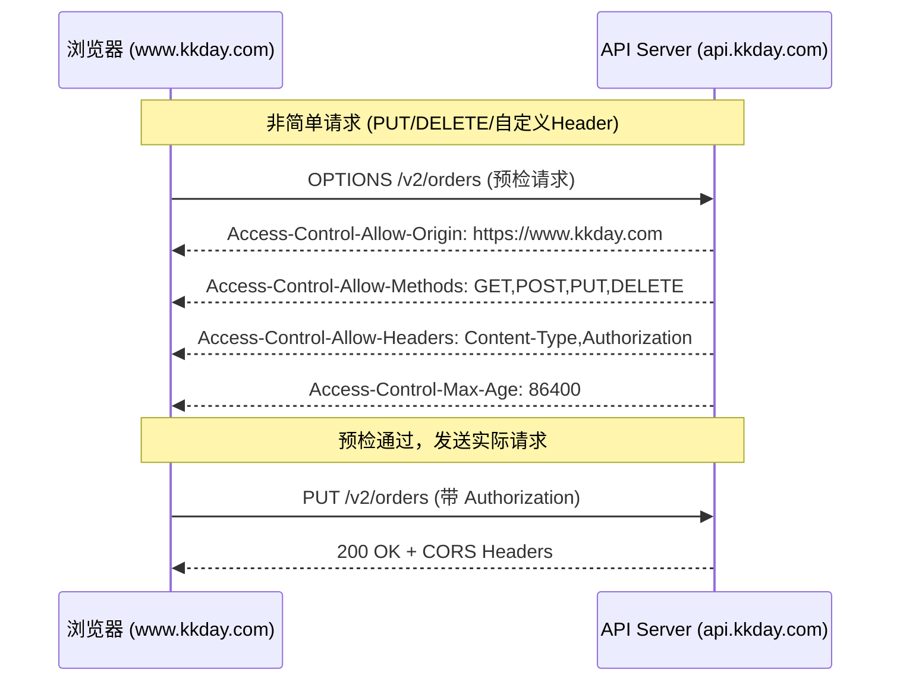

---

title: CORS-跨域资源共享配置与安全策略-Laravel-B2C-API实战踩坑记录
keywords: [CORS, Laravel, B2C, API, 跨域资源共享配置与安全策略, 实战踩坑记录, 架构]
cover: https://images.unsplash.com/photo-1486406146926-c627a92ad1ab?w=1200&h=630&fit=crop
images:
  - https://images.unsplash.com/photo-1486406146926-c627a92ad1ab?w=1200&h=630&fit=crop
date: 2026-05-16 21:40:49
updated: 2026-05-16 21:43:57
categories:
  - architecture
  - infra
tags:
- CORS
- Laravel
- Nginx
- 安全
- API
description: 深入解析CORS跨域资源共享的浏览器预检请求机制与同源策略原理，结合Laravel B2C API实战，详解Nginx与应用层CORS配置对比、Access-Control白名单策略、Cookie跨域SameSite配置、CDN缓存Vary:Origin等前后端分离架构下高频踩坑与安全最佳实践。
---


# CORS 跨域资源共享配置与安全策略：Laravel B2C API 实战踩坑记录

## 前言

在前后端分离架构成为标配的今天，CORS（Cross-Origin Resource Sharing）几乎是每个后端开发者绕不开的第一道"门槛"。你大概率遇到过这样的场景：

> 前端同事发来截图：`Access to XMLHttpRequest at 'https://api.example.com/v2/orders' from origin 'https://www.example.com' has been blocked by CORS policy`，然后一句"后端改一下 CORS 配置就好了"甩过来。

但 CORS 真的只是"加个 Header"这么简单吗？在 KKday B2C API 的 30+ 仓库中，我见过太多因为 CORS 配置不当导致的线上事故：**预检请求超时导致下单失败、Allow-Origin 设为 `*` 导致 Cookie 泄露、Nginx 和 Laravel 双重配置冲突导致 Header 重复**……

本文基于真实项目经验，从原理到实践，彻底讲透 CORS 在 Laravel B2C API 中的正确配置姿势。

## CORS 工作原理速览

### 为什么需要 CORS？

浏览器的同源策略（Same-Origin Policy）限制了跨域请求。当你的前端页面在 `https://www.kkday.com`，API 在 `https://api.kkday.com`，虽然都是 `kkday.com`，但因为 scheme/port/host 三者不完全一致，就是跨域。



### 简单请求 vs 预检请求

理解 CORS 的关键在于区分**简单请求**和**需要预检的请求**：

| 类型 | 条件 | 是否预检 |
|------|------|---------|
| 简单请求 | GET/POST/HEAD + 标准 Content-Type | ❌ 直接发送 |
| 预检请求 | PUT/DELETE/PATCH 或自定义 Header | ✅ 先发 OPTIONS |

**踩坑点**：在 B2C 电商项目中，几乎所有 API 请求都带有 `Authorization: Bearer xxx` 自定义 Header，这意味着每个请求都会触发预检。如果你的 API 对 OPTIONS 请求返回 405 Method Not Allowed，前端直接就挂了。

## Laravel CORS 配置实战

### 方案一：Laravel 内置 CORS 中间件（Laravel 9+）

从 Laravel 9 开始，框架内置了基于 `fruitcake/laravel-cors` 的 CORS 中间件：

```php
// config/cors.php
<?php

return [
    /*
    |--------------------------------------------------------------------------
    | 跨域资源共享路径
    |--------------------------------------------------------------------------
    */
    'paths' => [
        'api/*',           // 所有 API 路由
        'sanctum/csrf-cookie',
    ],

    /*
    |--------------------------------------------------------------------------
    | 允许的来源
    |--------------------------------------------------------------------------
    | 生产环境绝不能用 '*'，必须精确指定白名单
    */
    'allowed_origins' => [
        'https://www.kkday.com',
        'https://www.kkday.com.tw',
        'https://m.kkday.com',          // 移动端
        'https://admin.kkday.com',       // 管理后台
    ],

    // 支持通配符子域名（谨慎使用）
    'allowed_origins_patterns' => [
        '/^https:\/\/([a-z0-9-]+\.)?kkday\.com$/',
    ],

    'allowed_methods' => ['GET', 'POST', 'PUT', 'PATCH', 'DELETE', 'OPTIONS'],

    'allowed_headers' => [
        'Content-Type',
        'Authorization',
        'X-Requested-With',
        'X-Request-ID',           // 请求追踪
        'Accept-Language',         // 多语言
        'X-App-Version',           // 客户端版本
    ],

    'exposed_headers' => [
        'X-Request-ID',
        'X-RateLimit-Limit',
        'X-RateLimit-Remaining',
    ],

    // 预检缓存时间（秒），减少 OPTIONS 请求
    'max_age' => 86400,  // 24 小时

    // 是否允许携带 Cookie（关键！）
    'supports_credentials' => true,
];
```

**⚠️ 关键踩坑：`supports_credentials` 与 `allowed_origins: ['*']` 互斥**

这是最常犯的错误。当你设置 `supports_credentials = true` 时，浏览器要求 `Access-Control-Allow-Origin` **不能是 `*`**，必须是具体的域名。如果你同时设置了 `*` 和 `true`，浏览器会直接报错：

```
The value of the 'Access-Control-Allow-Origin' header in the response
must not be the wildcard '*' when the request's credentials mode is 'include'.
```

### 方案二：自定义 CORS 中间件（更精细的控制）

在实际项目中，Laravel 内置的 CORS 中间件有时不够灵活。比如我们需要：

1. 根据环境动态切换 Origin 白名单
2. 对不同路径设置不同的 CORS 策略
3. 记录跨域请求日志用于安全审计

```php
<?php
// app/Http/Middleware/CustomCorsMiddleware.php

namespace App\Http\Middleware;

use Closure;
use Illuminate\Http\Request;
use Symfony\Component\HttpFoundation\Response;

class CustomCorsMiddleware
{
    /**
     * 从配置文件或环境变量加载白名单
     */
    private array $allowedOrigins;

    public function __construct()
    {
        $this->allowedOrigins = array_filter(
            explode(',', config('cors.allowed_origins', ''))
        );
    }

    public function handle(Request $request, Closure $next): Response
    {
        $origin = $request->header('Origin');

        // 预检请求直接响应
        if ($request->isMethod('OPTIONS')) {
            return $this->buildPreflightResponse($origin);
        }

        $response = $next($request);

        // 非跨域请求不需要 CORS Header
        if (!$origin) {
            return $response;
        }

        return $this->addCorsHeaders($response, $origin);
    }

    private function isOriginAllowed(string $origin): bool
    {
        // 精确匹配
        if (in_array($origin, $this->allowedOrigins, true)) {
            return true;
        }

        // 正则匹配（支持通配符子域名）
        foreach ($this->allowedOrigins as $pattern) {
            if (str_starts_with($pattern, 'regex:') &&
                preg_match(substr($pattern, 6), $origin)) {
                return true;
            }
        }

        // 记录被拒绝的来源（安全审计）
        logger()->warning('CORS origin rejected', [
            'origin' => $origin,
            'path' => request()->path(),
            'ip' => request()->ip(),
        ]);

        return false;
    }

    private function addCorsHeaders(Response $response, string $origin): Response
    {
        if (!$this->isOriginAllowed($origin)) {
            return $response;
        }

        $response->headers->set('Access-Control-Allow-Origin', $origin);
        $response->headers->set('Access-Control-Allow-Credentials', 'true');
        $response->headers->set(
            'Access-Control-Expose-Headers',
            'X-Request-ID, X-RateLimit-Limit, X-RateLimit-Remaining'
        );

        return $response;
    }

    private function buildPreflightResponse(string $origin): Response
    {
        $response = new Response('', 204);

        if ($this->isOriginAllowed($origin)) {
            $response->headers->set('Access-Control-Allow-Origin', $origin);
            $response->headers->set('Access-Control-Allow-Methods',
                'GET, POST, PUT, PATCH, DELETE, OPTIONS');
            $response->headers->set('Access-Control-Allow-Headers',
                'Content-Type, Authorization, X-Requested-With, X-Request-ID, Accept-Language, X-App-Version');
            $response->headers->set('Access-Control-Allow-Credentials', 'true');
            $response->headers->set('Access-Control-Max-Age', '86400');
        }

        return $response;
    }
}
```

**注册中间件时注意顺序**——CORS 必须在最外层，确保所有请求都能被处理：

```php
// bootstrap/app.php (Laravel 11+)
->withMiddleware(function (Middleware $middleware) {
    $middleware->prepend(\App\Http\Middleware\CustomCorsMiddleware::class);
})
```

## Nginx 层面的 CORS 配置

在生产环境中，很多时候 CORS 问题不是 Laravel 的锅，而是 Nginx 配置冲突。我在项目中遇到过一个经典 bug：**Laravel 和 Nginx 同时添加 CORS Header，导致浏览器收到重复的 `Access-Control-Allow-Origin` Header，直接报错**。

### 推荐：在 Nginx 层统一处理

```nginx
server {
    listen 443 ssl;
    server_name api.kkday.com;

    # 定义允许的来源
    set $cors_origin "";
    if ($http_origin ~* "^https://(www|m|admin)\.kkday\.com(\.(tw|jp))?$") {
        set $cors_origin $http_origin;
    }

    # 通用 CORS Header
    add_header Access-Control-Allow-Origin $cors_origin always;
    add_header Access-Control-Allow-Credentials "true" always;
    add_header Access-Control-Expose-Headers "X-Request-ID, X-RateLimit-Limit" always;

    # 预检请求特殊处理
    if ($request_method = 'OPTIONS') {
        add_header Access-Control-Allow-Origin $cors_origin;
        add_header Access-Control-Allow-Methods "GET, POST, PUT, PATCH, DELETE, OPTIONS";
        add_header Access-Control-Allow-Headers "Content-Type, Authorization, X-Requested-With, X-Request-ID, Accept-Language, X-App-Version";
        add_header Access-Control-Allow-Credentials "true";
        add_header Access-Control-Max-Age 86400;
        add_header Content-Length 0;
        add_header Content-Type "text/plain charset=UTF-8";
        return 204;
    }

    location / {
        proxy_pass http://127.0.0.1:9000;
        # 确保不透传后端的 CORS Header（避免重复）
        proxy_hide_header Access-Control-Allow-Origin;
        proxy_hide_header Access-Control-Allow-Credentials;
    }
}
```

**⚠️ 踩坑：Nginx `add_header` 的继承陷阱**

Nginx 的 `add_header` 在 `if` 和 `location` 块中不会继承外层的设置。如果你在外层和内层都用了 `add_header`，只有内层的生效。解决方案是使用 `more_set_headers`（需要 `ngx_headers_more` 模块）或把所有 `add_header` 放在同一个层级。

### Nginx vs Laravel CORS 配置决策矩阵

| 场景 | Nginx 层处理 | Laravel 层处理 |
|---|---|---|
| 单一 API 服务 | ✅ 推荐 | ✅ 可以 |
| 多个 Laravel 应用（同域名） | ✅ 推荐 | ❌ 难维护 |
| API Gateway 代理多个后端 | ✅ 必须 | ❌ 不够灵活 |
| 需要动态 Origin 白名单 | ❌ 配置麻烦 | ✅ 推荐 |
| 开发环境（频繁切换端口） | ❌ 不需要 | ✅ 推荐 |

### 浏览器、反向代理、应用层的职责对比

| 层级 | 主要职责 | 常见配置项 | 典型问题 |
|---|---|---|---|
| 浏览器 | 根据同源策略决定是否放行响应 | `Origin`、`credentials`、预检缓存 | 控制台显示 CORS 错误，但服务端其实返回 200 |
| Nginx / Gateway | 统一添加或清洗跨域 Header，快速响应 OPTIONS | `add_header`、`proxy_hide_header`、`Vary: Origin` | Header 重复、OPTIONS 被错误转发、缓存污染 |
| Laravel / 应用层 | 按业务路径和环境动态决定白名单与审计日志 | `allowed_origins`、`supports_credentials`、中间件顺序 | 认证中间件提前拦截、白名单写死难维护 |
| CDN | 按 Origin 隔离缓存，避免跨域响应串用 | `Cache-Key`、`Vary: Origin` | 某个来源正常，另一个来源命中错误缓存 |


## 生产环境踩坑记录

### 踩坑 1：预检请求被认证中间件拦截

**现象**：前端报 CORS 错误，但后端日志显示 OPTIONS 请求返回 401。

**根因**：Laravel 的 `auth:sanctum` 中间件在 CORS 中间件之前执行，OPTIONS 请求没有带 Token，所以被拦截。

**解决方案**：确保 CORS 中间件在认证中间件之前执行：

```php
// 正确的中间件顺序
->withMiddleware(function (Middleware $middleware) {
    // CORS 必须在最前面
    $middleware->prepend(\App\Http\Middleware\CustomCorsMiddleware::class);

    // 认证中间件在 CORS 之后
    $middleware->alias([
        'auth.api' => \App\Http\Middleware\AuthenticateApi::class,
    ]);
})
```

### 踩坑 2：CDN 缓存了错误的 CORS Header

**现象**：第一次请求正常，后续请求被 CORS 拦截。

**根因**：CDN 缓存了不带 `Access-Control-Allow-Origin` 的响应（因为第一次请求没有 `Origin` Header）。当后续带 `Origin` 的请求命中缓存时，浏览器发现缺少 CORS Header 就报错。

**解决方案**：在 CDN 配置中，将 `Origin` 加入缓存 Key：

```nginx
# Nginx + CDN 配置
proxy_cache_key "$scheme$request_method$host$request_uri$http_origin";
```

或者在 CDN 控制台配置 **Vary: Origin** Header，确保不同 Origin 的响应分开缓存。

### 踩坑 3：Cookie 跨域丢失

**现象**：登录后跨域请求仍然返回 401。

**根因**：前端请求没有设置 `withCredentials: true`，或者后端 `SameSite=None; Secure` 属性缺失。

**前端配置**：

```javascript
// Axios
axios.defaults.withCredentials = true;

// Fetch
fetch('https://api.kkday.com/v2/orders', {
    credentials: 'include',
});
```

**后端 Session Cookie 配置**：

```php
// config/session.php
return [
    'same_site' => 'none',   // 允许跨站发送
    'secure'   => true,       // 必须 HTTPS
    'http_only' => true,
    'domain'   => '.kkday.com',  // 共享父域
];
```

### 联调时最常用的排查命令

```bash
# 1. 模拟浏览器预检请求
curl -i -X OPTIONS 'https://api.kkday.com/v2/orders' \
  -H 'Origin: https://www.kkday.com' \
  -H 'Access-Control-Request-Method: PUT' \
  -H 'Access-Control-Request-Headers: authorization,content-type'

# 2. 检查实际请求是否带回暴露的 Header
curl -i 'https://api.kkday.com/v2/orders/123' \
  -H 'Origin: https://www.kkday.com' \
  -H 'Authorization: Bearer demo-token'

# 3. 快速确认响应是否按来源区分缓存
curl -I 'https://api.kkday.com/v2/orders' -H 'Origin: https://www.kkday.com'
curl -I 'https://api.kkday.com/v2/orders' -H 'Origin: https://staging.kkday.com'
```

### 踩坑 4：多环境 Origin 管理混乱

**现象**：本地开发正常，staging 环境 CORS 报错。

**解决方案**：使用环境变量 + `.env` 文件管理：

```env
# .env.production
CORS_ALLOWED_ORIGINS=https://www.kkday.com,https://m.kkday.com

# .env.staging
CORS_ALLOWED_ORIGINS=https://staging.kkday.com,http://localhost:3000

# .env.local
CORS_ALLOWED_ORIGINS=http://localhost:3000,http://localhost:5173
```

```php
// config/cors.php
'allowed_origins' => array_filter(
    explode(',', env('CORS_ALLOWED_ORIGINS', ''))
),
```

## 安全最佳实践

### 1. 永远不要在生产环境使用 `Access-Control-Allow-Origin: *`

```php
// ❌ 危险：任何网站都能跨域请求你的 API
'allowed_origins' => ['*'],

// ✅ 安全：明确指定允许的来源
'allowed_origins' => ['https://www.kkday.com'],
```

### 2. 最小化 `allowed_headers`

只暴露必要的 Header，不要图方便直接允许所有：

```php
// ❌ 过于宽松
'allowed_headers' => ['*'],

// ✅ 最小化原则
'allowed_headers' => [
    'Content-Type',
    'Authorization',
    'X-Request-ID',
],
```

### 3. 合理设置 `max_age`

`max_age` 决定预检结果的缓存时间。设太小会增加预检请求开销，设太大会导致 CORS 策略变更不生效：

```php
// 生产环境：24 小时
'max_age' => 86400,

// 开发环境：0（不缓存，方便调试）
'max_age' => 0,
```

### 4. 结合 Rate Limiting 防止 CORS 探测攻击

攻击者可能通过 CORS 探测来枚举你的 API 端点。结合 Rate Limiting 可以有效缓解：

```php
// routes/api.php
Route::middleware(['throttle:api', 'cors'])->group(function () {
    Route::apiResource('orders', OrderController::class);
});
```

### 5. 常见报错与定位思路速查表

| 浏览器报错 / 现象 | 高概率根因 | 优先检查项 |
|---|---|---|
| `No 'Access-Control-Allow-Origin' header` | 服务端未返回允许来源 | 应用层 / 网关是否命中白名单；是否遗漏 `Origin` |
| `Method PUT is not allowed by Access-Control-Allow-Methods` | 预检响应缺少目标方法 | `OPTIONS` 返回的 `Allow-Methods` 是否包含 PUT/PATCH/DELETE |
| `Request header field authorization is not allowed` | 自定义 Header 未加入允许列表 | `Access-Control-Allow-Headers` 是否包含 `Authorization` |
| 带 Cookie 请求仍然 401 | 凭证模式或 Cookie 属性不对 | `withCredentials`、`SameSite=None`、`Secure` |
| 某些环境偶发正常、偶发失败 | CDN / 代理缓存了错误响应 | 是否设置 `Vary: Origin`，缓存 Key 是否包含 Origin |
| 控制台报 CORS，但服务端日志是 302/401/403 | 登录跳转或认证中间件拦截了预检/实际请求 | 检查 OPTIONS 是否绕过认证，是否被重定向到登录页 |

## 总结

CORS 配置看似简单，但在生产环境中涉及浏览器策略、Nginx 配置、CDN 缓存、Cookie 属性等多个层面。记住以下核心原则：

1. **Origin 白名单**：永远精确指定，不用 `*`
2. **中间件顺序**：CORS 在最外层，认证在内层
3. **Nginx vs Laravel**：选一个地方配置，不要两边都配
4. **CDN 缓存**：`Vary: Origin` 或将 Origin 加入缓存 Key
5. **Cookie 跨域**：`SameSite=None; Secure` + `withCredentials`

掌握这些，CORS 就不再是"前端说后端改一下就好"的黑魔法了。

## 相关阅读

- [CSP 内容安全策略实战 - 防御 XSS 攻击 - Laravel Nonce、strict-dynamic 与生产踩坑记录](/architecture/csp-guide-xss-laravel-nonce-strict-dynamic/)
- [CDN 配置实战：静态资源加速、缓存策略、回源配置](/architecture/cdn-guide-cache/)
- [Webhook 集成最佳实践：签名验证、重试与幂等处理——Laravel B2C API 踩坑记录](/architecture/webhook-best-practices/)
- [Nginx 配置实战：PHP-FPM 调优、FastCGI 缓存、Gzip 压缩 — Laravel B2C API 踩坑记录](/architecture/nginx-guide-php-fpm-fastcgi-cache-gzip/)
