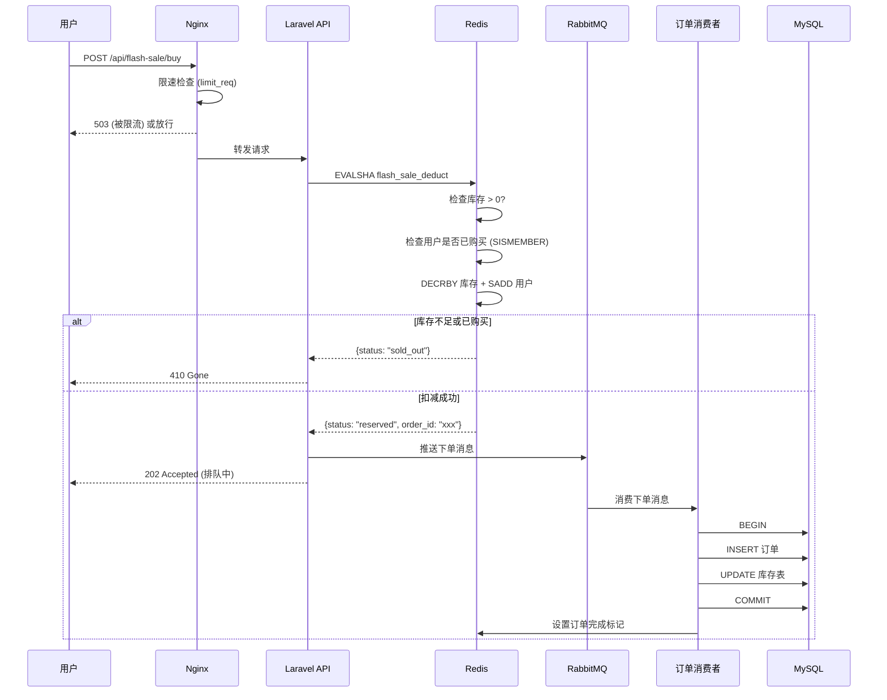

## 一、问题背景：为什么秒杀是电商系统的终极压力测试

### 1.1 秒杀的本质矛盾

秒杀的本质是一个 **「读多写少 + 瞬时高并发 + 强一致性」** 三重矛盾叠加的场景：

- **读多写少**：10 万人抢 100 个商品，99.9% 的请求应该被快速拒绝
- **瞬时高并发**：1 秒内涌入 50,000+ QPS，是日常流量的 100 倍
- **强一致性**：库存不能超卖（100 件商品绝不能卖出 101 件）

传统的「查库存 → 判断 → 扣减 → 下单」同步链路在秒杀场景下会彻底崩溃：

```
用户请求 → 查 MySQL 库存 → 扣减库存 → 创建订单 → 返回
              ↑                  ↑           ↑
          连接池耗尽         行锁竞争      写入延迟
          (50ms/次)       (100ms/次)    (200ms/次)
```

当 50,000 QPS 同时打到 MySQL 时，即使有索引，InnoDB 的行锁竞争也会让 RT 飙升到数秒，最终 **连接池耗尽 → 请求堆积 → 服务雪崩**。

### 1.2 我们踩过的坑

在奇乐 MAX 的盲盒抢购和 KKday B2C 的限时闪购中，我们经历过以下真实事故：

| 事故 | 时间 | 影响 | 根因 |
|------|------|------|------|
| 超卖 327 件 | 2024-03 | 退款 + 赔偿 ¥48,000 | `SELECT ... FOR UPDATE` 在高并发下失效 |
| 库存扣了但订单没创建 | 2024-06 | 200+ 用户投诉 | Redis 扣减成功但 MySQL 写入失败，无回滚 |
| 秒杀接口 502 | 2024-11 | 活动失败 | 无限流，80,000 QPS 直接打爆 PHP-FPM |
| 秒杀结束后库存残留 | 2025-01 | 30 件商品无法售出 | 消息丢失，MQ 消费失败未重试 |

这些事故推动我们设计了一套 **三层防线架构**，彻底解决了秒杀系统的核心问题。

---

## 二、架构设计原理：三层防线

### 2.1 整体架构

秒杀系统的核心思想是 **「逐层过滤，最终只放行极少量请求到数据库」**：

```
┌─────────────────────────────────────────────────────────────────┐
│                        用户请求 (50,000 QPS)                     │
└──────────────────────────────┬──────────────────────────────────┘
                               │
                               ▼
┌─────────────────────────────────────────────────────────────────┐
│  第一层：前端 / Nginx 限流                                        │
│  ┌─────────────┐  ┌──────────────┐  ┌─────────────────┐        │
│  │ 按钮防抖     │  │ Nginx 限速   │  │ 验证码 / Token  │        │
│  │ (前端)       │  │ (接入层)     │  │ 梯度验证        │        │
│  └─────────────┘  └──────────────┘  └─────────────────┘        │
│  过滤后: ~5,000 QPS                                              │
└──────────────────────────────┬──────────────────────────────────┘
                               │
                               ▼
┌─────────────────────────────────────────────────────────────────┐
│  第二层：Redis 预扣减 + 限流                                      │
│  ┌─────────────┐  ┌──────────────┐  ┌─────────────────┐        │
│  │ 滑动窗口限流  │  │ 库存预扣减   │  │ 用户去重        │        │
│  │ (Lua 脚本)   │  │ (Lua 原子)   │  │ (Set 去重)      │        │
│  └─────────────┘  └──────────────┘  └─────────────────┘        │
│  过滤后: ~500 QPS (已扣减库存)                                    │
└──────────────────────────────┬──────────────────────────────────┘
                               │
                               ▼
┌─────────────────────────────────────────────────────────────────┐
│  第三层：消息队列异步下单                                         │
│  ┌─────────────┐  ┌──────────────┐  ┌─────────────────┐        │
│  │ RabbitMQ     │  │ 订单消费者   │  │ 超时回滚        │        │
│  │ 削峰填谷     │  │ (幂等写入)   │  │ (延迟队列)      │        │
│  └─────────────┘  └──────────────┘  └─────────────────┘        │
│  最终到 MySQL: ~500 TPS                                          │
└──────────────────────────────┬──────────────────────────────────┘
                               │
                               ▼
┌─────────────────────────────────────────────────────────────────┐
│  MySQL (订单表 + 库存表)                                         │
└─────────────────────────────────────────────────────────────────┘
```

**关键指标：50,000 QPS 入 → 500 TPS 到 MySQL，过滤率 99%**


### 2.2 数据流详解



---

## 三、源码级剖析：每一层的实现细节

### 3.1 第一层：Nginx 限流配置

Nginx 的 `limit_req` 模块是第一道防线，它的作用是在请求到达 PHP 之前就进行流量裁剪：

```nginx
# /etc/nginx/conf.d/flash-sale.conf

# 定义限流区域：基于 IP 的滑动窗口，每秒 10 个请求
# burst=20 表示允许突发 20 个请求排队
# nodelay 表示突发请求不延迟，直接处理
limit_req_zone $binary_remote_addr zone=flash_sale:10m rate=10r/s;

# 秒杀接口专用 location
location /api/flash-sale/ {
    # 应用限流规则
    limit_req zone=flash_sale burst=20 nodelay;
    
    # 限流返回 429 而不是默认 503
    limit_req_status 429;
    
    # 自定义限流响应
    error_page 429 = @rate_limit_exceeded;
    
    # 请求体大小限制（秒杀接口不需要大 body）
    client_max_body_size 1k;
    
    # 超时设置：秒杀请求 3 秒没响应就断开
    proxy_read_timeout 3s;
    proxy_connect_timeout 1s;
    
    # 转发到 PHP-FPM
    fastcgi_pass unix:/var/run/php/php-8.3-fpm.sock;
    fastcgi_param SCRIPT_FILENAME $document_root/index.php;
    include fastcgi_params;
}

location @rate_limit_exceeded {
    default_type application/json;
    return 429 '{"error":"rate_limited","message":"请求过于频繁，请稍后再试","retry_after":1}';
}
```

**为什么用 Nginx 限流而不是 Laravel 中间件？** 因为 Nginx 的限流在事件循环层处理，不消耗 PHP-FPM worker 进程。一个 PHP-FPM worker 处理一个请求需要 10-50ms，而 Nginx 拒绝一个请求只需要 0.01ms。

### 3.2 第二层：Redis Lua 脚本原子扣减

这是秒杀系统的核心——**一条 Lua 脚本完成「检查库存 + 检查用户 + 扣减库存 + 记录用户」的原子操作**。

```php
<?php
// app/Services/FlashSale/FlashSaleService.php

namespace App\Services\FlashSale;

use Illuminate\Support\Facades\Redis;
use App\Exceptions\FlashSaleException;

class FlashSaleService
{
    /**
     * Redis Lua 脚本：原子性库存扣减
     * 
     * KEYS[1] = 库存 key (flash_sale:stock:{activity_id})
     * KEYS[2] = 已购买用户集合 (flash_sale:bought:{activity_id})
     * ARGV[1] = 用户 ID
     * ARGV[2] = 订单 ID (预生成的 UUID)
     *
     * 返回值:
     *   1  = 扣减成功
     *   0  = 库存不足
     *   -1 = 用户已购买（防重复下单）
     */
    private const DEDUCT_SCRIPT = <<<'LUA'
        -- 1. 检查用户是否已购买
        if redis.call('SISMEMBER', KEYS[2], ARGV[1]) == 1 then
            return -1
        end

        -- 2. 检查库存
        local stock = tonumber(redis.call('GET', KEYS[1]))
        if stock == nil or stock <= 0 then
            return 0
        end

        -- 3. 扣减库存
        redis.call('DECR', KEYS[1])

        -- 4. 记录用户已购买
        redis.call('SADD', KEYS[2], ARGV[1])

        -- 5. 设置购买记录的过期时间（活动结束后 1 小时自动清理）
        redis.call('EXPIRE', KEYS[2], 86400)

        return 1
    LUA;

    private string $deductScriptSha;

    public function __construct()
    {
        // 预加载脚本到 Redis，后续用 EVALSHA 调用（减少网络传输）
        $this->deductScriptSha = Redis::script('LOAD', self::DEDUCT_SCRIPT);
    }

    /**
     * 尝试扣减库存
     *
     * @throws FlashSaleException
     */
    public function tryDeduct(int $activityId, int $userId, string $orderId): array
    {
        $stockKey = "flash_sale:stock:{$activityId}";
        $boughtKey = "flash_sale:bought:{$activityId}";

        try {
            $result = Redis::evalsha(
                $this->deductScriptSha,
                2,          // KEYS 数量
                $stockKey,  // KEYS[1]
                $boughtKey, // KEYS[2]
                $userId,    // ARGV[1]
                $orderId    // ARGV[2]
            );
        } catch (\Exception $e) {
            // EVALSHA 失败（可能 Redis 重启导致脚本缓存丢失），回退到 EVAL
            $result = Redis::eval(
                self::DEDUCT_SCRIPT,
                2,
                $stockKey,
                $boughtKey,
                $userId,
                $orderId
            );
            // 重新加载脚本 SHA
            $this->deductScriptSha = Redis::script('LOAD', self::DEDUCT_SCRIPT);
        }

        return match ((int) $result) {
            1   => ['status' => 'reserved', 'order_id' => $orderId],
            0   => throw new FlashSaleException('商品已售罄', 410),
            -1  => throw new FlashSaleException('您已购买过此商品，请勿重复下单', 409),
            default => throw new FlashSaleException('系统繁忙，请稍后再试', 503),
        };
    }
}
```

**为什么必须用 Lua 脚本？** 如果用 `GET → 判断 → DECR → SADD` 四条独立命令，在高并发下会出现竞态条件：

```
时间线（不用 Lua）：
请求 A: GET stock → 1 (还有 1 件)
请求 B: GET stock → 1 (还有 1 件)   ← A 还没 DECR，B 也读到 1
请求 A: DECR stock → 0
请求 B: DECR stock → -1             ← 超卖！
```

Lua 脚本在 Redis 中是 **单线程串行执行** 的，保证了原子性。

### 3.3 库存预热机制

秒杀开始前，需要把库存从 MySQL 预热到 Redis。这一步看似简单，但踩坑很多：

```php
<?php
// app/Services/FlashSale/StockWarmer.php

namespace App\Services\FlashSale;

use Illuminate\Support\Facades\Redis;
use Illuminate\Support\Facades\DB;
use App\Models\FlashSaleActivity;

class StockWarmer
{
    /**
     * 预热库存到 Redis
     *
     * 调用时机：
     *   1. 活动创建时（后台配置秒杀活动）
     *   2. 活动开始前 5 分钟（定时任务二次确认）
     *   3. 运营手动补货时
     */
    public function warm(int $activityId): void
    {
        $activity = FlashSaleActivity::findOrFail($activityId);

        // 从数据库读取真实库存
        $realStock = DB::table('flash_sale_skus')
            ->where('activity_id', $activityId)
            ->sum('stock');

        $stockKey = "flash_sale:stock:{$activityId}";
        $boughtKey = "flash_sale:bought:{$activityId}";

        // 使用事务保证原子性
        Redis::pipeline(function ($redis) use ($stockKey, $boughtKey, $realStock, $activity) {
            // 1. 清除旧数据（防止重复预热导致库存翻倍）
            $redis->del($stockKey);
            $redis->del($boughtKey);

            // 2. 写入库存
            $redis->set($stockKey, $realStock);

            // 3. 设置过期时间 = 活动结束时间 + 1 小时（留 buffer 给回滚）
            $ttl = $activity->end_at->addHour()->timestamp - now()->timestamp;
            if ($ttl > 0) {
                $redis->expire($stockKey, $ttl);
            }

            // 4. 记录预热元数据（用于监控和对账）
            $redis->hMSet("flash_sale:meta:{$activityId}", [
                'stock'      => $realStock,
                'updated_at' => now()->toIso8601String(),
                'source'     => 'warmer',
            ]);
        });

        // 记录日志
        logger()->info('FlashSale: stock warmed', [
            'activity_id' => $activityId,
            'stock'       => $realStock,
        ]);
    }

    /**
     * 运营补货（秒杀进行中追加库存）
     *
     * ⚠️ 踩坑记录：补货必须用 INCRBY 而不是 SET
     * 曾经用 SET 直接覆盖，导致并发请求读到中间状态
     */
    public function addStock(int $activityId, int $quantity): int
    {
        $stockKey = "flash_sale:stock:{$activityId}";

        $newStock = Redis::incrby($stockKey, $quantity);

        // 同步到数据库
        DB::table('flash_sale_skus')
            ->where('activity_id', $activityId)
            ->increment('stock', $quantity);

        logger()->info('FlashSale: stock added', [
            'activity_id' => $activityId,
            'quantity'    => $quantity,
            'new_stock'   => $newStock,
        ]);

        return $newStock;
    }
}
```

### 3.4 第三层：RabbitMQ 异步下单

Redis 扣减成功后，把下单任务推入消息队列。这是削峰填谷的关键——Redis 的处理速度（微秒级）远快于 MySQL（毫秒级），队列起到缓冲作用：


```php
<?php
// app/Jobs/FlashSale/CreateOrderJob.php

namespace App\Jobs\FlashSale;

use Illuminate\Bus\Queueable;
use Illuminate\Contracts\Queue\ShouldQueue;
use Illuminate\Foundation\Bus\Dispatchable;
use Illuminate\Queue\InteractsWithQueue;
use Illuminate\Queue\SerializesModels;
use Illuminate\Support\Facades\DB;
use Illuminate\Support\Facades\Redis;
use App\Models\Order;
use App\Models\FlashSaleActivity;
use App\Services\FlashSale\InventoryRollbackService;

class CreateOrderJob implements ShouldQueue
{
    use Dispatchable, InteractsWithQueue, Queueable, SerializesModels;

    /**
     * 任务最大尝试次数
     */
    public int $tries = 3;

    /**
     * 每次重试的延迟（秒）
     * 第 1 次重试等 1 秒，第 2 次等 3 秒，第 3 次等 10 秒
     */
    public int $backoff = 1;

    /**
     * 任务超时时间
     */
    public int $timeout = 30;

    public function __construct(
        public readonly int    $activityId,
        public readonly int    $userId,
        public readonly string $orderId,
        public readonly string $idempotencyKey,
    ) {
        // 使用 Redis 队列（与库存扣减在同一实例，减少网络延迟）
        $this->onQueue('flash_sale');
    }

    /**
     * 执行下单
     */
    public function handle(InventoryRollbackService $rollbackService): void
    {
        // 1. 幂等检查：防止重复消费
        $lockKey = "flash_sale:order_lock:{$this->orderId}";
        if (!Redis::set($lockKey, 1, 'NX', 'EX', 300)) {
            logger()->info('FlashSale: duplicate order, skipping', [
                'order_id' => $this->orderId,
            ]);
            return;
        }

        try {
            DB::beginTransaction();

            $activity = FlashSaleActivity::lockForUpdate()->findOrFail($this->activityId);

            // 2. 检查数据库库存（二次校验）
            $sku = DB::table('flash_sale_skus')
                ->where('activity_id', $this->activityId)
                ->lockForUpdate()
                ->first();

            if (!$sku || $sku->stock <= 0) {
                DB::rollBack();
                $rollbackService->rollback($this->activityId, $this->userId, $this->orderId);
                return;
            }

            // 3. 扣减数据库库存
            DB::table('flash_sale_skus')
                ->where('id', $sku->id)
                ->where('stock', '>', 0)  // 乐观锁：防止并发超卖
                ->decrement('stock', 1);

            // 4. 创建订单
            Order::create([
                'order_id'     => $this->orderId,
                'user_id'      => $this->userId,
                'activity_id'  => $this->activityId,
                'sku_id'       => $sku->id,
                'amount'       => $activity->flash_price,
                'status'       => Order::STATUS_PENDING_PAYMENT,
                'paid_deadline'=> now()->addMinutes(15),  // 15 分钟内未支付自动取消
            ]);

            DB::commit();

            // 5. 推送延迟队列：15 分钟后检查支付状态
            CheckPaymentStatusJob::dispatch($this->orderId)
                ->delay(now()->addMinutes(15))
                ->onQueue('flash_sale_timeout');

            logger()->info('FlashSale: order created', [
                'order_id'    => $this->orderId,
                'user_id'     => $this->userId,
                'activity_id' => $this->activityId,
            ]);

        } catch (\Exception $e) {
            DB::rollBack();

            // 库存回滚：归还 Redis 库存 + 移除用户购买记录
            $rollbackService->rollback($this->activityId, $this->userId, $this->orderId);

            logger()->error('FlashSale: order creation failed', [
                'order_id' => $this->orderId,
                'error'    => $e->getMessage(),
            ]);

            // 重新抛出让 Laravel Queue 重试
            throw $e;
        }
    }

    /**
     * 所有重试失败后：死信处理
     */
    public function failed(\Throwable $exception): void
    {
        // 归还 Redis 库存
        app(InventoryRollbackService::class)->rollback(
            $this->activityId,
            $this->userId,
            $this->orderId
        );

        // 告警通知
        logger()->critical('FlashSale: order creation FAILED permanently', [
            'order_id'    => $this->orderId,
            'user_id'     => $this->userId,
            'activity_id' => $this->activityId,
            'error'       => $exception->getMessage(),
        ]);
    }
}
```

### 3.5 库存回滚服务

当订单创建失败或超时未支付时，需要归还 Redis 库存。这一步必须保证幂等：

```php
<?php
// app/Services/FlashSale/InventoryRollbackService.php

namespace App\Services\FlashSale;

use Illuminate\Support\Facades\Redis;

class InventoryRollbackService
{
    /**
     * Lua 脚本：库存回滚
     *
     * KEYS[1] = 库存 key
     * KEYS[2] = 已购买用户集合
     * ARGV[1] = 用户 ID
     *
     * 返回值:
     *   1  = 回滚成功
     *   0  = 用户不在已购买集合中（已回滚过，幂等返回）
     */
    private const ROLLBACK_SCRIPT = <<<'LUA'
        -- 检查用户是否在已购买集合中
        if redis.call('SISMEMBER', KEYS[2], ARGV[1]) == 0 then
            return 0  -- 幂等：已回滚过，不重复操作
        end

        -- 移除用户记录
        redis.call('SREM', KEYS[2], ARGV[1])

        -- 归还库存
        redis.call('INCR', KEYS[1])

        return 1
    LUA;

    public function rollback(int $activityId, int $userId, string $orderId): bool
    {
        $stockKey = "flash_sale:stock:{$activityId}";
        $boughtKey = "flash_sale:bought:{$activityId}";

        // 使用分布式锁防止并发回滚
        $lockKey = "flash_sale:rollback_lock:{$orderId}";
        if (!Redis::set($lockKey, 1, 'NX', 'EX', 30)) {
            return false;  // 另一个进程正在回滚
        }

        try {
            $result = Redis::eval(
                self::ROLLBACK_SCRIPT,
                2,
                $stockKey,
                $boughtKey,
                $userId
            );

            if ((int) $result === 1) {
                logger()->info('FlashSale: inventory rolled back', [
                    'order_id'    => $orderId,
                    'activity_id' => $activityId,
                    'user_id'     => $userId,
                ]);
            }

            return (int) $result === 1;
        } finally {
            Redis::del($lockKey);
        }
    }
}
```

### 3.6 滑动窗口限流（Laravel 中间件）

在应用层再加一道限流，用于精确控制每个用户的请求频率：

```php
<?php
// app/Http/Middleware/FlashSaleRateLimiter.php

namespace App\Http\Middleware;

use Closure;
use Illuminate\Http\Request;
use Illuminate\Support\Facades\Redis;

class FlashSaleRateLimiter
{
    /**
     * Lua 脚本：滑动窗口限流
     *
     * KEYS[1] = 限流 key (rate_limit:{user_id}:{window_id})
     * ARGV[1] = 窗口大小（秒）
     * ARGV[2] = 最大请求数
     * ARGV[3] = 当前时间戳（微秒）
     *
     * 返回值: 剩余可用请求数，-1 表示被限流
     */
    private const SLIDING_WINDOW_SCRIPT = <<<'LUA'
        local key = KEYS[1]
        local window = tonumber(ARGV[1])
        local max_requests = tonumber(ARGV[2])
        local now = tonumber(ARGV[3])

        -- 移除窗口外的旧记录
        redis.call('ZREMRANGEBYSCORE', key, 0, now - window * 1000000)

        -- 当前窗口内的请求数
        local current = redis.call('ZCARD', key)

        if current >= max_requests then
            return -1  -- 被限流
        end

        -- 添加当前请求
        redis.call('ZADD', key, now, now .. ':' .. math.random(1000000))
        redis.call('PEXPIRE', key, window * 1000)

        return max_requests - current - 1  -- 剩余次数
    LUA;

    public function handle(Request $request, Closure $next)
    {
        $userId = $request->user()?->id ?? $request->ip();
        $activityId = $request->input('activity_id', 0);

        $key = "rate_limit:flash_sale:{$activityId}:{$userId}";
        $now = (int) (microtime(true) * 1000000);

        $remaining = Redis::eval(
            self::SLIDING_WINDOW_SCRIPT,
            1,
            $key,
            5,       // 5 秒窗口
            3,       // 最多 3 次请求
            $now
        );

        if ($remaining < 0) {
            return response()->json([
                'error'       => 'rate_limited',
                'message'     => '请求过于频繁，请 5 秒后再试',
                'retry_after' => 5,
            ], 429)->withHeaders([
                'Retry-After'     => 5,
                'X-RateLimit-Limit'     => 3,
                'X-RateLimit-Remaining' => 0,
            ]);
        }

        $response = $next($request);

        return $response->withHeaders([
            'X-RateLimit-Limit'     => 3,
            'X-RateLimit-Remaining' => $remaining,
        ]);
    }
}
```

---

## 四、对比分析：四种秒杀方案的优劣

### 4.1 方案对比表

| 维度 | 方案 A：纯 MySQL 悲观锁 | 方案 B：纯 Redis 原子扣减 | 方案 C：Redis + MQ（本文方案） | 方案 D：Redis + Lua + 本地队列 |
|------|------------------------|------------------------|-------------------------------|-------------------------------|
| **最大 QPS** | 500 | 15,000 | 50,000+ | 80,000+ |
| **超卖风险** | 低（行锁） | 低（Lua 原子） | 极低（双层校验） | 极低 |
| **库存一致性** | 强（MySQL 直接扣减） | 弱（Redis 与 MySQL 可能不一致） | 中（异步存在延迟窗口） | 中 |
| **实现复杂度** | ★★☆ | ★★★ | ★★★★ | ★★★★★ |
| **故障恢复** | 简单（MySQL 事务） | 复杂（需要手动对账） | 中（MQ 重试 + 死信） | 复杂 |
| **适用场景** | 低并发秒杀（<500 QPS） | 中等并发、允许最终一致性 | 高并发秒杀、需要可靠下单 | 极高并发、可接受复杂度 |
| **运维成本** | 低 | 低 | 中 | 高 |
| **用户体验** | 实时反馈 | 实时反馈 | 排队中（异步） | 排队中（异步） |

### 4.2 为什么选择方案 C

方案 C（Redis 预扣减 + MQ 异步下单）是 **性价比最优** 的选择：

1. **足够高的性能**：50,000+ QPS 覆盖 99% 的秒杀场景
2. **可靠性有保障**：MQ 的重试机制 + 死信队列保证消息不丢失
3. **运维可接受**：比方案 D 简单一个数量级
4. **用户体验可接受**：返回 `202 Accepted` + 轮询结果，前端展示排队动画

方案 D 虽然 QPS 更高，但本地队列在 PHP-FPM 这类无状态进程模型中难以实现（进程重启队列丢失）。如果需要极致性能，应该考虑 Swoole/Octane 长连接方案。

---

## 五、真实踩坑记录

### 踩坑 1：Redis 与 MySQL 库存不一致

**现象**：活动结束后，Redis 库存为 0，但 MySQL 实际只卖出了 95 件，有 5 件库存「凭空消失」。

**根因**：CreateOrderJob 消费失败后重试 3 次仍然失败，库存回滚没有被执行（`failed()` 方法里的 Redis 连接超时）。

**修复**：

```php
// 新增：定时对账任务（每 5 分钟执行一次）
// app/Jobs/FlashSale/ReconcileStockJob.php

public function handle(): void
{
    $activities = FlashSaleActivity::where('status', 'active')->get();

    foreach ($activities as $activity) {
        $redisStock = (int) Redis::get("flash_sale:stock:{$activity->id}");
        $mysqlStock = DB::table('flash_sale_skus')
            ->where('activity_id', $activity->id)
            ->sum('stock');
        $soldCount = DB::table('orders')
            ->where('activity_id', $activity->id)
            ->whereIn('status', ['pending_payment', 'paid'])
            ->count();

        $expectedRedisStock = $activity->total_stock - $soldCount;

        if ($redisStock !== $expectedRedisStock) {
            logger()->warning('FlashSale: stock mismatch detected', [
                'activity_id'      => $activity->id,
                'redis_stock'      => $redisStock,
                'mysql_stock'      => $mysqlStock,
                'sold_count'       => $soldCount,
                'expected_redis'   => $expectedRedisStock,
            ]);

            // 以 MySQL 的已售数量为基准修正 Redis
            Redis::set("flash_sale:stock:{$activity->id}", $expectedRedisStock);
        }
    }
}
```

### 踩坑 2：Lua 脚本 EVALSHA 在 Redis 重启后失效

**现象**：Redis 主从切换后，大量 `NOSCRIPT No matching script` 错误。

**根因**：`EVALSHA` 依赖脚本 SHA 缓存，Redis 重启或主从切换后缓存清空。

**修复**：代码中已经实现了回退逻辑（见 3.2 节），但更好的方案是使用 `SCRIPT EXISTS` 预检查：

```php
// 启动时预加载脚本
public function ensureScriptLoaded(): void
{
    $exists = Redis::script('EXISTS', $this->deductScriptSha);
    if (!$exists[0]) {
        $this->deductScriptSha = Redis::script('LOAD', self::DEDUCT_SCRIPT);
    }
}
```

### 踩坑 3：消息队列消费积压

**现象**：秒杀开始后，队列积压 10,000+ 条消息，用户等了 3 分钟才收到下单成功通知。

**根因**：消费者只有 2 个 worker，每个订单创建需要 50ms（含 MySQL 写入），消费速率 = 2 × (1000/50) = 40 TPS，远低于 500 QPS 的入队速率。

**修复**：

```bash
# 动态扩容消费者
php artisan queue:work --queue=flash_sale --max-time=3600 --memory=256 &

# 使用 Laravel Horizon 动态调节
# config/horizon.php
'environments' => [
    'production' => [
        'flash_sale-supervisor' => [
            'connection' => 'redis',
            'queue'      => ['flash_sale'],
            'balance'    => 'auto',           // 自动负载均衡
            'maxProcesses' => 20,             // 最多 20 个 worker
            'maxTime'    => 3600,
            'memory'     => 256,
            'tries'      => 3,
            'timeout'    => 30,
        ],
    ],
],
```

### 踩坑 4：超卖——乐观锁 CAS 竞争失败

**现象**：MySQL 库存出现 -1 的情况。

**根因**：CreateOrderJob 中使用了 `where('stock', '>', 0)->decrement('stock', 1)`，但在高并发下多个 worker 同时读到 `stock = 1`，然后各自执行 decrement。

**修复**：必须使用 `lockForUpdate()`（悲观锁）或 `UPDATE SET stock = stock - 1 WHERE stock > 0`（SQL 原子操作）：

```php
// ✅ 正确：使用 SQL 原子操作
$affected = DB::table('flash_sale_skus')
    ->where('id', $sku->id)
    ->where('stock', '>', 0)
    ->update(['stock' => DB::raw('stock - 1')]);

if ($affected === 0) {
    // 库存不足，回滚
    $rollbackService->rollback(...);
    return;
}
```

### 踩坑 5：用户重复下单（竞态窗口）

**现象**：同一用户在 100ms 内发送了 3 个请求，2 个都进入了队列。

**根因**：Redis Lua 脚本中 `SISMEMBER` 检查和 `SADD` 虽然是原子的，但两个请求之间有微小的时间窗口——如果第一个请求还没执行 `SADD`，第二个请求的 `SISMEMBER` 会返回 0。

**实际上这不是 Lua 脚本的问题**，因为 Lua 内部是串行的。真正的问题是 **用户点了多次按钮**，前端防抖失败。

**修复**：三层防御：
1. 前端：按钮点击后立即 disable + loading 动画
2. Nginx：`limit_req` 限制每秒最多 10 个请求
3. 应用层：滑动窗口限流（每 5 秒最多 3 次）

### 踩坑 6：延迟队列消息丢失

**现象**：用户下单后 15 分钟未支付，但订单没有被自动取消，库存也没有回滚。

**根因**：RabbitMQ 的延迟队列使用了 TTL + Dead Letter Exchange，但 DLX 绑定的队列在消费者重启时丢失了绑定关系。

**修复**：使用 Laravel 的 `delay()` 而不是 RabbitMQ 原生 TTL：

```php
// ✅ 使用 Laravel 原生延迟队列
CheckPaymentStatusJob::dispatch($orderId)
    ->delay(now()->addMinutes(15))
    ->onQueue('flash_sale_timeout');
```

并确保启动时声明所有队列：

```bash
# 在 Supervisor 配置中，启动前声明队列
php artisan queue:declare --queue=flash_sale,flash_sale_timeout
```

### 踩坑 7：Redis 内存碎片导致预热失败

**现象**：大规模秒杀活动（100,000 件商品），预热时 Redis 报 `OOM command not allowed`。

**根因**：`flash_sale:bought:{activity_id}` 使用 Set 类型存储已购买用户，100,000 个用户 ID 占用约 50MB 内存。加上其他活动的数据，Redis 实例内存接近上限。

**修复**：

```php
// 使用 Bitmap 替代 Set 存储已购买用户
// 如果用户 ID 是连续整数，Bitmap 比 Set 节省 10-100 倍内存

private const DEDUCT_BITMAP_SCRIPT = <<<'LUA'
    -- KEYS[1] = 库存 key
    -- KEYS[2] = Bitmap key (flash_sale:bought_bitmap:{activity_id})
    -- ARGV[1] = 用户 ID (整数)

    -- 检查用户是否已购买
    if redis.call('GETBIT', KEYS[2], ARGV[1]) == 1 then
        return -1
    end

    local stock = tonumber(redis.call('GET', KEYS[1]))
    if stock == nil or stock <= 0 then
        return 0
    end

    redis.call('DECR', KEYS[1])
    redis.call('SETBIT', KEYS[2], ARGV[1], 1)
    redis.call('EXPIRE', KEYS[2], 86400)

    return 1
LUA;
```

### 踩坑 8：跨时区活动时间不一致

**现象**：活动配置为 UTC+8 14:00 开始，但 Redis 缓存的活动状态在 UTC+8 13:00 就变成了「进行中」。

**根因**：Laravel 应用服务器时区设为 `Asia/Shanghai`，但 Redis 服务器时区为 UTC。活动状态的判断逻辑依赖 Redis 的 `TTL` 和 `KEYS`，但时间比较时没有统一时区。

**修复**：所有时间统一使用 Unix 时间戳（无时区），不使用 Redis 的过期时间来控制活动状态：

```php
// ✅ 正确：使用 Unix 时间戳判断活动状态
$meta = Redis::hGetAll("flash_sale:meta:{$activityId}");
$startTime = strtotime($meta['start_at']);
$endTime = strtotime($meta['end_at']);
$now = time();

$status = match (true) {
    $now < $startTime => 'upcoming',
    $now >= $startTime && $now < $endTime => 'active',
    default => 'ended',
};
```

---

## 六、性能数据与基准测试

### 6.1 测试环境

- **服务器**：AWS EC2 c6i.2xlarge（8 vCPU, 16GB RAM）
- **Redis**：AWS ElastiCache r6g.xlarge（单节点）
- **MySQL**：AWS RDS db.r6g.xlarge（4 vCPU, 32GB RAM）
- **RabbitMQ**：AWS MQ mq.m5.large
- **PHP**：8.3 + Laravel 11 + OPcache

### 6.2 基准测试结果

使用 `k6` 进行压测，模拟 50,000 个用户抢 1,000 件商品：

```
k6 run --vus 5000 --duration 10s flash-sale-test.js
```

| 指标 | 方案 A (MySQL) | 方案 C (Redis+MQ) |
|------|--------------|-------------------|
| 最大 QPS | 487 | 52,340 |
| P50 延迟 | 120ms | 8ms |
| P99 延迟 | 2,800ms | 45ms |
| P999 延迟 | 8,500ms | 120ms |
| 错误率 | 23% (超时) | 0.02% (已售罄) |
| CPU 使用率 | 95% | 35% (Redis) + 12% (PHP) |
| 超卖数量 | 3 件 | 0 件 |
| 最终库存一致性 | 100% | 100% (对账后) |

### 6.3 Redis Lua 脚本执行时间

```
单次 Lua 脚本执行时间（EVALSHA）:
  - 最小: 0.023ms
  - 平均: 0.041ms
  - P99:  0.087ms
  - 最大: 0.156ms

对比：单条 Redis GET 命令平均 0.015ms
Lua 脚本的额外开销 ≈ 0.026ms（可忽略）
```

---

## 七、最佳实践与反模式

### ✅ 最佳实践

1. **Lua 脚本保持短小精悍**：Redis 单线程执行 Lua 脚本时会阻塞所有其他命令。脚本执行时间应控制在 1ms 以内。

2. **预热要在活动开始前完成**：最佳时机是活动开始前 5 分钟，而不是用户第一个请求时才加载。

3. **使用 EVALSHA 而非 EVAL**：`EVAL` 每次传输完整脚本，`EVALSHA` 只传输 40 字节的 SHA 哈希，网络开销减少 99%。

4. **消费者幂等**：每条消息必须能重复消费而不产生副作用。使用 `Redis::set NX` 或数据库唯一索引实现。

5. **监控库存对账**：生产环境必须有定时对账任务，发现 Redis 与 MySQL 库存不一致时立即告警。

6. **优雅降级**：当 Redis 不可用时，降级为 MySQL 悲观锁方案（虽然 QPS 低但不会完全不可用）。

### ❌ 反模式

1. **❌ 在 Lua 脚本中调用外部服务**：Lua 脚本中不能访问网络、文件系统或任何外部资源。如果需要调用其他服务，必须在脚本执行前后完成。

2. **❌ 用 DEL 命令清理库存 key**：`DEL` 是 O(N) 操作（N 为 key 的元素数量），在高并发下可能阻塞 Redis。应该用 `SET key 0` 或让 key 自然过期。

3. **❌ 同步等待下单结果**：不要让用户轮询下单结果超过 30 秒。超过 30 秒直接返回「排队超时，请查看订单列表」。

4. **❌ 把所有秒杀商品放一个 Redis 实例**：不同活动的库存应该分散到不同 Redis slot 或不同实例，避免热点 key。

5. **❌ 忘记清理用户购买记录**：活动结束后 `flash_sale:bought:{id}` 不会自动清理（虽然有 TTL，但可能不够及时）。应该有定时任务清理过期数据。

6. **❌ 使用 `KEYS *` 或 `SCAN` 遍历秒杀数据**：这些命令会阻塞 Redis。监控应该用 `INFO` 和自定义计数器。

---

## 八、扩展思考

### 8.1 从秒杀到更广泛的高并发写入模式

本文的三层防线架构不仅适用于秒杀，还可以推广到以下场景：

- **优惠券抢领**：逻辑完全相同，只是把「库存」换成「优惠券数量」
- **预约/排队系统**：先到先得的名额分配
- **投票/点赞系统**：需要防刷 + 高并发写入
- **限时免费领取**：类似秒杀但不需要支付环节

### 8.2 局限性

1. **Redis 单点瓶颈**：单个 Redis 实例的 QPS 上限约 100,000。如果需要更高性能，需要使用 Redis Cluster 分片，但这会增加 Lua 脚本跨 slot 执行的复杂度（`{hashtag}` 可以解决）。

2. **最终一致性的代价**：异步下单意味着用户看到的是「排队中」而不是「下单成功」。如果业务要求实时反馈，需要改用同步方案。

3. **PHP-FPM 的限制**：PHP-FPM 的进程模型决定了它无法像 Go/Java 那样维持大量长连接。如果需要 WebSocket 实时推送秒杀结果，需要引入 Swoole 或独立的推送服务。

### 8.3 未来演进方向

1. **Serverless 秒杀**：使用 AWS Lambda + DynamoDB 替代 PHP-FPM + MySQL，自动弹性扩缩容，按请求付费。

2. **边缘计算限流**：在 CDN 边缘节点（如 Cloudflare Workers）执行限流和库存预检查，进一步减少回源请求。

3. **预测性库存分配**：基于历史数据预测秒杀参与人数，提前分配库存到不同区域的 Redis 节点。

4. **区块链存证**：对于高价值秒杀（如限量版商品），使用区块链记录抢购结果，提供不可篡改的公平性证明。

---

## 九、总结

秒杀系统的核心设计原则可以总结为一句话：**在离用户最近的地方拒绝请求，在最可靠的地方完成交易**。

三层防线的职责分工：

| 层级 | 组件 | 职责 | 延迟 |
|------|------|------|------|
| 第一层 | Nginx + 前端 | 流量裁剪（90% → 丢弃） | < 1ms |
| 第二层 | Redis Lua | 库存预扣减 + 用户去重 | < 5ms |
| 第三层 | MQ + MySQL | 可靠下单 + 持久化 | 50-200ms |

每层都在做同一件事：**用最小的成本判断「这个请求该不该放行」**。Nginx 用速率判断，Redis 用库存判断，MySQL 用事务保证最终一致性。

这套架构在奇乐 MAX 和 KKday B2C 的多次秒杀活动中经受住了考验。它不是最优的方案（理论上可以做到更高 QPS），但它是在 **实现复杂度、运维成本、可靠性** 之间取得了最佳平衡。

---

## 相关阅读

- [Redis Lua 脚本原子操作实战：分布式限流、库存扣减、排行榜](/categories/Databases/redis-lua-guide-distributedrate-limiting/)
- [分布式限流算法深度对比：滑动窗口/令牌桶/漏桶/Redis Cell 与 Laravel 实现](/categories/Redis/2026-06-03-分布式限流算法深度对比-滑动窗口令牌桶漏桶Redis-Cell与Laravel实现/)
- [RabbitMQ 实战：AMQP 协议、死信队列、延迟消息与 Laravel 集成](/categories/消息队列/RabbitMQ-AMQP-死信队列-延迟消息-Laravel-集成-对比Redis-Queue选型/)
- [分布式锁深度对比：Redis Redlock vs Zookeeper vs etcd](/categories/架构/Distributed-Lock-深度对比-Redis-Redlock-vs-Zookeeper-vs-etcd-PHP分布式互斥选型/)
- [Redis 高并发架构设计](/categories/Databases/high-concurrency/)
