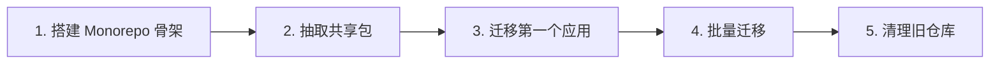

---

title: 30+ Laravel 仓库的 Monorepo 迁移实战：pnpm workspace + Turborepo + 共享包治理——从 Polyrepo
keywords: [Laravel, Monorepo, pnpm workspace, Turborepo, Polyrepo, 仓库的, 迁移实战, 共享包治理, 架构]
date: 2026-06-09 23:22:00
categories:
  - architecture
cover: https://images.unsplash.com/photo-1486406146926-c627a92ad1ab?w=1200&h=630&fit=crop
images:
  - https://images.unsplash.com/photo-1486406146926-c627a92ad1ab?w=1200&h=630&fit=crop
tags:
- Monorepo
- pnpm
- Turborepo
- Laravel
- 工程化
description: 从 KKday 30+ Laravel 仓库的痛点出发，详解 Monorepo 迁移的完整路径：pnpm workspace 依赖管理、Turborepo 构建编排、共享包治理、渐进式迁移策略与踩坑记录。
---


当团队维护 30+ 个 Laravel 仓库时，你会遇到一个又一个令人头疼的问题：同一个认证中间件在 5 个仓库里各有微小差异，升级 PHP 版本时要重复操作 30 次，跨仓库的功能复用全靠 Composer 私有包或手动拷贝。这篇文章记录了我们将 KKday 的多仓库（Polyrepo）架构迁移到 Monorepo 的完整实战过程，涵盖 pnpm workspace 依赖管理、Turborepo 构建编排、共享包的版本治理，以及渐进式迁移中的踩坑记录。

## 为什么要做 Monorepo

### Polyrepo 的痛点

先列一下我们的真实痛点：

```text
1. 依赖版本碎片化：30+ 仓库各自维护 composer.json，同一依赖出现 3+ 个版本
2. 代码复用靠 Copy-Paste：公共 Service、Trait、Middleware 在多个仓库里各有一份
3. 跨仓库改动协调：改一个共享 DTO 的字段，要同步改 5 个仓库，漏一个就是线上 Bug
4. CI/CD 成本线性增长：每个仓库独立 Pipeline，维护 30+ 套构建配置
5. 新人上手成本高：理解业务要 clone 5+ 个仓库，本地跑 5 个服务
```

### Monorepo 带来的收益

Monorepo 不是银弹，但对我们这种场景确实合适：

- **统一依赖管理**：一份 composer.json 管理所有依赖版本
- **原子提交**：改共享代码时，消费方的适配在同一 commit 里
- **统一 CI/CD**：一套 Pipeline 覆盖所有服务，Turborepo 增量构建只跑受影响的包
- **共享代码天然可用**：同个仓库里，import 就能用

## 技术选型：为什么是 pnpm + Turborepo

### Monorepo 工具对比

| 工具 | 依赖管理 | 构建编排 | 增量构建 | 生态成熟度 |
|------|---------|---------|---------|-----------|
| npm workspaces | npm | 无 | 无 | ⭐⭐⭐ |
| Yarn workspaces | yarn | 无 | 无 | ⭐⭐⭐ |
| **pnpm workspaces** | pnpm | 可选 | 需配合其他工具 | ⭐⭐⭐⭐ |
| **Turborepo** | 配合 pnpm/yarn | ✅ | ✅ | ⭐⭐⭐⭐⭐ |
| Lerna | 自带 | 有 | 有限 | ⭐⭐⭐ |
| Nx | 自带 | ✅ | ✅ | ⭐⭐⭐⭐⭐ |

我们的选择：**pnpm workspace + Turborepo**

- pnpm：磁盘效率高（content-addressable store）、严格的依赖隔离（幽灵依赖问题少）
- Turborepo：构建缓存 + 并行执行 + 增量构建，对 CI 加速明显
- 两者互补，不是竞争关系

### 为什么不选 Nx

Nx 功能更强但学习曲线陡、配置复杂度高。我们的场景不需要 Nx 的代码生成器和复杂的 Project Graph 分析。pnpm + Turborepo 组合更轻量，上手快。

## 项目结构设计

### 目录规划

```text
kday-platform/
├── apps/                          # 各 Laravel 服务
│   ├── b2c-api/                   # 主 B2C API（Laravel 8）
│   ├── b2b-portal/                # B2B 后台
│   ├── order-service/             # 订单服务
│   ├── payment-service/           # 支付服务
│   └── content-service/           # 内容服务
├── packages/                      # 共享包
│   ├── core/                      # 核心领域模型、DTO、接口
│   ├── auth/                      # 认证授权相关
│   ├── billing/                   # 计费相关
│   ├── common/                    # 通用工具类、Trait
│   └── laravel-config/            # 共享 Laravel 配置
├── pnpm-workspace.yaml            # pnpm 工作区定义
├── turbo.json                     # Turborepo 配置
├── composer.json                   # 根 composer.json
├── .github/
│   └── workflows/
│       ├── ci.yml                 # 统一 CI
│       └── deploy.yml             # 统一部署
└── README.md
```

### pnpm-workspace.yaml

```yaml
packages:
  - "apps/*"
  - "packages/*"
```

### turbo.json

```json
{
  "$schema": "https://turbo.build/schema.json",
  "tasks": {
    "build": {
      "dependsOn": ["^build"],
      "outputs": ["vendor/**"]
    },
    "test": {
      "dependsOn": ["build"],
      "outputs": ["vendor/**"]
    },
    "lint": {
      "outputs": []
    },
    "analyze": {
      "dependsOn": ["build"],
      "outputs": []
    }
  }
}
```

## 共享包设计

### 包的 composer.json 规范

每个 packages 下的包都是一个独立的 Composer 包，通过 workspace 协议引用。

以 `packages/core` 为例：

```json
{
  "name": "kday/core",
  "description": "KKday 核心领域模型与 DTO",
  "type": "library",
  "autoload": {
    "psr-4": {
      "KKday\\Core\\": "src/"
    }
  },
  "require": {
    "php": "^8.1",
    "illuminate/support": "^9.0|^10.0|^11.0"
  },
  "extra": {
    "laravel": {
      "providers": [
        "KKday\\Core\\CoreServiceProvider"
      ]
    }
  }
}
```

### 应用引用共享包

在 `apps/b2c-api/composer.json` 中：

```json
{
  "repositories": [
    {
      "type": "path",
      "url": "../../packages/*",
      "options": {
        "symlink": true
      }
    }
  ],
  "require": {
    "kday/core": "dev-main",
    "kday/auth": "dev-main",
    "kday/common": "dev-main"
  }
}
```

### 共享包实际示例：统一响应 DTO

```php
<?php
// packages/core/src/DTO/ApiResponse.php

declare(strict_types=1);

namespace KKday\Core\DTO;

use Illuminate\Http\JsonResponse;

class ApiResponse
{
    public function __construct(
        public readonly int $code,
        public readonly string $message,
        public readonly ?mixed $data = null,
        public readonly ?array $errors = null,
    ) {}

    public static function success(mixed $data = null, string $message = 'ok'): self
    {
        return new self(code: 200, message: $message, data: $data);
    }

    public static function error(int $code, string $message, ?array $errors = null): self
    {
        return new self(code: $code, message: $message, errors: $errors);
    }

    public function toJsonResponse(int $httpStatus = 200): JsonResponse
    {
        $payload = [
            'code'    => $this->code,
            'message' => $this->message,
        ];

        if ($this->data !== null) {
            $payload['data'] = $this->data;
        }

        if ($this->errors !== null) {
            $payload['errors'] = $this->errors;
        }

        return response()->json($payload, $httpStatus);
    }
}
```

使用时在任何应用里：

```php
use KKday\Core\DTO\ApiResponse;

// Controller 里
return ApiResponse::success($order)->toJsonResponse();
return ApiResponse::error(400, '参数错误', ['email' => '格式不正确'])->toJsonResponse(400);
```

### 共享包示例：统一认证中间件

```php
<?php
// packages/auth/src/Middleware/VerifyApiToken.php

declare(strict_types=1);

namespace KKday\Auth\Middleware;

use Closure;
use Illuminate\Http\Request;
use KKday\Core\DTO\ApiResponse;
use KKday\Auth\Services\TokenService;

class VerifyApiToken
{
    public function __construct(
        private TokenService $tokenService,
    ) {}

    public function handle(Request $request, Closure $next): mixed
    {
        $token = $request->bearerToken();

        if ($token === null) {
            return ApiResponse::error(401, '未提供认证令牌')->toJsonResponse(401);
        }

        $payload = $this->tokenService->verify($token);

        if ($payload === null) {
            return ApiResponse::error(401, '令牌无效或已过期')->toJsonResponse(401);
        }

        // 将用户信息注入 request
        $request->merge(['_auth_user' => $payload]);

        return $next($request);
    }
}
```

## 渐进式迁移策略

这是最关键的部分。**不要试图一次性把 30 个仓库塞进 Monorepo**，那是灾难。

### 迁移五步法



#### Step 1：搭建 Monorepo 骨架

先在新仓库里建好目录结构，配好 pnpm workspace 和 Turborepo，确保空项目能跑通 CI：

```bash
# 初始化
mkdir kday-platform && cd kday-platform
pnpm init
git init

# 创建 workspace 配置
cat > pnpm-workspace.yaml << 'EOF'
packages:
  - "apps/*"
  - "packages/*"
EOF

# 创建 turbo.json
cat > turbo.json << 'EOF'
{
  "$schema": "https://turbo.build/schema.json",
  "tasks": {
    "build": {
      "dependsOn": ["^build"],
      "outputs": ["vendor/**"]
    }
  }
}
EOF

# 初始化第一个应用
composer create-project laravel/laravel apps/b2c-api
# 初始化第一个共享包
mkdir -p packages/core/src
```

#### Step 2：抽取共享代码为包

**从重复最多的代码开始**。我们优先抽取了这些：

1. `kday/common`：通用工具类、Trait、Helper 函数
2. `kday/core`：领域模型、DTO、接口定义
3. `kday/auth`：认证授权中间件、Service

抽取过程：

```bash
# 从原仓库复制代码到共享包
cp -r ~/old-repos/b2c-api/app/Services/Common/ packages/common/src/

# 重构命名空间
find packages/common/src -name "*.php" -exec sed -i '' \
  's/namespace App\\Services\\Common/namespace KKday\\Common/g' {} \;

# 确保包能被所有应用引用
cd packages/common && composer dump-autoload && cd ../..
```

#### Step 3：迁移第一个应用（选最简单的）

**不要从主仓库开始**。选一个依赖少、功能独立的小服务先试水：

```bash
# 迁移 content-service（我们选了它，因为依赖最少）
cp -r ~/old-repos/content-service/ apps/content-service/

# 修改 composer.json，把直接依赖改为引用共享包
# 删除旧的 vendor 目录
rm -rf apps/content-service/vendor

# 重新安装依赖（workspace 协议会自动 symlink 共享包）
cd apps/content-service && composer install && cd ../..

# 跑测试确认功能正常
cd apps/content-service && php artisan test && cd ../..
```

#### Step 4：批量迁移

第一个应用跑通后，批量迁移就变成了重复性工作。写个脚本：

```bash
#!/bin/bash
# migrate-app.sh

APP_NAME=$1

echo "迁移 $APP_NAME ..."

# 1. 复制应用代码
cp -r ~/old-repos/"$APP_NAME"/ "apps/$APP_NAME/"

# 2. 清理旧 vendor
rm -rf "apps/$APP_NAME/vendor"

# 3. 修改 composer.json 引用共享包
cd "apps/$APP_NAME"
composer require kday/core:dev-main kday/auth:dev-main kday/common:dev-main
composer install

# 4. 跑测试
php artisan test
cd ../..

echo "$APP_NAME 迁移完成"
```

```bash
# 批量执行
for app in order-service payment-service b2b-portal; do
  ./migrate-app.sh "$app"
done
```

#### Step 5：清理旧仓库

所有应用迁移完成并稳定运行 2 周后：

1. 在旧仓库 README 里标注「已迁移至 kday-platform」
2. 将旧仓库设为 Archive（只读）
3. 删除旧仓库的 CI/CD Pipeline

## Turborepo 增量构建实战

### 缓存效果

Turborepo 最大的价值是**构建缓存**。第一次全量构建后，后续只重新构建有变更的包：

```bash
# 首次全量构建
pnpm turbo run build
# Tasks: 35 total
# Full build time: 4m 32s

# 修改 packages/common 后重新构建
pnpm turbo run build
# Tasks: 8 total (只构建 common + 依赖 common 的 7 个应用)
# Time: 1m 15s（从 4m 32s 降到 1m 15s）
```

### Turborepo 远程缓存

在 CI 里开启远程缓存，本地构建过的产物也能被 CI 复用：

```bash
# 配置 Turbo 远程缓存
pnpm turbo login

# turbo.json 里启用
{
  "remoteCache": {
    "signature": true
  }
}
```

### 并行构建

Turborepo 自动识别依赖图，无依赖的应用并行构建：

```text
构建图：
  common ─┬─→ b2c-api
          ├─→ b2b-portal
          ├─→ order-service
          └─→ payment-service

Turborepo 会先构建 common（串行），然后并行构建 4 个应用
```

## CI/CD 统一化

### GitHub Actions 示例

```yaml
# .github/workflows/ci.yml
name: CI

on:
  push:
    branches: [main]
  pull_request:
    branches: [main]

jobs:
  # 只测试有变更的包
  detect-changes:
    runs-on: ubuntu-latest
    outputs:
      common: ${{ steps.changes.outputs.common }}
      core: ${{ steps.changes.outputs.core }}
      b2c-api: ${{ steps.changes.outputs.b2c-api }}
    steps:
      - uses: actions/checkout@v4
      - uses: dorny/paths-filter@v3
        id: changes
        with:
          filters: |
            common:
              - 'packages/common/**'
            core:
              - 'packages/core/**'
            b2c-api:
              - 'apps/b2c-api/**'
              - 'packages/**'

  test-common:
    needs: detect-changes
    if: needs.detect-changes.outputs.common == 'true'
    runs-on: ubuntu-latest
    steps:
      - uses: actions/checkout@v4
      - uses: pnpm/action-setup@v4
      - run: pnpm install
      - run: pnpm --filter @kday/common test

  test-b2c-api:
    needs: detect-changes
    if: needs.detect-changes.outputs.b2c-api == 'true'
    runs-on: ubuntu-latest
    steps:
      - uses: actions/checkout@v4
      - uses: pnpm/action-setup@v4
      - uses: shivammathur/setup-php@v2
        with:
          php-version: '8.2'
      - run: pnpm install
      - run: pnpm --filter b2c-api test
```

效果：改动 `packages/common` 只跑 common 的测试 + 引用了 common 的应用测试；改动某个应用只跑那个应用的测试。

## 踩坑记录

### 坑 1：PHP 的 Composer 与 pnpm 的冲突

**问题**：pnpm workspace 管理 JS 依赖，Composer 管理 PHP 依赖，两者各有各的 workspace 机制，容易混淆。

**解法**：明确职责边界——

- pnpm workspace 只负责 JS 构建工具（如 Vite、前端资源编译）
- Composer（path repository）负责 PHP 包管理
- 两者独立，互不干扰

```yaml
# pnpm-workspace.yaml 只管 JS
packages:
  - "apps/*"
  - "packages/*"
  - "tools/*"      # 构建脚本等 JS 工具
```

```json
// composer.json 里的 path repository 只管 PHP
{
  "repositories": [
    {
      "type": "path",
      "url": "../../packages/*",
      "options": { "symlink": true }
    }
  ]
}
```

### 坑 2：Symlink 导致的路径问题

**问题**：Laravel 的 `app_path()`、`base_path()` 等辅助函数在 symlink 场景下返回的是链接目标路径，而不是实际路径，导致配置文件加载异常。

**解法**：使用 `realpath()` 包装，或在 ServiceProvider 里显式设置路径：

```php
// packages/laravel-config/src/LaravelConfigServiceProvider.php
public function boot(): void
{
    // 修正 symlink 场景下的路径
    $realBasePath = realpath($this->app->basePath()) ?: $this->app->basePath();
    $this->app->useBasePath($realBasePath);
}
```

### 坑 3：共享包版本管理

**问题**：30 个应用引用 `kday/core: dev-main`，如果 core 有破坏性变更，所有应用都可能挂。

**解法**：语义化版本 + 分支策略

```json
{
  "require": {
    "kday/core": "^1.0",
    "kday/auth": "^1.0",
    "kday/common": "^1.0"
  }
}
```

- 共享包用 Git tag 标记版本（v1.0.0, v1.1.0...）
- 应用引用 `^1.0` 而不是 `dev-main`
- 破坏性变更发大版本（v2.0.0），各应用按节奏升级

```bash
# 发布共享包新版本
cd packages/core
git tag v1.2.0
git push origin v1.2.0

# 应用更新引用
cd apps/b2c-api
composer require kday/core:^1.2
```

### 坑 4：IDE 索引爆炸

**问题**：30 个应用 + 多个共享包，IDE（PhpStorm/VS Code）要索引的文件数量暴增，打开项目慢得离谱。

**解法**：

```json
// .vscode/settings.json
{
  "files.exclude": {
    "**/vendor": true,
    "**/node_modules": true,
    "**/.git": true
  },
  "php.validate.executablePath": "./apps/b2c-api/vendor/bin/php"
}
```

PhpStorm 用户：只打开需要开发的应用目录，不要打开整个 Monorepo 根目录。

### 坑 5：数据库迁移冲突

**问题**：多个应用的 Migration 文件名可能重复（都用时间戳），放在一起会冲突。

**解法**：每个应用保持自己的 Migration 目录，通过 Composer autoload 隔离：

```json
// apps/b2c-api/composer.json
{
  "autoload": {
    "psr-4": {
      "App\\": "app/",
      "Database\\Migrations\\": "database/migrations/"
    }
  }
}
```

运行时指定迁移路径：

```bash
php artisan migrate --path=database/migrations --database=mysql
```

## 迁移效果数据

迁移完成后的数据对比：

| 指标 | 迁移前（Polyrepo） | 迁移后（Monorepo） |
|------|-------------------|-------------------|
| 公共代码重复率 | ~35% | <5% |
| 依赖版本碎片 | 3-4 个版本并存 | 统一版本 |
| CI 构建时间（全量） | 30 个独立 Pipeline × ~3min | 1 个 Pipeline 增量 ~4min |
| 新人上手 clone 次数 | 5+ 次 | 1 次 |
| 跨仓库改动协调 | 手动同步，易遗漏 | 原子提交 |
| 磁盘空间（本地开发） | ~12GB | ~5GB（pnpm 共享 store） |

## 总结

Monorepo 迁移不是一次性工程，而是持续演进的过程。几个关键原则：

1. **渐进式迁移**：一个应用一个应用地迁，不要大爆炸
2. **共享包先行**：先抽取重复代码为共享包，再迁应用
3. **工具链轻量**：pnpm + Turborepo 组合够用，不要过度工程化
4. **CI/CD 统一**：迁移的核心收益之一，从 Day 1 就要规划好
5. **版本治理**：共享包要用语义化版本，不能一直 `dev-main`

我们的迁移经历了 3 个月，覆盖了 30+ 个仓库中最核心的 8 个应用。剩余的低频应用在后续几个季度逐步迁移。关键是：**先跑通一个，再复制到其他**。不要试图一步到位。

---

*本文基于 KKday 实际项目经验，部分配置细节已脱敏处理。*
