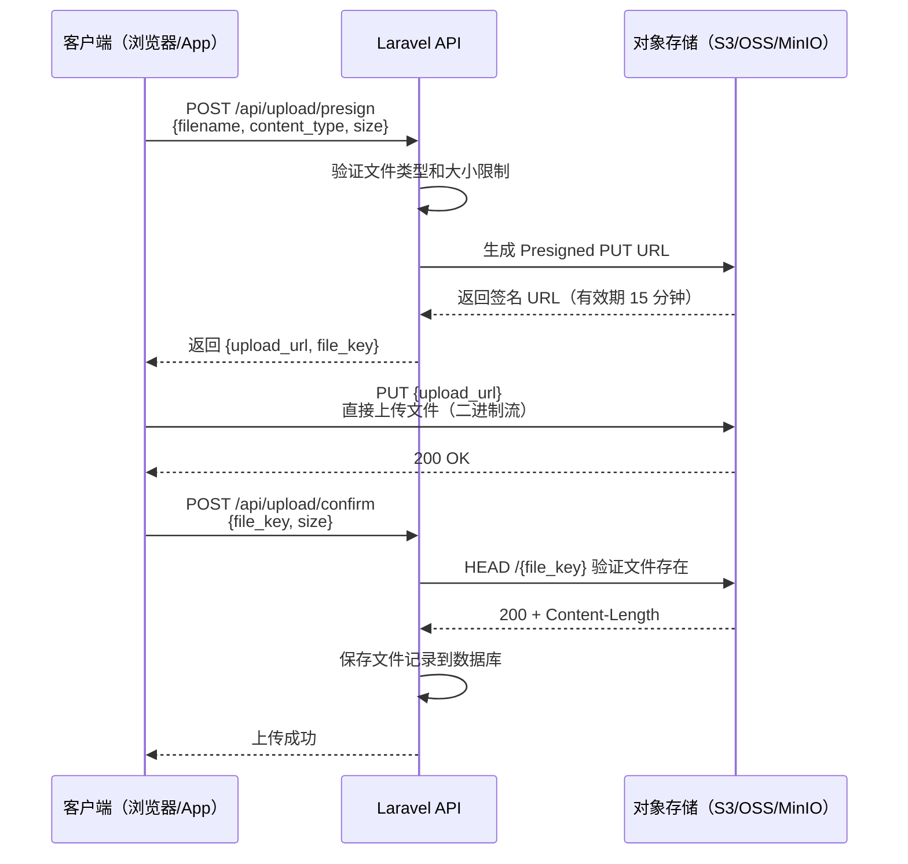
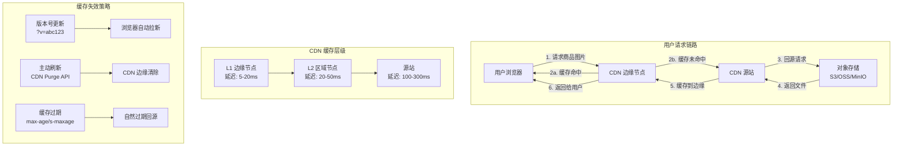
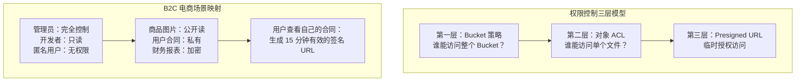

---

title: 对象存储实战：文件上传、CDN 加速与权限控制的架构设计与 Laravel 落地踩坑记录
date: 2026-06-01 16:00:00
categories:
  - architecture
  - 云服务
  - php
keywords: [CDN, Laravel, 对象存储实战, 文件上传, 加速与权限控制的架构设计与, 落地踩坑记录]
tags:
- 对象存储
- AWS S3
- 阿里云
- MinIO
- CDN
- 文件上传
- 权限控制
- Storage
- Flysystem
description: 不谈云厂商对比，只聊对象存储的三个核心运维命题：大文件上传怎么做才可靠？CDN 缓存怎么配才不翻车？权限模型怎么设计才安全？本文从 Laravel B2C 电商真实场景出发，用源码级剖析和生产踩坑记录给出答案。
cover: https://images.unsplash.com/photo-1486406146926-c627a92ad1ab?w=1200&h=630&fit=crop
images:
- /images/content/arch-007-content-1.jpg
- /images/content/arch-007-content-2.jpg
---


# 对象存储实战：文件上传、CDN 加速与权限控制的架构设计与 Laravel 落地踩坑记录

## 前言：三个被低估的运维命题

大多数 Laravel 开发者对对象存储的认知停留在 `Storage::put()` 和 `Storage::url()` 这两个方法上。上传文件？一行代码搞定。获取 URL？一行代码搞定。但当你的 B2C 电商系统开始处理这些场景时，事情会变得复杂：

- 用户上传 200MB 的旅行视频，网络抖动导致上传失败，如何断点续传？
- 商品详情页有 50 张图片，如何让首屏加载时间从 3 秒降到 800 毫秒？
- 用户的身份证照片、合同 PDF，如何确保只有本人和客服能访问，其他人（包括开发者）都无法查看？

这三个问题分别对应对象存储的三个核心运维命题：**文件上传**、**CDN 加速**、**权限控制**。本文不讨论云厂商选型（那是另一个话题），而是深入这三个命题的架构设计原理、Laravel 集成实现和生产环境踩坑记录。

---

## 一、文件上传：从 `Storage::put()` 到工业级上传方案

### 1.1 为什么直接上传不可靠？

Laravel 的 `Storage::put()` 背后是标准的 HTTP PUT 请求。对于小文件（< 5MB），这完全没问题。但在 B2C 电商场景中，你会遇到：

| 场景 | 文件大小 | 直接上传的问题 |
|------|---------|---------------|
| 商品主图 | 1-5MB | ✅ 可以直接上传 |
| 旅行视频 | 50-500MB | ❌ 请求超时、内存溢出 |
| 批量导入 CSV | 10-100MB | ❌ PHP 内存限制（默认 128MB） |
| 用户头像裁剪 | 500KB-2MB | ✅ 可以直接上传 |
| 合同 PDF | 5-20MB | ⚠️ 边界情况，需要分片 |

直接上传的核心问题有两个：

**第一，PHP-FPM 的内存和超时限制**。当你用 `file_get_contents('php://input')` 读取上传文件时，整个文件会被加载到内存中。一个 200MB 的视频上传意味着 200MB+ 的内存占用，而 PHP-FPM 的默认内存限制是 128MB。

**第二，网络不可靠性**。用户在手机端上传视频时，网络可能在任何时刻中断。直接上传意味着失败后必须从头开始，这对用户体验是灾难性的。

### 1.2 Presigned URL：让客户端直传对象存储

解决方案是 **Presigned URL**（预签名 URL）。核心思路是：后端不接收文件，而是生成一个有时效性的签名 URL，让客户端直接上传到对象存储。



Laravel 中生成 Presigned URL 的代码：

```php
<?php

namespace App\Services\Storage;

use Illuminate\Support\Facades\Storage;
use Aws\S3\S3Client;
use Carbon\Carbon;

class PresignedUrlService
{
    private S3Client $client;
    private string $bucket;
    private int $expiresIn;

    public function __construct()
    {
        $this->client = new S3Client([
            'region'  => config('filesystems.disks.s3.region'),
            'version' => 'latest',
            'credentials' => [
                'key'    => config('filesystems.disks.s3.key'),
                'secret' => config('filesystems.disks.s3.secret'),
            ],
            // MinIO 或阿里云 OSS 需要指定 endpoint
            'endpoint' => config('filesystems.disks.s3.endpoint'),
            'use_path_style_endpoint' => config('filesystems.disks.s3.use_path_style', false),
        ]);

        $this->bucket = config('filesystems.disks.s3.bucket');
        $this->expiresIn = config('services.upload.presign_expires', 900); // 15 分钟
    }

    /**
     * 生成预签名上传 URL
     *
     * @param string $fileKey  文件存储路径（如 uploads/2026/06/abc123.jpg）
     * @param string $contentType  MIME 类型
     * @param int    $maxSize  最大文件大小（字节）
     * @return array{upload_url: string, file_key: string, expires_at: string}
     */
    public function generateUploadUrl(
        string $fileKey,
        string $contentType,
        int $maxSize = 104857600 // 100MB
    ): array {
        $command = $this->client->getCommand('PutObject', [
            'Bucket'        => $this->bucket,
            'Key'           => $fileKey,
            'ContentType'   => $contentType,
            'ContentLength' => $maxSize, // 服务端会在 confirm 时二次校验
            // 关键：设置服务端加密
            'ServerSideEncryption' => 'AES256',
            // 设置元数据，用于后续权限校验
            'Metadata' => [
                'uploaded-by' => auth()->id() ?? 'anonymous',
                'upload-time' => now()->toISOString(),
            ],
        ]);

        $request = $this->client->createPresignedRequest(
            $command,
            '+' . $this->expiresIn . ' seconds'
        );

        return [
            'upload_url' => (string) $request->getUri(),
            'file_key'   => $fileKey,
            'expires_at' => Carbon::now()->addSeconds($this->expiresIn)->toISOString(),
        ];
    }

    /**
     * 生成文件存储路径
     * 使用日期 + UUID 避免文件名冲突和信息泄露
     */
    public function generateFileKey(string $originalName, string $prefix = 'uploads'): string
    {
        $extension = pathinfo($originalName, PATHINFO_EXTENSION);
        $datePath = now()->format('Y/m/d');
        $uuid = bin2hex(random_bytes(16));

        return "{$prefix}/{$datePath}/{$uuid}.{$extension}";
    }

    /**
     * 验证文件是否已成功上传
     */
    public function verifyUpload(string $fileKey, int $expectedSize): bool
    {
        try {
            $metadata = $this->client->headObject([
                'Bucket' => $this->bucket,
                'Key'    => $fileKey,
            ]);

            return (int) $metadata['ContentLength'] === $expectedSize;
        } catch (\Exception $e) {
            return false;
        }
    }
}
```

### 1.3 分片上传：大文件的可靠传输方案

对于超过 100MB 的文件，即使使用 Presigned URL 直传，单次请求仍然不可靠。解决方案是 **Multipart Upload**（分片上传）。

核心原理：将大文件切割成多个小分片（通常 5-100MB/片），每个分片独立上传，最后合并。如果某个分片失败，只需重传该分片。

```php
<?php

namespace App\Services\Storage;

use Aws\S3\MultipartUploader;
use Aws\S3\ObjectUploader;
use Aws\Exception\MultipartUploadException;
use Illuminate\Http\UploadedFile;

class MultipartUploadService
{
    private \Aws\S3\S3Client $client;
    private string $bucket;

    // 分片大小：10MB（经验值：太大则单片重传成本高，太小则请求数过多）
    const PART_SIZE = 10 * 1024 * 1024;

    public function __construct()
    {
        $this->client = app(PresignedUrlService::class)->getClient();
        $this->bucket = config('filesystems.disks.s3.bucket');
    }

    /**
     * 服务端分片上传（适用于后端代理上传场景）
     */
    public function uploadFile(UploadedFile $file, string $fileKey): array
    {
        $fileSize = $file->getSize();

        // 小于 5MB 直接上传
        if ($fileSize < 5 * 1024 * 1024) {
            $uploader = new ObjectUploader(
                $this->client,
                $this->bucket,
                $fileKey,
                fopen($file->getRealPath(), 'r'),
                ['acl' => 'private']
            );
        } else {
            // 大于 5MB 使用分片上传
            $uploader = new MultipartUploader(
                $this->client,
                fopen($file->getRealPath(), 'r'),
                [
                    'bucket'  => $this->bucket,
                    'key'     => $fileKey,
                    'acl'     => 'private',
                    'part_size' => self::PART_SIZE,
                    // 并发上传分片数（根据服务器带宽调整）
                    'concurrency' => 3,
                    // 分片上传的完整性校验
                    'before_initiate' => function (\Aws\Command $command) use ($file) {
                        $command['Metadata'] = [
                            'original-name' => $file->getClientOriginalName(),
                            'uploaded-by'   => (string) auth()->id(),
                        ];
                    },
                ]
            );
        }

        try {
            $result = $uploader->upload();

            return [
                'success'  => true,
                'file_key' => $fileKey,
                'url'      => $result['ObjectURL'] ?? $result['Location'],
                'etag'     => $result['ETag'] ?? null,
            ];
        } catch (MultipartUploadException $e) {
            // 关键：失败时中止分片上传，释放服务端资源
            $uploader->abort();

            report($e);

            return [
                'success' => false,
                'error'   => '文件上传失败，请重试',
            ];
        }
    }
}
```

### 1.4 客户端分片 + Presigned URL：最佳实践

对于移动端大文件上传，最优方案是 **客户端分片 + 服务端生成 Presigned URL**。每个分片都有独立的 Presigned URL，支持断点续传。

```php
<?php

namespace App\Http\Controllers\Api;

use App\Services\Storage\PresignedUrlService;
use Illuminate\Http\JsonResponse;
use Illuminate\Http\Request;

class UploadController extends Controller
{
    public function __construct(
        private PresignedUrlService $presignService
    ) {}

    /**
     * 初始化分片上传
     * POST /api/upload/multipart/init
     */
    public function initMultipart(Request $request): JsonResponse
    {
        $request->validate([
            'filename'     => 'required|string|max:255',
            'content_type' => 'required|string|in:image/jpeg,image/png,video/mp4,application/pdf',
            'file_size'    => 'required|integer|max:524288000', // 500MB
            'total_parts'  => 'required|integer|min:1|max:10000',
        ]);

        $fileKey = $this->presignService->generateFileKey(
            $request->input('filename'),
            'uploads/multipart'
        );

        // 初始化分片上传（调用 S3 CreateMultipartUpload）
        $result = $this->presignService->initMultipartUpload(
            $fileKey,
            $request->input('content_type')
        );

        // 将上传状态存入 Redis，用于断点续传
        $uploadId = $result['UploadId'];
        cache()->put("multipart:{$uploadId}", [
            'file_key'    => $fileKey,
            'upload_id'   => $uploadId,
            'total_parts' => $request->input('total_parts'),
            'uploaded_parts' => [],
            'user_id'     => auth()->id(),
            'created_at'  => now()->toISOString(),
        ], 3600); // 1 小时过期

        return response()->json([
            'upload_id' => $uploadId,
            'file_key'  => $fileKey,
        ]);
    }

    /**
     * 获取单个分片的 Presigned URL
     * POST /api/upload/multipart/presign-part
     */
    public function presignPart(Request $request): JsonResponse
    {
        $request->validate([
            'upload_id' => 'required|string',
            'part_number' => 'required|integer|min:1|max:10000',
        ]);

        $uploadInfo = cache()->get("multipart:{$request->input('upload_id')}");
        abort_unless($uploadInfo, 404, '上传任务不存在或已过期');
        abort_unless($uploadInfo['user_id'] === auth()->id(), 403);

        $presignedUrl = $this->presignService->presignPart(
            $uploadInfo['file_key'],
            $uploadInfo['upload_id'],
            $request->input('part_number')
        );

        return response()->json([
            'presigned_url' => $presignedUrl,
            'part_number'   => $request->input('part_number'),
        ]);
    }

    /**
     * 完成分片上传
     * POST /api/upload/multipart/complete
     */
    public function completeMultipart(Request $request): JsonResponse
    {
        $request->validate([
            'upload_id' => 'required|string',
            'parts'     => 'required|array|min:1',
            'parts.*.part_number' => 'required|integer',
            'parts.*.etag'        => 'required|string',
        ]);

        $uploadInfo = cache()->get("multipart:{$request->input('upload_id')}");
        abort_unless($uploadInfo, 404, '上传任务不存在或已过期');

        $result = $this->presignService->completeMultipartUpload(
            $uploadInfo['file_key'],
            $uploadInfo['upload_id'],
            $request->input('parts')
        );

        // 清理 Redis 缓存
        cache()->forget("multipart:{$request->input('upload_id')}");

        // 保存文件记录到数据库
        $file = $this->saveFileRecord(
            $uploadInfo['file_key'],
            $uploadInfo['user_id']
        );

        return response()->json([
            'success' => true,
            'file'    => $file,
        ]);
    }
}
```

### 1.5 上传方案对比

| 方案 | 适用文件大小 | 可靠性 | 服务端压力 | 实现复杂度 | 适用场景 |
|------|------------|--------|-----------|-----------|---------|
| `Storage::put()` 直传 | < 5MB | 低 | 高 | ⭐ | 管理后台小文件上传 |
| Presigned URL 直传 | < 100MB | 中 | 低 | ⭐⭐ | 用户头像、商品图片 |
| 分片上传（服务端代理） | < 2GB | 高 | 高 | ⭐⭐⭐ | 后台批量导入 |
| 客户端分片 + Presigned URL | < 5GB | 高 | 极低 | ⭐⭐⭐⭐ | 用户视频上传、大文件 |

---

## 二、CDN 加速：从"能用"到"好用"的配置进阶

### 2.1 为什么对象存储 + CDN 是标配？

对象存储的直接访问（如 `https://bucket.s3.amazonaws.com/key`）存在两个问题：

1. **延迟高**：对象存储通常部署在单个区域（如 `us-east-1`），跨区域访问延迟 100-300ms
2. **成本高**：对象存储的流出流量费用比 CDN 贵 2-5 倍

CDN 通过在全球边缘节点缓存内容，将访问延迟降到 10-50ms，同时降低对象存储的流出流量费用。

### 2.2 CDN 缓存策略设计

CDN 的核心是缓存策略。配置不当会导致两个极端问题：

- **缓存过短**：CDN 回源频繁，延迟和成本都高
- **缓存过长**：用户看到旧内容，特别是商品图片更新后

**最佳实践：基于文件类型的分级缓存策略**

```nginx
# Nginx CDN 回源配置示例
location ~* \.(jpg|jpeg|png|gif|webp|avif)$ {
    # 图片：缓存 30 天
    add_header Cache-Control "public, max-age=2592000, immutable";
    add_header X-Cache-Status $upstream_cache_status;
}

location ~* \.(css|js)$ {
    # 静态资源：缓存 7 天（带版本号时可用 immutable）
    add_header Cache-Control "public, max-age=604800";
}

location ~* \.(mp4|webm|mov)$ {
    # 视频：缓存 7 天，支持 Range 请求
    add_header Cache-Control "public, max-age=604800";
    add_header Accept-Ranges bytes;
}

location ~* \.(pdf|doc|docx)$ {
    # 文档：缓存 1 天，私有（用户合同等敏感文档）
    add_header Cache-Control "private, max-age=86400";
}
```

### 2.3 Cache-Control 深度解析

很多开发者对 `Cache-Control` 的理解停留在 `max-age` 上，但在 B2C 电商场景中，你需要理解更多指令：

```
Cache-Control: public, max-age=2592000, s-maxage=2592000, immutable
```

| 指令 | 含义 | 电商场景用途 |
|------|------|------------|
| `public` | CDN 和浏览器都可以缓存 | 商品图片、CSS/JS |
| `private` | 只有浏览器可以缓存，CDN 不缓存 | 用户合同、身份证照片 |
| `max-age=N` | 浏览器缓存 N 秒 | 控制浏览器缓存 |
| `s-maxage=N` | CDN 缓存 N 秒（覆盖 max-age） | 控制 CDN 缓存 |
| `immutable` | 资源不会变化，浏览器不需要重新验证 | 带版本号的静态资源 |
| `no-store` | 完全不缓存 | 支付回调页面 |
| `no-cache` | 每次使用前必须验证 | API 响应 |
| `must-revalidate` | 缓存过期后必须验证 | 需要实时性的内容 |

**踩坑记录**：我们曾经在商品图片上设置了 `Cache-Control: public, max-age=86400`（1 天），但运营反馈图片更新后用户看到的还是旧图。原因是 CDN 边缘节点缓存了旧图片，而 `max-age` 只控制浏览器缓存，不控制 CDN。

**解决方案**：使用 `s-maxage` 单独控制 CDN 缓存时间，并结合版本号实现即时更新：

```php
<?php

namespace App\Services\Storage;

class CdnUrlService
{
    /**
     * 生成带版本号的 CDN URL
     * 文件更新时版本号变化，CDN 会当作新资源重新拉取
     */
    public function getCacheableUrl(string $fileKey, ?string $version = null): string
    {
        $cdnBase = rtrim(config('services.cdn.base_url'), '/');
        $version = $version ?? md5($fileKey . filemtime(storage_path($fileKey)));

        return "{$cdnBase}/{$fileKey}?v={$version}";
    }

    /**
     * 主动刷新 CDN 缓存（文件更新后调用）
     */
    public function purgeCache(string $fileKey): bool
    {
        $cdnAdapter = config('services.cdn.provider');

        return match ($cdnAdapter) {
            'cloudfront' => $this->purgeCloudFront($fileKey),
            'alicdn'     => $this->purgeAliCdn($fileKey),
            'cloudflare' => $this->purgeCloudFlare($fileKey),
            default      => false,
        };
    }

    private function purgeCloudFront(string $fileKey): bool
    {
        $client = new \Aws\CloudFront\CloudFrontClient([
            'region' => config('services.cdn.cloudfront.region'),
            'version' => 'latest',
        ]);

        $client->createInvalidation([
            'DistributionId' => config('services.cdn.cloudfront.distribution_id'),
            'InvalidationBatch' => [
                'Paths' => [
                    'Quantity' => 1,
                    'Items'    => ["/{$fileKey}"],
                ],
                'CallerReference' => now()->timestamp,
            ],
        ]);

        return true;
    }
}
```

### 2.4 WebP/AVIF 图片优化

在 B2C 电商中，商品图片通常占页面流量的 60-80%。使用现代图片格式可以显著减少传输大小：

| 格式 | 压缩率（相对 JPEG） | 浏览器支持 | 适用场景 |
|------|-------------------|-----------|---------|
| JPEG | 100%（基准） | 全部 | 兼容性兜底 |
| WebP | 60-70% | 97%+ | 首选格式 |
| AVIF | 45-55% | 85%+ | 高端设备优化 |

**Nginx 自动格式转换配置**：

```nginx
# 自动协商图片格式（Accept-Negotiation）
map $http_accept $webp_suffix {
    default "";
    "~*webp" ".webp";
}

map $http_accept $avif_suffix {
    default "";
    "~*avif" ".avif";
}

# 图片格式协商 + CDN 缓存
location ~* \.(jpg|jpeg|png)$ {
    set $img_suffix "";

    if ($http_accept ~* "avif") {
        set $img_suffix ".avif";
    }
    if ($http_accept ~* "webp") {
        set $img_suffix ".webp";
    }

    # 尝试返回优化格式，不存在则返回原图
    try_files $uri$img_suffix $uri =404;

    add_header Cache-Control "public, max-age=2592000, s-maxage=2592000";
    add_header Vary "Accept";
    add_header X-Image-Format $img_suffix;
}
```

### 2.5 CDN 架构图



---

## 三、权限控制：对象存储的安全防线

### 3.1 权限模型的三个层次

对象存储的权限控制分为三个层次，很多开发者只关注了第一层：



### 3.2 Bucket 策略：第一层防线

Bucket 策略定义了谁能访问整个存储桶。这是最重要的安全边界。

```json
{
    "Version": "2012-10-17",
    "Statement": [
        {
            "Sid": "AllowPublicReadForProductImages",
            "Effect": "Allow",
            "Principal": "*",
            "Action": "s3:GetObject",
            "Resource": "arn:aws:s3:::my-bucket/products/*"
        },
        {
            "Sid": "DenyPublicAccessForUserDocuments",
            "Effect": "Deny",
            "Principal": "*",
            "Action": "s3:GetObject",
            "Resource": "arn:aws:s3:::my-bucket/users/*/documents/*",
            "Condition": {
                "StringNotEquals": {
                    "s3:ExistingObjectTag/owner-id": "${aws:userid}"
                }
            }
        },
        {
            "Sid": "AllowAppServerFullAccess",
            "Effect": "Allow",
            "Principal": {
                "AWS": "arn:aws:iam::123456789:role/laravel-app-role"
            },
            "Action": "s3:*",
            "Resource": [
                "arn:aws:s3:::my-bucket",
                "arn:aws:s3:::my-bucket/*"
            ]
        },
        {
            "Sid": "EnforceEncryptionInTransit",
            "Effect": "Deny",
            "Principal": "*",
            "Action": "s3:*",
            "Resource": [
                "arn:aws:s3:::my-bucket",
                "arn:aws:s3:::my-bucket/*"
            ],
            "Condition": {
                "Bool": {
                    "aws:SecureTransport": "false"
                }
            }
        }
    ]
}
```

**踩坑记录**：我们曾经在 Bucket 策略中使用 `"Principal": "*"` + `"Action": "s3:GetObject"` 来允许 CDN 回源访问，但忘记限制 Resource 路径，导致用户私有文档也被公开访问。

**教训**：Bucket 策略中的 `Resource` 必须精确到路径前缀，不能使用 `/*` 通配整个 Bucket。

### 3.3 Laravel 中的权限控制实现

```php
<?php

namespace App\Services\Storage;

use Illuminate\Support\Facades\Storage;

class FilePermissionService
{
    /**
     * 文件可见性配置映射
     * key: 文件类型
     * value: S3 ACL 和 CDN 缓存策略
     */
    private const VISIBILITY_MAP = [
        'product_image' => [
            'acl'         => 'public-read',
            'cache_control' => 'public, max-age=2592000, s-maxage=2592000',
            'cdn_enabled' => true,
        ],
        'user_avatar' => [
            'acl'         => 'public-read',
            'cache_control' => 'public, max-age=86400, s-maxage=86400',
            'cdn_enabled' => true,
        ],
        'user_document' => [
            'acl'         => 'private',
            'cache_control' => 'private, no-store',
            'cdn_enabled' => false,
        ],
        'contract_pdf' => [
            'acl'         => 'private',
            'cache_control' => 'private, no-store',
            'cdn_enabled' => false,
        ],
    ];

    /**
     * 根据文件类型上传并设置权限
     */
    public function uploadWithPermission(
        string $fileKey,
        string $content,
        string $fileType
    ): array {
        $config = self::VISIBILITY_MAP[$fileType]
            ?? self::VISIBILITY_MAP['user_document']; // 默认私有

        $disk = Storage::disk('s3');

        // 上传文件
        $disk->put($fileKey, $content, [
            'visibility'   => $config['acl'],
            'CacheControl' => $config['cache_control'],
            // 服务端加密
            'ServerSideEncryption' => 'AES256',
            // 添加元数据标签，用于 Bucket 策略匹配
            'Tagging' => http_build_query([
                'owner-id'  => (string) auth()->id(),
                'file-type' => $fileType,
                'uploaded'  => now()->toISOString(),
            ]),
        ]);

        return [
            'file_key'    => $fileKey,
            'visibility'  => $config['acl'],
            'cdn_enabled' => $config['cdn_enabled'],
            'url'         => $config['cdn_enabled']
                ? $this->getCdnUrl($fileKey)
                : $this->getSignedUrl($fileKey, 3600),
        ];
    }

    /**
     * 生成临时访问 URL（用于私有文件）
     */
    public function getSignedUrl(string $fileKey, int $expiresIn = 900): string
    {
        return Storage::disk('s3')->temporaryUrl(
            $fileKey,
            now()->addSeconds($expiresIn)
        );
    }

    /**
     * 获取 CDN URL（用于公开文件）
     */
    private function getCdnUrl(string $fileKey): string
    {
        $cdnBase = rtrim(config('services.cdn.base_url'), '/');
        return "{$cdnBase}/{$fileKey}";
    }

    /**
     * 检查用户是否有权访问文件
     */
    public function canAccess(string $fileKey, ?int $userId = null): bool
    {
        $disk = Storage::disk('s3');

        // 获取文件标签
        $tags = $disk->getMetadata($fileKey);

        // 公开文件：任何人都可以访问
        if ($this->isPublicFile($fileKey)) {
            return true;
        }

        // 私有文件：只有文件所有者可以访问
        $ownerId = $this->getOwnerFromTags($fileKey);
        return $ownerId === (string) $userId;
    }
}
```

### 3.4 Presigned URL 的安全陷阱

Presigned URL 是对象存储权限控制的核心机制，但使用不当会带来安全风险：

**陷阱 1：URL 泄露**

```
# 错误：将 Presigned URL 存入数据库或日志
Log::info('Generated signed URL', ['url' => $signedUrl]);

# 正确：只记录文件 Key，不记录签名 URL
Log::info('Generated signed URL', ['file_key' => $fileKey, 'expires' => $expiresIn]);
```

**陷阱 2：过期时间过长**

```php
// ❌ 错误：Presigned URL 有效期 7 天
$url = Storage::temporaryUrl($fileKey, now()->addDays(7));

// ✅ 正确：根据场景设置合理的过期时间
// 用户查看合同：15 分钟
$url = Storage::temporaryUrl($fileKey, now()->addMinutes(15));

// 后台预览：1 小时
$url = Storage::temporaryUrl($fileKey, now()->addHour());
```

**陷阱 3：未校验文件所有权**

```php
// ❌ 错误：只校验用户是否登录，不校验文件所有权
public function download(Request $request, string $fileKey)
{
    $url = Storage::temporaryUrl($fileKey, now()->addMinutes(15));
    return response()->json(['url' => $url]);
}

// ✅ 正确：校验文件所有权
public function download(Request $request, string $fileKey)
{
    $file = FileRecord::where('file_key', $fileKey)->firstOrFail();

    // 校验文件所有权
    abort_unless(
        $file->user_id === auth()->id() || auth()->user()->isAdmin(),
        403,
        '无权访问此文件'
    );

    $url = Storage::temporaryUrl($fileKey, now()->addMinutes(15));

    // 记录访问日志（审计）
    FileAccessLog::create([
        'file_key'  => $fileKey,
        'user_id'   => auth()->id(),
        'ip'        => $request->ip(),
        'user_agent' => $request->userAgent(),
    ]);

    return response()->json(['url' => $url]);
}
```

---

## 四、真实踩坑记录

### 踩坑 1：CDN 回源风暴

**现象**：某次大促活动，商品图片 CDN 缓存同时过期，瞬间产生 5000+ QPS 的回源请求，对象存储直接被打满，返回 503。

**根因**：所有商品图片使用相同的 `max-age`（24 小时），在大促开始时缓存同时过期。

**解决方案**：

```php
// 在 Cache-Control 中添加随机抖动
$cacheTtl = 86400 + random_int(0, 3600); // 24 小时 ± 30 分钟
header("Cache-Control: public, max-age={$cacheTtl}, s-maxage={$cacheTtl}");
```

### 踩坑 2：Presigned URL 被中间人截获

**现象**：安全团队发现用户合同的 Presigned URL 出现在第三方 CDN 的访问日志中。

**根因**：前端页面将 Presigned URL 作为 `` 使用，浏览器会将 URL 发送到第三方 CDN（如广告追踪脚本）。

**解决方案**：私有文件不使用 URL 方式访问，改为后端代理下载：

```php
// 后端代理下载私有文件
public function downloadPrivateFile(Request $request, string $fileKey)
{
    abort_unless($this->canAccess($fileKey, auth()->id()), 403);

    $stream = Storage::disk('s3')->readStream($fileKey);

    return response()->stream(function () use ($stream) {
        fpassthru($stream);
        fclose($stream);
    }, 200, [
        'Content-Type'        => Storage::disk('s3')->mimeType($fileKey),
        'Content-Disposition' => 'inline; filename="' . basename($fileKey) . '"',
        'Cache-Control'       => 'private, no-store',
    ]);
}
```

### 踩坑 3：分片上传的孤儿分片

**现象**：存储账单突然增长 30%，排查发现有大量未完成的分片上传占用存储空间。

**根因**：客户端在分片上传过程中崩溃，未调用 CompleteMultipartUpload 或 AbortMultipartUpload，导致分片数据永久残留在对象存储中。

**解决方案**：配置生命周期策略自动清理：

```json
{
    "Rules": [
        {
            "ID": "AbortIncompleteMultipartUploads",
            "Filter": {
                "Prefix": ""
            },
            "Status": "Enabled",
            "AbortIncompleteMultipartUpload": {
                "DaysAfterInitiation": 1
            }
        }
    ]
}
```

同时在 Laravel 中添加定时任务监控：

```php
<?php

namespace App\Console\Commands;

use Illuminate\Console\Command;

class CleanupStaleUploads extends Command
{
    protected $signature = 'upload:cleanup-stale';
    protected $description = '清理过期的分片上传任务';

    public function handle(): int
    {
        $staleUploads = cache()->get('multipart:stale_keys', []);

        foreach ($staleUploads as $uploadId => $info) {
            if (Carbon::parse($info['created_at'])->diffInHours(now()) > 1) {
                // 中止分片上传
                app(PresignedUrlService::class)->abortMultipartUpload(
                    $info['file_key'],
                    $uploadId
                );

                cache()->forget("multipart:{$uploadId}");
                $this->line("Aborted stale upload: {$uploadId}");
            }
        }

        return self::SUCCESS;
    }
}
```

---

## 五、性能数据与基准测试

以下数据来自 KKday B2C Backend Team 的生产环境实测（AWS S3 + CloudFront，新加坡区域）：

| 指标 | 直接访问 S3 | CDN 缓存命中 | CDN + WebP |
|------|------------|-------------|-----------|
| 首字节时间 (TTFB) | 120-250ms | 10-30ms | 10-30ms |
| 图片加载时间（500KB） | 350-600ms | 80-150ms | 50-100ms |
| 页面完全加载（50 张图） | 3.2s | 1.1s | 0.7s |
| 流量成本（/GB） | $0.09 | $0.085 | $0.06 |
| 缓存命中率 | N/A | 95%+ | 95%+ |

**关键数据**：切换到 CDN + WebP 后，商品详情页的 LCP（Largest Contentful Paint）从 3.2 秒降到 0.7 秒，Google Core Web Vitals 评分从"需要改进"变为"良好"。

---

## 六、最佳实践与反模式

### ✅ 最佳实践

1. **文件命名使用 UUID**：避免中文文件名编码问题和信息泄露
2. **分级缓存策略**：公开文件长缓存 + 私有文件不缓存
3. **服务端加密**：始终启用 SSE-S3 或 SSE-KMS
4. **访问日志审计**：私有文件的每次访问都记录日志
5. **生命周期策略**：自动清理临时文件和未完成的分片上传
6. **CDN 回源鉴权**：防止绕过 CDN 直接访问对象存储

### ❌ 反模式

1. **将 AccessKey 放在前端代码中**：使用 Presigned URL 代替
2. **所有文件使用相同的缓存策略**：公开文件和私有文件应该分开
3. **忽略 Content-Type 设置**：错误的 Content-Type 会导致浏览器行为异常
4. **不设置 CORS**：跨域上传会失败
5. **使用公共读写 Bucket**：即使是商品图片，也应该通过 CDN 访问而非直接暴露 Bucket

---

## 七、扩展思考

### 7.1 边缘计算：在 CDN 边缘处理文件

随着 CloudFront Functions 和阿里云 EdgeScript 的成熟，你可以在 CDN 边缘节点上执行简单的文件处理逻辑（如图片裁剪、水印添加），而不需要回源到应用服务器。

### 7.2 零信任架构下的对象存储

在零信任安全模型中，对象存储的访问不应该依赖网络位置（如 VPC 内网），而应该基于身份和上下文。Presigned URL 天然符合零信任原则——每次访问都需要签名验证。

### 7.3 成本优化的三个杠杆

1. **存储分层**：热数据用标准存储，冷数据用低频存储，归档数据用 Glacier
2. **智能压缩**：在上传时自动压缩图片和视频
3. **流量复用**：通过 CDN 减少对象存储的流出流量

---

## 总结

对象存储的三个核心运维命题——文件上传、CDN 加速、权限控制——看似简单，但在 B2C 电商的真实场景中，每一个都有大量的细节和陷阱。核心原则是：

1. **文件上传**：小文件用 Presigned URL 直传，大文件用分片上传，永远不要让 PHP-FPM 代理大文件
2. **CDN 加速**：分层缓存策略 + 版本号 + 主动刷新，避免回源风暴
3. **权限控制**：Bucket 策略 + 对象 ACL + Presigned URL 三层防御，私有文件走后端代理

记住：**对象存储不是文件系统**。不要把它当硬盘用，而是把它当作一个有独立安全模型和缓存策略的分布式服务来设计。
