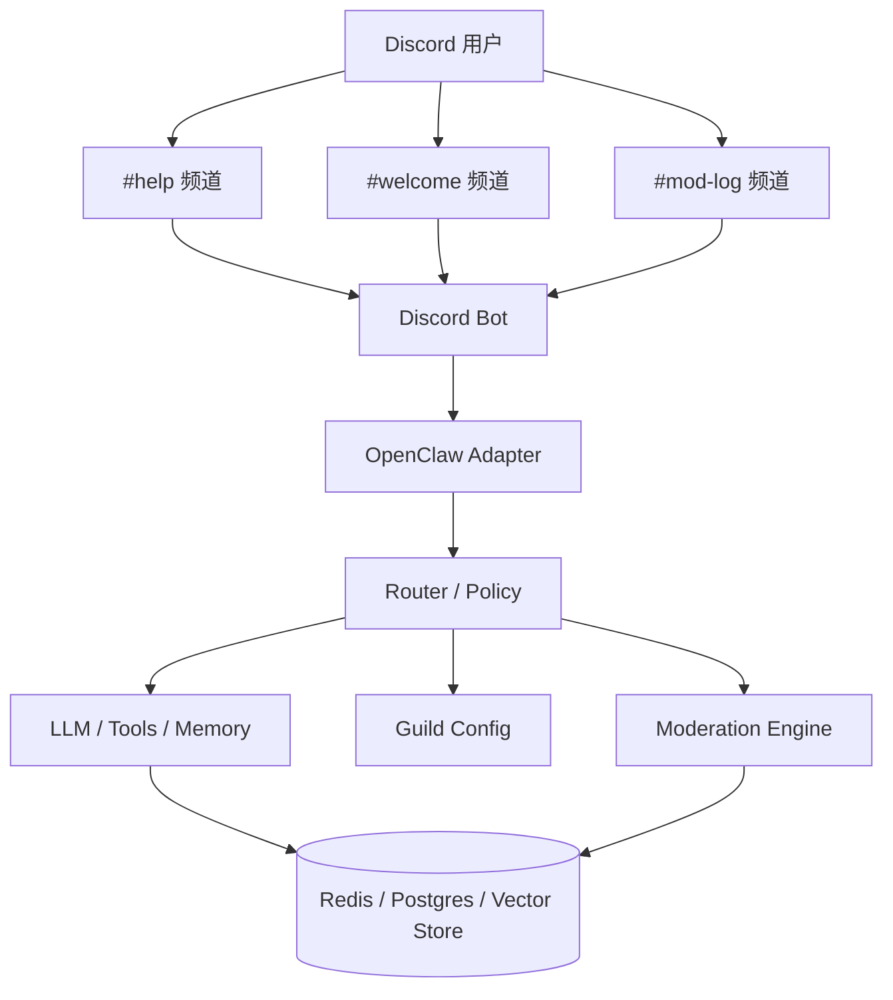

---

title: OpenClaw + Discord 实战：多频道 AI 助手与社区管理
keywords: [OpenClaw, Discord, AI, 多频道, 助手与社区管理]
date: 2026-06-02 09:00:00
tags:
- OpenClaw
- AI Agent
- Discord
- 社区管理
- Bot
categories:
- architecture
cover: https://images.unsplash.com/photo-1486406146926-c627a92ad1ab?w=1200&h=630&fit=crop
images:
  - https://images.unsplash.com/photo-1486406146926-c627a92ad1ab?w=1200&h=630&fit=crop
description: 这篇文章系统讲解如何用 OpenClaw 构建接入 Discord 的多频道 AI Agent 与 Bot，从 OAuth2、Intent、事件适配、频道策略、线程记忆、Slash Commands 到自动审核、欢迎消息、角色管理与部署治理，帮助你把 AI 助手真正落地到社区管理场景，在多频道协作中实现稳定、可控、可扩展的智能运营能力。
---


# OpenClaw + Discord 实战：多频道 AI 助手与社区管理

## 1. 引言：Discord 作为 AI Agent 交互平台的优势

在讨论 AI Agent 落地场景时，很多团队首先想到的是 Web Chat、企业微信、Slack 或者自建控制台。但如果目标不是“单个用户与模型对话”，而是要把 Agent 放进一个真实运转的社区、研发协作空间或者用户支持场景里，Discord 反而是非常适合的第一现场。原因很简单：它天然是一个多频道、多角色、多事件源的实时协作平台，而这些能力恰恰与 Agent 的运行方式高度契合。

从产品视角看，Discord 最有价值的地方在于“上下文结构化”。一个服务器（Guild）通常会按功能拆分出公告、技术支持、AI 试验、反馈收集、运营值守、语音讨论、Thread 子议题等多个空间。对于 AI Agent 来说，这意味着上下文不必只靠提示词硬编码，而可以直接借助频道、角色、线程、消息回复链来表达语义边界。比如同一个 Bot，可以在 `#support` 频道扮演技术支持助手，在 `#ideas` 频道成为需求梳理助手，在 `#ops` 频道扮演告警值守机器人。频道本身就是天然的上下文隔离单位。

从工程视角看，Discord 提供了成熟的事件模型：消息创建、编辑、删除、Reaction 增删、成员加入退出、角色变更、Thread 创建、语音状态变化等都可以作为 Agent 的触发器。相比仅支持“用户输入 -> 模型输出”的传统聊天界面，Discord 更接近一个事件驱动系统。只要适配层设计得当，AI Agent 就不仅会“回答问题”，还能够“感知社区状态”“主动执行管理动作”“依据权限做差异化响应”。

从运营视角看，Discord 的另一个优势是权限系统足够精细。服务器管理员、版主、普通成员、访客、付费用户可以被不同角色标识。Agent 就可以根据角色决定可见数据、可执行命令、是否允许召回历史记忆，甚至是否能触发某些高成本模型。也就是说，Discord 并不是把 AI 直接暴露给所有人，而是为 AI 提供了一个可以嵌入组织规则的运行环境。

下面看一个典型的场景：一个开源社区希望搭建 AI 助手来完成三件事。

1. 在 `#help` 回答常见问题，减少维护者重复劳动；
2. 在 `#welcome` 为新成员发送个性化欢迎消息并引导身份领取；
3. 在 `#mod-log` 自动推送审核结果、可疑消息摘要和风险评分。

如果这些能力拆成三个独立机器人，系统很快会失控：配置分散、权限复杂、上下文无法共享、日志难以统一。更合理的方式是构建一个以 OpenClaw 为核心、Discord 为输入输出通道、社区规则为治理层的统一 Agent 平台。

下面是一个简化的目标架构：



在这个架构中，Discord 并不是简单的“聊天前端”，而是事件总线与组织边界；OpenClaw 不是一个单纯的模型调用包装器，而是 Agent 编排核心；社区管理功能则成为与 Agent 共享状态、权限和记忆的治理能力层。文章接下来会按照从接入、适配、开发、上下文管理、管理功能、部署治理的路径，完整讲解如何做出一个真正能在多频道里长期运行的 Discord AI 助手。

实际项目里，我建议把目标明确为以下三层：

- **对话层**：负责消息理解、回复生成、Slash Commands、Embeds；
- **记忆层**：负责频道隔离、用户画像、Thread 会话、知识召回；
- **治理层**：负责审核、权限、日志、配置、可观测性。

只有三层同时建立，Agent 才不是一个“会聊天的 Bot”，而是一个“能在社区中稳定工作的系统”。

### 场景示例

假设你运营一个 AI 产品社区，用户在不同频道的诉求完全不同：

- `#general`：偏闲聊和轻问答，回复要短；
- `#troubleshooting`：偏问题定位，允许多轮追问与日志分析；
- `#announcements`：只允许管理员触发内容润色或摘要，不允许普通成员调用；
- `#premium-lab`：只对特定角色开放更强模型与更长上下文窗口。

如果没有 Discord 这样的频道与角色机制，你就不得不在每条 prompt 中描述大量规则；而在 Discord 里，这些规则可以从事件元数据直接推导出来。

一个最小化的频道策略配置如下：

```yaml
guilds:
  "1234567890":
    default_model: gpt-4.1
    channels:
      general:
        response_style: concise
        memory_scope: channel
        allow_tools: false
      troubleshooting:
        response_style: diagnostic
        memory_scope: thread
        allow_tools: true
      premium-lab:
        response_style: expert
        memory_scope: user+channel
        required_roles: [premium, admin]
```

这个例子说明，Discord 平台的优势并不只在于“用户多”，而在于它能把组织结构直接映射为 Agent 运行参数。接下来我们从 Bot 创建开始，一步步搭建整个系统。

---

## 2. Discord Bot 创建与 OAuth2 配置

要把 OpenClaw 接到 Discord，第一步不是写代码，而是正确创建 Bot、配置权限、启用 Intent、设计 OAuth2 授权范围。很多项目在 PoC 阶段直接点几下控制台就开始编码，后面才发现消息收不到、成员事件拿不到、Slash Commands 无法同步、权限粒度也不够。这些问题往往都源于接入阶段没有把基础设施一次设计好。

### 2.1 在 Discord Developer Portal 创建应用

进入 Discord Developer Portal 后，通常会先创建一个 Application，再在应用下面添加 Bot。建议从一开始就区分三个环境：

- `openclaw-dev`
- `openclaw-staging`
- `openclaw-prod`

这样做的好处是命令注册、Webhook、日志、Guild 授权范围不会互相污染，尤其适合 Slash Commands 频繁迭代的场景。

创建完成后，需要记录以下关键配置：

- Application ID
- Public Key
- Bot Token
- Client Secret
- Guild ID（测试服与生产服）

建议使用 `.env` 或 Secret Manager 管理，而不是直接写到代码仓库：

```bash
DISCORD_APP_ID=123456789012345678
DISCORD_PUBLIC_KEY=xxxxx
DISCORD_BOT_TOKEN=xxxxx
DISCORD_CLIENT_SECRET=xxxxx
DISCORD_TEST_GUILD_ID=998877665544332211
```

### 2.2 启用 Privileged Gateway Intents

如果你只做最简单的 Slash Command，默认权限可能够用。但一旦要做社区管理、多频道上下文、欢迎消息、成员角色同步，就必须启用必要的 Gateway Intents。常见包括：

- `GUILD_MEMBERS`：成员加入、退出、角色变化；
- `GUILD_MESSAGES`：频道消息事件；
- `MESSAGE_CONTENT`：读取用户消息正文；
- `GUILD_MESSAGE_REACTIONS`：Reaction 事件；
- `GUILD_VOICE_STATES`：语音状态。

对于 AI Agent 而言，`MESSAGE_CONTENT` 经常是必须的，因为仅靠 mentions 或 slash commands 很难支撑自然语言交互。但要注意，这也是权限最敏感的一项，应该配合频道白名单、管理员配置和审计日志一起使用。

### 2.3 OAuth2 Scope 与权限位设计

Discord Bot 接入服务器主要通过 OAuth2 邀请链接完成。新手容易直接勾选一个管理员权限图省事，但在正式环境里不建议这样做。更好的方式是只给 Bot 必需权限，并将高风险操作挂到显式命令和角色控制之下。

典型的 OAuth2 scopes：

- `bot`
- `applications.commands`

典型的 Bot permissions：

- View Channels
- Send Messages
- Send Messages in Threads
- Manage Messages（如要删除违规消息）
- Embed Links
- Read Message History
- Add Reactions
- Manage Roles（如果需要自动分配角色）
- Moderate Members（如果需要禁言/超时）

可以把权限配置成一个结构化常量，方便后续生成邀请链接：

```ts
export const DISCORD_PERMISSIONS = {
  VIEW_CHANNEL: 1n << 10n,
  SEND_MESSAGES: 1n << 11n,
  MANAGE_MESSAGES: 1n << 13n,
  EMBED_LINKS: 1n << 14n,
  READ_MESSAGE_HISTORY: 1n << 16n,
  ADD_REACTIONS: 1n << 6n,
  MANAGE_ROLES: 1n << 28n,
  MODERATE_MEMBERS: 1n << 40n,
  SEND_MESSAGES_IN_THREADS: 1n << 38n,
};

export const REQUIRED_PERMISSIONS =
  DISCORD_PERMISSIONS.VIEW_CHANNEL |
  DISCORD_PERMISSIONS.SEND_MESSAGES |
  DISCORD_PERMISSIONS.READ_MESSAGE_HISTORY |
  DISCORD_PERMISSIONS.EMBED_LINKS |
  DISCORD_PERMISSIONS.SEND_MESSAGES_IN_THREADS;
```

生成邀请链接的逻辑如下：

```ts
const scopes = ["bot", "applications.commands"].join(" ");
const permissions = REQUIRED_PERMISSIONS.toString();
const inviteUrl = `https://discord.com/oauth2/authorize?client_id=${process.env.DISCORD_APP_ID}&scope=${encodeURIComponent(scopes)}&permissions=${permissions}`;

console.log(inviteUrl);
```

### 2.4 分环境命令注册策略

Discord Slash Commands 可以注册到全局或单个 Guild。全局注册传播慢，但适合生产；Guild 注册传播快，适合开发调试。建议采用“开发环境注册到测试服，生产环境发布到全局”的策略。

```ts
import { REST, Routes } from "discord.js";

const rest = new REST({ version: "10" }).setToken(process.env.DISCORD_BOT_TOKEN!);

const commands = [
  {
    name: "ask",
    description: "向 OpenClaw 助手提问",
    options: [
      {
        name: "question",
        description: "问题内容",
        type: 3,
        required: true,
      },
    ],
  },
  {
    name: "memory",
    description: "查看或清理当前频道记忆",
  },
];

await rest.put(
  Routes.applicationGuildCommands(
    process.env.DISCORD_APP_ID!,
    process.env.DISCORD_TEST_GUILD_ID!,
  ),
  { body: commands },
);
```

### 2.5 配置回调与安全验证

如果你打算使用 Interactions Endpoint 而不是纯 Gateway 模式，那么必须验证 Discord 签名。对于多环境部署，建议单独配置：

```yaml
discord:
  mode: gateway
  app_id: ${DISCORD_APP_ID}
  public_key: ${DISCORD_PUBLIC_KEY}
  token: ${DISCORD_BOT_TOKEN}
  guilds:
    - ${DISCORD_TEST_GUILD_ID}
```

如果采用 HTTP Interactions：

```ts
import nacl from "tweetnacl";

export function verifyDiscordRequest(body: string, signature: string, timestamp: string) {
  return nacl.sign.detached.verify(
    Buffer.from(timestamp + body),
    Buffer.from(signature, "hex"),
    Buffer.from(process.env.DISCORD_PUBLIC_KEY!, "hex"),
  );
}
```

### 场景说明：为什么 OAuth2 设计要前置

假设你先把 Bot 邀请进 20 个社区，再发现缺少 `Manage Roles` 或 `Moderate Members` 权限，那么需要重新生成链接并引导所有管理员再次授权。这对社区型产品来说非常打扰用户。因此，哪怕前期功能没有全部上线，也建议先根据未来一到两个版本的功能预留合理权限位，但不要过度到 Admin 级别。

一个更稳妥的做法是把权限拆成两档：

- **基础档**：对话、摘要、问答；
- **治理档**：审核、角色、超时禁言。

不同服务器可按需安装不同权限版本的 Bot，或者通过二次授权补齐高阶能力。

做好接入之后，下一步就不是“把消息发给模型”这么简单了，而是要设计一层真正适合 OpenClaw 的 Discord 适配架构。

---

## 3. OpenClaw Discord 适配器架构

如果直接把 Discord 事件处理函数写成“收到消息 -> 调 LLM -> 回消息”的形态，短期看似能跑，长期一定会遇到四类问题：

1. 不同频道需要不同策略，代码里到处是 if/else；
2. Slash Command、普通消息、Reaction、Thread 事件的处理逻辑重复；
3. 记忆存储和平台协议耦合，迁移困难；
4. 审核、权限、日志、限流、重试没有统一入口。

因此，一个成熟的 OpenClaw + Discord 集成方案，必须建立**适配器层（Adapter）**。适配器不是简单的 SDK 封装，而是一层把 Discord 特有事件翻译成 OpenClaw 可理解的统一 Agent 输入，再把 Agent 输出翻译回 Discord 响应的桥梁。

### 3.1 分层设计

建议将整体系统拆成以下几层：

- **Gateway Layer**：接收 Discord 事件与交互；
- **Normalization Layer**：将消息、命令、按钮、线程、成员事件转换为统一事件对象；
- **Policy Layer**：按 Guild、频道、角色、线程应用策略；
- **Agent Runtime**：调用 OpenClaw，组织工具、记忆、推理链；
- **Delivery Layer**：把文本、Embed、组件、审核动作回写到 Discord。

示意代码：

```ts
export interface DiscordEventEnvelope {
  platform: "discord";
  guildId?: string;
  channelId: string;
  threadId?: string;
  userId: string;
  username: string;
  memberRoles: string[];
  eventType:
    | "message.create"
    | "interaction.command"
    | "interaction.button"
    | "reaction.add"
    | "member.join"
    | "voice.state";
  content?: string;
  metadata: Record<string, unknown>;
}

export interface AgentExecutionContext {
  scopeKey: string;
  policy: RuntimePolicy;
  memoryNamespace: string;
  tools: string[];
  traceId: string;
}
```

### 3.2 统一事件归一化

在 Discord 中，普通消息、Slash Command、按钮点击、Modal 提交都有不同载体。如果不统一，后面每加一种交互类型，整个流程都要重写。更好的做法是先归一化：

```ts
export class DiscordEventNormalizer {
  normalizeMessage(message: Message): DiscordEventEnvelope {
    return {
      platform: "discord",
      guildId: message.guildId ?? undefined,
      channelId: message.channelId,
      threadId: message.channel?.isThread() ? message.channel.id : undefined,
      userId: message.author.id,
      username: message.author.username,
      memberRoles: message.member?.roles.cache.map(r => r.name) ?? [],
      eventType: "message.create",
      content: message.content,
      metadata: {
        messageId: message.id,
        mentionsBot: message.mentions.has(message.client.user!.id),
        isReply: Boolean(message.reference?.messageId),
      },
    };
  }

  normalizeCommand(interaction: ChatInputCommandInteraction): DiscordEventEnvelope {
    return {
      platform: "discord",
      guildId: interaction.guildId ?? undefined,
      channelId: interaction.channelId,
      userId: interaction.user.id,
      username: interaction.user.username,
      memberRoles: interaction.member && "roles" in interaction.member
        ? Array.from(interaction.member.roles as string[])
        : [],
      eventType: "interaction.command",
      content: interaction.commandName,
      metadata: {
        options: interaction.options.data,
        interactionId: interaction.id,
      },
    };
  }
}
```

### 3.3 策略层：把频道、角色和命令规则显式化

OpenClaw 的核心价值在于可编排，因此 Discord 适配器最不应该做的事，就是把所有策略塞在提示词里。正确做法是通过独立的 `Policy Resolver` 决定运行参数。

```ts
export interface RuntimePolicy {
  model: string;
  temperature: number;
  triggerMode: "mention" | "command" | "all_messages";
  memoryScope: "guild" | "channel" | "thread" | "user_channel";
  responseStyle: "concise" | "expert" | "moderation";
  allowTools: boolean;
  maxTokens: number;
  allowedRoles?: string[];
}

export class PolicyResolver {
  constructor(private readonly config: GuildConfigStore) {}

  async resolve(event: DiscordEventEnvelope): Promise<RuntimePolicy> {
    const guildConfig = await this.config.getGuildConfig(event.guildId!);
    const channelRule = guildConfig.channels[event.channelId] ?? guildConfig.defaultChannelRule;

    return {
      model: channelRule.model ?? guildConfig.defaultModel,
      temperature: channelRule.temperature ?? 0.4,
      triggerMode: channelRule.triggerMode ?? "mention",
      memoryScope: channelRule.memoryScope ?? "channel",
      responseStyle: channelRule.responseStyle ?? "concise",
      allowTools: channelRule.allowTools ?? false,
      maxTokens: channelRule.maxTokens ?? 1200,
      allowedRoles: channelRule.allowedRoles,
    };
  }
}
```

### 3.4 适配器核心：事件 -> Agent 输入 -> 响应

```ts
export class OpenClawDiscordAdapter {
  constructor(
    private readonly normalizer: DiscordEventNormalizer,
    private readonly policyResolver: PolicyResolver,
    private readonly runtime: OpenClawRuntime,
    private readonly responder: DiscordResponder,
  ) {}

  async onMessage(message: Message) {
    const event = this.normalizer.normalizeMessage(message);
    const policy = await this.policyResolver.resolve(event);

    if (!shouldTrigger(event, policy, message.client.user!.id)) {
      return;
    }

    const ctx = buildExecutionContext(event, policy);
    const result = await this.runtime.execute({ event, ctx });
    await this.responder.sendMessageResult(message, result, ctx);
  }
}
```

### 3.5 运行时上下文构建

多频道 Agent 的关键不是“能看见很多消息”，而是“能在每个消息到来时生成正确的作用域”。这个作用域至少包含四个维度：

- **位置**：Guild / Channel / Thread；
- **身份**：User / Role；
- **策略**：模型、温度、工具权限；
- **记忆命名空间**：数据读写边界。

```ts
export function buildExecutionContext(
  event: DiscordEventEnvelope,
  policy: RuntimePolicy,
): AgentExecutionContext {
  const scopeKey = [event.guildId, event.channelId, event.threadId, event.userId]
    .filter(Boolean)
    .join(":");

  const memoryNamespace = (() => {
    switch (policy.memoryScope) {
      case "thread":
        return `discord:${event.guildId}:${event.channelId}:thread:${event.threadId ?? 'root'}`;
      case "user_channel":
        return `discord:${event.guildId}:${event.channelId}:user:${event.userId}`;
      case "guild":
        return `discord:${event.guildId}:guild`;
      default:
        return `discord:${event.guildId}:${event.channelId}`;
    }
  })();

  return {
    scopeKey,
    policy,
    memoryNamespace,
    tools: policy.allowTools ? ["search_docs", "moderate", "role_assign"] : [],
    traceId: crypto.randomUUID(),
  };
}
```

### 场景说明：为什么需要适配器而不是直接写 Bot 逻辑

假设今天你只需要普通消息回复，明天要支持 Slash Commands，后天要支持按钮交互和欢迎消息。如果没有适配器层，新的事件类型会一层层侵入原本的消息处理逻辑。到最后，Bot 文件里既有 Discord SDK 细节，又有提示词，又有数据库写入，还夹杂权限检查。这样几乎不可能维护。

而有了适配器之后，你可以把 Discord 当作“事件输入源”，把 OpenClaw 当作“Agent 执行引擎”，两边都保持清晰边界。后续如果你想再接入 Telegram、Slack 或 Web Chat，只需要为它们写新的 Normalizer 与 Responder。

接下来我们进入真正的实战部分：如何创建一个多频道感知的 AI 助手 Bot。

---

## 4. 实战：创建多频道感知的 AI 助手 Bot

到了这一步，我们不再停留在架构图，而是直接构建一个具备以下能力的 Bot：

- 在指定频道自动响应；
- 在不同频道采用不同系统提示与行为风格；
- 支持 Thread 级会话跟踪；
- 能够识别提及、回复链和命令触发；
- 对不同角色提供不同能力。

### 4.1 项目结构建议

建议采用如下目录结构：

```text
src/
  app.ts
  discord/
    client.ts
    adapter.ts
    responder.ts
    commands.ts
  openclaw/
    runtime.ts
    prompts.ts
    tools.ts
  config/
    guild-config.ts
  memory/
    store.ts
    summarizer.ts
  moderation/
    policy.ts
    scanner.ts
```

这样做的核心原则是：平台接入、Agent 运行、配置与记忆独立演进，避免后续所有变更都挤进一个 `bot.ts`。

### 4.2 按频道注入系统提示

多频道感知最简单也最有效的做法，是先把每个频道的“角色设定”配置化。不要在代码里手写多个 prompt 模板，而是建立频道规则表。

```yaml
defaults:
  model: gpt-4.1-mini
  temperature: 0.4
  trigger_mode: mention
channels:
  help:
    system_prompt: |
      你是技术支持助手，优先给出排查步骤、复现路径和配置建议。
      回答时先总结问题，再给执行步骤，最后给验证方法。
    trigger_mode: all_messages
    memory_scope: thread
  ideas:
    system_prompt: |
      你是产品共创助手，负责整理想法、抽取需求、识别用户价值。
      回答时尽量使用条目化表达。
    trigger_mode: mention
    memory_scope: channel
  mod-log:
    system_prompt: |
      你是社区审核助理，只输出事实摘要、风险判断和建议动作。
      不进行闲聊。
    trigger_mode: internal_only
    memory_scope: channel
```

### 4.3 消息触发逻辑

并不是所有频道都适合“全量监听 + 全量回复”。例如 `#general` 里如果机器人对每句话都回应，体验会很差。可以通过策略控制触发方式：

```ts
export function shouldTrigger(
  event: DiscordEventEnvelope,
  policy: RuntimePolicy,
  botUserId: string,
): boolean {
  if (policy.triggerMode === "all_messages") return true;
  if (policy.triggerMode === "command") return event.eventType === "interaction.command";

  const metadata = event.metadata as Record<string, any>;
  if (metadata.mentionsBot) return true;
  if (metadata.isReplyToBot) return true;

  return false;
}
```

在真实项目中，我建议再增加三条防护：

- 忽略 Bot 自己和其他 Bot 的消息；
- 忽略被审核系统标记为高风险的输入；
- 对同一频道设置冷却时间，避免多人同时刷屏时响应失控。

### 4.4 将 Discord 事件送入 OpenClaw Runtime

```ts
export class OpenClawRuntime {
  constructor(
    private readonly llm: LLMClient,
    private readonly memory: MemoryStore,
    private readonly promptRepo: PromptRepository,
  ) {}

  async execute(input: { event: DiscordEventEnvelope; ctx: AgentExecutionContext }) {
    const history = await this.memory.loadRecent(input.ctx.memoryNamespace, 20);
    const prompt = await this.promptRepo.compose({
      event: input.event,
      policy: input.ctx.policy,
      history,
    });

    const completion = await this.llm.chat({
      model: input.ctx.policy.model,
      temperature: input.ctx.policy.temperature,
      maxTokens: input.ctx.policy.maxTokens,
      messages: prompt,
    });

    await this.memory.append(input.ctx.memoryNamespace, {
      role: "user",
      content: input.event.content ?? "",
      userId: input.event.userId,
      ts: Date.now(),
    });

    await this.memory.append(input.ctx.memoryNamespace, {
      role: "assistant",
      content: completion.text,
      ts: Date.now(),
    });

    return completion;
  }
}
```

### 4.5 实战场景：支持频道与线程的差异化处理

设想一个支持社区里有两个频道：

- `#help-installation`：用户安装问题很多，需要详细步骤；
- `#feature-ideas`：用户提出功能建议，需要归纳和标签化。

对于安装问题，最佳作用域往往是 **Thread 级记忆**。因为一个用户在某条问题下面持续追问，Thread 就是天然会话单元。对于想法频道，则可以采用 **Channel 级语义共享**，让 Bot 感知最近的讨论趋势，输出更贴近社区焦点的建议。

下面是一个以频道 ID 为键的策略配置示例：

```json
{
  "guildId": "1234567890",
  "defaultModel": "gpt-4.1-mini",
  "channels": {
    "1111": {
      "name": "help-installation",
      "triggerMode": "all_messages",
      "memoryScope": "thread",
      "responseStyle": "expert",
      "allowTools": true,
      "maxTokens": 1600
    },
    "2222": {
      "name": "feature-ideas",
      "triggerMode": "mention",
      "memoryScope": "channel",
      "responseStyle": "concise",
      "allowTools": false,
      "maxTokens": 900
    }
  }
}
```

### 4.6 回复策略：普通消息、长回复与分段发送

Discord 单条消息存在长度限制，因此长回答要么分段发送，要么转成 Embed/附件。一个实用的 responder 可以先按段落拆分：

```ts
export async function sendChunkedReply(target: Message, content: string) {
  const chunks = splitByLength(content, 1800);
  for (let i = 0; i < chunks.length; i++) {
    if (i === 0) {
      await target.reply(chunks[i]);
    } else {
      await target.channel.send(chunks[i]);
    }
  }
}
```

### 场景说明：多频道感知的真实价值

很多团队会问，为什么不直接用一个大 prompt 说明“你在不同频道有不同人格”？答案是可维护性太差。频道一多，prompt 会越来越长；一旦管理员想改某个频道的风格，必须重新发布代码。

而将频道策略外置后，社区管理员甚至可以通过 `/config channel` 命令动态更新：

- 哪些频道允许自动触发；
- 哪些频道必须 @Bot；
- 哪些频道启用工具；
- 哪些频道允许更长记忆。

这样 Bot 才是“运营可控的系统”，而不是“开发写死的脚本”。

下一节我们继续增强交互方式：让 Bot 支持 Slash Commands、按钮、选择菜单和 Modal。

---

## 5. Slash Commands 与交互组件开发

如果说普通消息适合自然对话，那么 Slash Commands 则适合结构化操作。对于社区中的 AI 助手来说，二者不是互斥关系，而是互补关系：

- 自然语言适合开放问题；
- Slash Commands 适合明确意图；
- 按钮和选择菜单适合低摩擦二次操作；
- Modal 适合收集较长输入与表单信息。

一个成熟的 Discord AI Bot，通常会把“会话”交给消息，把“控制面”交给 Slash Commands 和交互组件。

### 5.1 命令设计原则

建议把命令分成三类：

1. **用户命令**：如 `/ask`、`/summarize`、`/thread-brief`；
2. **管理员命令**：如 `/channel-policy`、`/memory-clear`、`/mod-rule`；
3. **运维命令**：如 `/health`、`/trace`、`/reload-config`。

这样可以避免所有命令都堆在一个层级里，用户体验也更清晰。

### 5.2 `/ask` 与 `/summarize` 示例

```ts
export const commands = [
  {
    name: "ask",
    description: "向 AI 助手提问",
    options: [
      {
        name: "question",
        description: "你的问题",
        type: 3,
        required: true,
      },
    ],
  },
  {
    name: "summarize",
    description: "总结当前频道或线程最近的讨论",
    options: [
      {
        name: "range",
        description: "总结范围",
        type: 3,
        choices: [
          { name: "最近 20 条", value: "20" },
          { name: "最近 50 条", value: "50" },
        ],
      },
    ],
  },
];
```

命令处理器：

```ts
client.on("interactionCreate", async (interaction) => {
  if (!interaction.isChatInputCommand()) return;

  if (interaction.commandName === "ask") {
    await interaction.deferReply();
    const question = interaction.options.getString("question", true);
    const event = normalizer.normalizeCommand(interaction);
    event.content = question;
    const policy = await policyResolver.resolve(event);
    const ctx = buildExecutionContext(event, policy);
    const result = await runtime.execute({ event, ctx });
    await interaction.editReply(result.text);
  }

  if (interaction.commandName === "summarize") {
    await interaction.deferReply({ ephemeral: true });
    const count = Number(interaction.options.getString("range") ?? "20");
    const summary = await summaryService.summarizeChannel(interaction.channelId, count);
    await interaction.editReply(summary);
  }
});
```

### 5.3 按钮：把常用二次操作显式化

在长回答后附带按钮，可以显著提升 Bot 的可用性。比如：

- 继续追问；
- 生成简短版；
- 转为 FAQ 草稿；
- 标记为已解决；
- 升级为版主审查。

```ts
import { ActionRowBuilder, ButtonBuilder, ButtonStyle } from "discord.js";

const row = new ActionRowBuilder<ButtonBuilder>().addComponents(
  new ButtonBuilder()
    .setCustomId("ai:shorten")
    .setLabel("生成简短版")
    .setStyle(ButtonStyle.Secondary),
  new ButtonBuilder()
    .setCustomId("ai:faq")
    .setLabel("转 FAQ 草稿")
    .setStyle(ButtonStyle.Primary),
  new ButtonBuilder()
    .setCustomId("ai:escalate")
    .setLabel("提交管理员")
    .setStyle(ButtonStyle.Danger),
);
```

处理按钮事件时，建议把原始消息 ID、频道 ID、触发用户 ID 放进 metadata，避免组件被其他人误用：

```ts
if (interaction.isButton()) {
  const [namespace, action] = interaction.customId.split(":");
  if (namespace !== "ai") return;

  if (action === "faq") {
    await interaction.deferReply({ ephemeral: true });
    const faqDraft = await faqService.createDraftFromMessage(interaction.message);
    await interaction.editReply(`FAQ 草稿已生成：\n\n${faqDraft}`);
  }
}
```

### 5.4 选择菜单：让频道策略可配置

对于管理员来说，纯文本命令配置太容易出错。下拉菜单非常适合用来切换频道策略，例如自动触发模式：

```ts
const menu = new StringSelectMenuBuilder()
  .setCustomId("policy:trigger-mode")
  .setPlaceholder("选择触发模式")
  .addOptions([
    { label: "仅 @Bot 时触发", value: "mention" },
    { label: "所有消息触发", value: "all_messages" },
    { label: "仅 Slash Command", value: "command" },
  ]);
```

### 5.5 Modal：收集结构化长输入

例如管理员想配置欢迎消息模板，直接在命令参数里输入很痛苦，这时 Modal 很适合：

```ts
const modal = new ModalBuilder()
  .setCustomId("welcome:template")
  .setTitle("配置欢迎消息模板");

const templateInput = new TextInputBuilder()
  .setCustomId("template")
  .setLabel("欢迎消息模板")
  .setStyle(TextInputStyle.Paragraph)
  .setRequired(true)
  .setPlaceholder("欢迎 {user} 加入 {guild}，请先阅读 #rules 并选择你的角色。");
```

### 场景说明：什么时候该用命令，什么时候该用自然语言

一个常见误区是把所有事情都做成 `/ai xxx`。这样虽然结构化，但使用门槛很高。我的经验是：

- **用户探索类行为**：用自然语言；
- **管理与控制类行为**：用 Slash Commands；
- **二次确认与快速分流**：用按钮；
- **模板与表单输入**：用 Modal。

例如普通用户在支持频道里直接问“为什么 Docker 镜像启动失败”，这适合自然语言；而管理员想“把当前频道切成 all_messages 模式”，则应该使用 `/channel-policy set` 或交互组件。

下一节我们进入最关键的部分：频道级上下文隔离与记忆管理。

---

## 6. 频道级上下文隔离与记忆管理

如果说多频道是 Discord 场景的天然优势，那么“如何隔离不同频道的上下文”就是整个系统最容易做错的地方。很多 Bot 前期为了省事，只维护一个全局会话缓存，结果很快出现以下问题：

- `#support` 的错误日志被带进 `#general` 的闲聊回复；
- 用户 A 在私密频道讨论的信息，被错误用于公共频道回答；
- Thread 中的排查结论污染了整个频道后续对话；
- 机器人越聊越“懂”，但没人知道它记住了什么、为什么记住。

所以，记忆管理不是单纯的“把历史存起来”，而是一个**带边界、带策略、可观测、可清理**的系统。

### 6.1 记忆作用域设计

在 Discord 场景下，最常见的四类记忆作用域分别是：

- **Guild 级**：适合服务器级公共知识，如社区规则、统一术语；
- **Channel 级**：适合同一个频道的持续讨论；
- **Thread 级**：适合问题排查、专题讨论、工单式对话；
- **User + Channel 级**：适合用户在某频道中的偏好和历史背景。

可以通过命名空间表达这些边界：

```ts
export function getMemoryNamespace(input: {
  guildId: string;
  channelId: string;
  threadId?: string;
  userId: string;
  scope: RuntimePolicy["memoryScope"];
}) {
  switch (input.scope) {
    case "guild":
      return `mem:discord:guild:${input.guildId}`;
    case "thread":
      return `mem:discord:guild:${input.guildId}:channel:${input.channelId}:thread:${input.threadId ?? "root"}`;
    case "user_channel":
      return `mem:discord:guild:${input.guildId}:channel:${input.channelId}:user:${input.userId}`;
    default:
      return `mem:discord:guild:${input.guildId}:channel:${input.channelId}`;
  }
}
```

### 6.2 短期记忆、摘要记忆与长期记忆分层

建议不要把所有对话都原样塞进上下文窗口，而是拆成三层：

1. **短期记忆**：最近 N 条原始消息；
2. **摘要记忆**：对超长上下文做结构化总结；
3. **长期记忆**：用户偏好、FAQ、工单结论、可复用知识。

下面是一个存储接口：

```ts
export interface MemoryStore {
  loadRecent(namespace: string, limit: number): Promise<MemoryItem[]>;
  append(namespace: string, item: MemoryItem): Promise<void>;
  summarize(namespace: string): Promise<SummaryMemory | null>;
  upsertFact(namespace: string, fact: MemoryFact): Promise<void>;
  clear(namespace: string): Promise<void>;
}
```

### 6.3 自动摘要机制

当某个 Thread 超过 50 条消息后，如果仍然把完整聊天记录都传给模型，不仅成本高，而且信噪比急剧下降。更合理的做法是对历史消息做摘要压缩。

```ts
export class MemorySummarizer {
  constructor(private readonly llm: LLMClient, private readonly store: MemoryStore) {}

  async compact(namespace: string) {
    const messages = await this.store.loadRecent(namespace, 80);
    if (messages.length < 50) return;

    const summary = await this.llm.chat({
      model: "gpt-4.1-mini",
      temperature: 0.2,
      maxTokens: 600,
      messages: [
        {
          role: "system",
          content: "请把下面的讨论总结为：问题背景、已尝试方案、当前状态、未决问题。",
        },
        {
          role: "user",
          content: messages.map(m => `[${m.role}] ${m.content}`).join("\n"),
        },
      ],
    });

    await this.store.upsertFact(namespace, {
      type: "summary",
      content: summary.text,
      updatedAt: Date.now(),
    });
  }
}
```

### 6.4 频道级隔离中的权限控制

记忆隔离不只是技术问题，也是权限问题。例如管理员在私有 `#staff` 频道中和 Bot 讨论审核策略，这些内容绝不应该被普通成员通过其他频道召回。为此，记忆查询除了 namespace 外，还应附带访问策略：

```ts
export interface MemoryAccessRequest {
  namespace: string;
  requesterId: string;
  requesterRoles: string[];
  guildId: string;
  channelId: string;
}

export async function canAccessMemory(req: MemoryAccessRequest, config: GuildConfig) {
  const channelRule = config.channels[req.channelId];
  if (!channelRule) return false;

  if (!channelRule.memoryReadRoles || channelRule.memoryReadRoles.length === 0) {
    return true;
  }

  return req.requesterRoles.some(role => channelRule.memoryReadRoles.includes(role));
}
```

### 6.5 记忆清理与可解释性

实际部署后，管理员会经常问两个问题：

- Bot 记住了什么？
- 我怎么删除它记住的内容？

所以必须提供显式命令：

```ts
/memory show
/memory clear
/memory summarize
/memory policy
```

实现示例：

```ts
if (interaction.commandName === "memory") {
  const sub = interaction.options.getSubcommand();
  const namespace = getMemoryNamespaceFromInteraction(interaction);

  if (sub === "show") {
    const recent = await memory.loadRecent(namespace, 10);
    await interaction.reply({
      ephemeral: true,
      content: recent.map(x => `- [${x.role}] ${x.content.slice(0, 120)}`).join("\n"),
    });
  }

  if (sub === "clear") {
    await memory.clear(namespace);
    await interaction.reply({ ephemeral: true, content: "当前作用域记忆已清空。" });
  }
}
```

### 场景说明：Thread 是天然会话边界

在 Discord 支持场景中，一个非常高效的模式是：当用户在 `#help` 提出具体技术问题时，机器人自动建议“为该问题创建 Thread 继续排查”。这样主频道保持整洁，而 Thread 内的上下文又能完整保留。对于 AI Agent 来说，这几乎是理想状态：

- 主频道负责发现问题；
- Thread 负责持续诊断；
- Thread 结束后输出摘要回主频道；
- 结论再沉淀为 FAQ 或长期记忆。

这比在一个大群里无限滚动对话要健康得多。

下一节，我们将 AI 助手从“会答问题”推进到“会管理社区”。

---

## 7. 社区管理功能：自动审核、欢迎消息、角色管理

很多人把 AI Bot 只看作问答助手，但在 Discord 这样的社区平台里，真正能产生长期价值的，往往是它与管理流程的结合。一个好的社区 Bot 不仅能回答问题，还能：

- 发现高风险内容；
- 引导新成员完成上手；
- 协助版主管理角色与权限；
- 把重复性的管理动作自动化。

关键在于，AI 不应该越权替代管理员，而应该成为**带建议能力、可控执行、可追踪记录**的管理助手。

### 7.1 自动审核：规则引擎 + LLM 双层判定

审核最忌讳完全依赖 LLM，因为成本高、波动大，而且对明显违规内容不够高效。更好的方案是两层：

1. **规则引擎**快速拦截，如敏感词、垃圾链接、重复刷屏；
2. **LLM 审核器**处理灰度内容，如骚扰、钓鱼、恶意引战、伪装推广。

```ts
export interface ModerationResult {
  action: "allow" | "flag" | "delete" | "timeout";
  reason: string;
  score: number;
}

export async function moderateMessage(message: string): Promise<ModerationResult> {
  if (containsBlacklistedLink(message)) {
    return {
      action: "delete",
      reason: "命中黑名单链接",
      score: 0.98,
    };
  }

  const llmResult = await llm.chat({
    model: "gpt-4.1-mini",
    temperature: 0,
    maxTokens: 300,
    messages: [
      {
        role: "system",
        content: "判断消息是否存在广告、骚扰、仇恨、钓鱼或恶意刷屏风险，并返回 JSON。",
      },
      { role: "user", content: message },
    ],
  });

  return JSON.parse(llmResult.text);
}
```

审核执行：

```ts
client.on("messageCreate", async (message) => {
  if (message.author.bot) return;
  const result = await moderateMessage(message.content);

  if (result.action === "delete") {
    await message.delete();
    await logModeration(message, result);
  }
});
```

### 7.2 审核日志与人工复核

所有高风险动作都必须留下日志。最好把审核结果发到 `#mod-log` 频道，并带上原文摘要、风险分、建议动作、跳转链接。

```ts
async function logModeration(message: Message, result: ModerationResult) {
  const channel = await message.client.channels.fetch(process.env.MOD_LOG_CHANNEL_ID!);
  if (!channel?.isTextBased()) return;

  await channel.send({
    embeds: [
      {
        title: "审核事件",
        color: 0xff9900,
        fields: [
          { name: "用户", value: `${message.author.tag} (${message.author.id})` },
          { name: "频道", value: `<#${message.channelId}>` },
          { name: "动作", value: result.action },
          { name: "原因", value: result.reason },
          { name: "评分", value: result.score.toFixed(2) },
        ],
        description: message.content.slice(0, 1000),
      },
    ],
  });
}
```

### 7.3 欢迎消息：个性化引导而非流水线广播

Discord 社区常见问题是新成员加入后不知道下一步做什么，导致活跃转化低。欢迎消息如果只是“欢迎加入”，意义不大；更好的方式是根据服务器结构、用户语言、入口来源和角色策略生成个性化引导。

```ts
client.on("guildMemberAdd", async (member) => {
  const welcomeText = await openclawRuntime.generateWelcome({
    guildName: member.guild.name,
    username: member.user.username,
    preferredLanguage: "zh-CN",
    guideChannels: ["rules", "introductions", "help"],
  });

  const channel = member.guild.channels.cache.find(c => c.name === "welcome");
  if (channel?.isTextBased()) {
    await channel.send(`欢迎 <@${member.id}>！\n\n${welcomeText}`);
  }
});
```

欢迎模板配置可以写成：

```yaml
welcome:
  enabled: true
  channel: welcome
  prompt: |
    为新成员生成一段友好的欢迎消息。
    必须包含：服务器定位、入门频道、身份领取提示、提问建议。
  auto_role: newcomer
```

### 7.4 角色管理：反应领取、命令领取、规则驱动分配

角色管理是 Discord 社区治理的核心之一。AI 能做的不是盲目赋权，而是简化角色获取与解释流程。

例如，用户点击按钮后获取某一兴趣标签角色：

```ts
if (interaction.isButton() && interaction.customId.startsWith("role:")) {
  const roleName = interaction.customId.split(":")[1];
  const role = interaction.guild?.roles.cache.find(r => r.name === roleName);
  if (!role || !interaction.member || !("roles" in interaction.member)) return;

  await interaction.member.roles.add(role.id);
  await interaction.reply({ ephemeral: true, content: `已为你添加角色：${role.name}` });
}
```

也可以让 AI 根据用户自我介绍建议适合的角色，但真正执行前需要用户确认：

```ts
const suggestedRoles = await roleClassifier.suggest(introductionText);
// 输出示例：[
//   { name: "builder", reason: "用户多次提到自动化与集成" },
//   { name: "frontend", reason: "用户介绍中包含 React 与设计系统经验" }
// ]

await interaction.reply({
  ephemeral: true,
  content: [
    "根据你的自我介绍，AI 建议你优先领取以下角色：",
    ...suggestedRoles.map((role, index) => `${index + 1}. ${role.name}：${role.reason}`),
    "如需确认，请点击下方按钮完成领取。",
  ].join("\n"),
  components: [buildRoleConfirmButtons(suggestedRoles)],
});
```

### 7.5 管理功能落地时的边界控制

把 AI 接入社区治理后，一个非常现实的问题是：**哪些动作可以自动执行，哪些动作必须人工确认**。我的建议是按风险等级拆分：

- **低风险动作**：欢迎消息、FAQ 草稿生成、讨论摘要、角色建议；
- **中风险动作**：删除明显垃圾内容、关闭重复 Thread、移动消息到指定频道；
- **高风险动作**：超时禁言、批量删帖、修改高权限角色、踢出成员。

低风险动作可以在规则满足后自动执行；中高风险动作则应采用“AI 先判断 + Bot 生成建议 + 管理员点击确认”的模式。这样既保留了自动化效率，也避免了社区治理因模型误判而失控。

例如，对可疑广告消息不直接禁言，而是先发到 `#mod-log` 并附带确认按钮：

```ts
const row = new ActionRowBuilder<ButtonBuilder>().addComponents(
  new ButtonBuilder()
    .setCustomId(`mod:delete:${message.id}`)
    .setLabel("删除消息")
    .setStyle(ButtonStyle.Danger),
  new ButtonBuilder()
    .setCustomId(`mod:timeout:${message.author.id}`)
    .setLabel("禁言 10 分钟")
    .setStyle(ButtonStyle.Secondary),
  new ButtonBuilder()
    .setCustomId(`mod:ignore:${message.id}`)
    .setLabel("忽略")
    .setStyle(ButtonStyle.Success),
);

await modLogChannel.send({
  content: `检测到疑似风险消息，建议动作：${result.action}`,
  components: [row],
});
```

这样设计的价值不只是更安全，还能把管理员的点击结果反向沉淀为审核反馈数据，用于后续优化规则和提示词。

### 7.6 社区管理中的典型踩坑

在 OpenClaw + Discord 的管理功能实践中，我见过最常见的坑有下面几类：

1. **Bot 权限高于版主预期**：开发时为了省事直接给 Administrator，结果任何提示词失控都可能造成大范围误操作。
2. **审核与对话共用同一模型配置**：技术支持频道为了详细解释设置了较高温度，结果审核输出也变得不稳定。
3. **欢迎消息没有幂等控制**：成员反复进出服务器时被重复欢迎，甚至多次自动加角色。
4. **角色同步缺少回滚日志**：AI 误判后给错角色，但没有记录是谁、在什么时候触发了哪次变更。
5. **私有频道内容进入公共记忆**：把所有消息统一写入一个向量库 namespace，后续检索时发生越权召回。

一个实用的防护写法，是对管理动作统一加审计包装：

```ts
export async function runModerationAction(input: {
  actorId: string;
  guildId: string;
  targetUserId?: string;
  action: "delete" | "timeout" | "role_add" | "role_remove";
  reason: string;
  execute: () => Promise<void>;
}) {
  await auditStore.append({
    ...input,
    status: "pending",
    createdAt: Date.now(),
  });

  try {
    await input.execute();
    await auditStore.append({
      ...input,
      status: "success",
      createdAt: Date.now(),
    });
  } catch (error) {
    await auditStore.append({
      ...input,
      status: "failed",
      error: error instanceof Error ? error.message : String(error),
      createdAt: Date.now(),
    });
    throw error;
  }
}
```

有了这层包装之后，即使未来同时接入 Discord、微信或 WhatsApp，治理动作仍然能复用统一的审计链路。

下一节，我们把这些能力放进真实部署环境，讨论如何让 Bot 长期稳定运行。

---

## 8. 部署、监控与稳定性治理

一个能在本地跑起来的 Discord Bot，并不等于一个能在社区里稳定服务几个月的系统。真正进入生产后，问题会从“怎么回复消息”迅速转向“怎么避免漏消息、重复回复、成本失控、日志不可查”。因此，OpenClaw + Discord 的最后一公里，往往不是提示词，而是部署治理。

### 8.1 进程部署与配置分层

对于大多数团队，推荐至少拆成三类配置：

- **环境变量**：Token、数据库连接、对象存储、日志密钥；
- **静态配置**：默认模型、默认限流、命令开关；
- **动态配置**：Guild 级频道策略、角色白名单、欢迎模板、审核阈值。

动态配置不应写死在代码仓库，而应存入数据库或配置中心。否则每次社区管理员调整一个频道触发方式，都需要重新发版。

一个最小化的生产配置示例：

```yaml
app:
  env: production
  log_level: info
discord:
  shard_count: 1
  reconnect_backoff_ms: 5000
runtime:
  default_model: gpt-4.1-mini
  max_concurrency: 8
  request_timeout_ms: 45000
memory:
  store: redis
  summary_cron: "*/10 * * * *"
moderation:
  auto_delete_threshold: 0.95
  require_human_review_threshold: 0.70
```

### 8.2 限流、幂等与失败重试

Discord 社区流量有明显峰值特征：发公告时、活动开始时、问题爆发时，短时间内会出现大量消息。如果没有限流与幂等机制，Bot 很容易出现重复回复或同时打爆模型接口。

我建议至少实现以下三层保护：

1. **消息幂等键**：按 `messageId` 或 `interactionId` 去重；
2. **频道并发限制**：同一频道内串行或限并发处理，避免上下文打架；
3. **全局退避重试**：模型超时或 Discord API 429 时指数退避。

```ts
export async function handleEventOnce(event: DiscordEventEnvelope, handler: () => Promise<void>) {
  const idempotencyKey = `${event.eventType}:${event.metadata["messageId"] ?? event.metadata["interactionId"]}`;
  const locked = await redis.set(idempotencyKey, "1", { NX: true, EX: 300 });
  if (!locked) return;

  try {
    await handler();
  } finally {
    // 根据业务决定是否保留去重键；这里示例采用自动过期即可
  }
}
```

### 8.3 可观测性：日志、Tracing 与成本监控

如果没有可观测性，社区管理员只会看到一个“有时聪明、有时沉默”的黑盒 Bot。至少应该记录：

- 每次消息的 traceId、guildId、channelId、userId；
- 使用的模型、token 消耗、响应时长；
- 是否命中工具调用、是否命中审核、是否命中记忆摘要；
- Discord API 错误码与重试次数。

```ts
logger.info({
  traceId: ctx.traceId,
  guildId: event.guildId,
  channelId: event.channelId,
  userId: event.userId,
  model: ctx.policy.model,
  memoryNamespace: ctx.memoryNamespace,
  latencyMs,
  promptTokens,
  completionTokens,
}, "discord agent execution finished");
```

如果有预算，还可以把 traceId 贯穿 Discord 事件、OpenClaw runtime、LLM 请求和审核动作，这样当管理员反馈“为什么 Bot 在 #help 没回我”时，你能迅速从日志里定位到底是权限、限流、模型超时还是 Discord 回写失败。

### 8.4 生产环境踩坑案例

下面这些问题几乎每个 Discord Bot 团队都会遇到：

- **Slash Commands 在测试服正常、生产服不更新**：原因通常是误把 guild command 当成 global command，或者反过来。
- **Bot 看得见频道但读不到正文**：往往是忘了开启 `MESSAGE_CONTENT` intent，或者服务器管理员没有在频道权限中授予读取历史消息。
- **Thread 中重复回复**：由于主频道消息和 Thread 回复被重复消费，缺少 messageId 去重。
- **欢迎消息偶发发送失败**：新成员加入事件先到，但欢迎频道对象缓存未就绪，需要显式 fetch。
- **审核误删正常内容**：灰度阈值没有按频道区分，导致高噪音的闲聊区和严肃公告区共用同一审核标准。

我自己更建议把这些“已知坑”固化为运维 checklist，在上线前逐项核对，而不是等社区里真的出事故后再补。

### 8.5 上线前检查清单

在正式把 OpenClaw Discord Bot 加进生产社区前，建议至少确认下面这些项目：

- Bot 权限是否最小化，是否避免直接给 Administrator；
- 频道策略是否区分 `general`、`help`、`mod-log`、`premium` 等不同场景；
- 记忆 namespace 是否经过权限隔离验证；
- 审核动作是否有人工确认、审计日志和回滚方案；
- 长回复是否做了分段发送与失败兜底；
- 模型超时、429、Discord reconnect 是否经过压测；
- `/memory clear`、`/channel-policy`、`/health` 等运维命令是否可用；
- 是否建立了 FAQ/摘要沉淀流程，把高价值对话转成可复用资产。

做到这一步，一个 Discord AI 助手才算真正从 Demo 进入可运营状态。

## 9. 总结

OpenClaw + Discord 的价值，不在于“把大模型塞进聊天软件”，而在于把 AI Agent 放进一个天然具备频道、角色、线程、事件和权限体系的社区操作系统里。只要架构设计得当，Bot 就不只是回复问题的工具，而是一个能跨多频道协作、理解上下文边界、参与社区治理、持续积累记忆的智能协作层。

真正落地时，建议始终围绕三条主线来建设：

1. **适配清晰**：用 Adapter 和 Policy 层把 Discord 事件翻译成 OpenClaw 可执行输入；
2. **边界明确**：把频道、线程、角色和记忆作用域设计清楚，避免上下文污染；
3. **治理优先**：把审核、日志、权限、限流、幂等和审计做成系统能力，而不是上线后补救。

如果你已经在做 OpenClaw 生态实践，那么 Discord 非常适合作为第一个真正“复杂但可控”的落地平台：它既能验证多频道 Agent 的路由能力，也能检验记忆系统、审核系统和社区管理流程是否真的可用。等这套模式跑通之后，再扩展到微信、WhatsApp、Slack 或自有 Web Chat，整体方法论会顺畅很多。

## 相关阅读

- [OpenClaw 记忆系统实战：MEMORY.md 长期记忆与日常记忆管理](/categories/架构/OpenClaw-记忆系统实战-MEMORY-md-长期记忆与日常记忆管理/)
- [OpenClaw 模型策略实战：多模型路由与成本优化](/categories/架构/OpenClaw-模型策略实战-多模型路由与成本优化/)
- [OpenClaw 技能开发实战：自定义 Skill 与工作流自动化](/categories/架构/OpenClaw-技能开发实战-自定义-Skill-与工作流自动化/)