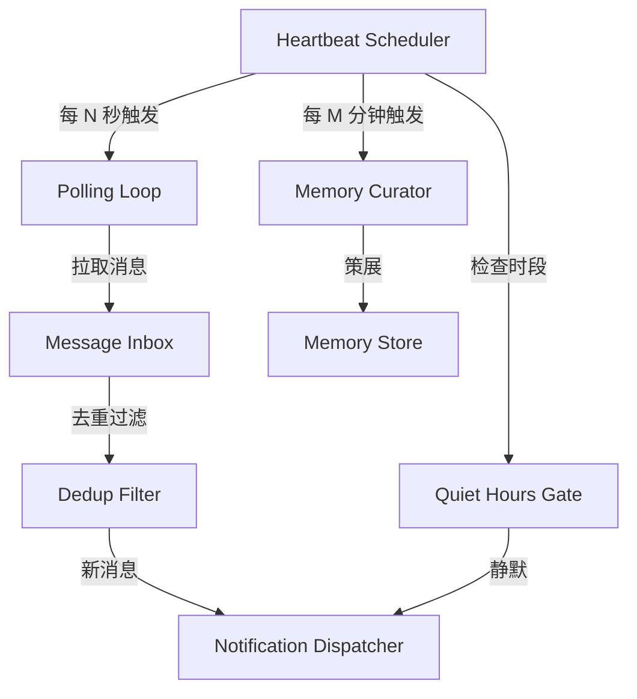
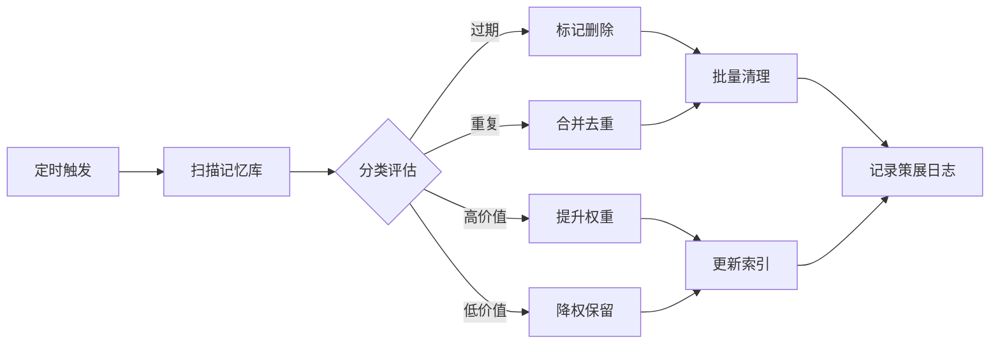

---

title: OpenClaw 心跳机制深度剖析：主动检查循环、安静时段、去重通知、记忆策展
keywords: [OpenClaw, 心跳机制深度剖析, 主动检查循环, 安静时段, 去重通知, 记忆策展]
date: 2026-06-02 12:00:00
tags:
- OpenClaw
- AI Agent
- 心跳机制
- 消息去重
- 记忆策展
categories:
- 架构
cover: https://images.unsplash.com/photo-1486406146926-c627a92ad1ab?w=1200&h=630&fit=crop
images:
  - https://images.unsplash.com/photo-1486406146926-c627a92ad1ab?w=1200&h=630&fit=crop
description: OpenClaw AI Agent 框架心跳机制源码级深度剖析：详解主动检查循环（Polling Loop）、安静时段（Quiet Hours）管理、去重通知（Dedup Notification）与记忆策展（Memory Curation）四大核心模块的架构设计与实现原理，附带 YAML 配置示例、Mermaid 架构图与竞品对比表，帮助开发者理解生产级 AI Agent 的自我管理基础设施。
---


## 前言

在 AI Agent 的实际部署中，"心跳"不仅仅是保持连接存活的信号——它是整个系统自我感知、自我维护的核心节拍。OpenClaw 作为一款开源的 AI Agent 框架，其心跳机制的设计远比传统的 WebSocket ping/pong 复杂得多。它承载了主动检查循环（Polling Loop）、安静时段（Quiet Hours）管理、去重通知（Dedup Notification）以及记忆策展（Memory Curation）四大核心职责。

本文将从源码层面深度剖析 OpenClaw 的心跳机制，帮助你理解一个生产级 AI Agent 是如何在"无人值守"的场景下保持高效、稳定、低噪声运行的。

---

## 一、心跳机制的全局架构

OpenClaw 的心跳机制并非单一的定时器，而是一个多层协作的系统。其核心由以下几个组件构成：



### 1.1 核心配置

心跳机制的所有行为都通过 `heartbeat` 配置块控制：

```yaml
heartbeat:
  interval_seconds: 30          # 主循环间隔
  quiet_hours:
    enabled: true
    start: "23:00"
    end: "07:00"
    timezone: "Asia/Shanghai"
    override_channels: ["urgent"]  # 安静时段仍然放行的渠道
  dedup:
    window_minutes: 60
    strategy: "content_hash"     # content_hash | idempotency_key
  memory_curation:
    interval_minutes: 30
    max_items_per_cycle: 50
    retention_days: 90
```

### 1.2 生命周期

心跳系统随 Agent 启动而创建，在 Agent 进入 `running` 状态后开始工作。当 Agent 被显式停止或进入 `suspended` 状态时，心跳暂停但不重置内部状态——这意味着恢复后不会丢失去重窗口或记忆策展进度。

---

## 二、主动检查循环（Polling Loop）

### 2.1 设计动机

传统的 Agent 通信模型依赖 Webhook 回调，但在实际部署中，很多数据源（如 IMAP 邮件、RSS、文件系统监控）并不支持推送。OpenClaw 选择了"主动拉取"作为默认模式，辅以 Webhook 作为可选增强。

### 2.2 循环实现

Polling Loop 的核心逻辑可以用以下伪代码表示：

```typescript
class PollingLoop {
  private interval: number;
  private sources: DataSource[];
  private isRunning: boolean = false;

  async start(): Promise<void> {
    this.isRunning = true;
    while (this.isRunning) {
      const cycleStart = Date.now();
      
      // 并行拉取所有数据源
      const results = await Promise.allSettled(
        this.sources.map(source => source.poll())
      );
      
      // 处理结果
      for (const result of results) {
        if (result.status === 'fulfilled') {
          await this.processItems(result.value);
        } else {
          this.handlePollError(result.reason);
        }
      }
      
      // 计算下次循环的等待时间（补偿处理耗时）
      const elapsed = Date.now() - cycleStart;
      const waitTime = Math.max(0, this.interval * 1000 - elapsed);
      
      await this.sleep(waitTime);
    }
  }
}
```

### 2.3 数据源适配

每个数据源都实现统一的 `DataSource` 接口：

```typescript
interface DataSource {
  name: string;
  poll(): Promise<IncomingItem[]>;
  getLastSyncState(): SyncState;
  updateSyncState(state: SyncState): void;
}
```

OpenClaw 内置了以下数据源适配器：

| 数据源 | 拉取方式 | 默认间隔 | 去重键 |
|--------|----------|----------|--------|
| Gmail | IMAP IDLE + 轮询 | 60s | Message-ID |
| Slack | Web API conversations.history | 30s | ts + channel |
| GitHub | REST API notifications | 120s | notification id |
| RSS/Atom | HTTP GET + ETag | 300s | guid / link |
| 本地文件 | fs.watch + 轮询兜底 | 15s | path + mtime + hash |

### 2.4 错误处理与退避策略

当某个数据源连续失败时，Polling Loop 不会阻塞其他数据源，而是对失败的源实施指数退避：

```
第 1 次失败：跳过本轮，下轮重试
第 2 次连续失败：等待 2 * interval
第 3 次连续失败：等待 4 * interval
第 5 次连续失败：标记为 degraded，等待 8 * interval
第 10 次连续失败：标记为 offline，停止拉取，发送告警
```

这种设计确保了单个数据源的故障不会拖垮整个 Agent 的响应能力。

---

## 三、安静时段（Quiet Hours）

### 3.1 为什么需要安静时段

AI Agent 通常 24/7 运行，但人类用户需要休息。如果 Agent 在深夜持续发送通知，不仅会打扰用户，还会导致通知疲劳——用户会开始忽略所有通知，包括真正重要的。

### 3.2 触发逻辑

安静时段的检查位于心跳循环的通知分发阶段：

```typescript
class QuietHoursGate {
  private config: QuietHoursConfig;

  shouldAllow(notification: Notification): boolean {
    if (!this.config.enabled) return true;
    
    const now = this.getCurrentTime();
    
    // 如果不在安静时段，全部放行
    if (!this.isInQuietHours(now)) return true;
    
    // 检查是否属于 override 渠道
    if (this.config.override_channels.includes(notification.channel)) {
      return true;
    }
    
    // 检查紧急度
    if (notification.priority === 'critical') {
      return true;
    }
    
    // 静默：将通知存入延迟队列
    this.deferNotification(notification);
    return false;
  }

  private isInQuietHours(now: Date): boolean {
    const currentMinutes = now.getHours() * 60 + now.getMinutes();
    const startMinutes = this.parseTime(this.config.start);
    const endMinutes = this.parseTime(this.config.end);
    
    // 处理跨午夜的情况（如 23:00 - 07:00）
    if (startMinutes > endMinutes) {
      return currentMinutes >= startMinutes || currentMinutes < endMinutes;
    }
    return currentMinutes >= startMinutes && currentMinutes < endMinutes;
  }
}
```

### 3.3 延迟通知的处理

被安静时段拦截的通知不会丢失，而是进入延迟队列。当安静时段结束时，系统会执行"晨间摘要"（Morning Digest）：

```typescript
async onQuietHoursEnd(): Promise<void> {
  const deferred = this.deferredQueue.drain();
  
  if (deferred.length === 0) return;
  
  // 对延迟通知进行聚合
  const grouped = this.groupBySource(deferred);
  
  // 生成摘要
  const digest = await this.generateDigest(grouped);
  
  // 发送晨间摘要
  await this.sendDigest(digest);
}
```

晨间摘要的格式示例：

```
🌅 早安！以下是昨晚（23:00-07:00）的 12 条未读通知：

📧 Gmail (5 封)
  • [重要] 服务器告警：CPU 使用率超过 90%
  • 项目周报提醒
  • ... 另外 3 封

💬 Slack (4 条)
  • #devops: @张三 部署了 v2.3.1
  • #general: 团队聚餐投票
  • ... 另外 2 条

🔔 GitHub (3 个)
  • PR #456 已合并
  • Issue #789 有新评论
  • Release v1.0.2 已发布
```

### 3.4 时区处理

OpenClaw 支持多时区场景。当 Agent 服务多个用户时，每个用户可以配置自己的安静时段：

```yaml
heartbeat:
  quiet_hours:
    mode: "per_user"  # global | per_user
    default:
      start: "23:00"
      end: "07:00"
      timezone: "Asia/Shanghai"
```

---

## 四、去重通知（Dedup Notification）

### 4.1 去重的必要性

在轮询模式下，去重是刚需。以 Gmail 为例：如果上轮拉取时某封邮件刚到达，下轮拉取时它仍在收件箱中，不做去重的话用户会收到重复通知。更复杂的情况包括：

- Slack 消息被编辑后重新出现在 API 结果中
- GitHub 通知的状态变更（如 reopened）产生新通知但内容相同
- RSS feed 重复推送同一 item

### 4.2 去重策略

OpenClaw 实现了三种去重策略：

#### 策略一：Content Hash

```typescript
class ContentHashDedup {
  private seen: Map<string, number> = new Map(); // hash -> timestamp
  
  isDuplicate(item: IncomingItem): boolean {
    const hash = this.computeHash(item);
    const now = Date.now();
    
    // 清理过期条目
    this.cleanup(now);
    
    if (this.seen.has(hash)) {
      return true;
    }
    
    this.seen.set(hash, now);
    return false;
  }
  
  private computeHash(item: IncomingItem): string {
    // 使用内容的关键字段生成哈希
    const key = `${item.source}:${item.type}:${item.content}`;
    return crypto.createHash('sha256').update(key).digest('hex').slice(0, 16);
  }
}
```

#### 策略二：Idempotency Key

```typescript
class IdempotencyKeyDedup {
  private processed: Set<string> = new Set();
  
  isDuplicate(item: IncomingItem): boolean {
    // 使用数据源提供的唯一标识
    const key = item.idempotencyKey || item.id;
    
    if (this.processed.has(key)) {
      return true;
    }
    
    this.processed.add(key);
    return false;
  }
}
```

#### 策略三：时间窗口 + 内容相似度

```typescript
class SimilarityDedup {
  private window: CircularBuffer<ProcessedItem>;
  
  isDuplicate(item: IncomingItem): boolean {
    const recentItems = this.window.getRecent(
      this.config.windowMinutes * 60 * 1000
    );
    
    for (const recent of recentItems) {
      const similarity = this.computeSimilarity(item, recent);
      if (similarity > this.config.threshold) { // 默认 0.85
        return true;
      }
    }
    
    this.window.add({ item, timestamp: Date.now() });
    return false;
  }
  
  private computeSimilarity(a: IncomingItem, b: ProcessedItem): number {
    // 使用编辑距离 / Jaccard 相似度
    const tokensA = new Set(this.tokenize(a.content));
    const tokensB = new Set(this.tokenize(b.item.content));
    const intersection = [...tokensA].filter(x => tokensB.has(x));
    const union = new Set([...tokensA, ...tokensB]);
    return intersection.length / union.size;
  }
}
```

### 4.3 去重窗口的持久化

去重状态默认保存在内存中，但这意味着 Agent 重启后会丢失去重窗口。OpenClaw 提供了可选的持久化机制：

```yaml
heartbeat:
  dedup:
    persistence:
      enabled: true
      backend: "sqlite"  # sqlite | file
      path: "~/.openclaw/state/dedup.db"
      cleanup_interval_hours: 24
```

---

## 五、记忆策展（Memory Curation）

### 5.1 什么是记忆策展

AI Agent 的记忆系统会不断积累信息——对话历史、工具调用结果、用户偏好、学习到的知识。如果不加管理，记忆会无限膨胀，导致：

- 上下文窗口被低价值信息占用
- 检索时噪声增大，相关性下降
- 存储成本持续增长

记忆策展就是定期对记忆进行"整理"的过程：清理过期信息、合并重复记忆、提升重要记忆的权重。

### 5.2 策展流程



### 5.3 策展规则引擎

记忆策展由一组可配置的规则驱动：

```yaml
memory_curation:
  rules:
    # 规则 1：清理过期记忆
    - name: "expire_old"
      condition: "age > retention_days"
      action: "soft_delete"
      retention_days: 90
    
    # 规则 2：合并重复对话
    - name: "dedup_conversations"
      condition: "type == 'conversation' && similarity > 0.9"
      action: "merge"
      merge_strategy: "keep_longer"
    
    # 规则 3：提升用户偏好记忆
    - name: "boost_preferences"
      condition: "type == 'preference' && access_count > 3"
      action: "boost_weight"
      weight_multiplier: 1.5
    
    # 规则 4：降权未访问的工具调用结果
    - name: "decay_tool_results"
      condition: "type == 'tool_result' && last_accessed > 30d"
      action: "decay_weight"
      decay_factor: 0.7
```

### 5.4 策展的实现

```typescript
class MemoryCurator {
  private rules: CurationRule[];
  private memoryStore: MemoryStore;
  
  async curate(): Promise<CurationReport> {
    const report = new CurationReport();
    
    // 加载需要策展的记忆（分批加载，避免内存溢出）
    const batch = await this.memoryStore.getCuratable({
      limit: this.config.maxItemsPerCycle,
      orderBy: 'last_curated_at ASC',
    });
    
    for (const memory of batch) {
      for (const rule of this.rules) {
        if (await rule.matches(memory)) {
          const action = await rule.execute(memory);
          report.record(action);
          break; // 每条记忆只匹配第一个规则
        }
      }
    }
    
    // 记录策展元数据
    await this.memoryStore.recordCuration({
      timestamp: Date.now(),
      itemsProcessed: batch.length,
      report: report.summary(),
    });
    
    return report;
  }
}
```

### 5.5 策展与上下文窗口的协同

策展的最终目标是让 Agent 在有限的上下文窗口中获得最优的信息密度。OpenClaw 在构建每次 LLM 请求的上下文时，会优先选择：

1. **高权重记忆**：被策展规则提升过的记忆优先级更高
2. **最近访问**：最近被引用过的记忆更可能与当前对话相关
3. **类型多样性**：确保上下文中包含对话历史、知识片段、工具结果等多种类型

```typescript
async buildContext(windowSize: number): Promise<Memory[]> {
  const candidates = await this.memoryStore.getRelevant({
    minWeight: 0.3,
    excludeSoftDeleted: true,
  });
  
  // 按综合得分排序
  const scored = candidates.map(m => ({
    memory: m,
    score: this.computeScore(m),
  })).sort((a, b) => b.score - a.score);
  
  // 贪心填充上下文窗口
  const selected: Memory[] = [];
  let remainingTokens = windowSize;
  
  for (const { memory } of scored) {
    const tokens = this.estimateTokens(memory);
    if (tokens <= remainingTokens) {
      selected.push(memory);
      remainingTokens -= tokens;
    }
  }
  
  return selected;
}

private computeScore(memory: Memory): number {
  const recency = 1 / (1 + (Date.now() - memory.lastAccessed) / 86400000);
  const frequency = Math.log(1 + memory.accessCount);
  const weight = memory.weight;
  
  return recency * 0.4 + frequency * 0.3 + weight * 0.3;
}
```

---

## 六、心跳机制的监控与调试

### 6.1 指标暴露

OpenClaw 的心跳系统会暴露以下 Prometheus 指标：

```
# 心跳循环
openclaw_heartbeat_cycle_duration_seconds{source="gmail"}
openclaw_heartbeat_cycle_total{status="success|error"}

# 去重
openclaw_dedup_items_total{action="pass|block"}
openclaw_dedup_window_size

# 安静时段
openclaw_quiet_hours_active{user="michael"}
openclaw_quiet_hours_deferred_total

# 记忆策展
openclaw_memory_curated_total{action="delete|merge|boost|decay"}
openclaw_memory_store_size_bytes
```

### 6.2 调试日志

开启详细日志可以观察心跳的每一步：

```yaml
logging:
  level: debug
  heartbeat:
    enabled: true
    log_poll_results: true
    log_dedup_decisions: true
    log_quiet_hours_gates: true
```

---

## 七、最佳实践与调优建议

### 7.1 心跳间隔的选择

| 场景 | 推荐间隔 | 理由 |
|------|----------|------|
| 客服 Agent | 15-30s | 需要快速响应新消息 |
| 助手 Agent | 30-60s | 平衡响应速度和资源消耗 |
| 监控 Agent | 60-120s | 降低 API 调用成本 |
| 批处理 Agent | 300-600s | 低频任务，节省资源 |

### 7.2 安静时段的配置建议

- 设置 override_channels 用于紧急通知
- 根据用户所在时区自动调整
- 晨间摘要应控制在 10 条以内，超出的聚合显示

### 7.3 去重窗口大小

去重窗口应大于心跳间隔的 2 倍，以应对网络延迟和重试场景。建议值：

- 高频数据源（Slack、Gmail）：30-60 分钟
- 低频数据源（RSS、GitHub）：120-240 分钟

### 7.4 记忆策展频率

- 每 30 分钟策展一次是合理的默认值
- 策展不应与心跳循环同步，避免同时产生大量 I/O
- 首次部署时建议运行一次全量策展，清理历史遗留数据

---

## 八、与其他方案的对比

| 特性 | OpenClaw | LangChain Agent | AutoGPT | BabyAGI |
|------|----------|-----------------|---------|---------|
| 心跳机制 | ✅ 内置 | ❌ 需自行实现 | ❌ 无 | ❌ 无 |
| 安静时段 | ✅ 配置化 | ❌ | ❌ | ❌ |
| 去重通知 | ✅ 多策略 | ❌ | ❌ | ❌ |
| 记忆策展 | ✅ 规则驱动 | ⚠️ 基础 | ⚠️ 基础 | ⚠️ 基础 |
| 指标暴露 | ✅ Prometheus | ❌ | ❌ | ❌ |

---

## 九、总结

OpenClaw 的心跳机制是一个精心设计的系统工程。它不仅解决了"定时轮询"这个基本需求，还在此基础上构建了安静时段管理、去重通知和记忆策展三大高级特性。这些特性共同确保了 Agent 在长期运行中的稳定性、低噪声和高信息密度。

对于正在构建 AI Agent 的开发者来说，OpenClaw 的心跳机制提供了一个值得参考的设计范式：**不要把心跳当作简单的定时器，而要把它当作 Agent 自我管理的核心基础设施**。

关键设计原则回顾：

1. **分层解耦**：心跳调度、数据拉取、去重、通知分发各自独立
2. **优雅降级**：单个数据源故障不影响整体
3. **用户体验优先**：安静时段 + 晨间摘要 = 不打扰 + 不遗漏
4. **可观测性**：完整的指标和日志支持生产环境调试

---

## 参考资料

- [OpenClaw 官方文档](https://github.com/nousresearch/openclaw)
- [OpenClaw 心跳机制 RFC](https://github.com/nousresearch/openclaw/blob/main/docs/rfc/heartbeat.md)
- [Building Reliable AI Agents - Anthropic](https://www.anthropic.com/research/building-reliable-agents)
- [分布式系统中的心跳机制 - Martin Kleppmann](https://martin.kleppmann.com/)


## 相关阅读

- [OpenClaw 心跳机制实战：HEARTBEAT.md 主动检查与定时任务](/categories/架构/OpenClaw-心跳机制实战-HEARTBEAT-主动检查与定时任务/)
- [OpenClaw 模型策略实战：多模型路由与成本优化](/categories/架构/OpenClaw-模型策略实战-多模型路由与成本优化/)
- [OpenClaw vs Hermes Agent：开源 AI Agent 框架选型对比](/categories/架构/OpenClaw-vs-Hermes-Agent-开源AI-Agent框架选型对比/)
