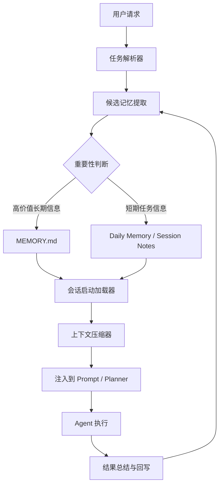

title: OpenClaw 记忆系统实战：MEMORY.md 长期记忆与日常记忆管理
keywords: [OpenClaw]
date: 2026-06-02 09:00:00
tags:
- OpenClaw
- AI Agent
- 记忆系统
- memory.md
- 长期记忆
categories:
  - architecture
cover: https://images.unsplash.com/photo-1486406146926-c627a92ad1ab?w=1200&h=630&fit=crop
images:
description: 本文系统讲解 OpenClaw 记忆系统的落地方法，围绕 MEMORY.md、长期记忆、日常记忆、AI Agent 的上下文管理与跨会话协作展开，覆盖记忆写入、读取、压缩、遗忘与容量控制策略，并结合代码示例、配置片段和实战场景说明如何构建透明、可维护、可审计的持久化记忆机制。
---


# OpenClaw 记忆系统实战：MEMORY.md 长期记忆与日常记忆管理

在过去两年里，AI Agent 从“会聊天的模型包装器”逐步演化成“可以完成连续任务的软件协作者”。一旦 Agent 开始承担较长周期、跨多个步骤、跨多个会话的工作，单次上下文窗口就不再够用。模型即使再强，也只能看到当前请求里显式提供的内容；而真实世界的任务往往要求它记住用户偏好、项目约束、历史决策、未完成事项、失败原因和后续执行计划。于是，记忆系统不再是一个“锦上添花”的增强模块，而是 Agent 能否稳定工作的基础设施。

OpenClaw 在这方面给出了一个非常工程化、也非常适合个人开发者理解和落地的思路：把长期有效、需要跨会话保留的信息沉淀到 `MEMORY.md`，并配合日常记忆、执行日志、摘要压缩与更新策略，形成可维护、可观察、可人工介入的记忆体系。相比完全依赖向量数据库或隐藏在应用内部的黑盒存储，基于 Markdown 的记忆方案最大的优势是透明、可审阅、可版本管理、便于快速试错。这种“把记忆写成文档”的思路，看似朴素，实际上非常符合 Agent 工程化落地阶段的需求。

本文会围绕 OpenClaw 的记忆系统进行一次系统实战。重点不是抽象讨论“记忆很重要”，而是从架构、文件结构、读写机制、分层策略、容量控制，到和 Hermes Agent 的记忆组织方式进行对比，最后给出一套适合个人项目与小团队场景的实践建议。文中所有章节都会给出代码示例、配置片段和真实场景说明，便于你直接拿去改造成自己的 Agent 方案。

## 1. 引言：为什么 AI Agent 需要记忆系统

很多人第一次做 Agent 时，会天然把重点放在提示词、工具调用、模型路由和执行链编排上。这些当然重要，但如果 Agent 不具备稳定记忆，它往往只能在一次对话里表现得聪明，一到第二天、第二次任务、第二个阶段就“失忆”。这种失忆会带来几个非常具体的问题。

第一，用户体验会断裂。比如用户昨天已经告诉 Agent：

- 以后默认用中文输出；
- 技术文章面向中高级开发者；
- Hexo 博客路径固定在 `source/_posts`；
- 新文章必须包含 frontmatter 和封面字段。

如果第二天 Agent 还要重新问一遍这些问题，用户会明显感觉这个系统“每次都是新来的”。这不只是体验问题，更直接影响效率。

第二，任务链无法积累。Agent 在项目型任务里需要知道“已经做过什么”“为什么这样做”“哪些问题尚未解决”。例如一个代码助手在上一次会话中已经发现数据库连接池有泄漏，决定本周先不引入异步 ORM。如果这条决策无法留存，后续会话很可能又重新走一遍错误路线。

第三，缺乏记忆会导致 token 浪费。没有外部记忆时，开发者常用的补救方式是把大量背景信息反复塞进 prompt。这不仅昂贵，而且不稳定：提示词一长，模型更容易忽略重点，真正关键的信息反而被淹没。

第四，Agent 的“人格”和“工作方式”无法形成持续性。对很多工作型 Agent 来说，长期偏好并不只是语气问题，还包括输出格式、审批边界、代码风格、错误处理方式、日志保留策略等。这些如果不能被记录，就无法形成稳定行为。

所以从工程视角看，Agent 记忆系统至少要解决四类信息的保存问题：

1. **用户长期偏好**：语言、风格、工作习惯、目录约定、默认工具链。
2. **项目长期事实**：架构原则、关键路径、接口约束、部署方式、命名规范。
3. **近期工作上下文**：当前迭代目标、最近一次执行结果、待办项、阻塞项。
4. **可演化的经验总结**：什么方案试过、为什么失败、以后应如何避免。

下面用一个最常见的场景说明为什么这些信息必须被结构化保存。

### 场景：内容生产型 Agent 的跨会话协作

假设你有一个写作 Agent，负责维护个人技术博客。它需要长期记住：

```yaml
user_preferences:
  language: zh-CN
  blog_engine: Hexo
  post_root: source/_posts
  require_cover: true
  prefer_style: 深入分析 + 实战示例
project_rules:
  categories:
    - 架构
    - ai
    - 工程效率
  frontmatter_required:
    - title
    - date
    - tags
    - categories
    - cover
```

如果没有记忆系统，那么每次写新文章时，都得把这些规则重新拼进提示词；而有了记忆系统，Agent 可以在任务开始时读取结构化记忆，自动套用博客规则。这就是“可持续协作”和“一次性对话”的分界线。

从实现方式上看，记忆系统通常分为几类：

- **纯上下文注入**：简单，但不持久；
- **数据库存储**：灵活，但观察性差；
- **向量检索记忆**：适合语义召回，但难做强约束；
- **文件化记忆**：透明、易人工维护，非常适合个人 Agent；
- **混合记忆**：文件负责规则和高价值事实，数据库负责大规模检索。

OpenClaw 把文件化记忆作为核心抓手，尤其以 `MEMORY.md` 为中心，构建长期记忆与日常记忆的分层体系。这种做法并不排斥数据库或向量检索，但它优先解决的是“我怎样让 Agent 的记忆可见、可控、可维护”。这也是本文后面要重点展开的内容。

## 2. OpenClaw 记忆系统架构概述

OpenClaw 的记忆系统可以理解成三层：**输入层、存储层、编排层**。

- 输入层负责从用户消息、任务执行结果、工具反馈中提取候选记忆；
- 存储层负责把这些信息按生命周期和重要性写入不同位置；
- 编排层负责在新任务开始时读取、过滤、压缩并重新注入上下文。

一个典型的数据流如下：



这套架构的关键点在于：不是所有信息都直接写进长期记忆，也不是所有历史都被带进当前上下文。OpenClaw 更像是在做一件事情：**把“信息”变成“可持续使用的记忆资产”**。

### 2.1 记忆对象分类

在 OpenClaw 的视角中，至少可以把记忆拆成以下几类：

1. **Profile Memory**：与用户长期偏好相关，例如语言、写作风格、默认路径。
2. **Project Memory**：与某个项目、仓库、业务系统相关的稳定事实。
3. **Task Memory**：当前任务期间形成的待办、阻塞、阶段结果。
4. **Episodic Memory**：某次执行过程中的关键事件，如“部署失败因端口占用”。
5. **Summary Memory**：对大量日常记忆压缩后的摘要，用于减少上下文体积。

一个简化的目录设计可以长这样：

```text
.openclaw/
├── MEMORY.md
├── memory/
│   ├── daily/
│   │   ├── 2026-06-01.md
│   │   ├── 2026-06-02.md
│   ├── summaries/
│   │   ├── weekly-summary.md
│   │   └── project-a-summary.md
│   └── archive/
│       └── 2026-Q1.md
├── sessions/
│   ├── session-001.json
│   └── session-002.json
└── config/
    └── memory.yaml
```

其中 `MEMORY.md` 是长期记忆的中心。它存放的是相对稳定、对后续行为有持续影响的信息。`daily/` 则更像工作日志，记录当天有哪些任务、决策、异常和待办。`summaries/` 负责把散乱的日常记录压缩成阶段性摘要，避免长期依赖原始流水账。

### 2.2 为什么用 Markdown 而不是直接用数据库

很多工程师看到这里会问：为什么不直接上 SQLite、Postgres，甚至向量数据库？

答案不是“数据库不好”，而是 OpenClaw 在设计上优先考虑以下目标：

- **可读性**：人类可以直接打开 `MEMORY.md` 查看 Agent 记住了什么；
- **可编辑性**：当记忆错误时，用户可以手工修正；
- **可审计性**：通过 Git diff 看到记忆变更；
- **可迁移性**：换模型、换框架，Markdown 仍然可用；
- **低门槛**：个人开发者不需要额外部署存储系统。

下面是一个示意性的记忆配置片段：

```yaml
memory:
  enabled: true
  backend: markdown
  root: .openclaw
  long_term_file: MEMORY.md
  daily_dir: memory/daily
  summary_dir: memory/summaries
  archive_dir: memory/archive
  load_on_session_start: true
  write_after_task: true
  auto_compact: true
```

这种配置的含义非常清晰：长期记忆写哪里，日常记忆写哪里，什么时候加载，什么时候回写，是否启用压缩，都能一眼看出来。

### 2.3 记忆系统与 Agent 生命周期的关系

OpenClaw 的记忆系统通常会介入三个时刻：

1. **会话开始前**：预加载长期记忆和最近日常摘要；
2. **执行过程中**：捕捉关键决策、工具结果、错误与用户新偏好；
3. **执行结束后**：回写新记忆、更新摘要、判断是否归档。

用伪代码表达：

```python
class MemoryAwareAgent:
    def start_session(self, task):
        long_term = self.memory.load_long_term()
        recent_daily = self.memory.load_recent_daily(limit=3)
        summary = self.memory.load_summaries(topic=task.project)
        context = self.memory.compose_context(long_term, recent_daily, summary)
        return self.planner.bootstrap(task, context)

    def on_event(self, event):
        candidates = self.memory.extract_candidates(event)
        self.memory.buffer(candidates)

    def finish_session(self, result):
        self.memory.write_daily(result)
        self.memory.promote_important_facts(result)
        self.memory.compact_if_needed()
```

这说明记忆系统不是一个附属插件，而是 Agent 生命周期的一部分。只要 Agent 要“连续工作”，记忆就应该像日志、配置、缓存一样成为基础组件。

## 3. MEMORY.md 文件结构详解：长期记忆 vs 日常记忆

`MEMORY.md` 的价值不在于“把所有东西都塞进去”，而在于通过合理结构，明确什么属于长期记忆，什么只适合留在日常记忆里。很多项目失败的原因并不是没有记忆，而是把瞬时噪声和长期事实混在一起，导致 Agent 每次加载的上下文越来越乱。

### 3.1 一个推荐的 MEMORY.md 结构

下面给出一个适合 OpenClaw 的 `MEMORY.md` 模板：

```markdown
# MEMORY.md

## Identity
- Agent name: OpenClaw Writer
- Primary role: 技术内容生产与工程辅助

## User Preferences
- 默认语言：中文
- 输出风格：结构化、深入分析、提供代码示例
- 对不确定信息要显式标注假设
- 对文件操作优先给出可执行结果

## Workspace Conventions
- Hexo 文章目录：source/_posts
- 封面路径格式：/images/covers/<slug>.jpg
- 分类优先使用：架构、AI Agent、工程效率

## Project Facts
- 博客基于 Hexo
- 文章必须包含 frontmatter
- 长文目标通常为 8000-15000 字

## Ongoing Initiatives
- 正在整理 AI Agent 系列文章
- 计划补充 OpenClaw、Hermes Agent、Memory 架构对比

## Do / Don't
### Do
- 写技术文章时包含原理、配置、示例、实战
- 涉及文件写入时检查路径是否存在

### Don't
- 不省略 frontmatter
- 不在未经确认时修改其他项目目录

## Recent Important Decisions
- 文章默认使用中文技术写作风格
- AI Agent 相关文章倾向“架构 + 实战”双线展开
```

这个结构的核心是：**每一节只保留对未来决策真的有用的信息**。例如“昨天 14:32 某次生成失败”通常不该写进长期记忆，但“技术文章必须包含 frontmatter”就是长期有效规则。

### 3.2 长期记忆和日常记忆的边界

判断一条信息该放进 `MEMORY.md` 还是日常记忆，一个简单标准是：

> 如果这条信息在未来 3 次以上会话里仍然影响 Agent 的行为，它更可能属于长期记忆；如果它只对最近一两次执行有意义，它更适合放在日常记忆。

举几个例子。

**适合长期记忆的内容：**

- 用户长期偏好：默认中文、代码示例要完整。
- 项目固定约束：博客文章要写到指定目录。
- 稳定架构事实：某系统采用事件驱动，不引入分布式事务。
- 反复验证过的经验：部署前必须先执行数据库迁移检查。

**适合日常记忆的内容：**

- 今天修复了某个脚本路径错误。
- 本次任务生成文章后需要再补封面图。
- 某次 API 调用超时，需要稍后重试。
- 当前迭代的待办事项和阻塞项。

### 3.3 日常记忆文件怎么组织

推荐按日期或主题拆分日常记忆，例如：

```markdown
# 2026-06-02 Daily Memory

## Tasks
- 撰写 OpenClaw 记忆系统技术文章
- 校验 Hexo frontmatter 格式
- 统计文章字数是否达标

## Facts Learned Today
- 用户要求长文控制在 10000-15000 字
- 文章需包含 Hermes Agent 记忆系统对比章节

## Decisions
- 采用章节化结构，每章包含代码示例和场景说明
- 长期约束写入 MEMORY.md，任务细节留在 daily memory

## Issues
- 需注意不要把临时字数要求误写为长期规则

## Follow-ups
- 后续可拆分为 OpenClaw 系列文章
```

这种文件最大的好处是：你可以放心记录细节，不会污染长期记忆。后续如果系统需要摘要压缩，再从 daily memory 提炼。

### 3.4 用 YAML 头或标签增强可解析性

虽然 `MEMORY.md` 面向人类可读，但为了提升程序解析能力，可以引入轻量标签：

```markdown
## User Preferences
- [stable][high] 默认语言：中文
- [stable][medium] 输出尽量使用小节标题
- [stable][high] 文件写入后要执行校验命令

## Project Facts
- [project:blog][high] Hexo 文章目录为 source/_posts
- [project:blog][high] 每篇文章必须包含 cover 字段
```

或者把结构写得更接近机器可提取：

```markdown
## Memory Entries
- key: default_language
  value: zh-CN
  scope: global
  priority: high
  stability: stable

- key: blog_post_root
  value: source/_posts
  scope: project_blog
  priority: high
  stability: stable
```

前者更适合人工维护，后者更适合自动解析。OpenClaw 的一个现实优势就在这里：因为底层是 Markdown，你可以根据项目复杂度渐进增强结构，而不必一开始就设计复杂 schema。

## 4. 记忆的写入、读取、更新机制

记忆系统最难的部分不在“存”，而在“什么时候存、存什么、怎么避免写坏”。如果 Agent 每次都把所有观察到的内容写进 `MEMORY.md`，这个文件很快就会变成垃圾堆。真正需要设计的是写入策略、更新规则和冲突处理机制。

### 4.1 写入机制：从事件中提取候选记忆

记忆写入的第一步不是立刻落盘，而是从事件流里提取候选记忆。事件流可能包括：

- 用户显式要求；
- 工具执行结果；
- 任务计划变更；
- 失败原因；
- 输出反馈。

例如：

```python
from dataclasses import dataclass
from typing import Literal

@dataclass
class MemoryCandidate:
    content: str
    scope: Literal["long_term", "daily"]
    priority: Literal["low", "medium", "high"]
    confidence: float
    source: str


def extract_memory_candidates(event: dict) -> list[MemoryCandidate]:
    text = event.get("text", "")
    candidates = []

    if "以后默认用中文" in text:
        candidates.append(
            MemoryCandidate(
                content="默认语言：中文",
                scope="long_term",
                priority="high",
                confidence=0.95,
                source="user_message",
            )
        )

    if "本次任务" in text or "今天" in text:
        candidates.append(
            MemoryCandidate(
                content=text,
                scope="daily",
                priority="medium",
                confidence=0.70,
                source="session_event",
            )
        )

    return candidates
```

这里的关键点是：事件先被抽取成候选项，再进入分类与写入流程，而不是直接写文件。

### 4.2 读取机制：按任务场景装配上下文

读取记忆时，最常见错误是“一股脑全读进来”。正确做法是按场景装配：

- 全局长期偏好永远读；
- 项目相关长期记忆按当前工作目录或任务标签读；
- 最近 1-3 天的日常记忆按时间窗口读；
- 更早历史优先读摘要，不读原始流水；
- 对高优先级规则设置强注入，对低优先级内容设置可选注入。

一个简单加载器：

```python
class MemoryLoader:
    def load_for_task(self, task):
        context = []
        context += self.load_global_memory()
        context += self.load_project_memory(task.project)
        context += self.load_recent_daily(days=3)
        context += self.load_relevant_summaries(task.topic)
        return self.rank_and_trim(context, max_items=30)

    def rank_and_trim(self, items, max_items=30):
        scored = sorted(items, key=lambda x: (x.priority, x.recency), reverse=True)
        return scored[:max_items]
```

### 4.3 更新机制：追加、替换、合并

长期记忆不是日志，不能只会 append。它必须支持更新。典型策略有三种：

1. **追加**：新事实与旧事实不冲突时，加入新条目；
2. **替换**：新事实明确覆盖旧事实，例如默认语言从英文改中文；
3. **合并**：多个相关事实合成为摘要，例如近期项目方向发生调整。

举例：

```python
def update_long_term_memory(entries, new_fact):
    for idx, entry in enumerate(entries):
        if entry["key"] == new_fact["key"]:
            entries[idx] = new_fact
            return entries, "replaced"

    entries.append(new_fact)
    return entries, "appended"
```

对 Markdown 文件来说，你可以维护显式的 key，或者在固定章节下替换特定项目。比如：

```markdown
## User Preferences
- 默认语言：中文
- 技术文章目标读者：中高级开发者
```

当“默认语言”发生变化时，不是继续追加“默认语言：英文”，而是替换原条目。

### 4.4 回写流程：先写 daily，再决定是否晋升为长期记忆

一个很实用的工程经验是：**除非高度确定，否则先写入 daily memory，再由晋升流程进入 `MEMORY.md`**。这样可以显著降低长期记忆污染。

```python
def commit_memory(result):
    daily_entries = summarize_session(result)
    write_daily_memory(daily_entries)

    important = []
    for item in daily_entries:
        if item.priority == "high" and item.stability == "stable":
            important.append(item)

    promote_to_long_term(important)
```

这种双阶段策略类似“冷热分层”：

- daily memory 是热区，容纳新鲜、噪声较多的信息；
- `MEMORY.md` 是冷区，只沉淀经过筛选的稳定事实。

### 4.5 冲突处理与人工审核

记忆系统还有一个常被忽视的问题：冲突。比如同一份记忆里出现：

- 默认语言：中文
- 默认语言：中英双语

这时不能简单保留两者，否则 Agent 行为会摇摆。更合理的做法是引入变更记录或人工审核标记：

```markdown
## Pending Memory Reviews
- key: default_language
  old: 中文
  new: 中英双语
  source: 2026-06-02 session
  status: review_required
```

如果项目允许人工介入，可以在下次启动时优先提示用户确认；如果系统必须自治，则可依据时间戳、可信度、来源优先级自动选择更新项。

## 5. 实战：配置记忆系统让 Agent 跨会话保持上下文

理论说清楚之后，真正落地的关键是：如何在一个实际项目里把 OpenClaw 的记忆系统跑起来。下面我们以“技术写作 Agent”为例，演示一套从配置到执行的实践方案。

### 5.1 目录初始化

先初始化记忆目录：

```bash
mkdir -p .openclaw/memory/daily
mkdir -p .openclaw/memory/summaries
mkdir -p .openclaw/memory/archive
touch .openclaw/MEMORY.md
touch .openclaw/config/memory.yaml
```

推荐的初始目录：

```text
project/
├── .openclaw/
│   ├── MEMORY.md
│   ├── config/
│   │   └── memory.yaml
│   └── memory/
│       ├── daily/
│       ├── summaries/
│       └── archive/
├── content/
└── scripts/
```

### 5.2 初始 MEMORY.md 示例

```markdown
# MEMORY.md

## User Preferences
- 默认语言：中文
- 技术文章默认包含代码示例、配置片段、实际场景说明
- 输出应尽量结构化，避免大段无小标题内容

## Project Facts
- 当前项目为 Hexo 博客内容生产
- 所有文章写入 source/_posts
- frontmatter 必须包含 title/date/tags/categories/cover

## Workflow Rules
- 生成文章后执行字数统计
- 如果用户要求指定路径，必须直接写入目标路径
- 修改文件后保留可审计结果
```

### 5.3 memory.yaml 配置示例

```yaml
memory:
  enabled: true
  strategy: markdown_hybrid
  long_term:
    file: .openclaw/MEMORY.md
    auto_load: true
    auto_promote: true
    sections:
      - User Preferences
      - Project Facts
      - Workflow Rules
  daily:
    dir: .openclaw/memory/daily
    naming: "%Y-%m-%d.md"
    write_after_each_task: true
    recent_window_days: 3
  summary:
    dir: .openclaw/memory/summaries
    generate_every: 5_sessions
    max_tokens_per_summary: 1200
  compaction:
    enabled: true
    long_term_max_items: 80
    daily_archive_after_days: 14
    archive_dir: .openclaw/memory/archive
```

这个配置体现了几个核心原则：

- 长期记忆自动加载；
- 日常记忆每次任务结束都写；
- 若干会话后自动生成摘要；
- 日常记忆超过时间窗口则归档。

### 5.4 会话启动时加载记忆

```python
from pathlib import Path
import yaml

class OpenClawMemory:
    def __init__(self, root: Path):
        self.root = root
        self.config = yaml.safe_load((root / ".openclaw/config/memory.yaml").read_text())

    def bootstrap_context(self):
        long_term = (self.root / ".openclaw/MEMORY.md").read_text()
        daily_dir = self.root / ".openclaw/memory/daily"
        recent_files = sorted(daily_dir.glob("*.md"))[-3:]
        recent_notes = "\n\n".join(f.read_text() for f in recent_files)
        return f"## Long-Term Memory\n{long_term}\n\n## Recent Daily Memory\n{recent_notes}"
```

在实际调用模型前，可以把 `bootstrap_context()` 的返回值拼接进 system prompt 或 planner 上下文。

### 5.5 执行结束后回写记忆

```python
from datetime import date


def write_daily_note(root: Path, task_name: str, facts: list[str], decisions: list[str]):
    today = date.today().isoformat()
    target = root / f".openclaw/memory/daily/{today}.md"

    content = [f"# {today} Daily Memory", "", "## Task", f"- {task_name}", "", "## Facts"]
    content.extend([f"- {item}" for item in facts])
    content.append("")
    content.append("## Decisions")
    content.extend([f"- {item}" for item in decisions])

    target.write_text("\n".join(content))
```

例如本次文章写作任务结束后，daily note 里可以记录：

```markdown
## Facts
- 用户要求文章 10000-15000 字
- 必须包含与 Hermes Agent 记忆系统的对比分析

## Decisions
- 使用章节化结构覆盖 10 个主题
- 每个章节加入代码示例、配置片段、场景说明
```

注意这里的“字数要求”更接近任务级信息，不一定需要晋升为长期记忆；但“技术文章应包含代码示例、配置片段、场景说明”如果被多次重复要求，就适合晋升到 `MEMORY.md`。

### 5.6 跨会话保持上下文的实际效果

假设第二天用户发来请求：“再写一篇关于 Agent 工具调用安全的长文。”

如果 Agent 具备记忆系统，会自动知道：

- 默认中文输出；
- 使用 Hexo frontmatter；
- 文章路径通常在 `source/_posts`；
- 风格是“架构 + 实战 + 代码示例”；
- 长文目标通常在 8000-15000 字左右。

这就是跨会话上下文保留的实际价值：用户不需要重复教育系统，Agent 也不会每次从零开始。

## 6. 记忆分层策略：重要信息提取与摘要压缩

如果你真的让 Agent 连续工作几周，就会发现另一个现实问题：即使使用 Markdown 记忆，内容也会膨胀。要让记忆系统长期可用，必须做分层、提取和压缩。

### 6.1 分层原则：稳定性、复用性、决策影响

判断信息应该被保留多久、放在哪一层，可以用三个维度：

1. **稳定性**：是否会频繁变化；
2. **复用性**：未来是否会多次使用；
3. **决策影响**：是否显著改变 Agent 行为。

可以设计一个简单打分模型：

```python
def score_memory_item(stability: int, reuse: int, impact: int) -> int:
    return stability * 0.4 + reuse * 0.3 + impact * 0.3


def classify(score: float) -> str:
    if score >= 4.0:
        return "long_term"
    if score >= 2.5:
        return "summary"
    return "daily"
```

例如：

- “默认语言：中文”稳定性高、复用高、影响高，应进长期记忆；
- “今天文章需要 12000 字”影响高但稳定性低，进 daily；
- “近期用户偏好长文 + 实战风格”可能来自多次 daily 观察，适合压缩进 summary 或晋升长期记忆。

### 6.2 从日常记忆提取重要信息

你可以定期扫描 daily notes，把反复出现的事实提炼出来：

```python
from collections import Counter


def promote_repeated_patterns(daily_entries: list[str]):
    counter = Counter(daily_entries)
    promoted = []
    for text, count in counter.items():
        if count >= 3:
            promoted.append(text)
    return promoted
```

实际项目里不会这么简单，但这个思路很重要：**长期记忆不一定靠用户显式声明，也可以由系统从重复模式中学习。**

比如连续三周的 daily memory 都提到：

- 技术文章要求结构化；
- 需要代码示例；
- 要有实战场景。

那么 Agent 就可以形成一条长期记忆：

```markdown
## User Preferences
- 技术文章默认采用“原理 + 配置 + 代码 + 场景”的结构
```

### 6.3 摘要压缩：不是删掉，而是提炼

摘要压缩的目标不是“减少文件大小”，而是把低信噪比的原始记录转换成高信噪比的可复用信息。比如下面是一段冗长的 daily memory：

```markdown
- 2026-05-28：用户要求文章加代码示例
- 2026-05-29：用户希望配置片段更完整
- 2026-05-30：用户觉得场景说明不足
- 2026-05-31：要求文章更偏实战，不要只有概念
```

压缩后可以变成：

```markdown
## Weekly Writing Preferences Summary
- 用户偏好技术文章采用实战导向结构，需同时包含代码示例、配置片段与场景说明。
```

对应的配置逻辑：

```yaml
summary_rules:
  aggregate_by_topic: true
  min_occurrences_for_promotion: 3
  compress_style: factual
  retain_source_links: true
```

### 6.4 分层后的注入顺序

记忆分层后，注入模型的优先顺序通常应该是：

1. 全局长期记忆；
2. 当前项目长期记忆；
3. 近期摘要记忆；
4. 最近日常记忆；
5. 会话内即时状态。

这能避免最近的噪声盖过长期规则。一个合成 prompt 的示例：

```python
def compose_prompt(task, memory):
    return f"""
你是一个具备持久记忆的 OpenClaw Agent。

[长期记忆]
{memory.long_term}

[项目摘要]
{memory.summary}

[最近日常记忆]
{memory.daily}

[当前任务]
{task}
"""
```

## 7. 记忆容量管理：遗忘机制与优先级排序

任何记忆系统只要长期运行，就必须面对“容量有限”这件事。这里的容量不只是磁盘空间，更重要的是：**模型在一次推理里能有效利用的上下文有限**。所以记忆管理的核心不是“多存”，而是“高质量地保留和取用”。

### 7.1 为什么 Agent 也需要遗忘

“遗忘”听起来像缺陷，但对 Agent 来说其实是能力。因为并不是所有信息都值得一直保留。以下内容通常应该被遗忘或归档：

- 临时性任务要求，例如这次文章要 10000 字；
- 已解决且不再复发的偶发错误；
- 重复度高、没有新增价值的执行日志；
- 被新规则覆盖的旧偏好。

如果没有遗忘，系统会遇到几个问题：

- 长期记忆越来越大，加载成本增加；
- 新旧规则冲突，行为不稳定；
- prompt 被噪声占用，关键事实反而被稀释。

### 7.2 优先级排序模型

可以为每条记忆设置优先级分值，例如：

```python
@dataclass
class MemoryItem:
    text: str
    priority: int      # 1-5
    recency: int       # days since updated, smaller is newer
    stability: int     # 1-5
    usage_count: int


def memory_rank(item: MemoryItem) -> float:
    return item.priority * 0.35 + item.stability * 0.30 + item.usage_count * 0.20 - item.recency * 0.05
```

这种排序的意义在于：

- 高优先级、高稳定性的信息更容易被保留；
- 长期不被使用且时间久远的信息逐渐降权；
- 被频繁命中的记忆说明仍然有现实价值。

### 7.3 遗忘策略：TTL、衰减、归档

常见遗忘策略有三种：

#### 1）TTL 到期删除

适合 daily memory 或会话记忆。

```yaml
daily_memory:
  ttl_days: 14
  archive_before_delete: true
```

#### 2）权重衰减

随着时间推移，如果记忆没有再次被引用，权重持续降低：

```python
def decay_score(score: float, days: int) -> float:
    return score * (0.98 ** days)
```

#### 3）归档替代

不是直接删掉，而是把原始信息移到 archive，再保留摘要。比如：

```text
memory/
├── daily/
├── summaries/
└── archive/
    └── 2026-05-archive.md
```

归档后的摘要可能只保留：

```markdown
## 2026-05 Archive Summary
- 本月用户技术写作偏好稳定为：中文、结构化、实战导向。
- Hexo 文章写作流程已固定：生成 -> 校验 frontmatter -> 统计字数。
```

### 7.4 限额管理：限制每层记忆规模

推荐对不同层级设置限制：

```yaml
limits:
  long_term_max_items: 100
  recent_daily_max_files: 5
  summary_max_items: 20
  prompt_memory_budget_tokens: 2500
```

这样做有两个好处：

- 让系统在设计上承认上下文预算有限；
- 迫使你建立优先级和压缩机制，而不是无限累积。

### 7.5 实际场景：写作 Agent 的遗忘策略

以博客写作 Agent 为例：

- “默认中文输出”永久保留；
- “Hexo frontmatter 必须包含 cover”永久保留；
- “本次文章要求 10000-15000 字”仅保留在当天 daily memory；
- “上周某次字数不足被返工”可以在 summary 中保留一个经验结论，而不是保留详细流水。

最终形成的长期经验可能是：

```markdown
## Workflow Rules
- 长篇技术文章生成后需进行字数统计与结构完整性检查。
```

这比保留所有历史返工细节更有价值。

## 8. 与 Hermes Agent 记忆系统的对比分析

讨论 OpenClaw 的 `MEMORY.md` 时，很适合把它放到更广泛的 Agent 工程实践里看。Hermes Agent 同样强调持久上下文、工作目录纪律、工具链协同与可追踪执行结果，但它在记忆的组织边界上与 OpenClaw 有明显差异。理解这种差异，有助于我们在实际项目里选型，也有助于把两者结合起来。

### 8.1 共同目标：让 Agent 从“会答题”走向“会持续工作”

OpenClaw 和 Hermes Agent 的共同点在于，它们都不把 Agent 理解为一次性问答接口，而是把 Agent 视为要持续处理任务的执行系统。因此两者都需要回答几个相同问题：

- 用户偏好如何跨会话延续；
- 项目事实如何被稳定保存；
- 会话中的新发现如何回写；
- 系统如何避免每轮都从零开始。

比如一个持续写作的 Agent，无论运行在 OpenClaw 还是 Hermes 风格体系中，都需要记住类似信息：

```yaml
shared_needs:
  language: zh-CN
  blog_engine: Hexo
  output_style: 结构化技术长文
  must_include:
    - frontmatter
    - 代码示例
    - 配置片段
    - 场景说明
```

也就是说，两者都承认“记忆”不是附加特性，而是持续协作能力的基础。

### 8.2 OpenClaw 的重点：把高价值记忆显式写成文档

OpenClaw 的优势在于简单直接。它把长期记忆沉淀到 `MEMORY.md`，把短期工作记录放到 daily notes，再配合 summary 和归档机制做分层。这个思路非常适合以下场景：

- 个人开发者快速给 Agent 增加持久记忆；
- 希望通过 Git diff 审查记忆变更；
- 需要手工修订 Agent 记忆；
- 还没有复杂运行时平台，但想先把规则和偏好固化下来。

一个典型的 OpenClaw 长期记忆条目可能是：

```markdown
## Project Facts
- 默认使用 uv 管理 Python 环境
- 技术博客文章必须包含 cover 字段
- 写作任务完成后执行字数统计
```

这类信息读起来像文档，但对 Agent 来说已经是行为约束。

### 8.3 Hermes Agent 的重点：记忆与运行时生态紧密耦合

Hermes Agent 更强调运行时约束、profile 边界、技能加载、工具调用纪律以及真实执行反馈。它的记忆概念往往不只是“写在某个 Markdown 文件里的规则”，而是和以下对象共同构成 Agent 的持久上下文：

- 当前 profile 下的 memories；
- profile 级技能、插件、定时任务；
- 工作目录与仓库边界；
- 已执行命令和验证结果；
- 工具使用约束与执行纪律。

也就是说，Hermes Agent 的记忆更接近“运行中的可持续状态管理”。例如一个 Hermes 风格的执行约束，可能体现在配置或规则里：

```yaml
runtime_rules:
  must_use_tools_for:
    - file_reads
    - file_writes
    - current_time
    - git_history
  verify_before_finalize: true
  workspace_root: /Users/michael
  profile_scope: default
```

这些内容和传统意义上的“用户偏好”不同，它们是执行系统的一部分，直接决定 Agent 怎样行动、怎样验证结果、怎样避免越界。

### 8.4 对比：文档化记忆 vs 运行态记忆

如果用更工程化的语言概括，可以把差异理解为：

- **OpenClaw** 更擅长把规则、偏好、长期事实文档化；
- **Hermes Agent** 更擅长把任务执行、工具纪律、运行态边界纳入持久上下文。

下面给出一个更直观的对比表：

```markdown
| 维度 | OpenClaw | Hermes Agent |
|---|---|---|
| 主要载体 | MEMORY.md + daily memory | profile/memories + 运行时规则 |
| 设计重心 | 文档化长期记忆 | 执行态上下文与工具纪律 |
| 人工可读性 | 极高，Markdown 直读 | 高，但更依赖运行环境结构 |
| 修改方式 | 手工编辑非常方便 | 通常结合 profile、skills、memories 管理 |
| 适合起步方式 | 快速落地个人 Agent | 构建持续自动化执行体系 |
| 典型优势 | 透明、可审阅、易迭代 | 可验证、强约束、贴近真实执行 |
```

### 8.5 实际场景对比

假设现在有两个任务：

1. 写一篇 Hexo 技术博客；
2. 修改仓库文件并验证输出。

在 OpenClaw 体系中，第一类任务会优先依赖 `MEMORY.md` 中的写作规则，例如：

```markdown
## User Preferences
- 默认中文输出
- 技术文章采用“原理 + 配置 + 代码 + 场景”结构

## Workflow Rules
- 文章写入后执行字数统计
```

而在 Hermes Agent 体系中，第二类任务除了用户偏好外，还会强调行动纪律，例如：

```yaml
execution_discipline:
  read_files_with: read_file
  search_with: search_files
  write_with: write_file_or_patch
  verify_with_real_output: true
  avoid_unverified_claims: true
```

前者偏“写下知识”，后者偏“约束执行”。这两者并不是替代关系，而是关注点不同。

### 8.6 如何组合两种记忆思路

从实践经验看，最稳妥的方案往往不是二选一，而是分层组合：

1. 用 OpenClaw 风格 Markdown 记住高价值长期规则；
2. 用 Hermes 风格运行态记忆保存执行环境约束；
3. 用日常记忆与摘要层承接近期任务上下文；
4. 在需要时再引入语义检索层处理更大规模历史数据。

可以用一个简化配置来表达这种混合架构：

```yaml
memory_stack:
  long_term_rules:
    backend: markdown
    file: .openclaw/MEMORY.md
  operational_context:
    backend: runtime_memory
    scope: current_profile
  short_term_notes:
    backend: daily_markdown
    dir: .openclaw/memory/daily
  summaries:
    backend: markdown_summary
    dir: .openclaw/memory/summaries
```

这种组合的价值在于：

- 人能看懂最关键的长期规则；
- Agent 还能保有足够强的运行时纪律；
- 临时上下文不会污染长期记忆；
- 系统有清晰的演进路线，而不是一开始就被复杂基础设施拖住。

### 8.7 选型建议

如果你目前处于 Agent 工程的早期阶段，优先用 OpenClaw 风格的 `MEMORY.md` 通常是最划算的，因为它最低成本地解决了“如何让 Agent 记住正确的事”。如果你的 Agent 已经进入持续自动执行、频繁操作文件和命令、需要严格验证输出的阶段，那么 Hermes Agent 风格的运行时记忆组织会更有优势。

更实际的建议是：

- **个人知识型 Agent**：优先 Markdown 长期记忆；
- **项目协作型 Agent**：Markdown + daily summary；
- **自动化执行型 Agent**：再叠加 Hermes 风格运行时约束；
- **大规模多项目 Agent**：继续引入 schema、检索和权限边界。

从这个角度看，OpenClaw 与 Hermes Agent 并不是竞争关系，而是代表了 Agent 记忆系统的两个重点方向：一个强调知识沉淀，一个强调执行持续性。真正成熟的系统，往往会同时吸收两者的长处。

## 9. 最佳实践与常见坑

记忆系统最容易在“看起来很合理”的细节里翻车。下面这部分总结一些在实际项目中非常常见的最佳实践和坑点。

### 9.1 最佳实践一：把长期记忆当作规则层，而不是日志层

很多团队刚开始做记忆时，会把每天发生的事都堆到 `MEMORY.md`。结果几周后文件变成流水账，模型加载时根本抓不住重点。

正确做法是：

- 长期记忆只放稳定规则、长期事实、关键偏好；
- 临时信息写 daily；
- 大量历史通过 summary 提炼；
- 原始流水只在需要追溯时归档查看。

一个好的长期记忆条目应该像这样：

```markdown
## Workflow Rules
- 生成 Hexo 文章后，必须校验 frontmatter 完整性和字数区间。
```

而不是这样：

```markdown
- 2026-05-28 09:15 写文章时忘了 cover
- 2026-05-28 09:17 补了 cover
- 2026-05-28 09:20 重新统计字数
```

### 9.2 最佳实践二：建立“晋升”机制，而不是直接写长期记忆

所有观察到的信息都先进入候选区或 daily，再由晋升规则决定是否进入 `MEMORY.md`。这能大幅降低误写风险。

推荐规则：

```yaml
promotion:
  require_confidence: 0.85
  require_stability: stable
  allow_user_preference_direct_write: true
  repeated_pattern_threshold: 3
```

含义是：

- 用户显式声明的偏好可直接写长期记忆；
- 其他事实需要足够稳定或重复出现后再晋升。

### 9.3 最佳实践三：给记忆设置来源与更新时间

没有来源和时间戳的记忆，后续很难判断是否过期。建议至少保留：

- 来源：用户消息、工具结果、会话总结；
- 最后更新时间；
- 置信度或优先级。

例如：

```markdown
## User Preferences
- 默认语言：中文  
  - source: user_message  
  - updated_at: 2026-06-02  
  - priority: high
```

即使最终显示给模型时不需要这些元信息，底层存储有它们，维护会轻松很多。

### 9.4 最佳实践四：把记忆读取做成“按需装配”

不要因为有 200 条记忆，就把 200 条都塞进 prompt。应根据任务类型进行筛选。

例如写作任务优先加载：

- 写作偏好；
- 博客结构规范；
- 最近文章相关摘要；

而不是加载与部署、测试、CI 完全无关的历史记忆。

可以按任务标签过滤：

```python
def select_memory_by_task(task_type, memory_items):
    return [item for item in memory_items if task_type in item.tags or "global" in item.tags]
```

### 9.5 常见坑一：把临时要求误写成长期记忆

这是最典型的坑。比如“这篇文章要求 12000 字”只是当前任务约束，如果被写成长期记忆，Agent 后面可能每篇文章都默认冲到 12000 字。

解决方法：

- 引入稳定性判断；
- 对带有“这次”“今天”“本轮”的信息默认归入 daily；
- 长期记忆写入前要求高置信度。

### 9.6 常见坑二：长期记忆内部互相冲突

随着时间推移，旧规则可能被新规则覆盖。如果没有替换机制，Agent 会读到冲突指令。

例如：

```markdown
- 默认语言：英文
- 默认语言：中文
```

避免方法：

- 给每条规则定义唯一 key；
- 更新时替换而不是追加；
- 定期执行冲突扫描。

冲突扫描示例：

```python
from collections import defaultdict


def detect_conflicts(entries):
    by_key = defaultdict(list)
    for item in entries:
        by_key[item["key"]].append(item["value"])
    return {k: v for k, v in by_key.items() if len(set(v)) > 1}
```

### 9.7 常见坑三：摘要压缩过度，丢失关键上下文

压缩不是删掉细节，而是要保留真正影响决策的细节。有些团队在摘要时只留一句“本周完成多项任务”，这种摘要对后续几乎没用。

好的摘要应该保留：

- 重复出现的偏好；
- 关键决策及原因；
- 已确认的流程约束；
- 尚未解决的阻塞。

### 9.8 常见坑四：记忆文件可读但不可解析

如果 `MEMORY.md` 完全是自然语言，短期内看着顺眼，但后续自动更新和冲突检测会非常困难。建议至少保持半结构化格式：固定章节、统一 bullet 风格、必要时加 key/value 或标签。

### 9.9 常见坑五：忽略人工可维护性

记忆系统最终是为长期协作服务的。如果用户不能快速定位和修正错误记忆，这个系统迟早失控。Markdown 方案的优势恰恰在于人工可维护，所以不要把格式设计得过于复杂。

一个平衡做法是：

```markdown
## User Preferences
- key: default_language
  value: 中文
  priority: high

- key: writing_style
  value: 原理 + 配置 + 代码 + 场景
  priority: high
```

既便于读，也便于程序处理。

## 10. 总结与展望

OpenClaw 通过 `MEMORY.md` 把 Agent 的长期记忆从“抽象能力”落到“可见、可管、可迭代的工程资产”。这件事的价值并不只是在于让 Agent 记住几条偏好，而是在于它建立了一条完整链路：

- 从事件中提取候选记忆；
- 区分长期记忆和日常记忆；
- 用 daily memory 承接噪声和短期上下文；
- 用摘要压缩保留高信噪比结论；
- 用优先级、遗忘、归档机制控制容量；
- 在每次会话启动时按需装配上下文。

当你真正把这套机制跑起来，会发现 Agent 的表现出现一种质变：它不再只是“当前这次回答得不错”，而是开始形成连续性、稳定性和可积累性。对于写作 Agent，它能记住你的目录结构、文章规范和风格偏好；对于代码 Agent，它能记住架构约束、工程边界和失败经验；对于自动化运维 Agent，它能记住环境特征、执行步骤和风险规则。

与此同时，我们也要看到 `MEMORY.md` 方案的边界。随着数据规模上升，单纯依赖 Markdown 可能在检索效率、冲突管理和自动化更新上出现瓶颈。所以一个更现实的演进路线是：

1. 先用 Markdown 建立透明、可维护的长期记忆基础；
2. 再补充 summary 层和 runtime memory；
3. 当历史规模更大时，引入向量检索或数据库做辅助；
4. 最终形成“规则型记忆 + 执行态记忆 + 语义检索记忆”的混合架构。

从这个角度说，OpenClaw 的 `MEMORY.md` 并不是一个“简化版方案”，而是一种非常适合 Agent 工程起步和长期演化的核心抓手。它提醒我们：记忆系统不一定一开始就要复杂，但一定要可见、可控、可演化。只有这样，Agent 才能真正从“会回答问题的模型”成长为“能长期协作的数字搭档”。

最后给出一个可直接落地的最小实践清单，作为全文收束：

```markdown
1. 建立 .openclaw/MEMORY.md 保存长期规则
2. 建立 memory/daily 保存按天会话记录
3. 建立 summary 机制压缩重复模式
4. 长期记忆只保留稳定、高复用、高影响信息
5. 所有临时信息优先进入 daily，再决定是否晋升
6. 给记忆加入来源、时间、优先级
7. 设置容量预算、归档规则和冲突检测
8. 在每次任务启动时按需装配，而不是全量注入
```

如果你正在构建自己的 Agent，不妨从一个简单的 `MEMORY.md` 开始。把用户偏好、项目规则和关键经验先记录下来，再逐步引入 daily note、摘要压缩和遗忘策略。很多时候，真正让 Agent 变得可靠的，不是更长的 prompt，而是一套经过设计的记忆系统。

## 相关阅读

- [OpenClaw + 微信实战：个人 AI 助手接入微信私聊与群聊](/categories/架构/OpenClaw-微信实战-个人-AI-助手接入微信私聊与群聊/)
- [OpenClaw + Discord 实战：多频道 AI 助手与社区管理](/categories/架构/OpenClaw-Discord-实战-多频道-AI-助手与社区管理/)
- [OpenClaw + WhatsApp 实战：跨平台消息集成与自动化](/categories/架构/OpenClaw-WhatsApp-实战-跨平台消息集成与自动化/)

