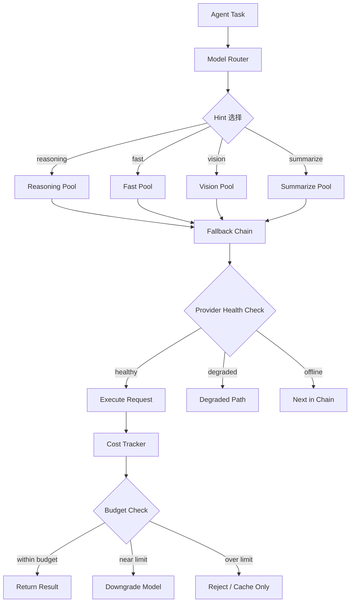

## 前言

当你的 AI Agent 需要在凌晨 3 点处理一条紧急消息，却发现 OpenAI 的 API 正在限流、Anthropic 的端点返回 529、你配置的备选模型也全部超时——这时候，模型策略系统的设计质量直接决定了用户体验是"虽然慢但还是回复了"还是"Agent 罢工了"。

OpenClaw 的模型策略系统是其架构中最复杂的子系统之一。它不仅仅是一个简单的 fallback 列表，而是一个包含 31 级降级链、实时 provider 健康监控、以及智能成本预算管理的完整决策引擎。本文将从设计哲学到实现细节，全面剖析这个系统。

---

## 一、模型策略系统的全景架构



### 1.1 核心设计原则

OpenClaw 的模型策略遵循三个核心原则：

1. **永远可用**：通过多级 fallback 确保任何请求都有响应路径
2. **成本可控**：实时追踪 token 消耗，避免意外账单
3. **智能路由**：根据任务类型自动选择最合适的模型

---

## 二、31 级 Fallback Chain

### 2.1 为什么需要 31 级

31 级听起来很多，但这是经过生产验证的设计。OpenClaw 的 fallback chain 不仅仅覆盖"模型 A 不行就用模型 B"，它还考虑了：

- 同一模型的不同 provider（如 OpenAI 官方 vs Azure OpenAI vs 代理）
- 同一 provider 的不同区域（如 us-east-1 vs eu-west-1）
- 不同的 API 版本（如 v1 vs v1-beta）
- 不同的能力层级（如 GPT-4o → GPT-4o-mini → GPT-3.5-turbo）
- 本地模型作为最终兜底

### 2.2 Fallback Chain 的完整结构

```yaml
model_strategy:
  fallback_chain:
    # Level 1-5: 主力模型（高质量）
    - level: 1
      provider: "openai"
      model: "gpt-4o"
      region: "us-east-1"
      priority: 100
      cost_per_1k_input: 0.0025
      cost_per_1k_output: 0.01
      
    - level: 2
      provider: "openai"
      model: "gpt-4o"
      region: "eu-west-1"
      priority: 95
      
    - level: 3
      provider: "azure"
      model: "gpt-4o"
      deployment: "eastus"
      priority: 90
      
    - level: 4
      provider: "anthropic"
      model: "claude-sonnet-4-20250514"
      priority: 85
      
    - level: 5
      provider: "anthropic"
      model: "claude-sonnet-4-20250514"
      region: "eu"
      priority: 80
    
    # Level 6-10: 高性价比模型
    - level: 6
      provider: "openai"
      model: "gpt-4o-mini"
      priority: 75
      cost_per_1k_input: 0.00015
      cost_per_1k_output: 0.0006
      
    - level: 7
      provider: "anthropic"
      model: "claude-haiku-3-5"
      priority: 70
      
    - level: 8
      provider: "google"
      model: "gemini-2.0-flash"
      priority: 65
      
    # Level 9-15: 代理 / 中间商
    - level: 9
      provider: "openrouter"
      model: "openai/gpt-4o"
      priority: 60
      
    - level: 10
      provider: "together"
      model: "meta-llama/Llama-3.1-70B-Instruct-Turbo"
      priority: 55
      
    # Level 16-25: 开源模型（通过推理服务）
    - level: 16
      provider: "groq"
      model: "llama-3.1-70b"
      priority: 45
      
    - level: 17
      provider: "deepseek"
      model: "deepseek-chat"
      priority: 40
      
    # Level 26-30: 本地模型
    - level: 26
      provider: "ollama"
      model: "llama3.1:8b"
      priority: 20
      
    - level: 27
      provider: "ollama"
      model: "qwen2.5:7b"
      priority: 15
      
    # Level 31: 最终兜底
    - level: 31
      provider: "cache"
      model: "cached_response"
      priority: 0
      action: "return_cached_or_error"
```

### 2.3 Fallback 触发条件

并非所有错误都会触发 fallback。OpenClaw 区分了三类错误：

```typescript
enum ErrorCategory {
  // 可恢复错误：触发 fallback
  RECOVERABLE = 'recoverable',
  
  // 短暂错误：重试当前级别
  TRANSIENT = 'transient',
  
  // 不可恢复错误：直接跳过
  FATAL = 'fatal',
}

const ERROR_CLASSIFICATION: Record<string, ErrorCategory> = {
  // 可恢复
  'rate_limit_exceeded': ErrorCategory.RECOVERABLE,
  'model_overloaded': ErrorCategory.RECOVERABLE,
  'insufficient_quota': ErrorCategory.RECOVERABLE,
  'context_length_exceeded': ErrorCategory.RECOVERABLE,
  
  // 短暂（重试）
  'timeout': ErrorCategory.TRANSIENT,
  'connection_reset': ErrorCategory.TRANSIENT,
  '502_bad_gateway': ErrorCategory.TRANSIENT,
  '529_overloaded': ErrorCategory.TRANSIENT,
  
  // 不可恢复
  'invalid_api_key': ErrorCategory.FATAL,
  'model_not_found': ErrorCategory.FATAL,
  'content_policy_violation': ErrorCategory.FATAL,
};
```

### 2.4 Fallback 执行流程

```typescript
class FallbackChain {
  private chain: FallbackLevel[];
  private healthMonitor: HealthMonitor;
  private costTracker: CostTracker;
  
  async execute(request: ModelRequest): Promise<ModelResponse> {
    const startIndex = this.getStartIndex(request);
    
    for (let i = startIndex; i < this.chain.length; i++) {
      const level = this.chain[i];
      
      // 跳过不健康的 provider
      if (!this.healthMonitor.isAvailable(level.provider, level.model)) {
        continue;
      }
      
      // 检查预算
      const estimatedCost = this.estimateCost(level, request);
      if (!this.costTracker.canAfford(estimatedCost)) {
        continue;
      }
      
      try {
        const response = await this.executeWithRetry(level, request);
        
        // 记录成功
        this.healthMonitor.recordSuccess(level.provider, level.model);
        this.costTracker.recordUsage(level, response.usage);
        
        return response;
        
      } catch (error) {
        const category = this.classifyError(error);
        
        this.healthMonitor.recordFailure(level.provider, level.model, category);
        
        if (category === ErrorCategory.FATAL) {
          // 标记为不健康，继续 fallback
          this.healthMonitor.markOffline(level.provider, level.model);
          continue;
        }
        
        if (category === ErrorCategory.TRANSIENT) {
          // 重试当前级别（最多 3 次）
          const retried = await this.retryWithBackoff(level, request, 3);
          if (retried) return retried;
        }
        
        // 继续 fallback
        continue;
      }
    }
    
    // 所有级别都失败了
    throw new AllFallbacksExhaustedError(request);
  }
  
  private getStartIndex(request: ModelRequest): number {
    // 根据 hint 选择起始级别
    const hint = request.hint || 'default';
    const hintMapping: Record<string, number> = {
      'reasoning': 0,    // 从最高质量开始
      'fast': 5,         // 从高性价比开始
      'vision': 0,       // 需要视觉能力，从头开始
      'summarize': 5,    // 摘要不需要最强模型
      'default': 0,
    };
    return hintMapping[hint] || 0;
  }
}
```

---

## 三、Provider 健康监控

### 3.1 健康状态模型

每个 provider + model 组合维护一个三态健康模型：

```typescript
enum HealthState {
  HEALTHY = 'healthy',     // 正常可用
  DEGRADED = 'degraded',   // 可用但性能下降
  OFFLINE = 'offline',     // 不可用
}

interface ProviderHealth {
  state: HealthState;
  successRate: number;        // 滑动窗口成功率
  avgLatency: number;         // 平均延迟
  p99Latency: number;         // P99 延迟
  consecutiveFailures: number;
  lastSuccess: number;        // 最后成功时间戳
  lastFailure: number;        // 最后失败时间戳
  errorBreakdown: Record<ErrorCategory, number>;
}
```

### 3.2 健康检查机制

OpenClaw 采用被动健康检查（不主动发送探测请求），结合滑动窗口统计：

```typescript
class HealthMonitor {
  private windows: Map<string, SlidingWindow<HealthEvent>>;
  private readonly windowSize = 5 * 60 * 1000; // 5 分钟窗口
  
  recordSuccess(provider: string, model: string): void {
    const key = this.getKey(provider, model);
    const window = this.getWindow(key);
    
    window.add({
      timestamp: Date.now(),
      success: true,
    });
    
    this.updateState(key);
  }
  
  recordFailure(provider: string, model: string, category: ErrorCategory): void {
    const key = this.getKey(provider, model);
    const window = this.getWindow(key);
    
    window.add({
      timestamp: Date.now(),
      success: false,
      category,
    });
    
    this.updateState(key);
  }
  
  private updateState(key: string): void {
    const window = this.getWindow(key);
    const events = window.getEvents();
    
    const successes = events.filter(e => e.success).length;
    const total = events.length;
    const successRate = total > 0 ? successes / total : 1;
    
    const health = this.healthStore.get(key);
    
    // 状态转换逻辑
    if (successRate >= 0.95) {
      health.state = HealthState.HEALTHY;
    } else if (successRate >= 0.7) {
      health.state = HealthState.DEGRADED;
    } else {
      health.state = HealthState.OFFLINE;
    }
    
    // 连续失败计数
    health.consecutiveFailures = this.countConsecutiveFailures(events);
    
    // 自动恢复检查
    if (health.state === HealthState.OFFLINE) {
      this.scheduleRecoveryCheck(key);
    }
  }
}
```

### 3.3 自动恢复机制

当 provider 被标记为 OFFLINE 后，OpenClaw 不会永远跳过它，而是通过渐进式恢复探测：

```typescript
class RecoveryScheduler {
  private recoveryTimers: Map<string, NodeJS.Timeout>;
  
  scheduleRecoveryCheck(key: string): void {
    const health = this.healthStore.get(key);
    
    // 指数退避恢复间隔：30s, 60s, 120s, 300s（上限）
    const backoff = Math.min(
      30000 * Math.pow(2, health.recoveryAttempts),
      300000
    );
    
    this.recoveryTimers.set(key, setTimeout(async () => {
      // 尝试发送一个轻量级请求
      const recovered = await this.probe(key);
      
      if (recovered) {
        health.state = HealthState.DEGRADED; // 先标记为降级
        health.recoveryAttempts = 0;
      } else {
        health.recoveryAttempts++;
        this.scheduleRecoveryCheck(key); // 继续重试
      }
    }, backoff));
  }
  
  private async probe(key: string): Promise<boolean> {
    try {
      const [provider, model] = this.parseKey(key);
      await this.client.complete({
        provider,
        model,
        messages: [{ role: 'user', content: 'ping' }],
        max_tokens: 1,
      });
      return true;
    } catch {
      return false;
    }
  }
}
```

### 3.4 健康状态的可视化

OpenClaw 提供了一个内置的健康状态仪表盘：

```
┌─────────────────────────────────────────────────────┐
│  Provider Health Dashboard                           │
├─────────────────────────────────────────────────────┤
│                                                      │
│  openai/gpt-4o        ████████████████████  98% ✅  │
│  anthropic/claude-sonnet  ██████████████████  95% ✅ │
│  azure/gpt-4o         ████████████████░░░░  82% ⚠️  │
│  google/gemini-flash   ████████████████████  97% ✅  │
│  groq/llama-3.1-70b   ██████████████░░░░░░  72% ⚠️  │
│  ollama/llama3.1:8b   ░░░░░░░░░░░░░░░░░░░░   0% 🔴  │
│                                                      │
│  Active Fallbacks: azure → openrouter → groq         │
│  Last Recovery: groq/llama-3.1-70b (2 min ago)       │
└─────────────────────────────────────────────────────┘
```

---

## 四、成本预算管理

### 4.1 成本追踪模型

```typescript
interface CostBudget {
  // 预算配置
  daily_limit_usd: number;      // 日预算上限
  monthly_limit_usd: number;    // 月预算上限
  per_request_limit_usd: number; // 单次请求上限
  
  // 告警阈值
  warning_threshold: number;     // 80% 时告警
  critical_threshold: number;    // 95% 时切换到廉价模型
  
  // 当前消耗
  daily_spent: number;
  monthly_spent: number;
}

interface UsageRecord {
  timestamp: number;
  provider: string;
  model: string;
  input_tokens: number;
  output_tokens: number;
  cost_usd: number;
  task_hint: string;
}
```

### 4.2 实时成本计算

不同 provider 的计费方式不同，OpenClaw 维护了一个统一的定价表：

```typescript
const PRICING_TABLE: Record<string, ModelPricing> = {
  'openai/gpt-4o': {
    input: 0.0025 / 1000,   // $2.50 / 1M tokens
    output: 0.01 / 1000,    // $10.00 / 1M tokens
    cached_input: 0.00125 / 1000, // 缓存命中半价
  },
  'anthropic/claude-sonnet-4-20250514': {
    input: 0.003 / 1000,
    output: 0.015 / 1000,
    cached_input: 0.0003 / 1000, // 90% 折扣
  },
  'ollama/llama3.1:8b': {
    input: 0,  // 本地模型免费
    output: 0,
    cached_input: 0,
  },
};

class CostTracker {
  private budget: CostBudget;
  private usageLog: UsageRecord[] = [];
  
  estimateCost(level: FallbackLevel, request: ModelRequest): number {
    const pricing = PRICING_TABLE[`${level.provider}/${level.model}`];
    if (!pricing) return 0;
    
    const estimatedInputTokens = this.estimateTokens(request.messages);
    const estimatedOutputTokens = request.max_tokens || 1000;
    
    return (estimatedInputTokens * pricing.input) +
           (estimatedOutputTokens * pricing.output);
  }
  
  canAfford(estimatedCost: number): boolean {
    // 检查单次请求上限
    if (estimatedCost > this.budget.per_request_limit_usd) {
      return false;
    }
    
    // 检查日预算
    if (this.budget.daily_spent + estimatedCost > this.budget.daily_limit_usd) {
      return false;
    }
    
    // 检查月预算
    if (this.budget.monthly_spent + estimatedCost > this.budget.monthly_limit_usd) {
      return false;
    }
    
    return true;
  }
  
  recordUsage(level: FallbackLevel, usage: TokenUsage): void {
    const pricing = PRICING_TABLE[`${level.provider}/${level.model}`];
    const cost = (usage.input_tokens * pricing.input) +
                 (usage.output_tokens * pricing.output);
    
    this.budget.daily_spent += cost;
    this.budget.monthly_spent += cost;
    
    this.usageLog.push({
      timestamp: Date.now(),
      provider: level.provider,
      model: level.model,
      input_tokens: usage.input_tokens,
      output_tokens: usage.output_tokens,
      cost_usd: cost,
      task_hint: usage.task_hint,
    });
    
    // 检查告警阈值
    this.checkAlerts();
  }
  
  private checkAlerts(): void {
    const dailyRatio = this.budget.daily_spent / this.budget.daily_limit_usd;
    
    if (dailyRatio >= this.budget.critical_threshold) {
      this.emit('budget:critical', {
        spent: this.budget.daily_spent,
        limit: this.budget.daily_limit_usd,
        ratio: dailyRatio,
      });
    } else if (dailyRatio >= this.budget.warning_threshold) {
      this.emit('budget:warning', {
        spent: this.budget.daily_spent,
        limit: this.budget.daily_limit_usd,
        ratio: dailyRatio,
      });
    }
  }
}
```

### 4.3 预算告警与自动降级

当预算接近上限时，OpenClaw 会自动将请求路由到更便宜的模型：

```typescript
class BudgetAwareRouter {
  private costTracker: CostTracker;
  private fallbackChain: FallbackChain;
  
  async route(request: ModelRequest): Promise<ModelResponse> {
    const budgetStatus = this.costTracker.getBudgetStatus();
    
    // 根据预算状态调整起始级别
    let startLevel = 0;
    
    if (budgetStatus.ratio >= 0.95) {
      // 紧急模式：只使用免费/极低成本模型
      startLevel = 25; // 本地模型起始
      request.max_tokens = Math.min(request.max_tokens || 1000, 500);
    } else if (budgetStatus.ratio >= 0.8) {
      // 节约模式：跳过昂贵模型
      startLevel = 5; // 高性价比模型起始
    }
    
    return this.fallbackChain.execute(request, startLevel);
  }
}
```

### 4.4 成本报告

OpenClaw 生成每日/每月的成本报告：

```
📊 OpenClaw 成本报告 - 2026-06-02
━━━━━━━━━━━━━━━━━━━━━━━━━━━━━━━━
日预算: $5.00 | 已用: $3.42 (68.4%) | 剩余: $1.58

按模型分布:
  openai/gpt-4o          $1.85  (54%)  ████████████████████
  anthropic/claude-sonnet $0.98  (29%)  ████████████
  openai/gpt-4o-mini     $0.42  (12%)  █████
  groq/llama-3.1-70b     $0.17   (5%)  ██

按任务类型:
  reasoning    $1.52  (44%)
  fast         $0.89  (26%)
  summarize    $0.67  (20%)
  vision       $0.34  (10%)

缓存命中率: 34.2% | 节省: $0.89
━━━━━━━━━━━━━━━━━━━━━━━━━━━━━━━━
```

---

## 五、Hint 驱动的智能路由

### 5.1 Hint 系统

OpenClaw 通过 hint 标签将任务分类，每个 hint 对应一组模型偏好：

```typescript
const HINT_CONFIGS: Record<string, HintConfig> = {
  reasoning: {
    description: '需要深度推理的复杂任务',
    preferredModels: ['gpt-4o', 'claude-sonnet-4-20250514'],
    minCapability: 'high',
    allowFallback: true,
    maxFallbackLevel: 15,
  },
  fast: {
    description: '需要快速响应的简单任务',
    preferredModels: ['gpt-4o-mini', 'claude-haiku-3-5', 'gemini-2.0-flash'],
    minCapability: 'medium',
    allowFallback: true,
    maxFallbackLevel: 20,
    latencyTarget: 2000, // 2 秒内响应
  },
  vision: {
    description: '需要图像理解的任务',
    preferredModels: ['gpt-4o', 'claude-sonnet-4-20250514', 'gemini-2.0-flash'],
    minCapability: 'vision',
    allowFallback: true,
    maxFallbackLevel: 10, // 视觉模型选择较少
  },
  summarize: {
    description: '文本摘要和压缩任务',
    preferredModels: ['gpt-4o-mini', 'claude-haiku-3-5'],
    minCapability: 'medium',
    allowFallback: true,
    maxFallbackLevel: 25,
    costOptimized: true, // 优先选择低成本模型
  },
};
```

### 5.2 自动 Hint 推断

当用户没有显式指定 hint 时，OpenClaw 会根据任务内容自动推断：

```typescript
function inferHint(task: string): string {
  // 复杂推理任务
  if (task.includes('分析') || task.includes('推理') || task.includes('为什么')) {
    return 'reasoning';
  }
  
  // 简单查询
  if (task.length < 100 && !task.includes('?')) {
    return 'fast';
  }
  
  // 摘要任务
  if (task.includes('总结') || task.includes('摘要') || task.includes('概括')) {
    return 'summarize';
  }
  
  return 'default';
}
```

---

## 六、实际部署案例

### 6.1 案例：高峰期的 Fallback 链路

场景：某电商大促期间，AI 客服 Agent 的请求量激增 10 倍。

```
时间线：
14:00 - 正常运行，openai/gpt-4o 处理所有请求
14:15 - 请求量激增，OpenAI 开始返回 429
14:15 - 自动 fallback 到 anthropic/claude-sonnet-4-20250514
14:20 - Anthropic 也开始限流
14:20 - fallback 到 openrouter/openai/gpt-4o（代理）
14:25 - 代理也超载
14:25 - fallback 到 groq/llama-3.1-70b（开源模型）
14:30 - 响应质量略有下降，但服务未中断
15:00 - 负载下降，自动恢复到 anthropic/claude-sonnet-4-20250514
15:30 - OpenAI 恢复，回到主路径
```

### 6.2 案例：成本失控的预防

```
月初预算: $150/月
Day 1-5: 正常消耗 $12.50
Day 6: 突发大量 reasoning 任务，单日消耗 $28.30
  → 触发 warning 阈值（80%）
  → 自动将非 critical 任务路由到 gpt-4o-mini
Day 7-30: 日均消耗 $3.80，月总计 $133.50
  → 在预算内完成
```

---

## 七、与其他系统的对比

| 特性 | OpenClaw | LiteLLM | OpenRouter | 自建方案 |
|------|----------|---------|------------|----------|
| Fallback 级数 | 31 | ~10 | ~5 | 自定义 |
| 健康监控 | ✅ 实时 | ⚠️ 基础 | ❌ | 自建 |
| 成本管理 | ✅ 预算+告警+降级 | ⚠️ 仅追踪 | ⚠️ 仅显示 | 自建 |
| Hint 路由 | ✅ 4 种 | ❌ | ❌ | 自建 |
| 本地模型支持 | ✅ Ollama | ✅ | ❌ | 自建 |
| 自动恢复 | ✅ 渐进式 | ❌ | ❌ | 自建 |

---

## 八、最佳实践

### 8.1 Fallback Chain 配置建议

- 至少配置 3 个不同 provider 的模型
- 每个层级之间有明显的价格梯度
- 本地模型作为最后防线
- 定期审查和更新定价表

### 8.2 健康监控调优

- 滑动窗口大小：5 分钟（太短容易误判，太长反应慢）
- 降级阈值：成功率 < 95%
- 恢复探测间隔：30 秒起，指数退避到 5 分钟

### 8.3 成本管理建议

- 设置日预算为月预算的 1/20（留出余量）
- warning 阈值设为 80%，critical 设为 95%
- 对 reasoning 任务设置更高的单次预算
- 启用 prompt cache 以降低重复请求成本

---

## 九、总结

OpenClaw 的模型策略系统是一个在生产环境中经过充分验证的设计。它的 31 级 fallback chain 确保了"永远可用"，provider 健康监控实现了"智能选择"，成本预算管理保证了"财务可控"。三者协同工作，让 AI Agent 在各种异常情况下都能优雅降级，而不是直接罢工。

关键设计原则：

1. **多级防御**：31 级 fallback 覆盖从商业 API 到本地模型的全谱系
2. **被动健康检查**：不额外消耗资源，基于实际请求结果判断
3. **预算感知路由**：在成本和质量之间动态平衡
4. **渐进式恢复**：避免"恢复风暴"，稳定后再切回高质量模型

---

## 参考资料

- [OpenClaw 模型策略文档](https://github.com/nousresearch/openclaw/blob/main/docs/model-strategy.md)
- [LiteLLM - LLM Gateway](https://github.com/BerriAI/litellm)
- [OpenRouter API](https://openrouter.ai/docs)
- [AWS Well-Architected - Reliability Pillar](https://docs.aws.amazon.com/wellarchitected/latest/reliability-pillar/)

## 相关阅读

- [OpenClaw 模型策略实战：多模型路由与成本优化](/categories/架构/OpenClaw-模型策略实战-多模型路由与成本优化/)
- [三大框架模型路由对比：Hermes ProviderProfile vs OpenClaw Fallback Chain vs OpenHuman Hint Router](/categories/架构/三大框架模型路由对比-Hermes-ProviderProfile-vs-OpenClaw-Fallback-Chain-vs-OpenHuman-Hint-Router/)
- [Hermes ProviderProfile 架构深度剖析：模型提供者的声明式注册与运行时钩子机制](/categories/架构/Hermes-ProviderProfile-架构深度剖析-模型提供者的声明式注册与运行时钩子机制/)
