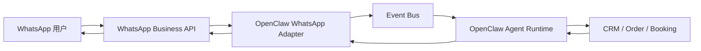
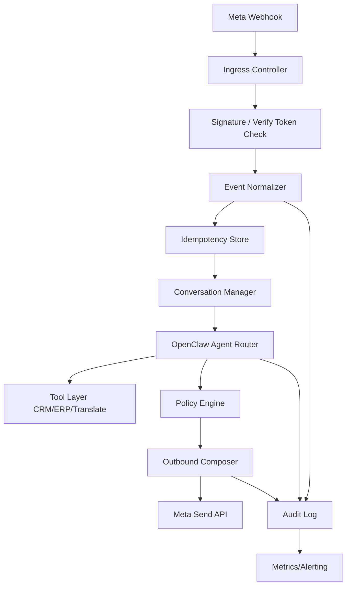
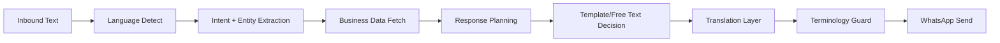

---

title: OpenClaw + WhatsApp 实战：跨平台消息集成与自动化
keywords: [OpenClaw, WhatsApp, 跨平台消息集成与自动化]
date: 2026-06-02 09:00:00
description: 本文围绕 OpenClaw 与 WhatsApp Business API 的生产级集成展开，系统梳理 Cloud API 接入选择、Webhook 设计、消息幂等、24 小时会话窗口、模板消息、多语言支持、自动化工作流与监控治理等关键环节，并结合跨平台消息架构、AI Agent 编排、企业通知与客服自动化场景，给出可落地的适配器设计思路、配置示例与实战经验。
tags:
- OpenClaw
- AI Agent
- WhatsApp
- 跨平台
- 自动化
categories:
- architecture
cover: https://images.unsplash.com/photo-1486406146926-c627a92ad1ab?w=1200&h=630&fit=crop
images:
  - https://images.unsplash.com/photo-1486406146926-c627a92ad1ab?w=1200&h=630&fit=crop
---


# OpenClaw + WhatsApp 实战：跨平台消息集成与自动化

## 1. 引言：WhatsApp 在全球通讯中的地位与 AI Agent 的结合

在全球即时通讯生态中，WhatsApp 早已不是单纯的“聊天软件”，而是很多企业触达客户、完成服务闭环、构建自动化业务链路的重要基础设施。对于跨境电商、国际物流、SaaS 服务、海外教育、出海金融以及区域化本地生活平台来说，WhatsApp 的价值远超“发消息”本身：它连接的是用户的高频入口、信任场景与即时反馈通道。用户在邮件中可能几小时才回复一次，在 App Push 中可能直接关闭通知，但在 WhatsApp 中，消息被看到、被回应、被继续追问的概率通常更高。

AI Agent 的兴起，则让这种高频通讯渠道具备了“可编排、可自动决策、可跨系统协同”的能力。过去，企业在 WhatsApp 上做客服、通知、营销，多数仍停留在模板化问答、人工转接或规则式机器人阶段。现在，当一个面向业务流程的 Agent 具备上下文记忆、工具调用、工作流编排、知识库检索和多语言输出能力时，WhatsApp 就不再只是消息终端，而是一个可执行业务动作的统一入口。

OpenClaw 这类 AI Agent 框架的意义，恰恰在于把模型能力从“对话”推进到“动作执行”。它不只负责生成回答，还能把用户消息转换成标准事件，分发到订单系统、CRM、翻译服务、预约平台、监控平台和内部消息总线中。WhatsApp 作为外部触点，OpenClaw 作为中枢代理，两者结合后，企业可以形成一条相对完整的链路：接收用户消息 → 识别意图 → 查询业务系统 → 生成合规回复 → 触发后续工作流 → 记录日志与审计。

一个典型场景是跨境电商售后。用户通过 WhatsApp 发来消息：“我的包裹还没收到，请帮我看看。” 如果没有 Agent，人工客服需要登录后台、按手机号或订单号检索、查询物流状态、组织语言回复。如果 OpenClaw 接入了 WhatsApp 适配器，它可以先识别用户身份，再调用订单系统 API 和物流查询接口，最后用用户语言返回状态，并在必要时自动创建工单。这种体验从“客服回复”升级成“系统即时协同”。

再比如海外医疗预约或教育咨询。用户可能以西班牙语、英语、阿拉伯语发来问题，AI Agent 不仅能自动翻译，还能根据业务政策控制会话窗口、判断是否需要使用模板消息、识别用户是否进入人工客服队列，甚至在对方沉默 6 小时后自动触发提醒。OpenClaw 的优势在于，它既可以承担渠道适配层的职责，又可以作为多系统之间的协议转换层与策略执行层。

从架构视角看，WhatsApp 集成并不难，难的是把它做成一套稳定、可审计、可扩展、可跨平台复用的消息能力。你不能只写一个 webhook 就结束，因为真实业务会遇到：

- 入站消息幂等处理
- 24 小时会话窗口限制
- 模板审批与多语言版本管理
- 媒体下载与安全校验
- 用户身份映射与隐私脱敏
- 人工坐席与 AI 的切换
- 广播、群发、营销与合规边界
- 监控告警与 SLA 保障

因此，本文不会停留在 API 文档转述层面，而是以 OpenClaw 为中心，完整讲解 WhatsApp Business API 的接入选择、适配器架构设计、Webhook 配置、消息类型处理、会话管理、多语言支持、自动化工作流以及与微信/Discord 的横向对比。目标不是“能跑一个 Demo”，而是帮助你搭建一套真正适合生产环境的跨平台消息自动化方案。

下面先看接入方式的选择，因为这个决策会直接影响后续所有架构细节、成本结构、合规责任和维护复杂度。

### 引言阶段的最小消息流示例



### OpenClaw 渠道声明示例

```yaml
channels:
  whatsapp:
    enabled: true
    provider: meta-cloud-api
    phone_number_id: ${WA_PHONE_NUMBER_ID}
    business_account_id: ${WA_BUSINESS_ACCOUNT_ID}
    verify_token: ${WA_VERIFY_TOKEN}
    access_token: ${WA_ACCESS_TOKEN}
    webhook_path: /webhooks/whatsapp/meta
    inbound_queue: mq.whatsapp.inbound
    outbound_queue: mq.whatsapp.outbound
```

### 场景示例：订单追踪

用户发来消息：

> Hi, where is my order #A10293?

OpenClaw 的处理动作：

1. 识别渠道为 WhatsApp。
2. 解析语言为英文。
3. 从消息中抽取订单号 A10293。
4. 调用订单与物流系统。
5. 返回物流状态与下一步动作建议。
6. 记录本次对话上下文，便于后续继续跟进。

这类“消息即任务”的设计，正是 AI Agent 与传统 IM Bot 最大的区别。

---

## 2. WhatsApp Business API 接入方案对比（Cloud API vs 第三方桥接）

在真正开始开发前，必须先解决一个关键问题：到底通过哪种方式接入 WhatsApp？目前主流方案可以归纳为两类：

1. **Meta 官方 Cloud API**
2. **第三方桥接方案**，包括 BSP（Business Solution Provider）封装平台，以及某些基于网页协议或非官方协议的桥接服务

看似它们都能“发消息、收消息”，但从可靠性、合规性、成本、控制力和扩展性来看，差别非常大。

### 2.1 Cloud API 的特点

Meta Cloud API 是官方提供的托管式接口。企业无需自己维护复杂的 WhatsApp On-Premises 基础设施，也不需要处理底层协议，只需通过 HTTPS API 与 Webhook 就能完成消息收发。对于多数希望快速落地、重视合规的团队，Cloud API 是第一选择。

它的优点主要体现在：

- 官方支持，合规路径明确
- 接口标准化程度高，文档相对完整
- Webhook 事件模型稳定
- 适合与 OpenClaw 这种事件驱动中台对接
- 无需维护底层连接状态和会话设备
- 易于支持模板消息、媒体消息、状态回执等能力

但 Cloud API 也有约束：

- 必须走 Meta 的 Business 验证与资产管理流程
- 24 小时会话窗口和模板消息政策严格
- 某些高级营销动作受到更严格监管
- 号码、模板、质量评分、发送配额受平台政策影响

### 2.2 第三方桥接的特点

第三方桥接又分两种：

- **正规 BSP 平台**：在官方合规框架下提供封装能力，可能附带控制台、模板管理、报表、工单整合等功能。
- **非官方桥接服务**：通过 Web/扫码或私有协议模拟用户端登录，以“更低门槛”提供收发能力。

正规 BSP 的价值在于降低接入复杂度，比如省去部分后台配置、提供现成的可视化面板、统一多渠道路由、封装短信/邮件/WhatsApp 为统一 API。对中小团队来说，这在早期很有吸引力。

但如果你的目标是构建以 OpenClaw 为核心的统一 Agent 平台，第三方封装过深往往会带来问题：

- 事件模型被平台重新定义，不再与 Meta 原生结构一致
- 能力升级受限于供应商迭代速度
- 回执、模板状态、媒体下载 URL 等字段可能被裁剪
- 厂商迁移成本高
- 出问题时排障链路更长

非官方桥接则风险更高。虽然它可能实现“扫码即用”，甚至支持群组、个人号、某些官方 API 未开放的能力，但其核心问题包括：

- 违反平台政策，存在封号风险
- 稳定性受网页版协议变化影响
- 无法保证审计与合规
- 不适合生产级客户服务与交易通知场景

### 2.3 如何为 OpenClaw 选择接入模式

如果你计划把 WhatsApp 纳入一个统一 Agent 平台，并长期维护，那么建议策略通常是：

- **生产主通道：Meta Cloud API**
- **早期 PoC 或本地验证：可临时使用第三方正规 BSP 沙箱**
- **避免把生产链路建立在非官方桥接之上**

OpenClaw 强调适配器模式，因此在架构上可以把 provider 抽象出来，让同一套 Agent Runtime 支持多种底层提供商，但默认面向 Cloud API 设计数据模型。这样做的好处是：

- 内部事件标准不依赖某一家供应商
- 将来切换 BSP 或回归官方 API 时，变更只集中在 adapter 层
- 上层工作流、审计、Agent 工具调用逻辑无需重写

### 2.4 方案对比表

| 维度 | Meta Cloud API | 正规 BSP | 非官方桥接 |
|---|---|---|---|
| 合规性 | 高 | 中高 | 低 |
| 控制力 | 高 | 中 | 低 |
| 接口标准 | 官方标准 | 厂商封装 | 不稳定 |
| 运维复杂度 | 中 | 低 | 表面低，实际高 |
| 封号风险 | 低 | 低到中 | 高 |
| 迁移成本 | 低 | 中高 | 高 |
| 适合生产客服 | 是 | 是 | 不建议 |
| 适合 OpenClaw 长期集成 | 是 | 可选 | 不建议 |

### 2.5 OpenClaw 的 provider 抽象示例

```ts
export interface WhatsAppProvider {
  verifyWebhook(query: Record<string, string>): { ok: boolean; challenge?: string };
  parseInboundEvent(payload: unknown): NormalizedInboundEvent[];
  sendTextMessage(req: SendTextRequest): Promise<ProviderSendResult>;
  sendTemplateMessage(req: SendTemplateRequest): Promise<ProviderSendResult>;
  fetchMedia(mediaId: string): Promise<MediaFetchResult>;
  markAsRead(messageId: string): Promise<void>;
}

export class MetaCloudProvider implements WhatsAppProvider {
  // 官方 Cloud API 实现
}

export class BspWrappedProvider implements WhatsAppProvider {
  // 对第三方 BSP 的适配实现
}
```

### 2.6 配置片段：多 provider 切换

```yaml
whatsapp:
  provider: meta-cloud-api
  providers:
    meta-cloud-api:
      base_url: https://graph.facebook.com/v23.0
      access_token: ${WA_ACCESS_TOKEN}
      phone_number_id: ${WA_PHONE_NUMBER_ID}
    bsp-demo:
      base_url: https://api.vendor.example.com/whatsapp
      api_key: ${BSP_API_KEY}
      account_id: ${BSP_ACCOUNT_ID}
  fallback_order:
    - meta-cloud-api
    - bsp-demo
```

### 2.7 场景说明：为什么不要把业务逻辑绑死在供应商字段上

假设某 BSP 将 Meta 的 `interactive.button_reply.id` 改造成了自定义字段 `payload.actionCode`，上层工作流如果直接依赖 `actionCode`，未来切换到 Cloud API 时就必须重写解析逻辑。如果在适配层统一转换成内部标准事件，比如 `intent.button_id`，那么上层 Agent 根本不需要关心底层消息是从哪里来的。

这是 OpenClaw 集成渠道时最重要的工程原则之一：**把不稳定的外部接口隔离在边界，把稳定的内部事件沉淀成平台能力。**

---

## 3. OpenClaw WhatsApp 适配器架构设计

决定使用 Cloud API 之后，下一步就是把 WhatsApp 接入 OpenClaw 的总体架构。一个成熟的适配器绝不只是“收到 webhook 就调用模型，生成结果再发回去”这么简单。为了支撑真实业务，至少要覆盖如下模块：

- Webhook 接入层
- 事件标准化与幂等层
- 用户身份与会话上下文层
- Agent 路由与工具调用层
- 出站消息编排层
- 合规模板策略层
- 媒体存储与下载代理层
- 监控、日志、告警与审计层

### 3.1 分层架构

推荐采用以下分层方式：



这里最容易被忽视的是 **Event Normalizer** 和 **Conversation Manager**。前者负责把 Meta 的原生 webhook 结构转换成 OpenClaw 可复用的内部事件模型；后者负责跟踪会话窗口、用户画像、语言偏好、最近操作和转人工状态。

### 3.2 内部标准事件模型

建议为所有渠道定义统一的标准事件，例如：

```json
{
  "event_id": "wa_msg_01JX8ABCD",
  "channel": "whatsapp",
  "provider": "meta-cloud-api",
  "direction": "inbound",
  "tenant_id": "acme-global",
  "user": {
    "channel_user_id": "15551230001",
    "profile_name": "Maria Gomez",
    "locale": "es-ES"
  },
  "message": {
    "message_id": "wamid.HBgL...",
    "type": "text",
    "text": "Necesito cambiar mi cita"
  },
  "conversation": {
    "session_key": "wa:15551230001",
    "within_customer_care_window": true,
    "last_inbound_at": "2026-06-02T08:30:10Z"
  },
  "received_at": "2026-06-02T08:30:11Z"
}
```

这个结构看起来普通，但它决定了 OpenClaw 上层工作流能否真正跨渠道复用。如果未来同一套 Agent 还要接入微信、Discord、Telegram、邮件，标准事件模型将成为最核心的“公共语言”。

### 3.3 幂等与去重策略

Webhook 系统最常见的问题之一是重复投递。若没有幂等机制，就可能出现：

- 同一条客户消息被处理两次
- 同一张订单被重复创建工单
- 同一提醒被重复发送

因此必须基于消息 ID 做幂等控制。Meta webhook 通常会带唯一 message id，可以作为主键写入 Redis 或数据库。

```ts
async function handleInbound(event: NormalizedInboundEvent) {
  const key = `idem:${event.provider}:${event.message.message_id}`;
  const exists = await redis.get(key);
  if (exists) {
    logger.info({ key }, 'duplicate inbound event ignored');
    return;
  }

  await redis.set(key, '1', { EX: 86400 });
  await eventBus.publish('whatsapp.inbound.normalized', event);
}
```

### 3.4 会话上下文设计

OpenClaw 在接入消息渠道时，不能只记录“这条消息内容是什么”，还要记录“这条消息处于什么业务上下文里”。比如：

- 用户最近是否刚下单
- 当前语言偏好是什么
- 是否处于人工接管状态
- 24 小时会话窗口是否还有效
- 是否正在进行表单收集流程
- 是否命中过敏感词策略或高风险意图

推荐的会话存储结构如下：

```yaml
conversation:
  session_key: wa:15551230001
  tenant_id: acme-global
  locale: es-ES
  status: active
  within_customer_care_window: true
  agent_mode: ai_first
  human_handoff: false
  last_inbound_at: 2026-06-02T08:30:10Z
  last_outbound_at: 2026-06-02T08:30:12Z
  active_workflow: booking_reschedule
  slots:
    booking_id: BK-20931
    preferred_date: 2026-06-03
```

### 3.5 出站消息编排器

OpenClaw 的出站层最好不是简单的 `sendMessage(text)`，而是一个具备策略能力的编排器。它应负责：

- 判断当前消息能否作为自由文本发送
- 如果超过 24 小时窗口，则自动切换模板消息
- 对长文本做拆分或摘要
- 对不同语言选择对应模板版本
- 添加审计标签和业务关联 ID

```ts
async function dispatchReply(ctx: ReplyContext) {
  const canFreeReply = ctx.conversation.within_customer_care_window;

  if (canFreeReply && ctx.reply.type === 'text') {
    return provider.sendTextMessage({
      to: ctx.user.channel_user_id,
      text: ctx.reply.text,
      contextMessageId: ctx.reply.replyTo
    });
  }

  return provider.sendTemplateMessage({
    to: ctx.user.channel_user_id,
    templateName: 'followup_notification',
    language: ctx.user.locale || 'en_US',
    parameters: ctx.reply.templateParams
  });
}
```

### 3.6 场景说明：人工接管与 AI 协同

假设一个高价值客户发起退款争议，系统检测到情绪激烈或存在支付争议关键字。此时 OpenClaw 不应继续以自动回复强行推进，而应：

1. 在 conversation 中标记 `human_handoff=true`
2. 把最近 20 条消息摘要发送给人工客服系统
3. 在 WhatsApp 内回复“已为您转接专员”
4. 在人工完成前禁止 AI 自动回复

这一能力必须由 Conversation Manager 和 Policy Engine 共同完成，而不是散落在 webhook 控制器里。

### 3.7 配置片段：适配器模块化

```yaml
adapter:
  whatsapp:
    ingress:
      verify_token_env: WA_VERIFY_TOKEN
      accept_status_events: true
    normalization:
      profile_name_fallback: unknown
      infer_locale_from_text: true
    idempotency:
      backend: redis
      ttl_seconds: 86400
    conversation:
      store: postgres
      session_ttl_hours: 72
    policy:
      enforce_24h_window: true
      auto_handoff_on_sentiment_score_below: -0.75
    outbound:
      split_long_text_at: 1200
      default_template_language: en_US
```

通过这样的分层设计，OpenClaw 的 WhatsApp 适配器就不是一个“渠道小插件”，而是一个真正能承载业务流程的消息网关。

---

## 4. 实战：注册 WhatsApp Business 账号与 Webhook 配置

架构讲完后，进入落地阶段。要让 OpenClaw 真正接收和发送 WhatsApp 消息，你需要完成一组比较琐碎但非常关键的准备工作。很多团队失败并不是因为代码写得不好，而是卡在资产配置、权限分配、Webhook 验证或环境隔离上。

### 4.1 基础准备清单

至少需要以下资源：

- Meta Business Manager 账号
- 已创建或可用的 WhatsApp Business Account（WABA）
- 可用手机号，且未被普通 WhatsApp 个人使用冲突占用
- Meta App（用于接入 Cloud API）
- System User 或长期有效 Token 管理方案
- 可公网访问的 HTTPS Webhook 地址
- OpenClaw 服务实例与持久化存储（Redis / PostgreSQL 等）

### 4.2 推荐的环境划分

不要把测试和生产共用同一套号码、模板和 Token。推荐最少两套环境：

```yaml
environments:
  staging:
    webhook_url: https://staging-agent.example.com/webhooks/whatsapp/meta
    business_account_id: ${STAGING_WABA_ID}
    phone_number_id: ${STAGING_PHONE_NUMBER_ID}
  production:
    webhook_url: https://agent.example.com/webhooks/whatsapp/meta
    business_account_id: ${PROD_WABA_ID}
    phone_number_id: ${PROD_PHONE_NUMBER_ID}
```

这样做的理由非常实际：

- 测试模板不会污染生产报表
- staging 可以安全调试 webhook 和多语言模板
- 生产故障时，排障不会影响开发验证

### 4.3 Webhook 验证实现

Meta 在配置 webhook 时，会向你的地址发送一个带 `hub.mode`、`hub.verify_token`、`hub.challenge` 的 GET 请求。你的服务必须返回 challenge 字符串，且 verify token 匹配。

下面是一个 Node.js/TypeScript 风格的最小实现：

```ts
import express from 'express';

const app = express();
const VERIFY_TOKEN = process.env.WA_VERIFY_TOKEN!;

app.get('/webhooks/whatsapp/meta', (req, res) => {
  const mode = req.query['hub.mode'];
  const token = req.query['hub.verify_token'];
  const challenge = req.query['hub.challenge'];

  if (mode === 'subscribe' && token === VERIFY_TOKEN) {
    return res.status(200).send(challenge);
  }

  return res.status(403).json({ error: 'verification_failed' });
});
```

### 4.4 入站消息接收接口

Meta 会将消息事件 POST 到 webhook。通常建议：

- 尽快返回 200，避免超时重试
- 将原始 payload 写入审计日志
- 做基本校验后异步投递到队列
- 不要在 webhook 控制器里直接跑完整 Agent 推理流程

```ts
app.post('/webhooks/whatsapp/meta', express.json(), async (req, res) => {
  const payload = req.body;
  await auditLog.write({
    channel: 'whatsapp',
    provider: 'meta-cloud-api',
    payload,
    receivedAt: new Date().toISOString()
  });

  await queue.publish('raw.whatsapp.webhook', payload);
  return res.status(200).json({ ok: true });
});
```

### 4.5 OpenClaw 中的 webhook 路由配置

```yaml
server:
  routes:
    - path: /webhooks/whatsapp/meta
      method: GET
      handler: whatsapp.verify
    - path: /webhooks/whatsapp/meta
      method: POST
      handler: whatsapp.ingest

workers:
  - name: whatsapp-normalizer
    consumes: [raw.whatsapp.webhook]
    handler: workers.whatsapp.normalize
  - name: whatsapp-agent-dispatcher
    consumes: [whatsapp.inbound.normalized]
    handler: workers.whatsapp.dispatch_to_agent
```

### 4.6 Token 管理与安全

最常见的错误之一，是把访问令牌直接写死在代码或配置仓库中。正确做法应该是：

- 使用环境变量或 Secret Manager
- 为不同环境配置不同 token
- 定期轮换长期 token
- 在日志中脱敏显示 token
- 出站请求失败时不要把完整 Authorization 输出到异常堆栈

```ts
const client = new WhatsAppClient({
  baseUrl: process.env.WA_BASE_URL!,
  accessToken: secrets.get('WA_ACCESS_TOKEN')
});
```

### 4.7 本地联调建议

本地开发时，最大问题不是代码，而是 webhook 无法被公网访问。常见方案包括：

- 使用 ngrok / Cloudflare Tunnel 暴露本地服务
- 在 staging 上部署一个轻量接收层
- 通过重放 webhook payload 做离线调试

为了提升调试效率，建议把 webhook 原始 payload 保存成 fixtures：

```json
{
  "object": "whatsapp_business_account",
  "entry": [
    {
      "id": "1234567890",
      "changes": [
        {
          "field": "messages",
          "value": {
            "messages": [
              {
                "from": "15551230001",
                "id": "wamid.HBgL...",
                "timestamp": "1717312200",
                "text": { "body": "Hello" },
                "type": "text"
              }
            ]
          }
        }
      ]
    }
  ]
}
```

然后通过测试脚本重放：

```bash
curl -X POST http://localhost:3000/webhooks/whatsapp/meta \
  -H 'Content-Type: application/json' \
  --data @fixtures/wa_inbound_text.json
```

### 4.8 场景说明：Webhook 看似通了，为什么还收不到业务消息？

很多团队完成 webhook 验证后，会误以为接入已经完成。但实际上，常见遗漏包括：

- 没有在 App Dashboard 中订阅对应字段（如 messages）
- 用了错误的 phone number id 发消息
- 测试号码不在允许范围内
- 没有正确授权系统用户访问 WABA 资产
- webhook 收到的是 status 回执，但代码只处理了 messages

因此在实战中，建议在日志中明确区分：

- 验证请求日志
- 消息入站日志
- 状态回执日志
- 模板状态变更日志

这能极大减少排障时间。

---

## 5. 消息类型处理：文本、模板、媒体、位置、联系人

真实业务中的 WhatsApp 消息绝不只有纯文本。如果你的 OpenClaw 适配器只支持 text，那么在用户发送图片、PDF、定位、联系人名片时，就会出现“模型看不懂、流程接不上、日志不完整”的问题。因此在标准化层必须为多种消息类型提供统一解析机制。

### 5.1 文本消息

文本是最基础也最常见的类型，处理重点在于：

- 正确抽取 `text.body`
- 做语言检测与编码清洗
- 识别订单号、手机号、预约编号等结构化信息
- 对超长文本进行摘要或分段处理

```ts
function parseTextMessage(msg: any) {
  return {
    type: 'text',
    text: msg.text?.body ?? '',
    entities: entityExtractor.extract(msg.text?.body ?? '')
  };
}
```

### 5.2 模板消息

模板消息通常用于主动通知或超出 24 小时窗口后的联系。OpenClaw 不仅要能发送模板，还要知道某条出站消息属于哪一个业务动作，例如“付款提醒”“预约确认”“售后跟进”。

```ts
await provider.sendTemplateMessage({
  to: '15551230001',
  templateName: 'appointment_reminder',
  language: 'en_US',
  parameters: [
    { type: 'text', text: 'Maria' },
    { type: 'text', text: '2026-06-03 15:00' }
  ]
});
```

对应配置：

```yaml
templates:
  appointment_reminder:
    category: utility
    languages: [en_US, es_ES, pt_BR]
    variables:
      - customer_name
      - appointment_time
```

### 5.3 媒体消息

媒体包括图片、音频、视频、文档等。处理媒体时需要注意：

- 入站 webhook 往往只给 media id，而不是文件本身
- 需要二次调用 API 获取下载 URL
- 下载后应写入对象存储，而不是长期缓存本地磁盘
- 必须做 MIME 类型校验与文件大小限制

```ts
async function handleMediaMessage(msg: any) {
  const mediaId = msg[msg.type]?.id;
  const media = await provider.fetchMedia(mediaId);
  const stored = await objectStorage.put({
    key: `whatsapp/${mediaId}`,
    body: media.stream,
    contentType: media.mimeType
  });

  return {
    type: msg.type,
    media_id: mediaId,
    url: stored.url,
    sha256: media.sha256,
    mime_type: media.mimeType
  };
}
```

### 5.4 位置消息

位置消息在配送、上门服务、门店导航等场景特别有价值。OpenClaw 可以把它直接转化成结构化坐标，供后续工具链调用。

```json
{
  "type": "location",
  "location": {
    "latitude": 31.2304,
    "longitude": 121.4737,
    "name": "Shanghai Bund",
    "address": "Zhongshan East 1st Rd"
  }
}
```

处理逻辑：

```ts
function parseLocationMessage(msg: any) {
  return {
    type: 'location',
    coordinates: {
      lat: msg.location.latitude,
      lng: msg.location.longitude
    },
    label: msg.location.name,
    address: msg.location.address
  };
}
```

### 5.5 联系人消息

用户有时会转发联系人名片，例如推荐另一个联系人咨询业务，或者提交紧急联系人信息。这类消息适合直接标准化后进入 CRM。

```ts
function parseContactMessage(msg: any) {
  return {
    type: 'contact',
    contacts: (msg.contacts || []).map((c: any) => ({
      formatted_name: c.name?.formatted_name,
      phones: c.phones || [],
      emails: c.emails || []
    }))
  };
}
```

### 5.6 统一消息解析器

```ts
async function normalizeMessage(msg: any) {
  switch (msg.type) {
    case 'text':
      return parseTextMessage(msg);
    case 'image':
    case 'audio':
    case 'video':
    case 'document':
      return handleMediaMessage(msg);
    case 'location':
      return parseLocationMessage(msg);
    case 'contacts':
      return parseContactMessage(msg);
    default:
      return { type: 'unsupported', raw_type: msg.type };
  }
}
```

### 5.7 场景说明：物流签收纠纷处理

某跨境物流客户通过 WhatsApp 发来一张包裹照片和当前位置，表示“快递员说已送达，但我没收到”。这时 OpenClaw 可以：

1. 识别文本中的投诉意图。
2. 下载并存储图片。
3. 将位置转为地理坐标。
4. 调用物流系统确认投递记录。
5. 自动创建“签收异常工单”。
6. 返回模板化但个性化的后续处理说明。

如果没有对媒体和位置做标准化，整个流程就会中断在“收到了一张图”这一层面，无法进入真正业务处理。

### 5.8 配置片段：消息类型策略

```yaml
message_handling:
  text:
    max_length: 4000
    auto_detect_language: true
  media:
    allowed_mime_types:
      - image/jpeg
      - image/png
      - application/pdf
    max_size_mb: 15
    object_storage_prefix: whatsapp-media/
  location:
    enable_reverse_geocoding: true
  contacts:
    sync_to_crm: true
    require_user_consent: true
```

---

## 6. 会话窗口管理（24 小时规则）与模板消息

WhatsApp Business API 的运营难点之一，是其消息策略并非完全自由。尤其是在官方通道下，企业与用户之间的消息交互受到会话窗口约束。理解并正确实现 24 小时规则，是避免发送失败、策略违规和客户体验断裂的关键。

### 6.1 什么是 24 小时客户服务窗口

当用户给企业发来消息后，企业通常会获得一个客户服务窗口。在这个窗口内，企业可以发送自由格式的服务消息，而不必依赖模板。一旦超过窗口，再想主动联系用户，就必须使用已审核通过的模板消息。

对 OpenClaw 来说，这意味着“生成了回复”不代表“能直接发送”。你需要在出站前做策略判断。

### 6.2 窗口状态计算

建议在会话管理层持久化以下字段：

- `last_inbound_at`
- `last_outbound_at`
- `within_customer_care_window`
- `last_template_sent_at`
- `open_conversation_category`

```ts
function isWithinWindow(lastInboundAt?: string): boolean {
  if (!lastInboundAt) return false;
  const diffMs = Date.now() - new Date(lastInboundAt).getTime();
  return diffMs <= 24 * 60 * 60 * 1000;
}
```

### 6.3 出站策略决策

```ts
async function sendBusinessReply(ctx: ReplyContext) {
  const withinWindow = isWithinWindow(ctx.conversation.last_inbound_at);

  if (withinWindow) {
    return provider.sendTextMessage({
      to: ctx.user.channel_user_id,
      text: ctx.content
    });
  }

  const template = templateRegistry.resolve({
    intent: ctx.intent,
    locale: ctx.user.locale || 'en_US'
  });

  return provider.sendTemplateMessage({
    to: ctx.user.channel_user_id,
    templateName: template.name,
    language: template.language,
    parameters: template.buildParams(ctx)
  });
}
```

### 6.4 模板设计原则

很多团队把模板消息仅仅当作“系统限制下的被动方案”，这会导致模板写得生硬、转化率低。实际上，高质量模板应该满足：

- 业务动作明确：订单确认、发货提醒、预约取消、支付失败、售后回访
- 变量可控：不要让参数过多导致难以维护
- 语言自然：不同地区用户习惯不同
- 合规克制：避免过度营销话术
- 可回收：模板可被多个工作流复用

示例模板配置：

```yaml
templates:
  order_shipped:
    category: utility
    languages:
      en_US:
        body: "Hi {{1}}, your order {{2}} has been shipped. Track it here: {{3}}"
      es_ES:
        body: "Hola {{1}}, tu pedido {{2}} ya fue enviado. Puedes rastrearlo aquí: {{3}}"
      zh_CN:
        body: "您好 {{1}}，您的订单 {{2}} 已发货，可通过此链接查看物流：{{3}}"
```

### 6.5 场景说明：售后跟进消息为什么发不出去

典型情况：客户昨天咨询了退款问题，今天客服希望继续主动催补材料。如果客户在过去 24 小时内没有新的入站消息，那么自由文本会失败，系统必须切换到模板。很多业务团队会误解为“API 挂了”，其实是会话策略触发了限制。

因此，OpenClaw 在出站失败时，应该把失败原因明确记录为“window_expired_requires_template”，而不是笼统写成“send failed”。

### 6.6 模板回退与多版本管理

如果某语言模板尚未审核通过，系统可以选择：

1. 回退到英语模板
2. 改走邮件/SMS/站内消息
3. 暂缓发送并进入人工队列

```ts
function resolveTemplate(locale: string, intent: string) {
  const exact = registry.get(`${intent}:${locale}`);
  if (exact?.approved) return exact;

  const fallback = registry.get(`${intent}:en_US`);
  if (fallback?.approved) return fallback;

  throw new Error(`no approved template for intent=${intent} locale=${locale}`);
}
```

### 6.7 配置片段：会话与模板策略

```yaml
policy:
  conversation_window_hours: 24
  on_window_expired:
    prefer_template: true
    fallback_channels: [email, sms]
  templates:
    strict_approval_check: true
    locale_fallback_order: [user_locale, en_US]
    intent_mapping:
      payment_failed: billing_payment_failed
      appointment_reminder: appointment_reminder
      cs_followup: service_followup
```

将这一层做好后，OpenClaw 的 WhatsApp 自动化才不会停留在“消息偶尔能发”，而是具备稳定、可预测、可解释的业务发送能力。

---

## 7. 多语言支持与自动翻译集成

WhatsApp 的全球属性决定了多语言能力不是锦上添花，而是基础要求。尤其在出海业务中，你几乎无法假设所有用户都用英语。真正可用的 OpenClaw 集成，必须处理多语言识别、回复生成、模板版本选择和翻译审校之间的平衡。

### 7.1 多语言链路的核心问题

一个多语言 WhatsApp Agent 通常会遇到四类问题：

- 用户输入语言不固定，甚至多语言混输
- 业务系统内部字段是英文或中文，但对外需输出西语/葡语/阿语等
- 模板审批要求按语言分别管理
- 自动翻译可能破坏业务术语准确性

因此不能简单地“检测语言 -> 全文机翻 -> 回复”。更合理的做法是构建分层语言策略。

### 7.2 推荐语言处理流程



其中 `Terminology Guard` 非常重要，它用于保护品牌名、产品名、法律术语、药品名、支付状态等不被错误翻译。

### 7.3 语言偏好存储

语言不应每次都重新检测。更合理的是在用户第一次高置信度发言后记录其偏好，后续仅在冲突时更新。

```ts
async function updateLocalePreference(sessionKey: string, detected: string, confidence: number) {
  const current = await conversationStore.get(sessionKey);
  if (!current?.locale || confidence > 0.92) {
    await conversationStore.patch(sessionKey, { locale: detected });
  }
}
```

### 7.4 与翻译服务集成

无论你使用内部模型、外部 LLM 还是专业翻译 API，都建议把翻译能力做成一个独立工具，而不是散落在 Agent Prompt 里。这样便于缓存、计费统计和术语控制。

```ts
export interface TranslationService {
  detect(text: string): Promise<{ locale: string; confidence: number }>;
  translate(input: {
    text: string;
    source?: string;
    target: string;
    glossary?: string[];
  }): Promise<{ text: string }>;
}
```

调用示例：

```ts
const translated = await translator.translate({
  text: replyDraft,
  source: 'en',
  target: 'es',
  glossary: ['OpenClaw', 'Premium Support', 'Order ID']
});
```

### 7.5 模板消息的多语言版本管理

模板不是翻译一次就完了，而是要与审批流绑定。推荐把每个业务意图对应多个语言版本，并在配置中显式标记审核状态。

```yaml
templates:
  booking_confirmed:
    en_US:
      approved: true
      name: booking_confirmed_en
    es_ES:
      approved: true
      name: booking_confirmed_es
    ar:
      approved: false
      name: booking_confirmed_ar
```

### 7.6 场景说明：自动翻译如何避免“业务正确、措辞失礼”

例如在拉美市场，用户预约改期时，如果系统直接把内部英文“Your request is pending manual review”直译成过于冷硬的西语，可能让用户误以为请求被拒绝。更好的做法是将回复拆成两层：

- 业务事实层：状态、时间、下一步动作
- 表达风格层：礼貌、地区化用语、品牌语气

OpenClaw 可以先让 Agent 输出中立结构化回复，再经过语言风格器调整最终文案：

```json
{
  "status": "pending_review",
  "next_step": "agent_will_confirm_within_2_hours",
  "tone": "polite_reassuring"
}
```

### 7.7 术语保护配置

```yaml
translation:
  default_target_from_user_locale: true
  glossary:
    - OpenClaw
    - WhatsApp Business
    - Premium Plan
    - Order ID
    - SLA
  style_guides:
    es_ES: friendly_formal
    pt_BR: warm_concise
    ar: professional_clear
```

### 7.8 示例：多语言回复工作流

```ts
async function buildLocalizedReply(ctx: AgentContext, draft: string) {
  const locale = ctx.user.locale || 'en_US';
  if (locale === 'en_US') return draft;

  const target = locale.split('_')[0];
  const result = await translator.translate({
    text: draft,
    source: 'en',
    target,
    glossary: ['OpenClaw', 'Order ID']
  });

  return result.text;
}
```

当你把多语言支持设计为基础设施能力，而不是一个临时“翻译按钮”，OpenClaw 的 WhatsApp 集成才具备真正国际化运营的可扩展性。

---

## 8. 自动化工作流：订单通知、预约提醒、客户跟进

消息渠道的最终价值，不在于“把消息发出去”，而在于它是否能够驱动业务闭环。OpenClaw 在 WhatsApp 上最有价值的部分，就是将消息收发嵌入到自动化工作流中。这里重点看三个高频场景：订单通知、预约提醒、客户跟进。

### 8.1 订单通知工作流

订单场景通常包含以下节点：

- 下单确认
- 支付成功
- 发货通知
- 物流异常提醒
- 签收确认
- 售后回访

这些消息不是都应该立即发到 WhatsApp。OpenClaw 需要根据用户授权、地区合规要求、模板可用性和通知优先级做决策。

```yaml
workflows:
  order_shipment_notification:
    trigger: order.shipped
    conditions:
      - channel_opt_in.whatsapp == true
      - user.phone_e164 != null
    actions:
      - build_template: order_shipped
      - send_whatsapp
      - write_audit_log
      - emit_metric: workflow_order_shipment_sent
```

工作流处理示例：

```ts
workflow.on('order.shipped', async (event) => {
  const user = await crm.getUser(event.userId);
  if (!user.whatsappOptIn) return;

  await outbound.dispatch({
    channel: 'whatsapp',
    intent: 'order_shipped',
    user,
    variables: {
      customer_name: user.firstName,
      order_id: event.orderId,
      tracking_url: event.trackingUrl
    }
  });
});
```

### 8.2 预约提醒工作流

医疗、教育、咨询、家政、线下服务都非常依赖预约提醒。WhatsApp 相比短信的优势在于：

- 用户更容易看到并回复
- 可以在提醒中附带位置、联系人、按钮或补充说明
- 若用户回复“改期”，可直接转入会话型流程

```yaml
workflows:
  appointment_reminder:
    trigger: booking.start_in_24h
    actions:
      - choose_locale_template
      - send_whatsapp_template
      - wait_for_reply: 2h
      - if reply.intent == reschedule
      - then trigger: booking.reschedule_flow
```

### 8.3 客户跟进工作流

客户跟进是最适合 AI Agent 的场景之一，因为它天然需要“判断用户状态 + 决定后续话术 + 调用业务工具”。例如：

- 用户领取了试用但未激活
- 用户看过报价但未付款
- 用户售后工单已关闭但尚未满意评价

```ts
workflow.on('lead.no_activation.48h', async (event) => {
  const user = await crm.getLead(event.leadId);
  const summary = await agent.run({
    task: 'draft_followup',
    context: {
      product: user.product,
      locale: user.locale,
      leadStage: user.stage
    }
  });

  await outbound.dispatch({
    channel: 'whatsapp',
    intent: 'lead_followup',
    user,
    content: summary.message
  });
});
```

### 8.4 场景说明：从通知到会话自动化

一个教育咨询场景中，系统在课程开始前 24 小时发送提醒模板。用户回复：“Can I switch to next Saturday?” 这时流程不应停在“提醒已发送”，而应立即进入 Agent 工作流：

1. 识别意图为改期。
2. 查询课程系统可选时间。
3. 按用户时区展示候选时段。
4. 用户确认后更新预约。
5. 回发新的预约确认消息。

这说明 WhatsApp 通知不应该是单向消息，而应被设计成可继续驱动业务的入口。

### 8.5 失败重试与补偿机制

生产环境里要考虑：

- 模板发送失败
- 用户号码格式错误
- API 限流
- 翻译服务异常
- CRM 数据缺失

推荐的补偿配置：

```yaml
retries:
  whatsapp_send:
    max_attempts: 3
    backoff_seconds: [10, 60, 300]
  on_final_failure:
    actions:
      - emit_alert
      - fallback_to_email
      - create_manual_task
```

### 8.6 工作流 DSL 示例

```yaml
workflow: customer_followup_after_delivery
trigger:
  event: order.delivered
  after: 48h
steps:
  - name: check_opt_in
    action: crm.verify_contact_permission
  - name: build_message
    action: agent.compose_followup
    with:
      tone: warm
      ask_for_feedback: true
  - name: send_channel
    action: whatsapp.dispatch
  - name: wait_response
    action: conversation.wait
    timeout: 12h
  - name: branch_positive
    when: response.sentiment == positive
    action: crm.request_review_link
  - name: branch_negative
    when: response.sentiment == negative
    action: ticket.create_priority_case
```

当工作流与 WhatsApp 集成后，OpenClaw 的角色就从“聊天机器人”升级成“业务自动化协调器”。

---

## 9. 群组消息处理与广播列表

一谈到 WhatsApp，很多团队都会进一步关注群组消息和广播能力，因为这关系到运营触达、社区维护和内部协作场景。但这部分必须谨慎看待：并不是所有能力都能通过官方 Business API 以同样方式获得，也不是所有群发都天然合法合规。

### 9.1 群组处理的现实边界

在实际集成中，群组能力往往比单聊更复杂，原因包括：

- 官方 API 与个人用户端能力并不完全一致
- 群成员身份、权限、上下文归属更复杂
- 群消息很容易出现噪音和误触发
- 自动回复可能干扰群内自然讨论

因此如果业务确实要做群组支持，建议在 OpenClaw 中把群组视为独立的会话类型，而不是复用单聊逻辑。

```ts
type ConversationScope =
  | { kind: 'direct'; userId: string }
  | { kind: 'group'; groupId: string; participantId: string };
```

### 9.2 群组消息的处理原则

在群组中，AI 不应对每条消息都响应。更合理的策略是：

- 仅在被 @、命中特定关键字或回复指定消息时触发
- 对高风险指令要求管理员权限
- 对群内命令采用更严格的审计
- 把群级配置与个人级配置分开存储

```yaml
group_policy:
  enabled: true
  trigger_modes: [mention, keyword, quoted_reply]
  allowed_keywords: [bot, support, order, schedule]
  admin_only_actions: [broadcast, export_members, change_settings]
```

### 9.3 广播列表与批量触达

广播在业务上很有吸引力，例如活动通知、服务提醒、账单催缴、门店变更公告等。但广播绝不能等同于“随便群发”。在 WhatsApp 环境下，广播需要考虑：

- 用户是否授权接收
- 模板类别是否匹配业务目的
- 发送批次是否过大导致质量评分下降
- 文案是否过度营销被投诉

OpenClaw 最好把广播建模成一个独立工作流，而不是简单的 for 循环发消息。

```yaml
broadcasts:
  billing_renewal_reminder:
    audience_query: plan_expiring_in_3d AND whatsapp_opt_in=true
    channel: whatsapp
    mode: template
    template_name: renewal_notice
    rate_limit_per_minute: 200
    stop_on_quality_drop: true
```

### 9.4 广播发送器示例

```ts
async function runBroadcast(job: BroadcastJob) {
  const recipients = await audienceResolver.resolve(job.audienceQuery);
  for (const batch of chunk(recipients, job.batchSize || 100)) {
    await Promise.all(batch.map(user =>
      outbound.dispatch({
        channel: 'whatsapp',
        intent: job.intent,
        user,
        templateName: job.templateName
      })
    ));

    await rateLimiter.sleepWindow();
  }
}
```

### 9.5 场景说明：门店临时停业通知

连锁服务品牌需要向某城市预约用户发送门店停业及改约通知。最稳妥的做法不是临时群发自由文本，而是：

1. 从 CRM 筛出受影响用户。
2. 检查 WhatsApp 授权状态。
3. 使用已审批的 utility 模板。
4. 按地区语言自动切换模板版本。
5. 对回复“改期”的用户转入预约工作流。
6. 对未读或发送失败用户回退到 SMS/Email。

这就是“广播 + 会话式后续”的标准做法。

### 9.6 风险提示：不要把群组和广播当作低成本营销捷径

很多团队在初期会误以为 WhatsApp 到达率高，就适合高频营销。这种思路很危险。群发频率、模板质量、用户投诉率和拉黑率，都会影响账号质量评分，严重时会影响发送能力。OpenClaw 应在系统层面内置节流与风控，而不是把责任交给运营人员手工把握。

### 9.7 配置片段：广播风控

```yaml
risk_control:
  broadcasts:
    require_opt_in: true
    max_daily_messages_per_user: 2
    max_campaign_messages_per_day: 50000
    auto_pause_on_block_rate_over: 0.03
    auto_pause_on_quality: low
```

对大多数业务而言，群组与广播是“增量能力”，不是接入 WhatsApp 的第一优先级。只有在单聊工作流、模板策略、合规流程成熟后，再逐步引入它们，才是更稳妥的路径。

---

## 10. 合规与审核：Meta 政策、消息模板审批流程

任何 WhatsApp 自动化项目一旦进入生产，就绕不开合规。很多技术团队把这件事当成运营或法务问题，结果到了上线阶段才发现：模板不过审、内容被限制、账号质量下降、消息配额受限。实际上，合规应该在架构阶段就进入设计。

### 10.1 合规的几个核心维度

至少要同时关注以下方面：

- 用户授权与退订机制
- 模板内容分类与营销边界
- 数据最小化与隐私保护
- 账号质量评分与发送行为控制
- 行业监管要求（医疗、金融、教育等）

### 10.2 模板审批流程的工程化

模板审批不是“去后台手工点一下”就结束。对 OpenClaw 这类平台化系统，建议把模板当作一类受控资产来管理：

- 版本化管理
- 语言版本管理
- 审批状态同步
- 与工作流意图绑定
- 发布前校验

```yaml
template_registry:
  service_followup:
    owner: customer_success
    category: utility
    locales:
      en_US:
        status: approved
        version: 3
      es_ES:
        status: approved
        version: 2
      pt_BR:
        status: pending
        version: 1
```

### 10.3 发布前校验

在工作流上线前，系统应自动校验所依赖模板是否齐备。

```ts
async function validateWorkflowTemplates(workflowId: string) {
  const workflow = await workflowRepo.get(workflowId);
  for (const intent of workflow.requiredTemplateIntents) {
    const templates = await templateRegistry.listByIntent(intent);
    if (!templates.some(t => t.status === 'approved')) {
      throw new Error(`workflow ${workflowId} missing approved template for intent=${intent}`);
    }
  }
}
```

### 10.4 用户授权管理

无论技术上能不能发，都不代表业务上应该发。OpenClaw 中建议显式维护用户联系授权状态：

```json
{
  "user_id": "u_10293",
  "channels": {
    "whatsapp": {
      "opt_in": true,
      "source": "checkout_form",
      "timestamp": "2026-05-28T10:21:00Z",
      "locale": "en_US"
    }
  }
}
```

并在每次广播或主动通知前校验。

### 10.5 隐私与日志脱敏

WhatsApp 消息里可能包含手机号、地址、订单号、支付截图甚至证件信息。日志系统必须做到：

- 默认脱敏手机号
- 仅对审计系统保留必要原文
- 媒体文件设置访问权限和过期策略
- 对敏感行业启用字段级加密

```ts
function maskPhone(phone: string) {
  return phone.replace(/(\d{3})\d+(\d{2})/, '$1****$2');
}
```

### 10.6 场景说明：模板审批不过的常见原因

常见原因包括：

- 营销意图过强，却提交为 utility 模板
- 文案存在夸张承诺、误导性描述
- 参数占比过高导致模板主体不清晰
- 多语言版本翻译质量差
- 使用模糊短链或可疑跳转链接

因此，在内部流程里最好设置“法务/运营/本地化/技术”联合评审，而不是让开发单独创建模板后直接提交。

### 10.7 审批流配置示例

```yaml
governance:
  template_submission:
    required_reviewers: [ops, legal, localization]
    checks:
      - category_match
      - link_domain_whitelist
      - variable_count_limit
      - prohibited_terms_scan
```

### 10.8 质量评分与节流

如果用户频繁投诉、拉黑或忽略消息，账号质量会下降。OpenClaw 的发送层应实时采集这些指标，并在策略引擎中执行自动降载：

```ts
if (qualityMonitor.currentRating() === 'low') {
  await broadcastManager.pauseAllNonCriticalCampaigns();
  logger.warn('paused non-critical broadcasts due to low quality rating');
}
```

从长远看，真正稳定的 WhatsApp 自动化不是“发得越多越好”，而是“发得恰当、发得合规、发得能产生业务闭环”。

---

## 11. 监控、日志与告警

如果没有监控，再好的消息集成也只是“碰运气可用”。特别是 WhatsApp 这种依赖第三方平台、涉及异步回执、模板审核、策略限制和多系统联动的场景，必须从一开始就建设可观测性。

### 11.1 需要监控哪些指标

建议至少覆盖四类指标：

1. **接入层指标**
   - webhook QPS
   - webhook 4xx/5xx 比例
   - 重复事件比例
2. **业务层指标**
   - 入站消息量
   - 出站消息量
   - 模板发送成功率
   - 会话转人工率
3. **平台层指标**
   - API 延迟
   - 队列堆积长度
   - 重试次数
   - 媒体下载失败率
4. **质量与合规指标**
   - block rate
   - read rate
   - template reject rate
   - 账号质量等级

### 11.2 指标埋点示例

```ts
metrics.counter('whatsapp_inbound_total').inc({ type: event.message.type });
metrics.counter('whatsapp_outbound_total').inc({ intent: ctx.intent, mode: ctx.mode });
metrics.histogram('whatsapp_provider_latency_ms').observe(durationMs, {
  endpoint: 'send_message'
});
```

### 11.3 结构化日志

日志不要只写字符串，而要输出可查询字段：

```json
{
  "level": "info",
  "timestamp": "2026-06-02T09:05:21Z",
  "channel": "whatsapp",
  "provider": "meta-cloud-api",
  "tenant_id": "acme-global",
  "message_id": "wamid.HBgL...",
  "conversation_key": "wa:15551230001",
  "event": "outbound_sent",
  "intent": "order_shipped",
  "status": "accepted"
}
```

### 11.4 链路追踪

如果一条用户消息要经过 webhook、队列、Agent、CRM、翻译服务、发送 API，那么最好用 trace id 串起来。否则当用户说“我昨天发了消息没人回”时，你几乎无法定位问题卡在哪一层。

```ts
const traceId = req.headers['x-request-id'] || crypto.randomUUID();
logger.child({ trace_id: traceId }).info('webhook received');
```

### 11.5 告警策略

常见告警规则包括：

```yaml
alerts:
  - name: whatsapp_webhook_error_rate_high
    expr: rate(webhook_errors_total[5m]) > 0.05
    severity: critical
  - name: whatsapp_template_send_failure_spike
    expr: rate(template_send_failures_total[10m]) > 20
    severity: warning
  - name: whatsapp_queue_backlog
    expr: queue_depth{queue="whatsapp.inbound.normalized"} > 5000
    severity: critical
```

### 11.6 场景说明：为什么“发送成功”不等于“用户收到”

很多团队只统计“HTTP 200 发出去了”，但这只说明平台接受了请求。真正的业务成功至少还要继续跟踪：

- 平台是否返回 message id
- 状态回执是否 delivered
- 用户是否 read
- 用户是否回复或转化

所以监控模型最好分四层：

- accepted
- delivered
- read
- replied / converted

### 11.7 仪表盘建议

推荐单独建立 WhatsApp 运营仪表盘，至少包括：

- 每小时入站/出站趋势
- 模板发送按意图分类的成功率
- 热门用户问题 Top N
- 语言分布
- 人工转接占比
- 质量评分变化
- 广播活动转化率

### 11.8 OpenClaw 中的可观测性配置

```yaml
observability:
  logging:
    format: json
    redact_fields: [phone, access_token, address]
  metrics:
    exporter: prometheus
    namespace: openclaw_whatsapp
  tracing:
    enabled: true
    provider: otel
  alerts:
    sink: pagerduty
```

一旦把监控、日志与告警纳入第一天设计，WhatsApp 集成才真正具备可运维性，否则只是一个“平时能用、出问题没人知道原因”的黑盒。

---

## 12. 与微信/Discord 方案的横向对比

很多团队不会只接一个渠道，而是希望做成统一消息平台。此时就必须回答一个现实问题：WhatsApp 与微信、Discord 相比，到底有什么不同？这些差异会如何影响 OpenClaw 的适配方式？

### 12.1 从用户关系模型看差异

三者的核心差异之一，在于用户关系链和平台场景：

- **WhatsApp**：偏私域对话、手机号身份强、全球化覆盖强
- **微信**：强生态闭环、公众号/企业微信/小程序能力丰富、本地生活与支付联动强
- **Discord**：社区化、频道化、角色权限明显，适合开发者社区和群体协作

这意味着 OpenClaw 对三者的 conversation 模型不能完全一样。

```yaml
channel_models:
  whatsapp:
    identity: phone_number
    primary_scope: direct_message
    compliance_focus: template_window
  wechat:
    identity: openid_unionid
    primary_scope: official_account_or_work_wechat
    compliance_focus: platform_content_policy
  discord:
    identity: user_id
    primary_scope: guild_channel_thread_dm
    compliance_focus: bot_permission_and_rate_limit
```

### 12.2 从交互机制看差异

WhatsApp 更偏“强通知 + 会话延续”；微信更强调生态能力，比如支付、服务号菜单、小程序跳转；Discord 则更适合多人协作、频道命令、机器人指令体系。

因此同样是“预约提醒”场景：

- 在 WhatsApp 上适合模板提醒 + 用户回复改期
- 在微信上可能更适合服务通知 + 小程序改期页面
- 在 Discord 上则更像社区活动提醒 + slash command 确认参与

### 12.3 适配器层的复用与差异化

OpenClaw 的好处是可以抽象统一接口，但不能硬性抹平渠道差异。推荐做法是“统一骨架 + 渠道特化”。

统一部分：

- 标准入站事件
- 会话管理接口
- Agent 调度接口
- 审计日志
- 工作流编排

差异化部分：

- 身份模型
- 富消息能力
- 发送策略
- 合规规则
- 频道/群组语义

```ts
interface ChannelAdapter {
  normalizeInbound(payload: unknown): Promise<NormalizedInboundEvent[]>;
  send(reply: OutboundReply): Promise<SendResult>;
  supports(feature: string): boolean;
}
```

### 12.4 场景对比：客服与社区运营

如果你的核心场景是国际客户服务、订单通知、跨境业务联络，WhatsApp 常常是优先选择。

如果你的核心场景是中国市场的服务闭环、支付联动、公众号内容沉淀，那么微信通常更强。

如果你的核心场景是开发者社区、游戏社群、频道协作和机器人命令，那么 Discord 的频道结构和权限模型更合适。

### 12.5 工程差异总结表

| 维度 | WhatsApp | 微信 | Discord |
|---|---|---|---|
| 主身份 | 手机号 | OpenID / UnionID | User ID |
| 核心场景 | 私聊服务与通知 | 生态闭环服务 | 社区协作 |
| 合规重点 | 24h 窗口与模板 | 平台内容与账号体系 | 权限与限流 |
| 群体能力 | 有但受限 | 群与私域运营复杂 | 强频道/服务器结构 |
| 多语言全球化 | 强 | 相对弱 | 强 |
| 适合出海业务 | 强 | 弱到中 | 中 |

### 12.6 OpenClaw 的统一编排策略

为了让上层工作流尽量复用，可以把业务意图与渠道策略分离：

```yaml
intents:
  appointment_reminder:
    channel_strategies:
      whatsapp:
        mode: template_then_conversation
      wechat:
        mode: service_notice_then_miniprogram
      discord:
        mode: embed_message_then_slash_command
```

### 12.7 场景说明：同一个“客户跟进”为什么三种渠道要三套落地方式

假设 SaaS 产品要跟进试用用户：

- 在 WhatsApp 上，最适合用模板消息唤起，然后继续私聊完成答疑。
- 在微信上，可能更适合引导进入小程序功能页或企业微信私聊。
- 在 Discord 上，可能更适合推送到指定频道，并引导用户使用 `/book-demo` 命令。

所以，OpenClaw 的“统一”不是强行做一套 UI 和一套消息格式，而是统一业务意图、统一事件模型、统一审计与策略，再为不同渠道选择最适配的实现手段。

---

## 13. 总结

把 OpenClaw 与 WhatsApp 结合，表面看是在做一个消息渠道接入，实际上是在搭建一套连接用户触点、Agent 决策与业务系统执行的自动化基础设施。真正有价值的集成，从来不是“把消息收发跑通”，而是把 WhatsApp 变成一个可以驱动订单、预约、客服、跟进、翻译、审计和运营策略的统一入口。

回顾全文，可以把这个方案总结为几个关键结论：

第一，**接入方式决定上限**。如果目标是长期稳定、可合规、可扩展的生产方案，Meta Cloud API 应该作为首选。第三方 BSP 可以作为补充，但不应让上层业务逻辑深度绑定厂商私有字段；非官方桥接则不适合承担核心生产链路。

第二，**适配器不只是 API 封装**。一个真正可用于生产的 OpenClaw WhatsApp 适配器，至少应包括事件标准化、幂等、会话管理、模板策略、媒体处理、审计和监控，而不是只写一个 webhook 控制器。

第三，**24 小时窗口与模板策略必须内建到系统中**。这不是运营层的附加规则，而是消息发送是否成功的基础前提。系统要能自动判断窗口状态、切换模板、做语言回退，并把失败原因解释清楚。

第四，**多语言不是功能点，而是架构能力**。在全球市场中，语言检测、术语保护、模板本地化、风格控制和翻译工具编排，都会直接影响用户体验与业务转化。

第五，**自动化的核心是工作流，而不是单条回复**。订单通知、预约提醒、客户跟进等场景之所以适合 OpenClaw，是因为它能把消息作为业务事件入口，串联 CRM、ERP、预约系统、翻译服务和人工坐席，从而形成可执行闭环。

第六，**合规与可观测性必须前置**。模板审批、用户授权、隐私脱敏、账号质量评分、监控与告警，决定了系统能否长久运行。没有这些能力，再聪明的 Agent 也无法稳定落地。

最后，如果你正在规划一个多渠道 Agent 平台，那么 WhatsApp 不应被视为孤立接入点，而应作为 OpenClaw 渠道层的一等公民：在统一事件模型、统一工作流编排和统一审计治理之上，保留其对话式通知、国际化触达和业务转化能力的优势。这样一来，你得到的就不是一个“能在 WhatsApp 上聊天的机器人”，而是一套真正可运营、可扩展、可治理的跨平台消息自动化系统。

### 最终参考配置总览

```yaml
openclaw:
  channels:
    whatsapp:
      enabled: true
      provider: meta-cloud-api
      webhook_path: /webhooks/whatsapp/meta
      verify_token: ${WA_VERIFY_TOKEN}
      phone_number_id: ${WA_PHONE_NUMBER_ID}
      business_account_id: ${WA_BUSINESS_ACCOUNT_ID}
      access_token: ${WA_ACCESS_TOKEN}
      policy:
        enforce_24h_window: true
        locale_fallback_order: [user_locale, en_US]
      observability:
        metrics: true
        tracing: true
        audit_log: true
      workflows:
        - order_shipment_notification
        - appointment_reminder
        - customer_followup_after_delivery
```

### 生产落地检查清单

- [x] Meta Business 与 WABA 资产完成配置
- [x] Webhook 验证与消息接收链路打通
- [x] 入站事件标准化与幂等控制完成
- [x] 24 小时窗口与模板策略实现
- [x] 多语言与术语保护接入
- [x] 自动化工作流与业务系统联通
- [x] 审计、监控、告警与合规检查到位

当这些能力都具备后，OpenClaw + WhatsApp 才真正从“Demo”走向“实战”。

## 相关阅读

- [OpenClaw + Discord 实战：多频道 AI 助手与社区管理](/categories/架构/OpenClaw-Discord-实战-多频道-AI-助手与社区管理/)
- [OpenClaw + 微信实战：个人 AI 助手接入微信私聊与群聊](/categories/架构/OpenClaw-微信实战-个人-AI-助手接入微信私聊与群聊/)
- [六边形架构实战：Laravel 中的端口与适配器模式落地踩坑记录](/categories/架构/2026-06-01-六边形架构实战-Laravel-端口与适配器模式落地踩坑记录/)
