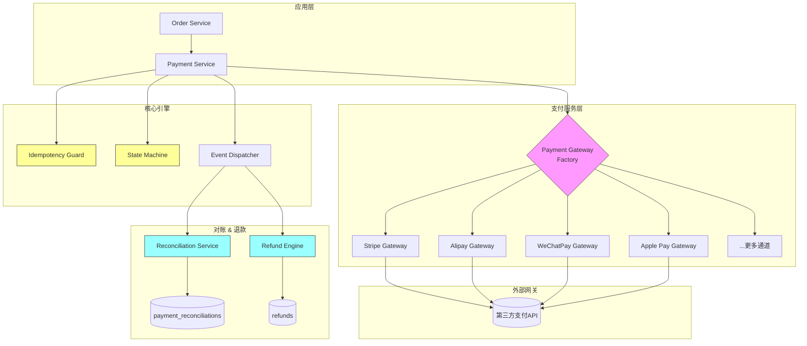
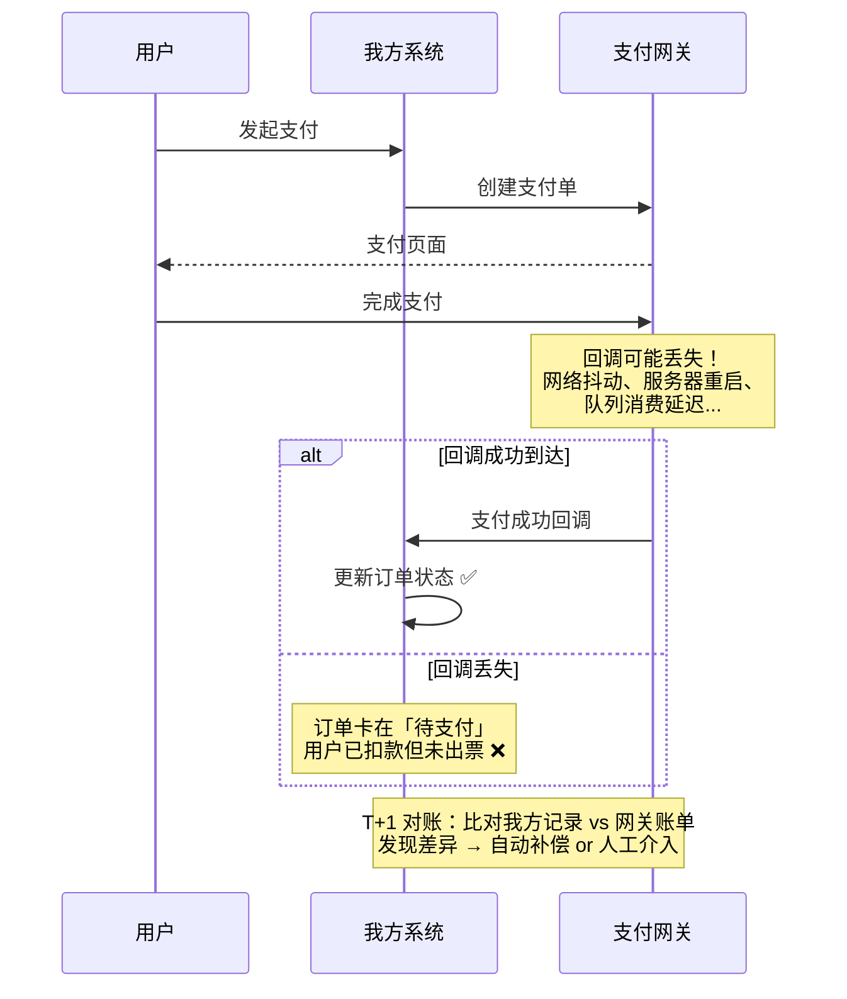
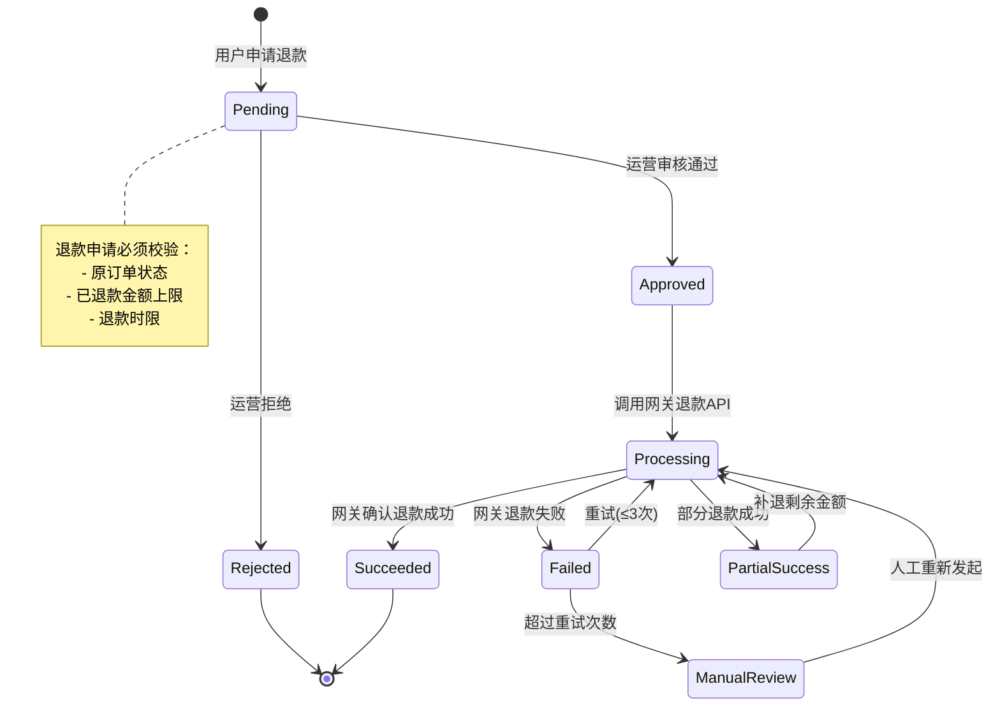
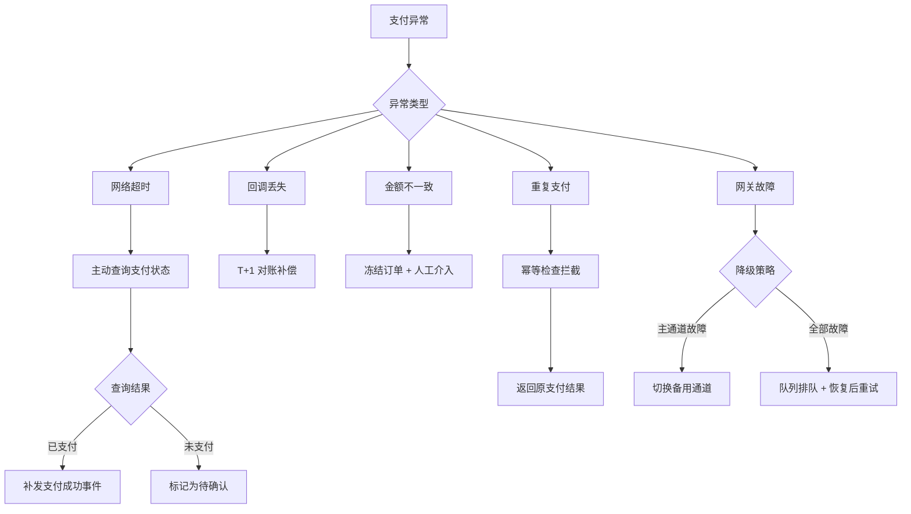

> **前言**：很多文章教你「怎么接 Stripe / Alipay」，但很少有人讲清楚：当支付通道从 2 个变成 8 个，当退款率从 1% 飙到 5%，当财务每天催你要对账报告——支付系统的真正挑战才刚开始。本文基于 KKday B2C API 的真实项目经验，聚焦**多通道抽象、自动对账、退款编排、异常降级**四个维度，分享那些文档里不会写的坑。

---

## 一、支付系统全景架构

一个成熟的 B2C 支付系统不是「Controller 里 curl 一下支付网关」，而是一个分层清晰、可扩展的子系统：



**关键设计原则**：

- **Gateway 抽象层**：统一接口，新增支付通道只需实现一个 Gateway 类
- **幂等守卫**：所有支付请求必须经过幂等检查，防止重复扣款
- **状态机驱动**：支付单状态流转由状态机控制，杜绝非法状态转换
- **事件驱动**：支付成功/失败/退款通过 Event 广播，下游系统解耦

---

## 二、多通道 Gateway 抽象

### 2.1 统一接口设计

```php
// app/Payment/Contracts/PaymentGatewayInterface.php
namespace App\Payment\Contracts;

use App\DTO\Payment\PaymentRequest;
use App\DTO\Payment\PaymentResult;
use App\DTO\Payment\RefundRequest;
use App\DTO\Payment\RefundResult;
use App\DTO\Payment\WebhookPayload;

interface PaymentGatewayInterface
{
    /**
     * 创建支付单（统一下单）
     */
    public function createPayment(PaymentRequest $request): PaymentResult;

    /**
     * 查询支付状态
     */
    public function queryPayment(string $externalId): PaymentResult;

    /**
     * 发起退款
     */
    public function refund(RefundRequest $request): RefundResult;

    /**
     * 验证回调签名
     */
    public function verifyWebhook(WebhookPayload $payload): bool;

    /**
     * 解析回调内容为统一格式
     */
    public function parseWebhook(WebhookPayload $payload): array;

    /**
     * 获取支付通道标识
     */
    public function getChannel(): string;
}
```

### 2.2 Gateway Factory 实现

```php
// app/Payment/PaymentGatewayFactory.php
namespace App\Payment;

use App\Payment\Contracts\PaymentGatewayInterface;
use App\Payment\Gateways\StripeGateway;
use App\Payment\Gateways\AlipayGateway;
use App\Payment\Gateways\WeChatPayGateway;
use Illuminate\Support\Manager;

class PaymentGatewayFactory
{
    /** @var array<string, PaymentGatewayInterface> */
    private array $resolved = [];

    public function __construct(
        private readonly array $config,
    ) {}

    public function driver(string $channel): PaymentGatewayInterface
    {
        // ⚠️ 踩坑：必须用 channel 而非 class name 做 key
        // 同一个 Gateway 类可能被不同配置实例化多次（如 Stripe live/sandbox）
        if (!isset($this->resolved[$channel])) {
            $this->resolved[$channel] = $this->createDriver($channel);
        }

        return $this->resolved[$channel];
    }

    private function createDriver(string $channel): PaymentGatewayInterface
    {
        $config = $this->config[$channel]
            ?? throw new \InvalidArgumentException("Unknown payment channel: {$channel}");

        return match ($channel) {
            'stripe'      => new StripeGateway($config),
            'alipay'      => new AlipayGateway($config),
            'wechat_pay'  => new WeChatPayGateway($config),
            default       => throw new \InvalidArgumentException("Unsupported channel: {$channel}"),
        };
    }
}
```

### 2.3 新增通道的最小改动

当业务需要接入新通道（比如 LINE Pay），只需：

1. 实现 `PaymentGatewayInterface`
2. 在 `config/payment.php` 加一行配置
3. Factory 的 `match` 加一个分支

**不需要**改动 Order Service、Payment Service、对账系统——这就是 Gateway 模式的价值。

---

## 三、T+1 自动对账系统

对账是支付系统里最容易被忽视、但出了问题最致命的环节。

### 3.1 为什么需要对账？



### 3.2 对账数据模型

```php
// database/migrations/xxxx_create_payment_reconciliations_table.php
Schema::create('payment_reconciliations', function (Blueprint $table) {
    $table->id();
    $table->string('channel', 32);              // stripe / alipay / wechat_pay
    $table->date('reconcile_date');              // 对账日期（T+1 的 T）
    $table->string('external_trade_no', 64);     // 网关侧交易号
    $table->string('internal_trade_no', 64);     // 我方支付单号
    $table->enum('status', [
        'matched',       // 双方一致
        'amount_diff',   // 金额不一致
        'missing_local', // 网关有，我方没有
        'missing_remote',// 我方有，网关没有
        'resolved',      // 已处理
    ]);
    $table->decimal('remote_amount', 12, 2);     // 网关侧金额
    $table->decimal('local_amount', 12, 2);      // 我方记录金额
    $table->text('resolution_note')->nullable(); // 处理备注
    $table->timestamps();

    $table->unique(['channel', 'reconcile_date', 'external_trade_no']);
    $table->index(['channel', 'reconcile_date', 'status']);
});
```

### 3.3 对账核心逻辑

```php
// app/Services/Reconciliation/ReconciliationService.php
namespace App\Services\Reconciliation;

use App\Enums\ReconciliationStatus;
use App\Models\PaymentLog;
use App\Models\PaymentReconciliation;
use App\Payment\PaymentGatewayFactory;
use Carbon\Carbon;
use Illuminate\Support\Facades\DB;
use Illuminate\Support\Facades\Log;

class ReconciliationService
{
    public function __construct(
        private readonly PaymentGatewayFactory $gatewayFactory,
    ) {}

    /**
     * 执行 T+1 对账
     */
    public function reconcile(string $channel, Carbon $date): ReconciliationReport
    {
        $gateway = $this->gatewayFactory->driver($channel);

        // 1. 拉取网关侧账单
        $remoteRecords = $this->fetchRemoteStatement($gateway, $date);

        // 2. 查询我方记录
        $localRecords = PaymentLog::where('channel', $channel)
            ->whereDate('paid_at', $date)
            ->get()
            ->keyBy('external_trade_no');

        $report = new ReconciliationReport($channel, $date);

        DB::transaction(function () use ($remoteRecords, $localRecords, $channel, $date, $report) {
            // 3. 比对：网关侧 → 逐条匹配
            foreach ($remoteRecords as $remote) {
                $local = $localRecords->get($remote['trade_no']);

                if (!$local) {
                    // 网关有，我方没有 → 可能是回调丢失
                    $this->createReconciliation($channel, $date, $remote, null, 'missing_local');
                    $report->addMissingLocal($remote);
                    continue;
                }

                if (abs($local->amount - $remote['amount']) > 0.01) {
                    // 金额不一致 → 严重问题，需要人工介入
                    $this->createReconciliation($channel, $date, $remote, $local, 'amount_diff');
                    $report->addAmountDiff($remote, $local);
                    continue;
                }

                // 匹配成功
                $this->createReconciliation($channel, $date, $remote, $local, 'matched');
                $report->addMatched();
                $localRecords->forget($remote['trade_no']);
            }

            // 4. 比对：我方侧 → 剩余的即「我方有，网关没有」
            foreach ($localRecords as $local) {
                $this->createReconciliation($channel, $date, null, $local, 'missing_remote');
                $report->addMissingRemote($local);
            }
        });

        // 5. 发送对账报告
        $this->notifyReconciliationResult($report);

        return $report;
    }

    /**
     * 自动补偿缺失的回调
     */
    public function autoCompensate(string $channel, Carbon $date): int
    {
        $compensated = 0;

        $missingRecords = PaymentReconciliation::where('channel', $channel)
            ->where('reconcile_date', $date)
            ->where('status', 'missing_local')
            ->get();

        foreach ($missingRecords as $record) {
            try {
                $gateway = $this->gatewayFactory->driver($channel);
                $result = $gateway->queryPayment($record->external_trade_no);

                if ($result->isSuccessful()) {
                    // 触发支付成功事件，走正常的订单确认流程
                    event(new PaymentConfirmed(
                        tradeNo: $record->internal_trade_no,
                        channel: $channel,
                        amount: $result->getAmount(),
                    ));

                    $record->update([
                        'status' => 'resolved',
                        'resolution_note' => 'Auto-compensated via query at ' . now(),
                    ]);
                    $compensated++;
                }
            } catch (\Throwable $e) {
                Log::error('Auto-compensation failed', [
                    'channel' => $channel,
                    'trade_no' => $record->external_trade_no,
                    'error' => $e->getMessage(),
                ]);
            }
        }

        return $compensated;
    }
}
```

### 3.4 ⚠️ 对账踩坑记录

| 坑 | 现象 | 原因 | 解法 |
|----|------|------|------|
| **时区差异** | 对账永远有 1-2 条 amount_diff | Stripe 账单用 UTC，我方用 Asia/Taipei | 统一用 UTC 存储 `paid_at`，对账时按 UTC 日期拉取 |
| **部分退款干扰** | 同一笔订单在网关侧金额是 90，我方是 100 | 网关账单已扣除退款，我方原始订单未变 | 对账时用 `原始金额 - 已退款金额` 比对 |
| **分账/手续费** | 金额永远不一致 | 网关账单是净额（扣除手续费），我方是总额 | 对账逻辑区分 gross/net，用 gross 比对 |
| **跨日订单** | 23:59 创建，00:01 支付成功 | 按 `paid_at` 归属日期和按 `created_at` 归属不一致 | 对账统一按 `paid_at`，且允许 T+1/T+2 两天的缓冲窗口 |

---

## 四、退款状态机

退款不是「调一下退款 API」那么简单。一个完整的退款流程涉及多个状态和边界条件：



### 4.1 退款引擎实现

```php
// app/Services/Refund/RefundEngine.php
namespace App\Services\Refund;

use App\DTO\Refund\RefundRequest;
use App\Enums\RefundStatus;
use App\Exceptions\Refund\RefundLimitExceededException;
use App\Models\Order;
use App\Models\Refund;
use App\Payment\PaymentGatewayFactory;
use Illuminate\Support\Facades\DB;

class RefundEngine
{
    public function __construct(
        private readonly PaymentGatewayFactory $gatewayFactory,
    ) {}

    /**
     * 发起退款
     */
    public function refund(RefundRequest $dto): Refund
    {
        return DB::transaction(function () use ($dto) {
            $order = Order::lockForUpdate()->findOrFail($dto->orderId);

            // ① 校验退款前置条件
            $this->validateRefundEligibility($order, $dto->amount);

            // ② 创建退款单
            $refund = Refund::create([
                'order_id'      => $order->id,
                'refund_no'     => $this->generateRefundNo(),
                'channel'       => $order->payment_channel,
                'amount'        => $dto->amount,
                'reason'        => $dto->reason,
                'status'        => RefundStatus::Pending,
                'requested_by'  => auth()->id(),
            ]);

            // ③ 更新订单已退款金额（悲观锁保护）
            $order->increment('refunded_amount', $dto->amount);

            return $refund;
        });
    }

    /**
     * 执行退款（由 Job 或 Scheduler 调用）
     */
    public function execute(Refund $refund): void
    {
        $refund->update(['status' => RefundStatus::Processing]);

        try {
            $gateway = $this->gatewayFactory->driver($refund->channel);

            $result = $gateway->refund(new \App\DTO\Payment\RefundRequest(
                externalTradeNo: $refund->order->payment->external_trade_no,
                amount:          $refund->amount,
                reason:          $refund->reason,
                refundNo:        $refund->refund_no,
            ));

            if ($result->isSuccessful()) {
                $refund->update([
                    'status'             => RefundStatus::Succeeded,
                    'external_refund_id' => $result->getExternalRefundId(),
                    'refunded_at'        => now(),
                ]);

                event(new RefundSucceeded($refund));
            } else {
                $this->handleRefundFailure($refund, $result->getErrorMessage());
            }
        } catch (\Throwable $e) {
            $this->handleRefundFailure($refund, $e->getMessage());
        }
    }

    /**
     * 退款前置校验
     */
    private function validateRefundEligibility(Order $order, float $amount): void
    {
        // 订单必须已支付
        if (!$order->isPaid()) {
            throw new RefundLimitExceededException('订单未支付，不可退款');
        }

        // 退款金额不能超过可退余额
        $refundableAmount = $order->total_amount - $order->refunded_amount;
        if ($amount > $refundableAmount) {
            throw new RefundLimitExceededException(
                "退款金额 ¥{$amount} 超过可退余额 ¥{$refundableAmount}"
            );
        }

        // 退款时限检查（如：下单后 90 天内可退款）
        if ($order->paid_at->diffInDays(now()) > 90) {
            throw new RefundLimitExceededException('超过退款时限（90 天）');
        }

        // ④ 踩坑：必须检查是否有进行中的退款
        $pendingRefund = Refund::where('order_id', $order->id)
            ->whereIn('status', [RefundStatus::Pending, RefundStatus::Processing])
            ->exists();

        if ($pendingRefund) {
            throw new RefundLimitExceededException('已有退款正在处理中，请勿重复提交');
        }
    }

    private function handleRefundFailure(Refund $refund, string $error): void
    {
        $retryCount = $refund->retry_count + 1;

        if ($retryCount <= 3) {
            // 指数退避重试
            $refund->update([
                'status'       => RefundStatus::Pending,
                'retry_count'  => $retryCount,
                'last_error'   => $error,
                'next_retry_at' => now()->addMinutes(pow(2, $retryCount) * 5),
            ]);

            dispatch(new ExecuteRefundJob($refund))
                ->delay($refund->next_retry_at);
        } else {
            $refund->update([
                'status'      => RefundStatus::ManualReview,
                'retry_count' => $retryCount,
                'last_error'  => $error,
            ]);

            // 通知运营介入
            event(new RefundNeedsManualReview($refund));
        }
    }
}
```

### 4.2 ⚠️ 退款踩坑记录

| 坑 | 现象 | 原因 | 解法 |
|----|------|------|------|
| **并发退款** | 同一订单同时发起两笔退款，总退款额超过订单金额 | 未加悲观锁 | `lockForUpdate()` + 校验 `refunded_amount` |
| **退款状态不同步** | 网关侧已退款成功，我方还是 Processing | 回调丢失 | 定时轮询未终态的退款单，主动查询网关 |
| **部分退款后对账失败** | 对账金额永远对不上 | 网关返回净额，我方用原始金额 | 对账时用 `原始金额 - 已退款金额` |
| **Stripe 退款有延迟** | 调用退款 API 返回 succeeded，但银行 5-10 天才到账 | 信用卡退款有清算周期 | 前端展示「退款处理中，预计 5-10 个工作日到账」 |

---

## 五、支付异常处理与降级策略

### 5.1 异常分类与处理矩阵



### 5.2 支付超时处理

```php
// app/Jobs/PaymentTimeoutCheckJob.php
namespace App\Jobs;

use App\Enums\PaymentStatus;
use App\Models\PaymentLog;
use App\Payment\PaymentGatewayFactory;
use Illuminate\Bus\Queueable;
use Illuminate\Contracts\Queue\ShouldQueue;
use Illuminate\Foundation\Bus\Dispatchable;
use Illuminate\Queue\InteractsWithQueue;
use Illuminate\Support\Facades\Log;

class PaymentTimeoutCheckJob implements ShouldQueue
{
    use Dispatchable, InteractsWithQueue, Queueable;

    public int $tries = 3;

    public function handle(PaymentGatewayFactory $gatewayFactory): void
    {
        // 查找创建超过 15 分钟仍未终态的支付单
        $pendingPayments = PaymentLog::where('status', PaymentStatus::Pending)
            ->where('created_at', '<', now()->subMinutes(15))
            ->limit(100)
            ->get();

        foreach ($pendingPayments as $payment) {
            try {
                $gateway = $gatewayFactory->driver($payment->channel);
                $result = $gateway->queryPayment($payment->external_trade_no);

                match (true) {
                    $result->isSuccessful() => $this->handlePaid($payment, $result),
                    $result->isFailed()     => $this->handleFailed($payment),
                    default                 => $this->handleStillPending($payment),
                };
            } catch (\Throwable $e) {
                Log::warning('Payment timeout check failed', [
                    'payment_id' => $payment->id,
                    'error'      => $e->getMessage(),
                ]);
            }
        }
    }

    private function handlePaid(PaymentLog $payment, $result): void
    {
        // ⚠️ 踩坑：必须走完整的支付成功流程，不能只改状态
        // 否则会跳过库存扣减、优惠券核销等后续逻辑
        event(new PaymentConfirmed(
            tradeNo: $payment->trade_no,
            channel: $payment->channel,
            amount: $result->getAmount(),
        ));

        Log::info('Late payment confirmed via timeout check', [
            'payment_id' => $payment->id,
            'gap_minutes' => $payment->created_at->diffInMinutes(now()),
        ]);
    }

    private function handleStillPending(PaymentLog $payment): void
    {
        // 超过 30 分钟仍无法确认 → 标记为异常，等待对账兜底
        if ($payment->created_at->diffInMinutes(now()) > 30) {
            $payment->update([
                'status'    => PaymentStatus::Unknown,
                'last_error' => 'Timeout: unable to confirm payment status after 30 min',
            ]);

            // 通知运营
            event(new PaymentStatusUnknown($payment));
        }
    }
}
```

### 5.3 通道降级策略

```php
// app/Payment/PaymentChannelRouter.php
namespace App\Payment;

use Illuminate\Support\Facades\Cache;
use Illuminate\Support\Facades\Log;

class PaymentChannelRouter
{
    private const FAILURE_THRESHOLD = 5;      // 连续失败次数
    private const CIRCUIT_BREAKER_TTL = 300;  // 熔断持续时间（秒）

    public function __construct(
        private readonly PaymentGatewayFactory $factory,
    ) {}

    /**
     * 选择最佳可用通道
     */
    public function resolve(string $preferredChannel, string $orderType): PaymentGatewayInterface
    {
        $channels = $this->getChannelPriority($orderType);

        foreach ($channels as $channel) {
            if ($this->isCircuitOpen($channel)) {
                Log::info("Channel {$channel} is circuit-broken, skipping");
                continue;
            }

            return $this->factory->driver($channel);
        }

        // 所有通道都不可用 → 返回首选通道（让用户自己试）
        return $this->factory->driver($preferredChannel);
    }

    /**
     * 上报支付结果（用于熔断器决策）
     */
    public function reportResult(string $channel, bool $success): void
    {
        $key = "payment:circuit:{$channel}";

        if ($success) {
            Cache::forget($key);
            return;
        }

        $failures = Cache::increment("{$key}:failures");

        if ($failures >= self::FAILURE_THRESHOLD) {
            Cache::put($key, 'open', self::CIRCUIT_BREAKER_TTL);
            Cache::forget("{$key}:failures");

            Log::warning("Payment channel {$channel} circuit breaker OPEN", [
                'failures' => $failures,
                'ttl'      => self::CIRCUIT_BREAKER_TTL,
            ]);
        }
    }

    private function isCircuitOpen(string $channel): bool
    {
        return Cache::get("payment:circuit:{$channel}") === 'open';
    }

    private function getChannelPriority(string $orderType): array
    {
        return match ($orderType) {
            'domestic'  => ['alipay', 'wechat_pay', 'stripe'],
            'overseas'  => ['stripe', 'apple_pay', 'alipay'],
            default     => ['stripe', 'alipay'],
        };
    }
}
```

---

## 六、支付系统 Checklist

在上线任何支付功能之前，对照这个清单检查：

```
✅ 幂等性：同一笔订单重复提交不会重复扣款
✅ 状态机：支付单状态只能合法流转，不允许跳转
✅ 超时处理：15 分钟未确认的支付单主动查询网关
✅ 对账机制：T+1 自动对账 + 差异告警
✅ 退款校验：金额上限、时限、并发锁
✅ 通道降级：主通道故障自动切换备用通道
✅ 回调验签：所有回调必须验证签名，防伪造
✅ 金额精度：统一用 decimal(12,2)，禁止 float
✅ 日志留痕：每笔支付/退款操作全链路日志
✅ 幂等 Key：Idempotency-Key 必须覆盖创建和退款接口
```

---

## 七、总结

| 维度 | 常见错误 | 正确做法 |
|------|----------|----------|
| **通道抽象** | 每个通道一套独立代码 | Gateway 接口 + Factory |
| **对账** | 不做 / 手动 Excel 比对 | T+1 自动对账 + 差异自动补偿 |
| **退款** | 只调 API 不管状态 | 状态机 + 重试 + 人工兜底 |
| **异常处理** | try-catch 吞掉 | 分类处理 + 熔断降级 + 告警 |
| **金额存储** | float / double | decimal(12,2) 全程用 string 传递 |
| **幂等** | 只在创建接口做 | 创建 + 退款 + 回调 全链路幂等 |

**最后一条忠告**：支付系统的设计要围绕「钱不能丢、不能多收、不能少退」这三条底线。每一个边界条件都值得写测试用例——我们曾经因为在退款校验中漏了一行 `$order->lockForUpdate()`，导致双十一当天出现 3 笔超额退款，修复花了比开发多 10 倍的时间。

---

> 本文基于 KKday B2C API 真实项目经验整理，涉及 Stripe、Alipay 等多个支付通道的生产环境实践。如有疑问，欢迎交流探讨支付系统架构设计。

## 相关阅读

- [Stripe 支付：支付流程完整设计与高并发场景下的幂等性保障踩坑记录](/categories/架构/stripe-high-concurrency/) —— Stripe 集成的深度实践
- [分布式事务实战：Saga 模式在订单、库存、支付中的应用——Laravel B2C API 踩坑记录](/categories/架构/distributedtransactionguide-saga/) —— 跨服务支付事务的一致性保障
- [电商库存系统设计：防超卖分布式锁与库存预扣减——Laravel B2C API 实战踩坑记录](/categories/架构/inventory-lock-design/) —— 支付与库存的联动设计
