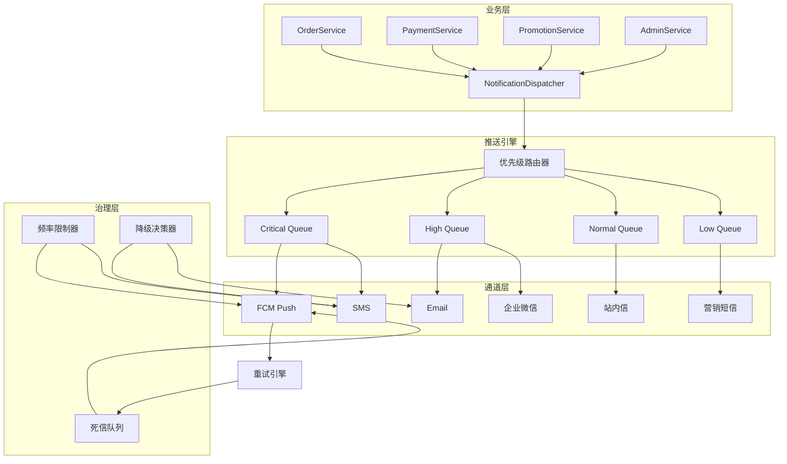

---

title: 消息推送系统设计实战：多通道、优先级、失败重试、降级策略 — Laravel B2C API 踩坑记录
cover: https://images.unsplash.com/photo-1486406146926-c627a92ad1ab?w=1200&h=630&fit=crop
images:
  - https://images.unsplash.com/photo-1486406146926-c627a92ad1ab?w=1200&h=630&fit=crop
date: 2026-05-16 21:10:35
updated: 2026-05-16 21:14:39
categories:
  - architecture
keywords: [Laravel B2C API, 消息推送系统设计实战, 多通道, 优先级, 失败重试, 降级策略, 踩坑记录]
tags:
- KKday
- Laravel
- 微服务
- 架构
- 消息队列
- Redis
- FCM
- 推送系统
description: KKday B2C 电商项目从零搭建消息推送系统完整实战：多通道（FCM、短信、邮件、企业微信、站内信）统一架构设计、ChannelRegistry 通道注册中心、优先级队列分层调度、失败指数退避重试与死信处理、通道自动降级策略、Redis 滑动窗口频率控制与幂等保障。含完整 PHP 代码示例、Mermaid 架构图、通道特性对比表与 6 条生产环境踩坑记录。
---


## 前言

在 B2C 电商场景中，消息推送是连接用户与业务的核心管道——订单确认、支付结果、发货通知、营销活动、安全告警，每一个触点都直接影响用户体验和转化率。

但现实远比想象复杂：FCM 推送可能被用户关闭、短信通道偶发超时、邮件可能进垃圾箱、企业微信有频率限制……如果每条消息只走单一通道，送达率根本无法保证。

这篇文章记录了我在 KKday B2C 项目中，从"每个 Service 各自发通知"到"统一推送引擎"的演进过程，涵盖 **通道抽象、优先级分层、失败重试、降级策略、频率控制** 五大核心模块。

---

## 一、架构总览：从散落到统一

### 1.1 改造前：各 Service 各自为政

```
OrderService → 直接调 FCM SDK
PaymentService → 直接调 Twilio SMS
PromotionService → 直接调 SMTP
AdminService → 直接调企微 Webhook
```

**问题**：
- 重复代码遍布 30+ 仓库
- 无法统一控制频率（用户同时收到 5 条营销推送）
- 失败后无重试，丢消息全靠人工发现
- 某通道挂了，整个业务直接报错

### 1.2 改造后：统一推送引擎架构



---

## 二、通道抽象：统一的 Channel 接口

### 2.1 定义 Channel Interface

```php
<?php

namespace App\Notification\Channels;

use App\Notification\DTOs\NotificationMessage;
use App\Notification\DTOs\DeliveryResult;
use App\Notification\Enums\ChannelType;

interface NotificationChannelInterface
{
    /**
     * 通道类型标识
     */
    public function getType(): ChannelType;

    /**
     * 发送消息，返回投递结果
     */
    public function send(NotificationMessage $message): DeliveryResult;

    /**
     * 检查通道健康状态
     */
    public function isHealthy(): bool;

    /**
     * 获取通道支持的优先级范围
     */
    public function supportedPriorities(): array;

    /**
     * 每分钟最大发送量（用于限流）
     */
    public function rateLimit(): int;
}
```

### 2.2 ChannelType Enum（PHP 8.1）

```php
<?php

namespace App\Notification\Enums;

enum ChannelType: string
{
    case FCM_PUSH   = 'fcm_push';
    case SMS        = 'sms';
    case EMAIL      = 'email';
    case WECOM      = 'wecom';       // 企业微信
    case IN_APP     = 'in_app';      // 站内信
    case MARKETING  = 'marketing';   // 营销通道
}
```

### 2.3 ChannelRegistry：通道注册中心

```php
<?php

namespace App\Notification;

use App\Notification\Channels\NotificationChannelInterface;
use App\Notification\Enums\ChannelType;
use Illuminate\Support\Collection;

class ChannelRegistry
{
    /** @var array<ChannelType, NotificationChannelInterface> */
    private array $channels = [];

    /** @var array<ChannelType, ChannelType[]> 降级映射 */
    private array $fallbackMap = [];

    public function register(NotificationChannelInterface $channel): void
    {
        $this->channels[$channel->getType()] = $channel;
    }

    public function get(ChannelType $type): NotificationChannelInterface
    {
        if (!isset($this->channels[$type])) {
            throw new \InvalidArgumentException("Channel [{$type->value}] not registered");
        }
        return $this->channels[$type];
    }

    /**
     * 根据模板配置获取可用通道列表
     */
    public function getChannelsForTemplate(string $templateCode): array
    {
        $template = \App\Models\NotificationTemplate::where('code', $templateCode)->firstOrFail();
        return array_map(
            fn(string $ch) => ChannelType::from($ch),
            json_decode($template->channels, true)
        );
    }

    /**
     * 获取备用通道列表（用于降级）
     */
    public function getFallbackChannels(ChannelType $type): array
    {
        return $this->fallbackMap[$type] ?? [];
    }

    public function setFallbackMap(array $map): void
    {
        $this->fallbackMap = $map;
    }

    /**
     * 获取所有健康通道
     */
    public function getHealthyChannels(): Collection
    {
        return collect($this->channels)->filter(
            fn(NotificationChannelInterface $ch) => $ch->isHealthy()
        );
    }
}
```

### 2.4 通道特性对比

| 维度 | FCM Push | 短信 SMS | 邮件 Email | 企业微信 | 站内信 |
|------|----------|----------|-----------|---------|--------|
| **送达率** | 70-85%（依赖用户授权） | 95-99% | 85-95%（可能进垃圾箱） | 98%+ | 100%（应用内） |
| **延迟** | <1s | 1-10s | 5-60s | <2s | <500ms |
| **单条成本** | 免费 | ¥0.04-0.06 | ¥0.001-0.01 | 免费 | 免费 |
| **适合场景** | 实时通知 | 紧急/关键通知 | 详尽内容通知 | 内部/企业通知 | 普通通知兜底 |
| **限流策略** | 500/min | 按运营商配额 | 按 ESP 配额 | 20/min | 基本不限 |
| **用户可关闭** | 是 | 否 | 否 | 否 | 否 |
| **内容长度** | ≤4KB data payload | 70 字/条 | 无限制 | ≤2048 字 | 无限制 |
| **富媒体支持** | 图片/声音/点击动作 | 仅文本 | HTML 全支持 | Markdown + 卡片 | HTML 全支持 |

> **选型建议**：不要只依赖 FCM——用户关闭推送权限的比例在 30-50%。关键消息必须走短信或邮件作为 backup 通道。

### 2.5 FCM Push 通道实现示例

```php
<?php

namespace App\Notification\Channels;

use App\Notification\DTOs\NotificationMessage;
use App\Notification\DTOs\DeliveryResult;
use App\Notification\Enums\ChannelType;
use App\Notification\Enums\DeliveryStatus;
use Kreait\Firebase\Messaging\CloudMessage;
use Kreait\Laravel\Firebase\Facades\Firebase;

class FcmPushChannel implements NotificationChannelInterface
{
    private int $failureCount = 0;
    private const HEALTH_THRESHOLD = 10; // 连续失败 10 次标记不健康

    public function getType(): ChannelType
    {
        return ChannelType::FCM_PUSH;
    }

    public function send(NotificationMessage $message): DeliveryResult
    {
        try {
            $payload = CloudMessage::withTarget('token', $message->getRecipientDeviceToken())
                ->withNotification([
                    'title' => $message->getTitle(),
                    'body'  => $message->getBody(),
                ])
                ->withData($message->getExtraData());

            $result = Firebase::messaging()->send($payload);

            $this->failureCount = 0; // 重置失败计数

            return new DeliveryResult(
                status: DeliveryStatus::SENT,
                channelType: $this->getType(),
                externalId: $result,
                sentAt: now(),
            );
        } catch (\Throwable $e) {
            $this->failureCount++;

            return new DeliveryResult(
                status: DeliveryStatus::FAILED,
                channelType: $this->getType(),
                errorMessage: $e->getMessage(),
                shouldRetry: $this->isRetryableError($e),
            );
        }
    }

    public function isHealthy(): bool
    {
        return $this->failureCount < self::HEALTH_THRESHOLD;
    }

    public function supportedPriorities(): array
    {
        return ['critical', 'high', 'normal'];
    }

    public function rateLimit(): int
    {
        return 500; // FCM 每分钟 500 条
    }

    private function isRetryableError(\Throwable $e): bool
    {
        $retryableCodes = ['messaging/quota-exceeded', 'messaging/internal-error'];
        return in_array($e->getCode(), $retryableCodes, true)
            || $e instanceof \GuzzleHttp\Exception\ConnectException;
    }
}
```

**踩坑 #1**：FCM 的 `messaging/registration-token-not-registered` 错误不应该重试——说明用户卸载了 App 或换了设备。必须在重试逻辑中排除这类错误，否则会无限重试。

### 2.6 SMS 短信通道实现示例

```php
<?php

namespace App\Notification\Channels;

use App\Notification\DTOs\NotificationMessage;
use App\Notification\DTOs\DeliveryResult;
use App\Notification\Enums\ChannelType;
use App\Notification\Enums\DeliveryStatus;
use Twilio\Rest\Client as TwilioClient;
use Twilio\Exceptions\TwilioException;

class SmsChannel implements NotificationChannelInterface
{
    private int $failureCount = 0;
    private const HEALTH_THRESHOLD = 5; // 短信通道更敏感，5 次就标记不健康

    public function __construct(
        private readonly TwilioClient $twilio,
        private readonly string $fromNumber,
    ) {}

    public function getType(): ChannelType
    {
        return ChannelType::SMS;
    }

    public function send(NotificationMessage $message): DeliveryResult
    {
        try {
            // 短信内容截断：单条短信 70 字（纯 ASCII 160 字符）
            $body = mb_substr($message->getBody(), 0, 70);

            $result = $this->twilio->messages->create(
                $message->getRecipientPhone(),
                [
                    'from' => $this->fromNumber,
                    'body' => $body,
                ]
            );

            $this->failureCount = 0;

            return new DeliveryResult(
                status: DeliveryStatus::SENT,
                channelType: $this->getType(),
                externalId: $result->sid,
                sentAt: now(),
            );
        } catch (TwilioException $e) {
            $this->failureCount++;

            return new DeliveryResult(
                status: DeliveryStatus::FAILED,
                channelType: $this->getType(),
                errorMessage: $e->getMessage(),
                shouldRetry: $this->isRetryableError($e),
            );
        }
    }

    public function isHealthy(): bool
    {
        return $this->failureCount < self::HEALTH_THRESHOLD;
    }

    public function supportedPriorities(): array
    {
        return ['critical', 'high', 'normal']; // 营销短信走独立通道
    }

    public function rateLimit(): int
    {
        return 100; // 短信每分钟 100 条（受运营商配额限制）
    }

    private function isRetryableError(TwilioException $e): bool
    {
        // Twilio 错误码：20429 = Too Many Requests, 30001 = Queue Overflow
        $retryableCodes = [20429, 30001, 30002, 30003];
        return in_array($e->getCode(), $retryableCodes, true);
    }
}
```

**踩坑 #6**：短信模板需要提前在运营商报备，如果消息内容与报备模板不一致会被直接丢弃（不返回错误）。我们曾经因为模板中多了一个感叹号，导致 3000 条短信"发送成功"但用户一条都没收到。**解决方案**：在发送前做模板匹配校验，不匹配的内容自动回退到邮件通道。

---

## 三、优先级分层：不同消息不同待遇

### 3.1 优先级定义

```php
<?php

namespace App\Notification\Enums;

enum NotificationPriority: int
{
    case CRITICAL = 0;  // 安全告警、支付异常 → 立即发送，不走频率限制
    case HIGH     = 1;  // 订单状态变更 → 最快队列
    case NORMAL   = 2;  // 一般通知 → 普通队列
    case LOW      = 3;  // 营销推送 → 低优先级，可延迟

    /**
     * 对应的 Laravel Queue 名称
     */
    public function queueName(): string
    {
        return match ($this) {
            self::CRITICAL => 'notifications-critical',
            self::HIGH     => 'notifications-high',
            self::NORMAL   => 'notifications-normal',
            self::LOW      => 'notifications-low',
        };
    }

    /**
     * 重试次数
     */
    public function maxRetries(): int
    {
        return match ($this) {
            self::CRITICAL => 10,
            self::HIGH     => 5,
            self::NORMAL   => 3,
            self::LOW      => 1,
        };
    }

    /**
     * 重试延迟（秒）
     */
    public function retryDelays(): array
    {
        return match ($this) {
            self::CRITICAL => [5, 15, 30, 60, 120, 300, 600, 1800, 3600, 7200],
            self::HIGH     => [10, 30, 60, 300, 900],
            self::NORMAL   => [30, 120, 600],
            self::LOW      => [300],
        };
    }
}
```

### 3.2 Horizon 队列配置

```php
// config/horizon.php
'environments' => [
    'production' => [
        'notifications-supervisor' => [
            'connection' => 'redis',
            'queue' => ['notifications-critical', 'notifications-high', 'notifications-normal', 'notifications-low'],
            'balance' => 'auto',
            'autoScalingStrategy' => 'time',
            'maxProcesses' => 10,
            'maxTime' => 3600,
            'maxJobs' => 1000,
            'memory' => 256,
            'tries' => 1,
            'timeout' => 60,
            'nice' => 0,
        ],
    ],
],
```

**关键点**：queue 数组的顺序就是优先级——Laravel Queue Worker 会优先消费 `notifications-critical`，只有该队列空了才消费下一个。这比在代码中手动排序更可靠。

### 3.3 重试策略对比

| 优先级 | 最大重试次数 | 重试间隔策略 | 总最长重试窗口 | 重试失败处理 |
|--------|------------|-------------|--------------|-------------|
| **CRITICAL** | 10 次 | 5s → 15s → 30s → 1m → 2m → 5m → 10m → 30m → 1h → 2h | ~4 小时 | 进入死信队列 + P1 告警 |
| **HIGH** | 5 次 | 10s → 30s → 1m → 5m → 15m | ~21 分钟 | 进入死信队列 + P2 告警 |
| **NORMAL** | 3 次 | 30s → 2m → 10m | ~12 分钟 | 记录日志，不告警 |
| **LOW** | 1 次 | 5min | 5 分钟 | 静默丢弃 |

> **指数退避 vs 固定间隔**：CRITICAL 和 HIGH 使用**指数退避**（exponential backoff），避免在下游服务故障时持续冲击。LOW 使用固定间隔，因为营销消息不值得反复重试。

**踩坑补充**：Laravel 的 `backoff()` 方法接收的是一个数组（每次重试的延迟秒数），而不是增长因子。如果你想要真正的指数退避，需要自己计算数组：`[pow(2, i) * baseDelay for i in 0..maxRetries]`。

---

## 四、NotificationDispatcher：统一调度器

### 4.1 核心调度逻辑

```php
<?php

namespace App\Notification;

use App\Notification\DTOs\NotificationMessage;
use App\Notification\Enums\NotificationPriority;
use App\Notification\Enums\ChannelType;
use App\Notification\Jobs\SendNotificationJob;
use Illuminate\Support\Facades\Bus;

class NotificationDispatcher
{
    public function __construct(
        private readonly ChannelRegistry $channelRegistry,
        private readonly FrequencyLimiter $frequencyLimiter,
        private readonly DegradationManager $degradationManager,
    ) {}

    /**
     * 统一发送入口
     */
    public function dispatch(
        string $userId,
        string $templateCode,
        array $params,
        NotificationPriority $priority = NotificationPriority::NORMAL,
        ?ChannelType $preferredChannel = null,
    ): void {
        // 1. 解析模板，生成消息
        $message = $this->resolveTemplate($templateCode, $params);
        $message->setUserId($userId);
        $message->setPriority($priority);

        // 2. 决定通道（支持指定通道或自动选择）
        $channels = $preferredChannel
            ? [$preferredChannel]
            : $this->channelRegistry->getChannelsForTemplate($templateCode);

        // 3. 应用降级策略
        $channels = $this->degradationManager->applyDegradation($channels, $priority);

        // 4. 频率控制（CRITICAL 级别跳过）
        if ($priority !== NotificationPriority::CRITICAL) {
            $channels = $this->frequencyLimiter->filter($userId, $channels);
        }

        // 5. 分发到 Job
        foreach ($channels as $channelType) {
            SendNotificationJob::dispatch($message, $channelType, $priority)
                ->onQueue($priority->queueName())
                ->onConnection('redis')
                ->delay(
                    $priority === NotificationPriority::LOW
                        ? now()->addMinutes(rand(0, 30)) // 营销消息随机延迟，避免瞬时洪峰
                        : null
                );
        }
    }
}
```

**踩坑 #2**：营销推送（LOW 优先级）如果在同一时刻全部发出，短信通道会被打爆。我们加了 `rand(0, 30)` 分钟随机延迟，将 10 万条营销消息分散到 30 分钟内发送，避免了通道限流。

### 4.2 SendNotificationJob

```php
<?php

namespace App\Notification\Jobs;

use App\Notification\ChannelRegistry;
use App\Notification\DTOs\NotificationMessage;
use App\Notification\DTOs\DeliveryResult;
use App\Notification\Enums\DeliveryStatus;
use App\Notification\Enums\NotificationPriority;
use App\Notification\Enums\ChannelType;
use Illuminate\Bus\Queueable;
use Illuminate\Contracts\Queue\ShouldQueue;
use Illuminate\Foundation\Bus\Dispatchable;
use Illuminate\Queue\InteractsWithQueue;
use Illuminate\Queue\SerializesModels;
use Illuminate\Support\Facades\Log;

class SendNotificationJob implements ShouldQueue
{
    use Dispatchable, InteractsWithQueue, Queueable, SerializesModels;

    public int $tries;
    public int $timeout = 30;

    public function __construct(
        public NotificationMessage $message,
        public ChannelType $channelType,
        public NotificationPriority $priority,
    ) {
        $this->tries = $priority->maxRetries() + 1;
    }

    /**
     * 计算下次重试延迟
     */
    public function backoff(): array
    {
        return $this->priority->retryDelays();
    }

    public function handle(ChannelRegistry $registry): void
    {
        $channel = $registry->get($this->channelType);

        if (!$channel->isHealthy()) {
            // 通道不健康，触发降级：尝试切换到备用通道
            Log::warning('notification.channel_unhealthy', [
                'channel' => $this->channelType->value,
                'user_id' => $this->message->getUserId(),
            ]);

            $this->tryFallbackChannel($registry);
            return;
        }

        $result = $channel->send($this->message);

        if ($result->status === DeliveryStatus::FAILED && $result->shouldRetry) {
            // 可重试的失败 → 让 Laravel 自动 retry
            throw new \RuntimeException(
                "Notification delivery failed: {$result->errorMessage}"
            );
        }

        // 记录投递结果
        $this->recordDelivery($result);
    }

    /**
     * 尝试备用通道（降级策略）
     */
    private function tryFallbackChannel(ChannelRegistry $registry): void
    {
        $fallbacks = $registry->getFallbackChannels($this->channelType);

        foreach ($fallbacks as $fallbackType) {
            $fallback = $registry->get($fallbackType);
            if ($fallback->isHealthy()) {
                $result = $fallback->send($this->message);
                $this->recordDelivery($result);
                return;
            }
        }

        // 所有通道都不可用，进入死信队列
        Log::error('notification.all_channels_failed', [
            'user_id' => $this->message->getUserId(),
            'template' => $this->message->getTemplateCode(),
        ]);
    }

    /**
     * 最终失败：进入死信队列
     */
    public function failed(\Throwable $exception): void
    {
        Log::error('notification.job_failed', [
            'user_id' => $this->message->getUserId(),
            'channel' => $this->channelType->value,
            'error' => $exception->getMessage(),
        ]);

        // 写入 notifications_failed 表，便于后续人工处理或自动重跑
        \App\Models\NotificationFailed::create([
            'user_id' => $this->message->getUserId(),
            'channel' => $this->channelType->value,
            'template_code' => $this->message->getTemplateCode(),
            'payload' => $this->message->toArray(),
            'error_message' => $exception->getMessage(),
            'failed_at' => now(),
        ]);
    }

    private function recordDelivery(DeliveryResult $result): void
    {
        \App\Models\NotificationLog::create([
            'user_id' => $this->message->getUserId(),
            'channel' => $this->channelType->value,
            'template_code' => $this->message->getTemplateCode(),
            'status' => $result->status->value,
            'external_id' => $result->externalId,
            'sent_at' => $result->sentAt,
        ]);
    }
}
```

---

## 五、降级策略：通道不可用时的自动切换

### 5.1 降级决策器

```php
<?php

namespace App\Notification;

use App\Notification\Enums\ChannelType;
use App\Notification\Enums\NotificationPriority;

class DegradationManager
{
    /**
     * 降级映射表：当主通道不可用时，按顺序尝试备用通道
     *
     * 原则：
     * - FCM 挂了 → 短信（紧急消息）或站内信（一般消息）
     * - 短信挂了 → 邮件
     * - 企业微信挂了 → 邮件
     * - 邮件挂了 → 站内信（兜底）
     */
    private const FALLBACK_MAP = [
        ChannelType::FCM_PUSH  => [ChannelType::SMS, ChannelType::IN_APP],
        ChannelType::SMS       => [ChannelType::EMAIL, ChannelType::IN_APP],
        ChannelType::EMAIL     => [ChannelType::IN_APP],
        ChannelType::WECOM     => [ChannelType::EMAIL, ChannelType::IN_APP],
        ChannelType::IN_APP    => [],  // 站内信是最终兜底，无降级
    ];

    /**
     * 根据通道健康状态和优先级应用降级
     */
    public function applyDegradation(
        array $channels,
        NotificationPriority $priority,
    ): array {
        $result = [];

        foreach ($channels as $channelType) {
            // 先检查主通道
            if ($this->isChannelAvailable($channelType)) {
                $result[] = $channelType;
                continue;
            }

            // 主通道不可用，尝试降级
            $fallbacks = self::FALLBACK_MAP[$channelType] ?? [];

            foreach ($fallbacks as $fallback) {
                if ($this->isChannelAvailable($fallback)) {
                    Log::info('notification.degradation_applied', [
                        'original' => $channelType->value,
                        'fallback' => $fallback->value,
                        'priority' => $priority->name,
                    ]);
                    $result[] = $fallback;
                    break;
                }
            }
        }

        return array_unique($result);
    }

    /**
     * 基于 Redis 滑动窗口检查通道健康状态
     */
    private function isChannelAvailable(ChannelType $type): bool
    {
        $key = "channel:health:{$type->value}";
        $failureRate = (float) redis()->get($key) ?? 0;

        // 失败率超过 50% 标记为不健康
        return $failureRate < 0.5;
    }
}
```

**踩坑 #3**：最初降级策略是硬编码的，结果一次短信通道维护时，所有订单通知都降级到站内信，用户根本看不到。后来改成：**CRITICAL 消息降级到短信/邮件双通道，NORMAL 消息降级到站内信**——不同优先级的降级路径应该不同。

---

## 六、频率控制：别让推送变成骚扰

### 6.1 基于 Redis 的滑动窗口限流

```php
<?php

namespace App\Notification;

use App\Notification\Enums\ChannelType;
use Illuminate\Support\Facades\Redis;

class FrequencyLimiter
{
    /**
     * 频率限制配置（每用户每通道）
     */
    private const LIMITS = [
        ChannelType::FCM_PUSH  => ['max' => 10,  'window' => 3600],   // 每小时最多 10 条
        ChannelType::SMS       => ['max' => 5,   'window' => 86400],  // 每天最多 5 条
        ChannelType::EMAIL     => ['max' => 3,   'window' => 86400],  // 每天最多 3 封
        ChannelType::WECOM     => ['max' => 20,  'window' => 3600],   // 每小时最多 20 条
        ChannelType::IN_APP    => ['max' => 100, 'window' => 3600],   // 站内信放宽限制
        ChannelType::MARKETING => ['max' => 1,   'window' => 86400],  // 每天最多 1 条营销
    ];

    /**
     * 过滤超出频率限制的通道
     */
    public function filter(string $userId, array $channels): array
    {
        return array_filter($channels, function (ChannelType $type) use ($userId) {
            return !$this->isRateLimited($userId, $type);
        });
    }

    private function isRateLimited(string $userId, ChannelType $type): bool
    {
        $config = self::LIMITS[$type] ?? ['max' => 100, 'window' => 3600];
        $key = "notification:freq:{$userId}:{$type->value}";

        // 滑动窗口计数
        $now = time();
        $windowStart = $now - $config['window'];

        $pipe = Redis::pipeline();
        $pipe->zremrangebyscore($key, 0, $windowStart); // 清除过期记录
        $pipe->zadd($key, $now, uniqid());               // 添加当前记录
        $pipe->zcard($key);                               // 获取当前计数
        $pipe->expire($key, $config['window']);           // 设置过期时间
        $results = $pipe->exec();

        $count = $results[2];

        return $count > $config['max'];
    }
}
```

**踩坑 #4**：频率限制的 key 一定要包含用户 ID + 通道类型，不能只按用户限制。否则会导致：用户收到 1 条营销短信后，连订单通知短信也被限流了。

---

## 七、投递追踪与监控

### 7.1 数据模型

```sql
CREATE TABLE notification_logs (
    id BIGINT UNSIGNED AUTO_INCREMENT PRIMARY KEY,
    user_id BIGINT UNSIGNED NOT NULL,
    channel VARCHAR(32) NOT NULL,
    template_code VARCHAR(64) NOT NULL,
    status ENUM('sent', 'failed', 'pending') NOT NULL DEFAULT 'pending',
    external_id VARCHAR(128) NULL COMMENT '外部系统返回的 ID（如 FCM message ID）',
    error_message TEXT NULL,
    sent_at TIMESTAMP NULL,
    created_at TIMESTAMP DEFAULT CURRENT_TIMESTAMP,
    INDEX idx_user_channel (user_id, channel),
    INDEX idx_status_created (status, created_at),
    INDEX idx_template (template_code)
) ENGINE=InnoDB DEFAULT CHARSET=utf8mb4;

CREATE TABLE notification_templates (
    id BIGINT UNSIGNED AUTO_INCREMENT PRIMARY KEY,
    code VARCHAR(64) NOT NULL UNIQUE,
    name VARCHAR(128) NOT NULL,
    channels JSON NOT NULL COMMENT '支持的通道列表',
    priority VARCHAR(16) NOT NULL DEFAULT 'normal',
    title_template VARCHAR(255) NULL,
    body_template TEXT NOT NULL,
    params_schema JSON NULL COMMENT '模板参数定义',
    is_active TINYINT(1) DEFAULT 1,
    created_at TIMESTAMP DEFAULT CURRENT_TIMESTAMP,
    updated_at TIMESTAMP DEFAULT CURRENT_TIMESTAMP ON UPDATE CURRENT_TIMESTAMP
) ENGINE=InnoDB DEFAULT CHARSET=utf8mb4;
```

### 7.2 Grafana 监控大盘关键指标

```yaml
# Prometheus metrics 配置
- notification_delivery_total{channel, status, template_code}
- notification_delivery_duration_seconds{channel}
- notification_failure_rate{channel}  # 5 分钟滑动窗口失败率
- notification_queue_depth{priority}  # 各优先级队列积压数
- notification_channel_health{channel} # 通道健康分
```

**踩坑 #5**：生产环境中，短信通道的失败率从 0.1% 突然飙升到 15%，但因为消息仍在发出（status=sent），只是用户收不到。后来加了"送达回执"回调，结合 Grafana 告警阈值（>2% 触发 P1 告警），才真正捕获到这类"发了但没送达"的隐形问题。

---

## 八、完整使用示例

### 8.1 业务层调用

```php
<?php

namespace App\Services\Order;

use App\Notification\NotificationDispatcher;
use App\Notification\Enums\NotificationPriority;

class OrderService
{
    public function __construct(
        private readonly NotificationDispatcher $dispatcher,
    ) {}

    public function confirmOrder(Order $order): void
    {
        // ... 订单确认逻辑 ...

        // 发送通知：订单确认是 HIGH 优先级，自动选择 FCM + 邮件
        $this->dispatcher->dispatch(
            userId: $order->user_id,
            templateCode: 'order.confirmed',
            params: [
                'order_no' => $order->order_no,
                'amount' => $order->total_amount,
                'currency' => $order->currency,
            ],
            priority: NotificationPriority::HIGH,
        );
    }

    public function paymentFailed(Order $order, string $reason): void
    {
        // 支付失败是 CRITICAL 优先级，必须送达
        $this->dispatcher->dispatch(
            userId: $order->user_id,
            templateCode: 'payment.failed',
            params: [
                'order_no' => $order->order_no,
                'reason' => $reason,
                'retry_url' => route('payment.retry', $order->id),
            ],
            priority: NotificationPriority::CRITICAL,
            preferredChannel: ChannelType::SMS, // 紧急支付失败走短信
        );
    }
}
```

### 8.2 模板配置

```php
// database/seeders/NotificationTemplateSeeder.php
DB::table('notification_templates')->insert([
    [
        'code'           => 'order.confirmed',
        'name'           => '订单确认通知',
        'channels'       => json_encode(['fcm_push', 'email']),
        'priority'       => 'high',
        'title_template' => '订单确认',
        'body_template'  => '您的订单 {{order_no}} 已确认，金额 {{currency}} {{amount}}',
        'params_schema'  => json_encode([
            'order_no' => ['type' => 'string', 'required' => true],
            'amount'   => ['type' => 'number', 'required' => true],
            'currency' => ['type' => 'string', 'required' => true],
        ]),
    ],
]);
```

---

## 九、踩坑总结与最佳实践

| # | 踩坑 | 解决方案 |
|---|------|----------|
| 1 | FCM token 失效导致无限重试 | 在 `isRetryableError()` 中排除 token-not-registered |
| 2 | 营销推送瞬时洪峰打爆短信通道 | LOW 优先级加 `rand(0, 30)` 分钟随机延迟 |
| 3 | 降级路径不区分优先级 | CRITICAL 降级到短信+邮件双通道，NORMAL 降级到站内信 |
| 4 | 频率限制 key 粒度不够 | key = `userId + channelType`，避免营销限流影响订单通知 |
| 5 | "发送成功"≠"用户收到" | 送达回执回调 + Grafana 告警阈值 |
| 6 | 短信模板不匹配导致静默丢弃 | 发送前做模板匹配校验，不匹配回退邮件通道 |

### 架构决策建议

1. **统一入口**：所有推送必须经过 `NotificationDispatcher`，禁止业务层直接调通道 SDK
2. **模板驱动**：消息内容模板化，支持多语言、A/B 测试
3. **异步优先**：所有推送都走 Queue，CRITICAL 消息走独立队列
4. **监控先行**：先建 Grafana 大盘，再上生产——否则出了问题你根本不知道
5. **渐进式迁移**：先在 1-2 个业务场景试跑，再逐步替换散落在各 Service 的直接调用

---

## 总结

消息推送系统看似简单——"调个 API 发个消息"——但在 B2C 电商的实际场景中，它是一个需要考虑**多通道、优先级、重试、降级、频率控制、监控**六大维度的系统工程。

核心设计原则：
- **通道抽象**：统一接口，新通道只需实现 `NotificationChannelInterface`
- **优先级分层**：CRITICAL 走专属队列，LOW 走延迟队列
- **优雅降级**：FCM 挂了切短信，短信挂了切邮件，站内信永远兜底
- **频率控制**：按用户+通道独立限流，不互相干扰
- **可观测性**：每个环节都有指标，失败率超阈值自动告警

如果你正在从零搭建推送系统，建议先做好通道抽象和优先级队列，这两个地基打好了，后面的降级和监控都是顺理成章的事情。

---

## 相关阅读

- [Kafka + Debezium CDC 实战：数据库变更事件流——与 Laravel Event Sourcing 的互补架构设计](/categories/architecture/2026-06-03-Kafka-Debezium-CDC-实战-数据库变更事件流-Laravel互补架构/) — 推送系统的事件源头来自数据库变更，本文详解 CDC 技术如何与 Laravel 事件驱动架构互补
- [Event Notification vs Event-Carried State Transfer 实战：Laravel 事件驱动的两种模式](/categories/architecture/2026-06-06-event-notification-vs-event-carried-state-transfer/) — 推送系统选择"通知型"还是"携带状态型"事件模式，直接影响解耦程度与数据一致性
- [Eventual Consistency 实战：最终一致性在电商场景中的工程化——反压、冲突解决与用户感知延迟](/categories/architecture/Eventual-Consistency-实战-最终一致性在电商场景中的工程化-反压冲突解决与用户感知延迟/) — 推送消息的最终送达保障与电商场景中的最终一致性设计一脉相承，本文深入分布式一致性工程实践
