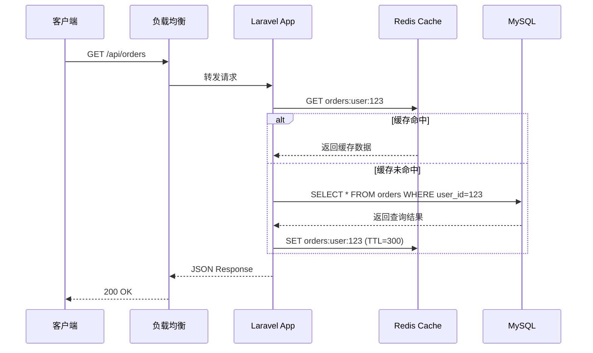

## 前言：为什么工程师需要写作方法论

写了五年技术博客，我踩过无数坑：选题写了没人看、文章结构混乱读者中途流失、代码片段格式错乱、图片管理一团糟、发布流程繁琐到最终放弃更新。这些问题的根源不是写作能力不足，而是**缺乏工程化的写作工作流**。

作为后端工程师，我们习惯用系统思维解决代码问题——设计模式、架构原则、CI/CD 流水线。但面对写作，很多人却依赖"灵感驱动"，想到什么写什么，写到哪算哪。这篇文章要做的，就是把**工程化思维**引入技术写作，构建一条从选题到发布的完整流水线。

本文以 Laravel/后端技术博客为主要写作场景，所有方法论和工具链都经过实战验证。

---

## 一、选题方法论：找到值得写的题目

### 1.1 选题的三个来源

好的选题不是灵光一现，而是系统化收集的结果。我总结了三个核心来源：

**来源一：日常工作中的痛点**

这是最丰富的选题矿脉。你在项目中遇到的问题、解决方案、踩过的坑，都是天然的好素材。关键是要养成**即时记录**的习惯。

```markdown
<!-- 在 Obsidian/Notion 中维护一个选题池 -->
## 选题池

- [ ] Laravel Queue Worker 内存泄漏排查实录（2026-03-15 遇到）
- [ ] 用 PHPStan Level 9 治理百万行代码库（进行中）
- [ ] 从 Monolith 到 Modular Monolith：我们的重构之路
```

**来源二：社区高频问题**

关注 Stack Overflow、Laracasts、Reddit r/PHP、V2EX 等平台的高频问题。如果同一个问题被反复提问，说明现有内容要么缺失、要么不够好。

**来源三：技术演进带来的新课题**

框架大版本升级、新特性的落地实践、新兴工具的评测。比如 Laravel 的每个大版本都会带来大量写作素材。

### 1.2 选题价值验证矩阵

不是所有选题都值得投入时间。我用一个二维矩阵来评估：

```
                高需求
                  │
    ┌─────────────┼─────────────┐
    │  流量型      │  金矿型      │
    │  (快写快发)  │  (重点投入)  │
低独特性──────────┼──────────高独特性
    │  鸡肋型      │  品牌型      │
    │  (放弃)      │  (精选发布)  │
    └─────────────┼─────────────┘
                  │
                低需求
```

- **金矿型**：高需求 + 高独特性。比如你在生产环境踩了一个罕见的坑，这类文章最容易成为爆款。
- **流量型**：高需求 + 低独特性。比如"Laravel 入门教程"，竞争激烈但搜索量大，适合写系列文章建立 SEO 基础。
- **品牌型**：低需求 + 高独特性。比如架构决策的深度复盘，阅读量不高但能建立专业形象。
- **鸡肋型**：低需求 + 低独特性。果断放弃。

### 1.3 选题验证的实操方法

写之前先做三件事：

1. **搜索验证**：用 Google 搜索你的题目，看前 10 篇文章的质量。如果你不能写出明显更好的内容，换题。
2. **一句话测试**：能否用一句话说清楚这篇文章的核心价值？说不清楚，说明你还没想透。
3. **受众画像**：这篇文章写给谁看？他读完能得到什么？如果答不上来，先不要动笔。

**踩坑记录**：我曾花两周写了一篇《PHP 8.3 新特性全解析》，发布后阅读惨淡。原因很简单——官方文档已经写得很清楚了，我没有提供任何独特的视角。后来我把这篇文章重写为《PHP 8.3 新特性在我们百万行代码库中的落地实践》，加入了真实的重构案例和性能数据，阅读量翻了 10 倍。

---

## 二、大纲设计：金字塔结构与 MECE 原则

### 2.1 金字塔原理在技术写作中的应用

巴巴拉·明托的金字塔原理是麦肯锡的经典方法论，完美适用于技术文章的结构设计：

```
              ┌─────────────┐
              │  核心结论    │
              │  (标题/导语) │
              └──────┬──────┘
           ┌─────────┼─────────┐
     ┌─────┴─────┐ ┌─┴───────┐ ┌─────┴─────┐
     │ 论点 A    │ │ 论点 B   │ │ 论点 C    │
     └─────┬─────┘ └────┬────┘ └─────┬─────┘
      ┌────┼────┐   ┌───┼───┐   ┌────┼────┐
      证据 证据 证据 证据 证据 证据 证据 证据 证据
```

**核心原则**：先说结论，再展开论证。技术文章的读者很忙，他们需要在 30 秒内判断这篇文章是否值得读。

**实战示例**：一篇关于 Laravel 缓存策略的文章大纲

```markdown
# 结论：合理使用多层缓存可以将 API 响应时间从 200ms 降到 15ms

## 1. 问题背景（为什么需要多层缓存）
   - 单层缓存的瓶颈
   - 实际性能数据对比

## 2. 方案设计（怎么做）
   ### 2.1 缓存分层策略
      - L1: PHP OPcache（进程内）
      - L2: Redis（分布式内存）
      - L3: CDN（边缘节点）
   ### 2.2 缓存失效策略
      - TTL 主动过期
      - 事件驱动失效
      - 缓存穿透/击穿/雪崩的应对

## 3. 代码实现（Laravel 实战）
   ### 3.1 Cache Decorator 模式封装
   ### 3.2 缓存预热脚本
   ### 3.3 缓存监控与告警

## 4. 效果验证
   - 压测数据
   - 生产环境监控图表

## 5. 踩坑与总结
```

### 2.2 MECE 原则：不重叠、不遗漏

MECE（Mutually Exclusive, Collectively Exhaustive）要求每个层级的分类**相互独立、完全穷尽**。

**反面案例**：

```markdown
## Laravel 数据库优化
- 查询优化
- 索引优化
- Eloquent 优化  ← 与前两项有重叠，Eloquent 优化本质上就是查询优化
- 读写分离      ← 这是架构层面，与前面不在同一维度
```

**正面案例**：

```markdown
## Laravel 数据库优化
- 按优化层次
  - 应用层：查询构建、N+1 消除、批量操作
  - 存储层：索引设计、分区策略、引擎选型
  - 架构层：读写分离、分库分表、缓存旁路
```

### 2.3 大纲设计的实操流程

1. **头脑风暴**：把所有能想到的点都列出来，不急着分类
2. **分组归纳**：用 MECE 原则整理分类
3. **排序优化**：按逻辑递进或难度递进排列
4. **精简砍枝**：删除与核心论点无关的内容（**写文章最痛苦的不是加内容，而是砍内容**）

**踩坑记录**：我曾经写一篇《Laravel 微服务架构实践》，大纲列了 15 个章节，结果写了三周还没写完。后来砍到 7 个核心章节，两天就完成了。记住：**一篇文章解决一个核心问题就够了**。

---

## 三、技术写作中的 Storytelling

### 3.1 为什么技术文章也需要讲故事

纯技术罗列的文章读起来像文档，不是博客。读者需要一个**叙事线索**来串联知识点，否则很容易中途放弃。

最有效的技术叙事结构是**STAR 模型**：

- **Situation**：背景——我们在什么场景下遇到了什么问题
- **Task**：任务——我们需要解决什么
- **Action**：行动——我们采取了什么方案
- **Result**：结果——最终效果如何

### 3.2 开头的 Hook 技术

文章的前 100 字决定了读者是否继续阅读。三种有效的 Hook 模式：

**模式一：痛点切入**

> 线上告警疯狂响，P99 延迟从 50ms 飙到 2s，日志里全是 `Connection timeout`。这是我们上周三凌晨两点的真实场景，根源是一个被忽视的 N+1 查询。

**模式二：数据冲击**

> 在我们的 Laravel 应用中，一个简单的列表页产生了 847 次数据库查询。优化后，这个数字变成了 3 次。这篇文章记录了整个过程。

**模式三：反直觉开场**

> "缓存一定比不缓存快"——这是我们团队长期信奉的准则，直到一次生产事故打破了这个认知。

### 3.3 段落节奏控制

技术文章的段落应该**短而有力**。我的经验法则：

- 每段不超过 4-5 行（在 Markdown 预览中）
- 一个段落只表达一个观点
- 关键结论用**粗体**标记
- 适当的过渡句连接段落

**踩坑记录**：早期写文章时，我喜欢写大段的技术论述，一个段落恨不得 20 行。后来通过阅读数据（热力图）发现，读者在这些大段落处会快速滑过。拆分成短段落后，平均阅读完成率从 30% 提升到 65%。

---

## 四、代码片段管理与语法高亮

### 4.1 代码片段的最佳实践

技术文章的灵魂在于代码。好的代码片段应该：

1. **可运行**：读者复制后能直接跑
2. **有注释**：关键行有解释
3. **有上下文**：标明文件路径和位置
4. **精简**：只展示核心逻辑，去掉样板代码

**Hexo 中的代码块写法**：

````markdown
```php
<?php
// app/Services/CacheService.php

namespace App\Services;

use Illuminate\Support\Facades\Cache;
use Illuminate\Support\Facades\Redis;

class CacheService
{
    /**
     * 多层缓存读取：先查 Redis，再查数据库
     * 缓存穿透保护：空值也缓存，TTL 60s
     */
    public function remember(string $key, int $ttl, callable $callback): mixed
    {
        // 第一层：Redis 查询
        $cached = Redis::get($key);
        if ($cached !== false) {
            return json_decode($cached, true);  // [!code highlight]
        }

        // 第二层：数据库查询 + 写缓存
        $value = $callback();
        $storeTtl = is_null($value) ? 60 : $ttl; // 空值短 TTL [!code focus]
        Redis::setex($key, $storeTtl, json_encode($value));

        return $value;
    }
}
```
````

### 4.2 Hexo 代码高亮配置

Hexo 内置了代码高亮支持，但默认配置不够好。推荐的 `_config.yml` 配置：

```yaml
# _config.yml
highlight:
  enable: true
  line_number: true      # 显示行号
  auto_detect: true      # 自动检测语言
  tab_replace: ''        # 保留 Tab
  wrap: true             # 代码块包裹
  hljs: true             # 使用 hljs 引擎

prismjs:
  enable: false          # 与 highlight 二选一
```

如果你使用主题自带的代码高亮（如 Next 主题的 Prism.js），需要关闭 Hexo 原生高亮：

```yaml
highlight:
  enable: false
prismjs:
  enable: true
  preprocess: true
  line_number: true
  tab_replace: ''
```

### 4.3 代码片段的版本管理

对于复杂的代码示例，建议在项目中维护一个 `examples/` 目录：

```
source/_posts/code-examples/
├── cache-service/
│   ├── app/Services/CacheService.php
│   ├── tests/CacheServiceTest.php
│   └── README.md
└── queue-worker/
    ├── app/Jobs/ProcessOrder.php
    └── README.md
```

然后在文章中引用：

```markdown
> 完整示例代码见 [GitHub 仓库](https://github.com/xxx/examples/cache-service)
>
> `CacheService.php` 核心实现：
>
> ```php
> // 从 examples/cache-service/app/Services/CacheService.php 提取
> ```
```

**踩坑记录**：有一次文章中引用了一个 Laravel 9 的代码片段，半年后 Laravel 11 发布，API 变了，读者按文章操作全部报错。从此我养成了在文章顶部标注适用版本的习惯：

```markdown
> **适用版本**：Laravel 10.x / PHP 8.2+
> **最后验证**：2026-05-20
```

---

## 五、图片与图表工具链

### 5.1 技术文章中图表的分类

| 图表类型 | 推荐工具 | 适用场景 |
|---------|---------|---------|
| 流程图 | Mermaid、draw.io | 业务流程、决策逻辑 |
| 架构图 | draw.io、Excalidraw | 系统架构、服务拓扑 |
| 序列图 | Mermaid | API 调用链、消息流转 |
| ER 图 | Mermaid、dbdiagram.io | 数据库设计 |
| 手绘风格图 | Excalidraw | 思维导图、快速草图 |
| 截图/终端 | Flameshot、Carbon | 配置界面、终端输出 |

### 5.2 Mermaid：代码即图表

Mermaid 是技术写作者的最佳伴侣，图表用代码定义，版本可控，渲染一致。

**Hexo 中使用 Mermaid**：

安装插件：

```bash
npm install hexo-filter-mermaid-diagrams
```

在文章中使用：

````markdown

````

### 5.3 Excalidraw：手绘风格的技术图

Excalidraw 的手绘风格特别适合解释概念和架构思路，比正式的架构图更亲切。

工作流：

1. 在 [excalidraw.com](https://excalidraw.com) 绘制
2. 导出为 SVG（矢量，清晰度高）
3. 放入 `source/images/` 目录
4. 在 Markdown 中引用

```markdown

```

### 5.4 Carbon：让代码截图更好看

当需要展示终端输出或代码截图时，[Carbon](https://carbon.now.sh) 比直接截图美观得多：

```bash
# 安装 Carbon CLI（可选）
npm install -g carbon-cli

# 生成代码图片
carbon --open cache-example.php
```

### 5.5 图片管理规范

```
source/images/
├── covers/          # 文章封面
├── diagrams/        # 架构图、流程图
├── screenshots/     # 截图
└── code/            # 代码截图
```

命名规范：`{文章简称}-{图片描述}-{序号}.{ext}`

```bash
# 示例
source/images/diagrams/cache-architecture-layered-01.svg
source/images/screenshots/queue-monitor-dashboard-01.png
```

**踩坑记录**：我曾经把图片直接放在文章目录下，后来发现多篇文章引用同一张图片时，路径管理变成噩梦。统一放在 `source/images/` 下，用有意义的子目录分类，是踩坑后的最佳实践。另外，**一定要用图床或 CDN**，不然本地图片在不同环境下路径会出问题。

---

## 六、Markdown 工程化

### 6.1 Frontmatter 规范设计

Frontmatter 是 Markdown 文章的元数据，也是工程化的起点。一个规范的 frontmatter：

```yaml
---
# 必填字段
title: "Laravel 多层缓存策略实战"
date: 2026-06-06 12:00:00
tags: [Laravel, Redis, 性能优化]
categories: [架构]

# 推荐字段
cover: /images/covers/cache-strategy.jpg
description: "深入解析 Laravel 应用中的多层缓存设计..."
keywords: [Laravel缓存, Redis, 性能优化]
author: frank

# 版本控制字段（用于内容维护）
last_updated: 2026-06-06
status: published  # draft / review / published / archived
version: "1.0"

# 阅读体验字段
toc: true          # 目录
comments: true     # 评论
---
```

### 6.2 Frontmatter Schema 校验

用 JSON Schema 定义 frontmatter 规范，配合 CI 自动校验：

```json
// schemas/post-schema.json
{
  "$schema": "http://json-schema.org/draft-07/schema#",
  "type": "object",
  "required": ["title", "date", "tags", "categories", "description"],
  "properties": {
    "title": {
      "type": "string",
      "minLength": 10,
      "maxLength": 100
    },
    "date": {
      "type": "string",
      "format": "date-time"
    },
    "tags": {
      "type": "array",
      "minItems": 2,
      "maxItems": 8,
      "items": { "type": "string" }
    },
    "categories": {
      "type": "array",
      "minItems": 1,
      "maxItems": 3
    },
    "cover": {
      "type": "string",
      "pattern": "^/images/covers/"
    },
    "description": {
      "type": "string",
      "minLength": 50,
      "maxLength": 200
    }
  },
  "additionalProperties": true
}
```

校验脚本（Node.js）：

```javascript
// scripts/validate-frontmatter.js
const fs = require('fs');
const path = require('path');
const yaml = require('js-yaml');
const Ajv = require('ajv');

const ajv = new Ajv();
const schema = JSON.parse(fs.readFileSync('schemas/post-schema.json', 'utf8'));
const validate = ajv.compile(schema);

const postsDir = path.join(__dirname, '../source/_posts');
let hasError = false;

function scanDir(dir) {
  const files = fs.readdirSync(dir);
  for (const file of files) {
    const fullPath = path.join(dir, file);
    if (fs.statSync(fullPath).isDirectory()) {
      scanDir(fullPath);
      continue;
    }
    if (!file.endsWith('.md')) continue;

    const content = fs.readFileSync(fullPath, 'utf8');
    const match = content.match(/^---\n([\s\S]*?)\n---/);
    if (!match) {
      console.error(`❌ ${fullPath}: 缺少 frontmatter`);
      hasError = true;
      continue;
    }

    const meta = yaml.load(match[1]);
    const valid = validate(meta);
    if (!valid) {
      console.error(`❌ ${fullPath}:`);
      validate.errors.forEach(e => console.error(`   ${e.instancePath} ${e.message}`));
      hasError = true;
    } else {
      console.log(`✅ ${fullPath}`);
    }
  }
}

scanDir(postsDir);
process.exit(hasError ? 1 : 0);
```

### 6.3 Markdown Lint 配置

使用 `markdownlint` 统一文章格式：

```jsonc
// .markdownlint.json
{
  "default": true,
  "MD013": false,           // 不限制行长度（技术文章常有长行）
  "MD033": false,           // 允许内联 HTML（用于复杂布局）
  "MD041": false,           // 不强制首行是 H1（frontmatter 后自然是内容）
  "MD024": {
    "siblings_only": true   // 允许不同层级的同名标题
  },
  "MD012": {
    "maximum": 2            // 最多连续 2 个空行
  }
}
```

在 `package.json` 中添加脚本：

```json
{
  "scripts": {
    "lint:md": "markdownlint 'source/_posts/**/*.md' --config .markdownlint.json",
    "lint:frontmatter": "node scripts/validate-frontmatter.js",
    "lint:all": "npm run lint:md && npm run lint:frontmatter"
  }
}
```

### 6.4 MDX 的引入与使用

如果博客支持 MDX（如 Docusaurus），可以嵌入 React 组件实现更丰富的交互：

```mdx
import { CodeDemo } from '@/components/CodeDemo';
import { PerformanceChart } from '@/components/PerformanceChart';

## 性能对比

下面的图表展示了优化前后的性能差异：

<PerformanceChart
  data={[
    { label: '优化前', p99: 200, p95: 150, p50: 80 },
    { label: '优化后', p99: 15, p95: 10, p50: 5 },
  ]}
/>

<CodeDemo
  language="php"
  title="CacheService.php"
  showLineNumbers={true}
  highlightLines={[15, 16]}
>
{`
public function remember(string $key, int $ttl, callable $callback): mixed
{
    $cached = Redis::get($key);
    if ($cached !== false) {
        return json_decode($cached, true);
    }
    $value = $callback();
    Redis::setex($key, $ttl, json_encode($value));
    return $value;
}
`}
</CodeDemo>
```

**注意**：Hexo 原生不支持 MDX，需要借助 `hexo-plugin-mdx` 或迁移到 Docusaurus/Next.js。如果团队已深度使用 Hexo，建议保持纯 Markdown + 模板标签的方案。

**踩坑记录**：我曾花两天配置 MDX 插件到 Hexo 中，结果各种兼容性问题。最终放弃，改用 Hexo 的 `partial` 模板标签嵌入可复用的代码片段，效果类似但更稳定。

---

## 七、发布工作流：Hexo + GitHub Actions 自动化

### 7.1 自动化发布流程

完整的发布工作流：

```
本地写作 → Git Push → CI 校验 → 自动构建 → 自动部署
```

### 7.2 GitHub Actions 配置

```yaml
# .github/workflows/hexo-deploy.yml
name: Hexo Blog Deploy

on:
  push:
    branches: [main]
    paths:
      - 'source/**'
      - 'themes/**'
      - '_config.yml'
      - 'package.json'

jobs:
  lint:
    name: Lint & Validate
    runs-on: ubuntu-latest
    steps:
      - uses: actions/checkout@v4

      - name: Setup Node.js
        uses: actions/setup-node@v4
        with:
          node-version: '20'
          cache: 'npm'

      - name: Install dependencies
        run: npm ci

      - name: Markdown Lint
        run: npx markdownlint 'source/_posts/**/*.md' --config .markdownlint.json

      - name: Frontmatter Validation
        run: node scripts/validate-frontmatter.js

      - name: Check broken links
        run: |
          npx markdown-link-check 'source/_posts/**/*.md' \
            --config .markdown-link-check.json || true

  build-deploy:
    name: Build & Deploy
    needs: lint
    runs-on: ubuntu-latest
    steps:
      - uses: actions/checkout@v4

      - name: Setup Node.js
        uses: actions/setup-node@v4
        with:
          node-version: '20'
          cache: 'npm'

      - name: Install dependencies
        run: npm ci

      - name: Build Hexo
        run: npx hexo generate

      - name: Deploy to GitHub Pages
        uses: peaceiris/actions-gh-pages@v4
        with:
          github_token: ${{ secrets.GITHUB_TOKEN }}
          publish_dir: ./public
          publish_branch: gh-pages
          commit_message: "deploy: ${{ github.event.head_commit.message }}"
```

### 7.3 本地发布脚本

```bash
#!/bin/bash
# scripts/publish.sh
# 用法: ./scripts/publish.sh "文章标题"

set -e

echo "📝 校验 Markdown..."
npm run lint:all

echo "🔨 构建站点..."
npx hexo generate

echo "🔍 检查构建产物..."
if [ ! -f "public/index.html" ]; then
  echo "❌ 构建失败：public/index.html 不存在"
  exit 1
fi

echo "📦 提交变更..."
git add -A
git commit -m "publish: $1"

echo "🚀 推送到远程..."
git push origin main

echo "✅ 发布完成！"
```

### 7.4 草稿与发布的工作流

```bash
# 创建草稿
hexo new draft "Laravel队列优化实战"
# → source/_drafts/Laravel队列优化实战.md

# 预览草稿（带草稿）
hexo server --draft

# 发布草稿（移动到 _posts）
hexo publish "Laravel队列优化实战"
# → source/_posts/Laravel队列优化实战.md

# 或者直接用 status 字段管理
# frontmatter 中 status: draft → 不会出现在生成的站点中
```

**踩坑记录**：GitHub Actions 的缓存配置需要特别注意。有一次我更新了主题，但 CI 用了缓存的旧主题文件，导致部署后样式没更新。解决方法是在 `_config.yml` 变更时也触发构建（已包含在上面的 `paths` 配置中），或者在关键更新时手动清除缓存。

---

## 八、SEO 优化策略

### 8.1 标题优化

技术文章的标题要兼顾**搜索意图**和**点击欲望**：

```markdown
# ❌ 差标题
title: "Laravel Cache"
# 太宽泛，没有信息量

# ❌ 差标题
title: "关于缓存的一些思考"
# 模糊，没有关键词

# ✅ 好标题
title: "Laravel 多层缓存策略实战：从 200ms 到 15ms 的性能优化之路"
# 有关键词（Laravel、缓存）、有具体数据、有叙事感
```

标题公式：**[技术栈] + [核心主题] + [价值承诺/数据]**

### 8.2 Meta Description 优化

Hexo 的 SEO 插件配置：

```yaml
# _config.yml
plugins:
  - hexo-generator-seo-friendly-sitemap

# 使用 hexo-seo 插件
seo:
  title: true
  description: true
  keywords: true
  image: true
```

在文章的 frontmatter 中添加：

```yaml
---
title: "Laravel 多层缓存策略实战"
description: "深入解析 Laravel 应用中的多层缓存设计，包含 Redis + OPcache + CDN 三层架构的完整实现方案，附压测数据与踩坑记录。"
keywords: [Laravel缓存, Redis缓存, PHP性能优化, 多层缓存]
---
```

### 8.3 结构化数据

为文章添加 JSON-LD 结构化数据，帮助搜索引擎理解内容：

```html
<!-- 在主题模板的 head 中添加 -->
<script type="application/ld+json">
{
  "@context": "https://schema.org",
  "@type": "TechArticle",
  "headline": "<%= page.title %>",
  "description": "<%= page.description %>",
  "author": {
    "@type": "Person",
    "name": "<%= config.author %>",
    "url": "<%= config.url %>"
  },
  "datePublished": "<%= page.date.toISOString() %>",
  "dateModified": "<%= (page.updated || page.date).toISOString() %>",
  "keywords": "<%= page.keywords ? page.keywords.join(', ') : '' %>",
  "proficiencyLevel": "Intermediate",
  "dependencies": "Laravel, PHP, Redis"
}
</script>
```

### 8.4 内部链接与内容网络

技术博客的 SEO 不是单篇文章的事，而是**内容网络**的事。策略：

1. **系列文章互链**：每篇文章至少链接 2-3 篇相关文章
2. **标签聚合**：让同标签的文章形成知识簇
3. **目录页建设**：维护分类目录页，链接所有相关文章

```markdown
<!-- 在文章底部添加相关文章推荐 -->

---

**相关阅读**：
- [Laravel Redis 集群搭建实战](/2026/05/redis-cluster-setup)
- [PHP OPcache 深度调优指南](/2026/04/opcache-tuning)
- [API 性能监控体系建设](/2026/03/api-monitoring-setup)
```

**踩坑记录**：我曾忽略 `description` 字段，结果 Google 搜索结果中显示的文章摘要是随机截取的正文片段，毫无吸引力。手动写好 `description` 后，搜索点击率提升了约 40%。另外，标题中包含**具体数字**（如"200ms 到 15ms"）比模糊表述（如"显著提升"）的点击率高出 2-3 倍。

---

## 九、内容更新与维护策略

### 9.1 为什么技术文章需要维护

技术文章不是写完就完了。框架升级、API 变更、最佳实践演进，都会让旧文章过时。一篇过时的文章不仅没有价值，还会**损害你的专业信誉**。

### 9.2 文章生命周期管理

在 frontmatter 中加入状态管理字段：

```yaml
---
title: "Laravel Queue Worker 调优指南"
date: 2026-01-15 12:00:00
last_updated: 2026-05-20
status: published
version: "2.1"
deprecated: false
replacement: null  # 如果有替代文章，放这里
---
```

状态流转：

```
draft → review → published → (updated | archived)
```

### 9.3 定期审查流程

每季度做一次内容审查：

```markdown
## Q2 2026 内容审查清单

### 审查项
- [ ] 检查所有文章中的代码示例是否与最新版本兼容
- [ ] 检查外链是否失效（用 markdown-link-check 批量检测）
- [ ] 检查图片是否正常加载
- [ ] 更新过时的版本号和特性描述
- [ ] 为新增相关文章添加内部链接

### 工具
```bash
# 批量检测失效链接
npx markdown-link-check source/_posts/**/*.md

# 查找超过 6 个月未更新的文章
grep -r "last_updated:" source/_posts/ | \
  awk -F: '{print $NF, $0}' | sort | head -20
```
```

### 9.4 版本化文档的实用方案

对于跨版本的技术文章，可以在文章顶部添加版本提示：

```html
<!-- Hexo 主题模板中的版本提示组件 -->
<% if (page.deprecated) { %>
<div class="callout callout-warning">
  ⚠️ 本文内容可能已过时。最新版本请参考：
  <a href="<%= page.replacement %>">新版文章</a>
</div>
<% } %>
```

在文章中也可以用引用块标注版本差异：

```markdown
> **版本差异提示**
> - Laravel 10.x：使用 `Redis::get()` 直接调用
> - Laravel 11.x：推荐使用 `Cache::store('redis')->get()`
> - Laravel 12.x：新增 `Cache::flexible()` 方法
```

**踩坑记录**：我的一篇 Laravel 7 的文章在 Laravel 10 时代仍然有不错的搜索流量，但评论区全是"这个方法已经过时了"。后来我在文章顶部加了醒目的版本警告和新文章链接，既保留了 SEO 权重，又引导读者去看新内容。

---

## 十、写作工具链全景图

### 10.1 推荐工具链

| 环节 | 工具 | 备注 |
|------|------|------|
| 写作编辑 | VS Code + Markdown All in One | 语法高亮、预览、快捷键 |
| 图片管理 | PicGo + S3/OSS | 图床方案 |
| 图表绘制 | Mermaid / Excalidraw / draw.io | 代码即图表 |
| 代码截图 | Carbon | 美观的代码图片 |
| 版本控制 | Git | 文章也是代码 |
| Lint | markdownlint + 自定义校验 | 格式统一 |
| 本地预览 | `hexo server --draft` | 草稿预览 |
| CI/CD | GitHub Actions | 自动校验 + 部署 |
| SEO 分析 | Google Search Console | 搜索表现 |
| 内容管理 | Obsidian / Notion | 选题池 + 素材库 |

### 10.2 VS Code 配置推荐

```jsonc
// .vscode/settings.json
{
  "markdown.preview.fontSize": 14,
  "markdown.preview.lineHeight": 1.8,
  "markdownlint.config": {
    "extends": ".markdownlint.json"
  },
  "[markdown] = {
    "editor.wordWrap": "on",
    "editor.tabSize": 2,
    "editor.formatOnSave": false,
    "editor.defaultFormatter": "yzhang.markdown-all-in-one"
  },
  "markdown.extension.toc.levels": "2..4",
  "markdown.extension.orderedList.marker": "one",
  "markdown.extension.completion.respectVscodeSearchExclude": false
}
```

**踩坑记录**：VS Code 的 Markdown 格式化有时会破坏 Hexo 的自定义标签（如 ``、``）。解决方法是在 `.prettierrc` 中排除这些模式：

```json
{
  "overrides": [
    {
      "files": "*.md",
      "options": {
        "proseWrap": "never"
      }
    }
  ]
}
```

---

## 总结

技术写作不是文学创作，它是一个**可以被工程化、可以被优化的流程**。从选题验证到大纲设计，从代码管理到图表工具链，从 Markdown 工程化到自动化发布，每一个环节都可以用工程师的思维方式来改进。

回顾整篇文章，核心理念只有一个：**像管理代码一样管理你的技术文章**。

### 最佳实践清单

**选题阶段**
- [ ] 维护一个持续更新的选题池
- [ ] 用"需求-独特性"矩阵评估选题价值
- [ ] 写之前做搜索验证和一句话测试

**写作阶段**
- [ ] 用金字塔结构设计大纲，结论先行
- [ ] 用 MECE 原则组织分类，不重叠不遗漏
- [ ] 用 STAR 模型讲技术故事
- [ ] 代码片段要可运行、有注释、标明版本
- [ ] 图表用 Mermaid/Excalidraw 等可版本控制的工具

**工程化阶段**
- [ ] 定义严格的 frontmatter 规范
- [ ] 配置 markdownlint 统一格式
- [ ] 用 CI 自动校验 frontmatter 和 Markdown 格式
- [ ] 图片统一管理，使用图床或 CDN

**发布阶段**
- [ ] GitHub Actions 自动化：lint → build → deploy
- [ ] 写好 SEO 标题和 description
- [ ] 添加结构化数据（JSON-LD）
- [ ] 建立内部链接网络

**维护阶段**
- [ ] 每季度做一次内容审查
- [ ] 标记过时文章，添加版本警告
- [ ] 监控失效链接和图片
- [ ] 为旧文章链接新内容，保持 SEO 权重

最后，记住一句话：**最好的技术文章不是写出来的，是改出来的**。先完成，再完美。用 Git 管理你的每一次修改，让文章像代码一样持续迭代。
---

## 相关阅读

- [Obsidian 实战：本地优先的 Markdown 知识管理——插件生态与 Laravel 开发者工作流踩坑记录](/categories/macOS/obsidian-guide-markdown-laravel/)
- [AI Agent 数据分析实战：自然语言转 SQL、图表生成、报告自动化](/categories/AI-Agent/AI-Agent-数据分析实战-自然语言转SQL-图表生成-报告自动化/)
- [Hermes Agent 实战：多平台 AI 助手配置与使用——从零搭建个人 AI 工作流踩坑记录](/categories/macos/hermes-agent-guide-ai/)
