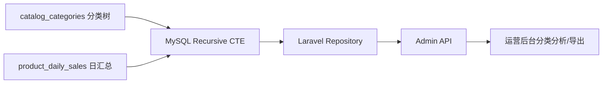

---

title: MySQL-CTE-递归查询实战-树形结构层级分析与路径聚合
keywords: [MySQL, CTE, 递归查询实战, 树形结构层级分析与路径聚合, 数据库]
date: 2026-05-05 12:30:11
updated: 2026-05-05 12:34:25
categories:
  - database
tags:
- Laravel
- MySQL
description: 基于 Laravel B2C 后台真实树形分类与运营报表场景，拆解 MySQL 8 Recursive CTE 在层级展开、路径聚合、子树汇总中的落地方式，重点记录索引设计、环数据防护、路径截断与临时表放大的真实踩坑。
cover: https://images.unsplash.com/photo-1544383835-bda2bc66a55d?w=1200&h=630&fit=crop
images:
- /images/content/databases-001-content-1.jpg
- /images/content/databases-001-content-2.jpg
---


## 前言：为什么我会把树形遍历从 PHP 挪回 SQL

后台最容易被低估的一类需求，不是下单，不是支付，而是“分类树、渠道树、组织树”这类层级数据。早期我们常见写法是：先把整张表查出来，再在 Laravel Collection 里递归组装、过滤、统计。数据量小时没问题，一旦运营开始要“某个根节点下所有子分类 GMV、深度、完整路径、是否叶子节点”，PHP 端递归就会出现三个问题：查太多、算太慢、口径不一致。

我后来把这类逻辑统一收回 MySQL 8 的 `WITH RECURSIVE`。原因很现实：**树的展开、层级深度、路径拼接、本级与子级汇总，本来就是 SQL 更擅长的集合运算。** PHP 适合做展示整形，不适合做全量树遍历。

---

## 一、场景建模：分类表 + 商品汇总表


先看一个线上常见结构，`catalog_categories` 维护树，`product_daily_sales` 存聚合销量：

```sql
CREATE TABLE catalog_categories (
    id BIGINT UNSIGNED PRIMARY KEY AUTO_INCREMENT,
    parent_id BIGINT UNSIGNED NULL,
    name VARCHAR(100) NOT NULL,
    sort INT NOT NULL DEFAULT 0,
    is_enabled TINYINT(1) NOT NULL DEFAULT 1,
    KEY idx_parent_sort (parent_id, sort, id),
    KEY idx_enabled_parent (is_enabled, parent_id)
);

CREATE TABLE product_daily_sales (
    stat_date DATE NOT NULL,
    category_id BIGINT UNSIGNED NOT NULL,
    paid_orders INT UNSIGNED NOT NULL DEFAULT 0,
    paid_amount DECIMAL(12,2) NOT NULL DEFAULT 0,
    PRIMARY KEY (stat_date, category_id),
    KEY idx_category_date (category_id, stat_date)
);
```

我们的目标不是只拿一层 children，而是：**给定根分类，递归展开整棵子树，并按节点汇总近 30 天销售额。**

### 架构图



这个结构的重点是：递归只负责“找出子树节点集合”，销售表仍然走预聚合，不直接扫订单明细。否则 CTE 写得再漂亮，也只是把慢查询换一种姿势再慢一次。

---

## 二、核心 SQL：展开子树、生成路径、计算深度

先用递归 CTE 从根节点往下找：

```sql
WITH RECURSIVE category_tree AS (
    SELECT
        id,
        parent_id,
        name,
        sort,
        0 AS depth,
        CAST(id AS CHAR(200)) AS path_ids,
        CAST(name AS CHAR(500)) AS path_names
    FROM catalog_categories
    WHERE id = 1001 AND is_enabled = 1

    UNION ALL

    SELECT
        c.id,
        c.parent_id,
        c.name,
        c.sort,
        ct.depth + 1 AS depth,
        CONCAT(ct.path_ids, '/', c.id) AS path_ids,
        CONCAT(ct.path_names, ' > ', c.name) AS path_names
    FROM catalog_categories c
    INNER JOIN category_tree ct ON c.parent_id = ct.id
    WHERE c.is_enabled = 1
      AND FIND_IN_SET(c.id, REPLACE(ct.path_ids, '/', ',')) = 0
)
SELECT *
FROM category_tree
ORDER BY path_ids;
```

这段 SQL 在后台非常实用：

- `depth` 可直接给前端做缩进
- `path_names` 可直接做面包屑导出
- `path_ids` 能辅助排查串层级问题
- `FIND_IN_SET` 是最低成本的防环保护，避免脏数据把递归跑爆

很多人只写到“查出所有后代”就停了，但生产上真正有价值的是**把路径和深度一起算出来**，这样接口就不用在 PHP 再做第二次递归。

---

## 三、把递归结果接到报表：子树 GMV 汇总

查出节点集合后，再关联销售聚合表：

```sql
WITH RECURSIVE category_tree AS (
    SELECT id, parent_id, name, 0 AS depth
    FROM catalog_categories
    WHERE id = ? AND is_enabled = 1

    UNION ALL

    SELECT c.id, c.parent_id, c.name, ct.depth + 1
    FROM catalog_categories c
    INNER JOIN category_tree ct ON c.parent_id = ct.id
    WHERE c.is_enabled = 1
), sales_30d AS (
    SELECT
        category_id,
        SUM(paid_orders) AS total_orders,
        SUM(paid_amount) AS total_amount
    FROM product_daily_sales
    WHERE stat_date BETWEEN ? AND ?
    GROUP BY category_id
)
SELECT
    ct.id,
    ct.parent_id,
    ct.name,
    ct.depth,
    COALESCE(s.total_orders, 0) AS total_orders,
    COALESCE(s.total_amount, 0) AS total_amount
FROM category_tree ct
LEFT JOIN sales_30d s ON s.category_id = ct.id
ORDER BY ct.depth ASC, ct.id ASC;
```

如果还要“每个父节点包含全部后代的总和”，我不会在 PHP for-loop 累加，而是再包一层 descendants 映射：

```sql
WITH RECURSIVE descendants AS (
    SELECT id AS root_id, id AS node_id
    FROM catalog_categories
    WHERE id = ?

    UNION ALL

    SELECT d.root_id, c.id AS node_id
    FROM descendants d
    INNER JOIN catalog_categories c ON c.parent_id = d.node_id
)
SELECT
    d.root_id,
    SUM(s.paid_amount) AS subtree_amount
FROM descendants d
INNER JOIN product_daily_sales s ON s.category_id = d.node_id
WHERE s.stat_date BETWEEN ? AND ?
GROUP BY d.root_id;
```

这类写法在“频道页/类目页业绩归因”里特别稳，因为数据库天然知道怎么做集合聚合，代码口径也统一。

---

## 四、Laravel 落地：Repository 不要把树遍历写回 PHP

我在 Laravel 里通常直接保留原生 SQL，因为 Query Builder 对递归 CTE 可读性一般：

```php
<?php

namespace App\Repositories;

use Illuminate\Support\Facades\DB;

class CategoryReportRepository
{
    public function getTreeReport(int $rootId, string $startDate, string $endDate): array
    {
        $sql = <<<'SQL'
WITH RECURSIVE category_tree AS (
    SELECT id, parent_id, name, 0 AS depth
    FROM catalog_categories
    WHERE id = ? AND is_enabled = 1

    UNION ALL

    SELECT c.id, c.parent_id, c.name, ct.depth + 1
    FROM catalog_categories c
    INNER JOIN category_tree ct ON c.parent_id = ct.id
    WHERE c.is_enabled = 1
), sales_30d AS (
    SELECT category_id, SUM(paid_orders) AS total_orders, SUM(paid_amount) AS total_amount
    FROM product_daily_sales
    WHERE stat_date BETWEEN ? AND ?
    GROUP BY category_id
)
SELECT ct.id, ct.parent_id, ct.name, ct.depth,
       COALESCE(s.total_orders, 0) AS total_orders,
       COALESCE(s.total_amount, 0) AS total_amount
FROM category_tree ct
LEFT JOIN sales_30d s ON s.category_id = ct.id
ORDER BY ct.depth, ct.id
SQL;

        return DB::select($sql, [$rootId, $startDate, $endDate]);
    }
}
```

这里我坚持两件事：第一，**绑定参数，不拼接 SQL**；第二，**递归结果集直接返回 DTO/Resource**，不要又塞回 Collection 重新建树，不然你只是把数据库递归换成 PHP 递归，白折腾一圈。

---

## 五、真实踩坑记录


### 坑 1：没做防环，脏数据直接把查询跑满

曾经有人手工修数据，把 A 的父节点指到 B，B 又指回 A。结果 CTE 一跑，直到命中 `cte_max_recursion_depth` 才报错。后来我固定做两层防护：

1. 应用层禁止形成环
2. SQL 层用 `path_ids` 做 visited 集合兜底

### 坑 2：路径字段长度不够，被 MySQL 静默截断

一开始 `CAST(name AS CHAR(100))`，分类层级深一点、名称长一点，导出路径直接被截断，后续 `ORDER BY path_names` 也全乱。路径字段一定要按最坏情况留足空间，宁愿 500/1000，也别抠那点字符数。

### 坑 3：递归结果很小，关联表却扫很大

很多慢 SQL 不在 CTE 本身，而在后面的 JOIN。比如 `product_daily_sales` 没有 `(category_id, stat_date)` 索引，CTE 找出了 80 个节点，后面依然可能扫整个月报表表。**递归负责找集合，索引负责把集合查快**，这两个问题不能混为一谈。

### 坑 4：按路径排序看起来正确，实际兄弟节点顺序错乱

`ORDER BY path_ids` 在 `1/10` 和 `1/2` 这种场景会出现字典序问题。后来我的做法是前端主要按 `depth + sort` 展示，导出若必须稳定路径顺序，就在路径里对 `sort` 或 `id` 做定宽补零，例如 `LPAD(id, 10, '0')`。

---

## 六、什么时候该用递归 CTE，什么时候别用

适合：分类树、代理链、组织架构、菜单权限、评论楼层、区域树。  
不适合：超深层图遍历、频繁跨层复杂统计、强依赖遍历顺序控制的图算法。

如果你的需求已经接近"图数据库查询"，或者递归深度常常几十上百层，MySQL Recursive CTE 能做，但未必是最优解。对大多数后台树形场景，它已经够强；但别把它当图引擎来滥用。

---

## 七、更多 CTE 实战场景

### 场景 A：递归构建分类面包屑路径

在电商后台中，给定任意叶子节点 ID，快速生成从根到该节点的完整面包屑路径，常用于商品详情页 SEO 面包屑、后台快速定位分类位置：

```sql
WITH RECURSIVE breadcrumb AS (
    SELECT id, parent_id, name, CAST(name AS CHAR(1000)) AS full_path, 0 AS level
    FROM catalog_categories
    WHERE id = 8882  -- 任意叶子节点

    UNION ALL

    SELECT c.id, c.parent_id, c.name,
           CONCAT(c.name, ' > ', b.full_path),
           b.level + 1
    FROM catalog_categories c
    INNER JOIN breadcrumb b ON c.id = b.parent_id
)
SELECT full_path, level AS depth
FROM breadcrumb
WHERE parent_id IS NULL;
```

这条 SQL 从叶子向上回溯，直到到达根节点（`parent_id IS NULL`），最终输出形如 `电子产品 > 手机通讯 > 智能手机 > iPhone 15` 的完整路径。注意 `CONCAT` 的拼接方向：从子到父逐级前缀，最终结果自然是从根到叶。

### 场景 B：组织架构层级遍历

企业 HR 系统中常见的组织架构树查询——给定某个部门，递归展开所有下级部门，并标记每级负责人：

```sql
CREATE TABLE departments (
    id BIGINT UNSIGNED PRIMARY KEY AUTO_INCREMENT,
    parent_id BIGINT UNSIGNED NULL,
    name VARCHAR(100) NOT NULL,
    manager_name VARCHAR(100) NOT NULL DEFAULT '',
    level_code VARCHAR(200) NOT NULL DEFAULT '',
    KEY idx_parent (parent_id)
);

WITH RECURSIVE org_tree AS (
    SELECT
        id, parent_id, name, manager_name,
        0 AS depth,
        CAST(id AS CHAR(500)) AS path_ids,
        CONCAT(name, '(', manager_name, ')') AS full_label
    FROM departments
    WHERE id = 1

    UNION ALL

    SELECT
        d.id, d.parent_id, d.name, d.manager_name,
        ot.depth + 1,
        CONCAT(ot.path_ids, '/', d.id),
        CONCAT(ot.full_label, ' > ', d.name, '(', d.manager_name, ')')
    FROM departments d
    INNER JOIN org_tree ot ON d.parent_id = ot.id
    WHERE ot.depth < 20  -- 深度限制：防止无限递归
)
SELECT * FROM org_tree ORDER BY path_ids;
```

注意 `WHERE ot.depth < 20` 这一行——这是**深度限制**的最佳实践。MySQL 8 默认 `cte_max_recursion_depth = 1000`，但在脏数据存在时，1000 次迭代足够打爆 CPU。显式限制深度比依赖全局参数更安全，也更容易在文档里说明"我们最多支持 20 层"。

### 场景 C：物料清单（BOM）展开

制造业和电商中常见的物料清单递归展开——一个成品由哪些组件构成，每个组件又由哪些子组件构成，递归展开后汇总成本：

```sql
CREATE TABLE bom_items (
    id BIGINT UNSIGNED PRIMARY KEY AUTO_INCREMENT,
    parent_product_id BIGINT UNSIGNED NULL,
    product_id BIGINT UNSIGNED NOT NULL,
    quantity DECIMAL(12,4) NOT NULL DEFAULT 1.0000,
    unit_cost DECIMAL(12,2) NOT NULL DEFAULT 0.00,
    KEY idx_parent_product (parent_product_id),
    KEY idx_product (product_id)
);

-- 给定成品，递归展开所有子物料，计算每层总成本
WITH RECURSIVE bom_expand AS (
    SELECT
        parent_product_id,
        product_id,
        quantity,
        unit_cost,
        quantity * unit_cost AS line_cost,
        0 AS depth,
        CAST(product_id AS CHAR(500)) AS product_path
    FROM bom_items
    WHERE parent_product_id = 1001  -- 成品 ID

    UNION ALL

    SELECT
        b.parent_product_id,
        b.product_id,
        be.quantity * b.quantity AS quantity,
        b.unit_cost,
        be.quantity * b.quantity * b.unit_cost AS line_cost,
        be.depth + 1,
        CONCAT(be.product_path, '->', b.product_id)
    FROM bom_items b
    INNER JOIN bom_expand be ON b.parent_product_id = be.product_id
    WHERE be.depth < 15
)
SELECT
    product_id,
    SUM(quantity) AS total_quantity,
    SUM(line_cost) AS total_cost,
    MAX(depth) AS max_depth
FROM bom_expand
GROUP BY product_id
ORDER BY total_cost DESC;
```

### Laravel Eloquent / DB Facade 实现 BOM 展开

```php
<?php

namespace App\Services;

use Illuminate\Support\Facades\DB;

class BomService
{
    /**
     * 递归展开物料清单，返回每层物料用量和成本
     */
    public function expandBom(int $productId, float $baseQuantity = 1.0): array
    {
        $sql = <<<'SQL'
WITH RECURSIVE bom_expand AS (
    SELECT
        parent_product_id, product_id,
        quantity * :base_qty AS quantity,
        unit_cost,
        quantity * :base_qty * unit_cost AS line_cost,
        0 AS depth
    FROM bom_items
    WHERE parent_product_id = :product_id

    UNION ALL

    SELECT
        b.parent_product_id, b.product_id,
        be.quantity * b.quantity AS quantity,
        b.unit_cost,
        be.quantity * b.quantity * b.unit_cost AS line_cost,
        be.depth + 1
    FROM bom_items b
    INNER JOIN bom_expand be ON b.parent_product_id = be.product_id
    WHERE be.depth < 15
)
SELECT product_id, SUM(quantity) AS total_qty, SUM(line_cost) AS total_cost
FROM bom_expand
GROUP BY product_id
ORDER BY total_cost DESC
SQL;

        return DB::select($sql, [
            'base_qty'     => $baseQuantity,
            'product_id'   => $productId,
        ]);
    }
}
```

注意这里用**命名绑定**（`:base_qty`、`:product_id`）而非位置占位符，可读性更好，也更不容易在参数多时放错位置。

### Laravel 中组织架构查询封装

```php
<?php

namespace App\Repositories;

use Illuminate\Support\Facades\DB;

class DepartmentRepository
{
    /**
     * 获取指定部门的完整组织架构树
     */
    public function getOrgTree(int $rootDeptId, int $maxDepth = 20): array
    {
        $sql = <<<'SQL'
WITH RECURSIVE org_tree AS (
    SELECT id, parent_id, name, manager_name,
           0 AS depth,
           CONCAT(name, '(', manager_name, ')') AS full_label
    FROM departments
    WHERE id = :root_id

    UNION ALL

    SELECT d.id, d.parent_id, d.name, d.manager_name,
           ot.depth + 1,
           CONCAT(ot.full_label, ' > ', d.name, '(', d.manager_name, ')')
    FROM departments d
    INNER JOIN org_tree ot ON d.parent_id = ot.id
    WHERE ot.depth < :max_depth
)
SELECT * FROM org_tree ORDER BY depth, id
SQL;

        return DB::select($sql, [
            'root_id'   => $rootDeptId,
            'max_depth' => $maxDepth,
        ]);
    }
}
```

---

## 八、CTE vs 子查询 vs 临时表：性能对比

在实际选型时，三者各有取舍。下面这张表汇总了核心差异：

| 维度 | WITH RECURSIVE CTE | 子查询（Subquery） | 临时表（TEMPORARY TABLE） |
|------|-------------------|-------------------|------------------------|
| 可读性 | ⭐⭐⭐ 语义清晰，逻辑集中 | ⭐⭐ 嵌套多时难维护 | ⭐ 需要多条独立 SQL |
| 复用性 | ⭐⭐⭐ 同一查询中可多次引用 | ⭐ 每次必须重写 | ⭐⭐⭐ 存在后可重复查询 |
| MySQL 物化策略 | 递归部分自动物化到内存表 | 优化器决定是否物化 | 显式物化，可控性强 |
| 深度控制 | 需手动限制 `depth < N` | 天然一层 | 手动循环或应用层控制 |
| 防环机制 | `FIND_IN_SET` 或 `depth` 限制 | 不适用 | 不适用 |
| 适合场景 | 树形遍历、层级展开、路径拼接 | 单层过滤、聚合比较 | 复杂多步分析、需要多次复用中间结果 |
| 索引要求 | 递归表必须有 `parent_id` 索引 | 取决于具体写法 | 取决于建表语句 |
| 典型风险 | 脏数据导致无限递归 | 子查询标量不一致报错 | 锁竞争、事务中使用受限 |

**选型建议**：如果是单次树形查询且深度有限（分类树、组织树、BOM），优先用 CTE；如果需要多次复用中间结果集做多维度分析，临时表更合适；如果只是简单的一层过滤聚合，子查询足够。

---

## 九、递归 CTE 索引优化要点

递归 CTE 的性能瓶颈通常不在递归本身，而在于**每次迭代的 JOIN 效率**。以下索引策略直接决定递归速度：

### 必须有的索引

```sql
-- 递归 JOIN 的核心条件：c.parent_id = ct.id
-- 因此 parent_id 列必须有索引
ALTER TABLE catalog_categories ADD INDEX idx_parent_id (parent_id);

-- 如果递归 WHERE 中有额外过滤条件（如 is_enabled）
-- 组合索引更高效
ALTER TABLE catalog_categories ADD INDEX idx_enabled_parent (is_enabled, parent_id);
```

### 关联表的索引

递归 CTE 的结果集关联其他表时，关联列同样需要索引：

```sql
-- product_daily_sales 的 JOIN 条件：category_id = ct.id
-- 已有主键 (stat_date, category_id)，但如果 CTE 结果不带日期过滤
-- 则需要单独的 category_id 索引
ALTER TABLE product_daily_sales ADD INDEX idx_category (category_id);
```

### 防环查询中的索引

如果使用 `FIND_IN_SET(c.id, REPLACE(ct.path_ids, '/', ','))` 做防环，注意这是一个**逐行计算**，MySQL 无法对它使用索引。替代方案是用 `depth` 限制 + 应用层约束来替代字符串匹配防环，性能提升明显：

```sql
-- 推荐：depth 限制 + parent_id 约束（应用层保证无环）
WHERE ot.depth < 20

-- 不推荐：字符串查找防环（每行都要执行 FIND_IN_SET）
WHERE FIND_IN_SET(c.id, REPLACE(ct.path_ids, '/', ',')) = 0
```

### EXPLAIN 分析递归 CTE

MySQL 8 对 `WITH RECURSIVE` 的 EXPLAIN 输出中，你通常会看到一个 `递归` 类型的派生表。关键关注点：

```sql
EXPLAIN WITH RECURSIVE category_tree AS (
    SELECT id, parent_id, name, 0 AS depth
    FROM catalog_categories WHERE id = 1001
    UNION ALL
    SELECT c.id, c.parent_id, c.name, ct.depth + 1
    FROM catalog_categories c
    INNER JOIN category_tree ct ON c.parent_id = ct.id
)
SELECT * FROM category_tree;
```

EXPLAIN 结果解读：

| 字段 | 正常值 | 异常值及含义 |
|------|--------|-------------|
| type（递归行） | `ref` 或 `eq_ref` | `ALL` 说明 parent_id 索引缺失 |
| rows（初始行） | 1（根节点） | 大于 1 说明 WHERE 条件不精确 |
| rows（递归行） | 逐步递增但有限 | 每层翻倍且无界说明可能有环 |
| Extra | `Using index` 或无特殊标记 | `Using filesort` 需要检查 ORDER BY |
| filtered | 100% 或接近 | 低于 50% 说明索引过滤效率差 |

**核心原则**：如果递归部分的 `type` 是 `ALL`，几乎可以确定是缺少 `parent_id` 索引。在生产环境执行前，务必用 `EXPLAIN` 确认递归 JOIN 走索引。

---

## 十、常见陷阱：环检测与深度限制

### 环检测（Cycle Detection）

树形数据中如果存在环（A→B→A），递归 CTE 会无限循环直到命中 `cte_max_recursion_depth`。MySQL 8.0.14+ 支持 `CYCLE` 子句自动检测：

```sql
WITH RECURSIVE category_tree AS (
    SELECT id, parent_id, name, 0 AS depth
    FROM catalog_categories
    WHERE id = 1001 AND is_enabled = 1

    UNION ALL

    SELECT c.id, c.parent_id, c.name, ct.depth + 1
    FROM catalog_categories c
    INNER JOIN category_tree ct ON c.parent_id = ct.id
    WHERE c.is_enabled = 1
) CYCLE id SET is_cycle TO 'Y' DEFAULT 'N'
SELECT * FROM category_tree WHERE is_cycle = 'N';
```

`CYCLE id` 会自动检测 `id` 列是否形成循环，并添加 `is_cycle` 标记。但注意：**生产中不要仅依赖 CYCLE 子句**，因为：
1. 环数据本身是脏数据，应该在写入时拦截
2. CYCLE 检测会增加内存开销（需要维护 visited 集合）
3. 一旦检测到环，后续所有行的递归也会被标记为 `is_cycle = 'Y'`

**最佳实践是三层防护**：
1. **应用层**：保存分类时校验 parent_id 不能形成环（DFS 检测）
2. **数据库层**：加触发器或约束防止 `parent_id = id`
3. **SQL 层**：`depth < N` 作为最后兜底

### 深度限制（Depth Limiting）

`cte_max_recursion_depth` 默认 1000，可通过以下方式调整：

```sql
-- 会话级别调整（推荐）
SET SESSION cte_max_recursion_depth = 100;

-- 全局级别（不推荐，影响所有会话）
SET GLOBAL cte_max_recursion_depth = 100;
```

但更推荐在 SQL 本身限制深度，而非依赖全局参数：

```sql
-- 在递归部分加 WHERE depth < N
WHERE ot.depth < 20
```

理由：全局参数是"一刀切"的防护，不同业务的树深度差异很大。分类树可能 5 层，组织树可能 10 层，BOM 可能 15 层。在 SQL 中显式限制深度，既是性能保护，也是业务约束的体现。

---

## 结语

MySQL 8 的 `WITH RECURSIVE` 对 Laravel 项目最大的价值，不是语法新，而是**把原本散落在 Controller、Service、Collection 里的树形逻辑收回数据库**：节点展开、层级深度、完整路径、子树汇总一次完成。这样接口更稳定，导出口径更统一，性能问题也更容易定位。

我自己的经验是：**先把树查对，再把索引补对，最后再考虑结果整形。** 很多所谓"递归查询慢"，本质上不是 CTE 慢，而是后面的 JOIN、聚合和排序没有设计好。

---

## 相关阅读

- [数据库索引优化实战](/categories/Databases/index-optimization-explain/)
- [MySQL主从复制与读写分离](/categories/Databases/replication/)
- [数据库读写分离实战](/categories/Databases/2026-06-01-database-read-write-split-laravel-middleware-mysql-replication/)
