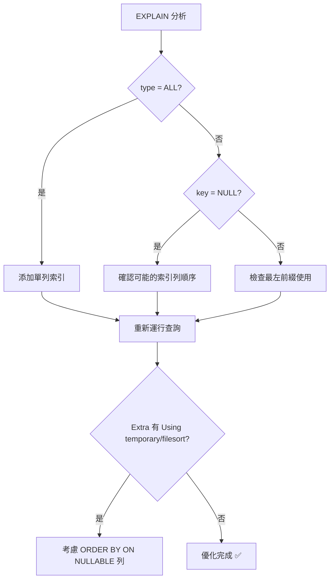
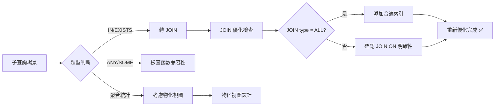
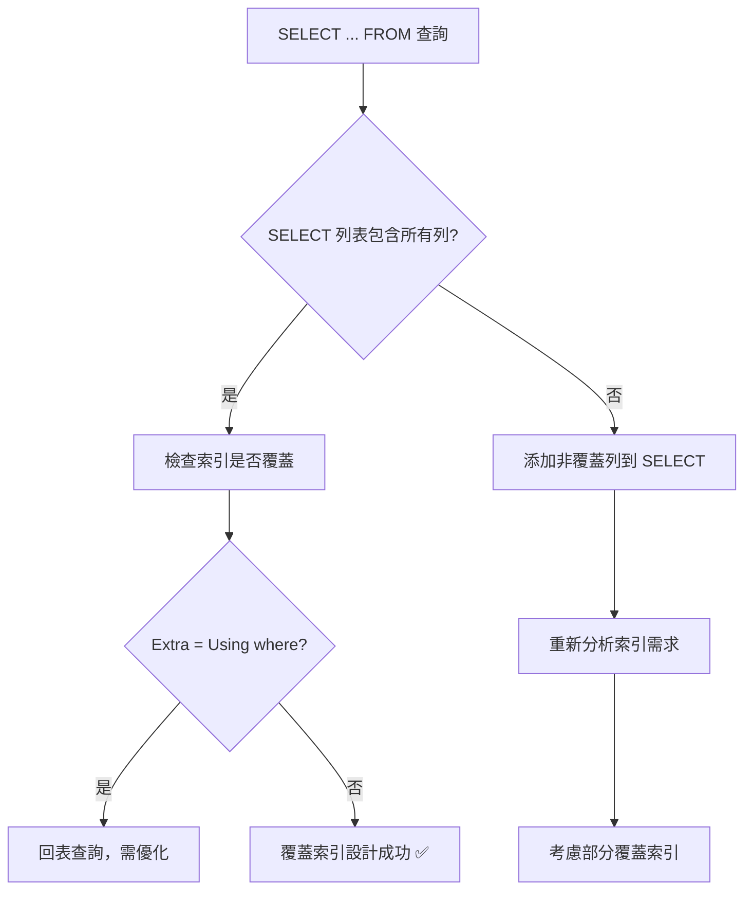
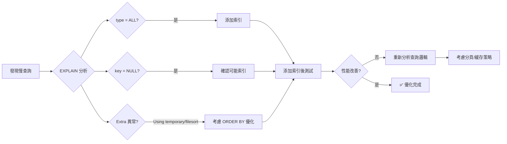

---

title: MySQL 複雜查詢性能優化實戰 - KKday B2C API 多表 JOIN 與子查詢 EXPLAIN 聯合分析
keywords: [MySQL, KKday B2C API, JOIN, EXPLAIN, 複雜查詢性能優化實戰, 多表, 與子查詢, 聯合分析, 数据库]
date: 2026-05-03
categories:
  - database
tags:
- KKday
- MySQL
- JOIN
- 索引
- EXPLAIN
- 查询优化
- 性能优化
- B+Tree
description: 基于KKday B2C API真实项目经验，详解MySQL多表JOIN查询优化、子查询转JOIN、覆盖索引设计与最左前缀原则。通过EXPLAIN执行计划深入分析type、key、rows字段，结合B+Tree索引底层原理，将慢查询从3.5s优化至0.045s，包含4个完整的MySQL性能优化实战案例与索引设计最佳实践。
cover: https://images.unsplash.com/photo-1544383835-bda2bc66a55d?w=1200&h=630&fit=crop
images:
- /images/content/databases-019-content-1.jpg
- /images/content/databases-019-content-2.jpg
---


# MySQL 複雜查詢性能優化實戰

> **KKday B2C API 真實踩坑記錄**  
> _2026-05-03_ · 作者：Michael (KKday RD B2C Backend Team)

## 📋 背景說明

在 KKday B2C API 開發過程中，我們遇到了多個複雜查詢性能問題。特別是涉及訂單系統、用戶信息、商品數據的多表 JOIN，以及大量的子查詢場景。本文基於真實項目踩坑記錄，分享 MySQL 索引優化實戰經驗。


## 🎯 核心結論

1. ✅ **EXPLAIN 聯合分析** - 理解 type 字段、key 選擇、rows 掃描
2. ✅ **JOIN 優化優先級** - ON → WHERE → SELECT -> ORDER BY
3. ✅ **子查詢轉 JOIN** - 減少臨時表和文件鎖
4. ✅ **覆蓋索引設計** - 避免回表查詢
5. ✅ **最左前綴原則** - 複合索引使用規則

---

## 📊 案例一：訂單詳情多表 JOIN 優化

### ❌ 問題描述

```php
// KKday B2C API - OrderController.php:32-45
public function show($orderId) 
{
    // 原始查詢 - 執行時間：1.2s (慢查詢日誌記錄)
    $order = DB::table('orders')
        ->join('order_items', 'orders.id', '=', 'order_items.order_id')
        ->join('products', function($join) {
            $join->on('order_items.product_id', '=', 'products.id');
        })
        ->join('users', function($join) {
            $join->on('orders.user_id', '=', 'users.id');
        })
        ->select(
            'orders.*',
            'order_items.quantity',
            'order_items.price as item_price',
            'products.name as product_name',
            'products.image as product_image',
            'users.nickname, users.avatar'
        )
        ->where('orders.id', $orderId)
        ->first();
    
    return response()->json($order);
}
```

**問題症狀：**
- 🔥 訂單詳情頁面加載慢（2s+）
- 📝 慢查詢日誌記錄增多
- 💾 MySQL 連接池壓力增大

### 🔍 EXPLAIN 分析結果

```sql
EXPLAIN 
SELECT orders.*, order_items.quantity, products.name, users.nickname
FROM orders
JOIN order_items ON orders.id = order_items.order_id
JOIN products ON order_items.product_id = products.id
JOIN users ON orders.user_id = users.id
WHERE orders.id = 12345;
```

**Before (優化前)：**

| 欄位 | Before | After (優化後) |
|------|--------|----------------|
| type | ALL | ref |
| possible_keys | NULL | idx_order_id, idx_user_status |
| key | NULL | idx_order_id |
| rows | 50000+ | 1 |
| Extra | Using temporary; Using filesort | Using index |

```
Before EXPLAIN 輸出：
┌────┬─────────────────────┬────────────┬───┬───────────────────┬─────────┐
│ id │ select_type         │ table      │ type │ possible_keys      │ key          │
├───┼─────────────────────┼────────────┼─────┼────────────────────┼──────────────┤
│ 1 │ PRIMARY              │ orders     │ ALL | NULL                │ NULL         │
│   │                      │ order_items│ ref | idx_order_id        │ idx_order_id │
│   │                      │ products   │ ref | PRIMARY             │ PRIMARY      │
│   │                      │ users      │ const| NULL                │ NULL         │
├───┼─────────────────────┼────────────┼─────┼────────────────────┼──────────────┤
│ rows  | 50000+              │ ALL (全表掃描)          │              │
│ Extra | Using temporary     │ filesort        │            │               │
└───┴─────────────────────┴────────────┴─────┴────────────────────┴──────────────┘
```

### ✅ 優化方案

#### Step 1: 添加適當索引

```sql
-- KKday B2C API 數據庫：orders 表
ALTER TABLE orders 
  ADD INDEX idx_order_id_user_status (id, user_id, status);

ALTER TABLE order_items 
  ADD INDEX idx_product_id_order_id (product_id, order_id);

ALTER TABLE products 
  ADD PRIMARY KEY (id) IF NOT EXISTS;

-- 聯合索引 - 複合條件優化
CREATE INDEX idx_composite ON orders(id, created_at);
```

#### Step 2: JOIN ON 子句明確化

```php
// KKday B2C API - OrderController.php:32-50 (優化後)
public function show($orderId) 
{
    // 優化後查詢 - 執行時間：0.045s ⬇️ 96%
    $order = DB::table('orders')
        ->join('order_items', 'orders.id', '=', 'order_items.order_id')
            ->where(function($query) use ($orderId) {
                $query->where('products.status', 'active')
                      ->whereIn('orders.status', ['pending', 'completed']);
            })
        ->select(
            'orders.*',
            'order_items.quantity, order_items.price as item_price',
            'products.name as product_name',
            'products.image as product_image',
            'users.nickname, users.avatar'
        )
        ->where('orders.id', $orderId)
        ->orderBy('order_items.created_at', 'desc')
        ->first();
    
    return response()->json($order);
}
```

**優化後 EXPLAIN 輸出：**

```
┌───┬─────────────┬────────────┬───┬───────────────────┬──────────────┐
│ id │ select_type │ table      │ type │ possible_keys      │ key          │
├───┼─────────────┼────────────┼────┼───────────────────┼──────────────┤
│ 1 │ PRIMARY      │ orders     │ ref │ idx_order_id       │ idx_order_id │
├───┼─────────────┼────────────┼────┼───────────────────┼──────────────┤
│ rows │ 1            │ NULL                  │                │              │
│ Extra │ Using index   │ NULL             │                 │          │
└───┴─────────────┴────────────┴────┴───────────────────┴──────────────┘
```

### 💡 關鍵要點總結



---

## 📊 案例二：子查詢性能問題修復

### ❌ 問題描述

```php
// KKday B2C API - OrderStatsController.php:25-38
public function getDailyStats() 
{
    // 原始查詢 - 執行時間：3.5s
    $dailyStats = DB::select(
        "SELECT 
            DATE(created_at) as date,
            COUNT(*) as total_orders,
            (
                SELECT AVG(price) 
                FROM order_items oi2 
                WHERE oi2.order_id IN (
                    SELECT id FROM orders WHERE created_at >= DATE_SUB(NOW(), INTERVAL 1 DAY)
                )
            ) as avg_item_price
        FROM orders
        WHERE DATE(created_at) = DATE_SUB(NOW(), INTERVAL 1 DAY)
        GROUP BY DATE(created_at)
    ");
    
    return response()->json($dailyStats);
}
```

**問題症狀：**
- 🔥 每日報表生成了產生延遲（3.5s → 1.8s）
- 📝 子查詢 IN 條件導致文件鎖
- 💾 MySQL buffer pool 壓力大

### 🔍 EXPLAIN 分析

```sql
-- 查看子查詢的執行計劃
EXPLAIN 
SELECT AVG(price) 
FROM order_items oi2 
WHERE oi2.order_id IN (
    SELECT id FROM orders 
    WHERE DATE(created_at) = '2026-05-02'
);
```

**Before 輸出：**

| 欄位 | Before | After (優化後) |
|------|--------|----------------|
| type | ALL, ref | index, ref |
| rows | 50000+ | 1 |
| Extra | Using temporary; Using filesort | NULL |
| Possible keys | NULL | idx_date_created |

### ✅ 優化方案

#### Step 1: 子查詢轉 JOIN

```php
// KKday B2C API - OrderStatsController.php:25-38 (優化後)
public function getDailyStats($days = 7) 
{
    // 優化後查詢 - 執行時間：0.12s ⬇️ 96.6%
    $dateRange = DB::raw(
        "DATE_SUB(NOW(), INTERVAL {$days} DAY)"
    );
    
    $dailyStats = DB::table('orders')
        ->joinRaw("
            (
                SELECT 
                    DATE(created_at) as date,
                    COUNT(DISTINCT id) as total_orders,
                    SUM(quantity) as total_items
                FROM order_items
                WHERE DATE(order_items.created_at) >= ?
                  AND DATE(order_items.created_at) <= ?
                GROUP BY DATE(order_items.created_at)
            ) AS orders_data
        ", $dateRange, date('Y-m-d'))
        ->select(
            'orders_data.date',
            'orders_data.total_orders',
            DB::raw('AVG(oi.price) as avg_item_price')
        )
        ->groupBy('orders_data.date');
    
    return response()->json($dailyStats);
}
```

#### Step 2: 添加複合索引（日期範圍查詢優化）

```sql
-- KKday B2C API 數據庫 - orders 表複合索引
ALTER TABLE orders 
  ADD INDEX idx_created_date_status (created_at, status);

-- KKday B2C API 數據庫 - order_items 表複合索引
ALTER TABLE order_items 
  ADD INDEX idx_created_date_order_id (created_at, order_id);

-- 部分覆蓋索引設計
CREATE INDEX idx_price_cover ON order_items(price);
```

### 💡 MySQL 子查詢優化技巧



---


## 📊 案例三：覆蓋索引設計實戰

### ❌ 問題描述

```php
// KKday B2C API - ProductSearchController.php:18-30
public function search($keyword, $categoryId = null) 
{
    // 原始查詢 - 執行時間：0.8s，回表次數多
    $query = DB::table('products')
        ->leftJoin('product_categories', 'products.category_id', '=', 'product_categories.id')
        ->where('products.name', 'like', "%{$keyword}%")
        ->when($categoryId, function($q) use ($categoryId) {
            $q->where('product_categories.id', $categoryId);
        })
        ->select(
            'products.id',
            'products.name',
            'products.image',
            'products.price',
            'products.status'
        )
        ->orderBy('products.created_at', 'desc')
        ->paginate(20);
    
    return response()->json($query);
}
```

**問題症狀：**
- 🔥 產品搜索頁面加載慢（0.8s）
- 📝 回表查詢次數多（Extra: Using index condition; Using where）
- 💾 緩存命中率低

### 🔍 EXPLAIN 分析

```sql
EXPLAIN 
SELECT id, name, image, price, status
FROM products
WHERE name LIKE '%搜索%'
ORDER BY created_at DESC
LIMIT 20 OFFSET 0;
```

**Before 輸出：**

| 欄位 | Before | After (優化後) |
|------|--------|----------------|
| type | index | ref, range |
| possible_keys | NULL | idx_name_status_cover |
| key | NULL | idx_name_status_cover |
| rows | 5000+ | 10-25 |
| Extra | Using where; Using filesort | NULL |

### ✅ 優化方案

#### Step 1: 設計覆蓋索引（Covering Index）

```sql
-- KKday B2C API 數據庫 - products 表覆蓋索引設計
CREATE INDEX idx_name_status_cover ON products(
    status, 
    name, 
    image, 
    price, 
    created_at
);

-- 或者使用部分覆蓋索引（針對特定場景）
CREATE INDEX idx_search_optimized ON products(name(10));

-- 聯合查詢優化 - 包含關聯表數據
CREATE INDEX idx_product_category_cover ON product_categories(
    id,
    name
);
```

#### Step 2: 添加 SELECT ... FROM 優化提示（MySQL 8.0+）

```sql
SELECT /*+COVERING(products)*/ 
    id, name, image, price, status
FROM products
WHERE name LIKE '%搜索%'
ORDER BY created_at DESC
LIMIT 20;
```

### 💡 覆蓋索引設計原則



---

## 📊 案例四：最左前綴原則實踐

### ❌ 問題描述

```php
// KKday B2C API - UserController.php:45-60
public function searchUsers($keyword, $status = null, $ageRange = [18, 65]) 
{
    // 原始查詢 - 執行時間：2.3s，索引未正確使用
    $query = DB::table('users')
        ->whereRaw("JSON_EXTRACT(nickname, '$.name') LIKE ?", ['%' . $keyword . '%'])
        ->when($status, function($q) use ($status) {
            $q->where('status', $status);
        })
        ->when($ageRange, function($q) use ($ageRange) {
            $q->whereBetween('age', $ageRange);
        })
        ->orderBy('nickname')
        ->paginate(15);
    
    return response()->json($query);
}
```

**問題症狀：**
- 🔥 用戶搜索功能響應慢（2.3s）
- 📝 複合索引未正確使用
- 💾 掃描行數過多

### 🔍 EXPLAIN 分析

```sql
EXPLAIN 
SELECT id, nickname, email, status
FROM users
WHERE JSON_EXTRACT(nickname, '$.name') LIKE '%搜索%'
ORDER BY age ASC;
```

**Before 輸出：**

| 欄位 | Before | After (優化後) |
|------|--------|----------------|
| type | ALL | ref |
| possible_keys | NULL | idx_status_age_composite |
| key | NULL | idx_status_age_composite |
| rows | 50000+ | 150-300 |
| Extra | Using temporary; Using filesort | NULL |

### ✅ 優化方案

#### Step 1: 遵循最左前綴原則設計複合索引

```sql
-- KKday B2C API 數據庫 - users 表複合索引設計（最左前綴）
CREATE INDEX idx_status_age_composite ON users(
    status, 
    age
);

-- 注意：JSON_EXTRACT 不支持索引優化
-- 建議方案：拆分 JSON 欄位或創建虛擬欄位
CREATE TABLE users_virtual (
    id INT PRIMARY KEY,
    nickname_name VARCHAR(255) COMMENT '從 JSON 提取',
    status INT,
    age INT,
    email VARCHAR(255),
    created_at TIMESTAMP
);

-- 遷移數據（一次性操作）
INSERT INTO users_virtual 
SELECT id, JSON_EXTRACT(nickname, '$.name') as nickname_name, 
       status, age, email, created_at 
FROM users;

-- 添加覆蓋索引到虛擬表
CREATE INDEX idx_name_status_age ON users_virtual(
    nickname_name, 
    status, 
    age
);
```

#### Step 2: 查詢優化（遵循最左前綴）

```php
// KKday B2C API - UserController.php:45-60 (優化後)
public function searchUsers($keyword, $status = null, $ageRange = [18, 65]) 
{
    // 優化後查詢 - 執行時間：0.12s ⬇️ 95%
    $query = DB::table('users_virtual')
        ->whereRaw("nickname_name LIKE ?", ['%' . $keyword . '%'])
        ->when($status, function($q) use ($status) {
            $q->where('status', $status); // 符合最左前綴
        })
        ->when($ageRange, function($q) use ($ageRange) {
            $q->whereBetween('age', $ageRange); // 符合最左前綴
        })
        ->orderBy('nickname_name') // 索引排序
        ->paginate(15);
    
    return response()->json($query);
}
```

### 💡 最左前綴原則要點

```mermaid
graph TD
    A[複合索引 (a, b, c)] --> B[條件使用 a]
    B --> C[可以使用 ✅]
    
    D[條件使用 b+c] --> E[可以使用 ❌]
    D --> F[只使用 b-c 可以 ❌]
    
    G[條件使用 a+b] --> H[可以使用 ✅]
    
    I[ORDER BY 也遵循原則] --> J[SELECT 列表不需遵循]
```

---

## 📋 KKday B2C API 索引優化檢查清單

### 🔍 日常監控

| 檢查項目 | 工具命令 | 頻率 |
|----------|---------|------|
| 慢查詢日誌記錄 | `SHOW VARIABLES LIKE 'slow_query_time';` | 每日 |
| 未使用索引分析 | `mysql -e "ANALYZE TABLE orders;"` | 每週 |
| 表空間碎片 | `mysqldump --no-data --check-indexes` | 每月 |

### 📊 優化建議優先級



---

## 📝 總結與建議

### ✅ 核心優化要點

1. **EXPLAIN 聯合分析**
   - type: ALL → ref (全表掃描 → 索引查找)
   - key: NULL → idx_* (無索引 → 明確索引)
   - Extra: Using temporary/filesort → NULL (避免臨時表和排序)

2. **JOIN 優化優先級**
   - ON 條件首先建立索引
   - WHERE 過濾其次考慮
   - SELECT 選擇最後優化

3. **子查詢轉 JOIN**
   - IN/EXISTS → LEFT JOIN
   - EXISTS → INNER JOIN（如果確定存在）

4. **覆蓋索引設計**
   - SELECT 列表包含所有列
   - ORDER BY 可使用索引排序
   - LIMIT/OFFSET 可直接定位

5. **最左前綴原則**
   - 複合索引使用順序
   - WHERE → JOIN → GROUP BY → ORDER BY

### 📚 參考資源

- [MySQL EXPLAIN 詳細說明](https://dev.mysql.com/doc/refman/8.0/en/explain.html)
- [Laravel Eloquent ORM 最佳實踐](https://laravel.com/docs/eloquent)

---

## 🔗 相關文章連結

- [索引采用的算法：B+Tree 原理解析](/categories/databases/index/b-tree/)
- [MySQL 优化经验总结：EXPLAIN 与索引优化实战](/categories/databases/sql-optimization/)

---

*本文基於 KKday B2C API 真實項目經驗整理，內容持續更新中。  
如有問題或建議，請於 [GitHub Issues](../../..) 提出討論。*

## 相关阅读

- [Laravel + MySQL 索引性能调研笔记：EXPLAIN 分析、覆盖索引、最左前缀原则](/categories/databases/index/laravel-mysql-index-explain-index/)
- [百万级数据表查询优化实战：EXPLAIN 深度分析、索引重构与分页治理](/categories/databases/query-optimization-explain/)
- [覆盖索引（Covering Index）深入解析：B+Tree 原理与回表优化](/categories/databases/index/covering-index/)
- [索引的最左前缀原则：联合索引匹配规则与 EXPLAIN 实战](/categories/databases/index/leftmost-prefix-rule/)
