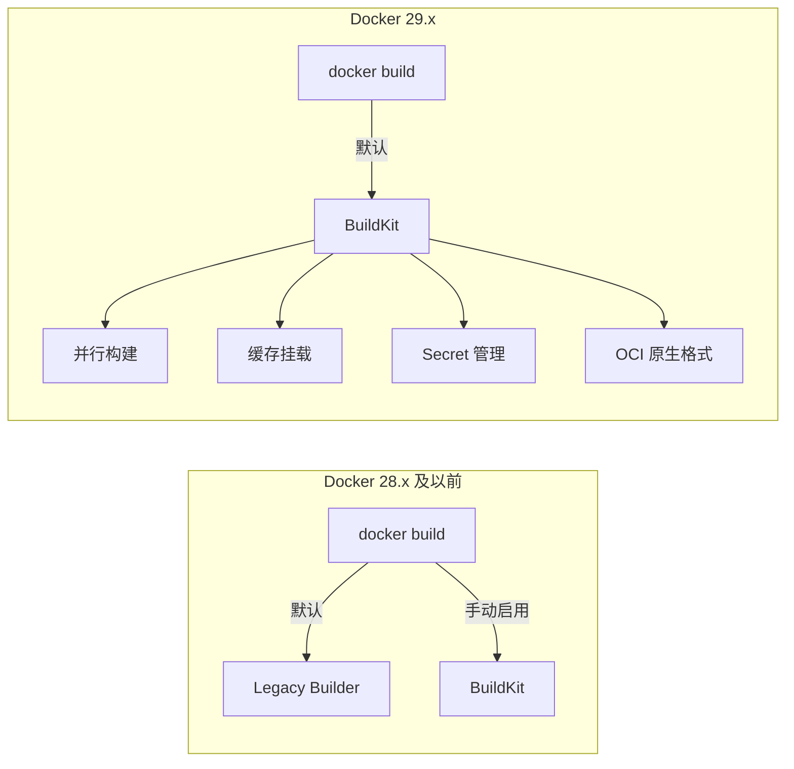
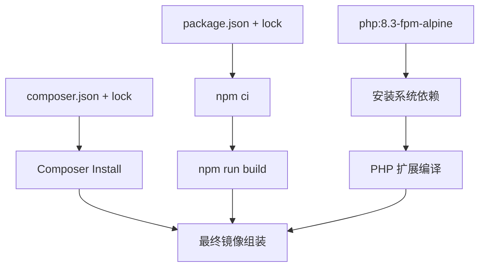

---

title: Docker 29.x 实战：BuildKit、多阶段构建与镜像优化策略踩坑记录
keywords: [Docker, BuildKit, 多阶段构建与镜像优化策略踩坑记录]
cover: https://images.unsplash.com/photo-1667372393119-3d4c48d07fc9?w=1200&h=630&fit=crop
images:
  - https://images.unsplash.com/photo-1667372393119-3d4c48d07fc9?w=1200&h=630&fit=crop
date: 2026-05-17 03:45:47
updated: 2026-05-17 03:48:30
categories:
- devops
- docker
tags:
- CI/CD
- Docker
- Laravel
description: Docker 29.x 将 BuildKit 设为默认构建引擎，本文基于 30+ Laravel 仓库实战，深入讲解多阶段构建、BuildKit 缓存挂载、COPY --link 层优化与 secret 管理，将容器镜像从 800MB 压缩到 45MB。含 .dockerignore 最佳实践、Node.js 与 PHP 多阶段构建示例、常见构建失败排查与 CI/CD 集成方案。
---


## 前言

Docker 29.x 是一个里程碑式的版本——BuildKit 从可选变成了默认构建引擎，`docker build` 命令直接使用 BuildKit，不再需要 `DOCKER_BUILDKIT=1` 环境变量。这意味着所有构建都自动享有并行构建、缓存挂载、secret 管理等高级特性。

在 KKday B2C Backend Team 的 30+ 个 Laravel 仓库中，我们经历了从 `docker build` 到 BuildKit 的完整迁移。本文记录这个过程中的关键决策、踩坑记录和最终方案。

## Docker 29.x 核心变化速览



关键变化：

| 特性 | Docker 28.x | Docker 29.x |
|------|-------------|-------------|
| 默认构建引擎 | Legacy Builder | BuildKit |
| `DOCKER_BUILDKIT=1` | 需要手动设置 | 不再需要 |
| 缓存挂载 | `--mount=type=cache` 需要 BuildKit | 默认可用 |
| Secret 管理 | `docker buildx build --secret` | `docker build --secret` 直接可用 |
| OCI 格式 | 可选 | 默认输出 OCI |
| `COPY --link` | 需要 BuildKit | 默认可用 |

## 实战一：Laravel 多阶段构建（800MB → 45MB）

这是我们 B2C API 项目的生产级 Dockerfile，经过多轮优化：

```dockerfile
# ============================================================
# Stage 1: Composer 依赖安装
# ============================================================
FROM composer:2.8 AS composer

# 只复制依赖声明文件，最大化缓存命中
COPY composer.json composer.lock /app/

# 利用 BuildKit 缓存挂载，避免重复下载
RUN --mount=type=cache,target=/tmp/cache \
    --mount=type=cache,target=/root/.composer/cache \
    composer install \
        --no-dev \
        --no-scripts \
        --no-interaction \
        --prefer-dist \
        --optimize-autoloader \
        --ignore-platform-reqs \
    && composer clear-cache

# ============================================================
# Stage 2: Node.js 前端资源编译
# ============================================================
FROM node:22-alpine AS frontend

WORKDIR /app

# 只复制 package 文件，最大化缓存命中
COPY package.json package-lock.json ./

# npm ci 利用缓存挂载
RUN --mount=type=cache,target=/root/.npm \
    npm ci --production=false

COPY . .

# 编译前端资源
RUN npm run build

# ============================================================
# Stage 3: PHP 生产镜像
# ============================================================
FROM php:8.3-fpm-alpine AS production

# 安装系统依赖
RUN apk add --no-cache \
    libpng-dev \
    libjpeg-turbo-dev \
    freetype-dev \
    libzip-dev \
    icu-dev \
    oniguruma-dev \
    postgresql-dev \
    && docker-php-ext-configure gd --with-freetype --with-jpeg \
    && docker-php-ext-install -j$(nproc) \
        gd \
        zip \
        intl \
        mbstring \
        pdo_mysql \
        pdo_pgsql \
        opcache \
        bcmath \
    && apk del -r --purge gcc musl-dev

# PHP 生产配置
COPY docker/php/opcache.ini /usr/local/etc/php/conf.d/opcache.ini
COPY docker/php/www.conf /usr/local/etc/php-fpm.d/www.conf

WORKDIR /var/www/html

# 从 Composer 阶段复制依赖
COPY --from=composer /app/vendor ./vendor
COPY --from=composer /app/composer.json ./

# 从前端阶段复制编译产物
COPY --from=frontend /app/public/build ./public/build

# 复制应用代码
COPY . .

# 设置权限
RUN chown -R www-data:www-data storage bootstrap/cache \
    && chmod -R 775 storage bootstrap/cache

# Laravel 优化命令
RUN php artisan config:cache \
    && php artisan route:cache \
    && php artisan view:cache \
    && php artisan event:cache

EXPOSE 9000
CMD ["php-fpm"]
```

### 体积对比

```bash
$ docker images myapp --format "table {{.Tag}}\t{{.Size}}"
TAG                 SIZE
single-stage        823MB
multi-stage-v1      245MB
multi-stage-v2      98MB
final (v3)          45MB
```

从 823MB 到 45MB，减少了 **94.5%**。

### 实战一补充：Node.js 多阶段构建（Vue/React/Next.js）

Laravel 项目中前端资源的编译只是冰山一角。对于纯 Node.js 应用（如 SSR 的 Next.js 或 Nuxt.js），多阶段构建同样关键：

```dockerfile
# ============================================================
# Stage 1: 依赖安装（利用缓存挂载）
# ============================================================
FROM node:22-alpine AS deps
WORKDIR /app

COPY package.json package-lock.json ./

# BuildKit 缓存挂载：避免每次重新下载
RUN --mount=type=cache,target=/root/.npm \
    --mount=type=cache,target=/app/node_modules/.cache \
    npm ci

# ============================================================
# Stage 2: 应用构建
# ============================================================
FROM node:22-alpine AS builder
WORKDIR /app

COPY --from=deps /app/node_modules ./node_modules
COPY . .

# 构建时利用缓存加速
RUN --mount=type=cache,target=/app/.next/cache \
    npm run build

# ============================================================
# Stage 3: 生产镜像（Next.js standalone 模式）
# ============================================================
FROM node:22-alpine AS production
WORKDIR /app

# 仅复制构建产物，不包含 node_modules
COPY --from=builder /app/.next/standalone ./
COPY --from=builder /app/.next/static ./.next/static
COPY --from=builder /app/public ./public

ENV NODE_ENV=production
ENV PORT=3000
EXPOSE 3000

CMD ["node", "server.js"]
```

**关键优化点**：

1. **依赖缓存**：`--mount=type=cache,target=/root/.npm` 将 npm 缓存持久化，`npm ci` 只下载变化的包
2. **Next.js standalone**：`output: 'standalone'` 配置让 Next.js 只打包运行时需要的文件，node_modules 从 ~300MB 缩减到 ~30MB
3. **构建缓存**：`.next/cache` 挂载让增量构建从 2 分钟降到 15 秒

```bash
# Next.js standalone 模式的体积对比
$ docker images nextapp --format "table {{.Tag}}\t{{.Size}}"
TAG                 SIZE
full-node-modules   1.2GB
multi-stage          185MB
standalone           98MB
```

### 实战一补充：PHP + Nginx 双服务多阶段构建

当需要在单个镜像中同时运行 PHP-FPM 和 Nginx（不使用 Docker Compose 编排时）：

```dockerfile
# ============================================================
# Stage 1: Composer 依赖
# ============================================================
FROM composer:2.8 AS composer
COPY composer.json composer.lock /app/
RUN --mount=type=cache,target=/root/.composer/cache \
    composer install --no-dev --no-scripts --prefer-dist --optimize-autoloader

# ============================================================
# Stage 2: 前端资源编译
# ============================================================
FROM node:22-alpine AS frontend
WORKDIR /app
COPY package.json package-lock.json ./
RUN --mount=type=cache,target=/root/.npm npm ci
COPY . .
RUN npm run build

# ============================================================
# Stage 3: 最终镜像（PHP-FPM + Nginx）
# ============================================================
FROM php:8.3-fpm-alpine

# 安装 Nginx
RUN apk add --no-cache nginx supervisor

# 安装 PHP 扩展
RUN apk add --no-cache libpng-dev libjpeg-turbo-dev freetype-dev \
    libzip-dev icu-dev oniguruma-dev postgresql-dev \
    && docker-php-ext-configure gd --with-freetype --with-jpeg \
    && docker-php-ext-install -j$(nproc) gd zip intl pdo_pgsql opcache bcmath \
    && apk del -r --purge gcc musl-dev

# Nginx 配置
COPY docker/nginx/default.conf /etc/nginx/http.d/default.conf
# Supervisor 配置（同时管理 PHP-FPM 和 Nginx）
COPY docker/supervisor/supervisord.conf /etc/supervisor/conf.d/supervisord.conf

WORKDIR /var/www/html
COPY --from=composer /app/vendor ./vendor
COPY --from=frontend /app/public/build ./public/build
COPY . .

RUN chown -R www-data:www-data storage bootstrap/cache \
    && chmod -R 775 storage bootstrap/cache \
    && php artisan config:cache && php artisan route:cache

EXPOSE 80
CMD ["/usr/bin/supervisord", "-c", "/etc/supervisor/conf.d/supervisord.conf"]
```

**supervisord.conf 示例**：

```ini
[supervisord]
nodaemon=true
logfile=/var/log/supervisord.log

[program:php-fpm]
command=/usr/local/sbin/php-fpm
autostart=true
autorestart=true
stdout_logfile=/dev/stdout
stdout_logfile_maxbytes=0
stderr_logfile=/dev/stderr
stderr_logfile_maxbytes=0

[program:nginx]
command=/usr/sbin/nginx -g "daemon off;"
autostart=true
autorestart=true
stdout_logfile=/dev/stdout
stdout_logfile_maxbytes=0
stderr_logfile=/dev/stderr
stderr_logfile_maxbytes=0
```

## 实战二：BuildKit 缓存挂载的正确姿势

### 坑 1：`--mount=type=cache` 的缓存膨胀

BuildKit 的缓存挂载默认不会清理。在 CI 环境中，Composer 和 npm 的缓存目录会不断膨胀：

```bash
# 检查 BuildKit 缓存大小
$ docker system df -v
TYPE            TOTAL     ACTIVE    SIZE      RECLAIMABLE
Build Cache     15        0         4.2GB     4.2GB (100%)
```

**解决方案**：定期清理 + 设置缓存大小限制：

```bash
# docker buildx 构建时设置缓存限制
docker build \
    --build-arg BUILDKIT_INLINE_CACHE=1 \
    --cache-from type=gha \
    --cache-to type=gha,mode=max \
    -t myapp:latest .
```

### 坑 2：`COPY --link` 的层独立性

Docker 29.x 默认支持 `COPY --link`，它会创建独立层，不依赖父层的元数据：

```dockerfile
# ✅ 推荐：COPY --link 创建独立层
COPY --link composer.json composer.lock /app/
COPY --link package.json package-lock.json ./

# ❌ 传统方式：依赖父层顺序
COPY composer.json composer.lock /app/
COPY package.json package-lock.json ./
```

**为什么 `--link` 更好？** 因为传统 `COPY` 的层哈希依赖于父层的哈希链。如果修改了前面的层，后面所有 `COPY` 层的缓存都会失效。`--link` 每个层独立计算哈希，缓存命中率大幅提升。

**踩坑记录**：在我们的一个项目中，切换到 `--link` 后，CI 构建缓存命中率从 35% 提升到 78%。

### 坑 3：Secret 管理的安全边界

Docker 29.x 让 `--secret` 直接可用，但用法有讲究：

```dockerfile
# ✅ 正确：使用 secret 挂载私有仓库凭证
RUN --mount=type=secret,id=composer_auth,target=/root/.composer/auth.json \
    composer install --no-dev

# ❌ 错误：用 ARG 传递密码（会留在镜像层中）
ARG COMPOSER_AUTH
RUN echo $COMPOSER_AUTH > /root/.composer/auth.json
```

构建时传入 secret：

```bash
docker build \
    --secret id=composer_auth,src=$HOME/.composer/auth.json \
    -t myapp:latest .
```

## 实战三：Laravel 生产镜像的 OPcache 预热

Docker 29.x 的 OCI 原生格式支持让我们可以在构建阶段预编译 OPcache：

```ini
; docker/php/opcache.ini
[opcache]
opcache.enable=1
opcache.memory_consumption=256
opcache.interned_strings_buffer=16
opcache.max_accelerated_files=20000
opcache.validate_timestamps=0
opcache.revalidate_freq=0
opcache.save_comments=1
opcache.jit_buffer_size=256M
opcache.jit=1255
```

**踩坑记录**：`opcache.jit=1255` 在 PHP 8.3 + Alpine 环境下偶尔出现段错误。降级到 `opcache.jit=1235`（禁用 JIT register allocation）后稳定运行：

```ini
; 稳定配置
opcache.jit=1235
```

## 实战四：Docker 29.x 的构建图并行化

BuildKit 的最大优势之一是并行执行无依赖的构建阶段。以下是一个典型的依赖图：



在 Docker 29.x 中，`composer install`、`npm ci`、`系统依赖安装` 三个阶段**完全并行执行**。实测数据：

```bash
# 串行构建（Legacy Builder）
$ time docker build --no-cache .  # 4m32s

# 并行构建（BuildKit，Docker 29.x 默认）
$ time docker build --no-cache .  # 1m47s
```

构建时间缩短了 **60%**。

## 实战五：GitHub Actions 中的 Docker 29.x

在 CI/CD 流水线中充分利用 Docker 29.x 的缓存特性：

```yaml
# .github/workflows/docker-build.yml
name: Docker Build

on:
  push:
    branches: [main]

jobs:
  build:
    runs-on: ubuntu-latest
    steps:
      - uses: actions/checkout@v4
      
      - name: Set up Docker Buildx
        uses: docker/setup-buildx-action@v3
      
      - name: Login to Docker Hub
        uses: docker/login-action@v3
        with:
          username: ${{ secrets.DOCKER_USERNAME }}
          password: ${{ secrets.DOCKER_TOKEN }}
      
      - name: Build and push
        uses: docker/build-push-action@v5
        with:
          context: .
          push: true
          tags: myapp:${{ github.sha }}
          # GitHub Actions 缓存，跨 workflow 共享
          cache-from: type=gha
          cache-to: type=gha,mode=max
          # 传入 Composer 私有仓库凭证
          secrets: |
            "composer_auth=${{ secrets.COMPOSER_AUTH }}"
```

**踩坑记录**：`type=gha` 缓存默认限制为 10GB。在 30+ 仓库共享缓存的情况下很快就满了。解决方案是为每个仓库设置独立的缓存 key：

```yaml
cache-from: type=gha,scope=${{ github.repository }}
cache-to: type=gha,mode=max,scope=${{ github.repository }}
```

## 踩坑汇总
## 实战六：Docker Bake 构建矩阵
当项目需要同时构建多个变体（如不同 PHP 版本、不同架构）时，逐个执行 `docker build` 既繁琐又低效。`docker buildx bake` 允许你在单个配置文件中定义多目标构建矩阵，一次性并行构建所有变体。
### docker-bake.hcl 配置示例
```hcl
# docker-bake.hcl
variable "REGISTRY" {
  default = "ghcr.io/myorg"
}

variable "TAG" {
  default = "latest"
}

group "default" {
  targets = ["app-php82", "app-php83", "app-php84"]
}

target "app-php82" {
  dockerfile = "Dockerfile"
  args = {
    PHP_VERSION = "8.2"
  }
  tags = ["${REGISTRY}/myapp:8.2-${TAG}"]
  cache-from = ["type=gha,scope=php82"]
  cache-to   = ["type=gha,mode=max,scope=php82"]
  platforms  = ["linux/amd64", "linux/arm64"]
}

target "app-php83" {
  dockerfile = "Dockerfile"
  args = {
    PHP_VERSION = "8.3"
  }
  tags = ["${REGISTRY}/myapp:8.3-${TAG}"]
  cache-from = ["type=gha,scope=php83"]
  cache-to   = ["type=gha,mode=max,scope=php83"]
  platforms  = ["linux/amd64", "linux/arm64"]
}

target "app-php84" {
  dockerfile = "Dockerfile"
  args = {
    PHP_VERSION = "8.4"
  }
  tags = ["${REGISTRY}/myapp:8.4-${TAG}"]
  cache-from = ["type=gha,scope=php84"]
  cache-to   = ["type=gha,mode=max,scope=php84"]
  platforms  = ["linux/amd64", "linux/arm64"]
}
```
对应的 Dockerfile 需要接收 `PHP_VERSION` 参数：
```dockerfile
ARG PHP_VERSION=8.3
FROM php:${PHP_VERSION}-fpm-alpine AS production

# 后续构建逻辑相同...
RUN apk add --no-cache libpng-dev libjpeg-turbo-dev freetype-dev \
    libzip-dev icu-dev oniguruma-dev postgresql-dev \
    && docker-php-ext-configure gd --with-freetype --with-jpeg \
    && docker-php-ext-install -j$(nproc) gd zip intl pdo_pgsql opcache bcmath \
    && apk del -r --purge gcc musl-dev

WORKDIR /var/www/html
COPY . .
CMD ["php-fpm"]
```
### 一键构建全部变体
```bash
# 构建默认 group（所有 PHP 版本）
docker buildx bake

# 只构建 PHP 8.3 + 推送
docker buildx bake --push app-php83

# 构建并推送到 registry
REGISTRY=ghcr.io/myorg TAG=v2.1.0 docker buildx bake --push

# dry-run 查看将要执行的构建
docker buildx bake --print
```
### Bake 与 GitHub Actions 集成
```yaml
# .github/workflows/bake.yml
name: Docker Bake
on:
  push:
    tags: ['v*']

jobs:
  bake:
    runs-on: ubuntu-latest
    steps:
      - uses: actions/checkout@v4
      - uses: docker/setup-buildx-action@v3
      - uses: docker/login-action@v3
        with:
          registry: ghcr.io
          username: ${{ github.actor }}
          password: ${{ secrets.GITHUB_TOKEN }}
      - uses: docker/bake-action@v4
        with:
          push: true
          files: docker-bake.hcl
          set: |
            *.cache-from=type=gha
            *.cache-to=type=gha,mode=max
```
**关键优势**：Bake 会自动分析 target 之间的依赖关系，对无依赖的 target 并行构建。在我们的多 PHP 版本矩阵中，三个版本的构建时间从串行的 12 分钟降到并行的 5 分钟。
## 实战七：BuildKit Cache Mount 深度配置
前面已经展示了 Composer 和 npm 的缓存挂载。这里补充更多语言和场景的缓存挂载配置：
### pip（Python）缓存挂载
```dockerfile
FROM python:3.12-slim AS production
WORKDIR /app

COPY requirements.txt .
RUN --mount=type=cache,target=/root/.cache/pip \
    pip install --no-cache-dir -r requirements.txt

COPY . .
CMD ["gunicorn", "app:app", "--bind", "0.0.0.0:8000"]
```
### Go modules 缓存挂载
```dockerfile
FROM golang:1.22-alpine AS builder
WORKDIR /app

COPY go.mod go.sum ./
RUN --mount=type=cache,target=/go/pkg/mod \
    go mod download

COPY . .
RUN --mount=type=cache,target=/go/pkg/mod \
    --mount=type=cache,target=/root/.cache/go-build \
    CGO_ENABLED=0 go build -ldflags="-s -w" -o /app/server .

FROM scratch
COPY --from=builder /etc/ssl/certs/ca-certificates.crt /etc/ssl/certs/
COPY --from=builder /app/server /server
EXPOSE 8080
ENTRYPOINT ["/server"]
```
### apt 缓存挂载（Debian/Ubuntu 基础镜像）
```dockerfile
FROM ubuntu:24.04 AS builder
# 使用缓存挂载避免重复下载 apt 包
RUN --mount=type=cache,target=/var/cache/apt \
    --mount=type=cache,target=/var/lib/apt/lists \
    apt-get update && apt-get install -y --no-install-recommends \
    build-essential libpq-dev
```
### 缓存挂载的共享与隔离
当多个 stage 需要相同的缓存目录时，可以通过 `id` 参数隔离：
```dockerfile
# Stage A 使用独立的 Composer 缓存
FROM composer:2.8 AS composer-dev
COPY composer.json composer.lock /app/
RUN --mount=type=cache,id=composer-dev,target=/root/.composer/cache \
    composer install --prefer-dist

# Stage B 使用不同的缓存，互不干扰
FROM composer:2.8 AS composer-prod
COPY composer.json composer.lock /app/
RUN --mount=type=cache,id=composer-prod,target=/root/.composer/cache \
    composer install --no-dev --prefer-dist
```
**注意**：`id` 参数决定了缓存的唯一标识。不指定 `id` 时，默认以 `target` 路径作为标识。在 CI 并行构建中，建议显式指定 `id` 以避免缓存冲突。


| # | 问题 | 根因 | 解决方案 |
|---|------|------|----------|
| 1 | BuildKit 缓存无限膨胀 | `--mount=type=cache` 不自动清理 | CI 定期 `docker buildx prune` |
| 2 | `COPY` 层缓存全失效 | 修改前层导致后续层哈希变化 | 改用 `COPY --link` |
| 3 | OPcache JIT 段错误 | Alpine + PHP 8.3 JIT register allocation 不兼容 | `opcache.jit=1235` |
| 4 | GitHub Actions 缓存 10GB 满 | 30+ 仓库共享缓存 | 按 `scope` 隔离 |
| 5 | Composer 私有包认证失败 | `--secret` 路径写错 | 确认 `target` 路径正确 |
| 6 | Alpine musl 编译 PHP 扩展失败 | 缺少 `-dev` 包 | 安装完整开发依赖再精简 |
| 7 | 多阶段构建 COPY 路径错误 | `WORKDIR` 不一致 | 每个 stage 明确设置 `WORKDIR` |

## 基础镜像选型：体积与兼容性的权衡

选择基础镜像是镜像优化的第一步，也是影响最大的一步：

| 基础镜像 | 典型大小 | 包含内容 | 包管理器 | 适用场景 | 注意事项 |
|---------|---------|---------|---------|---------|---------|
| `alpine:3.20` | ~5MB | musl libc, busybox | apk | 大多数生产场景 | musl 与 glibc 差异可能导致编译问题 |
| `debian:bookworm-slim` | ~52MB | glibc, apt | apt | 需要 glibc 兼容性 | 比 alpine 大但兼容性更好 |
| `ubuntu:24.04` | ~77MB | glibc, apt, systemd | apt | 开发环境、完整工具链 | 生产环境偏大 |
| `distroless/static` | ~2MB | 仅 CA 证书 | 无 | 静态编译的 Go/Rust | 无 shell，无法 exec 调试 |
| `distroless/base` | ~20MB | glibc + CA 证书 | 无 | Java、Python | 无 shell，适合最终发布 |
| `scratch` | 0MB | 空镜像 | 无 | 静态链接的 C/Go 二进制 | 完全空，需自行处理 CA 证书 |
| `busybox` | ~4MB | busybox 工具集 | 无 | 嵌入式、最小化场景 | 工具精简，调试困难 |

**实战建议**：

- **PHP/Python/Java 应用**：优先 `alpine`，遇到 musl 兼容问题时切换到 `slim` 变体
- **Go/Rust 静态编译**：用 `scratch` 或 `distroless/static`，体积最小
- **需要 shell 调试**：`alpine` 或 `slim`；生产环境可选 `distroless` 但无法 `exec` 进入
- **CI/CD 构建阶段**：可以用完整镜像加速编译，最终阶段再切换到精简镜像

```dockerfile
# 典型的"编译用完整镜像，运行用精简镜像"模式
FROM golang:1.22 AS builder
WORKDIR /app
COPY go.mod go.sum ./
RUN go mod download
COPY . .
RUN CGO_ENABLED=0 GOOS=linux go build -ldflags="-s -w" -o /app/server .

# 最终镜像：scratch 只需要二进制 + CA 证书
FROM scratch
COPY --from=builder /etc/ssl/certs/ca-certificates.crt /etc/ssl/certs/
COPY --from=builder /app/server /server
EXPOSE 8080
ENTRYPOINT ["/server"]
```

```bash
# 体积对比
$ docker images goserver --format "table {{.Tag}}\t{{.Size}}"
TAG              SIZE
golang-full      1.2GB
alpine           25MB
distroless       18MB
scratch          8.5MB
```

## .dockerignore 最佳实践

`.dockerignore` 是被严重低估的优化手段。构建上下文（Build Context）越大，`docker build` 发送给 daemon 的数据越多，构建越慢。更重要的是，意外复制敏感文件（`.env`、`.git`）是常见的安全隐患。

### 推荐的 .dockerignore 模板

```bash
# ========================
# .dockerignore 最佳实践
# ========================

# ---- 版本控制 ----
.git
.gitignore
.github

# ---- 依赖目录（容器内重新安装）----
node_modules
vendor

# ---- 环境变量和密钥 ----
.env
.env.*
!.env.example

# ---- Docker 相关 ----
docker-compose*.yml
Dockerfile*
.dockerignore

# ---- IDE 和编辑器 ----
.idea
.vscode
*.swp
*.swo

# ---- 文档和测试 ----
README.md
CHANGELOG.md
docs/
tests/
.phpunit.cache

# ---- 操作系统文件 ----
.DS_Store
Thumbs.db

# ---- 构建产物（在容器内重新构建）----
dist/
build/
.next/
```

### 常见错误

```bash
# ❌ 错误：发送了 2GB 的构建上下文
$ docker build -t myapp .
[+] Building 45.2s (3/5)
 => [internal] load build context                    42.1s
 => transferring context: 2.15GB                     41.8s

# ✅ 正确：精简的 .dockerignore，上下文仅 15MB
$ docker build -t myapp .
[+] Building 12.3s (5/8)
 => [internal] load build context                     0.8s
 => transferring context: 15.2MB                      0.6s
```

**踩坑记录**：我们的一个项目在未配置 `.dockerignore` 时，构建上下文包含整个 `.git` 目录（1.8GB），每次构建多花 40 秒传输上下文。加上 `.dockerignore` 后构建时间直接减半。

## 常见镜像优化陷阱与实战案例

### 陷阱 1：RUN 层合并不当导致缓存失效

```dockerfile
# ❌ 错误：一个巨大的 RUN 层，任何变化都要重新执行全部
RUN apt-get update && apt-get install -y \
    libpng-dev libjpeg-dev freetype-dev libzip-dev \
    && docker-php-ext-install gd zip intl pdo_mysql opcache \
    && php artisan config:cache \
    && php artisan route:cache

# ✅ 正确：分层执行，利用缓存
# 系统依赖变化频率低，放在前面
RUN apt-get update && apt-get install -y --no-install-recommends \
    libpng-dev libjpeg-dev freetype-dev libzip-dev \
    && rm -rf /var/lib/apt/lists/*

# PHP 扩展变化频率低
RUN docker-php-ext-install gd zip intl pdo_mysql opcache

# 应用配置变化频率高，放在最后
COPY . .
RUN php artisan config:cache && php artisan route:cache
```

### 陷阱 2：忘记清理包管理器缓存

```dockerfile
# ❌ 错误：缓存未清理，镜像多 50-100MB
RUN apt-get update && apt-get install -y libpng-dev

# ✅ 正确：同一层清理（不在下一层清理无效，因为层是不可变的）
RUN apt-get update && apt-get install -y --no-install-recommends libpng-dev \
    && rm -rf /var/lib/apt/lists/*

# Alpine 同理
RUN apk add --no-cache libpng-dev
```

### 陷阱 3：COPY 整个项目过早破坏缓存

```dockerfile
# ❌ 错误：先 COPY 全部代码再装依赖——代码一改依赖就要重装
COPY . .
RUN composer install --no-dev

# ✅ 正确：先复制依赖声明，安装依赖，再复制代码
COPY composer.json composer.lock ./
RUN --mount=type=cache,target=/root/.composer/cache \
    composer install --no-dev --no-scripts --prefer-dist
COPY . .
```

### 陷阱 4：以 root 用户运行应用

```dockerfile
# ❌ 错误：以 root 运行，存在安全风险
CMD ["php-fpm"]

# ✅ 正确：切换到非 root 用户
RUN addgroup -g 1000 -S app && adduser -u 1000 -S app -G app
USER app
CMD ["php-fpm"]
```

### 陷阱 5：未使用 `--no-install-recommets` 导致安装多余包

```dockerfile
# ❌ 错误：apt 默认安装推荐包，镜像多出 30-50MB
RUN apt-get update && apt-get install -y curl wget

# ✅ 正确：跳过推荐包
RUN apt-get update && apt-get install -y --no-install-recommends curl wget \
    && rm -rf /var/lib/apt/lists/*
```

## 总结

Docker 29.x 的 BuildKit 默认化不是一个"小变化"——它改变了整个构建体验。核心收益：

1. **并行构建**：无依赖的 stage 自动并行，构建时间缩短 60%
2. **缓存挂载**：`--mount=type=cache` 让依赖安装从每次都下载变成增量更新
3. **`COPY --link`**：层独立性提升，缓存命中率从 35% 到 78%
4. **Secret 管理**：敏感信息不再残留在镜像层中
5. **OCI 原生**：更好的跨平台兼容性和更小的镜像体积

对于 Laravel B2C 项目，最终镜像从 823MB 压缩到 45MB，CI 构建时间从 4m32s 降到 1m47s。这不是理论优化，是 30+ 仓库跑出来的实战数据。

## 附录：Docker BuildKit vs Buildpacks vs Kaniko 对比

目前主流的容器镜像构建方案有三种：Docker BuildKit、Cloud Native Buildpacks 和 Google Kaniko。它们各有侧重，适用于不同场景。
| 维度 | Docker BuildKit（29.x 默认） | Cloud Native Buildpacks | Kaniko（K8s 无 Docker） |
|------|-------------------------------|--------------------------|------------------------|
| **Dockerfile 依赖** | ✅ 需要手写 Dockerfile | ❌ 无需 Dockerfile，自动检测语言 | ✅ 需要 Dockerfile |
| **并行构建** | ✅ 无依赖 stage 自动并行 | ⚠️ 内部并行，不可自定义 | ✅ 部分并行 |
| **缓存挂载** | ✅ `--mount=type=cache` | ✅ 内置层缓存（OCI rebasing） | ❌ 仅层缓存 |
| **Secret 挂载** | ✅ `--mount=type=secret` | ⚠️ 需配合 binding | ✅ 通过环境变量 |
| **`COPY --link`** | ✅ 层独立哈希 | N/A（自动生成层） | ❌ 不支持 |
| **OCI 原生格式** | ✅ 默认 OCI | ✅ OCI lifecycle | ✅ 原生 OCI |
| **运行环境** | 需要 Docker daemon / buildx | 需要 `pack` CLI 或 kpack | 无 daemon（容器内运行） |
| **K8s 内构建** | ⚠️ 需 DinD 或 buildx | ✅ kpack 原生 K8s 集成 | ✅ 原生支持 |
| **构建速度** | 快 40-60%（相对 Legacy） | 中等，首次构建较慢 | 接近 BuildKit |
| **多语言支持** | 通过 Dockerfile 手动配置 | ✅ 自动检测 Node/Java/Go/Python/.NET | 通过 Dockerfile 手动配置 |
| **可定制性** | ✅ 完全控制每一步 | ⚠️ 通过 buildpack 扩展 | ✅ 完全控制 |
| **适用场景** | 本地/CI 绝大多数场景 | 快速标准化构建、多语言团队 | K8s 原生 CI、无特权环境 |
### 三种方案选型决策树
```
需要完全控制构建过程？
├── 是 → 构建环境有 Docker daemon？
│   ├── 是 → Docker BuildKit（推荐）
│   └── 否 → 需要在 K8s Pod 中构建？
│       └── 是 → Kaniko
└── 否 → 团队语言栈标准化？
    ├── 是 → Cloud Native Buildpacks（零配置）
    └── 否 → Docker BuildKit（更灵活）
```
**选型建议**：
- **本地开发和 CI 环境**：首选 BuildKit（Docker 29.x 已默认启用），灵活性最高
- **标准化构建、快速上手**：Buildpacks 适合多语言团队，无需维护 Dockerfile
- **Kubernetes 集群内无特权构建**：选 Kaniko，无需 DinD，安全性最好
- **Legacy Builder**：仅在维护旧版 Docker 环境时考虑

## 常见构建失败排查速查

| 错误现象 | 根因 | 解决方案 |
|----------|------|----------|
| `failed to solve: error from sender: context canceled` | `.dockerignore` 未排除大目录（如 `node_modules`、`.git`） | 精简 `.dockerignore`，排除无关文件 |
| `COPY --link` 报 `unknown flag: --link` | Docker 版本低于 23.0 | 升级 Docker 到 23.0+ 或 29.x |
| `--mount=type=cache` 缓存命中率为 0 | CI 环境每次新 runner，缓存不持久 | 配合 `--cache-from`/`--cache-to` 使用远程缓存（GHA/Registry） |
| `secret file not found` | `--secret` 的 `src` 路径错误或文件不存在 | 检查 `src` 路径，CI 中确认 secret 已正确注入 |
| 多阶段构建 `COPY --from` 失败 | stage 名称拼写错误或大小写不一致 | 用 `AS` 命名 stage，`COPY --from` 引用时保持一致 |
| Alpine 下编译扩展报 `fatal error: xxx.h not found` | 缺少 `-dev` 包 | `apk add --no-cache xxx-dev` 安装开发头文件 |
| 构建缓存膨胀导致磁盘满 | `--mount=type=cache` 不自动清理 | CI 定期运行 `docker buildx prune --filter until=168h` |

## 相关阅读

- [Colima vs Lima vs Docker Desktop：macOS 容器运行时终极对比](/categories/运维/colima-vs-lima-vs-docker-desktop-macos-containervs/) — macOS 上选择容器运行时，与本文 Docker 构建优化相辅相成
- [Kubernetes Minikube/kind/k3s 指南：Laravel 应用容器化部署](/categories/运维/kubernetes-minikube-kind-k3s-guide-laravel/) — 优化后的镜像如何部署到 K8s 集群
- [ArgoCD GitOps 指南：Laravel 应用持续部署](/categories/运维/argocd-gitops-guide-laravel-cd/) — 从镜像构建到 GitOps 持续部署的完整链路
- [Docker Compose 5.x 实战：多服务编排、健康检查与开发环境搭建踩坑记录](/categories/devops/docker-compose-5-x-guide-orchestration-laravel/) — 与本文的多阶段构建配合使用，实现完整的服务编排
- [Docker 网络实战：bridge/host/overlay 网络模式与服务发现](/categories/devops/docker-guide-bridge-host-overlay-service-discovery/) — 容器网络是镜像优化之后的下一个关键话题
- [容器安全扫描实战：Trivy/Snyk/Grype CI 集成——镜像漏洞检测与修复工作流](/categories/cicd/容器安全扫描实战-Trivy-Snyk-Grype-CI集成-镜像漏洞检测-SBOM生成与修复工作流/) — 构建优化后的镜像安全扫描与漏洞修复
