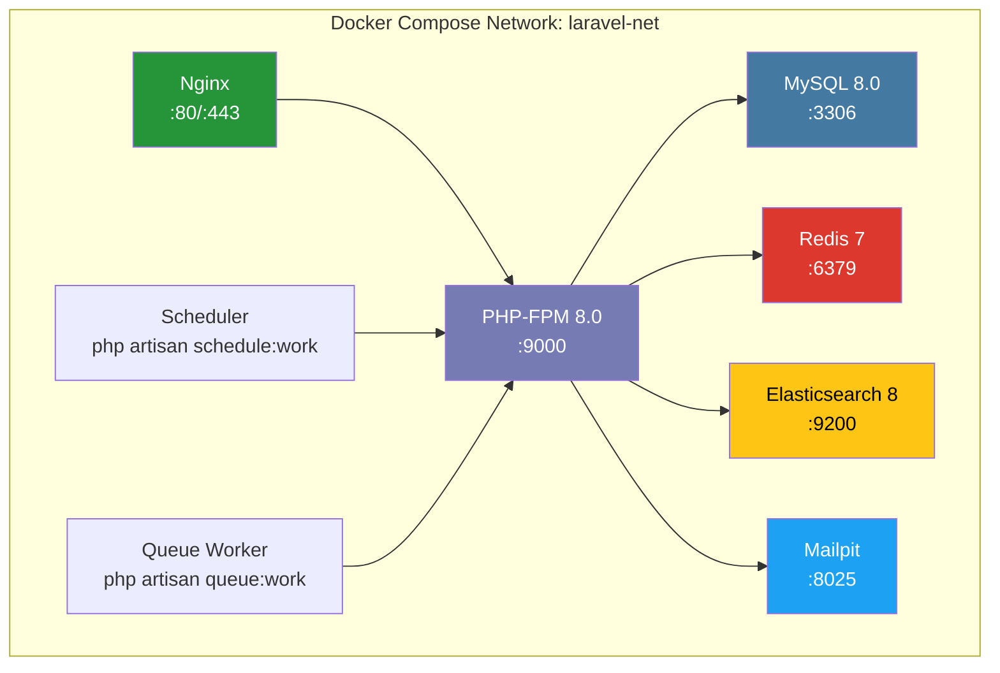

---

title: Docker Compose 5.x 实战：多服务编排、健康检查与开发环境搭建踩坑记录
keywords: [Docker Compose, 多服务编排, 健康检查与开发环境搭建踩坑记录]
cover: https://images.unsplash.com/photo-1667372393119-3d4c48d07fc9?w=1200&h=630&fit=crop
images:
  - https://images.unsplash.com/photo-1667372393119-3d4c48d07fc9?w=1200&h=630&fit=crop
date: 2026-05-16 22:00:37
updated: 2026-05-16 22:04:36
tags:
- DevOps
- Docker
- Laravel
categories:
- devops
- docker
description: Docker Compose 5.x 多服务编排实战：PHP-FPM + MySQL + Redis + Elasticsearch + Mailpit 的 Laravel 开发环境搭建，涵盖健康检查、depends_on 条件启动、Volume 持久化、网络隔离、Init 脚本等核心踩坑记录。
---


# Docker Compose 5.x 实战：多服务编排、健康检查与开发环境搭建踩坑记录

> 从 `docker-compose up` 启动后 MySQL 还没就绪、PHP-FPM 就开始连接报错说起——这篇文章记录了 30+ Laravel 仓库在 Docker Compose 编排中的真实踩坑与解决方案。

## 为什么需要这篇文章？

在 KKday B2C Backend Team，每个 Laravel 项目都有自己的 `docker-compose.yml`。但早期的做法很粗暴——`depends_on` 只保证容器启动，不保证服务就绪。结果就是：

- CI 流水线时好时坏，"在我机器上没问题"成常态
- 新人 onboarding 花半天配环境，踩的坑比写代码还多
- MySQL 8.0 升级后字符集变了，没人知道，线上乱码

这篇文章记录了我们从"能跑就行"到"稳定可靠"的 Docker Compose 治理过程。

## 架构全景



## 基础编排：一个可用的 docker-compose.yml

### 核心配置

```yaml
# docker-compose.yml
# 适用于 Laravel B2C API 本地开发环境
version: "3.8"

services:
  # ============================================================
  # Nginx - 反向代理
  # ============================================================
  nginx:
    image: nginx:1.25-alpine
    container_name: ${APP_NAME:-laravel}-nginx
    ports:
      - "${NGINX_PORT:-8080}:80"
    volumes:
      - ./docker/nginx/default.conf:/etc/nginx/conf.d/default.conf:ro
      - ./:/var/www/html:cached
    depends_on:
      php:
        condition: service_healthy
    networks:
      - laravel-net
    restart: unless-stopped

  # ============================================================
  # PHP-FPM - 应用核心
  # ============================================================
  php:
    build:
      context: ./docker/php
      dockerfile: Dockerfile
      args:
        PHP_VERSION: "${PHP_VERSION:-8.0}"
    container_name: ${APP_NAME:-laravel}-php
    volumes:
      - ./:/var/www/html:cached
      - ./docker/php/uploads.ini:/usr/local/etc/php/conf.d/uploads.ini:ro
    environment:
      - APP_ENV=local
      - DB_HOST=mysql
      - DB_PORT=3306
      - REDIS_HOST=redis
      - REDIS_PORT=6379
      - MAIL_HOST=mailpit
      - MAIL_PORT=1025
    healthcheck:
      test: ["CMD-SHELL", "php-fpm-healthcheck || exit 1"]
      interval: 5s
      timeout: 3s
      retries: 5
      start_period: 10s
    depends_on:
      mysql:
        condition: service_healthy
      redis:
        condition: service_healthy
    networks:
      - laravel-net
    restart: unless-stopped

  # ============================================================
  # MySQL 8.0 - 主数据库
  # ============================================================
  mysql:
    image: mysql:8.0
    container_name: ${APP_NAME:-laravel}-mysql
    ports:
      - "${DB_PORT:-3306}:3306"
    environment:
      MYSQL_ROOT_PASSWORD: "${DB_ROOT_PASSWORD:-root}"
      MYSQL_DATABASE: "${DB_DATABASE:-laravel}"
      MYSQL_USER: "${DB_USERNAME:-laravel}"
      MYSQL_PASSWORD: "${DB_PASSWORD:-secret}"
      MYSQL_CHARSET: utf8mb4
      MYSQL_COLLATION: utf8mb4_unicode_ci
    volumes:
      - mysql-data:/var/lib/mysql
      - ./docker/mysql/init.sql:/docker-entrypoint-initdb.d/init.sql:ro
      - ./docker/mysql/my.cnf:/etc/mysql/conf.d/custom.cnf:ro
    healthcheck:
      test: ["CMD", "mysqladmin", "ping", "-h", "localhost", "-u", "root", "-p${DB_ROOT_PASSWORD:-root}"]
      interval: 5s
      timeout: 3s
      retries: 10
      start_period: 30s
    networks:
      - laravel-net
    restart: unless-stopped

  # ============================================================
  # Redis 7 - 缓存 & 队列
  # ============================================================
  redis:
    image: redis:7-alpine
    container_name: ${APP_NAME:-laravel}-redis
    ports:
      - "${REDIS_PORT:-6379}:6379"
    volumes:
      - redis-data:/data
    healthcheck:
      test: ["CMD", "redis-cli", "ping"]
      interval: 5s
      timeout: 3s
      retries: 5
    networks:
      - laravel-net
    restart: unless-stopped

  # ============================================================
  # Elasticsearch 8 - 全文搜索
  # ============================================================
  elasticsearch:
    image: elasticsearch:8.11.0
    container_name: ${APP_NAME:-laravel}-es
    environment:
      - discovery.type=single-node
      - xpack.security.enabled=false
      - "ES_JAVA_OPTS=-Xms512m -Xmx512m"
    volumes:
      - es-data:/usr/share/elasticsearch/data
    ports:
      - "9200:9200"
    healthcheck:
      test: ["CMD-SHELL", "curl -sf http://localhost:9200/_cluster/health || exit 1"]
      interval: 10s
      timeout: 5s
      retries: 10
      start_period: 30s
    networks:
      - laravel-net
    restart: unless-stopped

  # ============================================================
  # Mailpit - 邮件捕获（替代 Mailhog）
  # ============================================================
  mailpit:
    image: axllent/mailpit:latest
    container_name: ${APP_NAME:-laravel}-mailpit
    ports:
      - "${MAILPIT_UI_PORT:-8025}:8025"
      - "${MAILPIT_SMTP_PORT:-1025}:1025"
    networks:
      - laravel-net
    restart: unless-stopped

  # ============================================================
  # Scheduler - Laravel 定时任务
  # ============================================================
  scheduler:
    build:
      context: ./docker/php
      dockerfile: Dockerfile
    container_name: ${APP_NAME:-laravel}-scheduler
    command: >
      sh -c "php artisan schedule:work"
    volumes:
      - ./:/var/www/html:cached
    depends_on:
      php:
        condition: service_healthy
    networks:
      - laravel-net
    restart: unless-stopped

  # ============================================================
  # Queue Worker - Laravel 队列消费
  # ============================================================
  queue:
    build:
      context: ./docker/php
      dockerfile: Dockerfile
    container_name: ${APP_NAME:-laravel}-queue
    command: >
      php artisan queue:work redis --sleep=3 --tries=3 --max-time=3600
    volumes:
      - ./:/var/www/html:cached
    depends_on:
      php:
        condition: service_healthy
    networks:
      - laravel-net
    restart: unless-stopped

# ============================================================
# 持久化 Volumes
# ============================================================
volumes:
  mysql-data:
    driver: local
  redis-data:
    driver: local
  es-data:
    driver: local

# ============================================================
# 网络配置
# ============================================================
networks:
  laravel-net:
    driver: bridge
```

### PHP-FPM Dockerfile

```dockerfile
# docker/php/Dockerfile
ARG PHP_VERSION=8.0

FROM php:${PHP_VERSION}-fpm-alpine

# 系统依赖
RUN apk add --no-cache \
    bash \
    curl \
    freetype-dev \
    icu-dev \
    libjpeg-turbo-dev \
    libpng-dev \
    libwebp-dev \
    libzip-dev \
    oniguruma-dev \
    linux-headers

# PHP 扩展
RUN docker-php-ext-configure gd --with-freetype --with-jpeg --with-webp \
    && docker-php-ext-install -j$(nproc) \
    bcmath \
    exif \
    gd \
    intl \
    mbstring \
    mysqli \
    opcache \
    pdo_mysql \
    zip

# Redis 扩展（PECL）
RUN apk add --no-cache $PHPIZE_DEPS \
    && pecl install redis \
    && docker-php-ext-enable redis

# Composer
COPY --from=composer:2 /usr/bin/composer /usr/bin/composer

# PHP-FPM 健康检查脚本
RUN wget -O /usr/local/bin/php-fpm-healthcheck \
    https://raw.githubusercontent.com/renatomefi/php-fpm-healthcheck/master/php-fpm-healthcheck \
    && chmod +x /usr/local/bin/php-fpm-healthcheck

# opcache 配置
COPY uploads.ini /usr/local/etc/php/conf.d/uploads.ini

WORKDIR /var/www/html

EXPOSE 9000
```

### Nginx 配置

```nginx
# docker/nginx/default.conf
server {
    listen 80;
    server_name localhost;
    root /var/www/html/public;
    index index.php;

    # 日志
    access_log /var/log/nginx/laravel-access.log;
    error_log  /var/log/nginx/laravel-error.log;

    # 静态资源缓存
    location ~* \.(jpg|jpeg|png|gif|ico|css|js|woff2)$ {
        expires 7d;
        add_header Cache-Control "public, immutable";
    }

    # Laravel 路由
    location / {
        try_files $uri $uri/ /index.php?$query_string;
    }

    # PHP-FPM
    location ~ \.php$ {
        fastcgi_pass php:9000;
        fastcgi_param SCRIPT_FILENAME $document_root$fastcgi_script_name;
        include fastcgi_params;
        fastcgi_read_timeout 300;
        
        # 防止 Xdebug 超时
        fastcgi_buffer_size 128k;
        fastcgi_buffers 4 256k;
    }

    # 禁止访问隐藏文件
    location ~ /\. {
        deny all;
    }
}
```

## 核心踩坑记录

### 踩坑 1：depends_on 不等于"服务就绪"

**现象**：`docker-compose up` 后 PHP-FPM 报 `Connection refused`，但重跑一次就好了。

**根因**：`depends_on` 只保证容器 **启动顺序**，不保证服务 **就绪状态**。MySQL 容器启动了，但 `mysqld` 还在初始化。

**错误写法**：

```yaml
# ❌ 只保证启动顺序
depends_on:
  - mysql
  - redis
```

**正确写法**（Docker Compose 2.1+ 语法）：

```yaml
# ✅ 结合 healthcheck 等待就绪
depends_on:
  mysql:
    condition: service_healthy
  redis:
    condition: service_healthy
```

**关键点**：`condition: service_healthy` 要求被依赖的服务 healthcheck 通过后才启动当前服务。但你必须先定义 healthcheck！

### 踩坑 2：MySQL 8.0 的认证插件问题

**现象**：PHP 用 `mysqli` 连接 MySQL 8.0，报 `The server requested authentication method unknown to the client [caching_sha2_password]`。

**根因**：MySQL 8.0 默认使用 `caching_sha2_password`，而旧版 PHP MySQL 驱动只支持 `mysql_native_password`。

**解决方案**：通过自定义配置文件切换认证插件：

```ini
# docker/mysql/my.cnf
[mysqld]
default_authentication_plugin = mysql_native_password
character-set-server = utf8mb4
collation-server = utf8mb4_unicode_ci

# 性能调优（本地开发用）
innodb_buffer_pool_size = 256M
innodb_log_file_size = 64M
max_connections = 100

# 慢查询日志
slow_query_log = 1
long_query_time = 1
slow_query_log_file = /var/log/mysql/slow.log

[client]
default-character-set = utf8mb4
```

初始化 SQL：

```sql
-- docker/mysql/init.sql
-- 确保用户使用正确的认证方式
ALTER USER 'laravel'@'%' IDENTIFIED WITH mysql_native_password BY 'secret';
FLUSH PRIVILEGES;

-- 创建测试数据库
CREATE DATABASE IF NOT EXISTS `laravel_testing`;
GRANT ALL PRIVILEGES ON `laravel_testing`.* TO 'laravel'@'%';
FLUSH PRIVILEGES;
```

### 踩坑 3：Volume 挂载的性能噩梦（macOS）

**现象**：Laravel 页面加载要 3-5 秒，`php artisan` 命令慢到怀疑人生。

**根因**：macOS 的 Docker Desktop 使用 `osxfs` / `grpc-fuse` 做文件同步，大量小文件读写时 I/O 开销巨大。`vendor/` 目录有 5000+ 文件，每次 `composer install` 都是灾难。

**优化方案**：

```yaml
# 方案 1：使用 :cached 挂载（推荐）
volumes:
  - ./:/var/www/html:cached
  # :cached 让主机到容器的写入异步化，提升约 30%

# 方案 2：将 vendor 放到 Docker Volume（牺牲编辑器自动补全）
volumes:
  - ./:/var/www/html:cached
  - vendor-data:/var/www/html/vendor
  - node-modules:/var/www/html/node_modules

# 方案 3：使用 Mutagen（最佳性能，需要额外安装）
# mutagen.yml
sync:
  defaults:
    mode: "two-way-resolved"
    ignore:
      vcs: true
      paths:
        - "vendor"
        - "node_modules"
        - ".git"
  code:
    alpha: "."
    beta: "docker://laravel-php/var/www/html"
```

**最终方案**：我们用 Colima + VirtioFS 替代 Docker Desktop，Volume 性能提升 3-5 倍。配合 `:cached` 挂载，本地开发体验基本接近原生。

### 踩坑 4：Elasticsearch 内存不足导致 OOM

**现象**：ES 容器频繁重启，`docker logs` 显示 `java.lang.OutOfMemoryError`。

**根因**：ES 默认 JVM 堆大小 1GB，但 Docker Desktop 默认只分配 2GB 内存给整个 Docker VM，跑完 MySQL + Redis + PHP + ES 就不够了。

**解决方案**：

```yaml
elasticsearch:
  environment:
    - "ES_JAVA_OPTS=-Xms512m -Xmx512m"  # 本地开发够用
    - discovery.type=single-node
    - xpack.security.enabled=false       # 本地关闭认证
  deploy:
    resources:
      limits:
        memory: 1G
      reservations:
        memory: 512M
```

**踩坑延伸**：`xpack.security.enabled=false` 在本地开发很方便，但别忘了这个配置绝对不能带到生产！我们曾经有人把本地 docker-compose.yml 的配置复制到 staging 环境，ES 集群裸奔了一周。

### 踩坑 5：Queue Worker 不自动重连

**现象**：Redis 重启后，Queue Worker 静默挂掉，不再消费任务，也没报错。

**根因**：`php artisan queue:work` 进程在 Redis 连接断开后不会自动重连，进程变成僵尸状态。

**解决方案**：

```yaml
queue:
  command: >
    php artisan queue:work redis
    --sleep=3
    --tries=3
    --max-time=3600
    --max-jobs=1000
    --memory=128
  healthcheck:
    test: ["CMD-SHELL", "php artisan queue:health || exit 1"]
    interval: 30s
    timeout: 5s
    retries: 3
  restart: unless-stopped
```

加上 Laravel 的 `queue:health` 命令（Laravel 10+）：

```php
// app/Console/Commands/QueueHealthCommand.php
class QueueHealthCommand extends Command
{
    protected $signature = 'queue:health';
    protected $description = 'Check queue worker health';

    public function handle(): int
    {
        try {
            // 检查 Redis 连接
            Redis::ping();
            
            // 检查最近是否有任务处理
            $lastJobAt = Cache::get('queue:last_job_at');
            if ($lastJobAt && now()->diffInMinutes($lastJobAt) > 10) {
                $this->warn('Queue worker may be stuck');
                return 1;
            }
            
            return 0;
        } catch (\Exception $e) {
            $this->error("Queue health check failed: {$e->getMessage()}");
            return 1;
        }
    }
}
```

## 进阶技巧

### Init Container 模式：应用启动脚本

很多 Laravel 项目需要在启动时跑迁移、缓存配置等。我们用一个 init 脚本容器：

```yaml
init:
  build:
    context: ./docker/php
    dockerfile: Dockerfile
  container_name: ${APP_NAME:-laravel}-init
  command: >
    sh -c "
      php artisan config:clear &&
      php artisan cache:clear &&
      php artisan route:clear &&
      php artisan view:clear &&
      php artisan migrate --force &&
      php artisan config:cache &&
      php artisan route:cache &&
      echo '✅ Init completed'
    "
  volumes:
    - ./:/var/www/html:cached
  depends_on:
    mysql:
      condition: service_healthy
    redis:
      condition: service_healthy
  networks:
    - laravel-net
  # 一次性容器，跑完即退出
  restart: "no"
```

启动命令：

```bash
# 初始化 + 启动所有服务
docker compose up -d && docker compose up init

# 或者用 Makefile
make up    # docker compose up -d && docker compose up init
make down  # docker compose down
make logs  # docker compose logs -f --tail=100
```

### 网络隔离：多项目共存

当同时跑多个 Laravel 项目时，端口冲突是常见问题：

```yaml
# 项目 A: .env
APP_NAME=project-a
NGINX_PORT=8081
DB_PORT=3307
REDIS_PORT=6380

# 项目 B: .env
APP_NAME=project-b
NGINX_PORT=8082
DB_PORT=3308
REDIS_PORT=6381
```

使用环境变量 + `container_name` 避免冲突：

```yaml
services:
  mysql:
    container_name: ${APP_NAME}-mysql  # project-a-mysql
    ports:
      - "${DB_PORT:-3306}:3306"
```

### 优雅关闭：Graceful Shutdown

默认 `docker compose down` 会发 SIGTERM，等 10 秒后 SIGKILL。但 PHP-FPM 和 Queue Worker 需要时间处理完当前请求/任务：

```yaml
php:
  stop_grace_period: 30s  # 等 30 秒再强杀

queue:
  stop_grace_period: 60s  # 队列任务可能耗时更长
  stop_signal: SIGTERM    # 确保发送 SIGTERM
```

Queue Worker 优雅关闭：

```php
// app/Queue/GracefulShutdown.php
class GracefulShutdown
{
    public function bootstrap(): void
    {
        // 收到 SIGTERM 时标记
        pcntl_signal(SIGTERM, function () {
            Cache::put('queue:shutting_down', true, now()->addMinutes(5));
            
            // 等待当前任务完成
            while (Cache::get('queue:processing', false)) {
                usleep(100000); // 100ms
            }
            
            exit(0);
        });
    }
}
```

## Makefile 封装

```makefile
# Makefile
.PHONY: up down logs init test shell

# 启动所有服务
up:
	docker compose up -d
	@echo "等待服务就绪..."
	@sleep 5
	docker compose up init
	@echo "✅ 所有服务已启动"
	@echo "🌐 http://localhost:${NGINX_PORT:-8080}"
	@echo "📧 http://localhost:${MAILPIT_UI_PORT:-8025}"

# 停止并清理
down:
	docker compose down

# 完全清理（含数据卷）
destroy:
	docker compose down -v --remove-orphans
	@echo "⚠️  所有数据已清除"

# 查看日志
logs:
	docker compose logs -f --tail=100

# 进入 PHP 容器
shell:
	docker compose exec php bash

# 运行测试
test:
	docker compose exec php php artisan test --parallel

# 重建镜像
rebuild:
	docker compose build --no-cache
	docker compose up -d

# 数据库迁移
migrate:
	docker compose exec php php artisan migrate --force

# 进入 MySQL
mysql:
	docker compose exec mysql mysql -u laravel -psecret laravel
```

## CI 集成：GitHub Actions 中的 Compose

```yaml
# .github/workflows/test.yml
name: Tests

on: [push, pull_request]

jobs:
  test:
    runs-on: ubuntu-latest
    
    steps:
      - uses: actions/checkout@v4
      
      - name: Create .env
        run: cp .env.example .env
      
      - name: Build and start services
        run: |
          docker compose -f docker-compose.yml -f docker-compose.ci.yml up -d
          docker compose up init
      
      - name: Run tests
        run: docker compose exec -T php php artisan test --parallel
      
      - name: Run PHPStan
        run: docker compose exec -T php phpstan analyse
      
      - name: Cleanup
        if: always()
        run: docker compose down -v
```

CI 专用覆盖文件：

```yaml
# docker-compose.ci.yml
services:
  elasticsearch:
    # CI 环境不需要 ES
    profiles:
      - full
  
  mailpit:
    profiles:
      - full
```

## 踩坑总结

| 问题 | 根因 | 解决方案 |
|------|------|----------|
| PHP 连接 MySQL 报错 | `depends_on` 不等就绪 | `condition: service_healthy` |
| MySQL 认证失败 | `caching_sha2_password` | `my.cnf` 切换 `mysql_native_password` |
| macOS Volume 慢 | `osxfs` I/O 开销 | Colima + VirtioFS + `:cached` |
| ES OOM 崩溃 | JVM 默认 1GB | `ES_JAVA_OPTS=-Xms512m -Xmx512m` |
| Queue Worker 僵尸 | Redis 断连不重连 | healthcheck + `--max-time` 定期重启 |
| 端口冲突 | 多项目同端口 | 环境变量 + `container_name` 前缀 |
| 优雅关闭失败 | 默认 10s 超时 | `stop_grace_period: 60s` |
| Dockerfile 构建慢 | 每次全量构建 | 多阶段构建 + 层缓存（见前文） |

## 最终建议

1. **始终定义 healthcheck**：没有 healthcheck 的 `depends_on` 就是摆设
2. **Volume 用 `:cached`**：macOS 开发必加，Linux 下无所谓
3. **用 `.env` 管理端口**：避免多项目冲突
4. **init 容器做一次性任务**：迁移、缓存、种子数据
5. **CI 用覆盖文件**：`docker-compose.yml` + `docker-compose.ci.yml` 分离环境差异
6. **别在 docker-compose.yml 里写死密码**：用 `.env` + `.env.example`，`.env` 加入 `.gitignore`

Docker Compose 的核心价值不是"一键启动"，而是"任何人 clone 项目后都能用相同的方式启动"。把编排文件当代码维护，review 时也看看 docker-compose.yml 的变更，团队协作会顺畅很多。

## 相关阅读

- [Docker Compose Laravel 本地开发环境实战：PHP-FPM 8.3 + MySQL 8.0 + Redis 7 + Mailpit 完整搭建指南](/categories/06_运维/docker-compose-laravel-guide-php-fpm-8-3-mysql-redis-mailpit-guide/)
- [Docker 多阶段构建实战：PHP 应用镜像优化 500MB 到 50MB 踩坑记录](/categories/06_运维/docker-guide-php-imageoptimization-500mb50mb/)
- [Docker Volume 实战：数据持久化、备份恢复与 NFS 挂载 Laravel 踩坑记录](/categories/06_运维/docker-volume-guide-nfs-laravel/)
