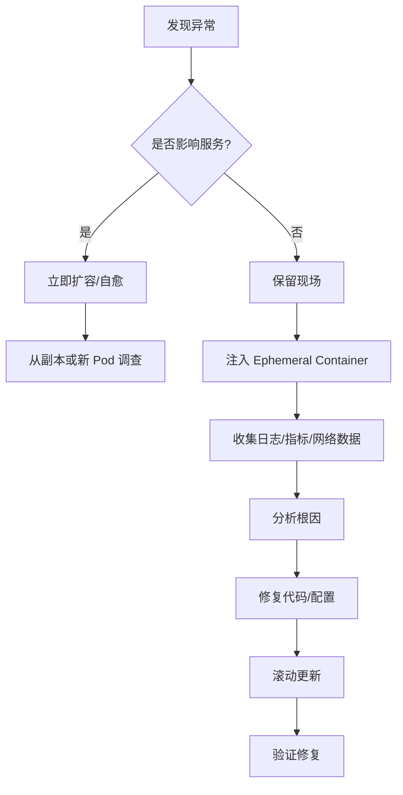

---

title: Kubernetes Debugging 实战：kubectl debug/ephemeral container/Lens——Laravel K8s
keywords: [Kubernetes Debugging, kubectl debug, ephemeral container, Lens, Laravel K8s]
description: 深入实战 Kubernetes 集群中 Laravel 应用的生产级故障排查方案，涵盖 kubectl debug、Ephemeral Container、Lens/OpenLens、k9s、Telepresence 等工具的完整使用指南。通过 Octane 内存泄漏、队列工作者崩溃、OOMKilled、网络抓包、Service Mesh 调试等真实场景，手把手教你零重启定位问题。附自定义调试镜像 Dockerfile、RBAC 权限配置、CI/CD 集成方案与 Prometheus 告警规则，助你构建系统化的 K8s 调试能力。
date: 2026-06-04 12:00:00
tags:
- Kubernetes
- kubectl debug
- ephemeral container
- lens
- Laravel
- 故障排查
categories:
- devops
cover: https://images.unsplash.com/photo-1667372393119-3d4c48d07fc9?w=1200&h=630&fit=crop
images:
  - https://images.unsplash.com/photo-1667372393119-3d4c48d07fc9?w=1200&h=630&fit=crop
---


在生产环境中运行 Laravel 应用的 Kubernetes 集群，故障排查是一项复杂且关键的运维技能。当 Pod 突然 OOMKilled、Octane 进程内存泄漏、队列工作者莫名崩溃时，传统的 SSH 登录服务器排查方式已不再适用。本文将深入介绍 `kubectl debug`、Ephemeral Container、Lens/OpenLens 等现代化调试工具，并结合 Laravel K8s 集群的实际场景，提供一套完整的生产级故障排查工具箱。

## 为什么 Kubernetes 调试如此特殊？

在传统服务器架构中，开发者可以直接 SSH 到机器上，使用 `strace`、`tcpdump`、`gdb` 等工具进行调试。但在 Kubernetes 环境中，存在以下挑战：

- **容器镜像最小化**：生产镜像通常基于 Alpine 或 Distroless，缺少调试工具
- **Pod 生命周期短暂**：Pod 可能随时被调度器重新调度到其他节点
- **网络隔离**：容器网络与宿主机网络隔离，传统网络调试工具无法直接使用
- **多副本场景**：同一个服务有多个副本，问题可能只出现在特定 Pod 中
- **不可变基础设施原则**：直接修改运行中的容器违背了 K8s 的设计理念

因此，我们需要专门的调试策略和工具集来应对这些挑战。

## 一、kubectl debug：官方调试利器

### 1.1 什么是 kubectl debug？

`kubectl debug` 是 Kubernetes v1.18 引入（v1.25 GA）的官方调试命令，它允许你在不重启原有容器的情况下，向运行中的 Pod 注入临时调试容器（Ephemeral Container），共享目标容器的进程命名空间和存储卷。

### 1.2 为 Laravel Pod 注入调试容器

假设我们的 Laravel 应用 Pod 名为 `laravel-app-7d8f9c6b4-xyz12`，运行的是精简的生产镜像：

```bash
# 查看当前 Pod 中可用的工具（通常很少）
kubectl exec laravel-app-7d8f9c6b4-xyz12 -- which curl
# 输出: which: curl not found

# 注入一个包含完整调试工具的临时容器
kubectl debug -it laravel-app-7d8f9c6b4-xyz12 \
  --image=nicolaka/netshoot \
  --target=laravel \
  --profile=general \
  -- sh
```

上述命令的参数含义：

| 参数 | 说明 |
|------|------|
| `-it` | 交互式终端模式 |
| `--image=nicolaka/netshoot` | 调试镜像，内置 curl、tcpdump、strace、dig 等工具 |
| `--target=laravel` | 指定目标容器名称，共享其进程命名空间 |
| `--profile=general` | 调试配置文件，可选 legacy/general/baseline/restricted |

### 1.3 调试配置文件详解

`kubectl debug` 提供了多个安全配置文件，适用于不同的安全策略环境：

```bash
# legacy：禁用所有安全限制，适用于开发环境
kubectl debug pod/my-pod --image=busybox --profile=legacy -- sh

# general：使用一般性的安全上下文
kubectl debug pod/my-pod --image=busybox --profile=general -- sh

# baseline：符合 Pod Security Standards 的 baseline 级别
kubectl debug pod/my-pod --image=busybox --profile=baseline -- sh

# restricted：最严格的安全策略
kubectl debug pod/my-pod --image=busybox --profile=restricted -- sh
```

### 1.4 复制 Pod 并附加调试容器

在某些场景下，你可能不希望直接影响正在运行的 Pod，可以选择复制一份进行调试：

```bash
# 复制 Pod 并添加调试容器
kubectl debug laravel-app-7d8f9c6b4-xyz12 \
  -it \
  --copy-to=laravel-app-debug \
  --container=laravel \
  --image=laravel-app:latest-debug \
  -- sh

# 如果你想用包含更多工具的调试镜像
kubectl debug laravel-app-7d8f9c6b4-xyz12 \
  -it \
  --copy-to=laravel-app-debug \
  --image=nicolaka/netshoot \
  -- sh
```

这种方式会创建一个新的 Pod `laravel-app-debug`，你可以在不影响原始 Pod 的情况下进行各种调试操作。

### 1.5 节点级别调试

当问题可能出在节点层面（如磁盘压力、内核问题）时，可以直接调试节点：

```bash
# 在节点上启动一个调试 Pod
kubectl debug node/worker-node-01 -it --image=ubuntu:22.04

# 进入节点的主机命名空间
kubectl debug node/worker-node-01 -it \
  --image=busybox \
  --profile=general \
  --host-pid=true \
  --host-network=true \
  -- chroot /host

# 在节点上检查进程（共享主机 PID 命名空间后）
ps aux | grep laravel
cat /host/var/log/syslog | grep -i oom
```

节点调试对于排查以下问题非常有价值：

- 节点级别的资源压力（Memory Pressure、Disk Pressure）
- 容器运行时问题（containerd、CRI-O 异常）
- 网络插件问题（Calico、Flannel 配置错误）
- 内核参数导致的容器异常

## 二、Ephemeral Container API 深入

### 2.1 API 层面理解

Ephemeral Container 是通过 Pod 的 `ephemeralcontainers` 子资源 API 实现的。理解其 API 结构有助于编写自定义调试控制器或集成到 CI/CD 流水线中。

一个典型的 Ephemeral Container 定义如下：

```yaml
apiVersion: v1
kind: Pod
metadata:
  name: laravel-app-7d8f9c6b4-xyz12
  namespace: production
spec:
  ephemeralContainers:
  - name: debugger-v2
    image: nicolaka/netshoot:latest
    command: ["sleep", "infinity"]
    targetContainerName: laravel
    securityContext:
      capabilities:
        add: ["NET_ADMIN", "NET_RAW"]
      privileged: false
    env:
    - name: POD_NAME
      valueFrom:
        fieldRef:
          fieldPath: metadata.name
    volumeMounts:
    - name: shared-logs
      mountPath: /var/log/laravel
```

### 2.2 通过 API 直接注入

```bash
# 使用 kubectl 的 patch 子资源 API 注入临时容器
kubectl patch pod laravel-app-7d8f9c6b4-xyz12 \
  --type='json' \
  -p='[{
    "op": "add",
    "path": "/spec/ephemeralContainers/-",
    "value": {
      "name": "debug-session",
      "image": "nicolaka/netshoot",
      "command": ["sleep", "3600"],
      "targetContainerName": "laravel",
      "stdin": true,
      "tty": true
    }
  }]'

# 查看注入的临时容器状态
kubectl get pod laravel-app-7d8f9c6b4-xyz12 -o jsonpath='{.status.ephemeralContainerStatuses[*].name}'
```

### 2.3 自定义调试镜像

为 Laravel 项目定制专用的调试镜像是一个值得推荐的实践：

```dockerfile
# Dockerfile.debug
FROM nicolaka/netshoot:latest

# 安装 PHP CLI 和常用扩展
RUN apk add --no-cache \
    php82-cli \
    php82-pdo \
    php82-mbstring \
    php82-xml \
    php82-curl \
    php82-dom \
    composer \
    strace \
    ltrace \
    sysstat

# 复制 Laravel 特定的调试脚本
COPY scripts/debug-laravel.sh /usr/local/bin/
COPY scripts/check-queue.sh /usr/local/bin/
COPY scripts/check-octane.sh /usr/local/bin/

RUN chmod +x /usr/local/bin/*.sh

# 设置别名方便使用
RUN echo 'alias artisan="php /app/artisan"' >> /root/.bashrc && \
    echo 'alias ll="ls -la"' >> /root/.bashrc && \
    echo 'alias logs="tail -f /var/log/laravel/*.log"' >> /root/.bashrc

ENTRYPOINT ["sleep", "infinity"]
```

构建并推送到私有仓库：

```bash
docker build -f Dockerfile.debug -t registry.example.com/laravel/debug-tools:v1.0 .
docker push registry.example.com/laravel/debug-tools:v1.0
```

### 2.4 Ephemeral Container 的限制

需要注意以下限制：

- Ephemeral Container 不能设置端口映射（不能使用 `ports` 字段）
- 不能设置资源请求和限制（在 K8s 1.28+ 中已支持）
- 不能使用探针（Liveness/Readiness Probe）
- 一旦添加到 Pod 中，不能被移除（除非删除整个 Pod）
- 需要 Kubernetes 1.23+ 版本支持

## 三、调试工具对比：Lens / k9s / Telepresence

### 3.1 Lens / OpenLens

Lens 是一个功能强大的 Kubernetes IDE，提供了图形化的集群管理界面。OpenLens 是其开源版本。

**核心调试功能：**

- **实时 Pod 日志查看**：多 Pod 日志流合并查看，支持关键词过滤
- **资源监控仪表板**：CPU、内存、网络、磁盘的实时图表
- **Pod Shell 直连**：一键进入 Pod 的终端
- **编辑资源**：直接在 GUI 中编辑 Deployment、ConfigMap、Secret 等
- **事件流监控**：实时查看集群事件，快速发现异常

**在 Laravel 集群中的应用：**

使用 Lens 时，你可以通过以下方式排查 Laravel 应用问题：

1. **查看 Pod 资源使用**：在 Workloads 面板中查看每个 Laravel Pod 的 CPU 和内存曲线，识别内存泄漏
2. **日志聚合分析**：选择所有 `laravel-queue-worker` Pod，合并查看队列处理日志
3. **ConfigMap 快速编辑**：直接修改 Laravel 的 `.env` 配置而不重建镜像
4. **事件关联分析**：通过 Events 面板关联 OOMKilled 事件与资源使用峰值

**安装和配置：**

```bash
# macOS 安装 OpenLens
brew install --cask openlens

# 或者使用 k8slens（商业版）
brew install --cask lens

# 配置集群访问（确保 kubeconfig 已正确配置）
kubectl config current-context
```

### 3.2 k9s：终端中的 K8s 管理利器

k9s 是一个基于终端的 Kubernetes 集群管理工具，非常适合在 SSH 或远程终端中使用。

```bash
# 安装 k9s
brew install k9s
# 或
curl -sS https://webinstall.dev/k9s | bash

# 启动 k9s
k9s -n production

# 常用快捷键
# :pod    - 查看 Pod 列表
# :deploy - 查看 Deployment
# :svc    - 查看 Service
# :log    - 查看日志
# :shell  - 进入 Pod Shell
# s       - 在 Pod 上按 s 键查看资源详情
# l       - 在 Pod 上按 l 键查看日志
# d       - 在 Pod 上按 d 键描述资源
# ctrl-d  - 删除选中的资源
```

**k9s 自定义配置（Laravel 调试专用）：**

```yaml
# ~/.k9s/config.yml
k9s:
  skin: dracula
  cluster: production
  namespace: laravel-production
  view:
    active: pods
  logger:
    tail: 200
    buffer: 5000
    sinceSeconds: 600
  thresholds:
    cpu:
      critical: 90
      warn: 70
    memory:
      critical: 85
      warn: 65
```

**k9s 插件（自定义调试快捷操作）：**

```yaml
# ~/.k9s/plugin.yml
plugin:
  debug-ephemeral:
    shortCut: Shift-D
    description: "注入调试容器"
    scopes:
      - pods
    command: bash
    background: false
    args:
      - -c
      - |
        kubectl debug -it $COL-RESOURCE \
          --image=registry.example.com/laravel/debug-tools:v1.0 \
          --target=laravel \
          -n $NAMESPACE \
          -- sh

  laravel-artisan:
    shortCut: Shift-A
    description: "执行 Artisan 命令"
    scopes:
      - pods
    command: bash
    background: false
    args:
      - -c
      - |
        kubectl exec -it $COL-RESOURCE \
          -n $NAMESPACE \
          -c laravel \
          -- php /app/artisan "$@"
```

### 3.3 Telepresence：本地-集群桥接

Telepresence 允许你在本地开发环境中直接访问 Kubernetes 集群中的服务，实现"混合"调试体验。

**在 Laravel 调试中的典型场景：**

- 本地运行 Laravel 应用，连接集群中的 MySQL/Redis
- 拦截发送到特定 Pod 的请求，在本地进行断点调试
- 测试本地代码变更对集群环境的影响

```bash
# 安装 Telepresence
brew install datawire/blackbird/telepresence

# 连接到集群
telepresence connect

# 连接后，本地可以直接访问集群服务
curl http://mysql-service.database.svc.cluster.local:3306

# 拦截发往 laravel-service 的请求（路由到本地）
telepresence intercept laravel-service \
  --namespace production \
  --port 8000:80 \
  --env-file ./telepresence-envs

# 查看拦截状态
telepresence list --namespace production

# 结束拦截
telepresence leave laravel-service

# 断开连接
telepresence quit
```

**使用 Telepresence 调试 Laravel 的工作流：**

1. 在本地启动 Laravel：`php artisan serve --port=8000`
2. 通过 Telepresence 拦截集群中的请求
3. 使用 Xdebug 在 IDE 中设置断点
4. 请求被路由到本地，进入断点调试
5. 调试完成后恢复拦截，集群流量恢复正常

### 3.4 工具对比总结

| 特性 | Lens/OpenLens | k9s | kubectl debug | Telepresence |
|------|:---:|:---:|:---:|:---:|
| 界面类型 | GUI | TUI | CLI | CLI |
| 临时容器注入 | ✅（通过插件） | ✅（通过插件） | ✅（原生支持） | ❌ |
| 日志查看 | ✅（增强） | ✅（增强） | ✅（基础） | ❌ |
| 资源监控 | ✅（图表） | ✅（文字） | ❌ | ❌ |
| 本地调试桥接 | ❌ | ❌ | ❌ | ✅ |
| 离线/断网使用 | ❌ | ✅ | ✅ | ❌ |
| 学习曲线 | 低 | 中 | 中 | 高 |
| 适用场景 | 日常监控排查 | 终端环境调试 | 精准调试注入 | 开发联调 |

## 四、Laravel 特定故障场景排查

### 4.1 场景一：Laravel Octane Pod 内存泄漏

Laravel Octane 使用 Swoole 或 RoadRunner 常驻进程，不正确的代码编写容易导致内存泄漏。

**症状识别：**

```bash
# 查看 Pod 内存使用趋势
kubectl top pod -l app=laravel-octane -n production

# 查看 Pod 状态和重启记录
kubectl describe pod laravel-octane-7d8f9c6b4-xyz12 -n production | grep -A5 "Last State"

# 典型输出
# Last State:     Terminated
#   Reason:       OOMKilled
#   Exit Code:    137
```

**注入调试容器进行内存分析：**

```bash
# 注入调试容器
kubectl debug -it laravel-octane-7d8f9c6b4-xyz12 \
  --image=registry.example.com/laravel/debug-tools:v1.0 \
  --target=laravel-octane \
  -n production \
  --profile=general \
  -- sh

# 在调试容器内，查看目标进程的内存使用
cat /proc/1/status | grep -i vmrss
cat /proc/1/smaps_rollup

# 使用 pmap 查看内存映射
pmap -x 1 | tail -1

# 查看 PHP 进程的内存分配
php /app/artisan octane:status

# 监控内存增长趋势
watch -n 5 'cat /proc/1/status | grep -i vm'
```

**Octane 内存泄漏检查脚本：**

```bash
#!/bin/bash
# scripts/check-octane.sh
# 在调试容器中执行

echo "=== Octane 进程内存状态 ==="
php /app/artisan octane:status

echo ""
echo "=== 系统内存使用 ==="
free -h

echo ""
echo "=== PHP 进程内存详情 ==="
for pid in $(pgrep -f "php.*octane"); do
    echo "PID: $pid"
    cat /proc/$pid/status | grep -E "^(VmRSS|VmSize|VmPeak|Threads)"
    echo "---"
done

echo ""
echo "=== Top 10 内存消耗线程 ==="
top -b -n 1 | head -20

echo ""
echo "=== Laravel 日志中的内存警告 ==="
grep -i "memory\|oom\|allowed memory" /var/log/laravel/*.log 2>/dev/null | tail -20
```

**Octane 专用 Deployment 配置（包含健康检查和资源限制）：**

```yaml
apiVersion: apps/v1
kind: Deployment
metadata:
  name: laravel-octane
  namespace: production
spec:
  replicas: 3
  selector:
    matchLabels:
      app: laravel-octane
  template:
    metadata:
      labels:
        app: laravel-octane
    spec:
      containers:
      - name: laravel-octane
        image: registry.example.com/laravel-app:v2.3.1
        command: ["php", "artisan", "octane:start", "--host=0.0.0.0", "--port=8000"]
        ports:
        - containerPort: 8000
        resources:
          requests:
            memory: "256Mi"
            cpu: "250m"
          limits:
            memory: "512Mi"
            cpu: "1000m"
        livenessProbe:
          httpGet:
            path: /up
            port: 8000
          initialDelaySeconds: 10
          periodSeconds: 15
          failureThreshold: 3
        readinessProbe:
          httpGet:
            path: /up
            port: 8000
          initialDelaySeconds: 5
          periodSeconds: 5
        env:
        - name: APP_ENV
          value: "production"
        - name: OCTANE_MAX_REQUESTS
          value: "500"
        - name: OCTANE_WORKERS
          value: "4"
```

### 4.2 场景二：队列工作者崩溃

Laravel 队列工作者（Queue Worker）在处理大量任务时可能出现各种问题。

**诊断步骤：**

```bash
# 查看队列工作者 Pod 的日志
kubectl logs -l app=laravel-queue-worker -n production --tail=200

# 查看最近的重启事件
kubectl get events -n production --field-selector involvedObject.name=laravel-queue-worker-5j9kp

# 注入调试容器检查队列状态
kubectl debug -it deploy/laravel-queue-worker \
  --image=registry.example.com/laravel/debug-tools:v1.0 \
  --target=queue-worker \
  -n production \
  -- sh

# 在调试容器内
php /app/artisan queue:monitor redis:default
php /app/artisan queue:failed
php /app/artisan horizon:status  # 如果使用 Horizon
```

**常见队列问题及排查：**

```bash
# 1. Redis 连接问题
kubectl debug -it deploy/laravel-queue-worker \
  --image=nicolaka/netshoot \
  --target=queue-worker \
  -n production \
  -- sh -c "nc -zv redis-service 6379"

# 2. 数据库锁等待
php /app/artisan tinker --execute="
    \$processes = DB::select('SHOW PROCESSLIST');
    foreach (\$processes as \$p) {
        if (\$p->State !== 'Sleep' && \$p->Time > 30) {
            echo 'Long running query: ' . \$p->Info . PHP_EOL;
        }
    }
"

# 3. 死锁检测
php /app/artisan tinker --execute="
    \$deadlocks = DB::select('SHOW ENGINE INNODB STATUS');
    echo \$deadlocks[0]->Status ?? 'No deadlocks found';
"
```

### 4.3 场景三：OOMKilled 容器

OOMKilled 是 Kubernetes 环境中最常见的问题之一，排查需要系统性的方法。

**立即排查步骤：**

```bash
# 1. 确认 OOMKilled 事件
kubectl get events -n production \
  --field-selector reason=OOMKilling \
  --sort-by='.lastTimestamp'

# 2. 查看 Pod 的资源使用历史
kubectl describe pod laravel-app-7d8f9c6b4-xyz12 -n production

# 3. 使用 kubectl top 查看当前资源使用
kubectl top pod laravel-app-7d8f9c6b4-xyz12 -n production --containers

# 4. 检查节点的 OOM 日志
kubectl debug node/worker-node-01 -it --image=ubuntu -- chroot /host \
  dmesg | grep -i "oom\|killed process"
```

**节点 OOM 日志分析：**

```bash
# 在节点调试容器中查看内核 OOM Killer 日志
dmesg | grep -A 20 "Out of memory"

# 典型输出分析
# [12345.678] Out of memory: Kill process 12345 (php) score 900 or sacrifice child
# [12345.678] Killed process 12345 (php) total-vm:1024000kB, anon-rss:512000kB

# 查看 cgroup 内存限制
cat /sys/fs/cgroup/memory/kubepods/pod<uid>/container<id>/memory.limit_in_bytes
cat /sys/fs/cgroup/memory/kubepods/pod<uid>/container<id>/memory.usage_in_bytes
```

### 4.4 场景四：Pod 启动失败

Laravel 应用 Pod 启动失败的常见原因和排查方法：

```bash
# 查看 Pod 状态
kubectl get pod laravel-app-7d8f9c6b4-xyz12 -n production -o wide

# 查看 Pod 事件（最直接的错误信息来源）
kubectl describe pod laravel-app-7d8f9c6b4-xyz12 -n production

# 查看初始化容器（Init Container）日志
kubectl logs laravel-app-7d8f9c6b4-xyz12 -c init-migrate -n production
kubectl logs laravel-app-7d8f9c6b4-xyz12 -c init-permissions -n production

# 查看应用容器日志（如果已启动过）
kubectl logs laravel-app-7d8f9c6b4-xyz12 -c laravel -n production --previous
```

**常见启动失败原因：**

| 现象 | 原因 | 排查方向 |
|------|------|----------|
| CrashLoopBackOff | 应用启动后立即退出 | 查看日志 `--previous` |
| ImagePullBackOff | 镜像拉取失败 | 检查镜像名称和 Registry 认证 |
| Init:Error | 初始化容器失败 | `kubectl logs <pod> -c <init>` |
| Pending | 资源不足或调度约束 | `kubectl describe pod` 查看 Events |
| ContainerCreating | 卷挂载或网络问题 | 查看 kubelet 日志 |

## 五、网络调试实战

### 5.1 使用 kubectl exec 进行基础网络诊断

```bash
# 注入网络调试容器
kubectl debug -it deploy/laravel-app \
  --image=nicolaka/netshoot \
  --target=laravel \
  -n production \
  -- sh

# DNS 解析测试
nslookup mysql-service.database.svc.cluster.local
dig mysql-service.database.svc.cluster.local +short

# TCP 连接测试
nc -zv mysql-service.database.svc.cluster.local 3306
nc -zv redis-service.database.svc.cluster.local 6379

# HTTP 请求测试
curl -v http://nginx-ingress-controller.ingress-nginx.svc.cluster.local/
curl -H "Host: app.example.com" http://ingress-service.ingress-nginx.svc.cluster.local/health

# 路由追踪
traceroute mysql-service.database.svc.cluster.local
```

### 5.2 使用 kubectl port-forward

```bash
# 将本地端口映射到 Pod 端口
kubectl port-forward pod/laravel-app-7d8f9c6b4-xyz12 8080:8000 -n production

# 将本地端口映射到 Service
kubectl port-forward svc/laravel-service 8080:80 -n production

# 多端口映射
kubectl port-forward pod/laravel-app-7d8f9c6b4-xyz12 8080:8000 9000:9000 -n production

# 后台运行
kubectl port-forward pod/laravel-app-7d8f9c6b4-xyz12 8080:8000 -n production &
```

**典型使用场景：**

1. **连接 Redis**：`kubectl port-forward svc/redis-master 6379:6379 -n database`，然后本地使用 Redis Desktop Manager 连接
2. **连接 MySQL**：`kubectl port-forward svc/mysql-primary 3306:3306 -n database`，本地使用 Navicat 或 DBeaver 连接
3. **调试 Laravel Horizon**：`kubectl port-forward svc/laravel-service 8080:8000`，浏览器访问 `localhost:8080/horizon`

### 5.3 使用临时容器进行网络抓包

```bash
# 注入带 tcpdump 的调试容器
kubectl debug -it laravel-app-7d8f9c6b4-xyz12 \
  --image=nicolaka/netshoot \
  --target=laravel \
  -n production \
  --profile=general \
  -- sh

# 在调试容器内抓取 MySQL 流量
tcpdump -i any -nn -A port 3306 -w /tmp/mysql-traffic.pcap

# 抓取 Redis 流量
tcpdump -i any -nn -A port 6379 -w /tmp/redis-traffic.pcap

# 抓取 HTTP 流量
tcpdump -i any -nn -A port 8000 -w /tmp/http-traffic.pcap

# 实时分析特定连接的流量
tcpdump -i any -nn host 10.244.1.5 and port 3306

# 将抓包文件复制出来分析
kubectl cp production/laravel-app-7d8f9c6b4-xyz12:debugger-v2:/tmp/mysql-traffic.pcap ./mysql-traffic.pcap
```

**分析 MySQL 连接问题的实际案例：**

```bash
# 场景：Laravel 报告 "MySQL server has gone away"

# 1. 首先抓包确认
tcpdump -i any -nn -A port 3306 | grep -E "(FIN|RST|gone away|error)"

# 2. 检查连接数
mysql -h mysql-service -u root -e "SHOW STATUS LIKE 'Threads_connected';"

# 3. 检查超时配置
mysql -h mysql-service -u root -e "SHOW VARIABLES LIKE 'wait_timeout';"
mysql -h mysql-service -u root -e "SHOW VARIABLES LIKE 'interactive_timeout';"

# 4. 在 Laravel 中验证配置
php artisan tinker --execute="
    config('database.connections.mysql.options');
    echo 'PDO ATTR: ' . print_r(PDO::getAvailableDrivers(), true);
"
```

### 5.4 Service Mesh 调试（Istio/Linkerd）

如果集群使用了 Service Mesh，调试会更加复杂：

```bash
# 检查 Istio Sidecar 注入状态
kubectl get pod laravel-app-7d8f9c6b4-xyz12 -n production \
  -o jsonpath='{.spec.containers[*].name}'

# 查看 Envoy 代理配置
kubectl exec -it laravel-app-7d8f9c6b4-xyz12 -c istio-proxy -n production \
  -- pilot-agent request GET clusters

# 查看路由配置
kubectl exec -it laravel-app-7d8f9c6b4-xyz12 -c istio-proxy -n production \
  -- pilot-agent request GET routes

# 查看 Envoy 日志
kubectl logs laravel-app-7d8f9c6b4-xyz12 -c istio-proxy -n production --tail=100

# 启用调试日志
kubectl exec -it laravel-app-7d8f9c6b4-xyz12 -c istio-proxy -n production \
  -- curl -X POST localhost:15000/logging?level=debug
```

## 六、生产环境调试工作流：零重启调试

### 6.1 不重启 Pod 的调试原则

在生产环境中，重启 Pod 意味着：

- 服务可用性降低（尤其在只有一个副本时）
- 宝贵的现场证据丢失
- 用户体验中断

因此，我们需要一套完整的零重启调试流程：



### 6.2 标准调试流程

**第一步：快速评估**

```bash
# 获取集群整体状态
kubectl get pods -n production -o wide
kubectl top nodes
kubectl top pods -n production

# 检查异常 Pod
kubectl get pods -n production | grep -v Running | grep -v Completed

# 查看最近事件
kubectl get events -n production --sort-by='.lastTimestamp' | tail -20
```

**第二步：收集现场证据**

```bash
# 创建调试目录
mkdir -p /tmp/k8s-debug/$(date +%Y%m%d-%H%M%S)
cd /tmp/k8s-debug/$(date +%Y%m%d-%H%M%S)

# 导出 Pod 描述
kubectl describe pod laravel-app-7d8f9c6b4-xyz12 -n production > pod-describe.txt

# 导出 Pod 日志
kubectl logs laravel-app-7d8f9c6b4-xyz12 -n production --tail=1000 > pod-logs.txt
kubectl logs laravel-app-7d8f9c6b4-xyz12 -n production --previous > pod-logs-previous.txt 2>/dev/null

# 导出 Deployment 配置
kubectl get deploy laravel-app -n production -o yaml > deployment.yaml

# 导出事件
kubectl get events -n production --field-selector involvedObject.name=laravel-app-7d8f9c6b4-xyz12 > events.txt

# 导出节点信息
NODE=$(kubectl get pod laravel-app-7d8f9c6b4-xyz12 -n production -o jsonpath='{.spec.nodeName}')
kubectl describe node $NODE > node-describe.txt
```

**第三步：注入调试容器**

```bash
# 注入调试容器（不影响原有容器运行）
kubectl debug -it laravel-app-7d8f9c6b4-xyz12 \
  --image=registry.example.com/laravel/debug-tools:v1.0 \
  --target=laravel \
  -n production \
  --profile=general \
  -- sh
```

**第四步：运行诊断脚本**

```bash
# 在调试容器内运行综合诊断
#!/bin/bash
echo "========== 系统信息 =========="
uname -a
cat /etc/os-release

echo ""
echo "========== 内存使用 =========="
free -h
cat /proc/meminfo | head -10

echo ""
echo "========== 磁盘使用 =========="
df -h

echo ""
echo "========== 网络状态 =========="
ip addr show
ss -tlnp

echo ""
echo "========== 进程列表 =========="
ps aux --sort=-%mem | head -20

echo ""
echo "========== PHP 进程状态 =========="
pgrep -a php

echo ""
echo "========== Laravel 日志（最近 50 行）========="
tail -50 /var/log/laravel/laravel.log 2>/dev/null || echo "日志文件不存在"

echo ""
echo "========== 队列状态 =========="
php /app/artisan queue:monitor redis:default 2>/dev/null || echo "无法连接队列"
```

## 七、CI/CD 集成与 RBAC 调试权限

### 7.1 调试专用 RBAC 配置

为了安全地进行生产调试，需要配置精细化的 RBAC 权限：

```yaml
# 调试专用 Role
apiVersion: rbac.authorization.k8s.io/v1
kind: Role
metadata:
  name: debugger-role
  namespace: production
rules:
# 允许查看 Pod
- apiGroups: [""]
  resources: ["pods", "pods/log", "pods/status"]
  verbs: ["get", "list", "watch"]
# 允许注入临时容器
- apiGroups: [""]
  resources: ["pods/ephemeralcontainers"]
  verbs: ["patch", "update"]
# 允许执行命令（kubectl exec）
- apiGroups: [""]
  resources: ["pods/exec"]
  verbs: ["create"]
# 允许端口转发
- apiGroups: [""]
  resources: ["pods/portforward"]
  verbs: ["create"]
# 允许查看事件和日志
- apiGroups: [""]
  resources: ["events"]
  verbs: ["get", "list", "watch"]
# 允许查看 ConfigMap 和 Secret（用于配置排查）
- apiGroups: [""]
  resources: ["configmaps"]
  verbs: ["get", "list"]
# 允许查看 Deployment
- apiGroups: ["apps"]
  resources: ["deployments", "replicasets"]
  verbs: ["get", "list", "watch"]

---
# 调试专用 RoleBinding
apiVersion: rbac.authorization.k8s.io/v1
kind: RoleBinding
metadata:
  name: debugger-rolebinding
  namespace: production
subjects:
- kind: Group
  name: "debug-team"
  apiGroup: rbac.authorization.k8s.io
roleRef:
  kind: Role
  name: debugger-role
  apiGroup: rbac.authorization.k8s.io
```

**更安全的方案：基于命名空间的只读 + 调试权限分离**

```yaml
# 只读 ClusterRole（集群级）
apiVersion: rbac.authorization.k8s.io/v1
kind: ClusterRole
metadata:
  name: k8s-readonly
rules:
- apiGroups: [""]
  resources: ["namespaces", "nodes", "persistentvolumes"]
  verbs: ["get", "list", "watch"]
- apiGroups: ["metrics.k8s.io"]
  resources: ["nodes", "pods"]
  verbs: ["get", "list"]

---
# 调试权限需要通过审批流程获得
apiVersion: rbac.authorization.k8s.io/v1
kind: ClusterRole
metadata:
  name: ephemeral-container-creator
rules:
- apiGroups: [""]
  resources: ["pods/ephemeralcontainers"]
  verbs: ["patch", "update"]
- apiGroups: [""]
  resources: ["pods/exec"]
  verbs: ["create"]
```

### 7.2 CI/CD 流水线中的调试策略

**GitLab CI 集成示例：**

```yaml
# .gitlab-ci.yml
stages:
  - build
  - test
  - deploy
  - debug

# 仅在手动触发时执行的调试 Job
debug-production:
  stage: debug
  image: registry.example.com/kubectl:latest
  script:
    - |
      # 验证调试权限
      kubectl auth can-i patch pods/ephemeralcontainers \
        -n production
      
      # 获取目标 Pod 列表
      PODS=$(kubectl get pods -n production -l app=laravel-app \
        -o jsonpath='{.items[*].metadata.name}')
      
      for POD in $PODS; do
        echo "=== 调试 Pod: $POD ==="
        
        # 导出诊断信息
        kubectl describe pod $POD -n production > "debug-${POD}.txt"
        kubectl logs $POD -n production --tail=500 >> "debug-${POD}.txt"
        
        # 运行健康检查
        kubectl exec $POD -n production -c laravel -- \
          php /app/artisan about >> "debug-${POD}.txt" 2>/dev/null
      done
  when: manual
  allow_failure: true
  environment:
    name: production-debug
  artifacts:
    paths:
      - debug-*.txt
    expire_in: 7 days
```

**ArgoCD 集成：**

```yaml
# argocd-debug-plugin.yaml
apiVersion: argoproj.io/v1alpha1
kind: ConfigManagementPlugin
metadata:
  name: k8s-debugger
spec:
  init:
    command: ["/bin/sh", "-c"]
    args: ["echo 'Debug plugin initialized'"]
  generate:
    command: ["/bin/sh", "-c"]
    args:
      - |
        # 生成调试相关的 RBAC 和 ConfigMap
        cat <<EOF
        apiVersion: v1
        kind: ConfigMap
        metadata:
          name: debug-scripts
        data:
          diagnose.sh: |
            #!/bin/bash
            kubectl get pods -n $ARGOCD_APP_NAMESPACE
            kubectl top pods -n $ARGOCD_APP_NAMESPACE
            kubectl get events -n $ARGOCD_APP_NAMESPACE --sort-by='.lastTimestamp'
        EOF
```

### 7.3 使用 kubeconfig 分发调试凭证

```bash
# 为调试人员创建受限的 kubeconfig
# 1. 创建 ServiceAccount
kubectl create serviceaccount debugger-sa -n production

# 2. 绑定到调试 Role
kubectl create rolebinding debugger-sa-binding \
  --role=debugger-role \
  --serviceaccount=production:debugger-sa \
  -n production

# 3. 生成 kubeconfig
SECRET_NAME=$(kubectl get serviceaccount debugger-sa -n production \
  -o jsonpath='{.secrets[0].name}')

TOKEN=$(kubectl get secret $SECRET_NAME -n production \
  -o jsonpath='{.data.token}' | base64 -d)

cat <<EOF > debugger-kubeconfig.yaml
apiVersion: v1
kind: Config
clusters:
- cluster:
    server: https://k8s-api-server:6443
    certificate-authority-data: <CA_DATA>
  name: production-cluster
contexts:
- context:
    cluster: production-cluster
    namespace: production
    user: debugger-sa
  name: debug-context
current-context: debug-context
users:
- name: debugger-sa
  user:
    token: $TOKEN
EOF
```

## 八、调试工具箱速查表

### 8.1 常用 kubectl 调试命令

```bash
# === 基础诊断 ===
kubectl get pods -n production -o wide                    # 查看 Pod 列表和节点分布
kubectl top pods -n production --sort-by=memory           # 按内存排序查看资源使用
kubectl describe pod <pod> -n production                  # 查看 Pod 详细信息和事件
kubectl logs <pod> -n production -f --tail=100            # 实时查看日志
kubectl logs <pod> -n production --previous               # 查看上一次崩溃的日志
kubectl get events -n production --sort-by='.lastTimestamp' # 查看集群事件

# === 调试容器 ===
kubectl debug -it <pod> --image=busybox -- sh             # 注入简单调试容器
kubectl debug -it <pod> --image=nicolaka/netshoot --target=<container> -- sh  # 注入网络调试工具
kubectl debug <pod> --copy-to=debug-pod --image=busybox -- sh  # 复制 Pod 调试
kubectl debug node/<node> -it --image=ubuntu -- chroot /host   # 节点调试

# === 网络调试 ===
kubectl exec -it <pod> -- nslookup <service>              # DNS 解析测试
kubectl exec -it <pod> -- nc -zv <host> <port>            # TCP 连接测试
kubectl port-forward <pod> <local-port>:<remote-port>     # 端口转发
kubectl port-forward svc/<service> <local-port>:<remote-port>  # Service 端口转发

# === 资源监控 ===
kubectl top nodes                                         # 节点资源使用
kubectl top pods -n production                            # Pod 资源使用
kubectl get hpa -n production                             # HPA 状态
kubectl get pdb -n production                             # PDB 状态
```

### 8.2 调试检查清单

在进行生产环境调试时，建议按以下清单逐步排查：

**🔴 P0 - 紧急（影响用户）**

- [ ] 确认影响范围（哪些服务受影响，用户影响程度）
- [ ] 检查 Pod 状态（Running/CrashLoopBackOff/OOMKilled）
- [ ] 查看最近事件和日志
- [ ] 评估是否需要立即扩容或回滚
- [ ] 通知相关团队

**🟡 P1 - 重要（服务降级）**

- [ ] 注入 Ephemeral Container 收集诊断数据
- [ ] 分析资源使用趋势（CPU/内存/网络/磁盘）
- [ ] 检查下游依赖（数据库、Redis、外部API）
- [ ] 分析网络连接状态
- [ ] 检查 HPA/PDB 配置是否合理

**🟢 P2 - 一般（性能优化）**

- [ ] 分析慢查询日志
- [ ] 检查 Laravel 日志中的 Warning 和 Notice
- [ ] 评估队列积压情况
- [ ] 检查缓存命中率
- [ ] 优化资源请求和限制配置

## 九、团队最佳实践

### 9.1 调试文化

1. **Blameless Postmortem（无指责事后分析）**：故障后不追究个人责任，而是分析系统性原因
2. **调试即文档**：每次调试过程都应记录下来，形成团队知识库
3. **演练常态化**：定期进行故障演练（Chaos Engineering），保持团队调试能力

### 9.2 工具标准化

1. **统一调试镜像**：团队维护一套标准的调试镜像，包含所有常用工具
2. **脚本库建设**：将诊断脚本纳入版本控制，持续完善
3. **权限最小化**：每个人只获得必要的调试权限，定期审计

### 9.3 监控与告警前置

调试应该是被动响应，更好的做法是建立完善的监控告警体系：

```yaml
# Prometheus 告警规则示例
groups:
- name: laravel-k8s-alerts
  rules:
  - alert: LaravelPodOOMRisk
    expr: |
      container_memory_working_set_bytes{container="laravel"} 
      / container_spec_memory_limit_bytes > 0.85
    for: 5m
    labels:
      severity: warning
    annotations:
      summary: "Laravel Pod {{ $labels.pod }} 内存使用超过 85%"
      description: "Pod 可能面临 OOMKilled 风险，请检查内存泄漏"

  - alert: LaravelQueueBacklog
    expr: |
      laravel_queue_jobs_pending > 1000
    for: 2m
    labels:
      severity: critical
    annotations:
      summary: "Laravel 队列积压超过 1000 个任务"
      description: "队列工作者可能已停止或性能不足"

  - alert: LaravelOctaneHighMemory
    expr: |
      rate(container_memory_working_set_bytes{container="laravel-octane"}[10m]) > 0
    for: 15m
    labels:
      severity: warning
    annotations:
      summary: "Octane 进程内存持续增长"
      description: "可能存在内存泄漏，建议检查 Octane Worker 状态"
```

### 9.4 文档模板

```markdown
# 故障调试记录模板

## 基本信息
- **日期**：YYYY-MM-DD HH:MM
- **影响服务**：
- **严重级别**：P0/P1/P2
- **处理人员**：

## 现象描述
（简述发现的问题和影响）

## 排查过程
1. （执行的命令和获得的结果）
2. ...

## 根因分析
（问题的根本原因）

## 解决方案
（采取的修复措施）

## 预防措施
（如何避免问题再次发生）

## 时间线
- HH:MM 发现异常
- HH:MM 开始排查
- HH:MM 定位根因
- HH:MM 完成修复
- HH:MM 服务恢复正常
```

## 总结

Kubernetes 环境下的 Laravel 应用调试，需要开发者和运维人员掌握一套全新的工具链和方法论。`kubectl debug` 和 Ephemeral Container 为我们提供了不重启 Pod 的调试能力，Lens/k9s 等工具提升了日常运维效率，而 Telepresence 则为本地开发调试打开了新的可能。

关键要点回顾：

1. **优先使用 Ephemeral Container**：不修改原始 Pod，安全可靠
2. **准备定制调试镜像**：包含 PHP CLI、网络工具、Laravel 调试脚本
3. **遵循零重启原则**：保留现场，先收集证据再修复
4. **建立标准流程**：调试检查清单、记录模板、权限管理
5. **监控先行**：完善的监控告警可以减少 80% 的被动调试

掌握这些工具和方法，你的 Laravel Kubernetes 集群故障排查能力将提升到一个新的水平。在生产环境中遇到问题时，不再手忙脚乱，而是从容应对、精准定位、快速恢复。

## 相关阅读

- [Chaos Engineering 实战：用 Chaos Mesh 对 Laravel 微服务进行故障注入与韧性测试](/categories/运维/Chaos-Engineering-实战/)
- [Linux 安全加固实战：AppArmor/SELinux/seccomp 策略——Docker/K8s 容器逃逸防护与最小权限落地](/categories/运维/Linux-安全加固实战-AppArmor-SELinux-seccomp-容器逃逸防护与最小权限落地/)
- [Incident Command 实战：生产故障应急响应——PagerDuty 集成、War Room 协作与 Postmortem 文化](/categories/运维/Incident-Command-实战-生产故障应急响应-PagerDuty-WarRoom-Postmortem/)
