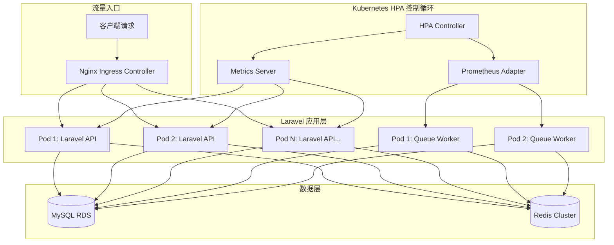
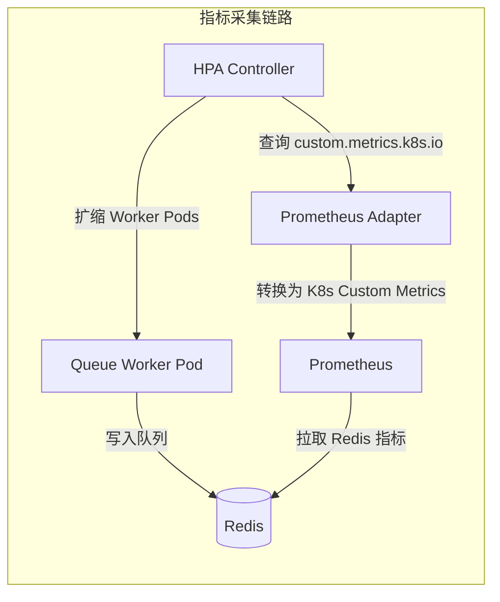

---

title: Kubernetes-HPA-实战-Laravel-应用自动扩缩容策略与踩坑记录
keywords: [Kubernetes, HPA, Laravel, 应用自动扩缩容策略与踩坑记录]
cover: https://images.unsplash.com/photo-1667372393119-3d4c48d07fc9?w=1200&h=630&fit=crop
images:
  - https://images.unsplash.com/photo-1667372393119-3d4c48d07fc9?w=1200&h=630&fit=crop
date: 2026-05-17 02:45:19
updated: 2026-05-17 02:47:22
categories:
- devops
- kubernetes
tags:
- DevOps
- Kubernetes
- Laravel
- autoscaling
description: 深入讲解 Kubernetes HPA 在 Laravel 应用中的自动扩缩容实战。涵盖 Metrics Server 安装与踩坑、CPU/内存/自定义指标（队列深度）配置、Queue Worker 优雅终止与信号处理、HPA/VPA/KEDA 选型对比、多指标组合扩缩策略、容量规划与压测校准，附生产级 YAML 模板与排障命令清单，助你搭建稳定可靠的弹性伸缩体系。
---


# Kubernetes HPA 实战：Laravel 应用自动扩缩容策略与踩坑记录

## 为什么需要 HPA？

在 KKday B2C Backend Team 的日常运维中，我经历过最痛的一次事故：2025 年黑五大促，流量在 10 分钟内从 200 QPS 飙到 3000 QPS，3 台 Pod 的 Laravel API 直接被打挂，等运维同事 SSH 上去手动扩容到 12 台时，已经过了 15 分钟，损失了大量订单。

从那以后，我们引入了 **Kubernetes HPA（Horizontal Pod Autoscaler）**——让 K8s 根据实时指标自动增减 Pod 数量，真正做到"流量来了就扩、流量走了就缩"。

## 架构总览



HPA 的核心是一个**控制循环**：每隔 15 秒（默认）检查一次指标，计算当前值与目标值的比值，然后决定扩容还是缩容。

## 一、Metrics Server 安装：最容易被忽略的第一步

HPA 依赖 Metrics Server 提供 CPU/Memory 指标。很多教程只说"安装 Metrics Server"，但实际部署中踩坑无数。

### 安装

```bash
# 安装 Metrics Server
kubectl apply -f https://github.com/kubernetes-sigs/metrics-server/releases/latest/download/components.yaml

# 验证安装
kubectl get deployment metrics-server -n kube-system
kubectl top nodes
```

### 踩坑 1：内网集群无法下载镜像

如果你的 K8s 集群在内网（比如我们用阿里云 ACK），直接 `kubectl apply` 会因为拉不到 `registry.k8s.io` 的镜像而失败。

```bash
# 解决方案：提前拉取镜像并推送到私有仓库
docker pull registry.k8s.io/metrics-server/metrics-server:v0.7.1
docker tag registry.k8s.io/metrics-server/metrics-server:v0.7.1 \
  registry.cn-hangzhou.aliyuncs.com/your-namespace/metrics-server:v0.7.1
docker push registry.cn-hangzhou.aliyuncs.com/your-namespace/metrics-server:v0.7.1

# 然后修改 components.yaml 中的 image 字段
```

### 踩坑 2：kubelet 使用自签名证书

在自建集群中，kubelet 默认使用自签名证书，Metrics Server 无法采集指标。需要添加 `--kubelet-insecure-tls` 参数：

```yaml
# components.yaml 中修改 args
containers:
  - name: metrics-server
    args:
      - --cert-dir=/tmp
      - --secure-port=10250
      - --kubelet-preferred-address-types=InternalIP,ExternalIP,Hostname
      - --kubelet-use-node-status-port
      - --metric-resolution=15s
      - --kubelet-insecure-tls  # ← 关键：自签名证书必须加
```

验证安装成功：

```bash
$ kubectl top nodes
NAME                    CPU(cores)   CPU%   MEMORY(bytes)   MEMORY%
node-1                  250m         12%    1024Mi          25%
node-2                  180m         9%     876Mi           21%

$ kubectl top pods -n production
NAME                        CPU(cores)   MEMORY(bytes)
laravel-api-7d4b8c6f-x2k9  45m          128Mi
laravel-api-7d4b8c6f-z8p1  38m          112Mi
```

## 二、基础 HPA 配置：基于 CPU 的自动扩缩

### Deployment 配置

首先，Laravel API 的 Deployment 必须设置 `resources.requests`——HPA 用它来计算 CPU 使用率百分比：

```yaml
# laravel-api-deployment.yaml
apiVersion: apps/v1
kind: Deployment
metadata:
  name: laravel-api
  namespace: production
spec:
  replicas: 3
  selector:
    matchLabels:
      app: laravel-api
  template:
    metadata:
      labels:
        app: laravel-api
    spec:
      containers:
        - name: laravel-api
          image: registry.cn-hangzhou.aliyuncs.com/kkday/laravel-api:v1.2.3
          ports:
            - containerPort: 9000
          resources:
            requests:
              cpu: 250m      # ← HPA 用这个计算百分比
              memory: 256Mi
            limits:
              cpu: 1000m
              memory: 512Mi
          livenessProbe:
            httpGet:
              path: /health
              port: 9000
            initialDelaySeconds: 30
            periodSeconds: 10
          readinessProbe:
            httpGet:
              path: /ready
              port: 9000
            initialDelaySeconds: 10
            periodSeconds: 5
```

### HPA 配置

```yaml
# hpa-laravel-api.yaml
apiVersion: autoscaling/v2
kind: HorizontalPodAutoscaler
metadata:
  name: laravel-api-hpa
  namespace: production
spec:
  scaleTargetRef:
    apiVersion: apps/v1
    kind: Deployment
    name: laravel-api
  minReplicas: 3        # 最小副本数：不能低于 3（保证高可用）
  maxReplicas: 20       # 最大副本数：根据预算和集群容量设定
  metrics:
    - type: Resource
      resource:
        name: cpu
        target:
          type: Utilization
          averageUtilization: 70  # CPU 使用率超过 70% 就扩容
  behavior:
    scaleUp:
      stabilizationWindowSeconds: 30   # 扩容稳定窗口：30 秒内不重复评估
      policies:
        - type: Pods
          value: 4                     # 每次最多扩 4 个 Pod
          periodSeconds: 60
        - type: Percent
          value: 100                   # 或者翻倍（取较大值）
          periodSeconds: 60
      selectPolicy: Max
    scaleDown:
      stabilizationWindowSeconds: 300  # 缩容稳定窗口：5 分钟（避免抖动）
      policies:
        - type: Pods
          value: 2                     # 每次最多缩 2 个 Pod
          periodSeconds: 120
```

### 踩坑 3：扩容快、缩容慢是正确策略

`behavior` 字段是 v2 API 的精华。很多新手把 `scaleDown` 的策略设得和 `scaleUp` 一样激进，结果在流量波动时出现"扩了又缩、缩了又扩"的抖动，用户体验极差。

**黄金法则**：扩容要快（30秒稳定窗口），缩容要慢（5分钟稳定窗口）。

### 踩坑 4：没有设置 requests 导致 HPA 无效

如果你的 Deployment 没有设置 `resources.requests.cpu`，HPA 会显示 `<unknown>` 状态：

```bash
$ kubectl get hpa -n production
NAME               REFERENCE                 TARGETS        MINPODS   MAXPODS   REPLICAS   AGE
laravel-api-hpa    Deployment/laravel-api    <unknown>/70%  3         20        3          5m
```

解决方法：确保 Deployment 的 `resources.requests.cpu` 已设置。

## 三、自定义指标扩缩：基于 Laravel Queue 队列深度

对于 Laravel 的 Queue Worker，CPU 使用率不是好的扩缩指标。真正有意义的是**队列中待处理的任务数**——如果队列积压了 5000 个任务，说明需要更多 Worker。

### 架构图



### 第一步：用 Prometheus 采集 Redis 队列深度

安装 `redis_exporter`，让它采集 Redis 的 `LLEN` 值：

```yaml
# redis-exporter-deployment.yaml
apiVersion: apps/v1
kind: Deployment
metadata:
  name: redis-exporter
  namespace: production
spec:
  replicas: 1
  selector:
    matchLabels:
      app: redis-exporter
  template:
    metadata:
      labels:
        app: redis-exporter
    spec:
      containers:
        - name: redis-exporter
          image: oliver006/redis_exporter:v1.58.0
          ports:
            - containerPort: 9121
          env:
            - name: REDIS_ADDR
              value: "redis://redis-cluster:6379"
            - name: REDIS_PASSWORD
              valueFrom:
                secretKeyRef:
                  name: redis-secret
                  key: password
```

然后在 Prometheus 的 `scrape_configs` 中添加：

```yaml
# prometheus-values.yaml（Helm Chart values）
scrape_configs:
  - job_name: 'redis-exporter'
    static_configs:
      - targets: ['redis-exporter:9121']
    metrics_path: /metrics
```

### 第二步：安装 Prometheus Adapter

```bash
helm repo add prometheus-community https://prometheus-community.github.io/helm-charts
helm install prometheus-adapter prometheus-community/prometheus-adapter \
  --namespace monitoring \
  --set prometheus.url=http://prometheus-server \
  --set prometheus.port=9090
```

配置自定义指标规则：

```yaml
# prometheus-adapter-values.yaml
rules:
  custom:
    - seriesQuery: 'redis_key_length{key=~"queues:default"}'
      resources:
        overrides:
          namespace: {resource: "namespace"}
      name:
        matches: "redis_key_length"
        as: "laravel_queue_depth"
      metricsQuery: 'redis_key_length{key="queues:default"}'
```

### 第三步：配置基于队列深度的 HPA

```yaml
# hpa-queue-worker.yaml
apiVersion: autoscaling/v2
kind: HorizontalPodAutoscaler
metadata:
  name: queue-worker-hpa
  namespace: production
spec:
  scaleTargetRef:
    apiVersion: apps/v1
    kind: Deployment
    name: laravel-queue-worker
  minReplicas: 2
  maxReplicas: 15
  metrics:
    - type: Pods
      pods:
        metric:
          name: laravel_queue_depth
        target:
          type: AverageValue
          averageValue: "500"  # 每个 Worker 平均处理 500 个待处理任务
  behavior:
    scaleUp:
      stabilizationWindowSeconds: 60
      policies:
        - type: Pods
          value: 3
          periodSeconds: 60
    scaleDown:
      stabilizationWindowSeconds: 600  # 队列消费完后等 10 分钟再缩容
      policies:
        - type: Pods
          value: 1
          periodSeconds: 120
```

### 踩坑 5：Queue Worker 缩容时正在执行的任务被中断

这是最痛的坑。当 HPA 缩容时，Kubernetes 会直接发送 `SIGTERM` 给被删除的 Pod。如果你的 Laravel Queue Worker 正在执行一个耗时 5 分钟的支付回调处理，任务会被中断。

解决方案：配置 `terminationGracePeriodSeconds` 和 Laravel 的信号处理：

```yaml
# Deployment 中的 Pod spec
spec:
  terminationGracePeriodSeconds: 300  # 给 5 分钟优雅终止时间
  containers:
    - name: queue-worker
      command: ["php", "artisan", "queue:work", "redis", "--tries=3", "--timeout=280"]
      lifecycle:
        preStop:
          exec:
            command: ["php", "artisan", "queue:restart"]
```

同时在 `app/Console/Kernel.php` 中注册信号处理：

```php
// app/Console/Kernel.php
protected function schedule(Schedule $schedule)
{
    // ...
}

protected function signals()
{
    $this->trap(SIGTERM, function () {
        Log::info('Queue Worker received SIGTERM, waiting for current job to finish...');
        // queue:work 已内置 SIGTERM 处理，会等当前任务完成后再退出
    });
}
```

### 踩坑 6：多队列时指标不准确

如果你有多个队列（`default`、`payments`、`notifications`），需要分别监控：

```yaml
# 分别为不同队列配置 HPA
# payments 队列：权重最高，优先扩容
metrics:
  - type: Pods
    pods:
      metric:
        name: laravel_queue_depth
        selector:
          matchLabels:
            queue: payments
      target:
        type: AverageValue
        averageValue: "200"  # 支付队列阈值更低，更敏感
```

## 四、多指标组合扩缩：CPU + 内存 + 队列深度

生产环境中，单一指标往往不够。我们最终采用的是**多指标组合**策略：

```yaml
# 最终生产版 HPA 配置
apiVersion: autoscaling/v2
kind: HorizontalPodAutoscaler
metadata:
  name: laravel-api-hpa
  namespace: production
spec:
  scaleTargetRef:
    apiVersion: apps/v1
    kind: Deployment
    name: laravel-api
  minReplicas: 3
  maxReplicas: 20
  metrics:
    # 指标 1：CPU 使用率
    - type: Resource
      resource:
        name: cpu
        target:
          type: Utilization
          averageUtilization: 70
    # 指标 2：内存使用率
    - type: Resource
      resource:
        name: memory
        target:
          type: Utilization
          averageUtilization: 80
    # 指标 3：自定义指标（每秒请求数）
    - type: Pods
      pods:
        metric:
          name: http_requests_per_second
        target:
          type: AverageValue
          averageValue: "100"
  behavior:
    scaleUp:
      stabilizationWindowSeconds: 30
      policies:
        - type: Percent
          value: 100
          periodSeconds: 60
      selectPolicy: Max
    scaleDown:
      stabilizationWindowSeconds: 300
      policies:
        - type: Pods
          value: 2
          periodSeconds: 120
```

**关键逻辑**：当存在多个指标时，HPA 会分别计算每个指标需要的副本数，然后取**最大值**。这意味着只要任一指标触发阈值，就会扩容。

## 五、踩坑记录汇总

### 坑 7：Pod 启动太慢，扩容来不及

Laravel 应用冷启动需要加载 Composer autoload、配置缓存、路由缓存等，首次请求可能需要 3-5 秒。在流量洪峰时，HPA 虽然触发了扩容，但新 Pod 的 `readinessProbe` 还没通过，流量全打到老 Pod 上，老 Pod 被打挂。

**解决方案**：

```yaml
# 1. 启用配置缓存（Dockerfile 中）
RUN php artisan config:cache && \
    php artisan route:cache && \
    php artisan view:cache && \
    php artisan event:cache

# 2. 设置合理的探针参数
readinessProbe:
  httpGet:
    path: /ready
    port: 9000
  initialDelaySeconds: 5      # 缩短初始延迟
  periodSeconds: 3             # 缩短检查间隔
  failureThreshold: 2          # 减少失败次数

# 3. 使用 preStop hook 做预热
lifecycle:
  postStart:
    exec:
      command: ["php", "artisan", "opcache:compile"]
```

### 坑 8：集群节点不够，HPA 扩了 Pod 但 Pending

HPA 扩容 Pod 是第一步，但如果集群节点资源不足，Pod 会处于 `Pending` 状态。

```bash
$ kubectl get pods -n production | grep Pending
laravel-api-7d4b8c6f-abc12   0/1     Pending   0          2m

$ kubectl describe pod laravel-api-7d4b8c6f-abc12 -n production
Events:
  Warning  FailedScheduling  0/3 nodes are available:
    1 Insufficient cpu, 2 Insufficient memory.
```

**解决方案**：配合 Cluster Autoscaler（节点自动扩缩容）：

```yaml
# 阿里云 ACK 的节点池配置
apiVersion: cs.aliyun.com/v1
kind: ClusterAutoscaler
metadata:
  name: cluster-autoscaler
spec:
  nodeGroups:
    - name: api-node-pool
      minSize: 3
      maxSize: 10
      instanceTypes: ["ecs.g6.xlarge"]
      labels:
        workload-type: api
```

### 坑 9：HPA 频繁抖动（flapping）

在某次生产环境中，HPA 出现了疯狂抖动：14:00 扩到 8 个 → 14:05 缩到 5 个 → 14:10 又扩到 7 个 → 14:15 缩到 4 个。

原因是 `stabilizationWindowSeconds` 设得太短（60秒），而且缩容策略太激进。

**修复**：

```yaml
behavior:
  scaleDown:
    stabilizationWindowSeconds: 600  # 从 60s 改为 600s
    policies:
      - type: Pods
        value: 1                     # 从 3 改为 1
        periodSeconds: 180           # 从 60s 改为 180s
```

### 坑 10：Laravel Session 丢失

当 HPA 缩容时，某些用户会话会丢失。原因是 Laravel 默认使用 `file` session driver，session 文件存在 Pod 本地。

**解决方案**：切换到 Redis session driver：

```php
// config/session.php
'driver' => env('SESSION_DRIVER', 'redis'),
'connection' => 'session',
'lifetime' => 120,
```

```php
// config/database.php
'redis' => [
    'session' => [
        'url' => env('REDIS_URL'),
        'host' => env('REDIS_HOST', '127.0.0.1'),
        'password' => env('REDIS_PASSWORD'),
        'port' => env('REDIS_PORT', '6379'),
        'database' => 1,
    ],
],
```

## 六、监控与告警

## 六点五、容量规划与压测校准：不要让 HPA 建立在错误基线上

很多团队第一次上 HPA 就直接抄一个 `averageUtilization: 70`，但没有回答两个更关键的问题：**单个 Pod 到底能扛多少真实请求？扩容触发点和应用瓶颈是否一致？** 如果这些前提没有校准，HPA 只是“自动地做错事”。

### 先做三件容量规划小事

1. **测单 Pod 极限吞吐**：固定 `replicas=1`，压出 API 的 P95/P99、错误率、CPU、内存、连接数。
2. **找真正瓶颈点**：是 PHP-FPM 进程数打满、MySQL 连接池耗尽、Redis RT 抖动，还是外部 API 限流。
3. **反推 HPA 阈值**：如果 1 个 Pod 在 120 RPS 时 P95 已明显上升，就不该等 CPU 90% 才扩容。

### 推荐的压测观察表

| 观察维度 | 推荐采集项 | 为什么重要 | 常见误判 |
|---------|-----------|-----------|---------|
| 应用延迟 | P50 / P95 / P99 | 用户真实体验直接受影响 | 只看平均响应时间 |
| 容器资源 | CPU / Memory / OOM 次数 | HPA 与稳定性基础指标 | CPU 低就误以为没压力 |
| PHP-FPM | active / idle / max children reached | 判断 Pod 是否还有接单能力 | 只看 Pod 级 CPU |
| 数据层 | MySQL RT / Redis RT / 连接池占用 | 判断是否是下游瓶颈 | 错把 DB 慢当成应用要扩容 |
| 队列 | backlog / job age / failed jobs | Worker 扩缩的真正依据 | 用 CPU 代替队列深度 |

### 一个更贴近实战的 PHP-FPM 暴露指标示例

如果你要把 HPA 做得更准，建议把 PHP-FPM 状态页暴露给 Prometheus，而不是永远只盯 CPU：

```yaml
# php-fpm-exporter-sidecar.yaml
apiVersion: apps/v1
kind: Deployment
metadata:
  name: laravel-api
  namespace: production
spec:
  template:
    spec:
      containers:
        - name: app
          image: registry.cn-hangzhou.aliyuncs.com/kkday/laravel-api:v1.2.3
        - name: php-fpm-exporter
          image: hipages/php-fpm_exporter:2.2.0
          args:
            - server
            - --phpfpm.scrape-uri=tcp://127.0.0.1:9000/status
          ports:
            - containerPort: 9253
              name: metrics
```

对应的 PHP-FPM 配置也要打开状态页：

```ini
; www.conf
pm = dynamic
pm.max_children = 40
pm.start_servers = 8
pm.min_spare_servers = 4
pm.max_spare_servers = 12

pm.status_path = /status
ping.path = /ping
```

这样你就可以在 Prometheus 里观察 `phpfpm_active_processes`、`phpfpm_max_children_reached` 等指标，再决定是否引入自定义指标扩容。

## 六点六、HPA / VPA / Cluster Autoscaler 应该怎么分工

很多文章把三个自动伸缩组件混在一起讲，结果读者以为“全部打开就万事大吉”。实际上三者关注的是完全不同的层次：

| 组件 | 作用层级 | 解决的问题 | 适合 Laravel 的场景 | 不适合解决 |
|------|---------|-----------|-------------------|-----------|
| HPA | Pod 副本数 | 请求变多时横向扩容 | API、Queue Worker、消费型任务 | 单 Pod requests 设错 |
| VPA | 单 Pod 资源建议/调整 | requests/limits 长期不准 | 先做 recommendation，辅助校准基线 | 突发流量瞬时扩容 |
| KEDA | Pod 副本数（事件驱动） | 基于外部事件源（队列、Kafka、Prometheus）的缩放到零 | 队列消费型 Worker、定时任务、CronJob | 无事件源的纯 CPU 型应用 |
| Cluster Autoscaler | Node 节点数 | Pod 已想扩容但集群没资源 | 大促前后节点池自动补齐 | 应用代码慢、SQL 慢 |

### 实战建议

- **Laravel API**：优先 HPA，VPA 用 `Off` 或 `Initial` 模式观察建议值。
- **Queue Worker**：HPA 看队列深度或 job age，VPA 只在任务模型稳定时再评估。
- **突发活动场景**：HPA 一定要和 Cluster Autoscaler 联动，不然只会得到一堆 Pending Pod。

### 一个更安全的 VPA 配置示例

```yaml
# laravel-api-vpa.yaml
apiVersion: autoscaling.k8s.io/v1
kind: VerticalPodAutoscaler
metadata:
  name: laravel-api-vpa
  namespace: production
spec:
  targetRef:
    apiVersion: apps/v1
    kind: Deployment
    name: laravel-api
  updatePolicy:
    updateMode: Off   # 先只看建议，不自动重建 Pod
  resourcePolicy:
    containerPolicies:
      - containerName: laravel-api
        minAllowed:
          cpu: 200m
          memory: 256Mi
        maxAllowed:
          cpu: 2
          memory: 2Gi
        controlledResources: ["cpu", "memory"]
```

查看建议值：

```bash
kubectl describe vpa laravel-api-vpa -n production
```

如果连续一周观察到推荐值都明显高于当前 requests，再回头调整 Deployment，而不是直接让 VPA 在线改动生产 API Pod。

### 用 KEDA 实现缩放到零：Queue Worker 的更优解

如果你的 Laravel Queue Worker 不是 7×24 运行的（比如只在营销活动期间有大量任务），HPA 的 `minReplicas: 2` 会浪费资源。**KEDA（Kubernetes Event-driven Autoscaling）** 可以基于 Redis 队列深度自动缩放到零：

```yaml
# keda-scaledobject-queue-worker.yaml
apiVersion: keda.sh/v1alpha1
kind: ScaledObject
metadata:
  name: laravel-queue-worker-scaledobject
  namespace: production
spec:
  scaleTargetRef:
    name: laravel-queue-worker
  pollingInterval: 15          # 每 15 秒检查一次队列深度
  cooldownPeriod: 300          # 队列为空后等 5 分钟再缩到零
  minReplicaCount: 0           # 关键：允许缩到零
  maxReplicaCount: 15
  triggers:
    - type: redis
      metadata:
        address: redis-cluster:6379
        listName: queues:default
        listLength: "500"       # 每个 Worker 目标处理 500 条
        databaseIndex: "0"
      authenticationRef:
        name: keda-redis-auth
---
apiVersion: keda.sh/v1alpha1
kind: TriggerAuthentication
metadata:
  name: keda-redis-auth
  namespace: production
spec:
  secretTargetRef:
    - parameter: password
      name: redis-secret
      key: password
```

**KEDA vs HPA 选型建议**：

| 场景 | 推荐方案 | 原因 |
|------|---------|------|
| API 服务（全天候运行） | HPA | 需要常驻最小副本保证可用性 |
| 队列 Worker（全天候） | HPA + 队列深度指标 | 保持最小 2 个 Worker，避免抖动 |
| 队列 Worker（活动型） | KEDA | 缩放到零，活动时自动拉起 |
| 定时批量任务 | KEDA + Cron 触发器 | 按时间计划自动扩缩 |

## 六点七、Laravel 应用级配合项：不改代码，HPA 效果会打折

HPA 只负责“多开几个 Pod”，但 Laravel 应用本身也要具备横向扩展前提，否则扩出来的 Pod 只是在复制问题。

### 1. 健康检查要区分 liveness 和 readiness

`/health` 适合回答“进程活着吗”，`/ready` 则应该回答“这个 Pod 现在适合接流量吗”。如果 readiness 只返回一个 200，HPA 扩出来的新 Pod 很可能在 Redis、MySQL 尚未就绪时就被送流量。

```php
// routes/web.php
use Illuminate\Support\Facades\DB;
use Illuminate\Support\Facades\Redis;
use Illuminate\Support\Facades\Route;

Route::get('/health', fn () => response()->json(['status' => 'ok']));

Route::get('/ready', function () {
    try {
        DB::connection()->getPdo();
        Redis::connection()->ping();

        return response()->json([
            'status' => 'ready',
            'checks' => [
                'db' => 'ok',
                'redis' => 'ok',
            ],
        ]);
    } catch (\Throwable $e) {
        return response()->json([
            'status' => 'not-ready',
            'message' => $e->getMessage(),
        ], 503);
    }
});
```

### 2. 用 PDB 避免缩容和节点维护同时打掉太多副本

```yaml
# laravel-api-pdb.yaml
apiVersion: policy/v1
kind: PodDisruptionBudget
metadata:
  name: laravel-api-pdb
  namespace: production
spec:
  minAvailable: 2
  selector:
    matchLabels:
      app: laravel-api
```

这不是 HPA 本身的配置，但它能避免缩容、节点升级、驱逐同时发生时把 API 打到只剩 0~1 个副本。

### 3. 用拓扑分散避免“虽然扩容了，但都落在同一台节点”

```yaml
# deployment 中补充分布策略
topologySpreadConstraints:
  - maxSkew: 1
    topologyKey: kubernetes.io/hostname
    whenUnsatisfiable: DoNotSchedule
    labelSelector:
      matchLabels:
        app: laravel-api
affinity:
  podAntiAffinity:
    preferredDuringSchedulingIgnoredDuringExecution:
      - weight: 100
        podAffinityTerm:
          topologyKey: kubernetes.io/hostname
          labelSelector:
            matchLabels:
              app: laravel-api
```

## 六点八、排障清单：HPA 没按预期扩缩时先查什么

当你发现 HPA 没扩容、扩慢了，或者缩容结果不对，不要立刻怀疑 Kubernetes，先按下面顺序排查：

| 排查项 | 命令 | 重点看什么 |
|-------|------|-----------|
| 指标是否可用 | `kubectl top pods -n production` | Metrics Server 是否正常返回 |
| HPA 计算是否正常 | `kubectl describe hpa laravel-api-hpa -n production` | current metrics、desired replicas、events |
| Pod 是否 Ready | `kubectl get pods -n production -o wide` | 新 Pod 是否卡在启动或探针失败 |
| 调度是否成功 | `kubectl describe pod <pod-name> -n production` | 是否 `Insufficient cpu/memory` |
| 自定义指标是否存在 | `kubectl get --raw "/apis/custom.metrics.k8s.io/v1beta1"` | Prometheus Adapter 是否注册成功 |
| 下游是否成瓶颈 | `kubectl logs deploy/laravel-api -n production` | 大量 SQL timeout、Redis timeout、第三方 API 错误 |

### 常见症状与处理建议

| 症状 | 可能原因 | 建议动作 |
|------|---------|---------|
| HPA 显示 `<unknown>` | 缺少 requests 或 Metrics Server 异常 | 补 requests，检查 metrics-server 日志 |
| HPA 想扩到 10，但只起了 6 个 | 节点不足或 PDB/配额限制 | 检查 Pending Pod、ResourceQuota、CA |
| CPU 很低但接口很慢 | PHP-FPM 阻塞、DB/Redis 成瓶颈 | 引入应用层指标，不要只靠 CPU |
| 队列积压很多但不扩容 | 自定义指标规则没对上 | 检查 Prometheus query 与 Adapter rule |
| 缩容后报错激增 | 优雅终止不足、连接 draining 不完整 | 拉长 `terminationGracePeriodSeconds`，检查 preStop |

### 常见踩坑深度解析

#### 坑 A：CPU Throttling（CPU 节流）—— limits 设太紧导致延迟虚高

当容器的 `limits.cpu` 设得比 `requests.cpu` 高太多，且节点负载较高时，Linux CFS 调度器会对容器进行 CPU 节流。表现为：**CPU 使用率不高，但接口延迟明显升高**。

```yaml
# 典型问题配置
resources:
  requests:
    cpu: 100m
  limits:
    cpu: 2000m    # requests 和 limits 差 20 倍，throttling 风险极高
```

**诊断方法**：

```bash
# 查看 Pod 的 CPU throttling 指标
kubectl exec -it <pod-name> -n production -- cat /sys/fs/cgroup/cpu/cpu.stat
# 关注 nr_throttled 和 throttled_time

# 或者用 Prometheus 查询
# container_cpu_cfs_throttled_periods_total / container_cpu_cfs_periods_total
```

**解决方案**：

```yaml
# 推荐配置：requests 和 limits 保持合理比例（1:2 到 1:3）
resources:
  requests:
    cpu: 250m
  limits:
    cpu: 750m     # 3 倍以内，throttling 风险可控
```

如果 Laravel API 对延迟敏感（如支付接口），建议**不设 CPU limits**，只设 requests，让节点资源自然分配：

```yaml
resources:
  requests:
    cpu: 250m
  # 不设 limits.cpu，避免 throttling
  limits:
    memory: 512Mi   # 内存必须设 limits，防止 OOM
```

#### 坑 B：Metric Delay（指标延迟）—— 扩容永远慢半拍

HPA 的指标采集存在天然延迟：

| 延迟来源 | 典型耗时 | 累计影响 |
|---------|---------|---------|
| Metrics Server 采集周期 | 15 秒（默认） | +15s |
| HPA 计算与决策 | 15 秒（控制循环） | +15s |
| Deployment 扩副本 | 5-30 秒 | +5~30s |
| Pod 启动 + readiness | 10-60 秒（Laravel 冷启动） | +10~60s |
| Service Endpoint 更新 | 5-15 秒 | +5~15s |
| **累计** | **50-135 秒** | — |

这意味着从流量突增到新 Pod 真正接流量，可能需要 **1~2 分钟**。对于秒杀场景，这段时间足够打垮所有老 Pod。

**缓解方案**：

1. **预扩容**：活动前手动扩到基线副本数（前面已详述）
2. **降低指标采集间隔**（仅在必要时）：

```yaml
# Metrics Server 调整采集间隔（会影响资源消耗）
- --metric-resolution=10s   # 从 15s 降到 10s
```

3. **使用 Kubernetes Event-Driven Autoscaling (KEDA)**：KEDA 支持更短的 `pollingInterval`（最低 15 秒），且可直接监听 Redis 队列长度变化。

#### 坑 C：Scaling Oscillation（扩缩震荡）—— HPA 抖动的根因与治理

Scaling oscillation（扩缩震荡）是指 HPA 在短时间内反复执行扩容和缩容操作，导致 Pod 数量忽高忽低。这不仅浪费资源，还会造成服务不稳定。

**震荡的三种典型触发场景**：

1. **指标阈值设置不当**：阈值恰好在正常波动范围内
   - 例：CPU 平时在 65-75% 波动，阈值设为 70%，HPA 会频繁触发

2. **缩容窗口太短**：流量短暂回落后立即缩容，紧接着又来一波流量
   - 例：`stabilizationWindowSeconds: 60`，流量每 2 分钟波动一次

3. **多指标交叉触发**：CPU 和队列深度交替触发扩容和缩容
   - 例：CPU 高触发扩容 → 队列被消费完触发缩容 → 新请求来了又触发扩容

**诊断方法**：

```bash
# 查看 HPA 历史扩缩事件
kubectl get events -n production --field-selector reason=SuccessfulRescale -w

# 查看 HPA 当前状态
kubectl describe hpa laravel-api-hpa -n production
# 关注 Conditions 中的 AbleToScale 和 ScalingActive
```

**治理方案**：

```yaml
# 推荐的防震荡配置
behavior:
  scaleUp:
    stabilizationWindowSeconds: 30    # 扩容快速响应
    policies:
      - type: Pods
        value: 4
        periodSeconds: 60
    selectPolicy: Max
  scaleDown:
    stabilizationWindowSeconds: 600   # 缩容必须慢！5 分钟稳定窗口
    policies:
      - type: Percent
        value: 10                      # 每次最多缩 10%
        periodSeconds: 120
    selectPolicy: Min                  # 取保守策略
```

**关键原则**：
- 缩容窗口 ≥ 5 分钟，扩容窗口 ≤ 1 分钟
- 缩容每次最多 10%~20%，避免大起大落
- 使用 `selectPolicy: Min` 让缩容取最保守策略
- 阈值不要设在正常波动范围内，留出 15%~20% 的缓冲区

## 六点九、可直接复用的 Laravel Queue Worker 部署模板

前面讲了很多原理，这里给一个更完整、可落地的 Queue Worker Deployment 示例，把扩缩容、优雅终止、环境变量、探针思路一起放进去。这个模板比“只写一条 `php artisan queue:work` 命令”更接近生产：

```yaml
# laravel-queue-worker-deployment.yaml
apiVersion: apps/v1
kind: Deployment
metadata:
  name: laravel-queue-worker
  namespace: production
spec:
  replicas: 2
  selector:
    matchLabels:
      app: laravel-queue-worker
  template:
    metadata:
      labels:
        app: laravel-queue-worker
        queue: default
    spec:
      terminationGracePeriodSeconds: 300
      containers:
        - name: worker
          image: registry.cn-hangzhou.aliyuncs.com/kkday/laravel-api:v1.2.3
          command:
            - php
            - artisan
            - queue:work
            - redis
            - --queue=default
            - --sleep=2
            - --tries=3
            - --backoff=5
            - --max-time=3600
            - --timeout=280
          env:
            - name: APP_ENV
              value: production
            - name: LOG_CHANNEL
              value: stderr
            - name: QUEUE_CONNECTION
              value: redis
          resources:
            requests:
              cpu: 200m
              memory: 256Mi
            limits:
              cpu: 1000m
              memory: 1Gi
          lifecycle:
            preStop:
              exec:
                command:
                  - /bin/sh
                  - -c
                  - php artisan queue:restart && sleep 15
```

### 为什么这个模板更稳

- `terminationGracePeriodSeconds: 300` 给长任务充分收尾时间。
- `queue:restart` 会通知 Worker 在处理完当前任务后退出，配合 HPA 缩容更安全。
- `sleep 15` 给 Service / Endpoint 更新留一点缓冲，减少被摘除前的并发扰动。
- `requests` 不是随便填的，它决定 HPA 计算基线，也影响调度能否成功。

这类模板的价值不只是“能跑起来”，而是让 Worker 在扩容、缩容、节点驱逐和版本发布四种场景下都更可控，避免把 HPA 从自动化能力变成事故放大器。

## 六点十、用 Laravel 代码暴露业务级指标：让 HPA 更贴近真实压力

如果你的 API 经常因为“请求数高但 CPU 不高”而误判，可以考虑在应用层输出更接近业务压力的指标。下面示例演示如何用 Laravel 中间件简单统计接口请求耗时与状态码分布，再交给日志或 metrics sidecar 处理。

```php
<?php

namespace App\Http\Middleware;

use Closure;
use Illuminate\Http\Request;
use Illuminate\Support\Facades\Log;
use Symfony\Component\HttpFoundation\Response;

class RequestMetricsMiddleware
{
    public function handle(Request $request, Closure $next): Response
    {
        $start = microtime(true);

        /** @var Response $response */
        $response = $next($request);

        $durationMs = (microtime(true) - $start) * 1000;

        Log::channel('stderr')->info('http_request_metric', [
            'path' => $request->route()?->uri() ?? $request->path(),
            'method' => $request->method(),
            'status' => $response->getStatusCode(),
            'duration_ms' => round($durationMs, 2),
            'pod' => gethostname(),
        ]);

        return $response;
    }
}
```

如果你已经在日志链路里接了 Fluent Bit / Vector / Prometheus Agent，就可以把这类日志转成 `request_rate`、`request_duration` 或 `error_rate` 指标，再决定是否把它们接入 HPA。

## 六点十一、上线前检查表：避免“配置写了但生产没生效”

最后给一份我在生产变更前常用的检查表。HPA 文章里最容易遗漏的，不是 YAML 语法，而是“以为自己配好了”。

| 检查项 | 核对内容 | 通过标准 |
|-------|---------|---------|
| Metrics Server | `kubectl top nodes/pods` 能正常返回 | 所有业务 Pod 都有实时指标 |
| requests/limits | Deployment 已为主容器设置 CPU/Memory requests | HPA 不出现 `<unknown>` |
| 探针 | readiness / liveness 已区分 | 新 Pod Ready 时间可接受 |
| 优雅终止 | `terminationGracePeriodSeconds` 与任务时长匹配 | 缩容不丢任务 |
| Session/Cache | Session、Cache、Queue 全部外置到 Redis/DB | Pod 漂移不影响用户状态 |
| 节点容量 | Cluster Autoscaler 或预留资源已准备好 | 扩容 Pod 不大量 Pending |
| 告警 | HPA 到达 maxReplicas、抖动、Pending Pod 已配置告警 | 高峰前能及时预警 |

### 推荐的变更验证流程

1. 先在 staging 跑一次固定脚本压测。
2. 观察 HPA 是否按预期从最小副本扩到目标副本。
3. 人工制造低流量阶段，确认它会按缩容窗口逐步回落。
4. 验证 Queue Worker 在缩容过程中没有中断长任务。
5. 最后再把同样的观测面板搬到生产活动前巡检。

## 六点十二、生产环境常见反模式：这些配置会让 HPA 越跑越偏

如果你想让文章里的方案在生产真正稳定，除了“知道该怎么做”，还要明确“哪些做法千万别做”。下面这些反模式，几乎每一项我都见过有人踩：

| 反模式 | 表面上看起来没问题 | 实际后果 | 更合理的做法 |
|-------|------------------|---------|-------------|
| requests 设得极低 | Pod 更容易调度，节点利用率看起来更高 | HPA 百分比失真，轻微波动就误扩容 | 先用压测 + VPA 建议校准 requests |
| limits 设得过死 | 避免单 Pod 抢资源 | CPU throttling，接口延迟虚高 | 对 CPU limit 留安全余量 |
| API 与 Worker 共用一套 HPA 逻辑 | 配置少、看起来统一 | 队列任务和同步请求节奏完全不同 | API、Worker 分开建 Deployment 与 HPA |
| 所有环境共用同一阈值 | 配置方便复制 | staging 与 production 特征完全不同 | 每个环境按真实流量单独校准 |
| 只看 CPU 不看延迟 | 指标最容易拿到 | 对 IO 型瓶颈完全失明 | 补齐请求耗时、队列深度、PHP-FPM 指标 |
| 把 maxReplicas 设得非常大 | 以为这样更安全 | 可能把 DB、Redis、第三方接口一起打爆 | 结合下游容量做上限控制 |

### 为什么 requests 失真会连带影响整套扩缩链路

HPA 基于 CPU utilization 工作时，实际计算逻辑并不是“Pod 用了多少 CPU”，而是：

```text
当前 CPU 利用率 = 实际 CPU 使用量 / requests.cpu
```

这意味着如果你把 `requests.cpu` 故意写成 50m，而 Pod 稍微一忙就到 100m，HPA 会认为它已经 200% 过载；反过来，如果你把 requests 写成 1000m，而业务高峰也只跑到 250m，HPA 又会长期觉得“很轻松”。所以 **requests 不只是调度参数，也是 HPA 的数学基准线**。

## 六点十三、一个更完整的 API Deployment 参考模板

为了把前面的建议串起来，这里补一份更完整的 API Deployment 模板，包含 readiness、lifecycle、拓扑分布与基础环境变量，适合作为正文中的总参考配置：

```yaml
# laravel-api-deployment-production.yaml
apiVersion: apps/v1
kind: Deployment
metadata:
  name: laravel-api
  namespace: production
spec:
  replicas: 3
  selector:
    matchLabels:
      app: laravel-api
  template:
    metadata:
      labels:
        app: laravel-api
    spec:
      terminationGracePeriodSeconds: 60
      topologySpreadConstraints:
        - maxSkew: 1
          topologyKey: kubernetes.io/hostname
          whenUnsatisfiable: DoNotSchedule
          labelSelector:
            matchLabels:
              app: laravel-api
      containers:
        - name: laravel-api
          image: registry.cn-hangzhou.aliyuncs.com/kkday/laravel-api:v1.2.3
          ports:
            - containerPort: 9000
          env:
            - name: APP_ENV
              value: production
            - name: APP_DEBUG
              value: "false"
            - name: LOG_CHANNEL
              value: stderr
            - name: SESSION_DRIVER
              value: redis
            - name: CACHE_STORE
              value: redis
            - name: QUEUE_CONNECTION
              value: redis
          resources:
            requests:
              cpu: 250m
              memory: 256Mi
            limits:
              cpu: 1
              memory: 512Mi
          readinessProbe:
            httpGet:
              path: /ready
              port: 9000
            initialDelaySeconds: 5
            periodSeconds: 3
            timeoutSeconds: 2
            failureThreshold: 3
          livenessProbe:
            httpGet:
              path: /health
              port: 9000
            initialDelaySeconds: 20
            periodSeconds: 10
            timeoutSeconds: 2
          lifecycle:
            preStop:
              exec:
                command:
                  - /bin/sh
                  - -c
                  - sleep 10
```

### 这个模板解决了什么问题

- **探针分层**：避免应用刚启动就被过早接入流量。
- **会话外置**：避免 Pod 漂移后 session 丢失。
- **优雅摘流**：`preStop + sleep 10` 让 Service Endpoint 有时间更新。
- **分散调度**：降低单节点故障或驱逐对可用性的冲击。

## 六点十四、活动前预扩容策略：HPA 不是所有场景都该“纯被动”

很多人把 HPA 理解成“有流量来了再扩”，但在秒杀、直播、发券、整点开抢这类场景里，**被动扩容往往已经太慢**。因为从指标采集、HPA 计算、Deployment 扩副本、镜像拉取、Pod Ready 到真正接流量，中间存在天然延迟。

更稳妥的做法是：

1. **活动前 10~15 分钟预扩到基线副本数**。
2. **活动期间继续保留 HPA 自动补量**。
3. **活动结束后再按稳定窗口慢慢回落**。

### 预扩容的简单做法

```bash
# 活动前手动把 Deployment 调到预估基线
kubectl scale deployment laravel-api -n production --replicas=8

# 或者临时把 HPA 的 minReplicas 提高
kubectl patch hpa laravel-api-hpa -n production --type merge -p '{"spec":{"minReplicas":8}}'
```

### 什么时候一定要预扩容

- 冷启动时间超过 20 秒。
- 镜像体积较大，节点临时拉镜像耗时明显。
- 流量峰值会在 1~2 分钟内突然打满。
- 下游数据库连接池也需要提前预热。

如果你的业务属于这类场景，就不要把全部希望押在“实时指标自动扩容”上。**预扩容 + HPA 接管峰值尾部**，通常才是最稳的组合。

## 六点十五、一次真实的高峰复盘：为什么扩容触发了，接口还是超时

最后补一个更贴近生产的复盘模型，帮助你理解“扩容触发”和“用户体验变好”并不是同一件事。

### 事故现象

- 14:00 活动开始，QPS 在 3 分钟内从 300 涨到 2200。
- HPA 在 14:01 已经把副本从 3 扩到 6，14:03 又扩到 10。
- 但 API 的 P95 在 14:02~14:06 仍维持在 2.8s 以上。
- 应用 CPU 只到 58%，看起来不像“算力不够”。

### 最终定位

根因不是 HPA 没工作，而是**扩容方向不完整**：

1. Laravel API Pod 数量确实增加了。
2. 但 MySQL 连接池上限没有同步提升。
3. 新 Pod Ready 后立刻抢连接，反而让旧 Pod 更容易排队。
4. Redis 热 key 也在高峰期出现明显 RT 抖动。

换句话说，HPA 成功把“应用层瓶颈”转移成了“下游容量瓶颈”。这类情况在 PHP/Laravel 场景非常常见，因为很多慢请求本来就不是 CPU 型问题。

### 复盘后我们调整了什么

| 调整项 | 原配置 | 调整后 | 目的 |
|-------|-------|-------|------|
| API `maxReplicas` | 20 | 12 | 避免无上限放大下游压力 |
| MySQL 连接池 | 100 | 180 | 给横向扩容后的 Pod 足够连接空间 |
| Redis 规格 | 单分片 | 升级高规格实例 | 降低热 key RT 抖动 |
| readiness 逻辑 | 仅返回 200 | 加入 DB/Redis 检查 | 避免未准备好 Pod 提前接流量 |
| 活动策略 | 全靠被动 HPA | 预扩容 + HPA 接管 | 缩短高峰初期抖动 |

### 这次复盘最重要的结论

**HPA 只能扩 Pod，不能自动扩数据库连接池、第三方 API 配额或 Redis 吞吐。** 所以在设计扩缩方案时，一定要把应用层和下游层一起看，而不是把 HPA 当作唯一答案。

### 如果你只能记住一张表，就记住这张联动检查表

| 层级 | 高峰期要看什么 | 常见风险 | 推荐动作 |
|------|---------------|---------|---------|
| Ingress / LB | QPS、5xx、连接数 | 流量先在入口层被打满 | 提前预热、限流与连接调优 |
| API Pod | CPU、内存、P95、Ready Pod 数 | HPA 扩容不及时或扩了没 Ready | 优化探针、缩短冷启动 |
| PHP-FPM | active process、max children reached | 进程池被打满但 CPU 不高 | 调整 `pm.max_children` 与自定义指标 |
| MySQL | 连接池、慢查询、RT | Pod 扩了但 DB 扛不住 | 提前扩连接池、优化 SQL |
| Redis | RT、命中率、热 key | session / queue / cache 同时放大压力 | 拆分实例、隔离热点 |
| Queue | backlog、job age、failed jobs | API 稳了但异步任务雪崩 | Worker 独立扩缩与优雅终止 |

## 六点十六、给 Laravel 团队的最终落地建议

如果你准备把这篇文章里的内容真正带进生产环境，可以按下面顺序推进，而不是一次性把所有自动化都打开：

1. **先补 requests/limits、探针、Session 外置、优雅终止**。
2. **上线最基础的 CPU HPA，先验证扩缩行为是否符合预期**。
3. **再接入队列深度、PHP-FPM 或请求速率等更贴近业务的指标**。
4. **最后再考虑 VPA 建议值与 Cluster Autoscaler 联动**。

这样做的好处是，每一步都能清楚验证收益，也更容易在高峰前发现问题来源。对 Laravel 来说，真正成熟的自动扩缩容不是“YAML 写完就结束”，而是**应用代码、容器配置、指标体系、集群容量与下游资源一起协同演进**。

一句话总结：**先让应用具备横向扩展能力，再让 HPA 帮你自动放大；否则自动化只会更快地放大原本就存在的问题。**

### 查看 HPA 状态

```bash
# 查看 HPA 详细状态
kubectl get hpa -n production -o wide

# 输出示例
NAME               REFERENCE                 TARGETS                       MINPODS   MAXPODS   REPLICAS   AGE
laravel-api-hpa    Deployment/laravel-api    65%/70%, 45%/80%, 80/100     3         20        5          7d

# 查看 HPA 事件（判断是否触发扩缩）
kubectl describe hpa laravel-api-hpa -n production

# 查看历史扩缩记录
kubectl get events -n production --field-selector reason=SuccessfulRescale | sort
```

### Grafana 告警配置

```yaml
# prometheus-rules.yaml
apiVersion: monitoring.coreos.com/v1
kind: PrometheusRule
metadata:
  name: hpa-alerts
  namespace: monitoring
spec:
  groups:
    - name: hpa-alerts
      rules:
        # 告警：HPA 已达到最大副本数
        - alert: HPAAtMaxReplicas
          expr: kube_horizontalpodautoscaler_status_current_replicas == kube_horizontalpodautoscaler_spec_max_replicas
          for: 5m
          labels:
            severity: warning
          annotations:
            summary: "HPA {{ $labels.horizontalpodautoscaler }} 已达最大副本数 {{ $value }}"
            description: "已持续 5 分钟，需要检查是否需要提升 maxReplicas 或优化应用性能"

        # 告警：HPA 扩缩频率过高
        - alert: HPAFlapping
          expr: increase(kube_horizontalpodautoscaler_status_current_replicas[1h]) > 10
          for: 0m
          labels:
            severity: warning
          annotations:
            summary: "HPA {{ $labels.horizontalpodautoscaler }} 1小时内扩缩超过 10 次"
```

## 七、完整部署清单

```bash
# 1. 安装 Metrics Server
kubectl apply -f metrics-server.yaml

# 2. 安装 Prometheus + Grafana（如果没装）
helm install prometheus prometheus-community/kube-prometheus-stack -n monitoring

# 3. 安装 Prometheus Adapter（用于自定义指标）
helm install prometheus-adapter prometheus-community/prometheus-adapter -n monitoring

# 4. 部署 Laravel API
kubectl apply -f laravel-api-deployment.yaml

# 5. 部署 HPA
kubectl apply -f hpa-laravel-api.yaml
kubectl apply -f hpa-queue-worker.yaml

# 6. 验证
kubectl get hpa -n production
kubectl top pods -n production

# 7. 模拟压力测试
kubectl run -it --rm loadtest --image=busybox -- /bin/sh
# 在容器内执行：
# while true; do wget -q -O- http://laravel-api.production.svc/api/health; done
```

## 总结

| 配置项 | API Server | Queue Worker |
|--------|-----------|--------------|
| 最小副本数 | 3 | 2 |
| 最大副本数 | 20 | 15 |
| 核心指标 | CPU 70% + Memory 80% | 队列深度 500 |
| 扩容窗口 | 30s | 60s |
| 缩容窗口 | 300s | 600s |
| 每次扩容 | 翻倍 | +3 Pod |
| 每次缩容 | -2 Pod | -1 Pod |

**最后的建议**：

1. **不要盲目追求自动扩缩**——先优化代码和 SQL，很多时候 3 台 Pod 就够了
2. **扩容快、缩容慢**——这是 HPA 的黄金法则
3. **Queue Worker 一定要处理 SIGTERM**——否则缩容时任务会丢失
4. **Session 必须外置**——file session 在 HPA 场景下是定时炸弹
5. **配合 Cluster Autoscaler**——Pod 扩了但节点不够也是白搭
6. **监控 HPA 行为**——用 Grafana 看扩缩曲线，及时发现抖动

HPA 不是银弹，但它是 Laravel 应用在 Kubernetes 上应对流量洪峰最实用的武器。从手动扩容到自动扩缩，我们节省了 15 分钟的响应时间，也避免了"人不在就挂"的尴尬局面。

## 相关阅读

- [K8s HPA/VPA 自动扩缩容实战](/devops/k8s-hpa-vpa-guide-laravel-api-cpu/)
- [Kubernetes Ingress 配置实战](/devops/kubernetes-ingress-guide-nginx-traefik-tls-deployment/)
- [Helm Chart 打包部署](/devops/helm-chart-guide-laravel-deployment/)
- [Argo Rollouts 渐进式发布实战](/devops/argo-rollouts-guide-laravel-k8s/)
- [Istio 服务网格实战](/devops/istio-guide-laravel-k8s-canary-mtls/)
