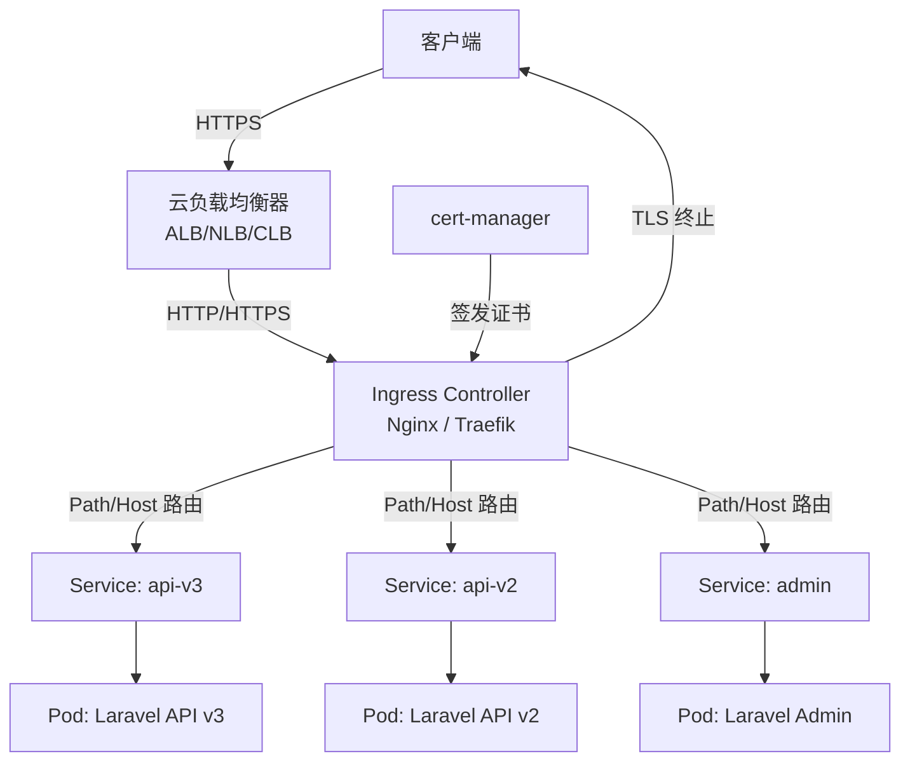
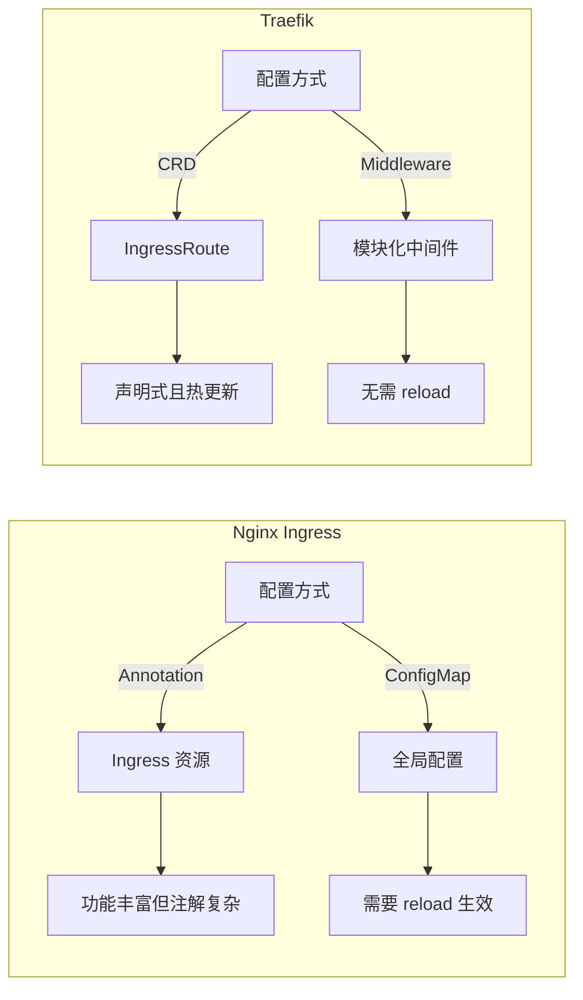
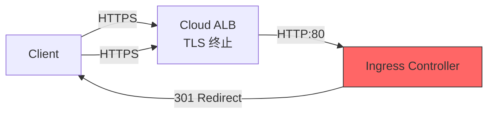

## 前言

在 Kubernetes 集群中，Ingress 是外部流量进入集群的「大门」。对于 Laravel B2C API 来说，Ingress 不仅要处理路由转发，还要搞定 TLS 终止、速率限制、安全头注入等关键功能。本文基于 KKday B2C Backend Team 的真实生产经验，对比 Nginx Ingress Controller 和 Traefik 两种方案，从配置到踩坑，一次性讲透。

<!-- more -->

## 架构总览



Ingress 的核心职责：
- **路由分发**：基于 Host 和 Path 将流量导向不同的 Service
- **TLS 终止**：在集群边缘处理 HTTPS，后端走 HTTP 明文
- **流量治理**：Rate Limiting、重试、超时、Circuit Breaker
- **安全加固**：CORS、CSP、安全头注入

## 方案一：Nginx Ingress Controller

### 安装与基础配置

```bash
# 使用 Helm 安装 Nginx Ingress Controller
helm repo add ingress-nginx https://kubernetes.github.io/ingress-nginx
helm repo update

helm install ingress-nginx ingress-nginx/ingress-nginx \
  --namespace ingress-nginx \
  --create-namespace \
  --set controller.replicaCount=2 \
  --set controller.service.type=LoadBalancer \
  --set controller.metrics.enabled=true \
  --set controller.podAnnotations."prometheus\.io/scrape"="true" \
  --set controller.podAnnotations."prometheus\.io/port"="10254"
```

### Ingress 资源定义

```yaml
# laravel-api-ingress.yaml
apiVersion: networking.k8s.io/v1
kind: Ingress
metadata:
  name: laravel-api-ingress
  namespace: production
  annotations:
    # Nginx 特有注解
    nginx.ingress.kubernetes.io/ssl-redirect: "true"
    nginx.ingress.kubernetes.io/force-ssl-redirect: "true"
    nginx.ingress.kubernetes.io/use-regex: "true"
    
    # 速率限制（每秒 100 请求，突发 200）
    nginx.ingress.kubernetes.io/limit-rps: "100"
    nginx.ingress.kubernetes.io/limit-burst-multiplier: "2"
    
    # 超时配置
    nginx.ingress.kubernetes.io/proxy-connect-timeout: "10"
    nginx.ingress.kubernetes.io/proxy-read-timeout: "60"
    nginx.ingress.kubernetes.io/proxy-send-timeout: "60"
    
    # 请求体大小限制（文件上传）
    nginx.ingress.kubernetes.io/proxy-body-size: "50m"
    
    # 安全头
    nginx.ingress.kubernetes.io/configuration-snippet: |
      more_set_headers "X-Frame-Options: DENY";
      more_set_headers "X-Content-Type-Options: nosniff";
      more_set_headers "X-XSS-Protection: 1; mode=block";
      more_set_headers "Referrer-Policy: strict-origin-when-cross-origin";
    
    # cert-manager 自动签发
    cert-manager.io/cluster-issuer: "letsencrypt-prod"
spec:
  ingressClassName: nginx
  tls:
    - hosts:
        - api.example.com
        - admin.example.com
      secretName: api-tls-secret
  rules:
    - host: api.example.com
      http:
        paths:
          # v3 API 路由
          - path: /api/v3(/|$)(.*)
            pathType: ImplementationSpecific
            backend:
              service:
                name: laravel-api-v3
                port:
                  number: 80
          # v2 API 路由（兼容）
          - path: /api/v2(/|$)(.*)
            pathType: ImplementationSpecific
            backend:
              service:
                name: laravel-api-v2
                port:
                  number: 80
    - host: admin.example.com
      http:
        paths:
          - path: /
            pathType: Prefix
            backend:
              service:
                name: laravel-admin
                port:
                  number: 80
```

### Nginx 全局配置优化

```yaml
# nginx-global-config.yaml
apiVersion: v1
kind: ConfigMap
metadata:
  name: ingress-nginx-controller
  namespace: ingress-nginx
data:
  # 连接优化
  keep-alive: "75"
  keep-alive-requests: "1000"
  upstream-keepalive-connections: "256"
  upstream-keepalive-timeout: "60"
  upstream-keepalive-requests: "10000"
  
  # 日志格式（JSON，便于 EFK 采集）
  log-format-upstream: |
    {"time":"$time_iso8601","remote_addr":"$remote_addr",
    "request_method":"$request_method","request_uri":"$request_uri",
    "status":$status,"body_bytes_sent":$body_bytes_sent,
    "request_time":$request_time,"upstream_response_time":"$upstream_response_time",
    "upstream_addr":"$upstream_addr","http_user_agent":"$http_user_agent",
    "http_x_forwarded_for":"$http_x_forwarded_for",
    "request_id":"$req_id","namespace":"$namespace","ingress_name":"$ingress_name",
    "service_name":"$service_name"}
  
  # Gzip 压缩
  use-gzip: "true"
  gzip-level: "5"
  gzip-min-length: "256"
  gzip-types: "application/json application/javascript text/css text/plain text/xml application/xml"
  
  # Worker 进程优化
  worker-processes: "auto"
  max-worker-connections: "65536"
```

## 方案二：Traefik Ingress Controller

### 安装与配置

```bash
# 使用 Helm 安装 Traefik
helm repo add traefik https://traefik.github.io/charts
helm repo update

helm install traefik traefik/traefik \
  --namespace traefik \
  --create-namespace \
  --set deployment.replicas=2 \
  --set service.type=LoadBalancer \
  --set metrics.prometheus.enabled=true \
  --set metrics.prometheus.addEntryPointsLabels=true \
  --set logs.access.enabled=true \
  --set logs.access.format=json
```

### Traefik IngressRoute（CRD 方式）

```yaml
# traefik-ingressroute.yaml
apiVersion: traefik.io/v1alpha1
kind: IngressRoute
metadata:
  name: laravel-api-ingressroute
  namespace: production
spec:
  entryPoints:
    - websecure
  routes:
    # API v3 路由
    - match: Host(`api.example.com`) && PathPrefix(`/api/v3`)
      kind: Rule
      services:
        - name: laravel-api-v3
          port: 80
          weight: 100
      middlewares:
        - name: rate-limit
        - name: security-headers
        - name: cors-preflight
    
    # API v2 路由
    - match: Host(`api.example.com`) && PathPrefix(`/api/v2`)
      kind: Rule
      services:
        - name: laravel-api-v2
          port: 80
          weight: 100
      middlewares:
        - name: rate-limit
        - name: security-headers
    
    # Admin 后台
    - match: Host(`admin.example.com`)
      kind: Rule
      services:
        - name: laravel-admin
          port: 80
          weight: 100
      middlewares:
        - name: admin-ip-whitelist
        - name: security-headers
  tls:
    secretName: api-tls-secret
    certResolver: letsencrypt
```

### Traefik Middleware 配置

```yaml
# rate-limit-middleware.yaml
apiVersion: traefik.io/v1alpha1
kind: Middleware
metadata:
  name: rate-limit
  namespace: production
spec:
  rateLimit:
    average: 100      # 每秒平均请求数
    burst: 200         # 突发请求数
    period: 1s
    sourceCriterion:
      ipStrategy:
        depth: 1       # 信任的代理层数
        excludedIPs:
          - "10.0.0.0/8"  # 内部 IP 不限流
```

```yaml
# security-headers-middleware.yaml
apiVersion: traefik.io/v1alpha1
kind: Middleware
metadata:
  name: security-headers
  namespace: production
spec:
  headers:
    stsSeconds: 31536000
    stsIncludeSubdomains: true
    stsPreload: true
    forceSTSHeader: true
    frameDeny: true
    contentTypeNosniff: true
    browserXssFilter: true
    referrerPolicy: "strict-origin-when-cross-origin"
    customResponseHeaders:
      X-Powered-By: ""  # 移除 Laravel 默认头
```

```yaml
# cors-preflight-middleware.yaml
apiVersion: traefik.io/v1alpha1
kind: Middleware
metadata:
  name: cors-preflight
  namespace: production
spec:
  headers:
    accessControlAllowMethods:
      - GET
      - POST
      - PUT
      - PATCH
      - DELETE
      - OPTIONS
    accessControlAllowHeaders:
      - Content-Type
      - Authorization
      - X-Requested-With
      - X-Request-ID
    accessControlAllowOriginList:
      - "https://www.example.com"
      - "https://admin.example.com"
    accessControlMaxAge: 86400
    addVaryHeader: true
```

```yaml
# admin-ip-whitelist-middleware.yaml
apiVersion: traefik.io/v1alpha1
kind: Middleware
metadata:
  name: admin-ip-whitelist
  namespace: production
spec:
  ipWhiteList:
    sourceRange:
      - "203.0.113.0/24"  # 办公网络
      - "198.51.100.0/24"  # VPN 网络
    ipStrategy:
      depth: 1
```

## Nginx vs Traefik 对比



| 维度 | Nginx Ingress | Traefik |
|------|---------------|---------|
| 配置方式 | Annotation + ConfigMap | CRD (IngressRoute) + Middleware |
| 热更新 | 需要 reload（有短暂中断） | 无需 reload，零中断 |
| Dashboard | 无内置（需额外部署） | 内置 Dashboard |
| 学习曲线 | 低（Annotation 直观） | 中（CRD 概念） |
| 性能 | 高（Nginx 底层） | 高（Go 实现） |
| 社区生态 | 极其丰富 | 快速增长 |
| 适用场景 | 传统 Web、API 网关 | 微服务、动态路由 |

### 深入对比：扩展维度

| 维度 | Nginx Ingress | Traefik |
|------|---------------|---------|
| **负载均衡算法** | 轮询（默认）、IP Hash、最少连接 | 加权轮询（默认）、加权最少连接（Mirroring 支持） |
| **Sticky Session** | 支持（基于 Cookie） | 支持（基于 Cookie，需配置 sticky middleware） |
| **Canary 发布** | 支持（`nginx.ingress.kubernetes.io/canary-weight`） | 原生支持（多 Service weight 分配） |
| **中间件复用** | 需要在每个 Ingress 重复注解 | Middleware CRD 全局复用 |
| **gRPC 代理** | 支持（需额外注解 `nginx.ingress.kubernetes.io/backend-protocol: "GRPC"`） | 原生支持（gRPC entrypoint） |
| **TCP/UDP 路由** | 需要单独的 ConfigMap | 原生支持（IngressRouteTCP / IngressRouteUDP） |
| **自动重载** | 文件变更触发 reload（有短暂延迟） | API 变更即时生效 |
| **内存占用** | 较低（C 实现） | 中等（Go 实现，含 GC） |
| **可观测性** | Prometheus metrics + 自定义日志格式 | Prometheus metrics + 内置 Dashboard |
| **多租户隔离** | 通过 Namespace + Annotation 实现 | 原生支持（CRD + RBAC 精细控制） |

### Nginx Ingress 的 Annotation 管理痛点

当项目规模增长，Ingress 的 Annotation 会变得难以维护：

```yaml
# 典型的"注解地狱" —— 一个 Ingress 可能有 20+ 条注解
annotations:
  # TLS
  nginx.ingress.kubernetes.io/ssl-redirect: "true"
  nginx.ingress.kubernetes.io/force-ssl-redirect: "true"
  # 超时
  nginx.ingress.kubernetes.io/proxy-connect-timeout: "10"
  nginx.ingress.kubernetes.io/proxy-read-timeout: "60"
  nginx.ingress.kubernetes.io/proxy-send-timeout: "60"
  # 限流
  nginx.ingress.kubernetes.io/limit-rps: "100"
  nginx.ingress.kubernetes.io/limit-burst-multiplier: "2"
  nginx.ingress.kubernetes.io/limit-connections: "50"
  # 请求大小
  nginx.ingress.kubernetes.io/proxy-body-size: "50m"
  # 安全头
  nginx.ingress.kubernetes.io/configuration-snippet: |
    more_set_headers "X-Frame-Options: DENY";
    more_set_headers "X-Content-Type-Options: nosniff";
    more_set_headers "Strict-Transport-Security: max-age=31536000; includeSubDomains";
    more_set_headers "Content-Security-Policy: default-src 'self'";
  # CORS（如果在 Ingress 层做）
  nginx.ingress.kubernetes.io/enable-cors: "true"
  nginx.ingress.kubernetes.io/cors-allow-origin: "https://www.example.com"
  nginx.ingress.kubernetes.io/cors-allow-methods: "GET, POST, PUT, DELETE, OPTIONS"
  nginx.ingress.kubernetes.io/cors-allow-headers: "Content-Type, Authorization"
  # 重试
  nginx.ingress.kubernetes.io/proxy-next-upstream: "error timeout http_502"
  nginx.ingress.kubernetes.io/proxy-next-upstream-tries: "3"
  # 日志
  nginx.ingress.kubernetes.io/enable-access-log: "true"
  # 后端协议
  nginx.ingress.kubernetes.io/backend-protocol: "HTTP"
  # 代理缓冲
  nginx.ingress.kubernetes.io/proxy-buffering: "on"
  nginx.ingress.kubernetes.io/proxy-buffer-size: "16k"
  nginx.ingress.kubernetes.io/proxy-buffers-number: "4"
```

**管理建议**：
1. 使用 Helm Chart 封装公共注解，通过 `values.yaml` 参数化
2. 使用 Kustomize 的 `patches` 统一覆盖注解
3. 定义团队注解规范文档，避免每个人风格不同

```yaml
# _helpers.tpl 中定义公共注解模板
{{- define "app.ingress.annotations" -}}
nginx.ingress.kubernetes.io/ssl-redirect: "true"
nginx.ingress.kubernetes.io/force-ssl-redirect: "true"
nginx.ingress.kubernetes.io/proxy-connect-timeout: {{ .Values.proxy.connectTimeout | quote }}
nginx.ingress.kubernetes.io/proxy-read-timeout: {{ .Values.proxy.readTimeout | quote }}
nginx.ingress.kubernetes.io/proxy-body-size: {{ .Values.proxy.bodySize | quote }}
nginx.ingress.kubernetes.io/limit-rps: {{ .Values.rateLimit.rps | quote }}
{{- if .Values.security.headers }}
nginx.ingress.kubernetes.io/configuration-snippet: |
  more_set_headers "X-Frame-Options: DENY";
  more_set_headers "X-Content-Type-Options: nosniff";
{{- end }}
{{- end }}
```

### Traefik 的 Middleware 链式组合优势

Traefik 的 Middleware 可以自由组合、复用，比 Nginx 的注解方式更灵活：

```yaml
# 创建一个"通用 API 中间件包"，所有 API IngressRoute 复用
apiVersion: traefik.io/v1alpha1
kind: Middleware
metadata:
  name: api-common
  namespace: production
spec:
  chain:
    middlewares:
      - name: rate-limit
      - name: security-headers
      - name: request-id        # 自动注入 X-Request-ID
      - name: compress          # 自动 Gzip/Brotli 压缩
---
apiVersion: traefik.io/v1alpha1
kind: Middleware
metadata:
  name: request-id
  namespace: production
spec:
  headers:
    customRequestHeaders:
      X-Request-ID: "{{.RequestID}}"  # Traefik 内置模板变量
---
apiVersion: traefik.io/v1alpha1
kind: Middleware
metadata:
  name: compress
  namespace: production
spec:
  compress:
    excludedContentTypes:
      - text/event-stream     # SSE 不压缩
```

**我们的选择**：KKday B2C 项目最终选了 Nginx Ingress，原因：
1. 团队对 Nginx 配置更熟悉
2. Annotation 生态成熟，Stack Overflow 答案多
3. 与现有 Nginx 配置迁移成本低
4. Traefik 的 CRD 学习成本对小团队偏高

## TLS 证书管理：cert-manager

### 安装 cert-manager

```bash
# 安装 cert-manager
helm repo add jetstack https://charts.jetstack.io
helm repo update

helm install cert-manager jetstack/cert-manager \
  --namespace cert-manager \
  --create-namespace \
  --set installCRDs=true \
  --set prometheus.enabled=true
```

### ClusterIssuer 配置

```yaml
# cluster-issuer.yaml
apiVersion: cert-manager.io/v1
kind: ClusterIssuer
metadata:
  name: letsencrypt-prod
spec:
  acme:
    server: https://acme-v02.api.letsencrypt.org/directory
    email: ops@example.com
    privateKeySecretRef:
      name: letsencrypt-prod-key
    solvers:
      # HTTP-01 验证（最简单）
      - http01:
          ingress:
            class: nginx
      # DNS-01 验证（支持通配符证书）
      # - dns01:
      #     cloudflare:
      #       apiTokenSecretRef:
      #         name: cloudflare-api-token
      #         key: api-token
```

```yaml
# wildcard-certificate.yaml
apiVersion: cert-manager.io/v1
kind: Certificate
metadata:
  name: wildcard-example-com
  namespace: production
spec:
  secretName: wildcard-tls-secret
  issuerRef:
    name: letsencrypt-prod
    kind: ClusterIssuer
  dnsNames:
    - "*.example.com"
    - "example.com"
```

### 证书自动续期监控

```yaml
# cert-monitor-cronjob.yaml
apiVersion: batch/v1
kind: CronJob
metadata:
  name: cert-expiry-check
  namespace: monitoring
spec:
  schedule: "0 9 * * 1"  # 每周一早上 9 点
  jobTemplate:
    spec:
      template:
        spec:
          containers:
            - name: cert-check
              image: bitnami/kubectl:latest
              command:
                - /bin/sh
                - -c
                - |
                  EXPIRY=$(kubectl get certificates -A -o json | \
                    jq -r '.items[] | 
                    select(.status.notAfter != null) | 
                    "\(.metadata.namespace)/\(.metadata.name): \(.status.notAfter)"')
                  
                  for line in $EXPIRY; do
                    DATE=$(echo $line | cut -d: -f2 | xargs)
                    DAYS_LEFT=$(( ($(date -d "$DATE" +%s) - $(date +%s)) / 86400 ))
                    if [ $DAYS_LEFT -lt 14 ]; then
                      echo "⚠️ 证书即将过期: $line (剩余 ${DAYS_LEFT} 天)"
                      # 发送 Slack 通知
                      curl -X POST "$SLACK_WEBHOOK" \
                        -H 'Content-Type: application/json' \
                        -d "{\"text\":\"⚠️ TLS 证书即将过期: $line (剩余 ${DAYS_LEFT} 天)\"}"
                    fi
                  done
              env:
                - name: SLACK_WEBHOOK
                  valueFrom:
                    secretKeyRef:
                      name: slack-webhook
                      key: url
          restartPolicy: OnFailure
```

## 生产环境踩坑记录

### 踩坑 1：Nginx Ingress 的 502 Bad Gateway

**现象**：高峰期频繁出现 502，但 Pod 健康检查正常。

**根因**：Nginx 默认的 `upstream-keepalive-connections` 是 320，但 Laravel Pod 重启时连接断开，Nginx 来不及更新 upstream 列表。

```yaml
# 解决方案：增加 keepalive 和连接检测
apiVersion: v1
kind: ConfigMap
metadata:
  name: ingress-nginx-controller
data:
  upstream-keepalive-connections: "512"
  upstream-keepalive-timeout: "60"
  # 关键：启用连接检测
  upstream-keepalive-requests: "10000"
  # 启用被动健康检查
  proxy-next-upstream: "error timeout http_502 http_503"
  proxy-next-upstream-tries: "3"
  proxy-next-upstream-timeout: "10"
```

**踩坑教训**：Nginx Ingress 的 upstream 管理是异步的，Pod 终止时要设置足够的 `terminationGracePeriodSeconds`（建议 60s），让 Nginx 有时间摘除节点。

### 踩坑 2：Traefik 的 PathPrefix 匹配陷阱

**现象**：`PathPrefix(/api/v3)` 匹配了 `/api/v3xxx`，导致路由混乱。

```yaml
# ❌ 错误写法
- match: Host(`api.example.com`) && PathPrefix(`/api/v3`)
  # 这会匹配 /api/v3、/api/v3xxx、/api/v3/anything

# ✅ 正确写法
- match: Host(`api.example.com`) && PathPrefix(`/api/v3/`)
  # 只匹配 /api/v3/ 及其子路径
  # 还需要单独处理 /api/v3 精确匹配
- match: Host(`api.example.com`) && Path(`/api/v3`)
  kind: Rule
  services:
    - name: laravel-api-v3
      port: 80
```

**踩坑教训**：Traefik 的 `PathPrefix` 是前缀匹配，不像 Nginx 的正则那么精确。建议用 `PathPrefix(/api/v3/)` + `Path(/api/v3)` 双规则覆盖。

### 踩坑 3：cert-manager 证书签发失败

**现象**：证书一直 Pending，cert-manager 日志报 `Waiting for HTTP-01 challenge`。

**根因**：Ingress Controller 的 Service 类型是 `ClusterIP`，ACME 验证请求无法到达。

```bash
# 检查证书状态
kubectl describe certificate wildcard-example-com -n production
kubectl describe challenges -n production

# 常见原因：
# 1. DNS 未指向 Ingress Controller 的外部 IP
# 2. Ingress Controller 的 Service 不是 LoadBalancer/NodePort
# 3. 防火墙阻止了 80 端口
# 4. ACME solver 的 Ingress class 不匹配
```

**解决方案**：

```yaml
# 确保 solver 的 ingress class 匹配
spec:
  acme:
    solvers:
      - http01:
          ingress:
            class: nginx  # 必须与 IngressClass 名称一致
            podTemplate:
              spec:
                nodeSelector:
                  kubernetes.io/os: linux
```

### 踩坑 4：CORS 预检请求被 Ingress 吞掉

**现象**：前端跨域请求 OPTIONS 返回 405，但后端 Laravel 已配置 CORS。

**根因**：Nginx Ingress 默认会拦截 OPTIONS 请求，不会转发到后端。

```yaml
# 解决方案 1：Nginx Annotation 方式
annotations:
  nginx.ingress.kubernetes.io/enable-cors: "true"
  nginx.ingress.kubernetes.io/cors-allow-origin: "https://www.example.com"
  nginx.ingress.kubernetes.io/cors-allow-methods: "GET, POST, PUT, PATCH, DELETE, OPTIONS"
  nginx.ingress.kubernetes.io/cors-allow-headers: "Content-Type, Authorization, X-Requested-With"
  nginx.ingress.kubernetes.io/cors-max-age: "86400"
  nginx.ingress.kubernetes.io/cors-allow-credentials: "true"
```

```yaml
# 解决方案 2：让 Laravel 处理 CORS（推荐）
# 移除 Ingress 的 CORS 配置，使用 Laravel 的 HandleCors 中间件
# config/cors.php
return [
    'paths' => ['api/*'],
    'allowed_methods' => ['*'],
    'allowed_origins' => ['https://www.example.com'],
    'allowed_origins_patterns' => [],
    'allowed_headers' => ['*'],
    'exposed_headers' => [],
    'max_age' => 86400,
    'supports_credentials' => true,
];
```

**踩坑教训**：CORS 不要在 Ingress 和 Laravel 两层都配置，会冲突。推荐在 Laravel 层处理，Ingress 只负责转发。

### 踩坑 5：大文件上传被截断

**现象**：上传 10MB+ 的文件时报 413 Request Entity Too Large。

```yaml
# Nginx Ingress 解决方案
annotations:
  nginx.ingress.kubernetes.io/proxy-body-size: "50m"
  nginx.ingress.kubernetes.io/proxy-buffering: "off"  # 大文件关闭缓冲
  nginx.ingress.kubernetes.io/proxy-request-buffering: "off"
```

```yaml
# Traefik 解决方案
apiVersion: traefik.io/v1alpha1
kind: Middleware
metadata:
  name: upload-size
spec:
  buffering:
    maxRequestBodyBytes: 52428800  # 50MB
    memRequestBodyBytes: 1048576   # 1MB 以下缓存在内存
```

### 踩坑 6：Ingress Controller 自身的资源瓶颈

**现象**：API 响应时间从 50ms 飙升到 500ms，但 Pod 资源充足。

**根因**：Ingress Controller Pod 的 CPU 被限流（Throttling）。

```yaml
# 解决方案：合理设置资源限制
controller:
  resources:
    requests:
      cpu: "500m"
      memory: "512Mi"
    limits:
      cpu: "2000m"
      memory: "1Gi"
  # HPA 自动扩缩
  autoscaling:
    enabled: true
    minReplicas: 2
    maxReplicas: 10
    targetCPUUtilizationPercentage: 70
    targetMemoryUtilizationPercentage: 80
```

**踩坑教训**：Ingress Controller 是流量入口，资源限制要留足余量。建议 CPU limit 至少 2 核，配合 HPA 自动扩缩。

### 踩坑 7：TLS 重定向死循环（Cloud LB + Ingress）

**现象**：访问 `http://api.example.com` 无限重定向，浏览器报 `ERR_TOO_MANY_REDIRECTS`。

**根因**：云负载均衡器（如 AWS ALB）终止 TLS 后以 HTTP 转发给 Ingress，Ingress 检测到非 HTTPS 又做 301 重定向到 HTTPS，形成死循环。



```yaml
# 解决方案 1：设置信任代理头（推荐）
# Nginx Ingress ConfigMap
data:
  use-forwarded-headers: "true"
  forwarded-for-header: "X-Forwarded-For"
  compute-full-forwarded-for: "true"
  # 关键：信任云 LB 的代理 IP
  proxy-real-ip-cidr: "10.0.0.0/8"  # 替换为实际的 LB 内网 CIDR
```

```yaml
# 解决方案 2：Ingress 层关闭 SSL 重定向（让 LB 处理）
annotations:
  nginx.ingress.kubernetes.io/ssl-redirect: "false"
  # 信任 LB 的 X-Forwarded-Proto
  nginx.ingress.kubernetes.io/use-forwarded-headers: "true"
```

```yaml
# Traefik 解决方案：配置 trustedProxies
# values.yaml
additionalArguments:
  - "--entryPoints.web.forwardedHeaders.trustedIPs=10.0.0.0/8"
  - "--entryPoints.websecure.forwardedHeaders.trustedIPs=10.0.0.0/8"
```

**踩坑教训**：当有外部负载均衡器时，Ingress 不能再做 TLS 终止的重定向判断。需要信任 LB 传递的 `X-Forwarded-Proto` 头，或者让 LB 全权处理 HTTPS 重定向。

### 踩坑 8：Ingress Path 规则优先级导致路由错乱

**现象**：配置了 `/api/v3` 和 `/api/v3/admin` 两个路由，但 `/api/v3/admin` 始终被 `/api/v3` 拦截。

```yaml
# ❌ 错误顺序（Nginx Ingress）
rules:
  - host: api.example.com
    http:
      paths:
        - path: /api/v3
          pathType: Prefix
          backend:
            service:
              name: api-v3-public
              port:
                number: 80
        - path: /api/v3/admin
          pathType: Prefix
          backend:
            service:
              name: api-v3-admin
              port:
                number: 80
# 结果：/api/v3/admin 被第一条规则匹配，永远到不了 api-v3-admin
```

```yaml
# ✅ 正确顺序：长路径优先
rules:
  - host: api.example.com
    http:
      paths:
        # 先放长路径
        - path: /api/v3/admin
          pathType: Prefix
          backend:
            service:
              name: api-v3-admin
              port:
                number: 80
        # 再放短路径
        - path: /api/v3
          pathType: Prefix
          backend:
            service:
              name: api-v3-public
              port:
                number: 80
```

**踩坑教训**：
- **Nginx Ingress**：路径规则按字典序排列，`/api/v3` 在 `/api/v3/admin` 前面会优先匹配。必须手动保证长路径在前。
- **Traefik**：`PathPrefix` 按路径长度自动排序，长路径优先，不存在此问题。但 `Path`（精确匹配）优先级高于 `PathPrefix`。

### 踩坑 9：Laravel Sanctum SPA 认证在 Ingress 后失效

**现象**：前端 SPA 调用 `/api/user` 返回 401，但直接 curl 后端 Pod 正常。

**根因**：Laravel Sanctum 的 SPA 认证依赖 Cookie 中的 `XSRF-TOKEN`，而 Ingress 的代理可能修改或丢弃 Cookie 相关头。

```yaml
# Nginx Ingress 修复：确保 Cookie 和 CSRF 头正确传递
annotations:
  nginx.ingress.kubernetes.io/proxy-cookie-path: "~*^/(.*)$ /$1"
  # 不要设置 proxy-cookie-domain（除非有跨域需求）
  nginx.ingress.kubernetes.io/configuration-snippet: |
    # 保留 Laravel 的 Set-Cookie 头
    proxy_cookie_path / "/; Secure; HttpOnly; SameSite=Lax";
    # 确保 X-CSRF-TOKEN 能从前端传递
    proxy_set_header X-XSRF-TOKEN $http_x_xsrf_token;
```

```yaml
# Laravel Sanctum 配置：config/sanctum.php
return [
    'stateful' => explode(',', env('SANCTUM_STATEFUL_DOMAINS', sprintf(
        '%s%s',
        'localhost,localhost:3000,127.0.0.1,127.0.0.1:8000,::1',
        env('APP_URL') ? ','.parse_url(env('APP_URL'), PHP_URL_HOST) : ''
    ))),
    // 关键：确保 Ingress 传递的 X-Forwarded-* 头被信任
    // 在 TrustProxies 中间件中配置
];
```

```php
// app/Http/Middleware/TrustProxies.php
protected $proxies = [
    '*',  // 信任所有代理（Kubernetes 内部安全），或指定 Ingress Controller Pod CIDR
];

protected $headers = Request::HEADER_X_FORWARDED_FOR |
    Request::HEADER_X_FORWARDED_HOST |
    Request::HEADER_X_FORWARDED_PORT |
    Request::HEADER_X_FORWARDED_PROTO |
    Request::HEADER_X_FORWARDED_AWS_ELB;  // 如果用 AWS ALB
```

### 踩坑 10：cert-manager 触发 Let's Encrypt 速率限制

**现象**：新域名的证书一直 Pending，cert-manager 日志报 `too many certificates already issued`。

**根因**：Let's Encrypt 对每个注册域名有速率限制（每周 50 个证书），测试环境反复删除重建 Certificate 资源会快速消耗配额。

```bash
# 检查当前速率限制状态
# 使用 Let's Encrypt 的报告接口
curl -s "https://crt.sh/?q=example.com&output=json" | \
  jq '[.[] | select(.issuer_name | contains("Let"))] | length'

# 查看 cert-manager 已缓存的证书
kubectl get certificates -A -o wide
kubectl describe order -n production
kubectl describe challenges -n production
```

**解决方案**：

```yaml
# 1. 测试环境使用 staging 环境（不受速率限制）
apiVersion: cert-manager.io/v1
kind: ClusterIssuer
metadata:
  name: letsencrypt-staging  # 测试专用
spec:
  acme:
    server: https://acme-staging-v02.api.letsencrypt.org/directory
    email: ops@example.com
    privateKeySecretRef:
      name: letsencrypt-staging-key
    solvers:
      - http01:
          ingress:
            class: nginx

---
# 2. 生产环境使用通配符证书（一个证书覆盖所有子域名）
apiVersion: cert-manager.io/v1
kind: Certificate
metadata:
  name: wildcard-prod
  namespace: production
spec:
  secretName: wildcard-prod-tls
  issuerRef:
    name: letsencrypt-prod
    kind: ClusterIssuer
  dnsNames:
    - "*.example.com"
    - "example.com"
  # 自动续期提前 30 天
  renewBefore: 720h
```

**踩坑教训**：永远在 staging 环境先验证 cert-manager 配置。生产环境尽量使用通配符证书减少证书数量。另外，删除 Certificate 资源不会撤销已签发的证书（Let's Encrypt 不支持撤销后立即重新签发）。

## 常用调试命令速查

```bash
# ========== Ingress Controller 状态 ==========
# 查看 Nginx Ingress Controller Pod 状态
kubectl get pods -n ingress-nginx -l app.kubernetes.io/name=ingress-nginx
kubectl logs -n ingress-nginx -l app.kubernetes.io/name=ingress-nginx --tail=100

# 查看 Traefik Pod 状态
kubectl get pods -n traefik
kubectl logs -n traefik -l app.kubernetes.io/name=traefik --tail=100

# ========== Ingress 资源排查 ==========
# 列出所有 Ingress
kubectl get ingress -A -o wide

# 查看 Ingress 详情（含事件）
kubectl describe ingress laravel-api-ingress -n production

# 查看 Ingress Controller 的最终 Nginx 配置（Nginx Ingress 专用）
kubectl exec -n ingress-nginx deploy/ingress-nginx-controller -- cat /etc/nginx/nginx.conf | head -200

# 搜索特定路由是否正确加载
kubectl exec -n ingress-nginx deploy/ingress-nginx-controller -- \
  cat /etc/nginx/nginx.conf | grep "api.example.com"

# ========== 证书排查 ==========
# 查看证书状态
kubectl get certificates -A -o wide
kubectl describe certificate wildcard-example-com -n production

# 查看 cert-manager 日志
kubectl logs -n cert-manager deploy/cert-manager --tail=50

# 查看 ACME challenge 状态
kubectl get challenges -A
kubectl describe challenge <challenge-name> -n production

# 查看证书实际内容
kubectl get secret api-tls-secret -n production -o jsonpath='{.data.tls\.crt}' | \
  base64 -d | openssl x509 -text -noout | head -20

# ========== 流量测试 ==========
# 测试路由是否生效（带 Host 头）
curl -v -H "Host: api.example.com" http://<INGRESS_IP>/api/v3/test

# 测试 TLS
curl -v https://api.example.com/api/v3/test 2>&1 | grep -E "(subject|expire|issuer)"

# 测试重定向
curl -v http://api.example.com/ 2>&1 | grep -E "(HTTP|Location)"

# 查看返回的安全头
curl -sI https://api.example.com/ | grep -iE "(x-frame|x-content|x-xss|strict-transport|referrer)"

# ========== 性能测试 ==========
# 简单的并发测试
for i in $(seq 1 100); do
  curl -s -o /dev/null -w "%{http_code} %{time_total}s\n" \
    https://api.example.com/api/v3/health &
done
wait

# 使用 hey 进行压测（需要安装：go install github.com/rakyll/hey@latest）
hey -n 1000 -c 50 -H "Host: api.example.com" http://<INGRESS_IP>/api/v3/health
```

## 完整 Lab：本地 Kind 集群演练

以下是一个可以在本地用 Kind 集群复现的完整 Ingress 实验：

```bash
#!/bin/bash
# ingress-lab.sh — 本地 Kind + Nginx Ingress 完整实验
set -e

# 1. 创建 Kind 集群（带端口映射）
cat <<EOF | kind create cluster --name ingress-lab --config=-
kind: Cluster
apiVersion: kind.x-k8s.io/v1alpha4
nodes:
  - role: control-plane
    kubeadmConfigPatches:
      - |
        kind: InitConfiguration
        nodeRegistration:
          kubeletExtraArgs:
            node-labels: "ingress-ready=true"
    extraPortMappings:
      - containerPort: 80
        hostPort: 8080
        protocol: TCP
      - containerPort: 443
        hostPort: 8443
        protocol: TCP
EOF

# 2. 安装 Nginx Ingress Controller
kubectl apply -f https://raw.githubusercontent.com/kubernetes/ingress-nginx/main/deploy/static/provider/kind/deploy.yaml
echo "等待 Ingress Controller 就绪..."
kubectl wait --namespace ingress-nginx \
  --for=condition=ready pod \
  --selector=app.kubernetes.io/component=controller \
  --timeout=120s

# 3. 部署示例应用
kubectl create namespace lab
kubectl apply -n lab -f - <<EOF
apiVersion: apps/v1
kind: Deployment
metadata:
  name: echo-server-v1
spec:
  replicas: 2
  selector:
    matchLabels:
      app: echo-v1
  template:
    metadata:
      labels:
        app: echo-v1
    spec:
      containers:
        - name: echo
          image: hashicorp/http-echo:0.2.3
          args: ["-text=Hello from V1"]
          ports:
            - containerPort: 5678
---
apiVersion: v1
kind: Service
metadata:
  name: echo-v1
spec:
  selector:
    app: echo-v1
  ports:
    - port: 80
      targetPort: 5678
---
apiVersion: apps/v1
kind: Deployment
metadata:
  name: echo-server-v2
spec:
  replicas: 1
  selector:
    matchLabels:
      app: echo-v2
  template:
    metadata:
      labels:
        app: echo-v2
    spec:
      containers:
        - name: echo
          image: hashicorp/http-echo:0.2.3
          args: ["-text=Hello from V2"]
          ports:
            - containerPort: 5678
---
apiVersion: v1
kind: Service
metadata:
  name: echo-v2
spec:
  selector:
    app: echo-v2
  ports:
    - port: 80
      targetPort: 5678
EOF

# 4. 创建 Ingress（路径路由 + 限流 + 安全头）
kubectl apply -n lab -f - <<EOF
apiVersion: networking.k8s.io/v1
kind: Ingress
metadata:
  name: lab-ingress
  annotations:
    nginx.ingress.kubernetes.io/use-regex: "true"
    nginx.ingress.kubernetes.io/limit-rps: "10"
    nginx.ingress.kubernetes.io/limit-burst-multiplier: "2"
    nginx.ingress.kubernetes.io/configuration-snippet: |
      more_set_headers "X-Lab: ingress-demo";
      more_set_headers "X-Content-Type-Options: nosniff";
spec:
  ingressClassName: nginx
  rules:
    - host: lab.local
      http:
        paths:
          - path: /v2
            pathType: Prefix
            backend:
              service:
                name: echo-v2
                port:
                  number: 80
          - path: /
            pathType: Prefix
            backend:
              service:
                name: echo-v1
                port:
                  number: 80
EOF

# 5. 测试路由
echo "=== 测试 V1 路由 ==="
curl -s -H "Host: lab.local" http://localhost:8080/

echo "=== 测试 V2 路由 ==="
curl -s -H "Host: lab.local" http://localhost:8080/v2

echo "=== 测试安全头 ==="
curl -sI -H "Host: lab.local" http://localhost:8080/ | grep -iE "(x-lab|x-content)"

echo "=== 测试限流（快速连续请求）==="
for i in $(seq 1 15); do
  STATUS=$(curl -s -o /dev/null -w "%{http_code}" -H "Host: lab.local" http://localhost:8080/)
  echo "请求 $i: HTTP $STATUS"
done

echo "✅ Lab 完成！清理：kind delete cluster --name ingress-lab"
```

## 监控与告警

### Prometheus 指标

```yaml
# ingress-monitor.yaml
apiVersion: monitoring.coreos.com/v1
kind: PrometheusRule
metadata:
  name: ingress-alerts
  namespace: monitoring
spec:
  groups:
    - name: ingress.rules
      rules:
        # 高错误率告警
        - alert: IngressHighErrorRate
          expr: |
            sum(rate(nginx_ingress_controller_requests{status=~"5.."}[5m])) by (ingress)
            /
            sum(rate(nginx_ingress_controller_requests[5m])) by (ingress)
            > 0.05
          for: 5m
          labels:
            severity: critical
          annotations:
            summary: "Ingress {{ $labels.ingress }} 5xx 错误率超过 5%"
        
        # 高延迟告警
        - alert: IngressHighLatency
          expr: |
            histogram_quantile(0.95,
              sum(rate(nginx_ingress_controller_request_duration_seconds_bucket[5m])) by (le, ingress)
            ) > 2
          for: 5m
          labels:
            severity: warning
          annotations:
            summary: "Ingress {{ $labels.ingress }} P95 延迟超过 2s"
```

## 总结

| 场景 | 推荐方案 |
|------|----------|
| 团队熟悉 Nginx、传统 Web 应用 | Nginx Ingress Controller |
| 微服务架构、需要动态路由 | Traefik |
| 需要通配符证书 | cert-manager + DNS-01 验证 |
| 高并发 API | Nginx + HPA + 充足资源限制 |
| 需要 Dashboard 可视化 | Traefik（内置 Dashboard） |

Ingress 是 Kubernetes 集群的门面，配置不当会成为性能瓶颈和安全隐患。建议：
1. **先用 Nginx Ingress**，生态成熟、踩坑少
2. **cert-manager 管理证书**，自动化签发和续期
3. **CORS 在应用层处理**，不要在 Ingress 和应用两层都配
4. **监控 Ingress Controller 本身**，它是单点风险
5. **预留足够资源**，Ingress Controller 是流量入口，不能被限流

---

## 相关阅读

- [K8s HPA/VPA 自动扩缩容 — Laravel API CPU 策略与配置指南](/devops/k8s-hpa-vpa-guide-laravel-api-cpu/)：Ingress 解决了流量入口，HPA/VPA 解决了后端 Pod 的弹性伸缩，两者配合才能应对流量洪峰。
- [Docker Compose PHP-FPM 微服务部署](/devops/docker-compose-php-fpmguide-microservicesdeployment/)：从 Docker Compose 起步，理解容器化 PHP 应用的部署模式，再迁移到 Kubernetes。
- [金丝雀发布实战 — Nginx/Envoy 权重路由与 Laravel 版本共存](/07_CICD/Canary-Deployment-渐进式流量放量-Nginx-Envoy权重路由与Laravel版本共存/)：Ingress 层配合 Canary 策略，实现新版本渐进式发布，降低上线风险。
