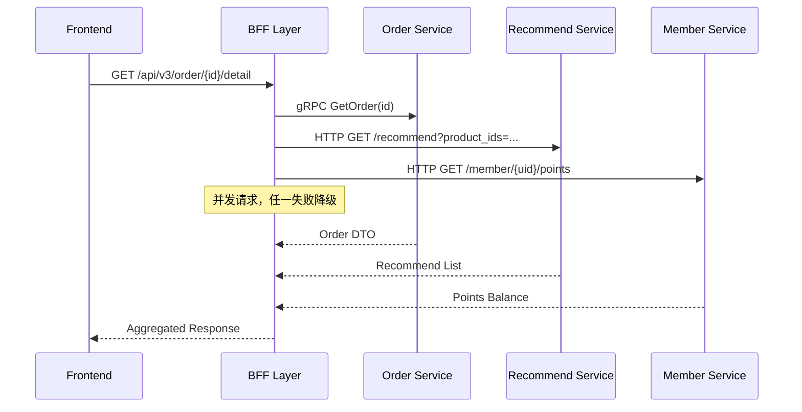
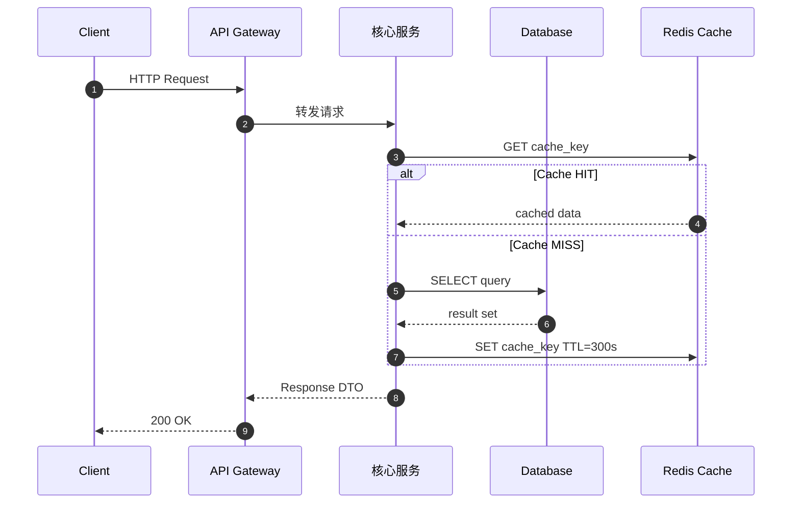
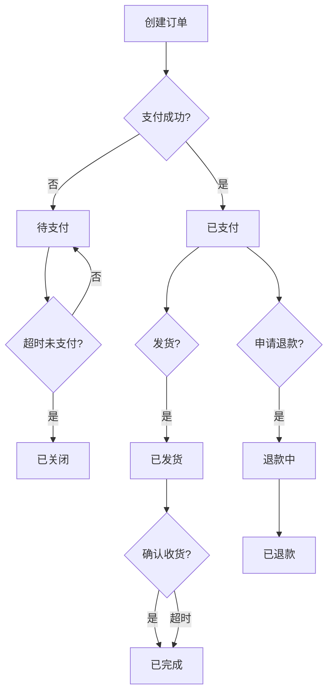
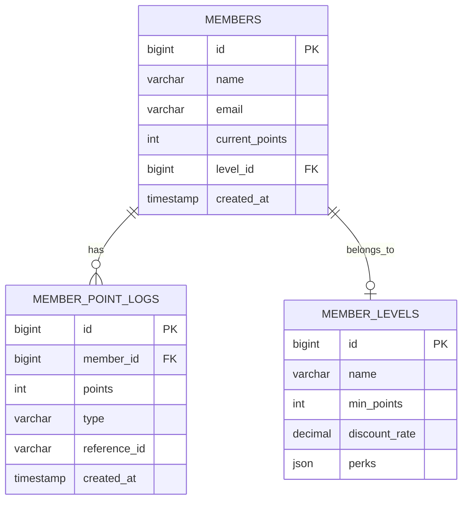

---

title: Confluence-SA-SD-模板实战-YYYY-MM-DD专案格式详解-真实案例与踩坑记录
cover: https://images.unsplash.com/photo-1581091226825-a6a2a5aee158?w=1200&h=630&fit=crop
images:
  - https://images.unsplash.com/photo-1581091226825-a6a2a5aee158?w=1200&h=630&fit=crop
date: 2026-05-05 02:26:04
updated: 2026-05-05 02:28:42
categories:
  - engineering
  - docs
tags: [KKday, 工程管理, 技术文档, Laravel]
keywords: [KKday, 工程管理, 技术文档, Laravel, Confluence, SA, SD]
description: >
---
# Confluence `[SA/SD] YYYY-MM-DD {专案}` 模板实战：KKday B2C 团队的文档规范落地与真实案例

## 为什么需要 SA/SD 文档规范？

在 KKday 的 B2C Backend Team，我们维护着 30+ 个 PHP/Laravel 仓库。新需求从 PM 的 PRD 到开发落地，中间最关键的一步就是 **SA/SD（System Analysis / System Design）** 文档。

没有 SA/SD 规范之前，我们遇到的典型问题：

- 开发 A 写的文档叫「API 重构笔记」，开发 B 的叫「订单流程设计 V2」，没有任何统一格式
- 新同事接手时找不到旧文档，因为命名随心所欲
- Code Review 时发现设计与文档不一致，因为文档没有 version control 的意识
- 跨团队协作时，前端/QA 根本不知道去哪找接口设计

于是我们制定了一个简单但强约束的规范：**`[SA/SD] YYYY-MM-DD {专案名称}`**

---

## 命名规范详解

### 格式定义

```
[SA/SD] YYYY-MM-DD {专案名称}
```

| 字段 | 说明 | 示例 |
|------|------|------|
| `[SA/SD]` | 固定标签，SA = System Analysis，SD = System Design | `[SA/SD]` |
| `YYYY-MM-DD` | 文档创建日期，不是需求开始日期 | `2026-05-05` |
| `{专案名称}` | 简洁描述，中英文皆可 | `订单BFF重构` |

### 实际命名示例

```
[SA/SD] 2026-04-15 订单BFF重构 - Search/Recommend 聚合层
[SA/SD] 2026-04-20 Stripe支付回调幂等性优化
[SA/SD] 2026-05-01 会员等级系统 - 积分计算与自动升降级
[SA/SD] 2026-05-03 商品库存并发扣减 - SKIP LOCKED 方案
[SA/SD] 2026-05-05 多币种价格引擎 - 汇率缓存与精度处理
```

### 为什么用创建日期而不是需求日期？

**踩坑记录**：最初我们用需求日期（PRD 签核日），但实际执行时 PRD 经常改版，导致文档日期和 PRD 版本对不上。改用文档创建日期后，每篇文档就是一个独立的时间切片，后续修订直接在原文档上更新 `updated` 字段即可。

---

## 文档结构模板（完整版）

我们团队统一使用的 SA/SD 文档结构如下：

```markdown
# [SA/SD] YYYY-MM-DD {专案名称}

## 1. 背景与目标
- 需求来源（PRD link / JIRA ticket）
- 当前痛点
- 预期目标与验收标准

## 2. 现状分析（As-Is）
- 现有架构图
- 当前数据流
- 存在的问题与瓶颈

## 3. 方案设计（To-Be）
### 3.1 整体架构图
### 3.2 API 设计（OpenAPI Spec link）
### 3.3 数据库变更（DDL / Migration）
### 3.4 缓存策略
### 3.5 队列/事件设计

## 4. 时序图（Sequence Diagram）
- 核心流程时序图
- 异常流程时序图

## 5. 影响范围分析
- 受影响的 API Endpoint
- 受影响的数据库 Table
- 受影响的其他服务

## 6. 测试策略
- 单元测试重点
- 集成测试场景
- 契约测试（OpenAPI + Fake Response）

## 7. 风险评估与回滚方案
- 已知风险
- 回滚步骤
- 监控指标

## 8. 变更记录
| 日期 | 作者 | 变更内容 |
|------|------|----------|
| YYYY-MM-DD | Michael | 初版 |
```

---

## 真实案例一：订单 BFF 重构

### 背景

订单详情页（Order Detail）需要同时展示：
- 订单基本信息（Order Service）
- 商品推荐（Recommend Service）
- 用户积分（Member Service）

原来前端要调 3 个 API，BFF 重构后聚合为 1 个。

### 架构图

```
┌─────────────┐
│   Frontend  │
│  (Vue 3)    │
└──────┬──────┘
       │ GET /api/v3/order/{id}/detail
       ▼
┌──────────────────────────────────┐
│         BFF Layer (Laravel)      │
│  ┌────────────────────────────┐  │
│  │  OrderDetailController     │  │
│  │  ┌──────────────────────┐  │  │
│  │  │ OrderDetailService   │  │  │
│  │  │  ├─ OrderRepository  │  │  │
│  │  │  ├─ RecommendClient  │  │  │
│  │  │  └─ MemberClient     │  │  │
│  │  └──────────────────────┘  │  │
│  └────────────────────────────┘  │
└──────┬─────────┬─────────┬──────┘
       │         │         │
       ▼         ▼         ▼
┌──────────┐ ┌──────────┐ ┌──────────┐
│  Order   │ │ Recommend│ │  Member  │
│ Service  │ │ Service  │ │ Service  │
│ (MySQL)  │ │ (ES)     │ │ (MySQL)  │
└──────────┘ └──────────┘ └──────────┘
```

### 时序图



### 关键设计决策（在 SD 文档中必须记录）

```php
// 为什么用 Laravel HTTP Client 而不是 gRPC？
// 决策：Recommend Service 是 Java 团队维护，目前只暴露 REST API
// gRPC 方案留给后续优化，当前用 HTTP Client + Circuit Breaker

class RecommendClient
{
    public function getRecommendations(array $productIds): Collection
    {
        return Http::retry(3, 1000)
            ->timeout(5)
            ->baseUrl(config('services.recommend.base_url'))
            ->get('/api/recommend', ['product_ids' => $productIds])
            ->collect('data');
    }
}
```

### 影响范围分析（SD 文档关键章节）

```markdown
## 5. 影响范围分析

### 受影响的 API Endpoint
- `GET /api/v2/order/{id}` → 将被 `/api/v3/order/{id}/detail` 替代
- `GET /api/v2/recommend?product_ids=` → 内部调用，对外不变

### 受影响的数据库 Table
- `orders` - 新增 `recommend_cache_key` 字段（用于缓存关联）
- `order_items` - 无变更

### 受影响的其他服务
- Frontend: 需更新 API 调用，使用新的聚合接口
- QA: 需新增聚合接口的 E2E 测试
```

---

## 真实案例二：支付回调幂等性优化

### SD 文档中的风险评估（真实踩坑）

```markdown
## 7. 风险评估与回滚方案

### 已知风险
1. **Stripe 回调重试风暴**：Stripe 在 72 小时内最多重试 3 次，
   但网络抖动时可能短时间内收到多次回调
2. **并发问题**：两个相同的 `checkout.session.completed` 事件
   同时到达，可能触发两次库存扣减
3. **数据库死锁**：`UPDATE orders SET status = 'paid'` 与
   `UPDATE stock SET quantity = quantity - 1` 可能产生死锁

### 回滚步骤
1. 关闭 webhook endpoint 的 Nginx 路由
2. 手动处理积压的 Stripe 事件（通过 Stripe Dashboard）
3. 回滚 Migration: `php artisan migrate:rollback --step=1`

### 监控指标
- Stripe webhook 响应时间 (P99 < 500ms)
- 幂等 key 命中率 (日志搜索 `idempotent_hit`)
- 订单状态更新失败告警 (Sentry)
```

### 幂等性实现代码（SD 文档附录）

```php
class StripeWebhookController extends Controller
{
    public function handleWebhook(Request $request): JsonResponse
    {
        $event = $this->constructEvent($request);
        
        // 幂等性检查：使用 Stripe event_id 作为幂等键
        $idempotentKey = 'stripe_event:' . $event->id;
        
        if (Cache::has($idempotentKey)) {
            Log::info('Stripe event already processed', [
                'event_id' => $event->id,
                'type' => $event->type,
            ]);
            return response()->json(['status' => 'duplicate']);
        }
        
        DB::transaction(function () use ($event, $idempotentKey) {
            match ($event->type) {
                'checkout.session.completed' => $this->handleCheckoutCompleted($event),
                'payment_intent.payment_failed' => $this->handlePaymentFailed($event),
                default => Log::info('Unhandled event type', ['type' => $event->type]),
            };
            
            // 处理成功后设置幂等键，TTL 72 小时（Stripe 最大重试窗口）
            Cache::put($idempotentKey, true, now()->addHours(72));
        });
        
        return response()->json(['status' => 'success']);
    }
}
```

---

## 真实案例三：会员等级系统

### 数据库设计（SD 文档中的 DDL）

```sql
-- [SA/SD] 2026-05-01 会员等级系统

-- 会员等级表
CREATE TABLE `member_levels` (
    `id` BIGINT UNSIGNED AUTO_INCREMENT PRIMARY KEY,
    `name` VARCHAR(50) NOT NULL COMMENT '等级名称',
    `min_points` INT UNSIGNED NOT NULL DEFAULT 0 COMMENT '最低积分',
    `discount_rate` DECIMAL(3,2) NOT NULL DEFAULT 1.00 COMMENT '折扣率',
    `perks` JSON DEFAULT NULL COMMENT '权益配置',
    `created_at` TIMESTAMP DEFAULT CURRENT_TIMESTAMP,
    `updated_at` TIMESTAMP DEFAULT CURRENT_TIMESTAMP ON UPDATE CURRENT_TIMESTAMP,
    INDEX `idx_min_points` (`min_points`)
) ENGINE=InnoDB DEFAULT CHARSET=utf8mb4 COMMENT='会员等级配置表';

-- 会员积分流水表（分区表设计）
CREATE TABLE `member_point_logs` (
    `id` BIGINT UNSIGNED AUTO_INCREMENT,
    `member_id` BIGINT UNSIGNED NOT NULL,
    `points` INT NOT NULL COMMENT '积分变动（正=获得，负=消耗）',
    `type` VARCHAR(30) NOT NULL COMMENT '变动类型',
    `reference_id` VARCHAR(64) DEFAULT NULL COMMENT '关联业务ID',
    `created_at` TIMESTAMP NOT NULL DEFAULT CURRENT_TIMESTAMP,
    PRIMARY KEY (`id`, `created_at`),
    INDEX `idx_member_created` (`member_id`, `created_at`)
) ENGINE=InnoDB DEFAULT CHARSET=utf8mb4
PARTITION BY RANGE (UNIX_TIMESTAMP(`created_at`)) (
    PARTITION p202601 VALUES LESS THAN (UNIX_TIMESTAMP('2026-02-01')),
    PARTITION p202602 VALUES LESS THAN (UNIX_TIMESTAMP('2026-03-01')),
    PARTITION p202603 VALUES LESS THAN (UNIX_TIMESTAMP('2026-04-01')),
    PARTITION pmax VALUES LESS THAN MAXVALUE
);
```

---

## 团队协作踩坑记录

### 踩坑 1：文档与代码不同步

**问题**：SA/SD 文档写完后，开发过程中改了方案但没更新文档。QA 按旧文档写测试，全部失败。

**解决方案**：在 CI 流程中加入文档检查。我们在 PR template 中加了一项：

```markdown
## PR Checklist
- [ ] 代码变更是否与 SA/SD 文档一致？
- [ ] 如有设计变更，是否已更新 SA/SD 文档？
- [ ] SA/SD 文档链接：[Confluence Link]
```

### 踩坑 2：文档太长没人看

**问题**：一篇 SA/SD 文档写了 5000+ 字，Code Review 时没人完整读完。

**解决方案**：采用"Executive Summary + Detail"的分层结构：

```markdown
## TL;DR（30 秒读完）
- 做什么：订单详情页聚合接口
- 影响什么：3 个 API → 1 个 API
- 风险：Recommend Service 降级时显示默认推荐
- 预计工时：5 人天

## 详细设计（有需要时再读）
...（完整内容）
```

### 踩坑 3：跨时区团队的日期混乱

**问题**：台北、雅加达、曼谷三个办公室，Confluence 显示的日期格式不一致。

**解决方案**：强制要求文档内所有日期使用 `YYYY-MM-DD` 格式，不依赖 Confluence 的自动格式化：

```javascript
// Confluence Template 中使用固定格式
// 使用 Confluence 的 Date Macro 时指定格式
{date:yyyy-MM-dd}
```

### 踩坑 4：SA 和 SD 混在一起

**问题**：有些文档只写 SA（分析），不写 SD（设计），导致开发时要自己猜实现方案。

**解决方案**：如果项目小，可以合并为 `[SA/SD]`；如果项目大（预估 > 10 人天），必须拆分为两个文档：

```
[SA] 2026-05-01 会员等级系统 - 需求分析与现状调研
[SD] 2026-05-03 会员等级系统 - 技术方案与数据库设计
```

---

## 如何在 Confluence 中建立模板

### 步骤一：创建模板

1. 进入 Confluence Space Settings → Content Tools → Templates
2. 点击 "Create Template"
3. 将上述模板结构粘贴进去
4. 设置模板名称为 `[SA/SD] 模板`

### 步骤二：使用 Confluence Macro 增强模板

```markdown
<!-- 信息提示框 -->
{info}
本文档由 {author} 于 {date:yyyy-MM-dd} 创建
最后一次更新：{date:yyyy-MM-dd}
{info}

<!-- 任务列表 -->
{tasklist}
[x] SA 完成
[x] SA Review 通过
[ ] SD 完成
[ ] SD Review 通过
[ ] Code Review 通过
{tasklist}

<!-- 目录 -->
{toc:outline=true|maxLevel=3}
```

### 步骤三：建立文档索引页

在 Confluence 中创建一个索引页，使用 `{children}` macro 自动列出所有 SA/SD 文档：

```markdown
# SA/SD 文档索引

## 2026 年

{children:depth=1|sort=creation|reverse=true}
```

---

## SA vs SD：什么时候该拆分文档？

很多团队的困惑是：SA（System Analysis）和 SD（System Design）到底什么时候该合并、什么时候该拆分？我们的经验法则是**按项目复杂度分级**：

| 复合维度 | 合并为 [SA/SD] | 拆分为 [SA] + [SD] |
|----------|:---:|:---:|
| 预估工时 | < 5 人天 | ≥ 5 人天 |
| 影响仓库数 | 1 个 | 2+ 个 |
| 涉及 DB 表变更 | ≤ 3 张 | > 3 张 |
| 是否需要跨团队 Review | 否 | 是（前端/QA/DBA） |
| 需求确定性 | PM 已确认方案 | 需多方案对比 |

```php
<?php
// app/Services/SDDocumentDecider.php
// 用于自动建议 SA/SD 文档拆分策略

declare(strict_types=1);

namespace App\Services;

class SDDocumentDecider
{
    public function decide(array $projectMeta): string
    {
        $complexityScore = 0;

        // 工时维度：每 5 人天 +1 分
        $complexityScore += (int) ceil($projectMeta['estimated_days'] / 5);

        // 影响仓库数
        $complexityScore += count($projectMeta['affected_repos']) > 1 ? 1 : 0;

        // DB 变更数
        $complexityScore += $projectMeta['db_changes'] > 3 ? 2 : 0;

        // 跨团队协作
        $complexityScore += $projectMeta['cross_team_review'] ? 1 : 0;

        return $complexityScore >= 3
            ? '[SA] + [SD]（拆分）'
            : '[SA/SD]（合并）';
    }
}
```

**踩坑记录**：我们曾经把一个涉及 5 个仓库、需要 DBA Review 的项目写成单篇 `[SA/SD]`，结果文档超过 8000 字，Code Review 时没人读完。拆分后 `[SA]` 专注业务分析，`[SD]` 专注技术方案，各 3000 字，Review 效率提升明显。

---

## 文档反模式：常见错误与修正方案

在推行 SA/SD 规范的过程中，我们收集了团队中最常见的反模式，整理成以下对照表：

| 反模式 | 症状 | 修正方案 |
|--------|------|----------|
| **文档黑洞** | 文档写完从不更新，与代码严重脱节 | PR Checklist 强制要求同步更新 SA/SD |
| **标题党** | 标题写得很完整，正文只有一句话"参考 PRD" | 模板中每个章节设最低字数要求（如"方案设计"≥ 300 字） |
| **Copy-Paste 工程** | 每次新建文档都从旧文档复制，残留大量无关内容 | 使用 Confluence Template，强制从模板创建 |
| **只写怎么做不写为什么** | 直接贴代码，没有决策理由 | 模板要求"关键决策记录"章节，使用 ADR 格式 |
| **日期格式混乱** | 有人写 `2026/05/05`，有人写 `05-05-2026` | 模板锁定 `YYYY-MM-DD`，Confluence Macro 强制格式 |
| **SA 和 SD 职责不分** | SA 文档里写 SQL DDL，SD 文档里写用户故事 | 模板明确分区：SA = 业务分析，SD = 技术实现 |

### 可运行的文档质量检查器

```php
<?php
// app/Services/SDQualityChecker.php
// 检查 SA/SD 文档是否满足质量标准

declare(strict_types=1);

namespace App\Services;

class SDQualityChecker
{
    private const REQUIRED_SECTIONS = [
        '背景与目标',
        '现状分析',
        '方案设计',
        '影响范围分析',
        '风险评估',
        '变更记录',
    ];

    private const MIN_WORDS_PER_SECTION = 100;

    public function check(string $documentContent): array
    {
        $issues = [];

        // 检查必要章节是否存在
        foreach (self::REQUIRED_SECTIONS as $section) {
            if (strpos($documentContent, $section) === false) {
                $issues[] = "缺少必要章节: {$section}";
            }
        }

        // 检查标题命名规范
        if (!preg_match('/^\[SA\/SD\]\s+\d{4}-\d{2}-\d{2}\s+/', $documentContent)) {
            $issues[] = '标题不符合 [SA/SD] YYYY-MM-DD {专案} 命名规范';
        }

        // 检查变更记录是否有内容
        $changelogSection = $this->extractSection($documentContent, '变更记录');
        if ($changelogSection && substr_count($changelogSection, '|') < 6) {
            $issues[] = '变更记录表为空，至少需要一行初始记录';
        }

        // 检查是否有架构图或时序图
        if (strpos($documentContent, 'sequenceDiagram') === false
            && strpos($documentContent, '```mermaid') === false
            && strpos($documentContent, '┌') === false
        ) {
            $issues[] = '建议添加架构图或时序图（Mermaid / ASCII）';
        }

        return [
            'passed' => empty($issues),
            'issues' => $issues,
            'score' => max(0, 100 - count($issues) * 15),
        ];
    }

    private function extractSection(string $content, string $sectionName): ?string
    {
        $pattern = "/## {$sectionName}(.+?)##/s";
        if (preg_match($pattern, $content, $matches)) {
            return $matches[1];
        }
        return null;
    }
}
```

---

## 用 Confluence REST API 自动化文档创建

手动在 Confluence 上创建文档虽然简单，但当团队有 30+ 个仓库时，每次新建 SA/SD 都要重复填模板。我们写了一个 Laravel Artisan Command，从模板自动创建文档：

```php
<?php
// app/Console/Commands/CreateSADocument.php
// 一键从模板创建 SA/SD 文档到 Confluence

declare(strict_types=1);

namespace App\Console\Commands;

use Illuminate\Console\Command;
use Illuminate\Support\Facades\Http;
use Illuminate\Support\Str;

class CreateSADocument extends Command
{
    protected $signature = 'confluence:create-sa
        {project : 专案名称}
        {--type=SA/SD : 文档类型 SA/SD/SA/SD}
        {--space=RD : Confluence Space Key}';

    protected $description = '从模板创建 SA/SD 文档到 Confluence';

    public function handle(): int
    {
        $project = $this->argument('project');
        $type = $this->option('type');
        $spaceKey = $this->option('space');
        $date = now()->format('Y-m-d');

        $title = "[{$type}] {$date} {$project}";

        // 从本地模板文件读取内容
        $templatePath = base_path("templates/sa-sd-template.md");
        if (!file_exists($templatePath)) {
            $this->error("模板文件不存在: {$templatePath}");
            return 1;
        }

        $content = file_get_contents($templatePath);
        $content = str_replace('{PROJECT_NAME}', $project, $content);
        $content = str_replace('{DATE}', $date, $content);
        $content = str_replace('{AUTHOR}', $this->getAuthorName(), $content);

        $baseUrl = config('services.confluence.base_url');
        $token = config('services.confluence.api_token');

        $response = Http::withHeaders([
            'Authorization' => 'Basic ' . base64_encode(
                config('services.confluence.email') . ':' . $token
            ),
            'Content-Type' => 'application/json',
        ])->post("{$baseUrl}/rest/api/content", [
            'type' => 'page',
            'title' => $title,
            'space' => ['key' => $spaceKey],
            'body' => [
                'storage' => [
                    'value' => $content,
                    'representation' => 'storage',
                ],
            ],
        ]);

        if ($response->successful()) {
            $pageId = $response->json('id');
            $this->info("✅ 文档创建成功!");
            $this->info("   标题: {$title}");
            $this->info("   链接: {$baseUrl}/pages/viewpage.action?pageId={$pageId}");
            return 0;
        }

        $this->error("❌ 创建失败: {$response->body()}");
        return 1;
    }

    private function getAuthorName(): string
    {
        return config('app.author_name', 'Michael');
    }
}
```

**使用方式**：

```bash
# 创建合并文档
php artisan confluence:create-sa "订单BFF重构" --type="SA/SD"

# 创建独立 SD 文档
php artisan confluence:create-sa "支付回调幂等性" --type="SD" --space="PAY"
```

**踩坑记录**：Confluence REST API 的 `storage` 格式和 Markdown 不同，它是 XHTML 子集。我们最初直接传 Markdown，结果 Confluence 渲染出来全是乱码。解决方案是用 `league/commonmark` 先将 Markdown 转为 HTML，再传给 Confluence API。

---

## Mermaid 模板速查：SA/SD 常用图表

以下是我们在 SA/SD 文档中最常用的 Mermaid 图表模板，可以直接复制到 Confluence 中使用：

### 时序图模板（请求链路追踪）



### 流程图模板（订单状态机）



### ER 图模板（会员系统）



---

## SA/SD 文档 Review Checklist

以下是我们在 Code Review 前必查的 SA/SD 文档检查清单，可以作为 Confluence Task List 使用：

```markdown
## 📋 SA/SD 文档 Review Checklist

### 基础规范
- [ ] 标题格式: `[SA/SD] YYYY-MM-DD {专案名称}`
- [ ] description 字段已填写（150-200 字）
- [ ] 变更记录表有初始条目
- [ ] 文档放在正确的 Confluence Space

### 业务分析（SA 部分）
- [ ] 背景与目标清晰，引用了 PRD/JIRA 链接
- [ ] 现状分析包含架构图
- [ ] 痛点描述具体，有数据支撑（如"当前响应时间 P99 > 2s"）

### 技术设计（SD 部分）
- [ ] 整体架构图已更新（含新增/变更组件）
- [ ] API 设计有 OpenAPI Spec 链接
- [ ] 数据库变更有 DDL 和 Migration 文件
- [ ] 缓存策略说明了 TTL 和失效机制
- [ ] 关键决策记录了 Why（ADR 格式）

### 风险与回滚
- [ ] 已识别风险并标注等级（高/中/低）
- [ ] 回滚步骤可执行（具体到命令）
- [ ] 监控指标已定义（含阈值）

### 影响范围
- [ ] 受影响的 API Endpoint 已列出
- [ ] 受影响的数据库 Table 已列出
- [ ] 依赖的其他服务已通知
- [ ] QA 测试场景已确认
```

---

## 总结：SA/SD 文档规范的核心价值

| 维度 | 没有规范时 | 有规范后 |
|------|----------|---------|
| 文档查找 | 找不到 / 找错版本 | 按日期 + 专案名精准定位 |
| 新人上手 | 靠口口相传 | 读 3 篇 SA/SD 就能理解架构 |
| Code Review | Review 代码但不知设计意图 | Review 前先读 SD，有据可依 |
| 跨团队协作 | 前端/QA 不知道接口在哪 | SA/SD 中有 OpenAPI link |
| 事后复盘 | 忘了当初为什么这样做 | 变更记录完整保留决策链 |

**一句话总结**：`[SA/SD] YYYY-MM-DD {专案}` 不是形式主义，而是你在 6 个月后回头看时，唯一能想起"当初为什么这么设计"的东西。

## 相关阅读

- [Confluence 团队技术文档管理最佳实践：权限、模板、生命周期与 Laravel 多仓库协作](/engineering/confluence-best-practices-lifecycle-laravel/)
- [代码审查流程设计：如何建立高效的 CR 文化与工具链](/engineering/code-review-process/)
- [Mermaid 实战：用代码画架构图流程图时序图](/engineering/mermaid-guide-architecture/)
