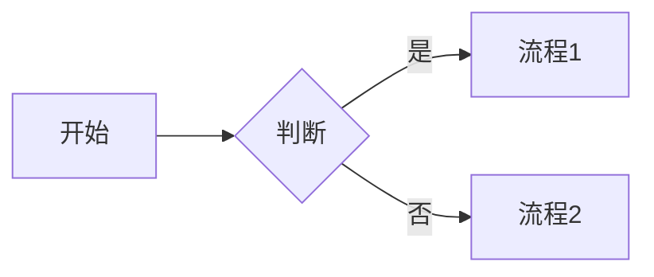
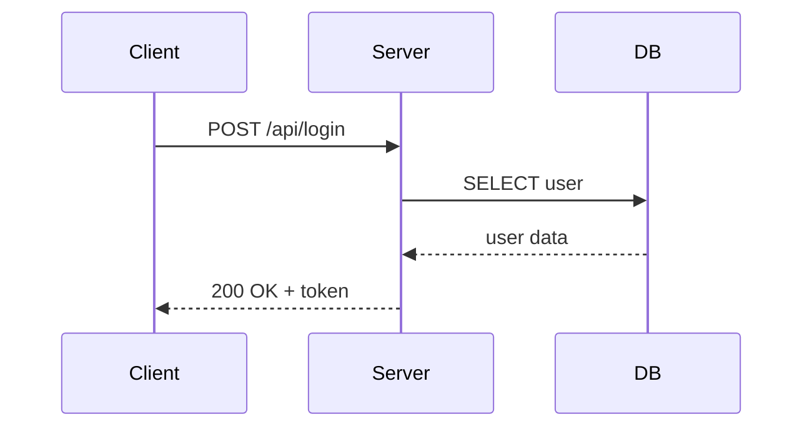
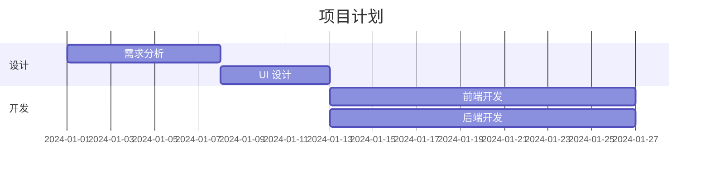

---

title: Markdown 语法速查：标题、代码块、表格与 Mermaid 图表
keywords: [Markdown, Mermaid, 语法速查, 标题, 代码块, 表格与, 图表]
cover: https://images.unsplash.com/photo-1581091226825-a6a2a5aee158?w=1200&h=630&fit=crop
images:
  - https://images.unsplash.com/photo-1581091226825-a6a2a5aee158?w=1200&h=630&fit=crop
tags:
- 工程管理
- Markdown
- 文档
- 写作
- GFM
categories:
- engineering
- docs
date: 2019-03-20 15:05:07
description: Markdown 是一种轻量级标记语言，2004 年由 John Gruber 创建，目标是"让文档既好读又能转 HTML"。本文从基础语法到高级特性全面讲解：标题、列表、链接、代码块、表格、引用等基础用法；任务列表、脚注、数学公式、Mermaid 流程图等扩展语法；CommonMark、GFM、MultiMarkdown 等各平台方言差异对比；Typora、Obsidian、VS Code 等主流编辑器推荐与对比；中文排版、图片路径、嵌套列表等常见踩坑案例；以及 Markdown 与 HTML 互转技巧和用 Node.js/Python 编程解析 Markdown 的实用示例。适合前端、后端、运维等所有需要写技术文档的开发者。
---


<!--more-->

## 一、Markdown 是什么

**Markdown = 纯文本 + 极少的标记语法**，可以一键转成 HTML。

它解决的问题：用 Word 写技术文档要切到鼠标改格式，写代码块还要变字体；用 HTML 又啰嗦不好读。Markdown 让你**专心写内容**，格式靠几个符号搞定。

主要使用场景：

- GitHub README、Issue、PR 描述
- 静态博客（Hexo、Hugo、Jekyll、VitePress）
- 技术文档（GitBook、MkDocs、Docusaurus）
- 笔记软件（Obsidian、Typora、Notion 部分支持）
- 即时通讯（Slack、Discord、Telegram、微信公众号编辑器）

---

## 二、基础语法

### 标题

```markdown
# 一级标题
## 二级标题
### 三级标题
#### 四级标题
##### 五级标题
###### 六级标题
```

> **最佳实践**：`#` 保留给文章大标题，正文从 `##` 开始；标题层级不要跳级（如 `##` 直接到 `####`）。

### 强调

```markdown
*斜体* 或 _斜体_
**粗体** 或 __粗体__
~~删除线~~
==高亮==（部分实现支持）
```

### 段落与换行

```markdown
这是第一段。段落之间用一个空行分隔。

这是第二段。

行尾加两个空格再回车 → 强制换行（不推荐，容易被忽略）。
更好的做法：直接空一行开始新段落。
```

### 列表

```markdown
- 无序
- 项目
  - 嵌套（4 空格或 1 Tab）

1. 有序
2. 列表

- [ ] 任务（未完成）
- [x] 任务（已完成）
```

> **嵌套列表陷阱**：不同解析器对缩进要求不同。CommonMark 要求子列表缩进 **2~4 个空格**，而有些解析器要求严格 4 空格。建议统一用 **2 空格 + `-`** 格式，并在目标平台上预览验证。

### 链接 + 图片

```markdown
[文字链接](https://example.com)
[带 title](https://example.com "鼠标悬停文字")


<https://auto-link.com>
```

引用式链接（适合同一链接多次引用）：

```markdown
参考 [Markdown 官网][md] 和 [CommonMark 规范][cm]。

[md]: https://daringfireball.net/projects/markdown/
[cm]: https://commonmark.org
```

### 代码

```markdown
行内 `code`

~~~markdown
```js
function hello() {
  console.log('hi');
}
```
~~~
```

> **三个反引号 + 语言名**，语法高亮取决于渲染器。如果代码里包含反引号，用四个或更多反引号包裹，或改用 `~~~` 波浪线围栏。

### 引用 + 分割线

```markdown
> 引用块
> 多行
>> 嵌套引用

---  （三个或更多 -, * 或 _）
```

### 表格

```markdown
| 列 1 | 列 2 | 列 3 |
| ---- | :--: | ---: |
| 左对齐 | 居中 | 右对齐 |
| a    | b   | c    |
```

> **注意**：表格并非原始 Markdown 规范，而是 GFM 扩展。在 CommonMark 严格模式下需要插件支持。

---

## 三、扩展语法（GFM = GitHub Flavored Markdown）

### 删除线

```markdown
~~这段文字被删除~~
```

### 自动链接

GFM 会自动将 URL 转为可点击链接，无需 `< >` 包裹：

```markdown
访问 https://github.com 即可（GFM 自动识别）。
```

### Mermaid 流程图

````markdown

````

更多 Mermaid 图示例：

**时序图**：

~~~markdown

~~~

**甘特图**：

~~~markdown

~~~

> 详见本站另一篇文章 [Mermaid 实战](/categories/Engineering/mermaid-guide-architecture/)。

### 数学公式（KaTeX / MathJax）

```markdown
行内：$E = mc^2$

块级：
$$
\int_0^\infty e^{-x^2} dx = \frac{\sqrt{\pi}}{2}
$$
```

常用公式速查：

| 用途 | LaTeX 代码 | 渲染效果 |
|------|-----------|---------|
| 分数 | `$\frac{a}{b}$` | $\frac{a}{b}$ |
| 上标 | `$x^2$` | $x^2$ |
| 下标 | `$a_i$` | $a_i$ |
| 求和 | `$\sum_{i=1}^{n} x_i$` | $\sum_{i=1}^{n} x_i$ |
| 矩阵 | `$\begin{pmatrix} a & b \\ c & d \end{pmatrix}$` | 矩阵 |

### 脚注

```markdown
正文内容[^1]

[^1]: 这是脚注内容。
```

### 定义列表（部分支持）

```markdown
术语 1
: 定义 1 的描述

术语 2
: 定义 2 的描述
```

> GitHub 不支持定义列表，但 Pandoc、PHP Markdown Extra、Obsidian 等支持。

### 折叠（HTML 嵌入）

```markdown
<details>
<summary>点击展开</summary>

被隐藏的内容

</details>
```

---

## 三·五、各平台方言差异

Markdown 有很多"方言"，不同平台对语法的支持差异很大。写作前务必确认目标平台。

| 特性 | 原始 Markdown | CommonMark | GFM | MultiMarkdown | Pandoc |
|------|:---:|:---:|:---:|:---:|:---:|
| 围栏代码块 | ❌ | ✅ | ✅ | ✅ | ✅ |
| 表格 | ❌ | ❌ | ✅ | ✅ | ✅ |
| 任务列表 | ❌ | ❌ | ✅ | ❌ | ✅ |
| 删除线 | ❌ | ❌ | ✅ | ❌ | ✅ |
| 脚注 | ❌ | ❌ | ❌ | ✅ | ✅ |
| 数学公式 | ❌ | ❌ | ❌ | ✅ | ✅ |
| 定义列表 | ❌ | ❌ | ❌ | ✅ | ✅ |
| 目录生成 | ❌ | ❌ | ❌ | ✅ | ✅ |
| YAML Front Matter | ❌ | ❌ | ❌ | ✅ | ✅ |

**CommonMark** 是最严格的标准化尝试，由 John MacFarlane 等人主导，目标是消除原始 Markdown 规范中的歧义。GFM 在 CommonMark 基础上增加了表格、任务列表等 GitHub 需要的特性。Pandoc 是"瑞士军刀"级别的文档转换工具，支持最丰富的 Markdown 扩展。

---

## 四、Front Matter（写博客必备）

文件开头的 YAML 元数据，被 Hexo / Jekyll / Hugo 等静态站点生成器解析：

```markdown
---
title: 我的文章
date: 2024-01-01
tags: [工程管理]
categories: 教程
description: 文章简介，给 SEO 用
---

正文从这里开始...
```

Hexo 特有的 `<!--more-->` 标记用于控制首页摘要：标记之前的内容会显示在文章列表中，之后的内容只在文章详情页显示。

```markdown
---
title: 我的博客文章
---

这是摘要部分，会显示在首页列表中。

<!--more-->

这是正文部分，只在点击进入详情页后才显示。
```

---

## 五、推荐编辑器

| 编辑器 | 平台 | 特点 |
|--------|------|------|
| **Typora** | 全平台（收费） | 所见即所得，体验最好 |
| **Obsidian** | 全平台（免费） | 双链笔记 + 插件生态 |
| **VSCode + Markdown All in One** | 全平台 | 程序员主力 |
| **MarkText** | 全平台（开源） | 免费版 Typora |
| **iA Writer** | macOS/iOS | 极简专注写作 |
| **Mark Text Web 版** | 浏览器 | StackEdit、Dillinger |

### 编辑器详细对比

| 功能 | Typora | Obsidian | VS Code | MarkText | Zettlr |
|------|:---:|:---:|:---:|:---:|:---:|
| 所见即所得 | ✅ | ❌（实时预览） | ❌（侧边预览） | ✅ | ❌ |
| 双链笔记 | ❌ | ✅ | ❌ | ❌ | ✅ |
| 插件生态 | ❌ | ✅ | ✅ | ❌ | ✅ |
| 数学公式 | ✅ | ✅ | ✅（插件） | ✅ | ✅ |
| Mermaid | ✅ | ✅ | ✅（插件） | ❌ | ✅ |
| 导出 PDF | ✅ | ✅（插件） | ✅（插件） | ✅ | ✅ |
| 版本管理 | ❌ | ❌ | ✅（Git） | ❌ | ✅ |
| 价格 | 一次性付费 | 免费+付费 | 免费 | 免费开源 | 免费开源 |

**选择建议**：

- **写作为主**：Typora 或 iA Writer，沉浸式体验
- **知识管理**：Obsidian，双链 + 图谱 + 插件生态
- **程序员日常**：VS Code + Markdown All in One + Markdown Preview Enhanced
- **开源免费**：MarkText（类 Typora）或 Zettlr（学术写作）

---

## 六、踩坑笔记

| 坑 | 现象 | 解法 |
|----|------|------|
| **方言不一致** | 在 GitHub 渲染好好的，到掘金/公众号乱了 | 写之前确认目标平台支持哪些扩展（CommonMark / GFM / MultiMarkdown） |
| **代码块 4 空格** | 被识别成代码块 | 用三反引号 `` ``` `` 标准写法 |
| **HTML 里写 Markdown 不渲染** | 大多数实现把 HTML 块当透明 | 在 HTML 里写正常 HTML，或用空行分隔回归 Markdown |
| **图片路径** | 本地预览 OK，部署后 404 | 用相对路径或 CDN；Hexo 用 `post_asset_folder` |
| **表格中的 `\|`** | 列错位 | 转义：`\|` |
| **行内代码含反引号** | 显示残缺 | 用更多反引号包：``` ``code with `backtick` `` ``` |

### 中文排版踩坑

1. **中英文之间加空格**：推荐使用 [pangu.js](https://github.com/vinta/pangu.js) 或 VS Code 插件 `Auto Correct` 自动插入中英文间距
2. **标点符号混用**：中文用全角 `，。；`，英文用半角 `,.;`，不要混用
3. **引号嵌套**：中文外层用 `「」`、内层用 `『』`；或统一用 `""` 和 `''`
4. **数字与单位**：`100 MB` 而非 `100MB`，`3 个` 而非 `3个`（加空格）
5. **加粗中文**：`**粗体**` 在部分渲染器中可能因标点符号导致渲染失败，尽量避免在标点处截断

### 图片路径问题详解

```markdown
<!-- ❌ 绝对路径，本地 OK 部署挂 -->


<!-- ❌ 仅文件名，Hexo 可能找不到 -->


<!-- ✅ 相对路径（Hexo 文章资源文件夹） -->


<!-- ✅ 用 CDN / 图床 -->

```

Hexo 用户推荐开启 `post_asset_folder: true`，这样每篇文章会有同名资源文件夹，图片路径写 `` 即可。

### 嵌套列表缩进问题

```markdown
<!-- ❌ 某些解析器不识别 -->
- 第一层
- - 第二层

<!-- ✅ 正确写法：缩进 2 或 4 空格 -->
- 第一层
  - 第二层
    - 第三层

<!-- ✅ 有序+无序混排 -->
1. 第一步
   - 子步骤 A
   - 子步骤 B
2. 第二步
```

---

## 七、规范与最佳实践

- **CommonMark** —— 最严格的 Markdown 标准，跨实现兼容
- **GFM** —— GitHub 扩展，加了表格、任务列表、删除线、URL 自动链接、围栏代码块
- **MDX** —— Markdown + JSX，可以在文章里写 React 组件（Docusaurus 用）

写文档的建议：

1. 优先用 **GFM 子集**，兼容性最好
2. 标题层级别跳，从 `##` 开始（`#` 留给文章 title）
3. 代码块**永远写语言名**，方便高亮
4. 列表 **统一 -** 不要混 `*` `+`
5. 用 **prettier / markdownlint** 自动格式化

---

## 八、Markdown 与 HTML 互转

Markdown 本质上是 HTML 的子集。大多数 Markdown 渲染器会将 Markdown 转为 HTML 再展示。

### 在 Markdown 中嵌入 HTML

```markdown
普通 Markdown 文本。

<div style="color: red; padding: 10px; border: 1px solid red;">
  <strong>注意：</strong>这段用了原生 HTML。
</div>

回到 Markdown。
```

> **注意**：Markdown 和 HTML 之间需要**空行**分隔，否则 HTML 块内的 Markdown 不会被解析。

### 常用 HTML 技巧

```markdown
<!-- 居中文字 -->
<p align="center">居中的文字</p>

<!-- 折叠块 -->
<details>
<summary>点击查看隐藏内容</summary>

- 列表项 1
- 列表项 2

</details>

<!-- 带样式的提示框 -->
<blockquote style="border-left: 4px solid #f0ad4e; padding: 10px; background: #fef9e7;">
⚠️ 警告：这是一个自定义样式的提示框。
</blockquote>

<!-- 图片设置大小 -->

```

### HTML 转 Markdown 工具

| 工具 | 类型 | 特点 |
|------|------|------|
| [Turndown](https://github.com/mixmark-io/turndown) | JS 库 | 可配置规则，Node.js / 浏览器通用 |
| [Pandoc](https://pandoc.org) | CLI | 万能文档转换器 |
| [html2markdown](https://github.com/JohannesKaufmann/html-to-markdown) | Go 库 | 适合 Go 后端 |
| 浏览器扩展 | 插件 | 如 Markdown Clipper |

---

## 九、编程解析 Markdown 示例

### Node.js 解析 Markdown

使用 [marked](https://github.com/markedjs/marked) 库：

```bash
npm install marked
```

```js
const { marked } = require('marked');

// Markdown 转 HTML
const md = '# Hello\n\n这是 **Markdown** 转 HTML 示例。';
const html = marked(md);
console.log(html);
// <h1>Hello</h1><p>这是 <strong>Markdown</strong> 转 HTML 示例。</p>

// 解析为 Token 树（AST）
const tokens = marked.lexer(md);
console.log(JSON.stringify(tokens, null, 2));
```

### Python 解析 Markdown

使用 [markdown](https://python-markdown.github.io/) 库和 [python-frontmatter](https://github.com/eyeseast/python-frontmatter)：

```bash
pip install markdown python-frontmatter
```

```python
import markdown
import frontmatter

# 基本转换
md_text = "# 标题\n\n**粗体** 和 `代码`"
html = markdown.markdown(md_text, extensions=['tables', 'fenced_code'])
print(html)

# 解析 Front Matter + 正文
post = frontmatter.load('my-article.md')
print(post['title'])       # 读取 YAML 元数据
print(post.content)         # 读取正文内容
```

### 批量处理 Markdown 文件

```python
import os
import frontmatter
from pathlib import Path

posts_dir = Path('./source/_posts')

for md_file in posts_dir.rglob('*.md'):
    post = frontmatter.load(md_file)
    title = post.get('title', '无标题')
    tags = post.get('tags', [])
    word_count = len(post.content)
    print(f"{title} | 标签: {tags} | 字数: {word_count}")
```

---

## 参考

- CommonMark 规范：<https://commonmark.org>
- GitHub Markdown：<https://docs.github.com/zh/get-started/writing-on-github>
- Markdown 教程（菜鸟）：<https://www.runoob.com/markdown/md-tutorial.html>
- Markdown 官方：<https://daringfireball.net/projects/markdown/>
- Pandoc：<https://pandoc.org>
- Mermaid 官方：<https://mermaid.js.org>

---

## 相关阅读

- [Obsidian 实战：本地优先的 Markdown 知识管理——插件生态与 Laravel 开发者工作流踩坑记录](/categories/macOS/obsidian-guide-markdown-laravel/)
- [导入&导出优选CSV格式的理由](/categories/misc/csv/)
- [Mermaid 实战：用代码画架构图、流程图、时序图](/categories/Engineering/mermaid-guide-architecture/)
- [Confluence 团队技术文档管理最佳实践](/categories/Engineering/confluence-best-practices-lifecycle-laravel/)
