> 画图这件事，我以前用 draw.io、ProcessOn、甚至 PPT。直到开始用 Mermaid，才发现"代码即图"才是后端工程师的最佳拍档——版本可控、Review 友好、不用切窗口。

## 为什么选 Mermaid？

在 KKday B2C Backend Team，我们的 SA/SD 文档都写在 Confluence 上。以前画架构图得切到 draw.io，画完导出 PNG 再贴回来，改一次需求就得重新画。后来发现 Mermaid 可以直接在 Confluence 里渲染，改动只改几行代码，从此告别"截图地狱"。

**Mermaid 的核心优势**：

| 特性 | draw.io / ProcessOn | Mermaid |
|------|---------------------|---------|
| 版本控制 | ❌ 二进制 diff 不可读 | ✅ 纯文本 Git 友好 |
| Code Review | ❌ 看不到变更 | ✅ 直接 diff |
| 学习成本 | 低（拖拽） | 中（需学语法） |
| 复杂布局 | ✅ 自由拖拽 | ⚠️ 自动布局有时不理想 |
| 集成能力 | 弱 | ✅ GitHub/Confluence/Hexo/Notion |

### Mermaid 图表类型速查表

在深入实战之前，先对 Mermaid 支持的全部图表类型做一个速查总览：

| 图表类型 | 关键字 | 典型场景 | 语法难度 |
|----------|--------|----------|----------|
| 流程图 | `flowchart` / `graph` | 业务流程、订单状态机、审批流 | ⭐⭐ |
| 时序图 | `sequenceDiagram` | API 请求链路、微服务调用、消息传递 | ⭐⭐ |
| 类图 | `classDiagram` | Service 架构、OOP 设计、依赖关系 | ⭐⭐⭐ |
| 状态图 | `stateDiagram-v2` | 订单生命周期、审批状态机 | ⭐⭐ |
| 甘特图 | `gantt` | 项目排期、Sprint 规划 | ⭐⭐ |
| 饼图 | `pie` | 数据分布统计、占比分析 | ⭐ |
| ER 图 | `erDiagram` | 数据库设计、表关系 | ⭐⭐ |
| Git 图 | `gitgraph` | Git 分支策略、发布流程 | ⭐⭐ |
| 思维导图 | `mindmap` | 需求拆解、技术方案脑暴 | ⭐ |
| 时间线 | `timeline` | 项目里程碑、版本演进 | ⭐ |
| 象限图 | `quadrantChart` | 优先级矩阵、技术选型评估 | ⭐ |
| XY 图 | `xychart-beta` | 趋势分析、性能对比 | ⭐⭐ |

> **选型建议**：80% 的技术文档场景只需要 flowchart + sequenceDiagram + erDiagram 三种图表，建议先精通这三个再扩展。

## 一、流程图（Flowchart）：订单状态机

B2C 电商最经典的图就是订单状态流转。用 Mermaid 画出来，代码即文档：

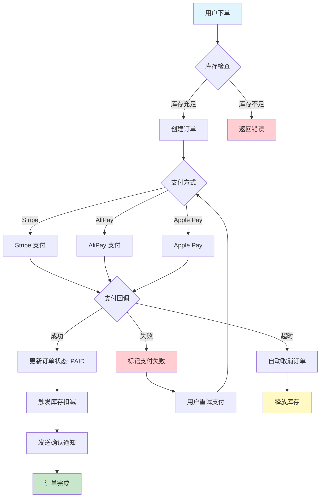

**踩坑 1：中文节点要用引号包裹**

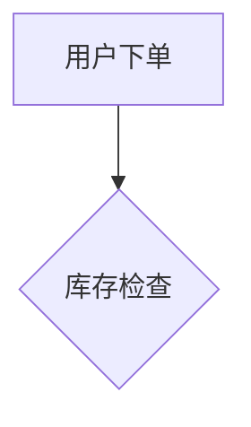

不加引号的话，遇到特殊字符（括号、冒号）会直接报 parse error。我有次在 Confluence 里画了半小时，结果发现是中文冒号 `：` 惹的祸。

**踩坑 2：`graph` vs `flowchart` 关键字**


`graph` 是旧语法，`flowchart` 是新语法，支持更多特性（如 `subgraph`、条件分支 `{|}`）。建议统一用 `flowchart`。

**踩坑 3：箭头连线样式**

Mermaid 支持多种连线样式，在画复杂流程时能增加可读性：

```text
A --> B    实线箭头（默认）
A --- B    实线无箭头
A -.-> B   虚线箭头
A ==> B    粗线箭头
A -- text --> B   带文本的连线
A -->|text| B     带文本的连线（另一种写法）
```

**踩坑 4：节点形状速记**

```text
A[矩形]        → 默认矩形
A(圆角矩形)     → 圆角
A{菱形}        → 决策/判断
A((圆形))      → 圆形
A>旗形]        → 旗形（右凸）
A[[双线矩形]]   → 双线矩形
A[(圆柱体)]    → 数据库
A{{六边形}}    → 六边形
```

### 流程图完整语法示例：Laravel API 请求处理流程

以下是 Laravel 项目中一个典型的 API 请求处理全流程，涵盖中间件、Controller、Service、Repository 各层：

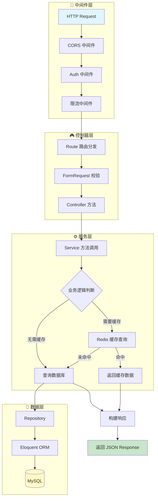

这段代码展示了 Laravel 请求的完整生命周期：从中间件 → 路由 → 控制器 → 服务层 → 数据层 → 响应。用 `subgraph` 按架构分层，一目了然。

## 二、时序图（Sequence Diagram）：API 请求链路

画 API 请求的完整链路，时序图是最佳选择。以下是 B2C 下单接口的完整链路：

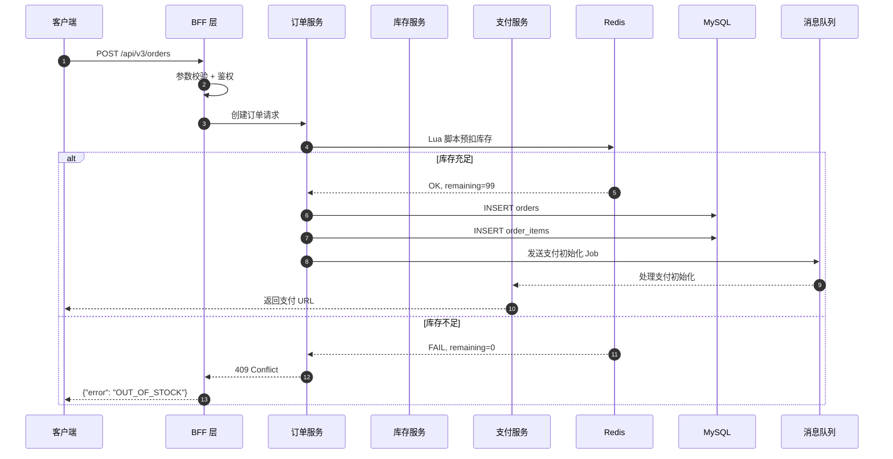

**踩坑 3：`autonumber` 让时序图自动编号**

加了 `autonumber` 之后，每个消息自动带序号，在讨论接口流程时特别方便："你看第 5 步，这里用 Lua 脚本预扣库存……"

**踩坑 4：`alt/else` 条件分支的缩进**

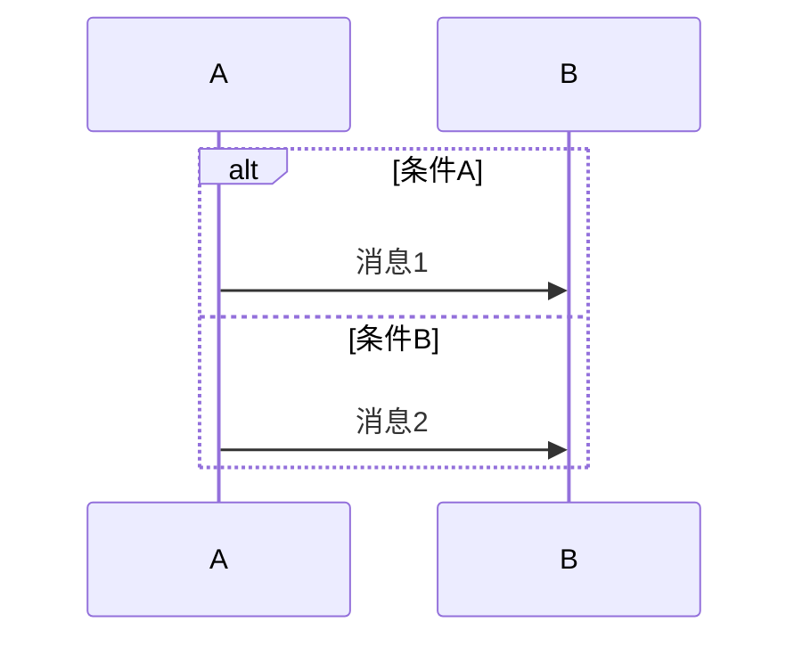

`else` 和 `end` 必须和 `alt` 同级缩进，否则渲染会乱。这个坑我在 Confluence 里踩了无数次。

### 时序图完整语法速查

```text
participant A as 别名      # 声明参与者并设置别名
A->>B: 同步调用（实线箭头）
A-->>B: 异步返回（虚线箭头）
A->B: 同步调用（无箭头）
A--B: 返回（无箭头）
A-xB: 同步调用 + 交叉结尾
A--xB: 异步返回 + 交叉结尾
A->>A: 自调用

Note left of A: 左侧注释
Note right of B: 右侧注释
Note over A,B: 跨参与者注释

alt 条件A           # 条件分支
else 条件B
end

loop 循环条件        # 循环
end

opt 可选条件         # 可选
end

par 并行任务A        # 并行
and 并行任务B
end

critical 关键操作    # 关键区域
option 可选操作
end

rect rgb(200, 230, 255)  # 高亮区域
end

autonumber           # 自动编号
```

### 用户下单完整时序图

以下是 B2C 电商用户下单的完整时序图，覆盖了从前端到后端全链路：

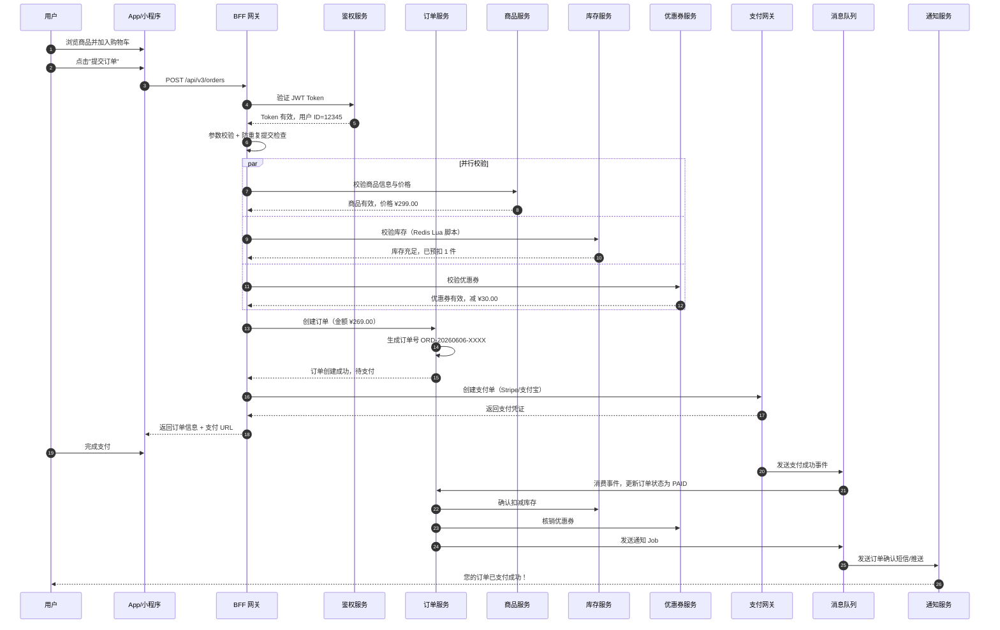

**踩坑 5：`par` 并行块的使用**

`par` 块可以展示多个并行操作（如同时校验库存和优惠券），在微服务架构中非常实用。注意：`par` 内部的参与者必须在外部已声明，否则渲染会失败。

## 三、ER 图（Entity Relationship）：数据库设计

写 SA/SD 文档时，ER 图是标配。Mermaid 的 ER 图语法简洁明了：

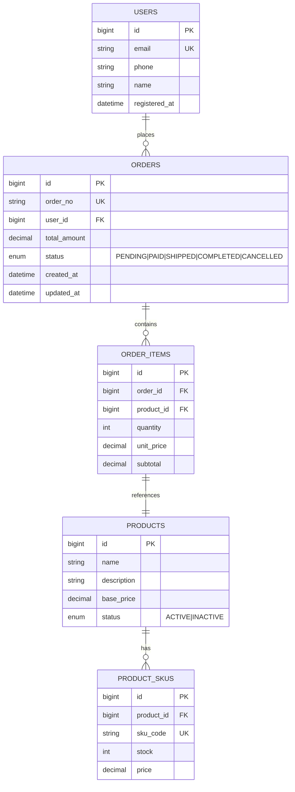

**踩坑 5：关系基数的表示**

Mermaid ER 图用这些符号表示基数：

| 符号 | 含义 |
|------|------|
| `\|\|` | 恰好一个（mandatory） |
| `o\|` | 零或一个（optional） |
| `\|\|` 到 `o{` | 一对多 |
| `o\|` 到 `o\|` | 零或一对一 |

我一开始把 `||--o{` 写成 `||--{`，结果渲染出来全是"一对一"，和实际数据库设计完全对不上。记住：`o` 表示"零"，不加 `o` 表示"至少一个"。

### ER 图关系符号速查表

| 左侧符号 | 右侧符号 | 含义 | 示例 |
|----------|----------|------|------|
| `\|\|` | `\|\|` | 一对一（强制） | 用户 ↔ 用户详情 |
| `\|\|` | `o{` | 一对多（强制） | 订单 → 订单项 |
| `o\|` | `\|\|` | 零或一 → 一 | 可选关联 |
| `o\|` | `o{` | 零或一 → 多 | 可选一对多 |
| `\|\|` | `\|{` | 一对多（强制，无零） | 同 `\|\|` → `o{` |

### ER 图语法要点

```text
ENTITY_NAME {
    数据类型 字段名 修饰符
}

# 修饰符：
# PK  — 主键
# FK  — 外键
# UK  — 唯一约束
# NOT NULL — 非空（默认）
```

**踩坑 6：ER 图字段注释中的特殊字符**

在 ER 图的 enum 类型中，竖线 `|` 是枚举分隔符，不能在值中出现。如果 enum 值包含特殊字符，需要用引号包裹。此外，字段注释中不要包含 `{}`、`()`、`[]` 等括号字符，否则会导致解析错误。

### Laravel B2C 数据库 ER 图完整示例

以下是一个完整的 Laravel B2C 电商数据库 ER 图，包含用户、订单、商品、支付、地址等核心表：

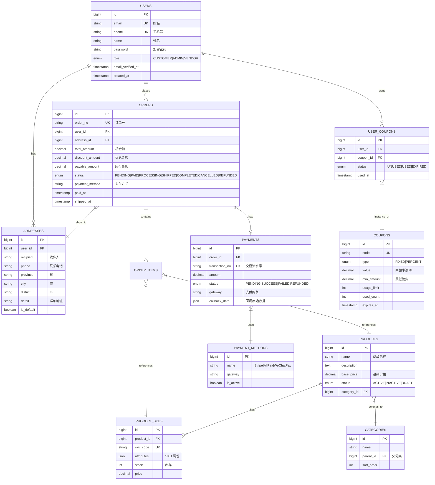

这张图可以直接放在 SA/SD 文档中，作为数据库设计的核心参考。配合 Laravel 的 Migration 文件，就是一份完整的数据模型文档。

## 四、类图（Class Diagram）：Service Layer 架构

画 Laravel 项目的 Service Layer 架构时，类图非常直观：

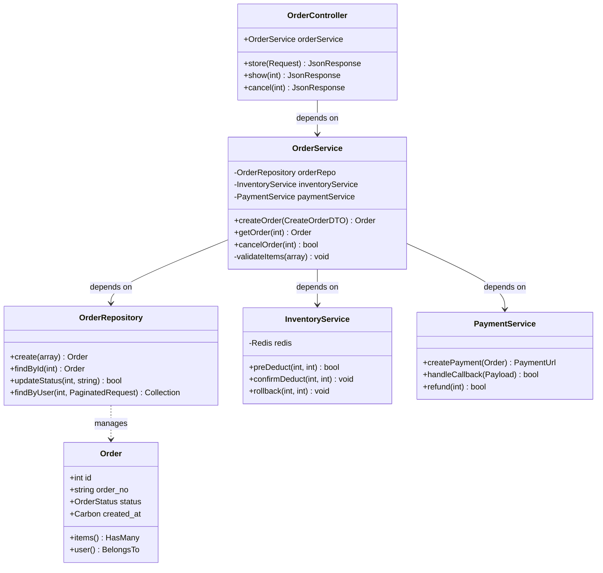

**踩坑 6：Laravel 的 HasMany/BelongsTo 关系**

Mermaid 类图的 `-->` 表示依赖，`..>` 表示关联。在画 Eloquent Model 之间的关系时，我习惯用 `..>` 表示 ORM 关系，`-->` 表示 Service 层的依赖注入。

## 五、状态图（State Diagram）：订单生命周期

比流程图更适合表达状态机：

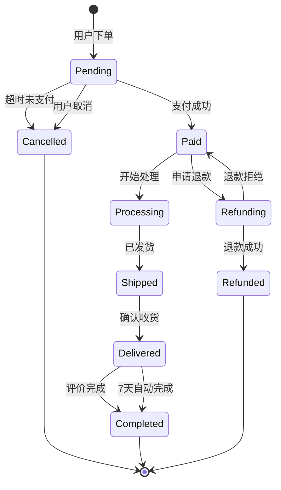

**踩坑 7：`stateDiagram-v2` 必须加 `-v2`**

不加 `-v2` 会用旧版渲染器，不支持很多语法特性（如 `[*]` 表示起止状态）。这和 `flowchart` vs `graph` 的坑类似。

## 六、甘特图（Gantt）：项目排期

写 SA/SD 文档时，经常需要附带项目排期：

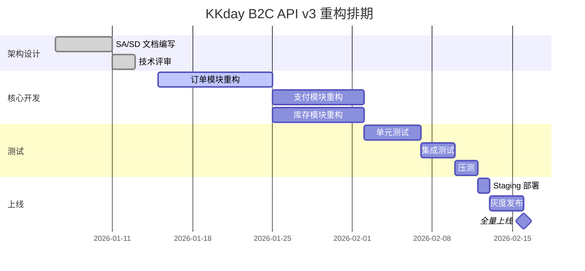

**踩坑 8：`active` 状态高亮当前任务**

在甘特图里，给当前正在进行的任务加 `:active,` 前缀，渲染出来会高亮显示，在周会汇报时一目了然。

## 七、Confluence 集成实战

在 Confluence 里使用 Mermaid，需要安装 **Mermaid Diagrams for Confluence** 插件（Marketplace 搜索即可）。安装后直接在页面里插入 Mermaid Block：

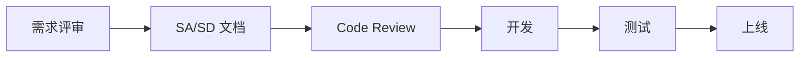

**踩坑 9：Confluence 渲染与 GitHub 渲染的差异**

同一个 Mermaid 代码，在 Confluence 和 GitHub 上渲染效果可能不同：
- Confluence 的 Mermaid 插件版本可能落后于最新版
- 某些语法（如 `flowchart` 的 `{|}` 条件分支）在旧版插件不支持
- 建议：先在 [Mermaid Live Editor](https://mermaid.live) 验证，再贴到 Confluence

## 八、Hexo 博客集成

如果你的博客也是 Hexo，可以用 `hexo-filter-mermaid-diagrams` 插件：

```bash
npm install hexo-filter-mermaid-diagrams --save
```

在文章里直接用 ```` ```mermaid ```` 代码块即可，Hexo 生成时会自动注入 Mermaid JS 并渲染。

**踩坑 10：Mermaid JS 版本冲突**

如果主题自带了 Mermaid JS，和插件的版本可能冲突，导致渲染白屏。解决方法：在 `_config.yml` 里禁用主题的 Mermaid，只用插件的。

## 九、实用技巧与最佳实践

### 9.1 用 `subgraph` 分组复杂架构

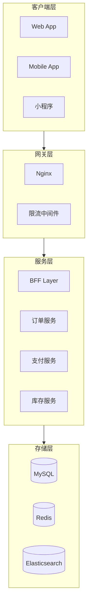

### 9.2 用 `click` 添加链接

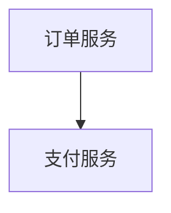

这在写技术文档时特别有用，点击图上的节点直接跳转到对应仓库。

### 9.3 用 `direction` 控制子图布局

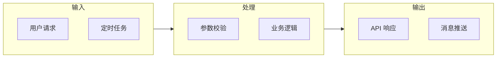

## 十、GitHub / GitLab 中使用 Mermaid

### GitHub 原生支持

GitHub 从 2022 年起原生支持 Mermaid 渲染。在 Issue、PR、Discussion 和 `.md` 文件中，只需使用 `mermaid` 代码块：

````text
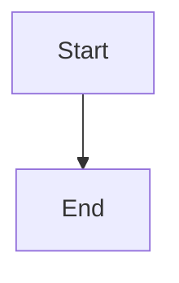
````

**GitHub 使用技巧**：
- 在 Issue 中画流程图讨论方案，比截图更方便修改
- PR 描述中用时序图说明接口变更，Reviewer 一看就懂
- Wiki 页面支持 Mermaid，可以作为轻量级架构文档
- GitHub Pages（Jekyll）默认不支持 Mermaid，需引入 Mermaid JS

### GitLab 原生支持

GitLab 同样原生支持 Mermaid，在 Markdown 中使用相同语法即可渲染。GitLab 还支持在 Wiki 和 Snippet 中使用 Mermaid。

**注意事项**：GitHub 和 GitLab 的 Mermaid 渲染引擎版本可能不同，同一个图表在两个平台上渲染效果可能有细微差异。建议以 Mermaid Live Editor 的渲染结果为准。

## 十一、Confluence 集成方案深度对比

在企业环境中，Confluence 是最常用的文档平台。以下是两种主流集成方案的对比：

| 方案 | Mermaid Diagrams 插件 | draw.io + 导入 |
|------|----------------------|----------------|
| 安装方式 | Marketplace 安装插件 | 已预装或 Marketplace |
| 编辑方式 | 直接写代码 | 拖拽 + 可导入 Mermaid |
| 版本控制 | 代码可 diff | 二进制不可 diff |
| 渲染版本 | 取决于插件版本 | 取决于 draw.io 版本 |
| 离线可用 | 需要插件服务端渲染 | 原生支持 |
| 推荐场景 | 技术文档、API 文档 | 产品设计、UI 流程 |

**实战建议**：
1. 技术团队的 SA/SD 文档统一用 Mermaid 插件
2. 产品/设计团队的文档用 draw.io
3. 如果需要在 Confluence 中混合使用，draw.io 支持导入 Mermaid 代码：`Extras → Edit Diagram → Mermaid` 标签页

### Confluence 插件版本兼容性

Confluence 的 Mermaid 插件版本通常落后于 Mermaid 官方 1-2 个大版本。以下功能在旧版插件中可能不支持：

| 功能 | 最低支持版本 | 替代方案 |
|------|-------------|----------|
| `flowchart` 关键字 | Mermaid 8.8+ | 用 `graph` 替代 |
| `{|}` 条件分支 | Mermaid 9.2+ | 拆分为多个节点 |
| `stateDiagram-v2` | Mermaid 8.9+ | 无替代 |
| `timeline` | Mermaid 9.3+ | 用甘特图替代 |
| `mindmap` | Mermaid 9.3+ | 用 flowchart 替代 |

## 十二、Mermaid 主题定制

Mermaid 内置 5 种主题，可以通过 `%%{init: {...}}%%` 指令在图表内切换：

| 主题名 | 风格 | 适用场景 |
|--------|------|----------|
| `default` | 浅色默认 | 通用 |
| `forest` | 绿色调 | 环保/自然主题 |
| `dark` | 深色背景 | 暗色模式文档 |
| `neutral` | 灰色调 | 正式文档 |
| `base` | 基础色 | 自定义基础 |

### 在图表中应用主题

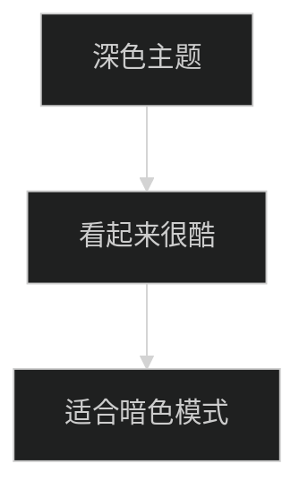

### 自定义颜色

除了内置主题，还可以通过 `themeVariables` 精细控制颜色：

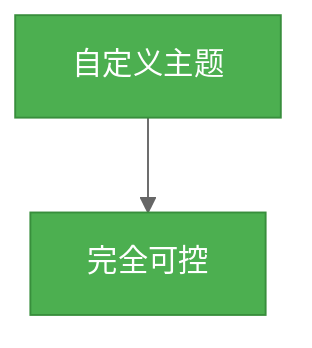

**踩坑：Hexo 博客中 `%%{init}%%` 语法不生效**

部分 Hexo 主题或 Markdown 渲染器会把 `%%` 注释语法吞掉。解决方法：在 `_config.yml` 中配置 Mermaid 插件的 `theme` 选项，而不是在图表内声明。

## 十三、Mermaid Live Editor 使用技巧

[Mermaid Live Editor](https://mermaid.live) 是官方提供的在线编辑器，也是调试 Mermaid 图表的最佳工具：

### 核心功能

1. **实时预览**：左侧写代码，右侧即时渲染
2. **导出格式**：支持导出 SVG、PNG，可直接插入文档
3. **分享链接**：代码会编码到 URL 中，分享链接即可分享图表
4. **主题切换**：一键切换 5 种内置主题预览效果
5. **历史记录**：浏览器本地存储编辑历史，刷新不丢失

### 高效使用技巧

1. **先用 Live Editor 验证，再贴到项目中**：这是避免踩坑的第一法则。不管是在 Confluence、GitHub 还是 Hexo 中使用，都先在 Live Editor 确认渲染正常。
2. **善用 Copy to clipboard**：导出 SVG 后可粘贴到 Slack、邮件等不支持 Mermaid 渲染的平台。
3. **用 URL 分享给非技术人员**：把 Live Editor 的 URL 发给 PM/设计师，他们打开就能看到图，不需要装任何工具。
4. **配合浏览器插件**：安装 Mermaid Diagrams Chrome 扩展，可以在任意网页上渲染 Mermaid 代码块。

### Mermaid CLI：本地批量渲染

如果需要批量生成图表或集成到 CI/CD，可以使用 `@mermaid-js/mermaid-cli`：

```bash
# 安装
npm install -g @mermaid-js/mermaid-cli

# 渲染单个文件
mmdc -i input.mmd -o output.svg
mmdc -i input.mmd -o output.png -t dark

# 批量渲染
for f in docs/diagrams/*.mmd; do
    mmdc -i "$f" -o "${f%.mmd}.svg" -t default
done
```

**踩坑：mermaid-cli 需要 Puppeteer**

`mermaid-cli` 依赖 Puppeteer（无头 Chrome），在 CI 环境中安装可能遇到依赖问题。建议在 Docker 中使用，或用 `--puppeteerConfigFile` 指定自定义 Chrome 路径。

## 十四、Mermaid vs PlantUML vs draw.io 对比

选择图表工具时，需要综合考虑团队习惯、使用场景和维护成本：

| 维度 | Mermaid | PlantUML | draw.io |
|------|---------|----------|---------|
| **语法** | Markdown-like，简洁 | 自有 DSL，功能强大 | 拖拽式 GUI |
| **学习曲线** | ⭐⭐ 低 | ⭐⭐⭐ 中 | ⭐ 最低 |
| **图表类型** | 12+ 种 | 20+ 种 | 无限制 |
| **渲染方式** | 浏览器端 JS | 服务端（需 Java） | 客户端渲染 |
| **GitHub 支持** | ✅ 原生 | ❌ 需第三方 | ❌ 需导出图片 |
| **GitLab 支持** | ✅ 原生 | ✅ 原生 | ❌ 需导出图片 |
| **Confluence** | 插件支持 | 插件支持 | ✅ 原生支持 |
| **版本控制** | ✅ 纯文本 | ✅ 纯文本 | ❌ XML 不可读 |
| **Code Review** | ✅ 可 diff | ✅ 可 diff | ❌ 不可 diff |
| **自定义主题** | ✅ 5 种 + 自定义 | ✅ 丰富 | ✅ 完全自由 |
| **导出格式** | SVG/PNG | SVG/PNG/PDF | SVG/PNG/PDF/XML |
| **适合人群** | 后端/全栈工程师 | 架构师/Java 团队 | 产品/设计/全员 |

**选型建议**：
- **后端团队写技术文档** → Mermaid（版本可控 + GitHub 原生支持）
- **Java 架构团队** → PlantUML（图表类型更丰富，和 Java 生态契合）
- **跨部门协作** → draw.io（零学习成本，适合非技术人员）
- **混合使用** → 技术文档用 Mermaid，产品文档用 draw.io

## 十五、常见踩坑完整清单

除了前面各章节提到的踩坑，这里汇总一些通用的注意事项：

### 15.1 特殊字符转义

| 字符 | 问题 | 解决方案 |
|------|------|----------|
| `"` 双引号 | 节点文本中包含双引号 | 用 `\"` 转义 |
| `()` 圆括号 | 节点文本被误识别为形状 | 用引号包裹节点文本 |
| `[]` 方括号 | 同上 | 用引号包裹 |
| `{}` 花括号 | 被误识别为菱形 | 用引号包裹 |
| `:` 冒号 | 在时序图中是消息分隔符 | 文本中的冒号无需转义 |
| `#` 井号 | 被识别为颜色代码 | 避免在节点 ID 中使用 |

**通用规则：遇到渲染异常，先用引号包裹节点文本试试。**

### 15.2 长文本换行

Mermaid 不支持在节点文本中直接使用 `\n` 换行。替代方案：

```mermaid
flowchart TD
    A["第一行文本<br/>第二行文本<br/>第三行文本"]
```

使用 `<br/>` 标签可以在节点文本中实现换行。注意：部分旧版渲染器可能不支持。

### 15.3 子图嵌套限制

Mermaid 目前**不支持子图嵌套**（subgraph 内再放 subgraph）。如果架构有层级关系，需要将层级扁平化，用命名约定来表示层级：

```mermaid
flowchart TB
    subgraph layer1["网络层"]
        direction LR
        LB[负载均衡]
        WAF[WAF]
    end
    subgraph layer2["应用层"]
        direction LR
        App1[App 1]
        App2[App 2]
    end
    subgraph layer3["数据层"]
        direction LR
        DB[(MySQL)]
        Cache[(Redis)]
    end
    layer1 --> layer2 --> layer3
```

### 15.4 节点 ID 不能包含特殊字符

节点 ID 只能使用字母、数字和下划线。不要使用中文或特殊符号作为节点 ID：

```text
# ❌ 错误
用户下单 --> 库存检查

# ✅ 正确
A["用户下单"] --> B["库存检查"]
```

### 15.5 渲染器版本差异

不同平台（GitHub、GitLab、Confluence、Hexo）可能使用不同版本的 Mermaid 渲染器。如果图表在某个平台渲染异常，先在 [Mermaid Live Editor](https://mermaid.live) 确认语法是否正确，再检查目标平台的 Mermaid 版本。

## 常见问题排查

| 问题 | 原因 | 解决方案 |
|------|------|----------|
| 渲染白屏 | 语法错误 | 先在 mermaid.live 验证 |
| 中文乱码 | 编码问题 | 确保文件是 UTF-8 |
| 布局混乱 | 节点太多 | 用 `subgraph` 分组 |
| 箭头方向不对 | 默认布局方向 | 用 `TD`/`LR` 显式指定 |
| Confluence 不渲染 | 插件版本旧 | 升级插件或用兼容语法 |
| GitHub 不渲染 | 缺少 mermaid 代码块标记 | 确保用 ````mermaid` |

## 总结

Mermaid 不是银弹——复杂的 UI 原型图、自由布局的架构图，还是得用 draw.io。但对于**流程图、时序图、ER 图、状态图**这些"有明确规则"的图，Mermaid 的效率是拖拽工具的 10 倍。

我的使用原则：
1. **API 接口文档** → 时序图（sequenceDiagram）
2. **数据库设计** → ER 图（erDiagram）
3. **业务流程** → 流程图（flowchart）
4. **状态机** → 状态图（stateDiagram-v2）
5. **项目排期** → 甘特图（gantt）
6. **Service 架构** → 类图（classDiagram）

一句话：**代码即文档，版本可控，Review 友好**。这就是 Mermaid 的核心价值。

## 相关阅读

- [Markdown 基础语法与进阶技巧](/post/markdown/) — Mermaid 的基础是 Markdown，扎实的 Markdown 技能让文档更高效
- [代码审查流程最佳实践](/post/code-review-process/) — Mermaid 画流程图 + 代码审查 = 团队协作的最佳组合
- [开源贡献 PR 工作流](/post/open-source-pr-workflow/) — 在 GitHub 上用 Mermaid 图表让 PR 描述更清晰
- [SPACE 框架度量开发者效能](/post/developer-productivity-metrics-space-dora/) — 用 Mermaid 甘特图可视化效能度量与改进计划
