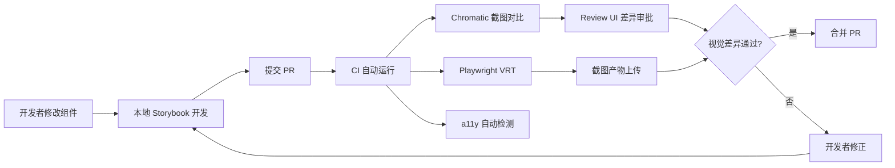

---

title: Storybook 8.x 实战：组件文档化与 Visual Regression Testing——Vue 3 组件库的设计系统治理
keywords: [Storybook, Visual Regression Testing, Vue, 组件文档化与, 组件库的设计系统治理]
description: 深入实战 Storybook 8.x 在 Vue 3 组件库中的完整应用：从 CSF3 Story 编写、autodocs 自动文档生成、MDX2 深度文档定制，到 Chromatic 与 Playwright 双轨视觉回归测试（VRT）、axe-core 无障碍检测集成、Design Token 体系化治理、组件变体矩阵管理与 CI/CD 质量门禁搭建。本文以真实 Vue 3 设计系统为背景，对比 Storybook、Histoire、Ladle 三大工具方案优劣，提供可落地的工程配置、GitHub Actions 流水线模板与团队落地清单，适合中大型前端团队构建组件库质量保障体系参考。
date: 2026-06-04 12:00:00
tags:
- Storybook
- Vue
- Visual Regression Testing
- 组件库
- 设计系统
categories:
- frontend
cover: https://images.unsplash.com/photo-1627398242454-45a1465c2479?w=1200&h=630&fit=crop
images:
  - https://images.unsplash.com/photo-1627398242454-45a1465c2479?w=1200&h=630&fit=crop
---


## 前言

在大型前端项目的工程化实践中，组件库早已不是"可有可无的基础设施"，而是直接影响研发效率、产品质量和团队协作的核心资产。一个成熟的设计系统不仅需要语义化的组件 API，还需要完善的文档体系、自动化视觉回归测试以及可落地的治理策略。然而在实际工作中，很多团队的组件库往往面临文档缺失、样式频繁回归、无障碍问题频发、设计与开发脱节等困境。这些问题并非技术能力不足，而是缺少一套系统化的治理机制。

Storybook 作为业界最成熟的组件开发与文档化工具，在 8.x 版本中引入了诸多突破性改进：全新的 Story format（CSF3）成为默认标准、嵌入式文档渲染使得组件预览真正可交互、对 Vite 的深度原生集成大幅提升了开发体验、以及对 Visual Regression Testing 工作流的全面优化。这些改进使得 Storybook 不再仅仅是一个"组件展示柜"，而是进化为一套完整的组件质量保障平台。

本文将以一个真实的 Vue 3 组件库的设计系统治理为背景，从工程搭建、文档编写、视觉回归测试、无障碍检测到团队协作流程，全面展示 Storybook 8.x 的最佳实践。无论你是初次接触 Storybook，还是计划将现有项目升级到 8.x，本文都能为你提供可落地的技术方案和参考架构。

<!-- more -->

## 一、Storybook 8.x 核心特性与架构变化

### 1.1 CSF3（Component Story Format 3）成为默认

Storybook 8.x 将 CSF3 确立为默认的 Story 格式，这是继 CSF1（函数导出）和 CSF2（Template.bind）之后的第三代标准格式。CSF3 的核心变化在于用**对象字面量**替代函数来描述 Story，使得声明更加简洁、类型推断更加友好：

```typescript
// CSF2（旧风格）
const Template: StoryFn<typeof Button> = (args) => ({
  components: { Button },
  setup() {
    return { args };
  },
  template: '<Button v-bind="args" />',
});

export const Primary = Template.bind({});
Primary.args = { variant: 'primary', label: '提交' };
```

```typescript
// CSF3（8.x 默认）
import type { Meta, StoryObj } from '@storybook/vue3';
import Button from './Button.vue';

const meta = {
  title: 'Components/Button',
  component: Button,
  tags: ['autodocs'],
} satisfies Meta<typeof Button>;

export default meta;
type Story = StoryObj<typeof meta>;

export const Primary: Story = {
  args: {
    variant: 'primary',
    label: '提交',
  },
};

export const Disabled: Story = {
  args: {
    variant: 'primary',
    label: '提交',
    disabled: true,
  },
};
```

CSF3 相较于前两代格式的优势是全方位的。从开发体验来看，对象字面量的声明方式使得每个 Story 的定义一目了然，不再需要理解 Template.bind 的隐含语义；从类型安全来看，satisfies 操作符结合 Meta<typeof Component> 的约束可以在编译阶段捕获 Story 定义中的类型错误，避免在运行时才发现参数不匹配的问题。

CSF3 的关键优势包括：

- **自动推断**：从组件的 props 类型自动生成 argTypes，减少手动配置
- **更小体积**：无模板字符串，与 bundler 配合更紧密
- **play function**：在 Story 中直接编写交互测试逻辑
- **satisfies 约束**：利用 TypeScript 的 satisfies 操作符保证类型安全

### 1.2 Docs Overhaul：嵌入式文档渲染

Storybook 8.x 重构了文档渲染架构，采用 iframe 嵌入方式来渲染每一个 Story 的真实交互。这意味着文档页面中的组件预览不再是简单的静态截图，而是**真实可交互的组件实例**。用户可以在文档页面中直接点击按钮、输入文本、切换选项卡，所见即所得地体验组件的完整交互行为。这种沉浸式的文档阅读体验对于设计师理解组件行为、对于产品经理验收功能细节而言，具有极高的实用价值。

在嵌入式渲染架构下，每个 Story 都运行在独立的 iframe 环境中，样式隔离天然完成，不会出现全局 CSS 污染文档页面的问题。同时，iframe 的使用也意味着文档页面的性能不会因为同时渲染大量组件实例而下降——只有当用户滚动到对应区域时，iframe 才会被懒加载初始化。这一架构改进使得文档页面可以承载数十甚至上百个 Story 的预览，而不影响页面的加载速度和交互流畅度。

### 1.3 架构瘦身与 Vite 深度集成

Storybook 8.x 对核心架构进行了大幅瘦身，移除了大量过时的 addon 和框架耦合层。在 7.x 时代，许多用户反馈 Storybook 的构建速度缓慢、依赖树庞大、与现代打包工具的集成不够顺畅。8.x 版本针对这些痛点进行了系统性的优化，核心包体积缩减了约 40%，冷启动速度提升了约 50%。

对于 Vue 3 + Vite 技术栈，Storybook 8.x 提供了开箱即用的 `@storybook/vue3-vite` 框架，天然支持：

- Vite 的快速 HMR
- Vue 3 SFC 的 `<script setup>` 语法
- CSS Modules、PostCSS 等样式方案
- 自动识别 `*.stories.ts` 文件

## 二、从零搭建 Storybook 8.x + Vue 3 + Vite 工程

### 2.1 初始化项目

以一个已有的 Vue 3 组件库项目为例，首先安装 Storybook 8：

```bash
# 使用 storybook CLI 一键初始化
npx storybook@latest init --framework vue3-vite

# 或者手动安装核心依赖
pnpm add -D @storybook/vue3-vite@^8 \
  @storybook/addon-essentials@^8 \
  @storybook/addon-a11y@^8 \
  @storybook/blocks@^8 \
  @storybook/test@^8
```

### 2.2 核心配置文件

初始化后，Storybook 会在项目根目录生成 `.storybook/` 目录：

```typescript
// .storybook/main.ts
import type { StorybookConfig } from '@storybook/vue3-vite';

const config: StorybookConfig = {
  stories: ['../src/**/*.mdx', '../src/**/*.stories.@(js|jsx|ts|tsx)'],
  addons: [
    '@storybook/addon-essentials',
    '@storybook/addon-a11y',
    '@storybook/addon-interactions',
    '@storybook/addon-viewport',
    '@storybook/addon-designs',  // 嵌入 Figma 设计稿
  ],
  framework: {
    name: '@storybook/vue3-vite',
    options: {},
  },
  docs: {
    autodocs: 'tag',    // 带有 autodocs tag 的组件自动生成文档
    defaultName: '文档', // 默认文档页名称
  },
  typescript: {
    check: false,
    reactDocgen: 'react-docgen-typescript',
  },
};

export default config;
```

```typescript
// .storybook/preview.ts
import type { Preview } from '@storybook/vue3';
import '../src/styles/tokens.css';   // 引入设计 token
import '../src/styles/reset.css';    // 引入基础重置样式

const preview: Preview = {
  parameters: {
    layout: 'padded',
    controls: {
      matchers: {
        color: /(background|color)$/i,
        date: /Date$/i,
      },
    },
    backgrounds: {
      default: 'light',
      values: [
        { name: 'light', value: '#ffffff' },
        { name: 'dark', value: '#1a1a2e' },
        { name: 'brand', value: '#f0f5ff' },
      ],
    },
    a11y: {
      config: {
        rules: [
          { id: 'color-contrast', enabled: true },
          { id: 'link-in-text-block', enabled: true },
        ],
      },
      // 配合 axe 检测的自动运行模式
      manual: false,
    },
  },
};

export default preview;
```

```json
// package.json 中的 scripts
{
  "scripts": {
    "storybook": "storybook dev -p 6006",
    "build-storybook": "storybook build",
    "test-storybook": "test-storybook",
    "test:visual": "npx playwright test --config=playwright.storybook.config.ts"
  }
}
```

### 2.3 设计 Token 体系化

设计系统治理的第一步是建立统一的设计 Token 体系。设计 Token 是设计系统的"原子单元"，它将视觉属性（颜色、字体、间距、圆角、阴影等）抽象为可复用的变量，使得设计意图可以在代码层面被精确表达和一致执行。一个完善的 Token 体系不仅能保证组件间的视觉一致性，还能为后续的暗色主题切换、多品牌适配等需求提供底层支撑。

在技术实现上，我们选择 CSS 自定义属性（CSS Custom Properties）作为 Token 的载体。相较于 Less/Sass 变量，CSS 自定义属性具有运行时可修改、支持级联继承、无需编译步骤等优势，非常适合需要动态主题切换的场景。

```css
/* src/styles/tokens.css */
:root {
  /* ===== 色彩系统 ===== */
  --color-primary-50: #eff6ff;
  --color-primary-100: #dbeafe;
  --color-primary-500: #3b82f6;
  --color-primary-600: #2563eb;
  --color-primary-700: #1d4ed8;

  --color-success-500: #22c55e;
  --color-warning-500: #f59e0b;
  --color-error-500: #ef4444;

  --color-text-primary: #111827;
  --color-text-secondary: #6b7280;
  --color-text-disabled: #d1d5db;

  --color-bg-surface: #ffffff;
  --color-bg-elevated: #f9fafb;

  /* ===== 间距系统 ===== */
  --space-xs: 4px;
  --space-sm: 8px;
  --space-md: 16px;
  --space-lg: 24px;
  --space-xl: 32px;
  --space-2xl: 48px;

  /* ===== 字体系统 ===== */
  --font-family-sans: 'Inter', -apple-system, BlinkMacSystemFont, sans-serif;
  --font-family-mono: 'JetBrains Mono', 'Fira Code', monospace;

  --font-size-xs: 0.75rem;
  --font-size-sm: 0.875rem;
  --font-size-base: 1rem;
  --font-size-lg: 1.125rem;
  --font-size-xl: 1.25rem;
  --font-size-2xl: 1.5rem;

  --font-weight-normal: 400;
  --font-weight-medium: 500;
  --font-weight-semibold: 600;
  --font-weight-bold: 700;

  /* ===== 圆角系统 ===== */
  --radius-sm: 4px;
  --radius-md: 8px;
  --radius-lg: 12px;
  --radius-full: 9999px;

  /* ===== 阴影系统 ===== */
  --shadow-sm: 0 1px 2px 0 rgb(0 0 0 / 0.05);
  --shadow-md: 0 4px 6px -1px rgb(0 0 0 / 0.1);
  --shadow-lg: 0 10px 15px -3px rgb(0 0 0 / 0.1);

  /* ===== 过渡 ===== */
  --transition-fast: 150ms ease;
  --transition-normal: 250ms ease;
}
```

在 Storybook 的预览配置中引入 Token，可以确保所有 Story 中的组件都渲染在正确的 Token 环境下。

## 三、组件文档化深度实践

### 3.1 Autodocs：零成本自动文档

组件文档是设计系统中最容易被忽视、也最容易过时的部分。很多团队在项目初期会投入大量精力编写精美的组件文档，但随着时间推移，文档与实际代码的偏差越来越大，最终文档变成了"美丽的谎言"——看起来专业，但实际已经不可信。

Storybook 8.x 的 autodocs 功能正是为了解决这一痛点而设计的。它通过静态分析（配合 `vue-docgen-api`）自动从 Vue 组件的 props、events、slots 定义中提取文档内容。开发者只需要在编写组件时添加规范的 JSDoc 风格注释，autodocs 就能自动生成结构化的 API 文档。这意味着文档的更新与组件代码的修改天然同步——修改了组件的 prop 定义，文档会在下次构建时自动反映变更，不存在文档过时的问题。

```vue
<!-- src/components/Button/Button.vue -->
<script setup lang="ts">
/**
 * 按钮组件 - 基础交互组件
 *
 * 支持多种变体、尺寸和状态，是设计系统中最常用的原子组件。
 *
 * @example 基本用法
 * ```vue
 * <Button variant="primary">点击我</Button>
 * ```
 */
defineOptions({ name: 'MyButton' });

export interface ButtonProps {
  /** 按钮变体样式 */
  variant?: 'primary' | 'secondary' | 'outline' | 'ghost' | 'danger';
  /** 按钮尺寸 */
  size?: 'sm' | 'md' | 'lg';
  /** 是否禁用 */
  disabled?: boolean;
  /** 是否显示加载状态 */
  loading?: boolean;
  /** 按钮类型 */
  type?: 'button' | 'submit' | 'reset';
  /** 自定义图标 */
  icon?: string;
}

const props = withDefaults(defineProps<ButtonProps>(), {
  variant: 'primary',
  size: 'md',
  disabled: false,
  loading: false,
  type: 'button',
});

const emit = defineEmits<{
  /** 点击事件 */
  click: [event: MouseEvent];
}>();
</script>

<template>
  <button
    :class="[
      'my-button',
      `my-button--${variant}`,
      `my-button--${size}`,
      { 'my-button--disabled': disabled, 'my-button--loading': loading },
    ]"
    :disabled="disabled || loading"
    :type="type"
    @click="emit('click', $event)"
  >
    <span v-if="loading" class="my-button__spinner" />
    <slot />
  </button>
</template>
```

通过上述代码，`Button` 的 props 文档会自动生成于 autodocs 页面，包括类型、默认值、说明等信息。

### 3.2 MDX2 文档：深度自定义文档页

当 autodocs 无法满足复杂文档需求时（如需要展示设计意图、使用场景、API 对比等），MDX2 是最佳选择。Storybook 8.x 对 MDX2 的支持更加成熟：

```mdx
{/* src/components/Button/Button.stories.mdx */}

import { Meta, Canvas, Story, ArgsTable, Source } from '@storybook/blocks';
import * as ButtonStories from './Button.stories';

<Meta of={ButtonStories} title="Components/Button 按钮" />

# Button 按钮

按钮是最基础的交互组件，承载用户点击触发操作的职责。在设计系统中，
按钮的变体、尺寸、状态需要严格遵循 Token 规范。

## 设计原则

- **一致性**：同一操作语义在不同场景下保持视觉一致
- **可感知性**：通过颜色、大小和状态变化传递交互意图
- **无障碍性**：满足 WCAG 2.1 AA 标准，支持键盘导航

## 变体

<Canvas of={ButtonStories.AllVariants} />

### Primary 主按钮

用于页面中最主要的操作（如提交表单、确认订单）。每个页面区域建议
只使用一个 Primary 按钮。

<Canvas of={ButtonStories.Primary} />

### Secondary 次要按钮

用于辅助操作，视觉层次低于主按钮。

<Canvas of={ButtonStories.Secondary} />

### Outline 描边按钮

在视觉层次最弱、或背景较深的场景中使用。

<Canvas of={ButtonStories.Outline} />

### Ghost 幽灵按钮

在工具栏、表单内联操作等场景中使用，不占用额外的视觉重量。

<Canvas of={ButtonStories.Ghost} />

### Danger 危险按钮

用于删除、注销等不可逆操作。务必配合确认对话框使用。

<Canvas of={ButtonStories.Danger} />

## 尺寸

按钮支持 `sm`、`md`、`lg` 三种尺寸，默认为 `md`。

<Canvas of={ButtonStories.AllSizes} />

## 状态

### 加载状态

按钮在异步操作期间应显示 loading 状态，防止重复提交。

<Canvas of={ButtonStories.Loading} />

### 禁用状态

当操作前置条件不满足时，按钮应处于禁用状态。

<Canvas of={ButtonStories.Disabled} />

## 交互测试

以下 Story 使用 `play` 函数编写了可自动执行的交互测试：

<Canvas of={ButtonStories.ClickInteraction} />

## API 参考

<ArgsTable of={ButtonStories.Primary} />

## 使用建议

<Source
  language="vue"
  code={`
<script setup>
import { Button } from '@your-lib/core';
</script>

<template>
  <Button variant="primary" size="md" @click="handleSubmit">
    提交订单
  </Button>
</template>
  `}
/>
```

对应的 `.stories.ts` 文件：

```typescript
// src/components/Button/Button.stories.ts
import type { Meta, StoryObj } from '@storybook/vue3';
import { within, userEvent, expect } from '@storybook/test';
import Button from './Button.vue';

const meta = {
  title: 'Components/Button',
  component: Button,
  tags: ['autodocs'],
  argTypes: {
    variant: {
      control: 'select',
      options: ['primary', 'secondary', 'outline', 'ghost', 'danger'],
      description: '按钮变体样式',
    },
    size: {
      control: 'select',
      options: ['sm', 'md', 'lg'],
      description: '按钮尺寸',
    },
    disabled: { control: 'boolean', description: '是否禁用' },
    loading: { control: 'boolean', description: '加载状态' },
    default: {
      control: 'text',
      description: '按钮内容（slot）',
    },
  },
  args: {
    default: '按钮文本',
  },
  render: (args) => ({
    components: { Button },
    setup() {
      return { args };
    },
    template: `<Button v-bind="args">{{ args.default }}</Button>`,
  }),
} satisfies Meta<typeof Button>;

export default meta;
type Story = StoryObj<typeof meta>;

// ===== 基础变体 =====
export const Primary: Story = {
  args: { variant: 'primary' },
};

export const Secondary: Story = {
  args: { variant: 'secondary' },
};

export const Outline: Story = {
  args: { variant: 'outline' },
};

export const Ghost: Story = {
  args: { variant: 'ghost' },
};

export const Danger: Story = {
  args: { variant: 'danger' },
};

// ===== 全变体展示 =====
export const AllVariants: Story = {
  render: () => ({
    components: { Button },
    template: `
      <div style="display: flex; gap: 12px; flex-wrap: wrap; align-items: center;">
        <Button variant="primary">Primary</Button>
        <Button variant="secondary">Secondary</Button>
        <Button variant="outline">Outline</Button>
        <Button variant="ghost">Ghost</Button>
        <Button variant="danger">Danger</Button>
      </div>
    `,
  }),
  parameters: {
    docs: {
      source: { code: null }, // 不显示源码，避免冗余
    },
  },
};

// ===== 全尺寸展示 =====
export const AllSizes: Story = {
  render: () => ({
    components: { Button },
    template: `
      <div style="display: flex; gap: 12px; align-items: center;">
        <Button size="sm">Small</Button>
        <Button size="md">Medium</Button>
        <Button size="lg">Large</Button>
      </div>
    `,
  }),
};

// ===== 加载状态 =====
export const Loading: Story = {
  args: { variant: 'primary', loading: true, default: '提交中...' },
};

// ===== 禁用状态 =====
export const Disabled: Story = {
  args: { variant: 'primary', disabled: true },
};

// ===== 交互测试 =====
export const ClickInteraction: Story = {
  args: { variant: 'primary', default: '点击测试' },
  play: async ({ canvasElement, args }) => {
    const canvas = within(canvasElement);
    const button = canvas.getByRole('button');
    await userEvent.click(button);
    // 验证点击事件被触发
    await expect(button).toBeInTheDocument();
  },
};
```

### 3.3 Args 与 ArgTypes 的高级技巧

在复杂组件中，合理利用 argTypes 可以极大提升文档的可交互性和可理解性：

```typescript
// 复杂组件的 argTypes 配置示例
const meta: Meta<typeof DataTable> = {
  title: 'Components/DataTable',
  component: DataTable,
  tags: ['autodocs'],
  argTypes: {
    // 使用映射标签（显示中文但值为英文）
    size: {
      options: ['sm', 'md', 'lg'],
      mapping: {
        sm: 'small',
        md: 'medium',
        lg: 'large',
      },
      control: { type: 'select' },
      labels: {
        sm: '小号',
        md: '中号（默认）',
        lg: '大号',
      },
    },
    // 使用 JSON 编辑器控制复杂对象
    columns: {
      control: 'object',
      description: '表格列配置',
      table: {
        type: {
          summary: 'Column[]',
          detail: `
            interface Column {
              key: string;
              title: string;
              width?: number;
              sortable?: boolean;
              render?: (value: any) => VNode;
            }
          `,
        },
      },
    },
    // 使用 action 记录事件
    onPageChange: {
      action: 'pageChanged',
      description: '分页变化回调',
    },
    // 禁用某些 arg 的控制
    internalState: {
      table: {
        disable: true,
      },
    },
  },
};
```

## 四、Visual Regression Testing 实战

### 4.1 为什么需要视觉回归测试

单元测试覆盖的是逻辑正确性，但视觉回归——一个不经意的样式改动、一个 Token 变量的覆盖、一个 z-index 的冲突——往往无法被 jest/vitest 的断言捕获。在实际项目中，一个常见的场景是：开发者修改了某个全局样式文件中的间距变量，导致页面上数十个组件的布局发生微妙偏移。这种问题在代码审查阶段极难通过肉眼发现，只有当 QA 在多终端逐一验证时才会暴露，修复成本极高。

Visual Regression Testing（VRT）通过像素级截图对比，在 PR 阶段即可发现视觉差异。其工作原理是：在每次构建时，对每个 Story 进行全页截图，然后将新截图与上一次通过审核的基线截图进行逐像素比较。如果差异超过了预设的阈值，系统会标记该 Story 为"待审核"状态，并在 PR 中以可视化差异图的形式展示给审核者。

Storybook 8.x 在 VRT 生态中的定位非常清晰：它是**唯一的 Story 来源**。无论是 Chromatic 还是 Playwright，都以 Storybook 的 Story 为测试入口。这意味着开发者只需要编写一次 Story，就能同时获得文档展示、交互测试和视觉回归检测三重收益，避免了为测试而重复编写代码的低效做法。这种"一份代码，多重产出"的理念，正是 Storybook 生态的核心优势。

### 4.2 方案一：Chromatic（官方推荐）

Chromatic 是 Storybook 官方的云端视觉回归测试服务，它的工作原理是：

1. 将 Storybook 构建产物上传至 Chromatic 云端
2. 对每个 Story 进行全页截图
3. 与基线截图进行像素级 diff
4. 在 PR 中以 review 形式展示差异
5. 审核通过后更新基线

```bash
# 安装 Chromatic CLI
pnpm add -D chromatic
```

```yaml
# .github/workflows/chromatic.yml
name: Chromatic Visual Regression

on:
  pull_request:
    branches: [main, develop]
    paths:
      - 'src/components/**'
      - 'src/styles/**'
      - '.storybook/**'

jobs:
  chromatic:
    runs-on: ubuntu-latest
    steps:
      - name: Checkout
        uses: actions/checkout@v4
        with:
          fetch-depth: 0  # Chromatic 需要完整 Git 历史

      - name: Setup pnpm
        uses: pnpm/action-setup@v2
        with:
          version: 8

      - name: Setup Node
        uses: actions/setup-node@v4
        with:
          node-version: 20
          cache: 'pnpm'

      - name: Install dependencies
        run: pnpm install --frozen-lockfile

      - name: Run Chromatic
        uses: chromaui/action@latest
        with:
          projectToken: ${{ secrets.CHROMATIC_PROJECT_TOKEN }}
          # 仅在有组件变更时运行
          exitOnceUploaded: true
          # 构建失败时也上传
          exitZeroOnChanges: true
          # 自定义 Storybook 构建命令
          buildScriptName: build-storybook
```

Chromatic 的 PR 界面非常直观，每个有差异的 Story 会展示：

- **基线截图**（Baseline）：上一次通过审核的组件外观
- **新截图**（New）：本次代码变更后生成的组件外观
- **差异叠加图**（Diff）：差异像素以红色高亮显示，精确到每个像素的变化

审核者可以在 Chromatic UI 中直接 approve 或 reject 每个差异。approve 后系统自动更新基线，后续的截图对比将以新审核通过的版本作为基准。这一机制确保了基线始终反映团队认可的最新设计状态，避免了"审查窗口"期间的误判。

### 4.3 方案二：Playwright 端到端视觉测试

对于不想依赖云端服务或有安全限制的团队，可以使用 Playwright 进行本地视觉回归测试。Storybook 8.x 提供了 `@storybook/test-runner`，底层基于 Playwright：

```bash
pnpm add -D @playwright/test
```

```typescript
// playwright.storybook.config.ts
import { defineConfig, devices } from '@playwright/test';

export default defineConfig({
  testDir: './tests/visual',
  fullyParallel: true,
  forbidOnly: !!process.env.CI,
  retries: process.env.CI ? 2 : 0,
  workers: process.env.CI ? 1 : undefined,
  reporter: [
    ['html', { outputFolder: 'test-results/visual-report' }],
    ['list'],
  ],
  use: {
    // Storybook dev server 地址
    baseURL: 'http://localhost:6006',
    screenshot: 'only-on-failure',
  },
  projects: [
    {
      name: 'chromium',
      use: { ...devices['Desktop Chrome'] },
    },
    {
      name: 'mobile-chrome',
      use: { ...devices['Pixel 5'] },
    },
  ],
  // 本地启动 Storybook
  webServer: {
    command: 'pnpm storybook --ci',
    url: 'http://localhost:6006',
    reuseExistingServer: !process.env.CI,
    timeout: 120000,
  },
});
```

编写 Playwright 视觉测试：

```typescript
// tests/visual/button.spec.ts
import { test, expect } from '@playwright/test';

// Story 的 URL 格式：/iframe.html?id={storyId}&viewMode=story
const storyUrl = (storyId: string) =>
  `/iframe.html?id=${storyId}&viewMode=story`;

test.describe('Button 组件视觉回归', () => {
  test('所有变体截图', async ({ page }) => {
    await page.goto(storyUrl('components-button--all-variants'));
    await page.waitForSelector('#storybook-root');

    // 等待字体和动画稳定
    await page.waitForTimeout(500);

    await expect(page).toHaveScreenshot('button-all-variants.png', {
      fullPage: true,
      maxDiffPixelRatio: 0.01, // 允许最多 0.01% 像素差异
    });
  });

  test('主按钮交互状态', async ({ page }) => {
    await page.goto(storyUrl('components-button--primary'));
    await page.waitForSelector('#storybook-root');

    const button = page.locator('button');
    await expect(button).toHaveScreenshot('button-primary-default.png');

    // hover 状态
    await button.hover();
    await expect(button).toHaveScreenshot('button-primary-hover.png');

    // active 状态
    await button.dispatchEvent('mousedown');
    await expect(button).toHaveScreenshot('button-primary-active.png');
  });

  test('暗色主题', async ({ page }) => {
    await page.goto(storyUrl('components-button--all-variants'));
    // 切换到暗色背景
    await page.locator('[title="dark"]').click();
    await page.waitForTimeout(300);

    await expect(page).toHaveScreenshot('button-all-variants-dark.png', {
      fullPage: true,
    });
  });
});
```

```typescript
// tests/visual/form.spec.ts
import { test, expect } from '@playwright/test';

const storyUrl = (storyId: string) =>
  `/iframe.html?id=${storyId}&viewMode=story`;

test.describe('表单组件视觉回归', () => {
  test('输入框状态矩阵', async ({ page }) => {
    await page.goto(storyUrl('components-input--all-states'));
    await page.waitForSelector('#storybook-root');
    await page.waitForTimeout(500);

    await expect(page).toHaveScreenshot('input-all-states.png', {
      fullPage: true,
      maxDiffPixelRatio: 0.005,
    });
  });

  test('表单布局响应式', async ({ page }) => {
    // 桌面端
    await page.setViewportSize({ width: 1280, height: 800 });
    await page.goto(storyUrl('components-form--default'));
    await expect(page).toHaveScreenshot('form-desktop.png');

    // 移动端
    await page.setViewportSize({ width: 375, height: 812 });
    await expect(page).toHaveScreenshot('form-mobile.png');
  });
});
```

在 CI 中集成 Playwright 视觉测试：

```yaml
# .github/workflows/visual-test.yml
name: Visual Regression Tests

on:
  pull_request:
    branches: [main]

jobs:
  visual-tests:
    runs-on: ubuntu-latest
    steps:
      - uses: actions/checkout@v4

      - uses: pnpm/action-setup@v2
        with:
          version: 8

      - uses: actions/setup-node@v4
        with:
          node-version: 20
          cache: 'pnpm'

      - run: pnpm install --frozen-lockfile

      - name: Install Playwright browsers
        run: pnpm exec playwright install --with-deps chromium

      - name: Run visual regression tests
        run: pnpm exec playwright test --config=playwright.storybook.config.ts

      - name: Upload test results
        if: failure()
        uses: actions/upload-artifact@v4
        with:
          name: visual-test-results
          path: |
            test-results/
            playwright-report/
```

### 4.4 方案对比：Chromatic vs Playwright

| 维度 | Chromatic | Playwright |
|------|-----------|------------|
| 部署方式 | 云端 SaaS | 本地/CI 自建 |
| 审批流程 | 内置 Review UI，支持逐个 Story 审批 | 需自建或依赖 CI 产物 |
| 截图一致性 | 云端统一环境，跨平台一致 | 受本地环境影响，需 Docker 保障一致性 |
| 免费额度 | 5000 次截图/月（开源免费） | 完全免费 |
| 并行能力 | 自动并行 | 需手动配置 workers |
| 集成深度 | 与 Storybook 深度集成，支持 TurboSnap 增量 | 通用 E2E，灵活度高 |
| 适用团队 | 中大型团队，有预算 | 预算敏感或有数据安全要求的团队 |

推荐的组合策略是：**Chromatic 用于主视觉分支管理和 PR 审批流，Playwright 用于关键路径的响应式和交互状态测试**。

## 五、设计系统治理策略

### 5.1 无障碍测试（a11y addon）

无障碍访问（Accessibility，简称 a11y）是现代 Web 应用开发中不可忽视的重要维度。根据世界卫生组织的统计，全球约有 13 亿人存在不同程度的视力障碍，这意味着任何面向公众的 Web 应用都必须考虑无障碍适配。在组件库层面，a11y 的治理尤为关键——如果底层组件存在无障碍缺陷，那么所有使用这些组件的业务页面都将继承这些缺陷。

`@storybook/addon-a11y` 底层基于 axe-core（业界最权威的无障碍检测引擎），可以在开发阶段即发现无障碍问题。它会在每次渲染 Story 时自动执行 axe 检测，并将违规结果以可视化的方式展示在 Storybook 的 a11y 面板中。开发者可以清楚地看到哪些元素违反了无障碍规则、违规的严重程度（错误/警告/注意事项）以及修复建议。

在团队治理层面，建议将 a11y 检测纳入 CI 流水线的阻断条件中。当组件库中的核心组件存在严重无障碍违规时，PR 应被阻止合并，直到问题被修复。这种强制性的质量门禁可以在早期拦截大量无障碍问题，避免问题在产品上线后才被发现和修复，从而大幅降低修复成本。

```typescript
// .storybook/preview.ts — 全局 a11y 配置
const preview: Preview = {
  parameters: {
    a11y: {
      // axe 配置
      config: {
        rules: [
          {
            // 对所有组件启用颜色对比检测
            id: 'color-contrast',
            enabled: true,
          },
          {
            // 确保表单元素有关联的 label
            id: 'label',
            enabled: true,
          },
        ],
      },
      // 哪些元素需要检测
      element: '#storybook-root',
      // 手动触发模式（默认自动）
      manual: false,
    },
  },
};
```

在单个 Story 中可以覆盖全局配置：

```typescript
export const WithoutLabel: Story = {
  args: { variant: 'primary' },
  render: () => ({
    components: { Button },
    // 故意省略 aria-label 来测试 a11y 检测
    template: '<Button><span class="icon-only">🗑</span></Button>',
  }),
  parameters: {
    a11y: {
      // 这个 Story 预期会有违规，用于展示 a11y 检测效果
      config: {
        rules: [{ id: 'button-name', enabled: true }],
      },
    },
  },
};
```

在 CI 中可以通过 `test-storybook` 配合 a11y addon 自动化检测：

```json
{
  "scripts": {
    "test:a11y": "test-storybook --includeTags a11y-test"
  }
}
```

### 5.2 组件变体矩阵治理

设计系统中，组件的视觉一致性需要通过**变体矩阵**来保障。所谓变体矩阵，是指将组件的所有 prop 组合（变体 × 尺寸 × 状态）以矩阵形式可视化展示。这种做法的灵感来自 Material Design 等成熟设计系统的组件文档规范——设计师和开发者可以通过一张矩阵图快速感知组件在所有可能状态下的外观表现，从而在早期发现不一致或遗漏的设计问题。

变体矩阵的维护需要遵循严格的更新纪律：每当组件新增一个变体或状态，矩阵必须同步更新。建议将变体矩阵的截图纳入 VRT 基线管理，任何对矩阵截图的改动都需要经过设计师的审核确认。这种机制确保了设计系统中的"已知状态"是完整的、可验证的。

```typescript
// src/components/Input/Input.stories.ts
import type { Meta, StoryObj } from '@storybook/vue3';
import Input from './Input.vue';

const meta = {
  title: 'Components/Input',
  component: Input,
  tags: ['autodocs'],
} satisfies Meta<typeof Input>;

export default meta;
type Story = StoryObj<typeof meta>;

// 单一状态
export const Default: Story = {
  args: { placeholder: '请输入内容' },
};

// 完整变体矩阵 — 所有状态一览
export const VariantMatrix: Story = {
  render: () => ({
    components: { Input },
    template: `
      <div style="display: grid; grid-template-columns: repeat(3, 1fr); gap: 24px;">
        <!-- 默认 -->
        <div>
          <div style="font-size: 12px; color: #666; margin-bottom: 4px;">默认</div>
          <Input placeholder="请输入" />
        </div>
        <!-- 聚焦 -->
        <div>
          <div style="font-size: 12px; color: #666; margin-bottom: 4px;">聚焦</div>
          <Input placeholder="请输入" class="is-focused" />
        </div>
        <!-- 填写中 -->
        <div>
          <div style="font-size: 12px; color: #666; margin-bottom: 4px;">填写中</div>
          <Input model-value="已输入内容" />
        </div>
        <!-- 成功 -->
        <div>
          <div style="font-size: 12px; color: #666; margin-bottom: 4px;">成功</div>
          <Input model-value="有效内容" status="success" />
        </div>
        <!-- 警告 -->
        <div>
          <div style="font-size: 12px; color: #666; margin-bottom: 4px;">警告</div>
          <Input model-value="需要确认" status="warning" />
        </div>
        <!-- 错误 -->
        <div>
          <div style="font-size: 12px; color: #666; margin-bottom: 4px;">错误</div>
          <Input model-value="格式错误" status="error" error-message="邮箱格式不正确" />
        </div>
        <!-- 禁用 -->
        <div>
          <div style="font-size: 12px; color: #666; margin-bottom: 4px;">禁用</div>
          <Input placeholder="不可编辑" disabled />
        </div>
        <!-- 只读 -->
        <div>
          <div style="font-size: 12px; color: #666; margin-bottom: 4px;">只读</div>
          <Input model-value="只读内容" readonly />
        </div>
        <!-- 加载中 -->
        <div>
          <div style="font-size: 12px; color: #666; margin-bottom: 4px;">加载中</div>
          <Input placeholder="加载中..." loading />
        </div>
      </div>
    `,
  }),
  parameters: {
    docs: {
      source: { code: null },
    },
  },
};
```

这个矩阵截图将作为设计对齐的核心参考物，设计师和开发者可以并行审查。

### 5.3 Design Token 可视化文档

在 Storybook 中创建 Token 展示页面，使用 MDX2 组件化方式展示：

```mdx
{/* src/tokens/DesignTokens.stories.mdx */}
import { Meta, ColorPalette, ColorItem, Typeset } from '@storybook/blocks';

<Meta title="Design System/设计 Token" />

# 设计 Token

所有组件的颜色、字体、间距均来自以下 Token，严禁在组件代码中硬编码值。

## 色彩系统

<ColorPalette>
  <ColorItem
    title="Primary 主色"
    subtitle="--color-primary-{n}"
    colors={{
      '50': 'var(--color-primary-50)',
      '100': 'var(--color-primary-100)',
      '500': 'var(--color-primary-500)',
      '600': 'var(--color-primary-600)',
      '700': 'var(--color-primary-700)',
    }}
  />
  <ColorItem
    title="Semantic 语义色"
    subtitle="--color-{semantic}-{n}"
    colors={{
      success: 'var(--color-success-500)',
      warning: 'var(--color-warning-500)',
      error: 'var(--color-error-500)',
    }}
  />
  <ColorItem
    title="Text 文本色"
    subtitle="--color-text-{variant}"
    colors={{
      primary: 'var(--color-text-primary)',
      secondary: 'var(--color-text-secondary)',
      disabled: 'var(--color-text-disabled)',
    }}
  />
</ColorPalette>

## 字体系统

<Typeset
  fontSizes={['0.75rem', '0.875rem', '1rem', '1.125rem', '1.25rem', '1.5rem']}
  fontFamily="var(--font-family-sans)"
  sampleText="设计系统 Design System 123"
/>
```

### 5.4 组件变更的 PR Review 工作流

组件库的 PR Review 不应仅停留在代码层面的逻辑审查，还应涵盖视觉一致性和无障碍合规性的验证。一个完整的 PR Review 工作流应覆盖从本地开发到合并上线的全流程，确保每个环节都有明确的质量门禁：



开发者日常流程：

1. **本地开发**：`pnpm storybook` 启动，实时预览组件变化
2. **编写 Story**：新组件必须有 autodocs + 关键状态 Story
3. **提交 PR**：CI 自动触发 Chromatic + Playwright + a11y 检测
4. **视觉 Review**：在 Chromatic UI 中审查每个差异
5. **合并**：所有视觉检查通过后方可合并

## 六、与替代方案的对比

在选择组件文档化和开发工具时，团队需要根据自身的技术栈、项目规模和治理需求做出合理的选择。以下是 Storybook 8.x 与两个主要替代方案的详细对比分析。

### 6.1 Histoire

Histoire 是 Vue 生态中较新的组件文档工具，定位为 Storybook 的轻量替代：

| 维度 | Storybook 8.x | Histoire |
|------|---------------|----------|
| 框架支持 | React, Vue, Angular, Svelte, Web Components 等 | 专注 Vue 3 / Svelte |
| 社区生态 | 最成熟，addon 丰富 | 较新，生态有限 |
| VRT 支持 | Chromatic + Playwright + 多种集成 | 内置截图功能，但无独立 VRT 服务 |
| 构建速度 | 8.x 大幅优化，支持 Turbosnap | 基于 Vite，开发启动快 |
| 文档能力 | MDX2 + autodocs + blocks | Histoire 的 story DSL |
| 学习曲线 | 较陡，概念多 | 轻量，上手快 |
| 适用场景 | 大型团队 / 多框架 | Vue 3 专属的中小型项目 |

### 6.2 Ladle

Ladle 由 Uber 开发，专注性能和简单性：

| 维度 | Storybook 8.x | Ladle |
|------|---------------|-------|
| 启动速度 | 8.x 优化后显著提升 | 极快（基于 SWC） |
| 功能深度 | 全面的 addon 生态 | 精简，核心功能为主 |
| VRT 集成 | 原生支持多种方案 | 需自行集成 |
| 文档能力 | 完善的 autodocs + MDX | 无文档化能力 |
| 维护团队 | Chromatic 公司 + 社区 | Uber 内部团队 |

**选型建议**：如果团队使用 Vue 3 且规模不大，Histoire 是值得考虑的轻量选择；如果追求极致构建速度且对文档需求不高，Ladle 可以尝试。但对于需要完善的文档化、VRT 和无障碍检测的**生产级设计系统**，Storybook 8.x 仍然是最佳选择。值得注意的是，工具选型不是一锤定音的决定——随着项目演进和团队成长，工具链也可能需要随之调整。关键是在选型初期就建立清晰的评估标准（如文档完备性、测试集成度、社区活跃度等），并定期回顾工具链是否仍然满足团队需求。

## 七、进阶：Play Function 与交互测试

Storybook 8.x 的 CSF3 原生支持 `play` 函数，可以在 Story 中编写可自动执行的交互逻辑：

```typescript
// src/components/Modal/Modal.stories.ts
import type { Meta, StoryObj } from '@storybook/vue3';
import { within, userEvent, expect, fn } from '@storybook/test';
import Modal from './Modal.vue';

const meta = {
  title: 'Components/Modal',
  component: Modal,
  tags: ['autodocs'],
} satisfies Meta<typeof Modal>;

export default meta;
type Story = StoryObj<typeof meta>;

export const Default: Story = {
  args: {
    visible: true,
    title: '确认操作',
    onClose: fn(),
    onConfirm: fn(),
  },
};

export const OpenAndClose: Story = {
  args: {
    visible: true,
    title: '确认删除',
    onClose: fn(),
    onConfirm: fn(),
  },
  play: async ({ canvasElement, args }) => {
    const canvas = within(canvasElement);

    // 验证模态框已打开
    const title = await canvas.findByText('确认删除');
    await expect(title).toBeInTheDocument();

    // 点击确认按钮
    const confirmButton = canvas.getByRole('button', { name: '确认' });
    await userEvent.click(confirmButton);

    // 验证 onConfirm 回调被调用
    await expect(args.onConfirm).toHaveBeenCalledTimes(1);
  },
};

export const KeyboardInteraction: Story = {
  args: {
    visible: true,
    title: '键盘测试',
    onClose: fn(),
  },
  play: async ({ canvasElement, args }) => {
    // 按 Escape 关闭模态框
    await userEvent.keyboard('{Escape}');
    await expect(args.onClose).toHaveBeenCalledTimes(1);
  },
};
```

这些 `play` 函数不仅在 Storybook UI 中可以手动触发（点击 play 按钮），还会在 `test-storybook` 中被自动执行，实现真正的交互测试。

## 八、最佳实践与团队落地策略

工具的价值最终体现在团队的工作流中。再先进的技术方案，如果无法被团队成员接受和习惯性使用，最终也只能沦为"摆设"。因此，在引入 Storybook 和相关工具链时，需要制定循序渐进的落地策略，从核心团队的试点推广，到全员的流程制度化，每一步都需要充分的沟通和培训。

### 8.1 项目结构规范

推荐以下目录结构来组织 Storybook 相关文件：

```
src/
├── components/
│   ├── Button/
│   │   ├── Button.vue
│   │   ├── Button.test.ts        # 单元测试
│   │   ├── Button.stories.ts     # Story 定义
│   │   ├── Button.stories.mdx    # 深度文档（可选）
│   │   └── __snapshots__/
│   │       └── button-visual.png # VRT 基线（可选）
│   ├── Input/
│   └── ...
├── styles/
│   ├── tokens.css
│   └── reset.css
.storybook/
├── main.ts
├── preview.ts
└── theme.ts
tests/
├── visual/                        # Playwright VRT
│   ├── button.spec.ts
│   └── form.spec.ts
└── a11y/                          # a11y 测试
```

### 8.2 团队落地清单

**阶段一：基础建设（1-2 周）**

- [ ] 初始化 Storybook 8.x 项目
- [ ] 配置 design tokens 和全局样式
- [ ] 编写前 5 个核心组件的 Story（Button, Input, Select, Modal, Table）
- [ ] 配置 autodocs
- [ ] 配置 a11y addon

**阶段二：VRT 集成（1 周）**

- [ ] 选择 VRT 方案（Chromatic 或 Playwright）
- [ ] 配置 CI 流水线
- [ ] 为现有组件建立视觉基线
- [ ] 编写 PR Review 规范文档

**阶段三：流程制度化（持续）**

- [ ] 组件 PR 必须包含 Story 更新
- [ ] 视觉差异必须由设计师和开发者共同审批
- [ ] 每个 sprint 检查 a11y 报告
- [ ] Token 变更需通过 Design Review 流程
- [ ] 定期清理过期 Story 和低质量文档

### 8.3 关键注意事项

1. **Story 覆盖率**：每个组件至少应有以下 Story——默认状态、所有变体、所有尺寸、禁用状态、错误状态、边缘情况（超长文本、空状态等）。Story 的数量和质量直接决定了 VRT 的检测粒度。如果一个组件的某些状态没有对应的 Story，那么这些状态下的视觉回归将无法被自动捕获。建议在代码审查中将"Story 覆盖完整度"作为一项检查清单项。

2. **截图基线管理**：首次建立基线时，确保在统一的 CI 环境下运行，避免不同机器的渲染差异。使用 Docker 镜像可以保障环境一致性。不同操作系统、不同字体安装版本、甚至不同的 anti-aliasing 设置都可能导致像素级的渲染差异，因此基线的建立和对比必须在完全一致的环境中进行。

3. **增量检测**：Chromatic 的 TurboSnap 功能通过分析 Storybook 的构建依赖图，只对受代码变更影响的组件进行截图对比，大幅减少不必要的截图次数和成本。在大型组件库中（数百个组件、数千个 Story），全量截图的耗时和费用都相当可观，TurboSnap 可以将截图次数降低 80% 以上。

4. **性能考量**：大量 Story 可能导致 Storybook 构建缓慢。可以通过以下方式优化：
   - 使用 `tags` 过滤不需要被截图的 Story
   - 合理拆分 Storybook 构建（如按模块拆分）
   - 利用 Storybook 8.x 的代码分割能力

5. **文档即代码**：将组件文档视为一等公民，与组件代码一起 review、一起维护。过时的文档比没有文档更糟糕。

## 总结

Storybook 8.x 为 Vue 3 组件库的设计系统治理提供了一套完整的工具链：从组件开发阶段的 CSF3 + autodocs，到 PR 阶段的 Chromatic/Playwright 视觉回归测试，再到质量保障层面的 a11y 检测和交互测试，形成了一条完整的质量闭环。这条闭环的关键价值在于：它将传统上依赖人工肉眼检查和口头约定的"软规范"，转化为机器自动执行的"硬约束"，大幅降低了人为疏忽带来的质量风险。

回顾全文的核心要点：CSF3 的对象字面量语法和 TypeScript 类型推断使得 Story 的编写更加简洁和类型安全；autodocs 和 MDX2 为组件文档提供了从自动到自定义的完整覆盖；Chromatic 和 Playwright 的 VRT 方案分别满足了云端协作和本地自建两种场景需求；a11y addon 将无障碍检测前置到开发阶段，而非等到产品上线后才被动修复；变体矩阵和设计 Token 可视化则为设计师和开发者提供了统一的沟通语言。

设计系统治理的本质不是工具的选择，而是**流程的制度化**。只有当团队将"每个组件必须有 Story、每次 PR 必须有视觉审查、每个 Token 变更必须有记录"内化为开发习惯时，设计系统才能真正发挥其价值。这种制度化需要自上而下的推动（如管理层将 Story 覆盖率纳入技术指标）和自下而上的认同（如开发者在实践中体验到 VRT 如何帮助他们避免了线上视觉事故）共同作用。

Storybook 8.x 的成熟度和生态广度，使其成为这个制度化过程中最可靠的基础设施。无论团队规模如何，从今天开始在项目中引入 Storybook 并逐步建立 VRT 流程，都是一个高投资回报率的技术决策。设计系统不是一天建成的，但每一次 Story 的编写、每一次视觉差异的审核、每一次无障碍违规的修复，都在为这个系统添砖加瓦。坚持下去，你会发现组件库从"能用"到"好用"再到"值得信赖"的蜕变，远比想象中来得更快。

## 相关阅读

- [Playwright a11y 实战：自动化无障碍测试——axe-core 集成、CI 门禁与 WCAG 2.2 合规检查](/categories/前端/Playwright-a11y-实战-自动化无障碍测试-axe-core集成-CI门禁与WCAG-2.2合规检查/)
- [Playwright 实战：跨浏览器 E2E 测试——Laravel 应用的可视化回归、网络拦截与 CI 并行执行踩坑记录](/categories/前端/Playwright-实战-跨浏览器E2E测试-Laravel应用的可视化回归网络拦截与CI并行执行踩坑记录/)
- [Micro-Frontend 实战：Module Federation 2.0——Vue 3 微前端架构与 Laravel BFF 聚合层集成](/categories/前端/micro-frontend-module-federation-2-vue3-laravel-bff/)
