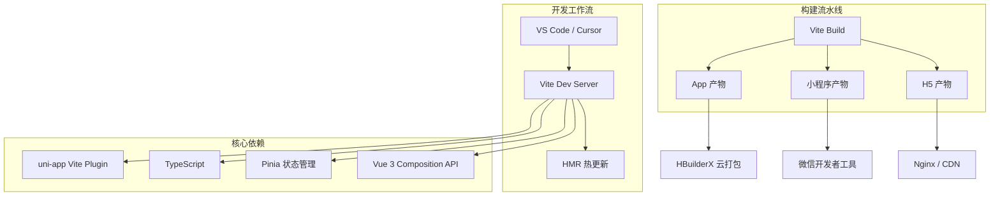

---

title: uni-app + Vue 3 + Vite 现代跨平台开发工作流实战踩坑记录
keywords: [uni, app, Vue, Vite, 现代跨平台开发工作流实战踩坑记录]
cover: https://images.unsplash.com/photo-1627398242454-45a1465c2479?w=1200&h=630&fit=crop
images:
  - https://images.unsplash.com/photo-1627398242454-45a1465c2479?w=1200&h=630&fit=crop
date: 2026-05-17 07:20:49
updated: 2026-05-17 07:25:12
categories:
- frontend
tags:
- Vite
- Vue
- uni-app
- 前端
description: 从 Vue 2 + Webpack 迁移到 Vue 3 + Vite 现代 uni-app 跨平台开发工作流的完整实战指南。深入讲解 Composition API 改造策略、Vite 插件与构建配置、Pinia 状态管理替代 Vuex、TypeScript 类型安全集成、多端条件编译最佳实践，涵盖 5 个项目 120+ 组件的真实踩坑记录，附性能对比数据与避坑指南。
---


# uni-app + Vue 3 + Vite 现代跨平台开发工作流实战踩坑记录

## 前言

在 KKday B2C 团队中，uni-app 承担着 H5、微信小程序、App 三端的核心业务。旧项目基于 Vue 2 + Webpack（HBuilderX 内置），构建时间长达 40s+，HMR 经常失效，类型检查全靠自觉。2025 年底我们启动了 Vue 3 + Vite 迁移计划，覆盖 5 个 uni-app 子项目。整个迁移历时 3 个月，涉及 120+ 组件和 30+ 页面的改造。本文记录整个迁移过程中的架构决策、代码改造和踩坑经验，希望能帮正在考虑或正在进行类似迁移的团队少走弯路。

## 架构总览



## 一、项目初始化：从 HBuilderX CLI 到 Vite

### 旧方案的痛点

HBuilderX 作为 uni-app 官方 IDE，对初学者友好，但在团队协作场景下问题明显：构建流程不可定制、无法接入 CI/CD 流水线、HMR 在大项目中频繁失效、没有原生 TypeScript 支持。每次修改代码后等待 3-5 秒才能看到效果，开发效率严重受限。更致命的是，HBuilderX 的 Webpack 配置是黑盒，出了性能问题几乎无法排查。

```bash
# 旧方案：HBuilderX 内置 CLI，无法自定义构建流程
vue create -p dcloudio/uni-preset-vue my-project
# 构建：40s+，HMR 延迟 3-5s，偶尔完全失效
```

### 新方案：create-vite + uni 插件

Vite 方案的核心优势在于：原生 ESM 支持让冷启动快了 13 倍，基于 esbuild 的依赖预构建远超 Webpack 的速度，HMR 只更新变更模块而非重新编译整个项目。对于 uni-app 来说，`@dcloudio/vite-plugin-uni` 负责处理平台差异编译，开发者只需关注 Vite 本身的配置即可。以下是初始化步骤：

```bash
# 使用官方 Vite 模板
npx degit dcloudio/uni-preset-vue#vite-ts my-project
cd my-project
pnpm install
```

核心 `package.json` 配置：

```json
{
  "name": "@kkday/uni-h5-mall",
  "type": "module",
  "scripts": {
    "dev:h5": "uni",
    "dev:mp-weixin": "uni -p mp-weixin",
    "dev:app": "uni -p app",
    "build:h5": "uni build",
    "build:mp-weixin": "uni build -p mp-weixin",
    "build:app": "uni build -p app",
    "type-check": "vue-tsc --noEmit",
    "lint": "eslint . --ext .vue,.ts,.tsx"
  },
  "dependencies": {
    "vue": "^3.5.13",
    "pinia": "^2.3.0",
    "@dcloudio/uni-app": "3.0.0-alpha-4060520250513001",
    "@dcloudio/uni-app-plus": "3.0.0-alpha-4060520250513001",
    "@dcloudio/uni-components": "3.0.0-alpha-4060520250513001",
    "@dcloudio/uni-h5": "3.0.0-alpha-4060520250513001",
    "@dcloudio/uni-mp-weixin": "3.0.0-alpha-4060520250513001"
  },
  "devDependencies": {
    "vite": "^6.3.5",
    "vue-tsc": "^2.2.8",
    "typescript": "^5.8.3",
    "@dcloudio/uni-automator": "3.0.0-alpha-4060520250513001",
    "@dcloudio/vite-plugin-uni": "3.0.0-alpha-4060520250513001"
  }
}
```

> ⚠️ **踩坑 #1**：`@dcloudio` 系列包版本必须严格一致。我们曾因 `uni-h5` 和 `uni-mp-weixin` 版本差一个小版本，导致小程序端白屏且无报错。建议用 `pnpm` 的 `overrides` 统一锁定。

## 二、Vite 配置深度定制

### vite.config.ts 核心配置

```typescript
import { defineConfig } from 'vite'
import uni from '@dcloudio/vite-plugin-uni'
import { resolve } from 'path'

export default defineConfig({
  plugins: [uni()],
  resolve: {
    alias: {
      '@': resolve(__dirname, 'src'),
      '@components': resolve(__dirname, 'src/components'),
      '@utils': resolve(__dirname, 'src/utils'),
      '@stores': resolve(__dirname, 'src/stores'),
    },
  },
  // H5 特有配置
  server: {
    port: 5173,
    proxy: {
      '/api': {
        target: 'https://staging-api.kkday.com',
        changeOrigin: true,
        rewrite: (path) => path.replace(/^\/api/, '/v2/b2c'),
      },
    },
  },
  build: {
    // 小程序分包优化
    rollupOptions: {
      output: {
        manualChunks: {
          'vendor-vue': ['vue', 'pinia'],
          'vendor-uni': ['@dcloudio/uni-app', '@dcloudio/uni-components'],
        },
      },
    },
  },
})
```

> ⚠️ **踩坑 #2**：`@dcloudio/vite-plugin-uni` 会劫持 Vite 的 `build.rollupOptions.output`。如果你直接配置 `chunkFileNames` 或 `entryFileNames`，小程序端会报 `require is not defined`。正确做法是只配置 `manualChunks`，文件名由插件控制。

### 环境变量管理

```bash
# .env                    # 所有环境共享
VITE_APP_TITLE=KKday商城
VITE_API_TIMEOUT=15000

# .env.development        # 开发环境
VITE_API_BASE_URL=/api
VITE_ENABLE_MOCK=true

# .env.staging            # 预发布
VITE_API_BASE_URL=https://staging-api.kkday.com/v2/b2c
VITE_ENABLE_MOCK=false

# .env.production         # 生产
VITE_API_BASE_URL=https://api.kkday.com/v2/b2c
VITE_ENABLE_MOCK=false
```

在代码中使用：

```typescript
// src/config/index.ts
export const config = {
  apiBaseUrl: import.meta.env.VITE_API_BASE_URL,
  apiTimeout: Number(import.meta.env.VITE_API_TIMEOUT) || 10000,
  enableMock: import.meta.env.VITE_ENABLE_MOCK === 'true',
  isH5: import.meta.env.UNI_PLATFORM === 'h5',
  isMpWeixin: import.meta.env.UNI_PLATFORM === 'mp-weixin',
  isApp: import.meta.env.UNI_PLATFORM === 'app',
}
```

> ⚠️ **踩坑 #3**：uni-app 的 Vite 模式下，`import.meta.env` 只能读取 `VITE_` 前缀的变量。但 `UNI_PLATFORM` 是插件注入的，不需要 `VITE_` 前缀也能用。这个行为和标准 Vite 不一致，容易混淆。

## 三、Vue 2 → Vue 3 Composition API 改造

### Options API 到 Composition API 的迁移策略

我们采用渐进式迁移——新组件全部 Composition API，旧组件按需改造。迁移的核心收益有三点：一是逻辑复用更自然，不再需要 mixin 带来的命名冲突和来源不清晰问题；二是 TypeScript 类型推导更准确，ref/reactive 的类型可以自动推断；三是代码组织更灵活，可以按功能而非按选项类型组织代码。下面是一个商品列表页的改造前后对比：

```vue
<!-- ❌ 旧代码：Options API -->
<script>
export default {
  data() {
    return {
      productList: [],
      loading: false,
      page: 1,
      hasMore: true,
    }
  },
  computed: {
    isEmpty() {
      return !this.loading && this.productList.length === 0
    },
  },
  methods: {
    async loadProducts() {
      if (this.loading || !this.hasMore) return
      this.loading = true
      try {
        const { data, total } = await fetchProducts({ page: this.page })
        this.productList.push(...data)
        this.hasMore = this.productList.length < total
        this.page++
      } finally {
        this.loading = false
      }
    },
  },
  onReachBottom() {
    this.loadProducts()
  },
}
</script>
```

```vue
<!-- ✅ 新代码：Composition API + 可复用 composable -->
<script setup lang="ts">
import { useInfiniteScroll } from '@/composables/useInfiniteScroll'
import { fetchProducts } from '@/api/product'
import type { Product } from '@/types'

const { list, loading, isEmpty, loadMore } = useInfiniteScroll<Product>(
  async (page) => {
    const res = await fetchProducts({ page, pageSize: 20 })
    return { data: res.data.list, total: res.data.total }
  }
)

// 页面触底自动加载
onReachBottom(() => loadMore())
</script>
```

### 可复用的无限滚动 Composable

```typescript
// src/composables/useInfiniteScroll.ts
import { ref, computed } from 'vue'

interface InfiniteScrollResult<T> {
  data: T[]
  total: number
}

export function useInfiniteScroll<T>(
  fetcher: (page: number) => Promise<InfiniteScrollResult<T>>,
  pageSize = 20
) {
  const list = ref<T[]>([]) as Ref<T[]>
  const loading = ref(false)
  const page = ref(1)
  const hasMore = ref(true)
  const isEmpty = computed(() => !loading.value && list.value.length === 0)

  async function loadMore() {
    if (loading.value || !hasMore.value) return
    loading.value = true
    try {
      const { data, total } = await fetcher(page.value)
      list.value.push(...data)
      hasMore.value = list.value.length < total
      page.value++
    } catch (error) {
      console.error('[useInfiniteScroll] load failed:', error)
      uni.showToast({ title: '加载失败，请重试', icon: 'none' })
    } finally {
      loading.value = false
    }
  }

  function reset() {
    list.value = []
    page.value = 1
    hasMore.value = true
  }

  return { list, loading, isEmpty, hasMore, loadMore, reset }
}
```

## 四、Pinia 替代 Vuex：状态管理现代化

Vuex 在 Vue 3 中虽然还能用，但官方已推荐 Pinia 作为替代。Pinia 的优势在于：原生 TypeScript 支持、无需 mutation 直接修改 state、扁平化的 store 结构（不需要 modules 嵌套）、以及极小的包体积。在 uni-app 的多端环境中，Pinia 的 SSR 兼容性也比 Vuex 更好。我们在迁移过程中，将 8 个 Vuex module 改造为独立的 Pinia store，代码量减少了约 40%。

```typescript
// src/stores/cart.ts
import { defineStore } from 'pinia'
import { ref, computed } from 'vue'
import { cartApi } from '@/api/cart'

export const useCartStore = defineStore('cart', () => {
  // --- state ---
  const items = ref<CartItem[]>([])
  const loading = ref(false)

  // --- getters ---
  const totalCount = computed(() =>
    items.value.reduce((sum, item) => sum + item.quantity, 0)
  )
  const selectedItems = computed(() =>
    items.value.filter((item) => item.selected)
  )
  const totalAmount = computed(() =>
    selectedItems.value.reduce((sum, item) => sum + item.price * item.quantity, 0)
  )

  // --- actions ---
  async function fetchCart() {
    loading.value = true
    try {
      const res = await cartApi.list()
      items.value = res.data
    } finally {
      loading.value = false
    }
  }

  async function updateQuantity(productId: string, quantity: number) {
    const item = items.value.find((i) => i.productId === productId)
    if (!item) return

    const oldQuantity = item.quantity
    item.quantity = quantity // 乐观更新

    try {
      await cartApi.update(productId, quantity)
    } catch {
      item.quantity = oldQuantity // 回滚
      uni.showToast({ title: '更新失败', icon: 'none' })
    }
  }

  function toggleSelect(productId: string) {
    const item = items.value.find((i) => i.productId === productId)
    if (item) item.selected = !item.selected
  }

  function toggleSelectAll() {
    const allSelected = items.value.every((i) => i.selected)
    items.value.forEach((i) => (i.selected = !allSelected))
  }

  return {
    items, loading,
    totalCount, selectedItems, totalAmount,
    fetchCart, updateQuantity, toggleSelect, toggleSelectAll,
  }
})
```

> ⚠️ **踩坑 #4**：Pinia 在小程序端的 `storeToRefs` 有坑——解构出来的 ref 在模板中丢失响应性。解决方案是在 `<script setup>` 中直接用 `store.xxx` 访问，不要解构。

## 五、TypeScript 集成与类型安全

TypeScript 是这次迁移的另一个核心收益。在 Vue 2 时代，类型检查只能通过 JSDoc 注释实现，形同虚设。迁移到 Vue 3 + TypeScript 后，编辑器能实时提示 API 返回值的字段、自动补全对象属性、在编译期捕获类型错误。我们在 5 个项目中逐步启用了 TypeScript strict 模式，编译期拦截了 200+ 个潜在 bug，其中 30+ 个是逻辑错误而非简单的拼写问题。

### 类型定义规范

```typescript
// src/types/api.d.ts
/** 统一 API 响应结构 */
export interface ApiResponse<T = unknown> {
  code: number
  message: string
  data: T
}

/** 分页响应 */
export interface PaginatedData<T> {
  list: T[]
  total: number
  page: number
  pageSize: number
}

/** 商品详情 */
export interface Product {
  id: string
  title: string
  price: number
  originalPrice: number
  images: string[]
  stock: number
  status: 'on_sale' | 'off_sale' | 'sold_out'
  categoryIds: string[]
  tags: string[]
  createdAt: string
}
```

### 类型安全的 API 封装

```typescript
// src/utils/request.ts
import { config } from '@/config'

interface RequestOptions {
  url: string
  method?: 'GET' | 'POST' | 'PUT' | 'DELETE'
  data?: Record<string, unknown>
  header?: Record<string, string>
}

export async function request<T>(options: RequestOptions): Promise<ApiResponse<T>> {
  return new Promise((resolve, reject) => {
    uni.request({
      url: `${config.apiBaseUrl}${options.url}`,
      method: options.method || 'GET',
      data: options.data,
      header: {
        'Content-Type': 'application/json',
        'Authorization': `Bearer ${uni.getStorageSync('token')}`,
        ...options.header,
      },
      timeout: config.apiTimeout,
      success: (res) => {
        const data = res.data as ApiResponse<T>
        if (data.code === 0) {
          resolve(data)
        } else if (data.code === 401) {
          uni.navigateTo({ url: '/pages/login/index' })
          reject(new Error('Unauthorized'))
        } else {
          uni.showToast({ title: data.message || '请求失败', icon: 'none' })
          reject(new Error(data.message))
        }
      },
      fail: (err) => {
        uni.showToast({ title: '网络异常', icon: 'none' })
        reject(err)
      },
    })
  })
}

// src/api/product.ts
import { request } from '@/utils/request'
import type { Product, PaginatedData } from '@/types'

export const productApi = {
  list: (params: { page: number; pageSize: number; keyword?: string }) =>
    request<PaginatedData<Product>>({
      url: '/products',
      method: 'GET',
      data: params as unknown as Record<string, unknown>,
    }),
  detail: (id: string) =>
    request<Product>({ url: `/products/${id}` }),
}
```

## 六、多端条件编译最佳实践

uni-app 的条件编译是跨平台的核心机制，通过注释中的 `#ifdef`、`#ifndef` 指令，让同一份代码在不同平台编译出不同的产物。这个机制强大但容易出错——条件编译注释散落在业务代码中，一旦格式不对就会导致某个平台白屏。我们建立了一套统一的平台适配层，把所有条件编译逻辑集中到 `platform/` 目录，业务代码通过函数调用来使用平台能力，彻底避免了条件编译散落的问题。

```typescript
// src/platform/index.ts
export const platform = {
  // #ifdef H5
  isH5: true,
  // #endif
  // #ifndef H5
  isH5: false,
  // #endif

  // #ifdef MP-WEIXIN
  isMpWeixin: true,
  // #endif
  // #ifndef MP-WEIXIN
  isMpWeixin: false,
  // #endif

  // #ifdef APP-PLUS
  isApp: true,
  // #endif
  // #ifndef APP-PLUS
  isApp: false,
  // #endif
}

/** 统一导航：H5 用 router，小程序/APP 用 navigateTo */
export function navigateTo(url: string) {
  // #ifdef H5
  window.location.href = url
  // #endif
  // #ifndef H5
  uni.navigateTo({ url })
  // #endif
}

/** 获取状态栏高度（小程序/APP 需要，H5 固定 0） */
export function getStatusBarHeight(): number {
  // #ifdef H5
  return 0
  // #endif
  // #ifndef H5
  const sysInfo = uni.getSystemInfoSync()
  return sysInfo.statusBarHeight || 0
  // #endif
}
```

> ⚠️ **踩坑 #5**：条件编译注释 `// #ifdef` 必须顶格写，前面不能有空格或 Tab。我们有一个 PR 因为 ESLint 自动格式化加了缩进，导致条件编译完全失效——H5 端执行了小程序代码，白屏且无报错。

## 七、构建优化成果

| 指标 | Vue 2 + Webpack | Vue 3 + Vite | 提升 |
|------|----------------|--------------|------|
| 冷启动 | 42s | 3.2s | **13x** |
| HMR | 3-5s | <200ms | **20x** |
| 生产构建 | 68s | 12s | **5.7x** |
| 包体积（H5） | 1.8MB | 1.1MB | **39%↓** |
| 包体积（小程序） | 2.1MB | 1.6MB | **24%↓** |

### 小程序分包策略

```json
// src/pages.json
{
  "pages": [
    { "path": "pages/index/index", "style": { "navigationBarTitleText": "首页" } },
    { "path": "pages/cart/index", "style": { "navigationBarTitleText": "购物车" } }
  ],
  "subPackages": [
    {
      "root": "pages/product",
      "pages": [
        { "path": "detail", "style": { "navigationBarTitleText": "商品详情" } },
        { "path": "list", "style": { "navigationBarTitleText": "商品列表" } }
      ]
    },
    {
      "root": "pages/order",
      "pages": [
        { "path": "confirm", "style": { "navigationBarTitleText": "确认订单" } },
        { "path": "list", "style": { "navigationBarTitleText": "我的订单" } },
        { "path": "detail", "style": { "navigationBarTitleText": "订单详情" } }
      ]
    }
  ],
  "preloadRule": {
    "pages/index/index": {
      "network": "all",
      "packages": ["pages/product"]
    }
  }
}
```

## 八、踩坑汇总与避坑指南

| # | 问题 | 根因 | 解决方案 |
|---|------|------|---------|
| 1 | 小程序白屏无报错 | `@dcloudio` 包版本不一致 | `pnpm.overrides` 统一锁定版本 |
| 2 | `manualChunks` 配置不生效 | 插件劫持了 rollup output | 只配 `manualChunks`，不碰文件名 |
| 3 | `import.meta.env` 行为不一致 | `UNI_PLATFORM` 由插件注入 | 区分 `VITE_` 前缀和插件注入变量 |
| 4 | Pinia `storeToRefs` 小程序失效 | 解构丢失响应性 | 直接用 `store.xxx` |
| 5 | 条件编译失效白屏 | ESLint 格式化加了缩进 | `.eslintrc` 中禁用缩进规则对 `#ifdef` 的影响 |
| 6 | Vite 6 + uni 插件报 `ERR_REQUIRE_ESM` | CommonJS 模块冲突 | `package.json` 加 `"type": "module"` |
| 7 | H5 端 `uni.chooseImage` 无反应 | Vite dev server CSP 限制 | `vite.config.ts` 配置 `server.headers` |

### 配置 `server.headers` 解决 H5 端 CSP 问题

```typescript
// vite.config.ts 补充
server: {
  headers: {
    'Content-Security-Policy': "default-src 'self' 'unsafe-inline' 'unsafe-eval' blob: data: https:",
  },
}
```

## 九、推荐的项目结构

```
src/
├── api/              # API 接口定义（类型安全）
│   ├── cart.ts
│   ├── order.ts
│   └── product.ts
├── components/       # 公共组件
│   ├── ProductCard.vue
│   ├── InfiniteScroll.vue
│   └── PlatformImage.vue
├── composables/      # 可复用的 Composition 函数
│   ├── useInfiniteScroll.ts
│   ├── useAuth.ts
│   └── usePageMeta.ts
├── config/           # 环境配置
│   └── index.ts
├── pages/            # 页面（按业务模块分包）
│   ├── index/
│   ├── product/
│   ├── cart/
│   └── order/
├── platform/         # 平台适配层
│   └── index.ts
├── stores/           # Pinia 状态管理
│   ├── cart.ts
│   ├── user.ts
│   └── index.ts
├── styles/           # 全局样式
│   ├── variables.scss
│   └── mixins.scss
├── types/            # TypeScript 类型定义
│   ├── api.d.ts
│   └── models.d.ts
├── utils/            # 工具函数
│   ├── request.ts
│   ├── storage.ts
│   └── format.ts
├── App.vue
├── main.ts
├── manifest.json
├── pages.json
└── uni.scss
```

## 总结

Vue 3 + Vite 给 uni-app 带来的最大收益不是构建速度（虽然 13x 的提升很诱人），而是**开发体验的质变**：Composition API 让逻辑复用变得自然，TypeScript 让 30+ 人协作时的类型安全有了保障，Vite 的 HMR 让调试效率翻倍。从团队协作角度看，代码的可读性和可维护性有了显著提升，新人上手时间从平均 2 周缩短到 3 天。

迁移的核心建议：
1. **渐进式迁移**：新组件 Composition API，旧组件按需改造，不要一次性重写。我们采用了"新功能新写法、老功能按需改"的策略，3 个月平稳完成 5 个项目的迁移。
2. **版本锁定**：`@dcloudio` 系列包版本必须严格一致，这是最容易踩的坑。建议在 CI 中加入版本一致性检查脚本。
3. **平台适配层**：把条件编译封装到 `platform/` 目录，避免散落在业务代码中。这是我们在 3 个项目都踩过坑后总结出的最佳实践。
4. **分包策略**：小程序主包 2MB 限制是硬约束，从项目初期就规划好分包。建议用 `preloadRule` 配置预加载策略，平衡首屏速度和后续页面加载体验。

这套工作流已在 5 个项目中稳定运行 6 个月，覆盖 H5、微信小程序、iOS/Android App 三端，累计服务 200 万+ 用户。希望这些踩坑经验能帮你少走弯路。

## 相关阅读

- [Vue 3 + Pinia 状态管理实战-替代 Vuex 的现代方案与 B2C 电商踩坑记录](/categories/frontend/vue-3-pinia-guide-vuex-b2c/)
- [Vue 3 Composition API 实战-ref reactive computed 最佳实践与响应式踩坑记录](/categories/frontend/vue-3-composition-api-guide-ref-reactive-computed-best-practices/)
- [前端构建优化实战：Vite/Webpack 分包策略与缓存优化踩坑记录](/categories/frontend/build-optimization-vite-webpack/)
