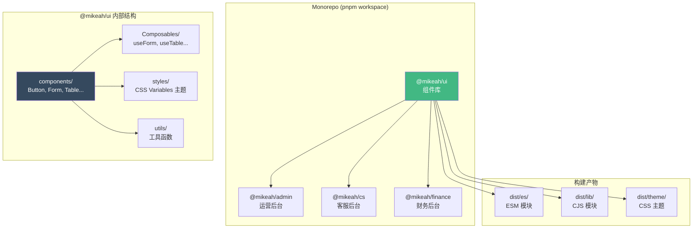

---

title: Vue3-组件库开发实战-自定义UI组件库设计与发布踩坑记录
keywords: [Vue3, UI, 组件库开发实战, 自定义, 组件库设计与发布踩坑记录]
cover: https://images.unsplash.com/photo-1627398242454-45a1465c2479?w=1200&h=630&fit=crop
images:
  - https://images.unsplash.com/photo-1627398242454-45a1465c2479?w=1200&h=630&fit=crop
date: 2026-05-17 04:06:20
updated: 2026-05-17 04:09:52
categories:
- frontend
tags:
- JavaScript
- TypeScript
- Vite
- Vue
description: Vue 3 组件库开发实战教程：从零搭建自定义 UI 组件库 @mikeah/ui 完整指南。涵盖 Monorepo 架构设计、Props/Slots/Events 组件设计模式、TypeScript 类型导出、CSS Variables 多主题切换、Vite Library Mode 构建配置、Vitest 单元测试、VitePress 文档站点搭建、npm 发布与版本管理、pnpm workspace 配置、Element Plus 集成及 CI/CD 自动化发布流程。基于 vue-pure-admin 二次开发的真实踩坑经验，前端工程师必备的组件库工程化实战指南。
---


## 前言

在我们的 B2C 电商后台项目中，前端基于 `vue-pure-admin` 二次开发。随着业务增长，多个子系统（运营后台、客服后台、财务后台）都用到了相同的表单组件、表格封装、日期选择器封装等。最初的做法是复制粘贴——结果一个 Bug 要修三个地方，样式调整更是噩梦。

于是我决定把通用组件抽成一个独立的组件库 `@mikeah/ui`，通过 Monorepo 管理，npm 私有仓库分发。这篇文章记录了从组件设计、构建、测试到发布的全过程，以及踩过的每一个坑。

<!-- more -->

## 架构总览



## 1. Monorepo 目录结构设计

```
packages/
├── ui/                        # @mikeah/ui 组件库
│   ├── src/
│   │   ├── components/
│   │   │   ├── Button/
│   │   │   │   ├── Button.vue
│   │   │   │   ├── Button.test.ts
│   │   │   │   └── index.ts
│   │   │   ├── Form/
│   │   │   └── Table/
│   │   ├── composables/
│   │   │   ├── useForm.ts
│   │   │   └── useTable.ts
│   │   ├── styles/
│   │   │   ├── variables.css
│   │   │   └── reset.css
│   │   ├── utils/
│   │   └── index.ts           # 统一导出
│   ├── package.json
│   ├── tsconfig.json
│   ├── vite.config.ts
│   └── vitest.config.ts
├── admin/                     # @mikeah/admin 运营后台
├── cs/                        # @mikeah/cs 客服后台
└── pnpm-workspace.yaml
```

`pnpm-workspace.yaml`：

```yaml
packages:
  - 'packages/*'
```

### ⚠️ 踩坑 1：pnpm 默认不 hoist 组件库的 peerDependencies

pnworkspace 的严格模式下，`packages/admin` 引用 `@mikeah/ui` 时，如果 `ui` 的 `peerDependencies` 声明了 `vue@^3.4`，pnpm 不会自动把根目录的 `vue` 链接过去。解决办法：

```yaml
# .npmrc
shamefully-hoist=true       # 简单粗暴但有效
# 或者更精细的控制：
public-hoist-pattern[]=vue
public-hoist-pattern[]=element-plus
```

## 2. 组件设计模式：Props + Slots + Events 三板斧

### Button 组件设计

```vue
<!-- src/components/Button/Button.vue -->
<script setup lang="ts">
import { computed } from 'vue'

export interface ButtonProps {
  type?: 'primary' | 'secondary' | 'danger' | 'ghost'
  size?: 'small' | 'medium' | 'large'
  loading?: boolean
  disabled?: boolean
  icon?: string
}

const props = withDefaults(defineProps<ButtonProps>(), {
  type: 'primary',
  size: 'medium',
  loading: false,
  disabled: false,
})

const emit = defineEmits<{
  click: [event: MouseEvent]
}>()

const cls = computed(() => [
  'mk-btn',
  `mk-btn--${props.type}`,
  `mk-btn--${props.size}`,
  {
    'is-loading': props.loading,
    'is-disabled': props.disabled,
  },
])

const handleClick = (e: MouseEvent) => {
  if (props.loading || props.disabled) return
  emit('click', e)
}
</script>

<template>
  <button :class="cls" :disabled="disabled || loading" @click="handleClick">
    <span v-if="loading" class="mk-btn__spinner" />
    <slot name="icon" />
    <span class="mk-btn__text">
      <slot />
    </span>
  </button>
</template>
```

### 组件导出模式

```ts
// src/components/Button/index.ts
export { default as MkButton } from './Button.vue'
export type { ButtonProps } from './Button.vue'
```

```ts
// src/index.ts — 统一导出入口
export * from './components/Button'
export * from './components/Form'
export * from './components/Table'
export * from './composables'
export * from './utils'
```

### ⚠️ 踩坑 2：Vue 3 的 defineEmits 类型导出问题

在 `vue@3.2.x` 时，`defineProps` 的类型接口无法直接被外部文件 `import`。直到 `vue@3.3+` 才支持 `defineProps` + `withDefaults` 的类型导出。如果你的项目还在 3.2，需要用独立的 `types.ts` 文件声明 Props 接口：

```ts
// 独立类型文件（vue@3.2 兼容）
// src/components/Button/types.ts
export interface ButtonProps {
  type?: 'primary' | 'secondary' | 'danger' | 'ghost'
  size?: 'small' | 'medium' | 'large'
  loading?: boolean
}
```

## 3. Composables 封装：useForm 和 useTable

组件库不只是 UI 组件，还需要提供业务逻辑层的复用。我们封装了 `useForm` 和 `useTable` 两个高频 composable：

```ts
// src/composables/useForm.ts
import { ref, reactive, computed, type Ref } from 'vue'
import type { FormInstance, FormRules } from 'element-plus'

interface UseFormOptions<T extends Record<string, any>> {
  initialValues: T
  rules?: FormRules
  onSubmit: (values: T) => Promise<void>
}

export function useForm<T extends Record<string, any>>(options: UseFormOptions<T>) {
  const formRef = ref<FormInstance>()
  const loading = ref(false)
  const formData = reactive<T>({ ...options.initialValues })

  const isValid = computed(() => {
    // 简单校验：所有必填字段非空
    return Object.keys(options.rules || {}).every(key => {
      const val = formData[key as keyof T]
      return val !== undefined && val !== null && val !== ''
    })
  })

  const resetForm = () => {
    Object.assign(formData, options.initialValues)
    formRef.value?.clearValidate()
  }

  const submitForm = async () => {
    try {
      await formRef.value?.validate()
      loading.value = true
      await options.onSubmit(formData as T)
    } catch (err) {
      console.error('[useForm] Validation failed:', err)
      throw err
    } finally {
      loading.value = false
    }
  }

  return {
    formRef,
    formData,
    loading,
    isValid,
    resetForm,
    submitForm,
  }
}
```

使用方式：

```vue
<script setup lang="ts">
import { useForm } from '@mikeah/ui'

const { formRef, formData, loading, submitForm } = useForm({
  initialValues: { name: '', email: '', phone: '' },
  rules: {
    name: [{ required: true, message: '请输入姓名' }],
    email: [{ required: true, type: 'email', message: '请输入邮箱' }],
  },
  onSubmit: async (values) => {
    await api.createUser(values)
  },
})
</script>
```

### ⚠️ 踩坑 3：reactive 对象的类型推断丢失

`reactive<T>({ ...initialValues })` 展开运算后，TypeScript 有时无法正确推断嵌套类型。解法是显式标注返回值类型，或者使用 `toRef` 逐字段声明。在复杂表单场景下，我最终选择了后者——虽然代码多一点，但 IDE 补全和类型检查全绿。

## 4. 主题系统：CSS Variables 方案

我们没有用 SCSS 变量（编译时），而是选择了 CSS Custom Properties（运行时），因为要支持**多主题切换**（浅色/深色/品牌色）：

```css
/* src/styles/variables.css */
:root {
  /* 品牌色 */
  --mk-color-primary: #42b883;
  --mk-color-primary-light: #64d69b;
  --mk-color-primary-dark: #2e8b5e;

  /* 功能色 */
  --mk-color-success: #67c23a;
  --mk-color-warning: #e6a23c;
  --mk-color-danger: #f56c6c;
  --mk-color-info: #909399;

  /* 中性色 */
  --mk-color-text-primary: #303133;
  --mk-color-text-regular: #606266;
  --mk-color-text-placeholder: #c0c4cc;
  --mk-color-border: #dcdfe6;
  --mk-color-bg: #ffffff;

  /* 间距 */
  --mk-spacing-xs: 4px;
  --mk-spacing-sm: 8px;
  --mk-spacing-md: 16px;
  --mk-spacing-lg: 24px;

  /* 圆角 */
  --mk-radius-sm: 4px;
  --mk-radius-md: 8px;
  --mk-radius-lg: 16px;
}

/* 深色主题 */
[data-theme='dark'] {
  --mk-color-text-primary: #e5eaf3;
  --mk-color-text-regular: #cfd3dc;
  --mk-color-bg: #1d1e1f;
  --mk-color-border: #4c4d4f;
}
```

组件中引用：

```css
.mk-btn--primary {
  background-color: var(--mk-color-primary);
  color: #fff;
  border-radius: var(--mk-radius-sm);
  padding: var(--mk-spacing-sm) var(--mk-spacing-md);
}
```

### ⚠️ 踩坑 4：CSS Variables 与 Element Plus 主题冲突

我们同时用了 Element Plus 的 CSS Variables（`--el-color-primary`），和自定义的 `--mk-color-primary`。如果两套变量不同步，会出现组件库用绿色、Element Plus 用蓝色的割裂感。解决办法：

```ts
// 主题同步函数
export function syncThemeWithElementPlus(vars: Record<string, string>) {
  const root = document.documentElement
  Object.entries(vars).forEach(([mkVar, elVar]) => {
    const value = getComputedStyle(root).getPropertyValue(mkVar)
    root.style.setProperty(elVar, value)
  })
}

// 调用
syncThemeWithElementPlus({
  '--mk-color-primary': '--el-color-primary',
  '--mk-color-danger': '--el-color-danger',
  '--mk-color-warning': '--el-color-warning',
})
```

## 5. Vite Library Mode 构建配置

```ts
// packages/ui/vite.config.ts
import { defineConfig } from 'vite'
import vue from '@vitejs/plugin-vue'
import dts from 'vite-plugin-dts'
import { resolve } from 'path'

export default defineConfig({
  plugins: [
    vue(),
    dts({
      insertTypesEntry: true,  // 自动生成 types 入口
      rollupTypes: true,       // 合并为单个 .d.ts
    }),
  ],
  build: {
    lib: {
      entry: resolve(__dirname, 'src/index.ts'),
      name: 'MikeahUI',
      formats: ['es', 'cjs'],
      fileName: (format) => `index.${format === 'es' ? 'mjs' : 'cjs'}`,
    },
    rollupOptions: {
      // 外部化依赖，不打包进产物
      external: ['vue', 'vue-router', 'element-plus', /^element-plus\/.*/],
      output: {
        globals: {
          vue: 'Vue',
          'element-plus': 'ElementPlus',
        },
        // CSS 单独输出
        assetFileNames: (assetInfo) => {
          if (assetInfo.name === 'style.css') return 'theme/index.css'
          return assetInfo.name as string
        },
      },
    },
    cssCodeSplit: false, // 所有 CSS 合并到一个文件
    sourcemap: true,
  },
})
```

### ⚠️ 踩坑 5：external 配置遗漏导致产物膨胀

第一版构建没把 `element-plus` 的子路径（`element-plus/es/components/form/style/css`）排除，产物从 50KB 暴涨到 2MB。**必须用正则** `external: ['vue', /^element-plus/]` 才能匹配所有子路径 import。

`package.json` 的关键字段：

```json
{
  "name": "@mikeah/ui",
  "version": "0.3.2",
  "type": "module",
  "main": "./dist/index.cjs",
  "module": "./dist/index.mjs",
  "types": "./dist/index.d.ts",
  "exports": {
    ".": {
      "import": "./dist/index.mjs",
      "require": "./dist/index.cjs",
      "types": "./dist/index.d.ts"
    },
    "./theme": "./dist/theme/index.css"
  },
  "files": ["dist"],
  "peerDependencies": {
    "vue": "^3.4.0",
    "element-plus": "^2.7.0"
  }
}
```

## 6. 测试策略：Vitest + Testing Library

```ts
// src/components/Button/Button.test.ts
import { describe, it, expect } from 'vitest'
import { mount } from '@vue/test-utils'
import MkButton from './Button.vue'

describe('MkButton', () => {
  it('renders slot content', () => {
    const wrapper = mount(MkButton, {
      slots: { default: '提交' },
    })
    expect(wrapper.text()).toContain('提交')
  })

  it('emits click event', async () => {
    const wrapper = mount(MkButton)
    await wrapper.find('button').trigger('click')
    expect(wrapper.emitted('click')).toHaveLength(1)
  })

  it('does not emit when loading', async () => {
    const wrapper = mount(MkButton, {
      props: { loading: true },
    })
    await wrapper.find('button').trigger('click')
    expect(wrapper.emitted('click')).toBeUndefined()
  })

  it('applies type class correctly', () => {
    const wrapper = mount(MkButton, {
      props: { type: 'danger' },
    })
    expect(wrapper.classes()).toContain('mk-btn--danger')
  })
})
```

运行测试：

```bash
cd packages/ui
pnpm vitest run --coverage
```

### ⚠️ 踩坑 6：vitest.config.ts 和 vite.config.ts 的 alias 冲突

组件库内部用了 `@/components/Button` 这种路径别名，但测试环境的 `vitest.config.ts` 没有同步配置 alias，导致测试直接报 `Cannot resolve module`。解决：让 vitest 继承 vite 的 resolve.alias：

```ts
// vitest.config.ts
import { defineConfig, mergeConfig } from 'vitest/config'
import viteConfig from './vite.config'

export default mergeConfig(viteConfig, defineConfig({
  test: {
    environment: 'jsdom',
    globals: true,
    coverage: {
      provider: 'v8',
      include: ['src/components/**/*.vue', 'src/composables/**/*.ts'],
    },
  },
}))
```

## 7. 文档站点：VitePress 驱动

```ts
// docs/.vitepress/config.ts
import { defineConfig } from 'vitepress'

export default defineConfig({
  title: '@mikeah/ui',
  description: 'Vue 3 自定义 UI 组件库',
  themeConfig: {
    nav: [
      { text: '指南', link: '/guide/' },
      { text: '组件', link: '/components/button' },
    ],
    sidebar: {
      '/components/': [
        {
          text: '基础组件',
          items: [
            { text: 'Button 按钮', link: '/components/button' },
            { text: 'Icon 图标', link: '/components/icon' },
          ],
        },
        {
          text: '表单组件',
          items: [
            { text: 'Form 表单', link: '/components/form' },
            { text: 'Table 表格', link: '/components/table' },
          ],
        },
      ],
    },
  },
})
```

文档中嵌入 Demo 的方式（使用 `vitepress-plugin-demo`）：

```md
## 基础用法

:::demo
Button/basic
:::

## 加载状态

:::demo
Button/loading
:::
```

## 8. 发布流程

### 版本管理

```bash
# 补丁版本（Bug 修复）
pnpm changeset          # 交互式创建变更集
pnpm changeset version  # 根据变更集更新版本号
pnpm changeset publish  # 发布到 npm

# 或者手动
cd packages/ui
npm version patch -m "fix: button loading 状态样式修复"
npm publish --access public  # 私有仓库去掉 --access
```

### ⚠️ 踩坑 7：npm publish 时 .npmignore 和 files 字段的取舍

最初用 `.npmignore` 排除 `src/`、`node_modules/` 等，但每次新增文件都要记得加规则。后来改用 `package.json` 的 `files` 字段**白名单**模式——只声明要发布的目录：

```json
{
  "files": ["dist"]
}
```

这样无论 `src/` 下新增什么测试文件、配置文件，都不会被误发布。

### CI/CD 自动发布

```yaml
# .github/workflows/publish.yml
name: Publish @mikeah/ui
on:
  push:
    tags:
      - '@mikeah/ui@*'

jobs:
  publish:
    runs-on: ubuntu-latest
    steps:
      - uses: actions/checkout@v4
      - uses: pnpm/action-setup@v4
      - uses: actions/setup-node@v4
        with:
          node-version: 20
          registry-url: https://registry.npmjs.org
      - run: pnpm install --frozen-lockfile
      - run: pnpm --filter @mikeah/ui build
      - run: pnpm --filter @mikeah/ui publish --no-git-checks
        env:
          NODE_AUTH_TOKEN: ${{ secrets.NPM_TOKEN }}
```

## 9. 完整构建产物结构

```
dist/
├── index.mjs           # ESM 入口
├── index.cjs           # CJS 入口
├── index.d.ts          # TypeScript 类型声明
├── theme/
│   └── index.css       # 所有组件样式合并
└── components/
    ├── Button/
    │   └── Button.vue  # SFC 原始文件（可选，供 Tree-shaking）
    └── ...
```

## 总结：关键决策与踩坑清单

| 决策点 | 选择 | 理由 |
|--------|------|------|
| 包管理器 | pnpm workspace | 磁盘效率高，严格依赖隔离 |
| 构建工具 | Vite Library Mode | 原生 ESM、速度快、配置简单 |
| 类型导出 | vite-plugin-dts | 自动扫描 SFC props 生成 .d.ts |
| 主题方案 | CSS Variables | 运行时切换，无需重编译 |
| 测试框架 | Vitest + @vue/test-utils | 与 Vite 同构，速度快 |
| 文档 | VitePress | Vue 生态标配，Markdown 驱动 |
| 发布 | Changesets | 变更集驱动版本号，monorepo 友好 |

**七条核心踩坑经验**：

1. **pnpm 严格模式** 下要配置 `shamefully-hoist` 或精确的 `public-hoist-pattern`
2. **Vue 3.2 的 defineProps 类型不可导出**，必须用独立 types 文件
3. **reactive 展开后的类型推断丢失**，复杂场景用 toRef 逐字段声明
4. **自定义 CSS Variables 要与 Element Plus 同步**，否则主题割裂
5. **Rollup external 必须用正则** 匹配子路径，否则产物膨胀
6. **Vitest 的 resolve.alias 要继承 vite.config.ts**，否则路径解析失败
7. **用 files 白名单替代 .npmignore**，避免新文件误发布

组件库开发看似是「写几个组件」，实际涉及构建工程、类型系统、主题设计、测试策略、文档规范、版本管理六大维度。建议从小做起——先封装 3-5 个最高频组件，验证发布流程跑通后，再逐步扩充。

## 相关阅读

- [Vue 3 TypeScript 实战：类型安全的前端开发与真实踩坑记录](/categories/Frontend/vue-3-typescript-guide/)
- [Vite vs Webpack vs Laravel Mix：前端构建工具选型对比实战](/categories/Frontend/vite-vs-webpack-laravel-mix-vs/)
- [Nuxt 4 实战：Vue 全栈框架的新范式——服务器组件、自动导入与 SEO 优化](/categories/Frontend/2026-06-02-nuxt-4-vue-fullstack-server-components-auto-import-seo/)

---

> **系列文章关联阅读**：
> - [Vue 3 Composition API 实战](/HTML/Vue-3-Composition-API-实战-ref-reactive-computed-最佳实践与响应式踩坑记录/)
> - [Vite 6.x 实战：插件开发、SSR、构建优化](/HTML/Vite-6.x-实战-插件开发SSR构建优化-前端工程化踩坑记录/)
> - [pnpm 实战：高效磁盘空间利用与 Workspace Monorepo](/09_macOS/pnpm-实战-高效磁盘空间利用与-Workspace-Monorepo-包管理踩坑记录/)
