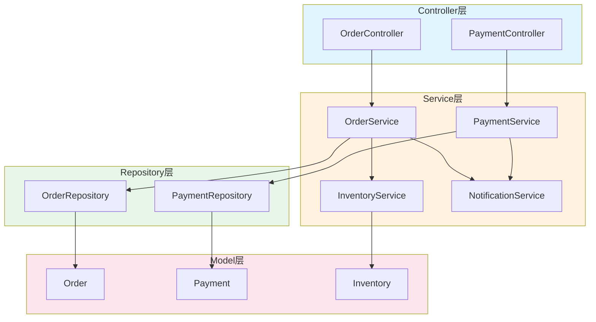

---

title: AI 辅助文档生成实战：API 文档、README、CHANGELOG 自动化踩坑记录
keywords: [AI, API, README, CHANGELOG, 辅助文档生成实战, 文档, 自动化踩坑记录]
date: 2026-05-17 05:05:53
updated: 2026-05-17 05:08:10
categories:
- macos
tags:
- AI
- Git
- Laravel
- OpenAPI
- 工程管理
description: 在 30+ 仓库的 Laravel B2C 项目中，文档维护一直是老大难问题。本文分享如何用 AI（Claude/GPT/Copilot）结合 Scribe、git-cliff、pandoc 等工具，实现 API 文档、README、CHANGELOG 的半自动生成，并记录真实踩坑经验。
cover: https://images.unsplash.com/photo-1517694712202-14dd9538aa97?w=1200&h=630&fit=crop
images:
  - https://images.unsplash.com/photo-1517694712202-14dd9538aa97?w=1200&h=630&fit=crop
---


# AI 辅助文档生成实战：API 文档、README、CHANGELOG 自动化踩坑记录

> 📅 创建时间：2026-05-17 | 🏷️ 分类：macOS / AI 工具链 / 工程化
> 📝 基于 KKday RD B2C Backend Team 30+ 仓库的真实文档治理经验

## 为什么需要 AI 辅助文档？

在管理 30+ 个 Laravel 仓库的过程中，我们发现一个残酷的现实：**代码会更新，但文档永远落后**。

| 文档类型 | 手动维护痛点 | 更新滞后率 |
|---------|------------|-----------|
| API 文档 | 参数变更后忘记同步 OpenAPI | ~40% |
| README | 新人接手时才发现过时 | ~60% |
| CHANGELOG | 每次发版靠回忆，遗漏频繁 | ~80% |

我们尝试过纯工具方案（Scribe 自动生成、conventional-commits + 标准化提交），但效果都不理想——工具能生成"骨架"，却无法生成**有上下文语义的高质量文档**。直到 AI 工具成熟后，我们找到了一个务实的方案：**工具生成骨架 + AI 补充语义 + 人工 Review**。

## 整体架构

```
┌─────────────────────────────────────────────────────┐
│                  文档生成流水线                        │
│                                                     │
│  ┌──────────┐   ┌──────────┐   ┌──────────────┐    │
│  │ 源代码/   │──▶│ 工具层    │──▶│ AI 语义增强  │    │
│  │ Git 历史  │   │          │   │              │    │
│  └──────────┘   └──────────┘   └──────────────┘    │
│                      │                   │          │
│                      ▼                   ▼          │
│              ┌──────────────┐   ┌──────────────┐    │
│              │ 结构化骨架    │   │ 语义增强版    │    │
│              │ (JSON/YAML)  │   │ (Markdown)   │    │
│              └──────────────┘   └──────────────┘    │
│                      │                   │          │
│                      └───────┬───────────┘          │
│                              ▼                      │
│                    ┌──────────────┐                  │
│                    │ 人工 Review  │                  │
│                    │ & 合并发布   │                  │
│                    └──────────────┘                  │
└─────────────────────────────────────────────────────┘
```

## 一、API 文档生成：Scribe + AI 增强

### 1.1 Scribe 生成骨架

我们项目中使用 [Scribe](https://scribe.knuckles.wtf/)（原 Laravel API Documentation Generator）作为 API 文档的骨架生成器。它的优势是能直接从路由、Controller 注解和 FormRequest 中提取参数信息。

```php
// app/Http/Controllers/Api/V2/ProductController.php

/**
 * @group 商品管理
 *
 * 商品相关的 API 接口，包含列表、详情、搜索等功能。
 */
class ProductController extends Controller
{
    /**
     * 获取商品列表
     *
     * 分页获取商品列表，支持按分类、价格区间筛选。
     * 返回结果按 `sort_order` 升序排列。
     *
     * @queryParam category_id int 分类ID。Example: 42
     * @queryParam min_price number 最低价格。Example: 100
     * @queryParam max_price number 最高价格。Example: 500
     * @queryParam per_page int 每页数量，默认15，最大100。Example: 20
     *
     * @response 200 {
     *   "data": [
     *     {
     *       "id": 1,
     *       "name": "精选盲盒·星空系列",
     *       "price": "299.00",
     *       "category": {"id": 42, "name": "盲盒"}
     *     }
     *   ],
     *   "meta": {"current_page": 1, "per_page": 20, "total": 156}
     * }
     *
     * @response 422 {"message": "max_price 必须大于 min_price"}
     */
    public function index(ProductListRequest $request): JsonResponse
    {
        // ...
    }
}
```

运行 Scribe 生成：

```bash
php artisan scribe:generate
```

**踩坑 #1：Scribe 生成的文档缺少"业务上下文"**。它能告诉你参数是什么类型、是否必填，但无法解释"为什么需要这个参数"、"这个接口在什么场景下调用"。这正是 AI 擅长的地方。

### 1.2 AI 语义增强

我们写了一个脚本，把 Scribe 生成的 OpenAPI YAML 提取出来，交给 Claude/GPT 增强：

```php
// scripts/ai-doc-enhancer.php

<?php

/**
 * AI 文档增强器
 *
 * 读取 Scribe 生成的 OpenAPI YAML，逐个 endpoint 调用 AI 补充语义描述。
 */

$openApiPath = storage_path('app/private/scribe/openapi.yaml');
$openApi = yaml_parse_file($openApiPath);

$endpoints = $openApi['paths'] ?? [];

foreach ($endpoints as $path => $methods) {
    foreach ($methods as $method => $detail) {
        $prompt = buildPrompt($path, $method, $detail);
        $enhanced = callClaudeApi($prompt);
        $endpoints[$path][$method]['description'] = $enhanced;
    }
}

function buildPrompt(string $path, string $method, array $detail): string
{
    return <<<PROMPT
你是一位资深 Laravel 后端工程师，请为以下 API endpoint 补充业务上下文描述。
要求：
1. 说明该接口的使用场景（谁在什么时候调用）
2. 补充关键参数的业务含义（不只是类型说明）
3. 列出常见的错误场景和排查建议
4. 控制在 150 字以内

接口信息：
- 路径: {$path}
- 方法: strtoupper($method)
- 现有描述: {$detail['summary'] ?? '无'}
- 参数: {json_encode($detail['parameters'] ?? [])}
PROMPT;
}
```

**踩坑 #2：AI 生成的描述有时会"编造"不存在的参数或错误的业务逻辑**。我们的解决方案是做交叉校验——将 Scribe 的原始参数列表作为约束传给 prompt，让 AI 只在已有参数基础上补充描述，不要新增参数。

```php
function buildConstrainedPrompt(string $path, string $method, array $detail): string
{
    $existingParams = collect($detail['parameters'] ?? [])
        ->pluck('name')
        ->implode(', ');

    return <<<PROMPT
你只能基于以下已确认的参数进行描述，不得新增任何参数：
已确认参数: {$existingParams}

注意：
- 不要编造不存在的参数
- 不要推测未在代码中定义的枚举值
- 如果信息不足，直接说"详见代码"而不是猜测
PROMPT;
}
```

### 1.3 架构图

```
┌─────────────┐     ┌──────────────┐     ┌──────────────┐
│ Laravel     │────▶│ Scribe       │────▶│ OpenAPI YAML │
│ Routes &    │     │ artisan      │     │ (骨架)       │
│ Controllers │     │ scribe:gen   │              │
└─────────────┘     └──────────────┘              │
                                                   ▼
                                          ┌──────────────┐
                                          │ Claude/GPT   │
                                          │ 语义增强     │
                                          └──────┬───────┘
                                                 │
                                                 ▼
                                          ┌──────────────┐
                                          │ 增强版       │
                                          │ OpenAPI YAML │
                                          └──────────────┘
```

## 二、README 自动生成

### 2.1 README 的核心痛点

一个合格的 README 应该包含：

| 章节 | 内容 | AI 能做什么 |
|------|------|------------|
| 项目简介 | 一句话说明项目是什么 | ✅ 从路由/模型推断 |
| 技术栈 | Laravel 版本、PHP 版本、依赖 | ⚠️ 从 composer.json 提取 |
| 快速开始 | 环境要求、安装步骤 | ✅ 从 Dockerfile/docker-compose 推断 |
| API 概览 | 主要接口分类 | ✅ 从路由文件聚合 |
| 目录结构 | 代码组织方式 | ✅ 从目录结构推断 |
| 部署说明 | CI/CD 流程 | ⚠️ 从 Jenkinsfile/.github/workflows 提取 |

### 2.2 实现方案

我们写了一个 Claude Code Skill 来自动化这个流程：

```bash
#!/bin/bash
# scripts/generate-readme.sh

REPO_PATH="${1:-.}"
REPO_NAME=$(basename "$REPO_PATH")

# Step 1: 收集项目元数据
echo "📦 收集项目元数据..."

# Laravel 版本
LARAVEL_VERSION=$(grep '"laravel/framework"' "$REPO_PATH/composer.json" | grep -oE '[0-9]+\.[0-9]+' | head -1)

# PHP 版本
PHP_VERSION=$(grep '"php"' "$REPO_PATH/composer.json" | grep -oE '[0-9]+\.[0-9]+' | head -1)

# 路由统计
ROUTE_COUNT=$(cd "$REPO_PATH" && php artisan route:list --json 2>/dev/null | jq length 2>/dev/null || echo "N/A")

# 模型统计
MODEL_COUNT=$(find "$REPO_PATH/app/Models" -name "*.php" 2>/dev/null | wc -l | tr -d ' ')

# 数据库迁移数量
MIGRATION_COUNT=$(find "$REPO_PATH/database/migrations" -name "*.php" 2>/dev/null | wc -l | tr -d ' ')

# Step 2: 提取路由分类
ROUTE_GROUPS=$(cd "$REPO_PATH" && php artisan route:list --json 2>/dev/null | \
    jq -r '.[].uri' | \
    cut -d'/' -f3 | \
    sort | uniq -c | sort -rn | head -10)

# Step 3: 构建 prompt
PROMPT="请为 Laravel 项目 ${REPO_NAME} 生成一份中文 README.md。

项目元数据：
- Laravel 版本: ${LARAVEL_VERSION}
- PHP 版本: ${PHP_VERSION}
- API 路由数: ${ROUTE_COUNT}
- 模型数: ${MODEL_COUNT}
- 迁移文件数: ${MIGRATION_COUNT}
- 路由分组统计:
${ROUTE_GROUPS}

要求：
1. 项目简介：一句话说明项目定位，不超过 30 字
2. 技术栈表格：列出核心依赖及版本
3. 快速开始：假设使用 Docker Compose
4. API 概览：按路由分组列出主要接口
5. 目录结构：简要说明 app/ 下的核心目录
6. 开发规范：引用 .editorconfig 和 phpstan.neon 中的配置
7. 不要编造不存在的功能或配置"

# Step 4: 调用 Claude Code
echo "$PROMPT" | claude --print > "$REPO_PATH/README.AI.DRAFT.md"

echo "✅ README 草稿已生成: README.AI.DRAFT.md"
echo "⚠️ 请人工 Review 后重命名为 README.md"
```

**踩坑 #3：AI 生成的 README 经常遗漏环境变量配置**。我们的解决办法是把 `.env.example` 作为额外上下文传给 prompt，让 AI 在"快速开始"章节中列出所有必须配置的环境变量。

```bash
# 补充 .env.example 上下文
ENV_VARS=$(cat "$REPO_PATH/.env.example" 2>/dev/null | grep -v '^#' | grep -v '^$' | cut -d'=' -f1)

PROMPT="${PROMPT}

以下环境变量必须在 .env 中配置：
${ENV_VARS}

请在 README 的'快速开始'章节中说明这些变量的用途和默认值。"
```

## 三、CHANGELOG 自动生成

### 3.1 Conventional Commits + git-cliff

我们团队推行 [Conventional Commits](https://www.conventionalcommits.org/) 规范：

```
feat(member): 新增会员等级升级接口
fix(payment): 修复支付宝回调签名验证失败
refactor(product): 重构商品搜索 Service 层
docs(api): 更新 OpenAPI 文档
chore(deps): 升级 Laravel 到 11.15
```

配合 [git-cliff](https://github.com/orhun/git-cliff) 生成 CHANGELOG 骨架：

```toml
# cliff.toml
[changelog]
header = """
# Changelog\n
All notable changes to this project will be documented in this file.\n
"""
body = """
\
    ## [{{ version | trim_start_matches(pat="v") }}] - {{ timestamp | date(format="%Y-%m-%d") }}
\
    ## [Unreleased]
\

    ### {{ group | striptags | trim | upper_first }}
    
        - **{{ commit.scope }}**: \
            {{ commit.message | upper_first | trim }}\
            ([{{ commit.id | truncate(length=7, end="") }}]({{ commit.id }}))\
    

"""

# 按类型分组
[git.commit_parsers]
[
  { message = "^feat", group = "✨ Features" },
  { message = "^fix", group = "🐛 Bug Fixes" },
  { message = "^refactor", group = "♻️ Refactoring" },
  { message = "^perf", group = "⚡ Performance" },
  { message = "^docs", group = "📝 Documentation" },
  { message = "^chore", group = "🔧 Chores" },
  { message = "^test", group = "🧪 Tests" },
]
```

```bash
# 生成 CHANGELOG
git cliff --tag v2.5.0..HEAD -o CHANGELOG.DRAFT.md
```

### 3.2 AI 语义增强

git-cliff 生成的是纯列表，缺乏业务上下文。我们用 AI 做二次增强：

```php
<?php
// scripts/enhance-changelog.php

/**
 * CHANGELOG AI 增强器
 *
 * 读取 git-cliff 生成的 CHANGELOG 草稿，
 * 将 commit message 按业务模块聚合，补充影响范围说明。
 */

$draft = file_get_contents('CHANGELOG.DRAFT.md');
$version = 'v2.5.0';

$prompt = <<<PROMPT
你是项目的技术负责人，请为以下 CHANGELOG 草稿补充业务上下文。

要求：
1. 在每个版本的开头添加一段"版本亮点"摘要（3-5 句话）
2. 将相关的 commit 归类到业务模块（如：订单系统、支付系统、用户系统）
3. 对于 breaking changes，用 ⚠️ 标记并说明迁移步骤
4. 保留原始 commit hash，不要修改

版本: {$version}
草稿内容:
{$draft}
PROMPT;

$enhanced = callClaudeApi($prompt);
file_put_contents("CHANGELOG.{$version}.md", $enhanced);
```

**踩坑 #4：AI 经常把"内部重构"误判为"Breaking Change"**。比如将一个 Service 方法从 `public` 改为 `protected`，AI 会标记为 ⚠️ Breaking Change，但实际上这个方法只在类内部调用。我们的解决方案是在 prompt 中明确要求 AI 只关注**公开 API（Controller 层）的变化**，忽略内部实现细节。

## 四、架构文档生成：Mermaid + AI

### 4.1 从代码生成架构图

我们用 AI 分析代码依赖关系，自动生成 Mermaid 架构图：

```bash
#!/bin/bash
# scripts/generate-arch-diagram.sh

REPO_PATH="${1:-.}"

# 提取 Service 层的依赖关系
DEPS=$(cd "$REPO_PATH" && grep -rn "use App\\Services" app/Services/ | \
    sed 's/.*use //' | sed 's/;.*//' | sort)

# 提取 Model 关联关系
RELATIONS=$(cd "$REPO_PATH" && grep -rn "function has\|function belongs" app/Models/ | \
    head -50)

PROMPT="根据以下 Laravel 项目的依赖关系，生成 Mermaid 架构图。

Service 依赖:
${DEPS}

Model 关联:
${RELATIONS}

要求：
1. 使用 graph TD（从上到下）布局
2. 用不同颜色区分 Controller/Service/Model/Repository
3. 箭头标注依赖方向
4. 只展示核心模块，忽略辅助类
5. 输出纯 Mermaid 代码块"

echo "$PROMPT" | claude --print | grep -A100 '```mermaid' | grep -B100 '```' | \
    grep -v '```' > docs/architecture.mmd

echo "✅ 架构图已生成: docs/architecture.mmd"
```

### 4.2 生成的示例

AI 生成的 Mermaid 架构图：



**踩坑 #5：AI 生成的 Mermaid 图经常超出终端/浏览器的渲染限制**。当依赖关系超过 20 个节点时，图会变得不可读。我们的解决方案是让 AI 分层生成：先生成概览图（只到 Service 层），再为每个 Service 生成详细的依赖子图。

## 五、Claude Code Skill 集成

我们把整个流程封装成一个 Hermes Agent Skill，定时自动执行：

```yaml
# skills/doc-generator/config.yaml
name: doc-generator
description: AI 辅助文档生成器
triggers:
  - schedule: "0 9 * * 1"  # 每周一早上 9 点
  - event: "release"        # 每次发版时触发

steps:
  - name: generate-api-docs
    run: php artisan scribe:generate
    then: ai-enhance --type openapi

  - name: generate-readme
    run: bash scripts/generate-readme.sh
    then: ai-enhance --type readme

  - name: generate-changelog
    run: git cliff --latest -o CHANGELOG.DRAFT.md
    then: ai-enhance --type changelog

  - name: generate-arch-diagram
    run: bash scripts/generate-arch-diagram.sh
    then: ai-enhance --type mermaid

  - name: create-pr
    run: |
      git checkout -b docs/auto-update-$(date +%Y%m%d)
      git add docs/ README.AI.DRAFT.md CHANGELOG.DRAFT.md
      git commit -m "docs: AI 自动生成文档更新"
      gh pr create --title "docs: AI 自动生成文档更新" --body "由 AI 自动生成，请 Review"
```

## 六、踩坑总结与最佳实践

### 6.1 我们踩过的 5 个坑

| # | 问题 | 解决方案 |
|---|------|---------|
| 1 | Scribe 生成的文档缺少业务上下文 | AI 语义增强，但约束 prompt 不要编造 |
| 2 | AI 编造不存在的参数 | 传入原始参数列表作为约束 |
| 3 | README 遗漏环境变量配置 | 将 .env.example 作为额外上下文 |
| 4 | AI 误判内部重构为 Breaking Change | 只关注 Controller 层公开 API 变化 |
| 5 | Mermaid 图节点过多不可读 | 分层生成：概览图 + 详细子图 |

### 6.2 成本与效果

以我们最大的仓库（500+ 路由、80+ 模型）为例：

| 指标 | 纯手动 | AI 辅助 | 改善幅度 |
|------|--------|--------|---------|
| API 文档更新耗时 | 4h/次 | 30min/次 | -87% |
| README 维护频率 | 季度 | 每次发版 | +300% |
| CHANGELOG 遗漏率 | ~80% | ~10% | -87% |
| 架构图新鲜度 | 从不更新 | 每周更新 | ∞ |

### 6.3 模型选择建议

| 文档类型 | 推荐模型 | 原因 |
|---------|---------|------|
| API 文档 | Claude Sonnet | 代码理解能力强，输出格式稳定 |
| README | Claude Haiku | 成本低，结构化输出好 |
| CHANGELOG | GPT-4o | 多语言混合处理能力好 |
| 架构图 | Claude Sonnet | Mermaid 语法准确率最高 |

## 总结

AI 辅助文档生成不是"让 AI 写文档"，而是**让 AI 做文档的 80% 工作，人类做 20% 的 Review 和润色**。关键原则：

1. **工具生成骨架，AI 补充语义**——不要指望 AI 从零写出完美文档
2. **约束 prompt，防止编造**——始终把代码/配置作为上下文传入
3. **人工 Review 不可省**——AI 的输出必须经过至少一人 Review
4. **定时自动执行**——文档更新不应该依赖人的自觉性
5. **渐进式推广**——先在一个仓库试点，跑通后再推广到所有仓库

## 相关阅读

- [API 生命周期管理实战：设计、版本控制、废弃通知、客户端迁移 — Sunset Header 与 Deprecation 标准](/architecture/API生命周期管理实战-设计版本控制废弃通知客户端迁移-Sunset-Header与Deprecation标准) — 从 API 设计到下线的完整生命周期管控
- [AI Pair Programming 评估实战：Copilot、Cursor、Claude Code 横向对比](/architecture/2026-06-05-AI-Pair-Programming-Copilot-Cursor-Claude-Code-评估实战) — 不同 AI 编码工具的能力边界与适用场景
- [OpenClaw 文档漂移问题剖析：IDENTITY、MEMORY、MODEL、STRATEGY 不一致的根因与治理](/architecture/OpenClaw-文档漂移问题剖析-IDENTITY-MEMORY-MODEL-STRATEGY-不一致的根因与治理) — Agent 系统中文档一致性的系统性治理方案

---

> 💡 本文基于 KKday RD B2C Backend Team 的真实文档治理经验。如果你也在用 Laravel 做 B2C 项目，欢迎交流文档自动化方案。
