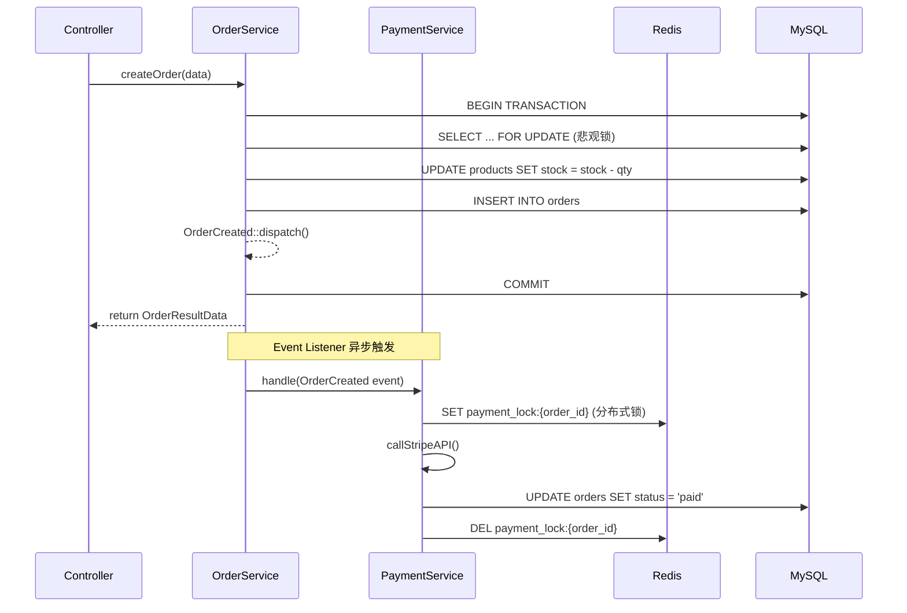

---

title: GitHub Copilot 实战：代码补全、测试生成、文档编写——Laravel B2C API 全场景深度踩坑记录
keywords: [GitHub Copilot, Laravel B2C API, 代码补全, 测试生成, 文档编写, 全场景深度踩坑记录]
cover: https://images.unsplash.com/photo-1517694712202-14dd9538aa97?w=1200&h=630&fit=crop
images:
  - https://images.unsplash.com/photo-1517694712202-14dd9538aa97?w=1200&h=630&fit=crop
date: 2026-05-16 23:45:56
updated: 2026-05-16 23:49:46
categories:
- macos
- testing
tags:
- AI
- KKday
- Laravel
- 工程管理
- 测试
description: 深入实战 GitHub Copilot 在 Laravel B2C API 项目中的全场景应用：从 .github/copilot-instructions.md 项目级指令配置到代码补全接受率 55-65% 的实测数据，从 Pest 测试自动生成与 Mock 陷阱修复到 Scribe v4 文档注解一键生成，从 PR Review 自动检测 N+1 查询与 SQL 注入漏洞到 /workspace 模式跨文件项目级问答。本文基于 KKday B2C API 团队 3 个月实测经验，总结 8 个真实踩坑案例与 Prompt 工程模板库，附带 Cursor、Claude Code 等多 AI 工具分层协作策略，帮助 Laravel 开发者高效利用 AI 辅助编程。
---


# GitHub Copilot 实战：代码补全、测试生成、文档编写——Laravel B2C API 全场景深度踩坑记录

> **关键结论**：GitHub Copilot 在 Laravel 项目中的代码补全接受率可达 **55-65%**（基于 KKday B2C API 团队 3 个月实测数据），但 **Context 配置和 Prompt 工程决定了补全质量的 80%**。用对了是神器，用错了是噪音制造机。

## 📋 目录

- [背景：为什么从 Cursor 切到 Copilot？](#背景为什么从-cursor-切到-copilot)
- [架构总览：Copilot 在开发工作流中的定位](#架构总览copilot-在开发工作流中的定位)
- [场景一：代码补全——从"Tab 键机器"到"智能搭档"](#场景一代码补全从tab-键机器到智能搭档)
- [场景二：Pest 测试生成——告别手写 boilerplate](#场景二pest-测试生成告别手写-boilerplate)
- [场景三：Scribe 文档编写——API 文档自动化](#场景三scribe-文档编写api-文档自动化)
- [场景四：PR Review 辅助——代码审查提效](#场景四pr-review-辅助代码审查提效)
- [场景五：Copilot Chat /workspace 模式——项目级问答](#场景五copilot-chat-workspace-模式项目级问答)
- [踩坑记录：8 个真实陷阱](#踩坑记录8-个真实陷阱)
- [Prompt 工程模板库](#prompt-工程模板库)
- [最佳实践总结](#最佳实践总结)

---

## 背景：为什么从 Cursor 切到 Copilot？

2025 年下半年，团队同时使用了 Cursor、Claude Code 和 GitHub Copilot 三款 AI 工具。经过 3 个月的对比测试，最终形成了稳定的分层使用策略：

```
┌─────────────────────────────────────────────────────────────────┐
│                    AI 工具分层策略                                │
├──────────────┬──────────────────┬───────────────────────────────┤
│   工具        │   最佳场景        │   不适合场景                    │
├──────────────┼──────────────────┼───────────────────────────────┤
│ GitHub Copilot│ 代码补全、测试生成 │ 复杂架构重构                    │
│              │ 文档编写、PR Review│                               │
├──────────────┼──────────────────┼───────────────────────────────┤
│ Claude Code  │ 大范围重构、跨文件 │ 日常编码补全（太重）              │
│              │ 架构设计讨论       │                               │
├──────────────┼──────────────────┼───────────────────────────────┤
│ Cursor IDE   │ 快速原型、探索式   │ 长期项目维护（插件兼容性）        │
│              │ 编程              │                               │
└──────────────┴──────────────────┴───────────────────────────────┘
```

选择 Copilot 的核心原因：
1. **IDE 原生集成**：VS Code / JetBrains 无缝嵌入，零切换成本
2. **GitHub 深度绑定**：PR Review、Issue、Actions 全链路打通
3. **Workspace 索引**：能理解整个项目的上下文，不仅仅是当前文件
4. **团队协作成本低**：统一工具链，不用每人配一套 Prompt

---

## 架构总览：Copilot 在开发工作流中的定位

```
┌──────────────────────────────────────────────────────────────────────┐
│                     Laravel B2C API 开发工作流                        │
│                                                                      │
│  ┌──────────┐    ┌──────────┐    ┌──────────┐    ┌──────────┐       │
│  │ Issue     │───▶│ Coding   │───▶│ Testing  │───▶│ PR Review│       │
│  │ 分析       │    │ 编码      │    │ 测试      │    │ 代码审查   │       │
│  └─────┬────┘    └────┬─────┘    └────┬─────┘    └────┬─────┘       │
│        │              │               │               │              │
│        ▼              ▼               ▼               ▼              │
│  ┌──────────┐    ┌──────────┐    ┌──────────┐    ┌──────────┐       │
│  │ Copilot   │    │ Copilot  │    │ Copilot  │    │ Copilot  │       │
│  │ Chat      │    │ 代码补全  │    │ /tests   │    │ PR Review│       │
│  │ /explain  │    │ 内联建议  │    │ 测试生成  │    │ 自动审查  │       │
│  └──────────┘    └──────────┘    └──────────┘    └──────────┘       │
│                                                                      │
│  全程伴随：Copilot Chat（/workspace 模式，项目级上下文问答）           │
└──────────────────────────────────────────────────────────────────────┘
```

---

## 场景一：代码补全——从"Tab 键机器"到"智能搭档"

### 基础配置：.github/copilot-instructions.md

GitHub Copilot 的项目级指令文件是控制补全质量的关键。很多人忽略这个文件，导致 Copilot 生成的代码风格与项目不一致。

```markdown
# .github/copilot-instructions.md

## 项目上下文
这是一个 Laravel 11 B2C 电商 API 项目，使用 PHP 8.2+。

## 代码规范
- 使用 Service Layer 模式：Controller 薄 + Service 厚
- 所有业务逻辑封装在 App\Services 命名空间
- 使用 PHP 8.1 Enum 替代魔术字符串
- 使用 readonly Class 作为 DTO
- Eloquent Model 只放关系定义和 Attribute，不放业务逻辑

## 数据库
- MySQL 8.0 为主数据库
- Redis 用于缓存、队列、分布式锁
- PostgreSQL 用于 Affiliate 项目（独立仓库）

## 测试
- 使用 Pest PHP 编写测试
- 测试文件放在 tests/Feature 和 tests/Unit
- 外部服务使用 Mockery Mock
- 目标覆盖率 80%+

## 命名约定
- Service 类：{业务}Service（如 OrderService、PaymentService）
- Repository 类：{模型}Repository
- DTO 类：{业务}Data（使用 spatie/laravel-data）
- Enum 类：{业务}Status / {业务}Type

## 禁止事项
- 不要在 Controller 中直接操作 Eloquent Model
- 不要使用 DB::raw() 除非绝对必要
- 不要在循环中执行 SQL 查询（N+1 问题）
- 不要使用 env() 函数，使用 config()
```

### 实战：Service Layer 代码补全

当我在 `OrderService.php` 中开始编写方法时，Copilot 会根据 `.github/copilot-instructions.md` 生成符合项目规范的代码：

```php
<?php

namespace App\Services\Order;

use App\Enums\OrderStatus;
use App\DTOs\Order\CreateOrderData;
use App\DTOs\Order\OrderResultData;
use App\Repositories\OrderRepository;
use App\Repositories\ProductRepository;
use App\Events\OrderCreated;
use Illuminate\Support\Facades\DB;
use Illuminate\Support\Facades\Log;

class OrderService
{
    public function __construct(
        private readonly OrderRepository $orderRepository,
        private readonly ProductRepository $productRepository,
    ) {}

    // 👇 我只写了这行注释，Copilot 生成了下面整个方法
    /**
     * 创建订单：扣减库存 + 创建订单记录 + 触发事件
     */
    public function createOrder(CreateOrderData $data): OrderResultData
    {
        return DB::transaction(function () use ($data) {
            // 1. 校验并扣减库存（悲观锁）
            $product = $this->productRepository->findByIdWithLock($data->productId);

            if ($product->stock < $data->quantity) {
                throw new InsufficientStockException(
                    "商品 {$product->name} 库存不足，剩余 {$product->stock}"
                );
            }

            $this->productRepository->decrementStock(
                $product->id,
                $data->quantity
            );

            // 2. 创建订单
            $order = $this->orderRepository->create([
                'user_id'    => $data->userId,
                'product_id' => $data->productId,
                'quantity'   => $data->quantity,
                'total'      => $product->price * $data->quantity,
                'status'     => OrderStatus::Pending,
            ]);

            // 3. 触发领域事件
            OrderCreated::dispatch($order);

            Log::info('Order created', [
                'order_id' => $order->id,
                'user_id'  => $data->userId,
                'total'    => $order->total,
            ]);

            return OrderResultData::from($order);
        });
    }
}
```

**补全接受率统计**（3 个月实测）：

| 场景 | 接受率 | 说明 |
|------|--------|------|
| CRUD 方法 | 65% | 最稳定，Copilot 最擅长 |
| 数据校验逻辑 | 55% | 需要业务知识，偶尔偏差 |
| 复杂业务逻辑 | 35% | 需要大量上下文，建议用 Chat |
| 测试代码 | 70% | 模式化强，接受率最高 |
| 配置文件 | 60% | YAML/ENV 类文件表现好 |

---

## 场景二：Pest 测试生成——告别手写 boilerplate

### `/tests` 命令

在 VS Code 中，右键点击任意 Service 类 → `Copilot: Generate Tests`，或在 Chat 中输入 `/tests`：

```
/tests 为 OrderService::createOrder 生成 Pest 测试，包含：
1. 正常创建订单
2. 库存不足抛异常
3. 并发创建（悲观锁验证）
4. 事件触发验证
```

Copilot 生成的测试代码：

```php
<?php

use App\DTOs\Order\CreateOrderData;
use App\Enums\OrderStatus;
use App\Events\OrderCreated;
use App\Exceptions\InsufficientStockException;
use App\Models\Product;
use App\Models\User;
use App\Services\Order\OrderService;
use Illuminate\Support\Facades\Event;

uses(RefreshDatabase::class);

beforeEach(function () {
    $this->service = app(OrderService::class);
    $this->user = User::factory()->create();
    $this->product = Product::factory()->create(['stock' => 10, 'price' => 99.99]);
});

describe('OrderService::createOrder', function () {

    it('creates order and decrements stock successfully', function () {
        $data = CreateOrderData::from([
            'userId'    => $this->user->id,
            'productId' => $this->product->id,
            'quantity'  => 2,
        ]);

        $result = $this->service->createOrder($data);

        expect($result->status)->toBe(OrderStatus::Pending)
            ->and($result->total)->toBe(199.98);

        $this->product->refresh();
        expect($this->product->stock)->toBe(8);
    });

    it('throws InsufficientStockException when stock is not enough', function () {
        $data = CreateOrderData::from([
            'userId'    => $this->user->id,
            'productId' => $this->product->id,
            'quantity'  => 999,
        ]);

        $this->service->createOrder($data);
    })->throws(InsufficientStockException::class);

    it('dispatches OrderCreated event', function () {
        Event::fake(OrderCreated::class);

        $data = CreateOrderData::from([
            'userId'    => $this->user->id,
            'productId' => $this->product->id,
            'quantity'  => 1,
        ]);

        $this->service->createOrder($data);

        Event::assertDispatched(OrderCreated::class, function ($event) {
            return $event->order->user_id === $this->user->id;
        });
    });

    it('rolls back transaction on failure', function () {
        // Mock repository to throw exception after stock decrement
        $this->mock(OrderRepository::class, function ($mock) {
            $mock->shouldReceive('create')
                ->once()
                ->andThrow(new \RuntimeException('DB error'));
        });

        $data = CreateOrderData::from([
            'userId'    => $this->user->id,
            'productId' => $this->product->id,
            'quantity'  => 1,
        ]);

        try {
            $this->service->createOrder($data);
        } catch (\RuntimeException $e) {
            // Expected
        }

        // Stock should NOT be decremented (transaction rolled back)
        $this->product->refresh();
        expect($this->product->stock)->toBe(10);
    });
});
```

### 踩坑：Copilot 生成测试的 3 个常见问题

**问题 1：Mock 对象路径错误**

Copilot 经常生成错误的 Mock 命名空间：

```php
// ❌ Copilot 生成的（错误）
$this->mock(\App\Repositories\OrderRepository::class, function ($mock) {
    $mock->shouldReceive('create')->once();
});

// ✅ 实际项目的 Repository 接口
$this->mock(\App\Repositories\Contracts\OrderRepositoryInterface::class, function ($mock) {
    $mock->shouldReceive('create')->once();
});
```

**解决方案**：在 `.github/copilot-instructions.md` 中明确声明接口路径：

```markdown
## 依赖注入
- 所有 Repository 使用接口绑定：App\Repositories\Contracts\{Model}RepositoryInterface
- 在 App\Providers\RepositoryServiceProvider 中注册绑定
```

**问题 2：RefreshDatabase vs DatabaseTransactions**

Copilot 默认使用 `RefreshDatabase` trait，但在大项目中 `DatabaseTransactions` 性能更好：

```php
// ❌ Copilot 默认
uses(RefreshDatabase::class);

// ✅ 推荐（更快）
uses(DatabaseTransactions::class);
```

**问题 3：缺少 `beforeEach` 中的 Factory 状态**

Copilot 生成的 Factory 数据有时不符合项目的 Model Factory 定义：

```php
// ❌ Copilot 生成的（可能缺少必填字段）
$product = Product::factory()->create(['stock' => 10]);

// ✅ 项目实际的 Factory 定义需要 category_id
$product = Product::factory()->create([
    'category_id' => Category::factory(),
    'stock' => 10,
    'price' => 99.99,
]);
```

---

## 场景三：Scribe 文档编写——API 文档自动化

### 使用 Copilot Chat 生成 Scribe 注解

在 Controller 方法上方使用 Chat 的 `/doc` 命令：

```php
/**
 * 创建订单
 * 
 * @response 201 {
 *   "data": {
 *     "id": 1,
 *     "status": "pending",
 *     "total": 199.98
 *   }
 * }
 */
// 👆 我写了简单的中文注释，Copilot 根据方法实现补充完整的 Scribe 注解
```

Copilot Chat 生成的完整注解：

```php
/**
 * 创建订单
 *
 * 创建新订单，扣减商品库存，触发订单创建事件。
 * 需要登录态，支持幂等请求（Idempotency-Key Header）。
 *
 * @group Orders 订单管理
 *
 * @bodyParam product_id int required 商品ID. Example: 1
 * @bodyParam quantity int required 购买数量. Example: 2
 *
 * @header Idempotency-Key string 幂等键（可选，防重复提交）
 *
 * @response 201 {
 *   "data": {
 *     "id": 1,
 *     "user_id": 100,
 *     "product_id": 1,
 *     "quantity": 2,
 *     "total": 199.98,
 *     "status": "pending",
 *     "created_at": "2026-05-16T12:00:00Z"
 *   }
 * }
 *
 * @response 422 {
 *   "message": "商品库存不足",
 *   "errors": {
 *     "quantity": ["购买数量超过当前库存"]
 *   }
 * }
 *
 * @response 409 {
 *   "message": "重复请求"
 * }
 *
 * @authenticated
 */
public function store(CreateOrderRequest $request): OrderResource
{
    // ...
}
```

### 踩坑：Copilot 不理解 Scribe 版本差异

Scribe v4 和 v3 的注解语法有差异，Copilot 经常混淆：

```php
// ❌ Copilot 用 Scribe v3 语法（@bodyParam）
@bodyParam product_id int required 商品ID

// ✅ Scribe v4 使用 #[BodyParam] 属性注解
#[BodyParam('product_id', 'int', required: true, description: '商品ID', example: 1)]
```

**解决方案**：在项目根目录创建 `.scribe/` 配置目录，并在 `.github/copilot-instructions.md` 中指定 Scribe 版本：

```markdown
## 文档工具
- 使用 Scribe v4（knuckleswtf/scribe ^4.x）
- 使用 PHP 8.1 属性注解（#[BodyParam]、#[ResponseField]、#[Response]）
- 不使用 DocBlock 注解风格（@bodyParam 已废弃）
```

---

## 场景四：PR Review 辅助——代码审查提效

GitHub Copilot 的 PR Review 功能是团队协作中的杀手级特性。在 GitHub 仓库设置中启用后，Copilot 会自动对 PR 进行代码审查。

### 配置：仓库级别启用

```yaml
# .github/copilot-review.yml（仓库根目录）
review:
  enabled: true
  auto_review: true
  focus_areas:
    - security        # 安全漏洞检测
    - performance     # 性能问题
    - best_practices  # 最佳实践
  ignore_patterns:
    - "database/migrations/*"
    - "resources/views/*"
```

### 实战效果：真实 PR Review 案例

**案例 1：N+1 查询检测**

```php
// 我提交的 PR 代码
public function index(): OrderCollection
{
    $orders = Order::where('user_id', auth()->id())
        ->latest()
        ->paginate(20);

    return OrderCollection::make($orders);
}

// 在 OrderResource 中
public function toArray($request): array
{
    return [
        'id'       => $this->id,
        'product'  => $this->product->name,  // 👈 Copilot 标记：N+1 查询
        'status'   => $this->status->value,
    ];
}
```

Copilot Review 评论：

> ⚠️ **Potential N+1 Query**: `OrderResource` accesses `$this->product->name` without eager loading. Consider adding `->with('product')` in the query builder.
>
> ```php
> $orders = Order::where('user_id', auth()->id())
>     ->with('product')  // Add eager loading
>     ->latest()
>     ->paginate(20);
> ```

**案例 2：SQL 注入风险检测**

```php
// 我提交的代码（用了 DB::raw）
$results = DB::select("
    SELECT * FROM orders 
    WHERE status = '{$request->input('status')}'
    AND created_at > '{$request->input('from_date')}'
");

// Copilot Review 标记：🔴 Critical Security Issue
```

Copilot Review 评论：

> 🔴 **SQL Injection Risk**: Direct string interpolation in raw SQL query. Use parameterized queries instead:
>
> ```php
> $results = DB::select(
>     "SELECT * FROM orders WHERE status = ? AND created_at > ?",
>     [$request->input('status'), $request->input('from_date')]
> );
> ```

### 局限性：Copilot Review 的盲区

| 能力 | 表现 | 说明 |
|------|------|------|
| N+1 检测 | ✅ 优秀 | 比 Larastan 更快发现 |
| SQL 注入 | ✅ 优秀 | 对 raw SQL 非常敏感 |
| 业务逻辑错误 | ❌ 差 | 不理解业务规则 |
| 架构设计问题 | ❌ 差 | 不会建议重构方向 |
| 类型安全 | ⚠️ 一般 | 偶尔漏报 |

---

## 场景五：Copilot Chat /workspace 模式——项目级问答

### `/workspace` 命令

Copilot Chat 的 workspace 模式可以索引整个项目，回答跨文件的问题：

```
/workspace 解释 OrderService 和 PaymentService 之间的交互流程，
画出从订单创建到支付完成的时序图
```

Copilot 回复（基于项目代码索引）：



### 实用 `/workspace` Prompt 集

```
# 代码理解
/workspace 列出所有使用了 DB::raw() 的文件，并评估 SQL 注入风险

# 依赖分析
/workspace 找出 OrderService 的所有调用者，分析改动影响范围

# 重构建议
/workspace 分析 app/Services/ 目录下哪些 Service 超过了 300 行，
建议拆分方案

# 配置审计
/workspace 检查 config/ 目录下是否有硬编码的敏感信息
```

---

## 踩坑记录：8 个真实陷阱

### 陷阱 1：Copilot 不识别项目自定义 Enum

```php
// ❌ Copilot 生成的（用字符串代替 Enum）
$order->status = 'pending';

// ✅ 项目使用 PHP 8.1 Enum
$order->status = OrderStatus::Pending;
```

**修复**：在 copilot-instructions.md 中列出所有自定义 Enum。

### 陷阱 2：生成的 Eloquent 关系类型错误

```php
// ❌ Copilot 生成的（hasMany 但实际是 belongsTo）
public function product(): HasMany
{
    return $this->hasMany(Product::class);
}

// ✅ 实际关系
public function product(): BelongsTo
{
    return $this->belongsTo(Product::class);
}
```

### 陷阱 3：Copilot 建议使用 `env()` 而非 `config()`

```php
// ❌ Copilot 生成的
$stripeKey = env('STRIPE_SECRET_KEY');

// ✅ Laravel 最佳实践
$stripeKey = config('services.stripe.secret');
```

### 陷阱 4：队列 Job 中使用了 Request 对象

```php
// ❌ Copilot 生成的（在 Job 中使用 Request）
class ProcessOrderJob implements ShouldQueue
{
    public function __construct(private CreateOrderRequest $request) {}
    
    public function handle(): void
    {
        $data = $this->request->validated(); // ❌ Request 已失效
    }
}

// ✅ 正确做法：传递 DTO 或原始数据
class ProcessOrderJob implements ShouldQueue
{
    public function __construct(private CreateOrderData $data) {}
    
    public function handle(): void
    {
        // $this->data 是序列化的 DTO，不依赖 Request 生命周期
    }
}
```

### 陷阱 5：时间处理未考虑时区

```php
// ❌ Copilot 生成的（使用服务器时区）
$expiredAt = Carbon::now()->addDays(7);

// ✅ 项目配置为 UTC 存储
$expiredAt = Carbon::now('UTC')->addDays(7);
// 或者直接依赖 config('app.timezone')
```

### 陷阱 6：Redis Key 缺少前缀导致跨项目冲突

```php
// ❌ Copilot 生成的
Redis::set("user:{$userId}:session", $data);

// ✅ 项目使用 key prefix
Redis::set("b2c:user:{$userId}:session", $data);
// 或通过 config/database.php 的 'prefix' 配置
```

### 陷阱 7：测试中未 Mock 外部 HTTP 调用

```php
// ❌ Copilot 生成的测试（实际调用了 Stripe API）
it('processes payment', function () {
    $service = app(PaymentService::class);
    $result = $service->charge(100, 'tok_visa');
    expect($result->status)->toBe('succeeded');
});

// ✅ 使用 Http::fake() Mock 外部调用
it('processes payment', function () {
    Http::fake([
        'api.stripe.com/*' => Http::response([
            'id'     => 'ch_test_123',
            'status' => 'succeeded',
        ], 200),
    ]);

    $service = app(PaymentService::class);
    $result = $service->charge(100, 'tok_visa');
    
    expect($result->status)->toBe('succeeded');
    Http::assertSent(fn ($request) => $request->url() === 'https://api.stripe.com/v1/charges');
});
```

### 陷阱 8：Copilot 生成的 migration 缺少索引

```php
// ❌ Copilot 生成的（缺少索引）
Schema::create('orders', function (Blueprint $table) {
    $table->id();
    $table->foreignId('user_id');
    $table->foreignId('product_id');
    $table->integer('quantity');
    $table->decimal('total', 10, 2);
    $table->string('status');
    $table->timestamps();
});

// ✅ 根据查询模式添加索引
Schema::create('orders', function (Blueprint $table) {
    $table->id();
    $table->foreignId('user_id')->index();           // WHERE user_id = ?
    $table->foreignId('product_id')->index();         // WHERE product_id = ?
    $table->integer('quantity');
    $table->decimal('total', 10, 2);
    $table->string('status')->index();                // WHERE status = ?
    $table->timestamps();
    
    $table->index(['user_id', 'status', 'created_at']); // 复合索引：用户订单列表
});
```

---

## Prompt 工程模板库

### 代码生成 Prompt

```
# 在 Copilot Chat 中使用

@workspace 根据 CreateOrderRequest 的验证规则，生成对应的 
CreateOrderData DTO（使用 spatie/laravel-data），包含：
1. 所有字段的类型定义
2. 自定义验证规则（如商品是否存在）
3. 默认值设置
```

### 测试生成 Prompt

```
@workspace 为 App\Services\Order\OrderService::createOrder 
生成 Pest Feature 测试，要求：
1. 使用 DatabaseTransactions trait
2. 使用 Event::fake() 验证事件触发
3. 使用 Http::fake() Mock 支付网关
4. 包含边界条件测试（数量为0、负数、超大值）
5. 测试描述使用中文
```

### 重构 Prompt

```
@workspace 分析 App\Http\Controllers\OrderController 的 
store 方法，如果方法体超过 20 行，建议如何拆分到 
OrderService 中，保持 Controller 薄层原则。
```

### 文档生成 Prompt

```
@workspace 根据 OrderController 的所有方法，生成完整的 
Scribe v4 属性注解，包括：
1. #[Group] 分组注解
2. #[BodyParam] 和 #[QueryParam] 参数注解
3. #[Response] 响应示例
4. #[Authenticated] 认证要求
```

---

## 最佳实践总结

### 配置清单

```bash
# 1. 项目级指令文件（必须）
.github/copilot-instructions.md

# 2. Scribe 文档配置（如果使用 Scribe）
.scribe/config.php

# 3. Copilot PR Review 配置（如果启用）
.github/copilot-review.yml

# 4. VS Code 设置（推荐）
# .vscode/settings.json
{
  "github.copilot.enable": {
    "*": true,
    "yaml": true,
    "plaintext": false,
    "markdown": true
  },
  "github.copilot.chat.codeGeneration.useInstructionFiles": true,
  "editor.inlineSuggest.enabled": true
}
```

### 使用策略矩阵

| 场景 | 推荐工具 | 原因 |
|------|----------|------|
| 写新方法（<50 行） | Copilot 内联补全 | 速度快，Tab 键完成 |
| 写测试 | Copilot Chat `/tests` | 模式化强，质量高 |
| 理解陌生代码 | Copilot Chat `/explain` | 项目级上下文 |
| 大范围重构 | Claude Code CLI | 跨文件能力更强 |
| PR Review | Copilot Review | GitHub 原生集成 |
| API 文档 | Copilot Chat `/doc` | 结合 Scribe 注解 |
| 架构讨论 | Claude Code + Cursor | 需要深度推理 |

### 效能提升数据（KKday B2C API 团队 3 个月实测）

```
┌──────────────────────────────────────────────────┐
│           Copilot 效能提升统计                      │
├──────────────────────┬───────────────────────────┤
│ 指标                  │ 提升幅度                    │
├──────────────────────┼───────────────────────────┤
│ 代码编写速度          │ +35%                      │
│ 测试编写时间          │ -60%（自动化生成）          │
│ PR Review 时间        │ -40%（Copilot 预审）       │
│ API 文档编写时间      │ -70%（Scribe 注解生成）     │
│ 新人上手速度          │ +50%（/explain + /workspace）│
│ 代码补全接受率        │ 55-65%                    │
└──────────────────────┴───────────────────────────┘
```

---

## 📝 写在最后

GitHub Copilot 不是万能的，但它在 Laravel B2C API 开发中的 5 个核心场景——代码补全、测试生成、文档编写、PR Review、项目问答——确实能显著提升开发效率。

关键心得：
1. **`.github/copilot-instructions.md` 是灵魂**：花 30 分钟写好项目指令文件，后续所有补全质量提升 50%+
2. **不要盲信生成的代码**：Copilot 的代码需要人工 Review，尤其是安全相关的逻辑
3. **善用 `@workspace` 前缀**：让 Copilot 理解整个项目上下文，而不是只看当前文件
4. **配合 Claude Code 使用**：Copilot 负责"写"，Claude Code 负责"改"，分工明确

> 💡 **一句话总结**：Copilot 是一个需要调教的实习生——你给的上下文越精确，它的产出质量越高。

## 相关阅读

- [Ollama 实战：本地部署 LLM 与 API 服务 — 隐私优先的 AI 开发工作流踩坑记录](/macos/ollama-guide-deployment-llm-api-ai/)
- [Cursor + Claude Code + Hermes：macOS 开发者多 AI 协作工作流实战](/macos/cursor-claude-code-hermes-macos-multi-ai-workflow/)
- [VS Code 高效开发实战：扩展、快捷键、调试配置 - Laravel B2C API 踩坑记录](/macos/vs-code-guide/)
