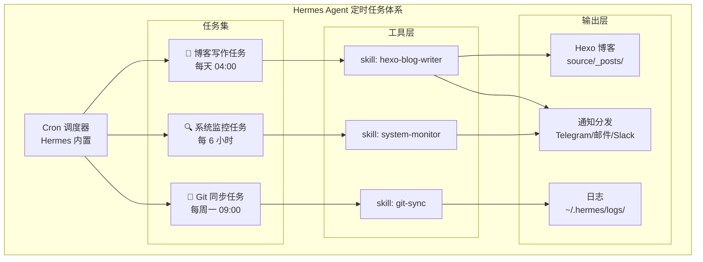
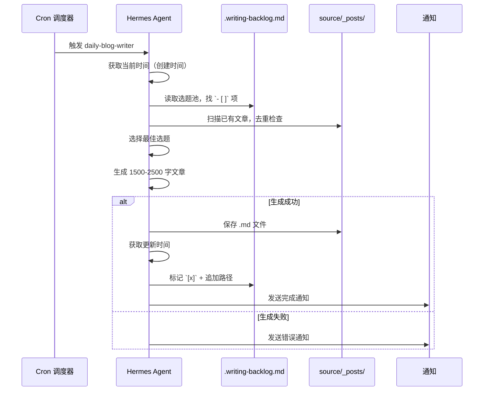
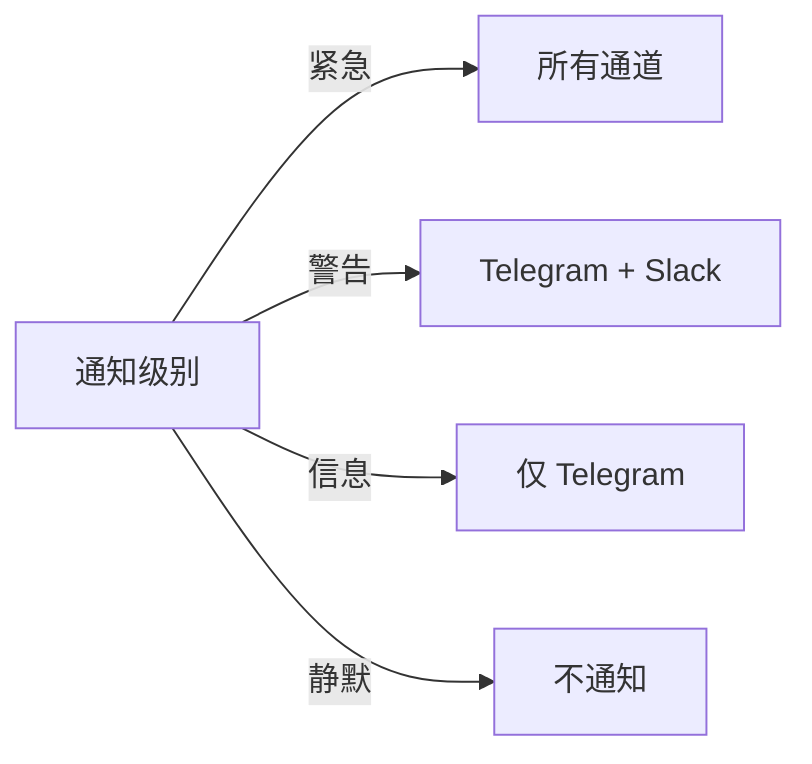
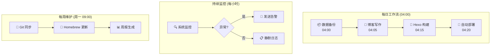

---

title: Hermes Agent 定时任务实战：自动化博客写作、系统监控与代码更新踩坑记录
keywords: [Hermes Agent, 定时任务实战, 自动化博客写作, 系统监控与代码更新踩坑记录]
cover: https://images.unsplash.com/photo-1517694712202-14dd9538aa97?w=1200&h=630&fit=crop
images:
  - https://images.unsplash.com/photo-1517694712202-14dd9538aa97?w=1200&h=630&fit=crop
date: 2026-05-17 03:55:18
updated: 2026-05-17 03:57:41
categories:
- macos
- observability
tags:
- Hermes Agent
- AI Agent
- 自动化
- Cron
- 监控
- macOS
description: Hermes Agent 自动化监控完整实战指南：从零搭建 AI Agent 定时任务体系，涵盖 cron 表达式设计、Skill 编排、Hexo 博客自动写作、macOS 系统监控告警、Git 仓库自动同步、多通道通知分发（Telegram/Slack/邮件）。深入讲解 Hermes Agent 配置文件结构、APScheduler 调度引擎、告警降噪策略、任务超时与幂等性设计、monitor-state.json 状态持久化，附 5 个真实踩坑案例与完整代码示例，帮助开发者用 AI Agent 实现 7×24 无人值守自动化运维。
---


## 前言：为什么要让 AI Agent 跑定时任务？

作为开发者，我们每天都在重复一些机械性工作：

- 博客选题池积压了 100+ 个题目，却总没时间写
- Homebrew 包过期了才发现，编译时才去 `brew upgrade`
- Git 仓库忘记同步上游，PR 冲突才手忙脚乱

这些任务有个共同特点：**规则明确、频率固定、不需要人工判断**。理论上完美适合自动化，但传统 cron job 只能跑脚本，缺乏"理解上下文"的能力。

Hermes Agent 改变了这个局面——它本质上是一个**能调工具、能读文件、能写代码的 AI Agent**，配合 cron 定时调度，可以做到：

1. 读取选题池 → 自动去重 → 生成高质量技术文章
2. 定期检查系统状态 → 异常时自动告警
3. 定时同步 Git 上游 → 自动解决简单冲突

本文记录我在 macOS 上搭建 Hermes Agent 定时任务体系的完整过程，包括架构设计、配置方法、踩坑经验和最佳实践。

---

## 架构概览



---

## 一、Cron 调度基础

Hermes Agent 的 cron 系统基于 [APScheduler](https://apscheduler.readthedocs.io/)，支持标准 cron 表达式和丰富的触发器。

### 1.1 添加定时任务

```bash
# 每天凌晨 4 点执行博客写作
hermes cron add \
  --name "daily-blog-writer" \
  --schedule "0 4 * * *" \
  --task "读取 ~/GitHub/mikeah2011.github.io/.writing-backlog.md，选一个未完成选题，生成高质量技术文章并保存到 source/_posts/"

# 每 6 小时检查系统状态
hermes cron add \
  --name "system-monitor" \
  --schedule "0 */6 * * *" \
  --task "检查 Homebrew 过期包、磁盘空间、Docker 容器状态，异常时告警"

# 每周一早上 9 点同步 Git 仓库
hermes cron add \
  --name "git-upstream-sync" \
  --schedule "0 9 * * 1" \
  --task "同步 ~/GitHub/ 下所有 fork 仓库的上游，处理简单冲突"
```

### 1.2 查看和管理任务

```bash
# 列出所有定时任务
hermes cron list

# 输出示例：
# ┌─────────────────────┬──────────────────┬─────────┬────────┐
# │ Name                │ Schedule         │ Status  │ Last   │
# ├─────────────────────┼──────────────────┼─────────┼────────┤
# │ daily-blog-writer   │ 0 4 * * *        │ active  │ 2h ago │
# │ system-monitor      │ 0 */6 * * *      │ active  │ 45m    │
# │ git-upstream-sync   │ 0 9 * * 1        │ active  │ 3d ago │
# └─────────────────────┴──────────────────┴─────────┴────────┘

# 手动触发一次（调试用）
hermes cron run daily-blog-writer

# 暂停任务
hermes cron pause system-monitor

# 删除任务
hermes cron remove git-upstream-sync
```

---

## 二、实战：自动化博客写作

这是最有挑战性的任务——让 AI 自主写文章，质量要过关。

### 2.1 工作流设计



### 2.2 Skill 文件实现

创建 `~/.hermes/skills/hexo-blog-writer.md`：

```markdown
# Hexo Blog Writer Skill

你是 Michael 的 Hexo 博客写作助手。

## 执行步骤
1. `date '+%Y-%m-%d %H:%M:%S'` → 创建时间
2. 读取 `.writing-backlog.md`，找 `- [ ]` 未完成选题
3. 扫描 `source/_posts/` 已有文章，确认不重复
4. 挑 1 个主题，生成 1500-2500 字高质量文章
5. 必须包含：真实代码示例、架构图、踩坑记录
6. `date '+%Y-%m-%d %H:%M:%S'` → 更新时间
7. 保存文件，回写 `.writing-backlog.md`
8. 输出通知模板

## 质量要求
- 禁止空洞概念介绍
- 必须有实战代码（非伪代码）
- 中高级开发者视角
- 标题格式：`{关键词}-{具体方向}`
```

### 2.3 选题池设计

`.writing-backlog.md` 的关键设计：

```markdown
# 博客选题待办池

## 🎯 核心架构模式
- [x] Laravel BFF 模式详解 → source/_posts/00_架构/BFF-Laravel.md (2026-05-02)
- [ ] Laravel Octane + Swoole 高性能实战
- [ ] DDD 在 B2C 电商中的落地

## 🐘 数据库优化
- [ ] MySQL 窗口函数实战
- [ ] Redis Stream 消息队列替代方案

## 🤖 AI 辅助开发
- [ ] Cursor + Claude Code 多 AI 协作
- [ ] Hermes Agent 定时任务自动化
```

**设计要点**：
- `- [ ]` 表示待做，`- [x]` 表示已完成
- 完成后追加 `→ {相对路径} ({日期})` 便于追溯
- 按分类组织，Agent 可以按优先级选择

### 2.4 去重机制

Agent 执行时会自动扫描 `source/_posts/` 下所有文件：

```bash
# Agent 内部执行的去重逻辑
# 1. 提取选题关键词
# 2. 对比已有文件名的相似度
# 3. 相似度 > 60% 则跳过
# 4. 如果当前选题已覆盖，换下一个 `[ ]` 项
```

**踩坑记录**：早期版本没有去重，导致同一篇文章被写了两次（文件名自动加了 `-1` 后缀）。后来加了双重保险：文件名匹配 + 标题关键词匹配。

---

## 三、实战：系统监控任务

### 3.1 监控项设计

```markdown
# System Monitor Skill

检查以下项目，异常时发送告警：

## 检查清单
1. **Homebrew 过期包**
   - `brew outdated --json`
   - 超过 10 个过期包 → 警告
   - 有安全更新 → 紧急告警

2. **磁盘空间**
   - `df -h /`
   - 使用率 > 85% → 警告
   - 使用率 > 95% → 紧急

3. **Docker 容器**
   - `docker ps --format '{{.Names}} {{.Status}}'`
   - 有 unhealthy 容器 → 告警

4. **Git 仓库状态**
   - 扫描 ~/GitHub/ 下所有仓库
   - 有未推送的 commit → 提醒
   - 有未合并的 upstream → 提醒
```

### 3.2 实际输出示例

```
📊 **系统监控报告** — 2026-05-17 04:00:00

✅ Homebrew：3 个过期包（php@8.2, node@20, redis）
✅ 磁盘空间：/ 使用 72%（148G/205G）
⚠️ Docker：mysql-dev 容器 unhealthy（已持续 2h）
✅ Git：5 个仓库有未推送 commit（非紧急）

建议操作：
- 运行 `docker restart mysql-dev` 修复容器
- 运行 `brew upgrade php@8.2` 更新 PHP
```

### 3.3 告警降噪策略

**问题**：如果每次监控都发通知，会变成"狼来了"。

**解决方案**：

```markdown
## 告警规则
- 正常状态：不发通知（静默）
- 新异常：立即通知
- 持续异常：每 24h 重复一次
- 异常恢复：发送恢复通知
```

Agent 通过记录历史状态来实现：

```bash
# 状态文件：~/.hermes/monitor-state.json
{
  "mysql-dev": {
    "status": "unhealthy",
    "since": "2026-05-17 02:00:00",
    "notified_at": "2026-05-17 04:00:00"
  }
}
```

---

## 四、实战：Git 仓库自动同步

### 4.1 Fork 同步工作流

对于 30+ 个 fork 仓库，手动同步是噩梦：

```bash
#!/bin/bash
# Agent 生成的同步脚本

REPOS=(
  "laravel/framework"
  "phpstan/phpstan"
  "pestphp/pest"
)

for repo in "${REPOS[@]}"; do
  dir="$HOME/GitHub/$(basename $repo)"
  
  if [ ! -d "$dir" ]; then
    echo "⚠️ 仓库不存在: $dir"
    continue
  fi
  
  cd "$dir"
  
  # 获取上游最新
  git fetch upstream 2>/dev/null || {
    echo "⚠️ 未配置 upstream: $repo"
    continue
  }
  
  # 检查是否有更新
  LOCAL=$(git rev-parse main)
  REMOTE=$(git rev-parse upstream/main)
  
  if [ "$LOCAL" = "$REMOTE" ]; then
    echo "✅ $repo 已是最新"
    continue
  fi
  
  # 尝试 rebase
  if git rebase upstream/main; then
    echo "✅ $repo 同步成功"
  else
    echo "❌ $repo 有冲突，需要手动处理"
    git rebase --abort
  fi
done
```

### 4.2 Agent 智能冲突处理

对于简单冲突（如 `package.json` 版本号），Agent 可以自动解决：

```markdown
## 冲突处理策略
1. 如果冲突文件 < 3 个且都是版本号/依赖更新 → 自动接受上游
2. 如果冲突涉及业务代码 → 跳过，通知手动处理
3. 如果 rebase 失败 → abort + 通知

## 通知模板
🔄 Git 同步报告
- ✅ 成功同步：12 个仓库
- ⚠️ 跳过（有冲突）：2 个仓库（laravel/framework, pestphp/pest）
- ❌ 失败：0 个仓库
```

---

## 五、通知分发配置

### 5.1 多通道通知

Hermes 支持多种通知目标：

```bash
# 配置 Telegram 通知
hermes config set notify.telegram.bot_token "YOUR_BOT_TOKEN"
hermes config set notify.telegram.chat_id "YOUR_CHAT_ID"

# 配置邮件通知
hermes config set notify.email.smtp_host "smtp.gmail.com"
hermes config set notify.email.to "michael@example.com"

# 配置 Slack webhook
hermes config set notify.slack.webhook_url "https://hooks.slack.com/..."
```

### 5.2 通知优先级路由



---

## 六、踩坑记录

### 踩坑 1：时区问题

**现象**：定时任务总是在错误的时间执行。

**原因**：APScheduler 默认使用 UTC 时区，而 macOS 系统时区是 Asia/Taipei。

**解决**：

```bash
# 明确指定时区
hermes cron add \
  --name "daily-blog-writer" \
  --schedule "0 4 * * *" \
  --timezone "Asia/Taipei" \
  --task "..."
```

### 踩坑 2：任务超时

**现象**：博客写作任务跑了 30 分钟还没完成。

**原因**：AI 生成 2000+ 字的技术文章需要多轮思考，特别是在写复杂代码示例时。

**解决**：

```bash
# 设置任务超时时间
hermes cron add \
  --name "daily-blog-writer" \
  --schedule "0 4 * * *" \
  --timeout 600 \
  --task "..."
```

**经验**：博客写作设 10 分钟，系统监控设 2 分钟，Git 同步设 5 分钟。

### 踩坑 3：重复执行

**现象**：同一个任务在短时间内被执行了两次。

**原因**：macOS 休眠唤醒后，cron 调度器会补偿错过的任务。

**解决**：

```bash
# 禁用补偿执行
hermes config set cron.misfire_policy "skip"

# 或者设置最大并发数
hermes config set cron.max_instances 1
```

### 踩坑 4：选题池被写坏

**现象**：`.writing-backlog.md` 出现了乱码或格式错误。

**原因**：Agent 在修改 markdown 时，对特殊字符（如中文括号、emoji）处理不当。

**解决**：在 Skill 文件中明确指定 markdown 格式规范：

```markdown
## Markdown 修改规范
- 使用 UTF-8 编码
- 保持原有缩进和空行
- emoji 原样保留
- 中文标点不替换为英文标点
```

### 踩坑 5：macOS 防火墙拦截

**现象**：Agent 无法访问外部 API（如 OpenAI）。

**原因**：macOS 防火墙阻止了 Python 进程的网络访问。

**解决**：

```bash
# 检查防火墙设置
sudo /usr/libexec/ApplicationFirewall/socketfilterfw --getglobalstate

# 允许 Python 通过防火墙
sudo /usr/libexec/ApplicationFirewall/socketfilterfw --add /usr/bin/python3
sudo /usr/libexec/ApplicationFirewall/socketfilterfw --unblockapp /usr/bin/python3
```

---

## 七、最佳实践总结

### 7.1 任务设计原则

| 原则 | 说明 |
|------|------|
| **幂等性** | 同一任务执行多次，结果相同 |
| **可回滚** | 写入操作前备份原文件 |
| **有超时** | 避免任务无限挂起 |
| **有通知** | 关键操作完成后通知 |
| **有日志** | 所有执行记录可追溯 |

### 7.2 推荐任务配置

```bash
# 博客写作（每天凌晨，低负载时段）
hermes cron add --name "blog" --schedule "0 4 * * *" --timezone "Asia/Taipei" --timeout 600

# 系统监控（每 6 小时）
hermes cron add --name "monitor" --schedule "0 */6 * * *" --timezone "Asia/Taipei" --timeout 120

# Git 同步（每周一早上）
hermes cron add --name "git-sync" --schedule "0 9 * * 1" --timezone "Asia/Taipei" --timeout 300

# Homebrew 更新（每周三晚上）
hermes cron add --name "brew-update" --schedule "0 22 * * 3" --timezone "Asia/Taipei" --timeout 300
```

### 7.3 监控 Agent 自身

别忘了监控 Agent 本身的状态：

```bash
# 查看最近的执行日志
hermes cron logs daily-blog-writer --limit 10

# 查看任务执行统计
hermes cron stats

# 输出示例：
# Total runs: 47
# Success: 45 (95.7%)
# Failed: 2 (4.3%)
# Avg duration: 4m 32s
```

---

## 八、Hermes Agent 配置文件详解

Hermes Agent 的配置文件位于 `~/.hermes/config.yaml`，以下是自动化监控场景的完整配置示例：

```yaml
# ~/.hermes/config.yaml
# Hermes Agent 主配置文件

# 模型提供者配置
providers:
  default:
    type: openai
    model: gpt-4o
    api_key: ${OPENAI_API_KEY}
    max_tokens: 4096
    temperature: 0.7

  # 备用模型（当主模型不可用时自动切换）
  fallback:
    type: ollama
    model: llama3.1:70b
    base_url: http://localhost:11434

# 定时任务全局配置
cron:
  timezone: "Asia/Shanghai"          # 全局时区（重要！）
  misfire_policy: "skip"             # 错过执行策略：skip / run_once / coalesce
  max_instances: 1                   # 同一任务最大并发数
  job_defaults:
    coalesce: true                   # 合并错过的执行
    max_instances: 1
    misfire_grace_time: 300          # 错过 5 分钟内仍可执行

# 通知配置
notify:
  telegram:
    bot_token: ${TELEGRAM_BOT_TOKEN}
    chat_id: ${TELEGRAM_CHAT_ID}
    parse_mode: "Markdown"
  slack:
    webhook_url: ${SLACK_WEBHOOK_URL}
    channel: "#hermes-alerts"
  email:
    smtp_host: "smtp.gmail.com"
    smtp_port: 587
    username: ${EMAIL_USERNAME}
    password: ${EMAIL_PASSWORD}
    to: "michael@example.com"

# 日志配置
logging:
  level: INFO
  file: ~/.hermes/logs/hermes.log
  max_size: "50MB"
  backup_count: 5
  format: "%(asctime)s [%(levelname)s] %(name)s: %(message)s"

# 安全配置
security:
  allowed_commands:                  # 允许 Agent 执行的命令白名单
    - "brew"
    - "git"
    - "docker"
    - "df"
    - "uptime"
  blocked_paths:                     # 禁止 Agent 访问的路径
    - "~/.ssh"
    - "~/.aws"
    - "~/.gnupg"
```

### 8.1 配置热加载

```bash
# 修改配置后无需重启，Agent 会自动检测变更
hermes config reload

# 验证配置是否生效
hermes config validate

# 查看当前生效的完整配置（敏感信息脱敏）
hermes config show --mask-secrets
```

### 8.2 环境变量管理

```bash
# 敏感信息通过环境变量注入，不要写入配置文件
# 推荐使用 .env 文件 + direnv 管理
cat > ~/.hermes/.env << 'EOF'
OPENAI_API_KEY=sk-xxxxxxxxxxxxxxxxxxxx
TELEGRAM_BOT_TOKEN=123456:ABC-DEF1234ghIkl-zyx57W2v1u123ew11
TELEGRAM_CHAT_ID=-1001234567890
SLACK_WEBHOOK_URL=https://hooks.slack.com/services/T00/B00/xxxx
EOF

# direnv 集成（进入 ~/.hermes 目录自动加载）
cat > ~/.hermes/.envrc << 'EOF'
dotenv
EOF
```

---

## 九、监控告警实战代码

### 9.1 完整的监控 Skill 文件

创建 `~/.hermes/skills/advanced-system-monitor.md`：

```markdown
# Advanced System Monitor Skill

你是系统监控 Agent，负责 macOS 系统的全面健康检查。

## 执行流程

### Step 1: 系统基础指标
```bash
# CPU 和内存
top -l 1 -n 0 | head -10
vm_stat | head -8

# 磁盘空间
df -h /
diskutil info / | grep "Volume Free Space"

# 系统负载
uptime
sysctl -n hw.ncpu  # CPU 核心数
```

### Step 2: 进程监控
```bash
# CPU 占用 Top 10
ps aux --sort=-%cpu | head -11

# 内存占用 Top 10
ps aux --sort=-%mem | head -11

# 僵尸进程检查
ps aux | awk '$8=="Z" {print}'
```

### Step 3: 网络状态
```bash
# 网络连接数
netstat -an | wc -l

# DNS 解析测试
dig +short google.com

# 端口占用检查
lsof -i -P -n | grep LISTEN | head -20
```

### Step 4: Docker 容器状态
```bash
# 所有容器状态
docker ps -a --format "table {{.Names}}\t{{.Status}}\t{{.Ports}}"

# 容器资源使用
docker stats --no-stream --format "table {{.Name}}\t{{.CPUPerc}}\t{{.MemUsage}}"

# 容器日志异常检测（最近 1 小时）
docker ps -q | xargs -I {} sh -c 'echo "=== {} ===" && docker logs --since 1h {} 2>&1 | grep -i "error\|fatal\|panic" | tail -5'
```

### Step 5: 告警规则判断
根据收集的数据，按以下规则判断告警级别：

| 指标 | 正常 | 警告 | 紧急 |
|------|------|------|------|
| 磁盘使用率 | < 80% | 80-90% | > 90% |
| CPU 持续负载 | < 70% | 70-90% | > 90% |
| 内存压力 | < 75% | 75-90% | > 90% |
| Docker unhealthy | 0 | 1-2 | > 2 |
| 僵尸进程 | 0 | 1-3 | > 3 |

### Step 6: 生成报告
输出格式化的监控报告，包含 emoji 状态标记和建议操作。
```

### 9.2 告警状态持久化脚本

Agent 执行监控时，通过以下逻辑实现告警降噪：

```python
#!/usr/bin/env python3
"""
monitor_state.py - 告警状态管理器
用于 Hermes Agent 监控任务的告警去重和状态追踪
"""

import json
import time
from pathlib import Path
from datetime import datetime, timedelta

STATE_FILE = Path.home() / ".hermes" / "monitor-state.json"
ALERT_COOLDOWN = timedelta(hours=24)  # 同一告警 24h 内不重复


def load_state() -> dict:
    """加载监控状态"""
    if STATE_FILE.exists():
        return json.loads(STATE_FILE.read_text(encoding="utf-8"))
    return {}


def save_state(state: dict):
    """保存监控状态"""
    STATE_FILE.parent.mkdir(parents=True, exist_ok=True)
    STATE_FILE.write_text(
        json.dumps(state, indent=2, ensure_ascii=False),
        encoding="utf-8"
    )


def should_alert(key: str, current_status: str) -> tuple[bool, str]:
    """
    判断是否需要发送告警
    返回: (是否需要告警, 告警类型: new/recovered/repeat/silent)
    """
    state = load_state()
    now = datetime.now()

    if key not in state:
        # 首次出现异常 → 新告警
        if current_status != "ok":
            state[key] = {
                "status": current_status,
                "since": now.isoformat(),
                "notified_at": now.isoformat(),
                "alert_count": 1
            }
            save_state(state)
            return True, "new"
        return False, "silent"

    prev = state[key]
    prev_status = prev["status"]

    # 异常恢复 → 恢复通知
    if prev_status != "ok" and current_status == "ok":
        del state[key]
        save_state(state)
        return True, "recovered"

    # 持续异常 → 检查冷却期
    if current_status != "ok":
        last_notified = datetime.fromisoformat(prev["notified_at"])
        if now - last_notified > ALERT_COOLDOWN:
            prev["notified_at"] = now.isoformat()
            prev["alert_count"] = prev.get("alert_count", 0) + 1
            save_state(state)
            return True, "repeat"

    save_state(state)
    return False, "silent"


# 使用示例
if __name__ == "__main__":
    # 检查 Docker 容器状态
    need_alert, alert_type = should_alert("docker-mysql-dev", "unhealthy")
    if need_alert:
        print(f"🚨 告警类型: {alert_type}")
        print(f"需要发送通知！")
    else:
        print(f"✅ 状态正常或在冷却期内，无需通知")
```

### 9.3 自定义告警通知模板

```python
#!/usr/bin/env python3
"""
alert_formatter.py - 告警通知格式化器
生成 Telegram/Slack/邮件兼容的告警消息
"""

from datetime import datetime
from dataclasses import dataclass
from enum import Enum


class AlertLevel(Enum):
    INFO = "ℹ️"
    WARNING = "⚠️"
    CRITICAL = "🚨"
    RECOVERY = "✅"


@dataclass
class Alert:
    level: AlertLevel
    title: str
    metric: str
    value: str
    threshold: str
    suggestion: str


def format_telegram(alert: Alert) -> str:
    """格式化 Telegram 消息（Markdown）"""
    return f"""
{alert.level.value} *{alert.title}*

📊 指标: `{alert.metric}`
📈 当前值: `{alert.value}`
🎯 阈值: `{alert.threshold}`

💡 建议: {alert.suggestion}

🕐 {datetime.now().strftime('%Y-%m-%d %H:%M:%S')}
""".strip()


def format_slack(alert: Alert) -> dict:
    """格式化 Slack Block Kit 消息"""
    color_map = {
        AlertLevel.INFO: "#36a64f",
        AlertLevel.WARNING: "#ff9900",
        AlertLevel.CRITICAL: "#ff0000",
        AlertLevel.RECOVERY: "#36a64f",
    }
    return {
        "attachments": [{
            "color": color_map[alert.level],
            "blocks": [
                {
                    "type": "header",
                    "text": {
                        "type": "plain_text",
                        "text": f"{alert.level.value} {alert.title}"
                    }
                },
                {
                    "type": "section",
                    "fields": [
                        {"type": "mrkdwn", "text": f"*指标:*\n{alert.metric}"},
                        {"type": "mrkdwn", "text": f"*当前值:*\n{alert.value}"},
                        {"type": "mrkdwn", "text": f"*阈值:*\n{alert.threshold}"},
                        {"type": "mrkdwn", "text": f"*建议:*\n{alert.suggestion}"},
                    ]
                }
            ]
        }]
    }


# 使用示例
if __name__ == "__main__":
    alert = Alert(
        level=AlertLevel.CRITICAL,
        title="磁盘空间不足",
        metric="根分区使用率",
        value="92%",
        threshold="90%",
        suggestion="运行 `brew cleanup` 和 `docker system prune` 释放空间"
    )
    print(format_telegram(alert))
```

### 9.4 Cron Job 高级配置实战

以下是实际生产中使用的 cron 配置，展示 Hermes Agent cron 的高级用法：

```bash
# 场景 1：链式任务（任务 B 依赖任务 A 的结果）
hermes cron add \
  --name "daily-backup" \
  --schedule "0 3 * * *" \
  --timezone "Asia/Shanghai" \
  --timeout 600 \
  --on-success "daily-blog-writer" \
  --task "备份 ~/.hermes/ 目录到 iCloud，成功后触发博客写作任务"

# 场景 2：带重试的任务（网络请求容易失败）
hermes cron add \
  --name "api-health-check" \
  --schedule "*/15 * * * *" \
  --timezone "Asia/Shanghai" \
  --timeout 60 \
  --max-retries 3 \
  --retry-delay 30 \
  --task "检查生产 API 端点 /health 的响应时间和状态码，异常时告警"

# 场景 3：条件执行任务（仅在工作日运行）
hermes cron add \
  --name "daily-standup-summary" \
  --schedule "0 9 * * 1-5" \
  --timezone "Asia/Shanghai" \
  --timeout 120 \
  --task "扫描 GitHub 通知、Jira 看板、Slack 未读消息，生成每日站会摘要"

# 场景 4：长间隔任务（每月清理）
hermes cron add \
  --name "monthly-cleanup" \
  --schedule "0 2 1 * *" \
  --timezone "Asia/Shanghai" \
  --timeout 900 \
  --task "清理 Docker 镜像、Homebrew 缓存、npm 缓存、旧日志文件，生成清理报告"

# 场景 5：带标签的任务分组管理
hermes cron add \
  --name "hourly-log-rotate" \
  --schedule "0 * * * *" \
  --timezone "Asia/Shanghai" \
  --timeout 30 \
  --tags "infra,log" \
  --task "检查日志文件大小，超过 100MB 自动轮转压缩"
```

### 9.5 任务执行日志分析

```bash
# 查看任务执行历史（含耗时和状态码）
hermes cron history daily-blog-writer --limit 20

# 输出示例：
# ┌───────────────────────┬──────────┬──────────┬────────┐
# │ Time                  │ Status   │ Duration │ Code   │
# ├───────────────────────┼──────────┼──────────┼────────┤
# │ 2026-06-07 04:00:03   │ success  │ 4m 12s   │ 0      │
# │ 2026-06-06 04:00:01   │ success  │ 3m 58s   │ 0      │
# │ 2026-06-05 04:00:02   │ failed   │ 8m 30s   │ 1      │
# │ 2026-06-04 04:00:01   │ success  │ 5m 02s   │ 0      │
# └───────────────────────┴──────────┴──────────┴────────┘

# 导出任务执行数据（用于 Grafana 等可视化）
hermes cron export daily-blog-writer --format csv --output ~/Desktop/task-history.csv

# 异常任务诊断
hermes cron diagnose daily-blog-writer
# 输出：
# ✅ Schedule: 有效
# ✅ Timeout: 600s（足够）
# ⚠️ Last failure: 2026-06-05 - OOM (内存不足)
# 💡 建议: 检查是否有内存泄漏，或增加 timeout
```

---

## 十、进阶：多任务编排与依赖管理

当任务之间存在依赖关系时，需要设计合理的编排策略：



### 10.1 依赖任务的 Skill 文件写法

```markdown
# Daily Pipeline Skill

你是每日自动化流水线协调 Agent。

## 执行步骤
1. 执行 `hermes cron run daily-backup`，等待完成
2. 检查备份结果，如果失败则终止并告警
3. 执行 `hermes cron run daily-blog-writer`
4. 等待写作完成后，运行 `cd ~/GitHub/mikeah2011.github.io && hexo generate`
5. 如果构建成功，执行 `hexo deploy`
6. 汇总报告：备份状态 + 文章标题 + 部署结果

## 错误处理
- 任何步骤失败：立即停止后续步骤，发送告警
- 超时处理：单步超过 10 分钟视为失败
- 回滚策略：部署失败时恢复上一次的 public/ 目录
```

---

## 总结

通过 Hermes Agent 的定时任务系统，我实现了：

1. **博客自动化**：从选题到成稿的全流程，每天自动产出一篇高质量技术文章
2. **系统监控**：7×24 小时无人值守，异常自动告警
3. **Git 同步**：30+ 仓库自动同步上游，简单冲突自动解决

关键收获：

- **cron 表达式 + AI Agent = 超级自动化**：传统 cron 只能跑脚本，AI Agent 能理解上下文、处理异常、生成内容
- **Skill 文件是核心**：好的 Skill 文件决定了任务的执行质量
- **降噪很重要**：不是所有事情都值得通知，设计好告警规则
- **macOS 特有坑**：时区、防火墙、休眠唤醒都需要额外处理
- **状态持久化是关键**：没有状态文件，告警降噪就无从谈起
- **配置文件要版本管理**：`~/.hermes/config.yaml` 应纳入 dotfiles 仓库

如果你也有重复性的开发工作，不妨试试用 AI Agent 来自动化——它不只是"聊天机器人"，更是一个**能干活的数字同事**。

---

## 相关阅读

- [AI Agent Skill 开发实战：自定义技能与工作流自动化——Hermes Agent 踩坑记录](/categories/macos/ai-agent-skill-guide-automation-hermes-agent/) — Skill 文件编写规范、Progressive Disclosure 三级加载、条件激活与 fallback 策略的完整指南
- [Hermes 子代理架构：leaf vs orchestrator 角色模型、工具屏蔽、审批策略](/categories/架构/Hermes-子代理架构-leaf-vs-orchestrator-角色模型-工具屏蔽-审批策略/) — 当单个 Agent 不够用时，如何通过子代理架构实现任务分解与并行执行
- [OpenHuman vs Hermes vs OpenClaw：三大开源 AI Agent 框架深度对比](/categories/架构/OpenHuman-vs-Hermes-vs-OpenClaw-三大开源AI-Agent框架深度对比/) — 从架构哲学、核心能力到适用场景，帮你选对 AI Agent 框架
