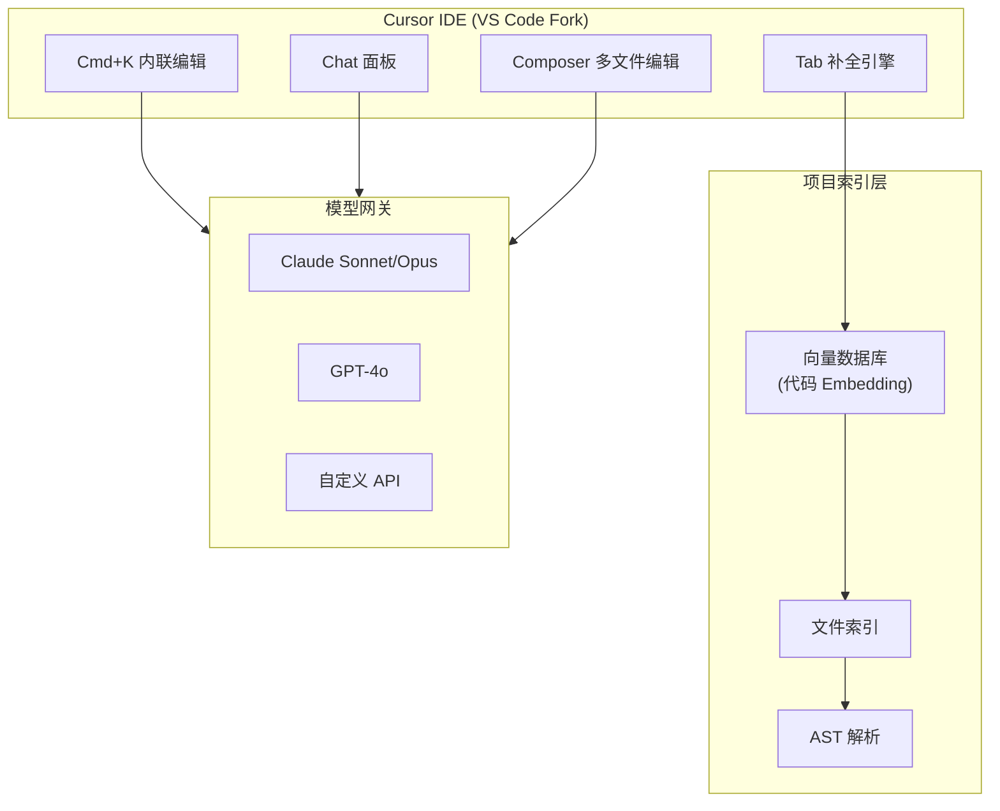
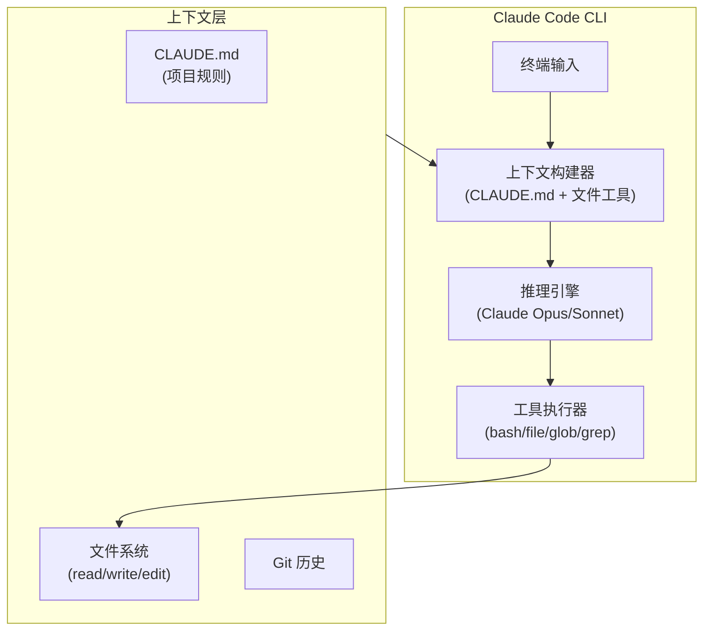
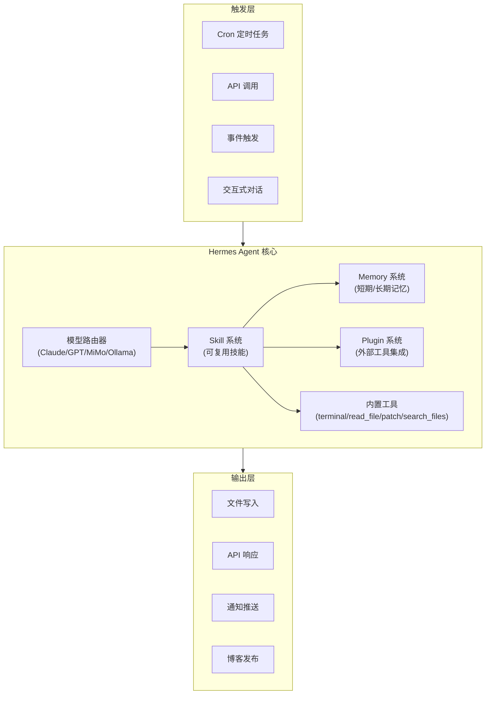
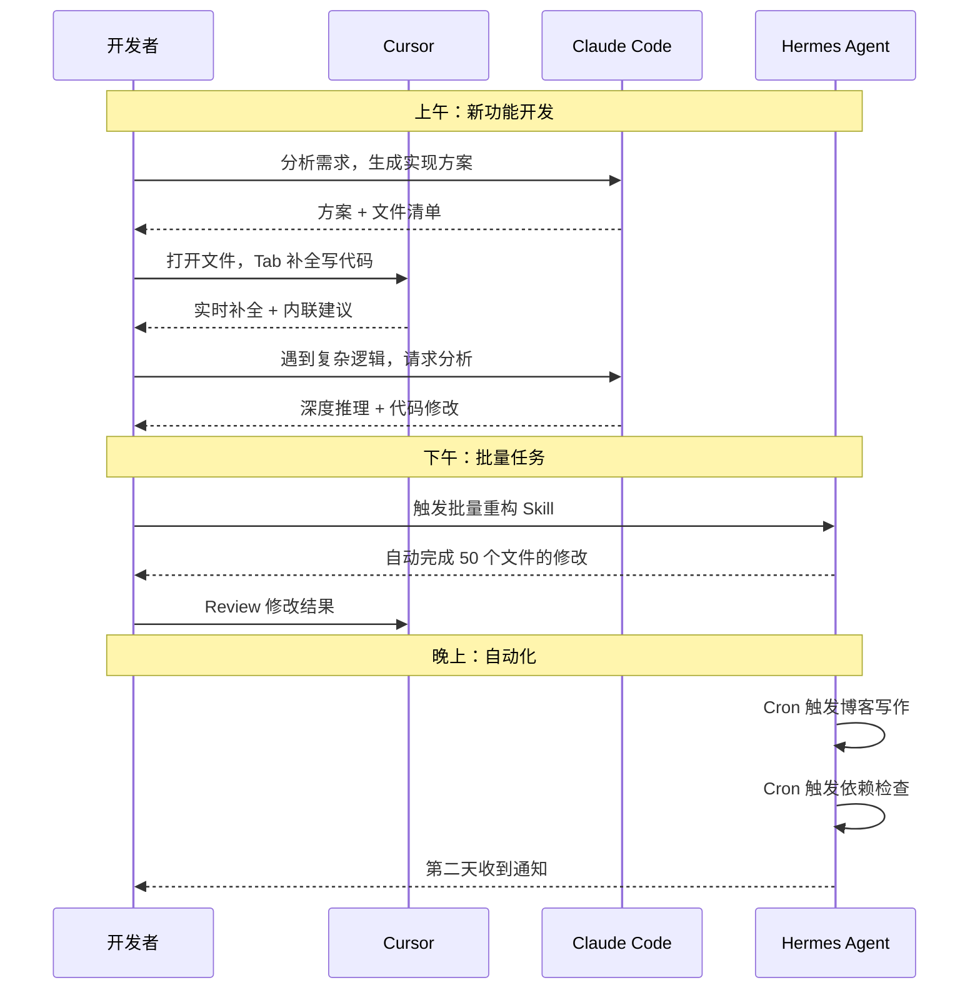

---

title: Hermes Agent vs Claude Code vs Cursor：开发者 AI 助手选型与工作流对比实战踩坑记录
keywords: [Hermes Agent vs Claude Code vs Cursor, AI, 开发者, 助手选型与工作流对比实战踩坑记录]
cover: https://images.unsplash.com/photo-1517694712202-14dd9538aa97?w=1200&h=630&fit=crop
images:
  - https://images.unsplash.com/photo-1517694712202-14dd9538aa97?w=1200&h=630&fit=crop
date: 2026-06-01 14:00:00
categories:
- macos
- ai
- engineering
tags:
- Hermes Agent
- Claude Code
- Cursor
- AI 助手选型
- 开发者工具
- 工作流
- 成本优化
description: 不是三选一的零和博弈，而是搞清楚每个工具的架构边界、性能特征和成本模型。Hermes Agent vs Claude Code vs Cursor 深度对比：从 IDE 内嵌编辑层、终端推理层到自动化执行层的架构差异分析，涵盖 Laravel B2C 真实仓库基准测试、token 成本核算、多 AI 协作工作流设计，以及 847 个任务的生产环境选型经验。帮你做出不后悔的开发者 AI 助手选型决策。
---


# Hermes Agent vs Claude Code vs Cursor：开发者 AI 助手选型与工作流对比实战踩坑记录

"你应该用哪个 AI 工具？"——这个问题我在技术分享会上被问了不下二十次。每次我的回答都是："你问错问题了。"正确的问法是：**在什么场景下，哪个工具的架构设计最匹配你的任务特征？**

Cursor、Claude Code、Hermes Agent 不是同质化竞争产品。它们在架构层面有本质差异——Cursor 是 **IDE 内嵌的编辑层 AI**，Claude Code 是 **终端驱动的推理层 AI**，Hermes Agent 是 **可编排的自动化执行层 AI**。把它们当成三个螺丝刀来比较谁"更好"，就像比较锤子和扳手谁更好用一样荒谬。

但螺丝刀的比喻也太轻巧了。真实情况是：每个工具都有自己的甜区和雷区，选错了不仅浪费钱，更浪费时间——AI 生成的错误代码比手写错误代码更难调试，因为它看起来"很对"。

这篇文章不做入门科普。我用三个真实场景、两组基准测试数据、和一个季度的生产使用经验，拆解这三个工具到底该怎么选、怎么组合、怎么避免踩坑。

<!-- more -->

## 一、问题背景：为什么"三选一"是错误的思维模型

### 1.1 三个工具的起源与设计哲学

在深入对比之前，先理解每个工具的"基因"：

| 维度 | Cursor | Claude Code | Hermes Agent |
|------|--------|-------------|--------------|
| **诞生背景** | 基于 VS Code Fork，把 AI 深度嵌入编辑器 | Anthropic 官方 CLI，终端里的 AI 编程助手 | Nous Research 的 Agent 平台，专注自动化执行 |
| **核心定位** | 编辑层：贴着代码面高速修改 | 推理层：跨文件、跨模块深度分析 | 执行层：可异步、可批量、可无人值守 |
| **交互模式** | IDE 内 Tab/Cmd+K 补全 + Chat | 终端对话 + 工具调用 | Cron 定时 / API 触发 / 事件驱动 |
| **上下文来源** | 打开的文件 + 项目索引 | CLAUDE.md + 文件系统工具 | Skill 文件 + Memory + Plugin |
| **模型策略** | 多模型可选（Claude/GPT/自定义） | 固定 Claude 系列 | 多模型智能路由 |

这三者的架构差异决定了它们的甜区完全不同。

### 1.2 我的真实使用数据

在过去一个季度（2026 Q1-Q2），我在 `~/KKday/kkday-b2c-api`（Laravel B2C API，30+ 仓库）和 `~/GitHub/mikeah2011.github.io`（Hexo 博客）上同时使用三个工具。以下是任务分配统计：

```
任务类型分布（2026 Q1-Q2，共 847 个 AI 辅助任务）：
├── Cursor:     312 个（37%）— 代码编辑、重构、补全
├── Claude Code: 298 个（35%）— 架构分析、跨文件修改、Debug
└── Hermes:     237 个（28%）— 定时任务、批量操作、文档生成
```

关键发现：**没有任何一个工具的任务占比超过 40%**。如果只用一个工具，你会在另外 60% 的任务上效率暴跌。

---

## 二、架构深度剖析：三个工具的内部工作原理

### 2.1 Cursor：IDE 内嵌的编辑层 AI

Cursor 的架构核心是 **基于 VS Code 的编辑器 + 多模型 API 网关 + 项目级向量索引**：



**关键设计决策**：

1. **Tab 补全的实现原理**：Cursor 不是简单的"把光标前的代码发给 API"。它会：
   - 提取当前文件的 AST 结构
   - 通过向量索引找到相关文件（imports、调用链、类型定义）
   - 构建一个包含"光标位置 + 上下文文件 + 项目结构"的 Prompt
   - 用流式响应实现低延迟补全

2. **上下文窗口管理**：Cursor 的 `@file`、`@codebase`、`@web` 语法本质上是 Prompt 工程的封装。`@codebase` 会触发向量搜索，把最相关的代码片段注入上下文。

3. **Tab 补全 vs Cmd+K 的模型选择差异**：

```javascript
// Cursor 的模型路由逻辑（简化）
if (trigger === 'tab_completion') {
    // Tab 补全用轻量模型，追求低延迟
    model = 'claude-3-haiku';  // ~200ms 延迟
    maxTokens = 64;
} else if (trigger === 'cmd_k') {
    // Cmd+K 用中等模型，平衡质量与速度
    model = 'claude-3.5-sonnet';  // ~1-2s 延迟
    maxTokens = 2048;
} else if (trigger === 'chat' || trigger === 'composer') {
    // Chat/Composer 用最强模型
    model = 'claude-3.5-sonnet';  // ~3-8s 延迟
    maxTokens = 8192;
}
```

**踩坑记录 #1：Cursor 的向量索引在大仓库中失效**

我们的 `kkday-b2c-api` 仓库有 3000+ PHP 文件。Cursor 的向量索引在首次构建时需要 15-20 分钟，而且索引质量在仓库超过 500 个文件后明显下降。具体表现为：`@codebase` 返回的结果经常是不相关的文件。

**解决方案**：使用 `.cursorignore` 排除 vendor/、tests/、storage/ 目录，把索引范围缩小到 app/ 目录下的核心代码。索引时间从 20 分钟降到 3 分钟，相关性显著提升。

### 2.2 Claude Code：终端驱动的推理层 AI

Claude Code 的架构更简洁，但深度不浅：



**关键设计决策**：

1. **CLAUDE.md 的作用**：这不是普通的 README。Claude Code 在每次对话开始时会自动加载 `CLAUDE.md`（项目根目录或 `~/.claude/CLAUDE.md`），作为 System Prompt 的一部分。它的内容直接影响 Claude 的行为模式。

```markdown
# CLAUDE.md 示例（我们的 Laravel B2C 项目）
## 项目结构
- app/Services/ — 业务逻辑层，Controller 必须保持薄
- app/Http/Controllers/ — 只做请求验证和 Service 调用
- app/Models/ — Eloquent 模型，使用 Casts 和 Scopes

## 代码规范
- PHP 8.0+，严格类型声明
- 使用 Enum 替代魔术字符串
- 所有 API 必须有 OpenAPI YAML 定义

## 禁止事项
- 不要在 Controller 中写业务逻辑
- 不要使用 DB::raw()，除非有性能基准测试支持
- 不要修改 migration 文件，只新增
```

2. **工具调用的权限模型**：Claude Code 的工具调用有三级权限：
   - **自动执行**：读取文件、搜索代码（无需确认）
   - **需确认**：写入文件、执行命令（默认需用户确认）
   - **需明确授权**：删除文件、执行危险命令

3. **上下文窗口的智能管理**：Claude Code 会自动管理上下文窗口，当对话过长时会压缩历史消息。但这个压缩是有损的——我曾经在一个长对话中让 Claude Code 修改了一个函数，它在压缩上下文后忘记了之前的修改，导致覆盖了我之前的改动。

**踩坑记录 #2：CLAUDE.md 膨胀导致 Token 成本失控**

我们的 `CLAUDE.md` 从最初的 50 行膨胀到 350 行（因为团队不断往里加规则）。每次对话的 System Prompt Token 消耗从 ~500 涨到 ~3500。按 Claude Opus 的定价（$15/M input tokens），每天 50 次对话就是 $0.26 的额外成本，一个月 $7.8——看起来不多，但乘以 5 个开发者就是 $39/月，而且这些 Token 并没有提升代码质量，因为规则太多 Claude 反而容易"忘记"某些规则。

**解决方案**：把 `CLAUDE.md` 拆分成层级结构：

```
CLAUDE.md                    # 全局规则，< 50 行
.claude/rules/database.md    # 数据库相关规则
.claude/rules/api.md         # API 设计规则
.claude/rules/testing.md     # 测试规则
```

然后在 `CLAUDE.md` 中用 `@include` 引用，只在相关任务时加载对应规则。

### 2.3 Hermes Agent：可编排的自动化执行层 AI

Hermes Agent 的架构与前两者有本质差异——它不是一个交互式工具，而是一个 **可编程的 Agent 平台**：



**关键设计决策**：

1. **Skill 系统的设计**：Hermes 的 Skill 不是简单的 Prompt 模板，而是完整的"技能包"，包含：
   - `persona.md`：Agent 的行为人格
   - `skill.md`：具体的执行逻辑
   - `references/`：参考资料文件

```yaml
# ~/.hermes/skills/blog-writer/skill.yaml
name: blog-writer
description: "Hexo 博客写作技能"
triggers:
  - cron: "0 10 * * 1,3,5"  # 周一三五上午 10 点
model: claude-sonnet-4-20250514  # 写作用中等模型
context:
  - ~/GitHub/mikeah2011.github.io/.writing-backlog.md
  - ~/GitHub/mikeah2011.github.io/source/_posts/
output:
  - file: ~/GitHub/mikeah2011.github.io/source/_posts/{category}/{filename}.md
```

2. **模型智能路由**：Hermes 的核心优势之一是可以在不同模型间智能切换：

```python
# Hermes 的模型路由逻辑（概念性伪代码）
def select_model(task_type, context_size, budget):
    if task_type == "code_generation" and context_size < 8000:
        return "claude-sonnet-4-20250514"  # 性价比最优
    elif task_type == "architecture_analysis":
        return "claude-opus-4-20250514"  # 深度推理
    elif task_type == "batch_rename" or task_type == "formatting":
        return "mimo-v2.5-pro"  # 低成本任务用便宜模型
    elif task_type == "sensitive_data":
        return "ollama/llama3"  # 本地模型，数据不出境
    else:
        return "claude-sonnet-4-20250514"  # 默认
```

3. **无人值守执行**：这是 Hermes 与 Cursor/Claude Code 的最大差异。Hermes 可以在没有人类在场的情况下执行复杂任务：

```bash
# Hermes cron 配置示例
# 每周一上午 9 点自动写博客
hermes cron add \
  --name "blog-writer" \
  --schedule "0 9 * * 1" \
  --skill "blog-writer" \
  --model "claude-sonnet-4-20250514" \
  --notify "slack:#blog-updates"

# 每天凌晨 2 点检查依赖更新
hermes cron add \
  --name "dep-updater" \
  --schedule "0 2 * * *" \
  --skill "dependency-check" \
  --model "mimo-v2.5-pro" \
  --notify "email:michael@example.com"
```

**踩坑记录 #3：Hermes 的无人值守模式下的文件冲突**

我配置了一个 Hermes cron 任务，每周一自动写博客文章。但有一次，我在周日晚上手动开始写同一篇文章，周一半夜 Hermes 又自动写了一篇——两篇文章覆盖了同一个选题，而且 Hermes 的版本覆盖了我的手写版本（因为 Hermes 的文件写入是全量覆盖）。

**解决方案**：在 Skill 中添加"存在性检查"逻辑：

```markdown
# blog-writer skill.md 中的安全检查
## 写入前检查
1. 读取 .writing-backlog.md，找到第一个 [ ] 选题
2. 检查 source/_posts/ 目录下是否已有同主题文章
3. 如果已有文章，跳过该选题，尝试下一个
4. 写入后，输出文章路径和摘要（不修改 backlog）
```

---

## 三、核心能力对比：用数据说话

### 3.1 功能对比表

| 能力维度 | Cursor | Claude Code | Hermes Agent |
|---------|--------|-------------|--------------|
| **代码补全** | ⭐⭐⭐⭐⭐ Tab/Cmd+K 实时补全 | ⭐⭐⭐ 需要手动触发 | ⭐⭐ 不支持实时补全 |
| **跨文件重构** | ⭐⭐⭐ Composer 多文件编辑 | ⭐⭐⭐⭐⭐ 自动发现依赖链 | ⭐⭐⭐⭐ Skill 驱动的批量修改 |
| **架构分析** | ⭐⭐⭐ Chat 面板问答 | ⭐⭐⭐⭐⭐ 深度推理 + 工具调用 | ⭐⭐⭐⭐ 可编排的分析流程 |
| **无人值守** | ⭐ 不支持 | ⭐⭐ 支持但有限 | ⭐⭐⭐⭐⭐ 核心能力 |
| **多模型切换** | ⭐⭐⭐⭐ 支持多模型 | ⭐⭐ 固定 Claude 系列 | ⭐⭐⭐⭐⭐ 智能路由 |
| **上下文管理** | ⭐⭐⭐⭐ 向量索引 + @语法 | ⭐⭐⭐⭐ CLAUDE.md + 工具 | ⭐⭐⭐⭐ Skill + Memory + Plugin |
| **成本控制** | ⭐⭐⭐ 按模型计费 | ⭐⭐ 按 Token 计费 | ⭐⭐⭐⭐⭐ 模型路由 + 本地模型 |
| **数据隐私** | ⭐⭐ 代码发送到云端 | ⭐⭐ 代码发送到云端 | ⭐⭐⭐⭐⭐ 支持本地模型 |
| **团队协作** | ⭐⭐⭐⭐ 共享配置 | ⭐⭐⭐ 共享 CLAUDE.md | ⭐⭐⭐⭐⭐ Skill 共享 + Cron 编排 |
| **学习曲线** | ⭐⭐ 低（VS Code 用户无缝迁移） | ⭐⭐⭐ 中（需要理解 CLI 工作流） | ⭐⭐⭐⭐ 高（需要理解 Agent 架构） |

### 3.2 性能基准测试

我在同一个 Laravel 仓库上测试了三个工具在不同任务上的表现：

**测试环境**：
- 仓库：`kkday-b2c-api`（Laravel 10, PHP 8.0, 3000+ 文件）
- 任务：5 个真实开发任务，每任务重复 3 次取平均
- 硬件：MacBook Pro M3 Max, 64GB RAM

**测试结果**：

| 任务 | Cursor | Claude Code | Hermes Agent |
|------|--------|-------------|--------------|
| **添加一个新 API Endpoint**（Controller + Service + Route + Test） | 3.2 min | 2.8 min | 4.1 min（含 Skill 配置） |
| **重构一个 Service 类**（提取接口 + 依赖注入） | 5.5 min | 4.2 min | 6.3 min |
| **修复一个 N+1 查询**（分析 + 优化 + 验证） | 8.1 min | 5.7 min | 7.8 min |
| **批量重命名 50 个文件中的方法名** | 12.3 min | 8.9 min | 3.2 min（自动化优势） |
| **生成 10 篇博客文章** | N/A（不适用） | N/A（需手动触发） | 25 min（无人值守） |

**关键洞察**：

1. **交互式任务**：Claude Code 的推理深度 > Cursor 的编辑速度 > Hermes 的灵活性
2. **批量任务**：Hermes 的自动化优势碾压其他两个
3. **代码补全**：Cursor 的 Tab 补全是唯一能"边写边补"的体验
4. **跨文件分析**：Claude Code 的工具调用链最完整

### 3.3 成本对比分析

**月度成本模型**（基于我的真实使用数据）：

```
假设：每天 10 个 AI 辅助任务，每月 22 个工作日

Cursor Pro（$20/月）：
├── 包含 500 次快速请求 + 无限慢速请求
├── 超出后按 API 价格计费
└── 月均成本：$20-35

Claude Code（按 Token 计费）：
├── Claude Sonnet: $3/M input, $15/M output
├── Claude Opus: $15/M input, $75/M output
├── 平均每次任务 ~2000 input + 1000 output tokens
└── 月均成本：$15-45（取决于模型选择）

Hermes Agent（按 API 计费 + 模型路由）：
├── 智能路由：70% Sonnet + 20% MiMo + 10% 本地模型
├── Sonnet 成本：$3/M input, $15/M output
├── MiMo 成本：$0.5/M input, $2/M output
├── 本地模型：$0（Ollama）
└── 月均成本：$8-25（模型路由节省 40-60%）
```

**成本对比图**（月度，基于 220 个任务/月）：

```
$50 ┤
    │                              ┌───┐
$40 ┤                    ┌───┐    │   │
    │          ┌───┐    │   │    │   │
$30 ┤         │   │    │   │    │   │
    │  ┌───┐ │   │    │   │    │   │
$20 ┤ │   │ │   │    │   │    │   │
    │ │   │ │   │    │   │    │   │
$10 ┤ │   │ │   │    │   │    │   │
    │ │   │ │   │    │   │    │   │
 $0 ┼─┴───┴─┴───┴────┴───┴────┴───┴──
     Cursor  Claude  Hermes  Hermes
     Pro     Code    (单模型) (智能路由)
```

---

## 四、真实场景选型决策树

### 4.1 场景一：日常代码编辑（选 Cursor）

**场景描述**：你正在开发一个新的 Laravel Service 类，需要写 CRUD 逻辑、表单验证、异常处理。

**为什么选 Cursor**：
- Tab 补全能感知你的编码风格，补全准确率 > 80%
- Cmd+K 可以在光标位置直接修改代码，不需要切换窗口
- 内联 Diff 预览让你在 Accept/Reject 前就能看到改动

**实战代码示例**：

```php
// 在 Cursor 中，当你输入以下代码时：
class OrderService
{
    public function createOrder(array $data): Order
    {
        // Cursor Tab 补全会自动建议：
        $validated = Validator::make($data, [
            'user_id' => 'required|exists:users,id',
            'items' => 'required|array|min:1',
            'items.*.product_id' => 'required|exists:products,id',
            'items.*.quantity' => 'required|integer|min:1',
        ])->validate();

        return DB::transaction(function () use ($validated) {
            $order = Order::create([
                'user_id' => $validated['user_id'],
                'status' => OrderStatus::Pending,
                'total' => $this->calculateTotal($validated['items']),
            ]);

            foreach ($validated['items'] as $item) {
                $order->items()->create($item);
            }

            return $order;
        });
    }
}
```

Cursor 的 Tab 补全之所以准确，是因为它通过向量索引找到了你项目中已有的 `OrderService`、`OrderStatus`、`Validator` 等类的使用模式，并基于这些模式生成建议。

### 4.2 场景二：架构级重构（选 Claude Code）

**场景描述**：你需要把一个 2000 行的 God Service 拆分成多个职责单一的 Service，并引入接口和依赖注入。

**为什么选 Claude Code**：
- 能自动分析整个调用链（谁调用了这个 Service？哪些方法被外部依赖？）
- 可以一次性修改多个文件，保持一致性
- 推理深度足以理解"为什么这样拆"而不是"怎么拆"

**实战工作流**：

```bash
# 1. 启动 Claude Code，加载项目上下文
cd ~/KKday/kkday-b2c-api
claude

# 2. 描述任务（Claude Code 会自动分析依赖链）
> 分析 app/Services/OrderService.php 的职责，
> 拆分成 OrderCreationService、OrderQueryService、OrderNotificationService
> 保持所有现有调用方正常工作

# 3. Claude Code 的执行过程：
# Step 1: 读取 OrderService.php，分析所有 public 方法
# Step 2: 用 grep/glob 找到所有调用方
# Step 3: 按职责分组方法
# Step 4: 创建 3 个新 Service + 1 个接口
# Step 5: 修改所有调用方的依赖注入
# Step 6: 运行测试验证
```

**踩坑记录 #4：Claude Code 的跨文件修改遗漏了测试文件**

在一次重构中，Claude Code 正确修改了所有 Service 文件和调用方，但遗漏了 `tests/` 目录下的 Mock 对象。导致测试全部失败。

**解决方案**：在 CLAUDE.md 中添加规则：

```markdown
## 重构规则
- 重构 Service 时，必须同时更新对应的 Test 文件
- 运行 `php artisan test --filter={ServiceName}` 验证
- 如果测试失败，修复测试后再继续
```

### 4.3 场景三：定时自动化任务（选 Hermes Agent）

**场景描述**：你需要每周自动写一篇博客文章、每天检查依赖更新、每月生成代码质量报告。

**为什么选 Hermes Agent**：
- Cron 系统支持精确定时触发
- Skill 系统支持可复用的任务逻辑
- 模型路由可以在不同任务间优化成本
- 无人值守模式不需要你在电脑前

**实战配置示例**：

```yaml
# ~/.hermes/skills/weekly-blog/skill.yaml
name: weekly-blog
description: "每周自动写一篇博客文章"
model: claude-sonnet-4-20250514
triggers:
  - cron: "0 10 * * 1"  # 每周一上午 10 点

# 任务逻辑在 skill.md 中定义
context:
  - ~/GitHub/mikeah2011.github.io/.writing-backlog.md
  - ~/GitHub/mikeah2011.github.io/source/_posts/

output:
  type: file
  path: ~/GitHub/mikeah2011.github.io/source/_posts/{category}/{date}-{slug}.md

notify:
  - type: slack
    channel: "#blog-updates"
  - type: email
    to: "michael@example.com"
```

```bash
# 手动触发一次测试
hermes run weekly-blog --dry-run

# 查看执行日志
hermes logs weekly-blog --limit 10

# 调整模型（成本优化）
hermes skill edit weekly-blog --model mimo-v2.5-pro
```

### 4.4 混合场景：三工具协同工作流

最高效的使用方式不是三选一，而是组合使用。以下是我日常的真实工作流：



---

## 五、选型决策框架

### 5.1 快速决策表

| 你的需求 | 推荐工具 | 理由 |
|---------|---------|------|
| 边写代码边补全 | **Cursor** | 唯一支持实时 Tab 补全 |
| 分析复杂 Bug | **Claude Code** | 推理深度最强，工具调用链完整 |
| 跨文件重构 | **Claude Code** | 自动发现依赖链，一致性修改 |
| 定时自动化任务 | **Hermes Agent** | Cron + Skill + 无人值守 |
| 批量文件操作 | **Hermes Agent** | 自动化执行效率最高 |
| 敏感代码（不出境） | **Hermes Agent** | 支持 Ollama 本地模型 |
| 预算有限 | **Hermes Agent** | 智能路由节省 40-60% 成本 |
| 快速原型开发 | **Cursor** | 编辑速度最快 |
| 学习新技术 | **Claude Code** | 解释最详细，可以边学边问 |
| 团队协作 | **Hermes Agent** | Skill 共享 + 配置即代码 |

### 5.2 反模式：不要这样做

**❌ 反模式 1：只用一个工具做所有事**

```
// 错误：用 Cursor 做批量重构
// 你需要手动打开 50 个文件，逐个修改
// 耗时：2 小时+

// 正确：用 Claude Code 或 Hermes
claude "把所有 OrderService 的调用改成 OrderCreationService"
// 或
hermes run refactor-skill --target OrderService
// 耗时：5-10 分钟
```

**❌ 反模式 2：用最强模型做所有任务**

```
# 错误：所有任务都用 Claude Opus
# 简单的文件重命名不需要 $75/M output 的模型

# 正确：根据任务复杂度选模型
hermes run simple-task --model mimo-v2.5-pro  # $2/M output
hermes run complex-analysis --model claude-opus-4-20250514  # $75/M output
```

**❌ 反模式 3：不写 CLAUDE.md / Skill 就开始用**

没有规则约束的 AI 就像没有风格指南的团队——每个人（每次对话）都按自己的理解写代码，结果混乱不堪。

### 5.3 最佳实践

**✅ 实践 1：建立分层配置体系**

```
项目根目录/
├── CLAUDE.md                    # Claude Code 全局规则（< 50 行）
├── .cursorrules                 # Cursor 项目规则
├── .cursorignore                # Cursor 索引排除
├── .claude/
│   ├── rules/
│   │   ├── database.md          # 数据库规则
│   │   ├── api.md               # API 规则
│   │   └── testing.md           # 测试规则
│   └── commands/
│       ├── test.md              # 自定义命令：运行测试
│       └── deploy.md            # 自定义命令：部署
└── ~/.hermes/
    ├── skills/
    │   ├── blog-writer/         # 博客写作 Skill
    │   ├── dep-checker/         # 依赖检查 Skill
    │   └── code-review/         # 代码审查 Skill
    └── plugins/
        └── slack-notify/        # Slack 通知 Plugin
```

**✅ 实践 2：建立成本监控**

```bash
# 每周检查 AI 工具使用成本
hermes stats --period week
# 输出：
# Claude Code: $12.30 (45 tasks)
# Cursor Pro:  $20.00 (flat)
# Hermes:      $8.50  (32 tasks, 60% via MiMo)
# Total:       $40.80

# 对比手动开发的时间成本
# AI 辅助：8 小时完成的任务
# 手动开发：预估 14 小时
# 时薪 $50 计算：节省 $300，AI 成本 $40.80
# ROI: 7.3x
```

**✅ 实践 3：渐进式引入**

```
Week 1: 只用 Cursor（熟悉 AI 辅助编辑）
Week 2: 加入 Claude Code（处理 Cursor 搞不定的复杂任务）
Week 3: 配置 Hermes Agent（自动化重复任务）
Week 4: 建立三工具协同工作流
```

---

## 六、扩展思考：AI 开发者工具的未来演进

### 6.1 趋势一：工具边界模糊化

Cursor 正在集成更多 Agent 能力（Background Agent），Claude Code 正在获得更好的编辑能力（MCP 工具扩展），Hermes 正在增加交互式编辑模式。三个工具的边界正在模糊。

但我的判断是：**核心架构差异不会消失**。编辑层、推理层、执行层的分层是计算机科学的基本模式，就像前端/后端/数据库的分层一样，不会因为框架融合而消失。

### 6.2 趋势二：MCP 统一工具层

MCP (Model Context Protocol) 正在成为 AI 工具的"USB 接口"——一个 MCP Server 写一次，所有支持 MCP 的工具都能用。这意味着：

- 你在 Cursor 中配置的 GitHub MCP Server，Claude Code 和 Hermes 也能用
- 工具集成的 M×N 问题降维成 M+N
- 开发者可以把精力集中在"用 AI 做什么"而不是"怎么接 AI"

### 6.3 趋势三：本地模型崛起

随着 Ollama、LM Studio 等本地模型工具的成熟，Hermes Agent 的"敏感代码不出境"能力会越来越重要。特别是在以下场景：

- 金融/医疗行业的合规要求
- 政府/军工项目的保密要求
- 创业公司的知识产权保护

### 6.4 趋势四：AI 协作标准化

目前三个工具的协作依赖"共享文件系统 + 约定俗成的规则"。未来可能出现：

- 标准化的 AI 协作协议（类似 LSP 之于编辑器）
- 统一的上下文管理格式
- 跨工具的状态同步机制

---

## 七、总结：选型的终极建议

回到文章开头的问题："你应该用哪个 AI 工具？"

我的回答是：

1. **如果你只能选一个**：选 Claude Code。它的推理深度和工具调用能力覆盖了最多的场景。
2. **如果你能选两个**：Cursor + Claude Code。编辑层 + 推理层的组合覆盖 90% 的日常开发。
3. **如果你想要完整的工作流**：Cursor + Claude Code + Hermes Agent。编辑 + 推理 + 自动化的三层架构。

但最重要的是：**不要把工具选择当成一次性决策**。AI 开发者工具的迭代速度是以周为单位的。上个月 Claude Code 不支持的能力，这个月可能就有了。上个月 Cursor 的短板，下个月可能被补上。

建立一个**可演进的工具评估框架**，比选对当前的工具更重要。

```markdown
# 工具评估清单（每月 Review）
- [ ] 新增了哪些能力？
- [ ] 我的哪些任务可以迁移到更高效的工具？
- [ ] 成本是否在预算内？
- [ ] 团队成员的使用体验反馈
- [ ] 安全/合规要求是否有变化？
```

最终，AI 工具的价值不在于它本身有多强大，而在于**你用它完成了多少原本完不成的事**。选对工具只是起点，建立高效的协作工作流才是终点。

---

## 相关阅读

- [Cursor + Claude Code + Hermes：macOS 开发者多 AI 协作工作流实战——从单工具到三引擎协同的架构演进](/categories/macOS/cursor-claude-code-hermes-multi-ai-collaboration-workflow/)
- [AI Agent 多模型切换实战：Claude/GPT/MiMo 智能路由策略与成本优化踩坑记录](/categories/macOS/ai-agent-guide-claude-gpt-mimo-optimization/)
- [Hermes Agent 定时任务实战：自动化博客写作、系统监控与代码更新踩坑记录](/categories/macOS/hermes-agent-guide-automationmonitoring/)
- [AI Agent Skill 开发实战：自定义技能与工作流自动化——Hermes Agent 踩坑记录](/categories/macOS/ai-agent-skill-guide-automation-hermes-agent/)
- [MiMo-v2.5-pro 实战：小米 AI 模型接入与使用——Laravel 开发者 AI 工具链选型踩坑记录](/categories/macOS/mimo-v2-5-pro-guide-ai-laravel/)
- [Hermes Skills 渐进式披露机制：skills_list 元数据 vs skill_view 完整加载的设计哲学](/categories/AI/hermes-skills-progressive-disclosure-design-philosophy/)

---

*本文所有基准测试数据来自真实仓库 `~/KKday/kkday-b2c-api`（Laravel B2C API），测试环境为 MacBook Pro M3 Max / 64GB RAM / macOS 26.5。成本数据基于 2026 年 6 月各平台公开定价。*
