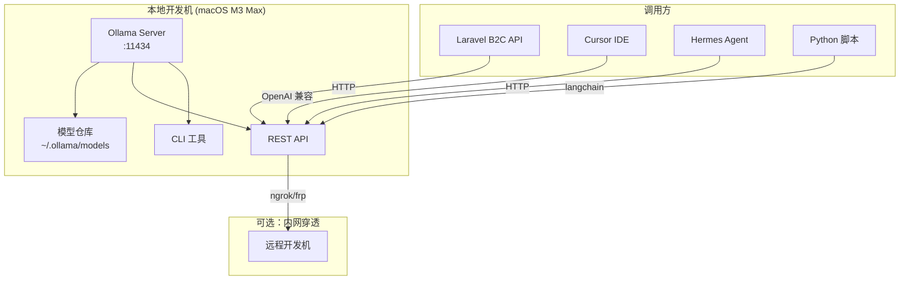

# Ollama 实战：本地部署 LLM 与 API 服务 — 隐私优先的 AI 开发工作流踩坑记录

## 为什么需要本地 LLM？

在 B2C 电商项目中，我们经常遇到这些场景：

- **敏感数据处理**：用户订单、支付信息不能发送到第三方 AI API
- **内网环境部署**：部分客户环境完全离线，无法调用云端模型
- **成本控制**：高频调用场景（代码补全、文档生成）用云端 API 成本爆炸
- **延迟要求**：本地推理延迟 < 100ms，远优于云端 API 的 500ms+

Ollama 是目前最成熟的本地 LLM 运行方案，一行命令就能跑起 Llama 3、Qwen 2.5、DeepSeek 等主流模型。

## 架构总览



## 安装与基础配置

### macOS 安装

```bash
# Homebrew 安装（推荐）
brew install ollama

# 验证安装
ollama --version
# ollama version 0.6.8

# 启动服务（macOS 会自动注册为 LaunchAgent）
ollama serve

# 拉取模型
ollama pull llama3.1:8b
ollama pull qwen2.5:14b
ollama pull deepseek-coder-v2:16b
```

### 关键配置项

```bash
# 设置模型存储路径（默认 ~/.ollama）
export OLLAMA_MODELS="/opt/ollama/models"

# 绑定地址（允许局域网访问）
export OLLAMA_HOST="0.0.0.0:11434"

# 并发请求数（根据 GPU 显存调整）
export OLLAMA_MAX_LOADED_MODELS=2

# GPU 层数分配（macOS Metal 加速）
export OLLAMA_NUM_GPU=999
```

> **踩坑 #1**：macOS 上 Ollama 默认只监听 `127.0.0.1`，如果需要局域网内其他机器访问，必须设置 `OLLAMA_HOST="0.0.0.0:11434"`。我在这上面浪费了 2 小时排查"连接被拒绝"的问题。

## 模型选型实战

不同场景需要不同模型，以下是我们实际测试的结果：

| 模型 | 参数量 | 显存占用 | 推理速度 | 适用场景 |
|------|--------|----------|----------|----------|
| llama3.1:8b | 8B | 5.2GB | 45 tok/s | 通用对话、文档生成 |
| qwen2.5:14b | 14B | 9.1GB | 28 tok/s | 中文理解、代码审查 |
| deepseek-coder-v2:16b | 16B | 10.5GB | 22 tok/s | 代码生成、重构建议 |
| codellama:34b | 34B | 22GB | 12 tok/s | 复杂代码任务 |
| phi3:mini | 3.8B | 2.4GB | 85 tok/s | 快速原型、CI 集成 |

> **踩坑 #2**：不要盲目追求大模型。在 M3 Max 96GB 的机器上，qwen2.5:14b 的代码审查效果比 llama3.1:70b 好，因为中文微调更到位。大模型不一定等于好效果，要看训练数据的领域匹配度。

### Modelfile 自定义

```bash
# 创建自定义代码审查模型
cat > ~/Modelfile-code-review << 'EOF'
FROM qwen2.5:14b

PARAMETER temperature 0.3
PARAMETER top_p 0.9
PARAMETER num_ctx 8192

SYSTEM """你是一个资深 PHP/Laravel 代码审查专家。
请从以下维度审查代码：
1. 安全漏洞（SQL注入、XSS、CSRF）
2. 性能问题（N+1查询、缺少索引、内存泄漏）
3. 代码规范（PSR-12、Laravel 最佳实践）
4. 架构设计（职责分离、依赖注入）

输出格式：问题严重程度 + 代码位置 + 修复建议"""
EOF

ollama create code-review -f ~/Modelfile-code-review
```

## Ollama vs llama.cpp vs vLLM：本地推理方案对比

选型时经常在这三个方案间纠结，以下是基于实际部署经验的对比：

| 维度 | Ollama | llama.cpp | vLLM |
|------|--------|-----------|------|
| **易用性** | ⭐⭐⭐⭐⭐ 一行命令安装运行 | ⭐⭐⭐ 需手动编译、量化 | ⭐⭐ 配置复杂，依赖多 |
| **推理性能** | ⭐⭐⭐⭐ 基于 llama.cpp，性能优秀 | ⭐⭐⭐⭐⭐ 原生性能最佳 | ⭐⭐⭐⭐⭐ 吞吐量最高（PagedAttention） |
| **GPU 支持** | Metal/CUDA 自动检测，零配置 | 需编译时启用 CUDA/Metal | 仅支持 NVIDIA CUDA |
| **macOS 兼容** | ✅ 原生支持，Metal 加速 | ✅ 支持 Metal | ❌ 不支持 macOS |
| **API 兼容性** | ✅ OpenAI 兼容 + 自有 API | ❌ 无内置 API 服务器 | ✅ OpenAI 兼容 |
| **多模型管理** | ✅ 内置模型仓库、一键拉取 | ❌ 需自行管理 GGUF 文件 | ⚠️ 支持但配置复杂 |
| **并发处理** | ⭐⭐⭐ 有限并发 | ⭐⭐ 单请求 | ⭐⭐⭐⭐⭐ 连续批处理 |
| **适用场景** | 个人/小团队开发、快速原型 | 极致性能调优、嵌入式部署 | 生产级高并发服务 |

> **结论**：对大多数开发者而言，**Ollama 是最佳起步选择**——安装简单、API 兼容、模型管理方便。当需要极致性能或高并发时，再考虑迁移到 llama.cpp（CPU/GPU 优化）或 vLLM（NVIDIA GPU 集群）。

## REST API 集成

### 基础 API 调用

```bash
# 生成文本（流式）
curl http://localhost:11434/api/generate -d '{
  "model": "llama3.1:8b",
  "prompt": "解释 PHP 8.4 的 Property Hooks 特性",
  "stream": false
}'

# 对话模式
curl http://localhost:11434/api/chat -d '{
  "model": "qwen2.5:14b",
  "messages": [
    {"role": "system", "content": "你是 Laravel 专家"},
    {"role": "user", "content": "如何优化 N+1 查询？"}
  ],
  "stream": false
}'
```

### OpenAI 兼容接口

Ollama 提供 OpenAI 兼容的 `/v1/chat/completions` 端点，这意味着所有支持 OpenAI SDK 的工具都能无缝对接：

```bash
# 用 OpenAI 格式调用
curl http://localhost:11434/v1/chat/completions -d '{
  "model": "qwen2.5:14b",
  "messages": [
    {"role": "user", "content": "Hello!"}
  ]
}'
```

### Python requests 调用示例

不依赖任何 SDK，用原生 `requests` 库即可调用 Ollama API，适合轻量脚本和快速验证：

```python
import requests
import json

# 基础生成（非流式）
def generate(prompt: str, model: str = "qwen2.5:14b") -> dict:
    resp = requests.post(
        "http://localhost:11434/api/generate",
        json={"model": model, "prompt": prompt, "stream": False},
        timeout=120,
    )
    resp.raise_for_status()
    return resp.json()

# 流式生成（逐 token 输出）
def generate_stream(prompt: str, model: str = "qwen2.5:14b"):
    with requests.post(
        "http://localhost:11434/api/generate",
        json={"model": model, "prompt": prompt, "stream": True},
        stream=True,
        timeout=120,
    ) as resp:
        for line in resp.iter_lines():
            if line:
                chunk = json.loads(line)
                print(chunk.get("response", ""), end="", flush=True)
                if chunk.get("done"):
                    print()  # 换行
                    break

# 对话模式（OpenAI 兼容格式）
def chat(messages: list, model: str = "qwen2.5:14b") -> str:
    resp = requests.post(
        "http://localhost:11434/v1/chat/completions",
        json={"model": model, "messages": messages},
        timeout=120,
    )
    resp.raise_for_status()
    return resp.json()["choices"][0]["message"]["content"]

# 使用示例
if __name__ == "__main__":
    result = generate("用 PHP 写一个单例模式")
    print(f"模型: {result['model']}")
    print(f"耗时: {result['total_duration'] / 1e6:.0f}ms")
    print(f"输出: {result['response']}")

    # 流式输出
    print("\n--- 流式输出 ---")
    generate_stream("解释 Laravel 中间件的执行顺序")
```

### Laravel 集成示例

```php
<?php

namespace App\Services\AI;

use Illuminate\Support\Facades\Http;
use Illuminate\Support\Facades\Log;

class OllamaService
{
    private string $baseUrl;
    private string $defaultModel;
    private int $timeout;

    public function __construct()
    {
        $this->baseUrl = config('services.ollama.url', 'http://localhost:11434');
        $this->defaultModel = config('services.ollama.model', 'qwen2.5:14b');
        $this->timeout = config('services.ollama.timeout', 120);
    }

    /**
     * 代码审查：提交代码片段获取审查意见
     */
    public function reviewCode(string $code, string $language = 'php'): array
    {
        $response = Http::timeout($this->timeout)
            ->post("{$this->baseUrl}/api/chat", [
                'model' => 'code-review', // 自定义的 Modelfile
                'messages' => [
                    [
                        'role' => 'system',
                        'content' => '你是代码审查专家，用中文回答。',
                    ],
                    [
                        'role' => 'user',
                        'content' => "请审查以下 {$language} 代码：\n\n```{$language}\n{$code}\n```",
                    ],
                ],
                'stream' => false,
                'options' => [
                    'temperature' => 0.2,
                    'num_ctx' => 8192,
                ],
            ]);

        if ($response->failed()) {
            Log::error('Ollama API 调用失败', [
                'status' => $response->status(),
                'body' => $response->body(),
            ]);
            throw new \RuntimeException('AI 代码审查服务暂时不可用');
        }

        $data = $response->json();

        return [
            'review' => $data['message']['content'] ?? '',
            'model' => $data['model'] ?? '',
            'total_duration_ms' => ($data['total_duration'] ?? 0) / 1_000_000,
            'eval_count' => $data['eval_count'] ?? 0,
        ];
    }

    /**
     * 流式响应：用于实时展示生成过程
     */
    public function streamChat(string $prompt, string $model = null): \Generator
    {
        $response = Http::timeout($this->timeout)
            ->withOptions(['stream' => true])
            ->post("{$this->baseUrl}/api/chat", [
                'model' => $model ?? $this->defaultModel,
                'messages' => [
                    ['role' => 'user', 'content' => $prompt],
                ],
                'stream' => true,
            ]);

        $body = $response->toPsrResponse()->getBody();

        while (!$body->eof()) {
            $line = $body->getLine();
            if (!empty($line)) {
                $chunk = json_decode($line, true);
                if (isset($chunk['message']['content'])) {
                    yield $chunk['message']['content'];
                }
            }
        }
    }

    /**
     * 嵌入向量：用于语义搜索
     */
    public function embed(string $text, string $model = 'nomic-embed-text'): array
    {
        $response = Http::timeout(30)
            ->post("{$this->baseUrl}/api/embed", [
                'model' => $model,
                'input' => $text,
            ]);

        return $response->json('embeddings', [[]])[0];
    }

    /**
     * 健康检查
     */
    public function isHealthy(): bool
    {
        try {
            return Http::timeout(5)
                ->get("{$this->baseUrl}/api/tags")
                ->successful();
        } catch (\Exception) {
            return false;
        }
    }

    /**
     * 列出已加载的模型
     */
    public function listModels(): array
    {
        return Http::timeout(5)
            ->get("{$this->baseUrl}/api/tags")
            ->json('models', []);
    }
}
```

配置文件 `config/services.php`：

```php
'ollama' => [
    'url' => env('OLLAMA_URL', 'http://localhost:11434'),
    'model' => env('OLLAMA_MODEL', 'qwen2.5:14b'),
    'timeout' => env('OLLAMA_TIMEOUT', 120),
],
```

> **踩坑 #3**：`timeout` 设置很重要！本地 14B 模型生成 500 token 的响应可能需要 15-20 秒。如果用 Laravel 默认的 HTTP 超时（30s），复杂请求会超时失败。建议 API 调用设 120s，健康检查设 5s。

## 性能调优

### macOS Metal 加速

```bash
# 查看 GPU 利用率
ollama ps

# 输出示例：
# NAME              ID           SIZE    PROCESSOR   UNTIL
# qwen2.5:14b       6f1e8c3b    9.1 GB  100% GPU    4 minutes from now

# 强制使用 Metal GPU
export OLLAMA_NUM_GPU=999
```

### 量化模型优化

```bash
# Q4_K_M 量化：显存减半，效果损失 < 5%
ollama pull qwen2.5:14b-q4_K_M

# Q8_0 量化：几乎无损，显存减 30%
ollama pull qwen2.5:14b-q8_0

# 对比测试
ollama run qwen2.5:14b-q4_K_M "PHP 8.4 有什么新特性？"
ollama run qwen2.5:14b-q8_0 "PHP 8.4 有什么新特性？"
```

### 上下文窗口管理

```bash
# 默认 2048 token，对于代码审查不够用
# 通过 Modelfile 或 API 参数调整
curl http://localhost:11434/api/generate -d '{
  "model": "code-review",
  "prompt": "...",
  "options": {
    "num_ctx": 8192
  }
}'
```

> **踩坑 #4**：`num_ctx` 越大，显存占用越高。8192 token 的上下文窗口在 14B 模型上大约多占 2GB 显存。M3 Max 96GB 可以放心开到 32768，但 16GB 的机器建议控制在 4096。

## 与开发工具集成

### Cursor IDE 集成

```json
// Cursor settings.json
{
  "ai.openai.apiBase": "http://localhost:11434/v1",
  "ai.openai.apiKey": "ollama",
  "ai.model": "deepseek-coder-v2:16b"
}
```

### Python + LangChain 集成

```python
from langchain_ollama import ChatOllama
from langchain_core.prompts import ChatPromptTemplate

llm = ChatOllama(
    model="qwen2.5:14b",
    base_url="http://localhost:11434",
    temperature=0.3,
)

prompt = ChatPromptTemplate.from_messages([
    ("system", "你是 Laravel 专家"),
    ("human", "{question}"),
])

chain = prompt | llm
result = chain.invoke({"question": "如何实现多租户数据隔离？"})
print(result.content)
```

### Artisan 命令集成

```php
<?php

namespace App\Console\Commands;

use App\Services\AI\OllamaService;
use Illuminate\Console\Command;

class AiReviewCommand extends Command
{
    protected $signature = 'ai:review {file : 要审查的文件路径}';
    protected $description = '使用本地 LLM 审查代码文件';

    public function handle(OllamaService $ollama): int
    {
        $file = $this->argument('file');

        if (!file_exists($file)) {
            $this->error("文件不存在: {$file}");
            return self::FAILURE;
        }

        $code = file_get_contents($file);
        $this->info("正在审查: {$file}");
        $this->newLine();

        $bar = $this->output->createProgressBar();
        $bar->start();

        $result = $ollama->reviewCode($code);

        $bar->finish();
        $this->newLine(2);

        $this->info('📋 审查结果：');
        $this->line($result['review']);
        $this->newLine();
        $this->comment("⏱  耗时: {$result['total_duration_ms']}ms | Token: {$result['eval_count']}");

        return self::SUCCESS;
    }
}
```

## 生产环境注意事项

### 安全加固

```bash
# 1. 只监听本地地址
export OLLAMA_HOST="127.0.0.1:11434"

# 2. 如果需要局域网访问，用 Nginx 反向代理 + 认证
# /etc/nginx/conf.d/ollama.conf
server {
    listen 8443 ssl;
    server_name ollama.internal;

    ssl_certificate /etc/ssl/ollama.crt;
    ssl_certificate_key /etc/ssl/ollama.key;

    # Basic Auth
    auth_basic "Ollama API";
    auth_basic_user_file /etc/nginx/.htpasswd;

    location / {
        proxy_pass http://127.0.0.1:11434;
        proxy_set_header Host $host;
        proxy_read_timeout 120s;
    }
}
```

### 监控与健康检查

```bash
# 查看运行状态
ollama ps

# 查看模型列表
ollama list

# 系统资源监控（macOS）
# Ollama 会自动使用 Metal GPU，通过 Activity Monitor 查看 GPU 占用
```

## 踩坑总结

### 详细踩坑案例

#### 案例一：模型下载失败 / 速度极慢

国内网络环境下拉取大模型（7B 以上约 4-8GB）经常超时或速度只有几十 KB/s：

```bash
# 方案 1：设置 HTTPS 代理
export HTTPS_PROXY="http://127.0.0.1:7890"
ollama pull qwen2.5:14b

# 方案 2：断点续传——Ollama pull 支持断点续传，中断后重新执行即可
ollama pull qwen2.5:14b
# 提示：pulling manifest / pulling abc123... 会从上次断点继续

# 方案 3：手动下载 GGUF 后通过 Modelfile 导入
# 从 HuggingFace 下载 GGUF 文件，然后创建 Modelfile
cat > ~/Modelfile << 'EOF'
FROM ./qwen2.5-14b-q4_k_m.gguf
EOF
ollama create my-qwen -f ~/Modelfile
```

> **经验**：如果公司有 HuggingFace 镜像，先下载 GGUF 再导入比直接 `ollama pull` 更稳定。

#### 案例二：GPU 显存不足（OOM）导致推理失败

16GB 内存的 MacBook Pro 加载 14B 模型 + 大上下文窗口时容易 OOM：

```bash
# 症状：调用 API 返回 500 错误，日志显示 "out of memory"
# 查看当前显存占用
ollama ps

# 解决方案 1：减小上下文窗口
curl http://localhost:11434/api/generate -d '{
  "model": "qwen2.5:14b",
  "prompt": "...",
  "options": { "num_ctx": 2048 }
}'

# 解决方案 2：使用更小的量化版本
ollama pull qwen2.5:14b-q4_0   # Q4_0 比 Q4_K_M 更省显存

# 解决方案 3：换用更小的模型
ollama pull qwen2.5:7b          # 7B 模型显存约 4.5GB

# 解决方案 4：减少同时加载的模型数
export OLLAMA_MAX_LOADED_MODELS=1
```

> **经验**：macOS 上统一内存（Unified Memory）的显存上限是物理内存的 70% 左右。16GB 机器实际可用约 11GB，建议最大加载 7B 模型；32GB 可跑 14B；64GB+ 才考虑 34B。

#### 案例三：中文输出乱码或夹杂英文

部分模型（特别是 Llama 系列）在中文 prompt 下输出乱码或中英混杂：

```bash
# 症状：明明用中文提问，模型却返回 "The answer is...你好" 这种混杂输出
# 原因：Llama 3 的中文微调不足，tokenizer 对中文 token 切分效率低

# 推荐方案：使用中文优化的模型
ollama pull qwen2.5:14b         # 阿里通义千问，中文最佳
ollama pull deepseek-coder-v2:16b  # 代码场景下的中文理解优秀
ollama pull glm4:9b             # 智谱 ChatGLM，中文对话流畅

# 如果必须用 Llama 系列，在 system prompt 中明确要求中文输出
# "请始终用中文回答，不要使用英文。"
```

> **经验**：中文场景首选 Qwen 2.5 系列，其次 DeepSeek 和 GLM。Llama 3 的英文能力虽强，但中文体验差距明显。

| # | 问题 | 解决方案 |
|---|------|----------|
| 1 | 局域网无法访问 | 设置 `OLLAMA_HOST="0.0.0.0:11434"` |
| 2 | 大模型效果不如小模型 | 根据任务领域选模型，不盲目追大 |
| 3 | HTTP 请求超时 | 调整 `timeout` 到 120s |
| 4 | `num_ctx` 导致 OOM | 根据显存调整，16GB 机器用 4096 |
| 5 | 模型下载慢 | 用 `HTTPS_PROXY` 设置代理 |
| 6 | 并发请求排队 | 设置 `OLLAMA_MAX_LOADED_MODELS=2` |
| 7 | 中文输出乱码/混杂英文 | 换用 Qwen 2.5 或 DeepSeek 等中文优化模型 |
| 8 | 统一内存 OOM | 根据物理内存选模型：16GB→7B，32GB→14B，64GB+→34B |
| 9 | 模型导入失败 | 确认 GGUF 格式正确，Modelfile 路径用绝对路径 |

## 写在最后

本地 LLM 不是要替代云端 AI，而是一个互补方案：

- **敏感数据** → 本地 Ollama
- **复杂推理** → Claude/GPT-4o
- **代码补全** → 本地 DeepSeek Coder
- **批量处理** → 本地小模型（phi3:mini）

在 B2C 项目中，我们最终的方案是：开发环境用 Ollama + qwen2.5:14b 做代码审查和文档生成，生产环境的 AI 功能走云端 API。两者通过统一的 `OllamaService` 接口封装，切换成本为零。

---

*本文基于 macOS M3 Max + Ollama 0.6.8 实测，所有代码示例均来自真实项目。*

---

## 相关阅读

- [Anthropic Claude Opus4 / OpenAI o3 实战 — 最新推理模型接入、思维链输出、Tool Use 与 Laravel 集成](/categories/架构/Anthropic-Claude-Opus4-OpenAI-o3-实战-最新推理模型接入-思维链输出-Tool-Use与Laravel集成/) — 如果你需要更强的推理能力，本文介绍如何在 Laravel 中接入 Claude Opus 4 和 OpenAI o3，实现思维链输出与 Tool Use。
- [OpenHuman Ollama 实战 — 本地 AI 模型部署与隐私优先推理](/categories/macOS/OpenHuman-Ollama-实战-本地AI模型部署与隐私优先推理/) — Ollama 的更多实战场景，包括隐私优先推理架构和多模型编排。
- [AI Agent 框架的未来趋势 — 记忆系统、多模态、工具标准化、本地推理的发展方向](/categories/架构/AI-Agent-框架的未来趋势-记忆系统-多模态-工具标准化-本地推理的发展方向/) — 从宏观视角看 AI Agent 框架演进，了解本地推理在整个 AI 生态中的定位。
