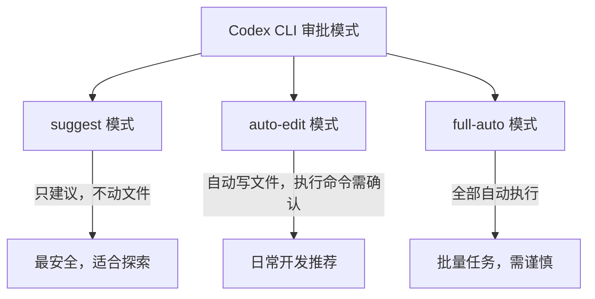
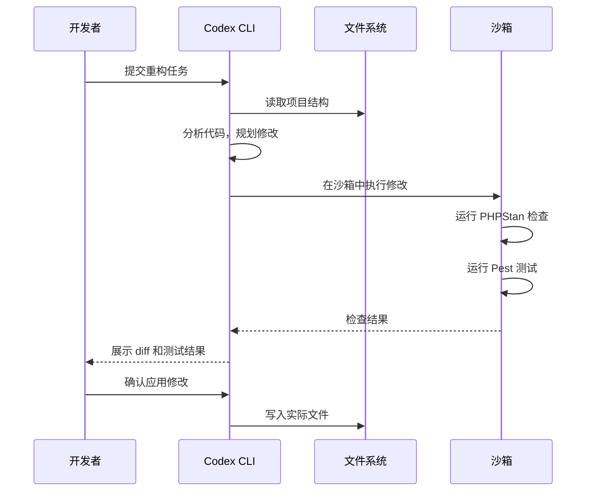
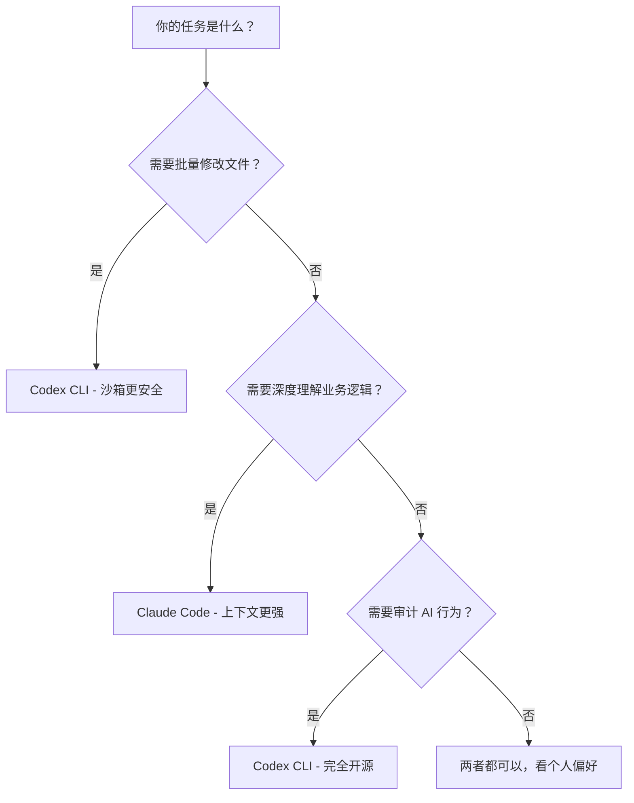

> 一句话总结：**Codex CLI 是 OpenAI 开源的终端 AI 编程代理，适合批量代码生成和自动化重构场景，在 "读上下文 → 规划 → 执行" 的工作流中表现出色，但需要理解它的沙箱机制和审批模式才能安全高效地使用。**

## 1. 为什么需要 Codex CLI？

在 KKday B2C 后端团队，30+ 个 Laravel 仓库维护的日常痛点：

- **批量重构**：PHP 8.1 Enum 替换魔术字符串，涉及 30 个仓库、数千处修改
- **测试生成**：新接手的仓库覆盖率 0%，需要快速补齐核心路径测试
- **代码规范化**：PHPStan Level 8 升级，大量类型声明需要补充

Claude Code CLI 已经能做这些事，但 Codex CLI 有几个独特优势：
- **完全开源**（Apache 2.0），可以审计每行代码
- **沙箱执行**：文件操作在沙箱中完成，不会误删生产配置
- **自动审批模式**：适合批量任务，减少手动确认

## 2. 安装与基础配置

### 2.1 安装

```bash
# 系统要求：Node.js 22+
node --version  # v22.14.0

# 通过 npm 全局安装
npm install -g @openai/codex

# 验证安装
codex --version
```

### 2.2 认证配置

```bash
# 方式一：环境变量（推荐 CI 场景）
export OPENAI_API_KEY="sk-proj-xxxx"

# 方式二：配置文件（推荐本地开发）
# ~/.codex/config.toml
cat << 'EOF' > ~/.codex/config.toml
model = "o4-mini"
approval_mode = "suggest"  # suggest | auto-edit | full-auto
EOF
```

### 2.3 三种审批模式

这是 Codex CLI 最核心的设计，也是最容易踩坑的地方：



| 模式 | 文件读写 | 命令执行 | 适用场景 |
|------|---------|---------|---------|
| `suggest` | 只读 | 只建议 | 探索代码库、代码审查 |
| `auto-edit` | 自动写入 | 需确认 | 日常开发、单文件修改 |
| `full-auto` | 自动写入 | 自动执行 | 批量重构、CI 流水线 |

## 3. 实战：Laravel 仓库批量重构

### 3.1 场景：用 Enum 替换魔术字符串

30 个仓库中，状态码硬编码到处都是：

```php
// 重构前：魔术字符串散落在各处
if ($order->status === '1') {
    // 待支付
} elseif ($order->status === '2') {
    // 已支付
} elseif ($order->status === '3') {
    // 已取消
}
```

用 Codex CLI 批量处理：

```bash
# 进入项目目录
cd ~/GitHub/kkday/order-service

# 使用 auto-edit 模式，让 Codex 自动修改文件
codex --approval-mode auto-edit \
    "扫描整个项目，将所有订单状态的魔术字符串（'1','2','3','4','5'）替换为 OrderStatus Enum。
     创建 app/Enums/OrderStatus.php，使用 PHP 8.1 的 backed enum。
     保持所有现有逻辑不变，只做等价替换。"
```

Codex CLI 的执行流程：



### 3.2 生成的 Enum 文件

Codex CLI 生成的代码质量出乎意料地好：

```php
<?php

namespace App\Enums;

enum OrderStatus: string
{
    case Pending = '1';
    case Paid = '2';
    case Cancelled = '3';
    case Refunding = '4';
    case Refunded = '5';

    /**
     * 获取状态的中文描述
     */
    public function label(): string
    {
        return match ($this) {
            self::Pending => '待支付',
            self::Paid => '已支付',
            self::Cancelled => '已取消',
            self::Refunding => '退款中',
            self::Refunded => '已退款',
        };
    }

    /**
     * 判断是否为终态
     */
    public function isTerminal(): bool
    {
        return in_array($this, [
            self::Cancelled,
            self::Refunded,
        ]);
    }

    /**
     * 获取允许的下一个状态
     */
    public function allowedTransitions(): array
    {
        return match ($this) {
            self::Pending => [self::Paid, self::Cancelled],
            self::Paid => [self::Refunding, self::Cancelled],
            self::Refunding => [self::Refunded],
            default => [],
        };
    }
}
```

### 3.3 实际替换效果

```php
// 重构后
use App\Enums\OrderStatus;

if ($order->status === OrderStatus::Pending->value) {
    // 待支付
}

// 更好的写法：直接用 Enum 实例
$orderStatus = OrderStatus::from($order->status);
if ($orderStatus === OrderStatus::Pending) {
    // 待支付
}
```

### 3.4 踩坑：上下文窗口溢出

**问题**：30+ 仓库的 monorepo 项目，文件数量超过 500，Codex 读取上下文时超出 token 限制。

```
Error: Context window exceeded (128K tokens)
```

**解决方案**：缩小任务范围，分模块执行：

```bash
# 不要一次性扫描整个项目
# ❌ 错误做法
codex "重构整个项目的所有魔术字符串"

# ✅ 正确做法：分模块
codex "重构 app/Services/Order/ 目录下的订单状态魔术字符串"
codex "重构 app/Http/Controllers/ 目录下的订单状态魔术字符串"
codex "重构 app/Jobs/ 目录下的订单状态魔术字符串"
```

### 3.5 实战：用 Codex CLI 重构 Laravel Controller

除了 Enum 替换，Controller 重构也是 Codex CLI 的高频场景。以一个典型的"胖 Controller"为例：

**重构前**（业务逻辑混在 Controller 中）：

```php
<?php

namespace App\Http\Controllers\Api;

use Illuminate\Http\Request;
use Illuminate\Support\Facades\DB;
use Illuminate\Support\Facades\Http;

class OrderController extends Controller
{
    public function store(Request $request)
    {
        // 手动验证（应该用 FormRequest）
        if (!$request->has('product_id')) {
            return response()->json(['error' => '缺少 product_id'], 422);
        }

        // 业务逻辑直接写在 Controller 里
        $product = DB::table('products')->where('id', $request->product_id)->first();
        if (!$product || $product->stock < $request->quantity) {
            return response()->json(['error' => '库存不足'], 400);
        }

        $orderId = DB::table('orders')->insertGetId([
            'user_id' => auth()->id(),
            'product_id' => $request->product_id,
            'quantity' => $request->quantity,
            'amount' => $product->price * $request->quantity,
            'status' => '1',  // 魔术字符串
            'created_at' => now(),
        ]);

        // 直接 HTTP 调用外部服务
        Http::post('https://payment.example.com/charge', [
            'order_id' => $orderId,
            'amount' => $product->price * $request->quantity,
        ]);

        return response()->json(['id' => $orderId]);
    }
}
```

**用 Codex CLI 重构的指令**：

```bash
codex --approval-mode auto-edit \
    "重构 app/Http/Controllers/Api/OrderController.php：
     1. 将业务逻辑提取到 app/Services/OrderService.php
     2. 创建 app/Http/Requests/StoreOrderRequest.php 用于表单验证
     3. 将魔术字符串 '1','2','3' 替换为 OrderStatus Enum
     4. 将直接 HTTP 调用替换为 app/Services/PaymentGateway 封装
     5. Controller 只保留路由、参数注入和响应返回
     6. 保持所有现有 API 端点的请求和响应格式不变"
```

**重构后**（清晰的职责分离）：

```php
<?php

namespace App\Http\Controllers\Api;

use App\Http\Requests\StoreOrderRequest;
use App\Services\OrderService;
use Illuminate\Http\JsonResponse;

class OrderController extends Controller
{
    public function __construct(
        private readonly OrderService $orderService
    ) {}

    public function store(StoreOrderRequest $request): JsonResponse
    {
        $order = $this->orderService->create($request->validated());

        return response()->json($order, 201);
    }
}
```

对应的 `OrderService`：

```php
<?php

namespace App\Services;

use App\Enums\OrderStatus;
use App\Models\Order;

class OrderService
{
    public function __construct(
        private readonly PaymentGateway $paymentGateway,
    ) {}

    public function create(array $data): Order
    {
        $product = $this->getProduct($data['product_id']);

        $this->validateStock($product, $data['quantity']);

        $order = Order::create([
            'user_id' => auth()->id(),
            'product_id' => $product->id,
            'quantity' => $data['quantity'],
            'amount' => $product->price * $data['quantity'],
            'status' => OrderStatus::Pending,
        ]);

        return $order;
    }

    private function getProduct(int $productId): object
    {
        return DB::table('products')->where('id', $productId)->firstOrFail();
    }

    private function validateStock(object $product, int $quantity): void
    {
        if ($product->stock < $quantity) {
            throw new InsufficientStockException(
                "商品 {$product->id} 库存不足，当前库存: {$product->stock}"
            );
        }
    }
}
```

**关键点**：Codex CLI 会自动识别 Controller 中的业务逻辑，并按照 `.codex/instructions.md` 中的约定（如"Controller 只做参数校验和路由，业务逻辑放 Service"）进行重构。如果项目没有配置该文件，重构质量会明显下降。

## 4. 实战：自动化测试生成

### 4.1 为遗留 Service 生成 Pest 测试

接手一个没有测试的订单服务：

```bash
codex --approval-mode auto-edit \
    "为 app/Services/OrderService.php 生成完整的 Pest 测试。
     要求：
     1. 使用 Pest 语法，不是 PHPUnit
     2. Mock 所有外部依赖（PaymentGateway、NotificationService）
     3. 覆盖所有公开方法的正常路径和异常路径
     4. 测试文件放在 tests/Unit/Services/OrderServiceTest.php
     5. 使用 Laravel 的 Orchestra Testbench"
```

### 4.2 生成的测试代码

```php
<?php

use App\Enums\OrderStatus;
use App\Models\Order;
use App\Services\OrderService;
use App\Services\PaymentGateway;
use App\Services\NotificationService;
use Illuminate\Foundation\Testing\RefreshDatabase;

uses(RefreshDatabase::class);

beforeEach(function () {
    $this->paymentGateway = Mockery::mock(PaymentGateway::class);
    $this->notificationService = Mockery::mock(NotificationService::class);
    $this->service = new OrderService(
        $this->paymentGateway,
        $this->notificationService
    );
});

describe('OrderService::createOrder', function () {
    it('创建订单并返回订单实例', function () {
        $orderData = [
            'user_id' => 1,
            'product_id' => 100,
            'quantity' => 2,
            'amount' => 299.00,
        ];

        $order = $this->service->createOrder($orderData);

        expect($order)->toBeInstanceOf(Order::class)
            ->and($order->status)->toBe(OrderStatus::Pending->value)
            ->and($order->amount)->toBe(299.00);
    });

    it('库存不足时抛出异常', function () {
        $orderData = [
            'user_id' => 1,
            'product_id' => 999,  // 库存为 0 的商品
            'quantity' => 1,
            'amount' => 99.00,
        ];

        $this->service->createOrder($orderData);
    })->throws(\App\Exceptions\InsufficientStockException::class);
});

describe('OrderService::processPayment', function () {
    it('支付成功后更新订单状态为已支付', function () {
        $order = Order::factory()->create([
            'status' => OrderStatus::Pending->value,
        ]);

        $this->paymentGateway
            ->shouldReceive('charge')
            ->once()
            ->with($order->amount, $order->payment_method)
            ->andReturn(['transaction_id' => 'txn_123']);

        $this->notificationService
            ->shouldReceive('sendPaymentConfirmation')
            ->once();

        $result = $this->service->processPayment($order);

        expect($result->status)->toBe(OrderStatus::Paid->value)
            ->and($result->transaction_id)->toBe('txn_123');
    });

    it('支付失败时保持待支付状态并记录错误', function () {
        $order = Order::factory()->create([
            'status' => OrderStatus::Pending->value,
        ]);

        $this->paymentGateway
            ->shouldReceive('charge')
            ->once()
            ->andThrow(new \App\Exceptions\PaymentFailedException('余额不足'));

        $this->service->processPayment($order);

        expect($order->fresh()->status)->toBe(OrderStatus::Pending->value);
    });
});
```

### 4.3 踩坑：Mock 策略不准确

**问题**：Codex 生成的 Mock 基于方法签名，但不了解业务逻辑的实际调用方式，导致测试"绿了但没用"。

**解决方案**：先给 Codex 提供接口文档或示例：

```bash
# 先提供现有测试作为参考
codex --approval-mode auto-edit \
    "参考 tests/Unit/Services/ProductServiceTest.php 的 Mock 风格，
     为 OrderService 生成类似的测试。
     重点测试 processPayment 的支付回调异常处理。"
```

## 5. 实战：代码审查与安全扫描

### 5.1 自动化代码审查

```bash
codex --approval-mode suggest \
    "审查 app/Http/Controllers/API/OrderController.php，
     检查以下安全问题：
     1. SQL 注入风险（特别是 whereRaw 的使用）
     2. 未验证的用户输入
     3. 缺失的授权检查
     4. 敏感数据泄露（是否在响应中暴露了不该暴露的字段）
     输出格式：每个问题标注严重级别（Critical/High/Medium/Low）"
```

### 5.2 输出示例

```markdown
## 代码审查报告

### Critical
- **第 45 行**：`whereRaw("status = '{$request->status}'")` 存在 SQL 注入风险
  → 建议：使用 `where('status', $request->status)`

### High  
- **第 78 行**：`$order->toArray()` 暴露了 `internal_note` 字段
  → 建议：使用 API Resource 过滤字段

### Medium
- **第 23 行**：缺少 `$this->authorize('view', $order)` 权限检查
  → 建议：添加 Policy 授权
```

## 6. Codex CLI vs Claude Code vs Cursor 详细对比表

在同一个 Laravel 项目上测试，对比三款 AI 编程工具的表现：

### 6.1 核心特性对比

| 维度 | Codex CLI | Claude Code CLI | Cursor |
|------|-----------|-----------------|--------|
| **定位** | 终端 AI 编程代理 | 终端 AI 编程代理 | AI-native IDE |
| **底层模型** | o4-mini / o3 | Claude 4 Sonnet / Opus | 多模型可选（GPT-4o, Claude 等） |
| **开源** | ✅ Apache 2.0 完全开源 | ❌ 闭源 | ❌ 闭源 |
| **运行环境** | 终端 / CI | 终端 / CI | GUI 桌面应用 |
| **沙箱执行** | ✅ 文件操作沙箱隔离 | ❌ 直接操作文件系统 | ⚠️ 工作区隔离，非沙箱 |
| **上下文窗口** | 128K tokens（o4-mini） | 200K tokens | 取决于所选模型 |
| **审批模式** | suggest / auto-edit / full-auto | 三种权限级别 | 内联确认 + Composer |
| **批量重构** | ★★★★★ 沙箱+自动审批 | ★★★☆☆ 需手动确认 | ★★★☆☆ 多文件编辑但无沙箱 |
| **代码生成质量** | ★★★★☆ 结构清晰 | ★★★★★ 贴近项目风格 | ★★★★☆ 依赖模型选择 |
| **上下文理解** | ★★★☆☆ 大项目易丢失 | ★★★★☆ 长上下文更强 | ★★★★☆ 索引整个代码库 |

### 6.2 定价对比

| 项目 | Codex CLI | Claude Code CLI | Cursor |
|------|-----------|-----------------|--------|
| **免费层** | 无（需 API Key） | 无（需 API Key 或订阅） | 免费版有限额度 |
| **付费方式** | OpenAI API 按 token 计费 | Anthropic API 按 token 计费 | $20/月 Pro，$40/月 Business |
| **典型单次成本** | $0.01 ~ $0.10（取决于任务） | $0.02 ~ $0.20 | 包含在订阅中 |
| **批量任务成本** | 较低（o4-mini 便宜） | 较高（Claude 4 较贵） | 受限于 Fast Requests 配额 |
| **企业方案** | OpenAI Enterprise | Anthropic Enterprise | Cursor Business |

### 6.3 沙箱模式对比

| 安全特性 | Codex CLI | Claude Code CLI | Cursor |
|---------|-----------|-----------------|--------|
| **文件操作隔离** | ✅ macOS Seatbelt 沙箱 | ❌ 无沙箱 | ⚠️ 工作区限制 |
| **网络隔离** | ✅ 可配置禁止网络访问 | ❌ 无网络隔离 | ❌ 无网络隔离 |
| **命令执行限制** | ✅ 可配置白名单 | ⚠️ 基本权限控制 | ⚠️ 终端权限控制 |
| **误操作回滚** | ✅ 沙箱内可安全回滚 | ⚠️ 依赖 git 手动回滚 | ⚠️ 依赖 git 手动回滚 |
| **CI 安全性** | ★★★★★ 天然适合 | ★★★☆☆ 需要额外配置 | ★☆☆☆☆ 不适合 CI |

### 6.4 选择建议



## 7. 高级技巧

### 7.1 配置项目级 `.codex/instructions.md`

类似 `.cursorrules`，为项目定制 AI 行为：

```markdown
# 项目约定

## 技术栈
- Laravel 10 + PHP 8.1
- Pest 测试框架
- PHPStan Level 8

## 代码规范
- Controller 只做参数校验和路由，业务逻辑放 Service
- 使用 Enum 替代所有魔术字符串
- 所有公开方法必须有 PHPDoc
- 测试必须覆盖 happy path + 至少一个异常路径

## 禁止事项
- 不要使用 `DB::raw()`，除非经过团队 Review
- 不要在 Controller 中直接调用 Model
- 不要使用 `dd()` 或 `dump()` 在生产代码中
```

### 7.2 与 CI/CD 集成

```yaml
# .github/workflows/codex-review.yml
name: Codex Code Review
on:
  pull_request:
    paths:
      - 'app/**'
      - 'routes/**'

jobs:
  review:
    runs-on: ubuntu-latest
    steps:
      - uses: actions/checkout@v4
      - uses: actions/setup-node@v4
        with:
          node-version: '22'
      - run: npm install -g @openai/codex
      - env:
          OPENAI_API_KEY: ${{ secrets.OPENAI_API_KEY }}
        run: |
          codex --approval-mode suggest \
            "Review the changes in this PR. Focus on:
             1. Security vulnerabilities
             2. Performance issues
             3. Logic errors
             Output as markdown." > review.md
      - uses: actions/github-script@v7
        with:
          script: |
            const fs = require('fs');
            const review = fs.readFileSync('review.md', 'utf8');
            github.rest.issues.createComment({
              owner: context.repo.owner,
              repo: context.repo.repo,
              issue_number: context.issue.number,
              body: review
            });
```

## 8. 安全最佳实践

Codex CLI 的三种审批模式决定了自动化的边界。以下是经验证的分类指南：

### 8.1 可以自动审批的任务 ✅

| 操作类型 | 推荐模式 | 原因 |
|---------|---------|------|
| **代码格式化** | full-auto | 只改变格式，不影响逻辑 |
| **生成测试文件** | auto-edit | 新增文件，不影响现有代码 |
| **创建 Enum / DTO** | auto-edit | 新增文件，风险低 |
| **重构单文件内部逻辑** | auto-edit | 范围可控，可 diff 审查 |
| **添加类型声明** | auto-edit | PHP 类型声明不影响运行时行为 |
| **生成 API 文档注释** | full-auto | 只修改注释，无副作用 |

### 8.2 必须手动审查的任务 ⚠️

| 操作类型 | 推荐模式 | 原因 |
|---------|---------|------|
| **修改数据库迁移** | suggest | 数据迁移不可逆，必须逐行审查 |
| **修改认证/授权逻辑** | suggest | 安全关键路径，误改可导致漏洞 |
| **重构多个文件** | auto-edit | 范围大，需逐文件确认 diff |
| **涉及外部 API 调用的变更** | suggest | 可能影响外部服务行为 |
| **删除文件** | suggest | full-auto 模式下删除操作不可逆 |
| **修改 .env / 配置文件** | suggest | 误改配置可能导致服务不可用 |

### 8.3 安全配置建议

```toml
# ~/.codex/config.toml - 推荐的安全配置
model = "o4-mini"
approval_mode = "suggest"  # 默认使用最安全的模式

# 仅在需要批量任务时临时切换
# codex --approval-mode auto-edit "..."
```

**最佳实践**：
1. **永远不要在生产环境使用 full-auto 模式**
2. **批量任务前先用 suggest 模式预览 diff**
3. **对数据库操作始终使用 suggest 模式**
4. **在 `.codex/instructions.md` 中明确禁止危险操作**（如禁止 `DB::raw()`、禁止删除迁移文件）
5. **CI 流水线中使用 suggest 模式**，只做代码审查不自动修改

### 8.4 权限控制命令行参数

```bash
# 限制 Codex 只能读取文件，不能写入
codex --approval-mode suggest "审查代码"

# 允许自动写入文件，但命令执行需要确认（推荐日常使用）
codex --approval-mode auto-edit "重构这个 Controller"

# 全自动模式（仅用于低风险批量任务，且最好在 CI 中使用）
codex --approval-mode full-auto "格式化所有 PHP 文件"
```

## 9. 故障排查：常见错误与解决方案

### 9.1 API 认证错误

```
Error: Invalid API key provided
```

**原因**：`OPENAI_API_KEY` 未设置或已过期。

**解决**：
```bash
# 检查环境变量
echo $OPENAI_API_KEY

# 重新设置
export OPENAI_API_KEY="sk-proj-xxxx"

# 或检查配置文件
cat ~/.codex/config.toml
```

### 9.2 上下文窗口溢出

```
Error: Context window exceeded (128K tokens)
```

**原因**：项目文件太多，超出模型上下文限制。

**解决**：
```bash
# ❌ 错误：一次性扫描整个项目
codex "重构整个项目的所有代码"

# ✅ 正确：分模块、分目录执行
codex "重构 app/Services/ 目录"
codex "重构 app/Http/Controllers/ 目录"

# ✅ 更好：使用 .codex/instructions.md 缩小范围
# 在 instructions.md 中指定只关注特定目录
```

### 9.3 API 限流 (429)

```
Error: Rate limit exceeded (HTTP 429)
```

**原因**：批量任务请求过快，触发 API 限流。

**解决**：
```bash
# 方案一：在脚本中加入延迟
for dir in app/Services app/Http/Controllers app/Jobs; do
    codex --approval-mode auto-edit "重构 $dir 目录下的魔术字符串"
    sleep 5  # 等待 5 秒再执行下一个
done

# 方案二：减少并发
codex --max-tokens 4096 "重构这个文件"
```

### 9.4 沙箱权限不足

```
Error: Permission denied (sandbox)
```

**原因**：沙箱限制了文件操作权限，可能尝试访问了沙箱外的路径。

**解决**：
```bash
# 确保在项目根目录下运行
cd ~/GitHub/my-project
codex .

# 如果需要访问项目外的文件，使用 suggest 模式
codex --approval-mode suggest "..."
```

### 9.5 生成的代码不符合项目规范

**原因**：缺少 `.codex/instructions.md` 配置文件。

**解决**：
```bash
# 在项目根目录创建配置文件
mkdir -p .codex
cat > .codex/instructions.md << 'EOF'
# 项目规范
- 使用 Laravel 10 + PHP 8.1
- 所有 Enum 必须是 backed enum
- 测试使用 Pest 语法
- Controller 只做路由和参数校验
- 业务逻辑放 Service 层
- 禁止使用 DB::raw()，除非经过 Review
EOF

# 然后重新运行 Codex CLI
codex --approval-mode auto-edit "重构这个模块"
```

### 9.6 Node.js 版本不兼容

```
Error: Codex CLI requires Node.js 22+
```

**解决**：
```bash
# 使用 nvm 切换 Node.js 版本
nvm install 22
nvm use 22

# 验证版本
node --version  # 应显示 v22.x.x

# 重新安装 Codex CLI
npm install -g @openai/codex
```

## 10. 踩坑记录汇总

| # | 问题 | 原因 | 解决方案 |
|---|------|------|---------| 
| 1 | 上下文窗口溢出 | 项目文件太多 | 分模块执行，缩小范围 |
| 2 | 生成代码风格不一致 | 不了解项目约定 | 配置 `.codex/instructions.md` |
| 3 | Mock 策略不准确 | 缺乏业务上下文 | 提供现有测试作参考 |
| 4 | `full-auto` 模式误删文件 | 沙箱外的操作不可逆 | 关键操作用 `auto-edit` |
| 5 | API 限流 (429) | 批量任务请求过快 | 加 `--max-tokens` 限制 |
| 6 | 生成的 Enum 没有 backing type | 默认生成纯 Enum | 明确指定 `backed enum` |

## 11. 总结

Codex CLI 的核心价值在于**安全的批量自动化**——沙箱机制让你敢放手让它跑批量任务，开源代码让你能审计它的每一步操作。但它的上下文理解能力目前不如 Claude Code，复杂业务逻辑的重构仍需人工把关。

**推荐工作流**：
1. 用 Codex CLI 做批量重构、测试生成等"机械性"工作
2. 用 Claude Code 做需要深度理解业务的代码审查和架构建议
3. 用 Cursor 做日常编码和多文件编辑
4. 三者互补，而不是互斥

---

*本文基于 OpenAI Codex CLI 2025.x 版本，Laravel 10 + PHP 8.1 项目实测。如有更新会同步修正。*

## 相关阅读

- [Claude Code CLI 实战](/categories/macOS/claude-code-cli-guide-commands-ai/)
- [Cursor IDE 实战](/categories/macOS/cursor-ide-guide-ai/)
- [GitHub Copilot 实战](/categories/macOS/github-copilot-guide-testing/)
- [Hermes Agent 实战](/categories/macOS/hermes-agent-guide-ai/)
