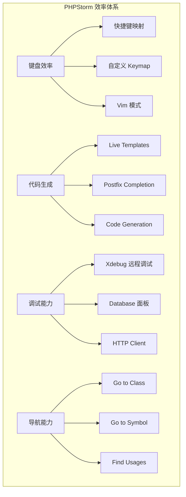
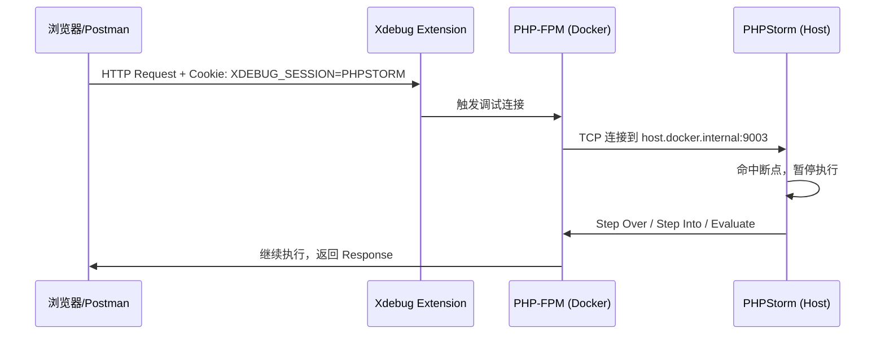

---

title: PHPStorm-高效开发实战-快捷键-Live-Templates-调试技巧-Laravel-B2C-API踩坑记录
keywords: [PHPStorm, Live, Templates, Laravel, B2C, API, 高效开发实战, 快捷键, 调试技巧, 踩坑记录]
cover: https://images.unsplash.com/photo-1517694712202-14dd9538aa97?w=1200&h=630&fit=crop
images:
  - https://images.unsplash.com/photo-1517694712202-14dd9538aa97?w=1200&h=630&fit=crop
date: 2026-05-16 23:20:08
updated: 2026-05-16 23:23:54
categories:
- macos
- editor
tags:
- Laravel
- macOS
description: 本文基于 KKday 30+ Laravel 仓库实战经验，全面解析 PHPStorm 高效开发工作流。涵盖 macOS 键位映射、Laravel Live Templates、Postfix Completion、Database 面板、Xdebug 远程断点、HTTP Client API 测试、代码导航与性能调优等高频场景，附带 8 个踩坑记录与解决方案，帮助开发者告别鼠标依赖，高效写代码。
---


# PHPStorm 高效开发实战：快捷键、Live Templates、调试技巧

## 为什么写这篇文章？

在 KKday B2C Backend Team 的 30+ Laravel 仓库中，PHPStorm 是团队统一使用的 IDE。刚开始用的时候，我跟大多数人一样——鼠标点来点去，`Cmd+Shift+F` 全局搜索当万能工具。直到有一天看到同事双手不离键盘就完成了 Controller → Service → Repository → Migration 的全链路跳转，我才意识到自己一直在"用记事本的方式用 IDE"。

这篇文章是我两年 PHPStorm 使用经验的浓缩，专注 **Laravel B2C API 开发** 场景，不讲泛泛而谈的"入门指南"，只讲能直接提升效率的实战技巧。

---

## 整体效率架构



---

## 一、macOS 键位映射：告别鼠标

PHPStorm 默认 Keymap 是 `macOS`，但以下自定义配置是我强烈推荐的：

### 核心快捷键 Top 20

| 操作 | 默认快捷键 | 说明 |
|------|-----------|------|
| 全局搜索类 | `Cmd + O` | Go to Class，输入类名即时跳转 |
| 全局搜索文件 | `Cmd + Shift + O` | Go to File，支持路径模糊匹配 |
| 全局搜索符号 | `Cmd + Option + O` | Go to Symbol，搜索方法/常量/属性 |
| 最近文件 | `Cmd + E` | 最近打开的文件列表 |
| 最近修改位置 | `Cmd + Shift + Backspace` | 光标回到上次编辑的地方 |
| 跳转到定义 | `Cmd + Click` 或 `Cmd + B` | 跟踪方法/类定义 |
| 查找用法 | `Option + F7` | Find Usages，看某个方法在哪被调用 |
| 重构-重命名 | `Shift + F6` | 安全重命名类/方法/变量 |
| 提取方法 | `Cmd + Option + M` | 选中代码块提取为方法 |
| 提取常量 | `Cmd + Option + C` | 选中值提取为类常量 |
| 提取变量 | `Cmd + Option + V` | 选中表达式提取为变量 |
| 快速修复 | `Option + Enter` | 导入类、实现接口、修复警告 |
| 格式化代码 | `Cmd + Option + L` | 代码格式化 |
| 注释/取消注释 | `Cmd + /` | 单行注释 |
| 块注释 | `Cmd + Option + /` | 多行块注释 |
| 运行测试 | `Ctrl + Shift + R` | 运行当前测试文件 |
| 调试 | `Ctrl + D` | 以 Debug 模式运行 |
| 切换终端 | `Option + F12` | 打开/关闭内置终端 |
| 项目视图 | `Cmd + 1` | 切换到 Project 面板 |
| 数据库面板 | `Cmd + 8` | 切换到 Database 面板 |

### 我的自定义 Keymap 调整

在 `Preferences → Keymap` 中，我做了以下自定义：

```xml
<!-- ~/Library/Application Support/JetBrains/PhpStorm2024.1/keymaps/Custom.xml -->
<keymap version="1" name="Custom" parent="$default">
  <!-- Cmd+Shift+T: 快速跳转到对应的测试文件 -->
  <action id="GotoTest">
    <keyboard-shortcut first-keystroke="ctrl shift t" />
  </action>
  
  <!-- Cmd+Shift+M: 快速跳转到对应的 Model/Service -->
  <action id="GotoRelated">
    <keyboard-shortcut first-keystroke="ctrl shift m" />
  </action>
  
  <!-- Ctrl+Shift+F12: 隐藏所有面板，专注代码 -->
  <action id="HideAllWindows">
    <keyboard-shortcut first-keystroke="ctrl shift f12" />
  </action>
</keymap>
```

**踩坑 #1：macOS 系统快捷键冲突**

macOS 的 `Cmd + Shift + A`（输入法切换）会与 PHPStorm 的 `Search Everywhere` 冲突。解决方案：

```
系统设置 → 键盘 → 键盘快捷键 → 输入法 → 取消绑定
```

我曾花 30 分钟排查为什么 `Search Everywhere` 快捷键"失效"，结果是被输入法劫持了。

---

## 二、Live Templates：Laravel 开发的代码加速器

Live Templates 是 PHPStorm 中最被低估的功能。在 30+ 仓库中，我们团队维护了一套共享的 Live Templates 配置，覆盖 Laravel B2C API 开发的高频场景。

### 如何配置共享 Live Templates

```bash
# 导出 Live Templates 到团队仓库
cp ~/Library/Application\ Support/JetBrains/PhpStorm2024.1/templates/*.xml \
   ~/GitHub/team-configs/phpstorm/templates/

# 团队成员导入
cp ~/GitHub/team-configs/phpstorm/templates/*.xml \
   ~/Library/Application\ Support/JetBrains/PhpStorm2024.1/templates/
```

### Laravel 专用 Live Templates 集

在 `Preferences → Editor → Live Templates → Laravel` 分组下：

**1. API Resource 模板**

缩写：`apir`

```php
/**
 * $NAME$ API Resource
 */
class $NAME$Resource extends JsonResource
{
    public function toArray($request): array
    {
        return [
            'id' => $this->id,
            $END$
        ];
    }
}
```

变量定义：
- `NAME` → `className()`

**2. Form Request 模板**

缩写：`frequest`

```php
/**
 * $NAME$ Form Request
 */
class $NAME$Request extends FormRequest
{
    public function authorize(): bool
    {
        return true;
    }

    public function rules(): array
    {
        return [
            $END$
        ];
    }

    public function messages(): array
    {
        return [];
    }
}
```

**3. Service Layer 模板**

缩写：`service`

```php
<?php

namespace App\Services;

class $NAME$Service
{
    public function __construct(
        // 依赖注入
    ) {}

    /**
     * $DESCRIPTION$
     */
    public function $METHOD$($PARAMS$): $RETURN$
    {
        $END$
    }
}
```

**4. PHPUnit Test 模板**

缩写：`test`

```php
/** @test */
public function $NAME$(): void
{
    // Arrange
    $ARRANGE$

    // Act
    $ACT$

    // Assert
    $ASSERT$
}
```

**5. Pest Test 模板（推荐）**

缩写：`pest`

```php
it('$DESCRIPTION$', function () {
    // Arrange
    $ARRANGE$

    // Act
    $ACT$

    // Assert
    $ASSERT$
});
```

**6. Eloquent Model 关系模板**

缩写：`rel`

```php
public function $NAME$(): $TYPE$
{
    return $this->$RELATION$($MODEL$::class);
}
```

### Postfix Completion：比 Live Templates 更快

Postfix Completion 不需要触发缩写，直接在表达式后输入 `.` 即可：

| 输入 | 展开为 | 场景 |
|------|--------|------|
| `request.name` | `$request->name` | 快速访问 Request 属性 |
| `$users->each` | `foreach ($users as $user) { ... }` | 集合遍历 |
| `$value.dump` | `dump($value)` | 快速调试 |
| `$value.dd` | `dd($value)` | 调试并终止 |
| `$response.json` | `json_decode($response, true)` | JSON 解码 |
| `$result.if` | `if ($result) { ... }` | 条件判断 |
| `$data.null` | `if ($data === null) { ... }` | 空值判断 |

**踩坑 #2：Postfix Completion 与 Blade 模板冲突**

在 `.blade.php` 文件中，Postfix Completion 可能不工作。原因是 PHPStorm 将 Blade 文件视为"HTML + PHP 混合"，Postfix 只在纯 PHP 上下文中生效。解决方案：将业务逻辑放在 Controller/Service 中，Blade 模板只做展示。

---

## 三、数据库面板：直连 MySQL/PostgreSQL

PHPStorm 内置的 Database 面板是我使用频率最高的功能之一，它可以直接连接数据库，执行 SQL，查看执行计划。

### 配置连接

```
View → Tool Windows → Database → + → Data Source → MySQL
```

```yaml
# 连接配置
Host: 127.0.0.1
Port: 3306
User: root
Password: ****
Database: kkday_b2c
```

**踩坑 #3：MySQL 8.0 认证方式问题**

首次连接 MySQL 8.0 时可能报错：

```
Unable to load authentication plugin 'caching_sha2_password'.
```

这是因为 MySQL 8.0 默认使用 `caching_sha2_password` 认证，而旧版 JDBC 驱动不支持。解决方案：

```sql
ALTER USER 'root'@'localhost' IDENTIFIED WITH mysql_native_password BY 'password';
FLUSH PRIVILEGES;
```

或者在 PHPStorm 中下载最新的 MySQL 驱动：`Database 面板 → Driver → MySQL → Download missing driver files`。

### 实用功能

**1. 直接查看 Laravel Migration 的 SQL**

在 Migration 文件中，`Cmd + Shift + F12` 可以预览生成的 SQL：

```php
Schema::create('orders', function (Blueprint $table) {
    $table->id();
    $table->foreignId('user_id')->constrained();
    $table->decimal('total_amount', 10, 2);
    $table->enum('status', ['pending', 'paid', 'shipped', 'completed', 'cancelled']);
    $table->timestamps();
    $table->index(['user_id', 'status']); // 联合索引
});
```

**2. EXPLAIN 分析**

在 SQL Console 中执行查询后，选中 SQL → 右键 → `Explain Plan`：

```sql
EXPLAIN SELECT o.*, u.name 
FROM orders o 
JOIN users u ON o.user_id = u.id 
WHERE o.status = 'paid' 
  AND o.created_at > '2026-01-01'
ORDER BY o.created_at DESC 
LIMIT 20;
```

PHPStorm 会以表格形式展示执行计划，高亮显示全表扫描（`type: ALL`）和文件排序（`Using filesort`）。

**3. 数据对比**

`Database 面板 → 右键表 → Compare Table Data` 可以对比两个环境的数据差异，非常适合 staging → production 的数据校验。

**踩坑 #4：Docker 容器中的数据库连接**

当 MySQL 运行在 Docker 容器中时，直接用 `localhost` 连接可能失败。需要确认：

```bash
# 查看容器映射端口
docker ps --format "table {{.Names}}\t{{.Ports}}"

# 如果使用 Colima，确认端口转发
colima list
```

在 Colima 环境下，有时需要使用 `127.0.0.1` 而非 `localhost`，因为 IPv6 可能导致连接失败。

---

## 四、Xdebug 远程调试：断点调试 Laravel API

在 B2C API 开发中，面对复杂的订单/支付/库存逻辑，`dd()` 和 `dump()` 已经不够用了。Xdebug 远程调试是定位复杂 Bug 的终极武器。

### 配置步骤

**1. 安装 Xdebug**

```bash
# macOS + Homebrew
pecl install xdebug

# 确认安装成功
php -v
# PHP 8.3.x (cli) (built: ...)
#     with Xdebug v3.3.x, ...
```

**2. php.ini 配置**

```ini
[xdebug]
zend_extension=xdebug
xdebug.mode=debug
xdebug.start_with_request=yes
xdebug.client_host=host.docker.internal
xdebug.client_port=9003
xdebug.idekey=PHPSTORM
xdebug.discover_client_host=true
```

**关键参数说明**：
- `xdebug.client_host=host.docker.internal`：Docker 容器内 PHP 连接到宿主机的 PHPStorm
- `xdebug.discover_client_host=true`：自动从 HTTP Header 发现客户端 IP
- `xdebug.client_port=9003`：Xdebug 3 默认端口（Xdebug 2 是 9000）

**3. PHPStorm 配置**

```
Preferences → PHP → Debug → Xdebug
  - Debug port: 9003
  - 勾选 "Can accept external connections"

Run → Edit Configurations → + → PHP Remote Debug
  - Name: Docker Debug
  - IDE key: PHPSTORM
  - Server: Docker (配置 host.docker.internal:8000)
```

### 调试流程



**在 Postman 中触发调试**：

```
Headers:
  Cookie: XDEBUG_SESSION=PHPSTORM
```

或者使用浏览器扩展 "Xdebug Helper"，设置 IDE Key 为 `PHPSTORM`。

### 实用调试技巧

**1. 条件断点**

右键断点 → 输入条件表达式：

```php
// 只在特定用户时断点
$user->id === 12345

// 只在特定订单状态时断点
$order->status === 'pending' && $order->total_amount > 1000

// 只在特定异常时断点
$exception->getCode() === 422
```

**2. Evaluate Expression**

调试暂停时，`Option + F8` 打开 Evaluate 窗口，可以执行任意 PHP 表达式：

```php
// 检查 Eloquent 关联是否已加载
$order->relationLoaded('items')

// 模拟执行某段逻辑
collect([1, 2, 3])->map(fn ($i) => $i * 2)->toArray()

// 查看 SQL 查询日志
\DB::getQueryLog()
```

**3. 远程调试队列任务**

队列任务的调试比较特殊，需要配置 Worker 也连接 Xdebug：

```bash
# 在 Docker Compose 中
php artisan queue:work --tries=1
```

在 Job 类的 `handle()` 方法打断点，然后 dispatch 一个测试任务。

**踩坑 #5：Xdebug 导致请求超时**

Xdebug 3 的 `xdebug.start_with_request=yes` 会在每个请求都尝试连接调试器。如果 PHPStorm 没有开启监听，会导致每次请求多等待几秒。

解决方案：使用 `xdebug.start_with_request=trigger` 替代，只有携带 `XDEBUG_SESSION` Cookie 时才触发调试：

```ini
xdebug.start_with_request=trigger
```

**踩坑 #6：Docker 内的 host.docker.invalid**

在 Linux 宿主机上，`host.docker.internal` 默认不可用。需要在 `docker-compose.yml` 中添加：

```yaml
services:
  php-fpm:
    extra_hosts:
      - "host.docker.internal:host-gateway"
```

macOS Docker Desktop / Colima 通常默认支持，但 Linux 环境需要手动配置。

---

## 五、HTTP Client：内置的 API 测试工具

PHPStorm 内置的 HTTP Client 比 Postman 更轻量，且可以版本控制。

### 创建 .http 文件

在项目根目录创建 `http/api-tests.http`：

```http
### 用户登录
POST http://localhost:8000/api/v2/auth/login
Content-Type: application/json
Accept: application/json

{
    "email": "test@example.com",
    "password": "password123"
}

### 获取订单列表（使用登录响应的 token）
GET http://localhost:8000/api/v2/orders
Accept: application/json
Authorization: Bearer {{$response.body$.data.token}}

### 创建订单
POST http://localhost:8000/api/v2/orders
Content-Type: application/json
Authorization: Bearer {{$response.body$.data.token}}

{
    "product_id": 1,
    "quantity": 2,
    "payment_method": "stripe"
}

### 获取订单详情（使用创建订单的 ID）
GET http://localhost:8000/api/v2/orders/{{$response.body$.data.id}}
Accept: application/json
Authorization: Bearer {{$response.body$.data.token}}
```

### 链式请求

HTTP Client 支持引用前一个请求的响应：

```http
### Step 1: 登录
# @name login
POST http://localhost:8000/api/v2/auth/login
Content-Type: application/json

{"email": "admin@example.com", "password": "admin123"}

### Step 2: 使用 token 操作
GET http://localhost:8000/api/v2/admin/orders?status=paid
Authorization: Bearer {{login.response.body.data.token}}

### Step 3: 带环境变量
GET {{baseUrl}}/api/v2/products/{{productId}}
Authorization: Bearer {{login.response.body.data.token}}
```

### 环境变量配置

创建 `http/http-client.env.json`：

```json
{
    "local": {
        "baseUrl": "http://localhost:8000",
        "productId": 1
    },
    "staging": {
        "baseUrl": "https://staging-api.kkday.com",
        "productId": 1
    }
}
```

运行时选择环境：`Run → Run with Environment → local`。

**踩坑 #7：HTTP Client 请求超时**

默认超时时间是 30 秒。对于大数据量的 API 测试，可以在请求中添加：

```http
# @timeout 120s
GET http://localhost:8000/api/v2/reports/monthly
```

---

## 六、代码导航黑魔法

### 1. Type Hierarchy（类型层次）

`Ctrl + H`：查看类的继承层次，快速理解 Service → AbstractService → BaseService 的结构。

### 2. Call Hierarchy（调用层次）

`Ctrl + Option + H`：查看某个方法的完整调用链，从 Controller → Service → Repository → Model。

### 3. 结构视图

`Cmd + F12`：打开当前文件的结构视图，快速跳转到某个方法定义。在大文件（500+ 行的 Service 类）中特别有用。

### 4. 最近位置

`Cmd + Shift + E`：最近浏览过的代码位置，支持搜索。比 `Cmd + E`（最近文件）更精确。

### 5. 书签

- `F3`：在当前行设置/取消书签
- `Cmd + F3`：查看所有书签
- `Ctrl + 数字`：设置带编号的书签（`Ctrl + 1` ~ `Ctrl + 9`）
- `Ctrl + 数字`：跳转到对应编号的书签

**实际用法**：在调试复杂的订单流程时，我在 Controller 的入口、Service 的核心逻辑、Repository 的查询处各设一个书签，用 `Ctrl + 1/2/3` 快速切换。

### 6. Search Everywhere（双击 Shift）

比 `Cmd + O` 更强大，可以搜索：
- 类名
- 文件名
- 符号（方法/属性/常量）
- Action（菜单操作）
- 设置项

输入 `#method_name` 可以搜索方法，输入 `@ClassName` 可以搜索类。

---

## 七、性能调优：PHPStorm 不卡的秘诀

### 1. 增大内存

编辑 `Help → Edit Custom VM Options`：

```ini
-Xmx4096m
-Xms1024m
-XX:ReservedCodeCacheSize=1024m
-XX:+UseG1GC
-XX:SoftRefLRUPolicyMSPerMB=50
```

### 2. 排除不需要索引的目录

`Preferences → Directories`：
- 将 `node_modules` 标记为 Excluded
- 将 `vendor` 标记为 Excluded（除非你需要跳转到框架源码）
- 将 `storage` 标记为 Excluded
- 将 `.git` 标记为 Excluded

### 3. 禁用不需要的插件

`Preferences → Plugins`，禁用你不用的：
- Database Tools（如果用 DataGrip）
- JavaScript and TypeScript（如果用 WebStorm）
- Docker（如果不需要内置 Docker 支持）
- Kubernetes（如果不需要内置 K8s 支持）

### 4. Power Save Mode

`File → Power Save Mode`：临时禁用代码检查，适合演示/会议时使用。

**踩坑 #8：vendor 目录索引导致内存溢出**

在大型 Laravel 项目中，`vendor` 目录可能有 2000+ 个包。如果 PHPStorm 索引 `vendor`，内存消耗可能飙升到 8GB+。

如果你需要查看框架源码（跳转到 Laravel 方法定义），建议只索引 `vendor/laravel`，排除其他：

```
Preferences → Directories
  → vendor → Excluded
  → vendor/laravel → Un-excluded (标记为 Sources)
```

但这会导致 Laravel 的依赖包（如 `illuminate/*`）无法索引。更实用的方案是：保持 `vendor` 索引，但增大内存到 4096m。

---

## 八、Laravel 插件推荐

| 插件名 | 用途 | 是否必备 |
|--------|------|----------|
| Laravel Idea | Blade 语法高亮、Eloquent 关联补全、路由跳转 | ⭐⭐⭐ 必装 |
| PHP Toolbox | 增强类型推断，Laravel Facade 补全 | ⭐⭐ 推荐 |
| Pest | Pest 测试框架支持 | ⭐⭐ 推荐 |
| .env files support | `.env` 文件语法高亮 | ⭐ 可选 |
| Ignore | `.gitignore` 文件语法高亮 | ⭐ 可选 |
| Makefile Support | `Makefile` 语法高亮与执行 | ⭐ 可选 |

### Laravel Idea 的隐藏功能

Laravel Idea 插件不只是语法高亮，它提供：

1. **Eloquent 关联补全**：在 Model 中输入 `return $this->` 会自动提示 `hasMany`、`belongsTo` 等
2. **路由跳转**：在 Controller 方法中 `Cmd + Click` 路由名称，直接跳转到 `routes/web.php` 中的定义
3. **Migration 预览**：在 `Schema::create` 上 `Cmd + Q` 快速查看表结构
4. **Blade 组件补全**：输入 `<x-` 自动提示所有 Blade 组件

---

## 九、踩坑记录汇总

| # | 踩坑场景 | 根因 | 解决方案 |
|---|---------|------|---------|
| 1 | 快捷键不响应 | macOS 输入法冲突 | 系统设置取消冲突快捷键 |
| 2 | Postfix 在 Blade 中无效 | 混合上下文限制 | 业务逻辑放在 PHP 文件中 |
| 3 | MySQL 8.0 连接失败 | `caching_sha2_password` | 更改认证方式或更新驱动 |
| 4 | Docker 数据库连不上 | IPv6 / 端口映射 | 使用 `127.0.0.1` 替代 `localhost` |
| 5 | 请求因 Xdebug 超时 | `start_with_request=yes` | 改为 `trigger` 模式 |
| 6 | Linux Docker host 不可达 | `host.docker.internal` 未配置 | `extra_hosts` 添加映射 |
| 7 | HTTP Client 请求超时 | 默认 30s 限制 | `@timeout 120s` 指令 |
| 8 | vendor 索引内存溢出 | 大量包被索引 | 增大内存或排除目录 |

---

## 十、我的每日开发流程


**一句话总结**：PHPStorm 的核心价值不是"写代码"，而是"理解代码"。当你能在 30+ 仓库中瞬间定位到问题所在，当你能在 Eloquent 关联的 5 层嵌套中自由跳转，你才真正发挥了 IDE 的威力。

---

## 参考资源
- [PHPStorm 官方文档](https://www.jetbrains.com/help/phpstorm/)
- [Laravel Idea 插件](https://plugins.jetbrains.com/plugin/13859-laravel-idea)
- [Xdebug 3 文档](https://xdebug.org/docs/upgrade_guide)
- [PHPStorm Tips & Tricks](https://blog.jetbrains.com/phpstorm/)

---

## 相关阅读

- [JetBrains Toolbox 实战：PhpStorm/WebStorm/GoLand 配置同步踩坑记录](/post/jetbrains-toolbox-guide-phpstorm-webstorm-goland/) — 同属 JetBrains 生态，详解 Toolbox 多 IDE 配置同步、插件管理与版本切换
- [VS Code 高效开发实战：扩展、快捷键、调试配置 - Laravel B2C API 踩坑记录](/post/vs-code-guide/) — PHPStorm 的轻量替代方案对比，含 Xdebug 调试与自定义 Snippets
- [Charles 抓包工具高级用法实战：SSL 代理 Mock 断点调试与 Laravel API 联调踩坑记录](/post/charles-guide-sslmock-laravel-api/) — API 联调必备工具，与 PHPStorm HTTP Client 互补使用
