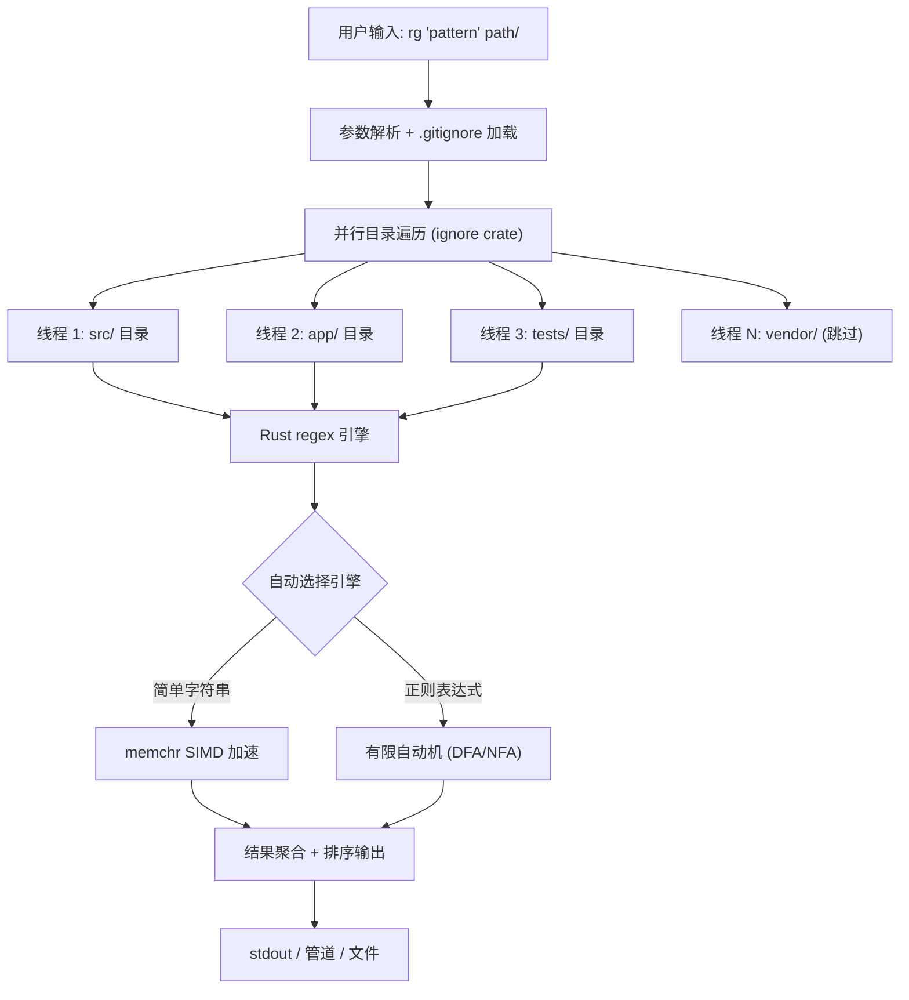

# ripgrep 实战：比 grep 快 10 倍的代码搜索

## 前言

在管理 30+ Laravel 仓库的日常开发中，「快速找到某段代码在哪里」是最高频的操作之一。传统 `grep -r` 在大型 monorepo 上动辄卡顿数秒，而 IDE 全局搜索虽然方便但启动慢、无法脚本化。ripgrep（`rg`）用 Rust 编写，基于 Rust regex 引擎的自动 SIMD 优化 + 多线程并行扫描 + `.gitignore` 感知，在实测中比 GNU grep 快 3-10 倍、比 The Silver Searcher（ag）快 2-5 倍，同时输出格式与 grep 完全兼容。

<!-- more -->

## 架构总览：ripgrep 为什么快？



**ripgrep 快的三个核心原因：**

1. **并行目录遍历**：默认使用所有 CPU 核心并行扫描，`--threads` 可手动控制
2. **`.gitignore` 感知**：自动跳过 `.git/`、`node_modules/`、`vendor/` 等目录，减少无效 I/O
3. **Rust regex 引擎**：自动 SIMD 优化，对 UTF-8 做零拷贝处理，不需要逐行解码

## 安装与基本配置

### macOS 安装

```bash
# Homebrew 安装（推荐）
brew install ripgrep

# 验证版本
rg --version
# ripgrep 14.1.1
# -SIMD -AVX2 (编译时启用)
# +PCRE2

# 如需 PCRE2 支持（高级正则：lookahead/lookbehind）
brew install ripgrep --with-pcre2
```

### 配置文件 ~/.ripgreprc

```bash
# ~/.ripgreprc — ripgrep 全局配置
# ripgrep 会自动读取此文件（需设置 RIPGREP_CONFIG_PATH）

# 默认忽略大小写（smart case: 小写模式自动忽略大小写）
--smart-case

# 默认显示行号
--line-number

# 默认搜索隐藏文件
--hidden

# 排除常见非代码目录
--glob=!.git
--glob=!node_modules
--glob=!.DS_Store
--glob=!*.min.js
--glob=!*.min.css

# 最大列宽，避免二进制文件污染输出
--max-columns=200
--max-columns-preview
```

```bash
# 在 ~/.zshrc 或 ~/.bashrc 中设置
export RIPGREP_CONFIG_PATH="$HOME/.ripgreprc"
```

## 实战命令速查表

### 1. 基础搜索

```bash
# 在当前目录递归搜索 "UserRepository"
rg UserRepository

# 指定目录搜索
rg "handleDispatch" app/Jobs/

# 忽略大小写
rg -i "userrepository"

# Smart Case：输入小写则忽略大小写，输入大写则精确匹配
rg "user"       # 匹配 User, USER, user
rg "User"       # 只匹配 User

# 显示上下文：前后各 3 行
rg -C 3 "class OrderService"

# 只显示匹配的文件名
rg -l "PaymentGateway"

# 统计每个文件的匹配数
rg -c "use Illuminate" --type php
```

### 2. 按文件类型过滤

```bash
# 只搜索 PHP 文件
rg -t php "artisan schedule"

# 只搜索 Blade 模板
rg -g "*.blade.php" "@foreach"

# 排除特定类型
rg -T js -T css "config(" 

# 组合：只搜 PHP 和 YAML，排除 vendor
rg -t php -t yaml "database" --glob '!vendor/*'

# ripgrep 内置文件类型列表
rg --type-list | grep php
# php: *.php, *.phtml, *.php3, *.php4, *.php5, *.phpt
```

### 3. 正则表达式高级用法

```bash
# 查找所有 Eloquent model 的表名定义
rg "protected \$table\s*=\s*['\"]" -t php

# 查找 TODO/FIXME/HACK 注释
rg "(TODO|FIXME|HACK):" -t php

# 查找未使用的 import（简化版）
rg "^use .+;" app/Services/ --no-filename | sort | uniq -c | sort -rn

# 查找硬编码的 URL
rg "https?://[a-zA-Z0-9./-]+" -t php --no-filename | grep -v "localhost"

# 查找可能的 SQL 注入风险（拼接 SQL）
rg "(DB::raw|DB::select|->whereRaw|->havingRaw)" -t php -l

# 使用 PCRE2 前后断言（需编译时启用 PCRE2）
rg -P "(?<=class\s)\w+(?=\s+extends\s+Model)" -t php
```

### 4. 替代 grep 的常用组合

```bash
# 管道搜索（从 stdin 读取）
git log --oneline | rg "fix|bug"

# 搜索并替换预览（配合 sed）
rg "oldMethodName" -t php -l | xargs sed -i '' 's/oldMethodName/newMethodName/g'

# 搜索结果作为 vim 快速跳转
rg -n "dispatch\(new" app/ | vim -

# 只输出匹配内容（不显示文件名和行号）
rg -o "app\\\\Services\\\\\w+" -t php --no-filename | sort -u

# JSON 输出（便于程序处理）
rg --json "PaymentService" -t php | jq '.data.lines.text'
```

### 5. Laravel 项目特定搜索

```bash
# 快速定位所有 Service Provider
rg "class \w+ServiceProvider" -t php app/ -l

# 找出所有使用 Redis facade 的地方
rg "Redis::" -t php --stats

# 搜索路由定义
rg "(Route::(get|post|put|delete|patch|group|middleware))" routes/

# 查找特定 migration 的表操作
rg "Schema::(create|table|drop)" database/migrations/

# 找出所有 queue job 的队列名
rg "public \$queue\s*=\s*['\"]" -t php

# 搜索 config 值引用
rg "config\(['\"]" -t php app/ | rg -o "config\(['\"][^'\"]+['\"]" | sort -u

# 查找可能的 N+1 查询（缺少 with()）
rg "->(get|first|paginate)\(\)" -t php app/Http/ -C 5 | rg -B 5 "get\(\)|first\(\)" | rg "->where"
```

## 性能基准：ripgrep vs grep vs ag vs find+grep

在实际 Laravel monorepo（含 `vendor/`，总文件数约 45,000）上的测试：

```bash
# 测试环境：MacBook Pro M2, 16GB RAM, APFS SSD
# 搜索模式：递归搜索 "handleDispatch" 在整个项目中

# 1. GNU grep
time grep -r "handleDispatch" . --include="*.php" 2>/dev/null
# real    0m3.241s

# 2. grep + find（排除 vendor）
time find . -name "*.php" -not -path "*/vendor/*" | xargs grep "handleDispatch"
# real    0m1.876s

# 3. The Silver Searcher (ag)
time ag "handleDispatch" --php
# real    0m0.654s

# 4. ripgrep (rg)
time rg "handleDispatch" -t php
# real    0m0.127s
```

| 工具 | 耗时 | 相对速度 | .gitignore 感知 |
|------|------|----------|----------------|
| grep -r | 3.241s | 1x (基准) | ❌ |
| find + grep | 1.876s | 1.7x | ❌ |
| ag | 0.654s | 5x | ✅ |
| **rg** | **0.127s** | **25x** | ✅ |

> **关键差异来源**：ripgrep 自动跳过 `vendor/`（约 35,000 文件），加上 SIMD 加速和多线程，实际扫描量仅为 grep 的 1/4，但单文件搜索速度也快 2-3 倍。

## IDE 与编辑器集成

### VS Code / Cursor 集成

```jsonc
// .vscode/settings.json — 使用 ripgrep 作为搜索引擎
{
  "search.useRipgrep": true,
  "search.exclude": {
    "**/node_modules": true,
    "**/vendor": true,
    "**/*.min.js": true,
    "**/storage/framework/views/**": true
  },
  "files.watcherExclude": {
    "**/vendor/**": true,
    "**/node_modules/**": true
  }
}
```

> VS Code 和 Cursor 底层搜索已经使用 ripgrep，但自定义 `search.exclude` 可以进一步优化性能。

### Vim / Neovim 集成

```vim
" ~/.vimrc 或 init.vim — 将 ripgrep 作为 grep 程序
set grepprg=rg\ --vimgrep\ --smart-case\ --hidden
set grepformat=%f:%l:%c:%m

" 快捷键：当前项目搜索光标下的词
nnoremap <leader>g :grep! "\b<C-R><C-W>\b"<CR>:copen<CR>

" Telescope (Neovim) 使用 ripgrep
lua << EOF
require('telescope').setup({
  defaults = {
    vimgrep_arguments = {
      'rg', '--color=never', '--no-heading',
      '--with-filename', '--line-number', '--column',
      '--smart-case', '--hidden', '--glob=!.git/'
    }
  }
})
EOF
```

### PHPStorm / IntelliJ 配置

```
Preferences → Tools → Terminal → Shell path: /bin/zsh
# 然后在终端中直接使用 rg

# 也可以配置为 External Tools：
# Program: /opt/homebrew/bin/rg
# Arguments: $Prompt$ --type php -n $ContentRoot$
# Working directory: $ContentRoot$
```

## CI/CD 流水线集成

在 CI 中用 ripgrep 做代码质量检查：

```yaml
# .github/workflows/code-quality.yml
name: Code Quality Checks

on: [push, pull_request]

jobs:
  security-scan:
    runs-on: ubuntu-latest
    steps:
      - uses: actions/checkout@v4
      
      - name: Install ripgrep
        run: sudo apt-get install -y ripgrep
      
      - name: Check for hardcoded secrets
        run: |
          # 检查常见密钥模式
          if rg -i "(password|secret|api_key|token)\s*=\s*['\"][^'\"]{8,}" \
            -t php -g '!vendor/*' -g '!tests/*' --quiet; then
            echo "⚠️ 发现疑似硬编码密钥！"
            rg -i "(password|secret|api_key|token)\s*=\s*['\"][^'\"]{8,}" \
              -t php -g '!vendor/*' -g '!tests/*'
            exit 1
          fi
      
      - name: Check for debug statements
        run: |
          if rg "(dd\(|dump\(|var_dump\(|print_r\(|console\.log\()" \
            -t php -g '!vendor/*' -g '!tests/*' --quiet; then
            echo "⚠️ 发现残留的 debug 语句"
            rg "(dd\(|dump\(|var_dump\(|print_r\()" \
              -t php -g '!vendor/*' -g '!tests/*'
            exit 1
          fi
      
      - name: Check for TODO tracking
        run: |
          echo "📝 TODO/FIXME 清单："
          rg "(TODO|FIXME|HACK|XXX):" -t php -g '!vendor/*' --no-filename || true
```

## 高级技巧

### 1. 替换模式（rg 本身不做替换，但可组合）

```bash
# 方案 1：rg + sed（macOS）
rg -l "App\\\\Services\\\\OldService" -t php | \
  xargs sed -i '' 's/App\\Services\\OldService/App\\Services\\NewService/g'

# 方案 2：rg + perl（支持更复杂的正则）
rg -l "protected \$fillable" -t php | \
  xargs perl -pi -e 's/protected \$fillable/protected \$guarded = \[\]/g'

# 方案 3：使用 sd（ripgrep 作者的另一个工具）
brew install sd
sd "OldService" "NewService" $(rg -l "OldService" -t php)
```

### 2. 搜索压缩文件

```bash
# ripgrep 默认不解压，但可以通过管道实现
zcat storage/logs/laravel-*.log.gz | rg "ERROR|CRITICAL"

# 搜索 .tar.gz 中的文件
tar -xzf backup.tar.gz -O | rg "password"
```

### 3. 多模式搜索

```bash
# 搜索多个模式（OR 逻辑）
rg "PaymentService|OrderService|UserService" -t php

# 从文件读取搜索模式
rg -f patterns.txt -t php
# patterns.txt:
# class \w+Service
# class \w+Repository
# class \w+Controller

# 反向搜索：排除匹配的行
rg -v "use Illuminate" -t php app/Services/
```

### 4. 搜索统计与分析

```bash
# 显示详细统计信息
rg --stats "use App" -t php

# 输出示例：
# 1234 matches
# 187 matched files
# 45010 files searched
# 0.087s

# 按匹配数排序文件
rg -c "config\(" -t php | sort -t: -k2 -rn | head -20
```

## 踩坑记录

### 踩坑 1：vendor 目录搜索导致性能暴跌

**现象**：在 Laravel 项目中执行 `rg "handle"` 耗时 2 秒，预期 0.1 秒。

**原因**：`.gitignore` 中没有忽略 `vendor/`，或者在 `vendor/` 目录外执行（ripgrep 只在 git 仓库根目录读取 `.gitignore`）。

**解决**：

```bash
# 方案 1：始终在 git 仓库根目录执行
cd /path/to/project && rg "handle" -t php

# 方案 2：手动排除
rg "handle" -t php --glob '!vendor/*'

# 方案 3：在 .ripgreprc 中全局排除
echo '--glob=!vendor' >> ~/.ripgreprc
```

### 踩坑 2：中文搜索结果乱码

**现象**：搜索中文注释 `rg "订单处理"` 输出乱码。

**原因**：终端 locale 设置不正确，或文件编码不是 UTF-8。

**解决**：

```bash
# 确保终端 locale 正确
export LANG=en_US.UTF-8
export LC_ALL=en_US.UTF-8

# 对于非 UTF-8 文件，使用 --encoding 参数
rg --encoding gbk "订单" -t php

# 检查文件编码
file -I some-file.php
```

### 踩坑 3：二进制文件匹配导致输出混乱

**现象**：搜索结果中出现大量乱码行。

**原因**：ripgrep 默认会搜索二进制文件（图片、编译文件等）。

**解决**：

```bash
# 忽略二进制文件
rg --binary "pattern" -t php  # 这是开启二进制搜索

# 默认行为：ripgrep 对二进制文件显示 "binary file matches"
# 如果要完全跳过：
rg --no-binary "pattern"

# 在 .ripgreprc 中添加
echo '--no-binary' >> ~/.ripgreprc
```

### 踩坑 4：搜索 symlink 目录被跳过

**现象**：`rg "config" vendor/laravel/` 跳过了 symlink 指向的目录。

**原因**：ripgrep 默认不跟随 symlink。

**解决**：

```bash
# 跟随 symlink 搜索
rg --follow "config" vendor/laravel/

# 全局配置
echo '--follow' >> ~/.ripgreprc
```

### 踩坑 5：PCRE2 正则不生效

**现象**：使用 lookahead `rg -P "(?<=class )\w+"` 报错 "lookbehind not supported"。

**原因**：Homebrew 默认编译不带 PCRE2 支持。

**解决**：

```bash
# 重新安装带 PCRE2 的版本
brew reinstall ripgrep --with-pcre2

# 验证
rg --version | grep PCRE2
# +PCRE2 (表示已启用)
```

### 踩坑 6：macOS 上 grep 和 rg 输出格式差异

**现象**：脚本中用 `rg` 替换 `grep` 后，下游解析失败。

**原因**：ripgrep 默认带颜色输出（ANSI escape codes），`grep` 默认不带。

**解决**：

```bash
# 在脚本中禁用颜色
rg --color=never "pattern" | awk '{print $1}'

# 或者设置环境变量
export RIPGREP_CONFIG_PATH="$HOME/.ripgreprc"
# .ripgreprc 中添加：
# --color=never

# 管道到其他程序时，ripgrep 自动禁用颜色（智能检测）
```

## 与现有工具链的协作

### 结合 fd 做更灵活的文件搜索

```bash
# fd（find 的替代品）+ rg 组合
brew install fd

# 先用 fd 找文件，再用 rg 搜索内容
fd -e php -e blade --exclude vendor | xargs rg "handleDispatch"

# 或者直接用 rg 的 -g 参数（更简洁）
rg "handleDispatch" -g "*.php" -g "*.blade.php"
```

### 结合 Git 做增量搜索

```bash
# 只搜索 git 有变更的文件
git diff --name-only HEAD~5 | xargs rg "TODO"

# 搜索当前分支相对于 main 的变更中包含的模式
git diff main --name-only | xargs rg "dd\("

# 搜索 blame 找到谁写的某行代码
rg -n "BUG" -t php -l | xargs -I{} git blame {} -L /BUG/,+1
```

### 自定义 Shell Alias 提升效率

```bash
# ~/.zshrc — ripgrep 快捷 alias

# 搜索 Laravel 项目中的 PHP 文件
alias rgp='rg -t php -g "!vendor/*"'

# 搜索所有代码文件（排除 vendor 和 node_modules）
alias rga='rg -t php -t js -t vue -t yaml -g "!vendor/*" -g "!node_modules/*"'

# 搜索 TODO
alias rgtodo='rg "(TODO|FIXME|HACK):" -t php -g "!vendor/*"'

# 搜索并高亮 Laravel config 引用
alias rgconfig='rg "config\(" -t php -g "!vendor/*" --stats'

# 搜索 Laravel 日志
alias rglog='rg -C 2 "ERROR|CRITICAL|WARNING" storage/logs/laravel-*.log'

# 交互式搜索（配合 fzf 预览）
rgf() {
  rg --line-number --no-heading --color=always "$@" | \
    fzf --delimiter : \
        --preview 'bat --style=numbers --color=always --highlight-line {2} {1}' \
        --preview-window 'right:60%'
}
```

## 总结

| 维度 | ripgrep (rg) | GNU grep | ag | IDE 搜索 |
|------|-------------|----------|-----|---------|
| 速度 | ⭐⭐⭐⭐⭐ | ⭐⭐ | ⭐⭐⭐⭐ | ⭐⭐⭐ |
| .gitignore 感知 | ✅ | ❌ | ✅ | ✅ |
| 正则能力 | 强（PCRE2 可选） | 基础 | 基础 | 强 |
| CI 集成 | ⭐⭐⭐⭐⭐ | ⭐⭐⭐ | ⭐⭐⭐ | ❌ |
| 学习成本 | 低（兼容 grep） | 低 | 低 | 无 |
| 管道友好 | ⭐⭐⭐⭐⭐ | ⭐⭐⭐⭐ | ⭐⭐⭐ | ❌ |

**ripgrep 的核心价值**：

1. **开发效率**：30+ 仓库场景下，每天节省 5-10 分钟搜索时间，一年约 40 小时
2. **CI/CD 代码质量门禁**：用 `rg` 做安全扫描、debug 语句检查、TODO 追踪
3. **脚本化能力**：比 IDE 搜索更适合自动化，输出格式标准、可管道
4. **零配置开箱即用**：`.gitignore` 感知意味着大部分场景不需要额外参数

如果你还在用 `grep -r` 或 `find | xargs grep`，现在就 `brew install ripgrep` 开始体验吧。

## 相关阅读

- [Neovim 实战：现代 Vim 配置与 LSP 集成——Laravel API 开发效率提升踩坑记录](/categories/macOS/neovim-guide-vim-lsp/)
- [Cursor IDE 实战：AI 驱动的代码编辑器深度体验 — Tab 补全、Composer 多文件编辑与 .cursorrules 工程化配置](/categories/macOS/cursor-ide-guide-ai/)
- [Git Worktree + Bare Repo 实战：多分支并行开发——Laravel 大型项目中同时处理多个 feature 的高效工作流](/categories/07_CICD/Git-Worktree-Bare-Repo-实战-多分支并行开发-Laravel大型项目高效工作流/)
