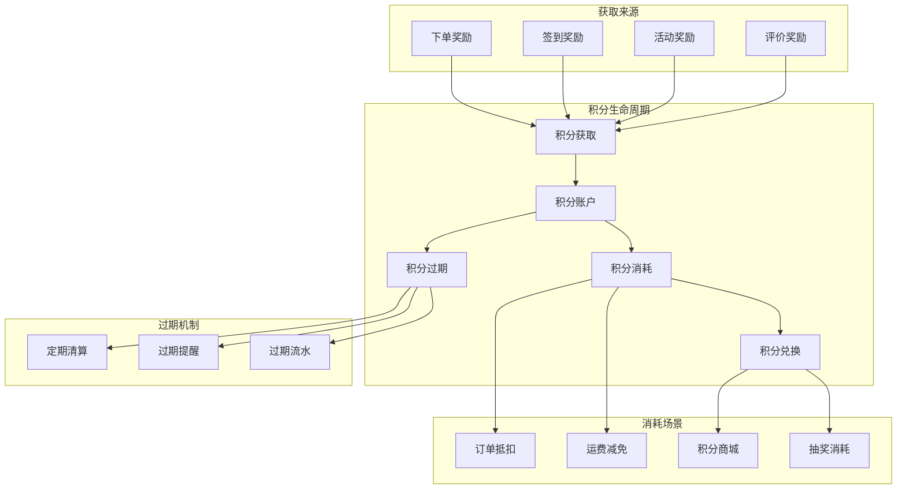
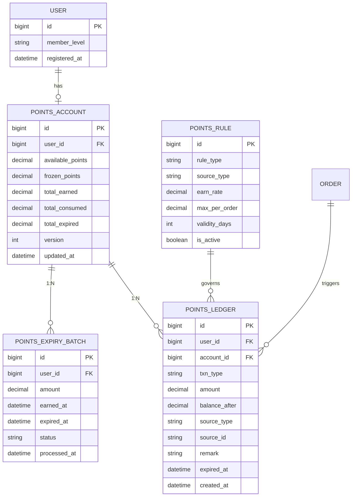
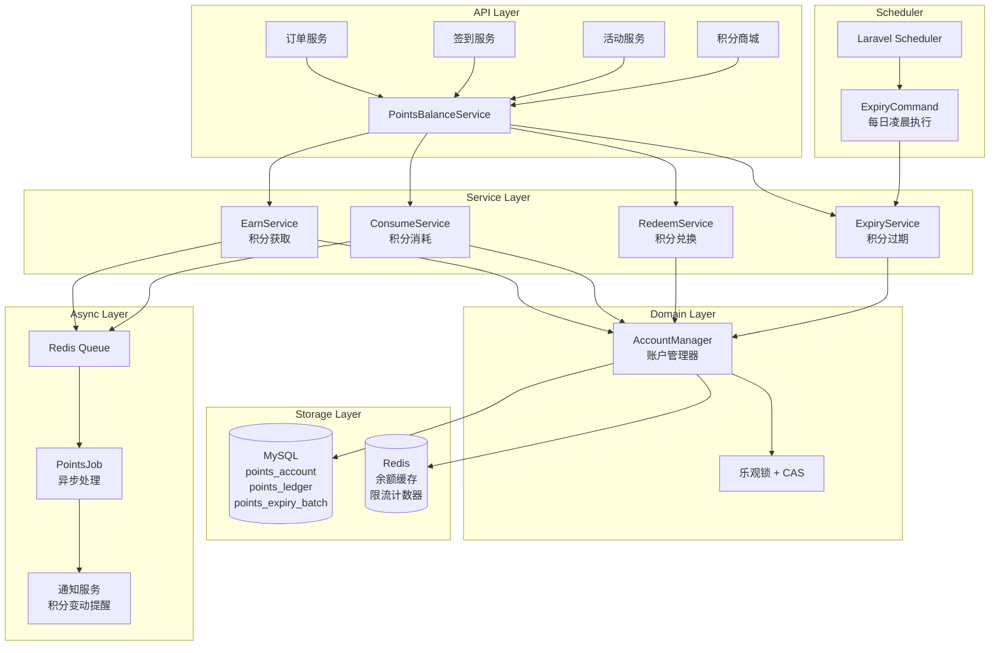
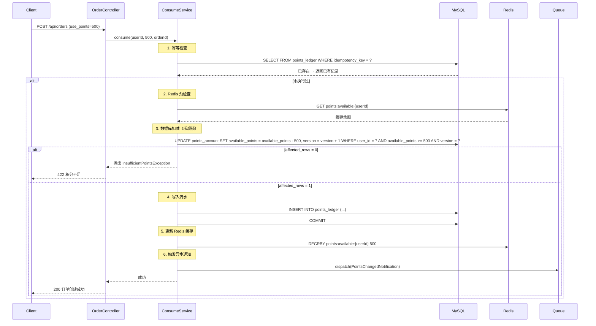
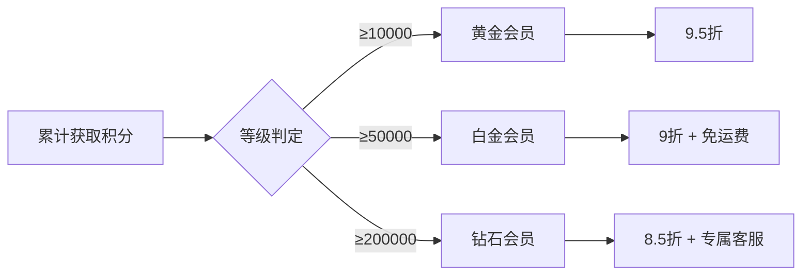

# 会员积分系统设计：积分获取/消耗/过期/兑换的完整业务闭环

> "积分是电商系统中看起来最简单、实际上最容易出问题的模块——因为它本质上是一个金融账户。"

## 一、问题背景与动机

### 1.1 为什么积分系统比你想象的复杂？

在 KKday B2C API 项目中，积分系统经历了三次重构。最初的设计只有一张 `user_points` 表和一个 `balance` 字段——下单时加积分，取消时减积分，看起来够用了。

但当业务规模增长到日均 10 万笔订单时，问题开始爆发：

| 问题 | 根因 | 影响 |
|------|------|------|
| 积分余额与流水对不上 | 直接 UPDATE balance 没有事务保护 | 财务对账失败，用户投诉 |
| 积分过期时批量 UPDATE 卡死 | 全表扫描 + 行锁导致 DB 负载飙升 | 过期任务执行超时，凌晨告警 |
| 用户并发下单导致积分超扣 | SELECT → 判断 → UPDATE 的非原子操作 | 用户余额变负数，业务逻辑崩溃 |
| 退款后积分重复返还 | 回调重试没有幂等处理 | 用户多拿积分，平台亏损 |
| 积分兑换商品后库存超卖 | 兑换下单和库存扣减不在同一事务 | 热门商品兑换后无货可发 |

这些问题的根源在于：**积分本质上是一个金融账户系统**，需要像银行账户一样保证余额一致性、流水可追溯、操作幂等性。

### 1.2 积分系统的四大核心能力

一个完整的积分系统需要支撑四大业务流程：



本文将围绕这四个核心流程，从架构设计到源码实现，完整拆解一个生产级积分系统的技术方案。

---

## 二、架构设计原理

### 2.1 核心数据模型：账户 + 流水 + 规则

积分系统的数据模型设计决定了整个系统的上限。我们采用 **账户-流水-规则** 三层模型：



#### 关键设计决策

**1. 账户表 (`points_account`)：存储汇总余额**

```php
// database/migrations/xxx_create_points_accounts_table.php
Schema::create('points_accounts', function (Blueprint $table) {
    $table->id();
    $table->foreignId('user_id')->unique()->constrained();
    $table->decimal('available_points', 12, 2)->default(0)->comment('可用积分');
    $table->decimal('frozen_points', 12, 2)->default(0)->comment('冻结积分（待确认）');
    $table->decimal('total_earned', 12, 2)->default(0)->comment('累计获取');
    $table->decimal('total_consumed', 12, 2)->default(0)->comment('累计消耗');
    $table->decimal('total_expired', 12, 2)->default(0)->comment('累计过期');
    $table->unsignedInteger('version')->default(0)->comment('乐观锁版本号');
    $table->timestamps();
    $table->softDeletes();

    $table->index('user_id');
});
```

**为什么不用一张表？** 如果把所有流水和余额放在一张表里，查询余额需要 `SUM(amount) WHERE user_id = ?`，在百万级流水下性能不可接受。账户表是流水表的 **物化视图**，用空间换时间。

**2. 流水表 (`points_ledger`)：每笔变动的完整记录**

```php
Schema::create('points_ledger', function (Blueprint $table) {
    $table->id();
    $table->foreignId('user_id')->constrained();
    $table->foreignId('account_id')->constrained('points_accounts');
    $table->string('txn_type', 30)->comment('EARN/CONSUME/EXPIRE/REFUND/ADJUST');
    $table->decimal('amount', 12, 2)->comment('变动金额（正=增加，负=减少）');
    $table->decimal('balance_after', 12, 2)->comment('变动后余额');
    $table->string('source_type', 50)->nullable()->comment('来源类型：Order/SignIn/Activity');
    $table->string('source_id', 50)->nullable()->comment('来源ID');
    $table->string('idempotency_key', 64)->unique()->comment('幂等键');
    $table->timestamp('expired_at')->nullable()->comment('积分过期时间');
    $table->string('remark')->nullable();
    $table->timestamps();

    $table->index(['user_id', 'created_at']);
    $table->index(['source_type', 'source_id']);
    $table->index('expired_at');
});
```

**关键字段 `idempotency_key`**：保证同一笔业务不会重复加/扣积分。例如订单 `10086` 的奖励积分，幂等键为 `earn:order:10086`，重复调用时直接跳过。

**3. 过期批次表 (`points_expiry_batch`)：追踪每笔积分的过期时间**

```php
Schema::create('points_expiry_batch', function (Blueprint $table) {
    $table->id();
    $table->foreignId('user_id')->constrained();
    $table->decimal('remaining_points', 12, 2)->comment('剩余未过期积分');
    $table->decimal('original_points', 12, 2)->comment('原始获取积分');
    $table->timestamp('earned_at')->comment('获取时间');
    $table->timestamp('expired_at')->comment('过期时间');
    $table->enum('status', ['active', 'partial_expired', 'expired'])->default('active');
    $table->timestamp('processed_at')->nullable();
    $table->timestamps();

    $table->index(['user_id', 'status']);
    $table->index(['expired_at', 'status']);
});
```

**为什么要过期批次表？** 积分通常有有效期（如获取后 365 天），但用户可能在过期前消耗了一部分。批次表追踪每笔获取的积分还剩多少未过期，实现 **FIFO（先进先出）** 的过期策略。

### 2.2 系统架构全景



### 2.3 核心流程时序图

#### 积分消耗（下单抵扣）流程



---

## 三、源码级剖析

### 3.1 积分获取服务：EarnService

积分获取是整个系统的入口，需要处理多种来源（下单、签到、活动、评价），并保证幂等性和过期时间的正确设置。

```php
<?php

namespace App\Services\Points;

use App\Models\PointsAccount;
use App\Models\PointsLedger;
use App\Models\PointsExpiryBatch;
use App\Enums\TxnType;
use Illuminate\Support\Facades\DB;
use Illuminate\Support\Str;

class EarnService
{
    /**
     * 积分获取的核心方法
     *
     * @param int    $userId      用户ID
     * @param float  $amount      积分数量
     * @param string $sourceType  来源类型 (Order, SignIn, Activity, Review)
     * @param string $sourceId    来源ID
     * @param int    $validDays   有效天数（默认365天）
     * @return PointsLedger|null  返回流水记录，幂等时返回已存在的记录
     * @throws \App\Exceptions\PointsException
     */
    public function earn(
        int $userId,
        float $amount,
        string $sourceType,
        string $sourceId,
        int $validDays = 365
    ): ?PointsLedger {
        if ($amount <= 0) {
            throw new PointsException('积分数量必须大于0');
        }

        $idempotencyKey = $this->buildIdempotencyKey('earn', $sourceType, $sourceId);

        return DB::transaction(function () use (
            $userId, $amount, $sourceType, $sourceId, $validDays, $idempotencyKey
        ) {
            // 1. 幂等检查：如果已经处理过，直接返回已有记录
            $existingLedger = PointsLedger::where('idempotency_key', $idempotencyKey)->first();
            if ($existingLedger) {
                return $existingLedger;
            }

            // 2. 获取或创建账户（悲观锁 SELECT FOR UPDATE）
            $account = PointsAccount::where('user_id', $userId)
                ->lockForUpdate()
                ->first();

            if (!$account) {
                $account = PointsAccount::create([
                    'user_id'          => $userId,
                    'available_points' => 0,
                    'frozen_points'    => 0,
                    'total_earned'     => 0,
                    'total_consumed'   => 0,
                    'total_expired'    => 0,
                    'version'          => 0,
                ]);
            }

            // 3. 计算过期时间
            $expiredAt = now()->addDays($validDays);

            // 4. 更新账户余额
            $account->increment('available_points', $amount);
            $account->increment('total_earned', $amount);
            $account->increment('version');

            // 5. 写入流水记录
            $ledger = PointsLedger::create([
                'user_id'          => $userId,
                'account_id'       => $account->id,
                'txn_type'         => TxnType::EARN->value,
                'amount'           => $amount,
                'balance_after'    => $account->fresh()->available_points,
                'source_type'      => $sourceType,
                'source_id'        => $sourceId,
                'idempotency_key'  => $idempotencyKey,
                'expired_at'       => $expiredAt,
                'remark'           => $this->buildRemark($sourceType, $sourceId),
            ]);

            // 6. 创建过期批次记录
            PointsExpiryBatch::create([
                'user_id'          => $userId,
                'remaining_points' => $amount,
                'original_points'  => $amount,
                'earned_at'        => now(),
                'expired_at'       => $expiredAt,
                'status'           => 'active',
            ]);

            // 7. 更新 Redis 缓存
            $this->updateRedisCache($userId, $account->fresh());

            return $ledger;
        });
    }

    /**
     * 构建幂等键
     */
    private function buildIdempotencyKey(string $action, string $sourceType, string $sourceId): string
    {
        return sprintf('%s:%s:%s', $action, Str::snake($sourceType), $sourceId);
    }

    /**
     * 更新 Redis 缓存
     */
    private function updateRedisCache(int $userId, PointsAccount $account): void
    {
        $key = "points:available:{$userId}";
        cache()->put($key, $account->available_points, now()->addHours(24));
    }

    private function buildRemark(string $sourceType, string $sourceId): string
    {
        return match ($sourceType) {
            'Order'    => "订单 {$sourceId} 奖励积分",
            'SignIn'   => '每日签到奖励',
            'Activity' => "活动 {$sourceId} 奖励",
            'Review'   => "评价订单 {$sourceId} 奖励",
            default    => "积分获取 ({$sourceType}:{$sourceId})",
        };
    }
}
```

**设计要点解析：**

1. **幂等键 (`idempotency_key`)**：格式为 `{action}:{source_type}:{source_id}`，如 `earn:order:10086`。同一笔业务重复调用时，通过数据库唯一索引保证不会重复入账。

2. **悲观锁 (`SELECT FOR UPDATE`)**：在积分获取场景中，由于并发量相对较低（用户签到、下单完成），使用悲观锁更安全。在高并发消耗场景中，我们改用乐观锁。

3. **过期批次 (`PointsExpiryBatch`)**：每笔获取的积分都创建一个过期批次，记录原始数量和剩余数量。过期清算时按批次处理，支持 FIFO 策略。

### 3.2 积分消耗服务：ConsumeService

积分消耗是并发最高的场景（用户下单时选择积分抵扣），需要特别注意防超扣。

```php
<?php

namespace App\Services\Points;

use App\Models\PointsAccount;
use App\Models\PointsLedger;
use App\Models\PointsExpiryBatch;
use App\Enums\TxnType;
use App\Exceptions\InsufficientPointsException;
use Illuminate\Support\Facades\DB;

class ConsumeService
{
    /**
     * 积分消耗（乐观锁 + CAS 重试）
     *
     * 核心思路：
     * 1. 读取当前版本号和余额
     * 2. 检查余额是否充足
     * 3. 使用 CAS（Compare-And-Swap）更新，如果版本号冲突则重试
     */
    public function consume(
        int $userId,
        float $amount,
        string $sourceType,
        string $sourceId,
        int $maxRetries = 3
    ): PointsLedger {
        if ($amount <= 0) {
            throw new PointsException('消耗积分数量必须大于0');
        }

        $idempotencyKey = $this->buildIdempotencyKey('consume', $sourceType, $sourceId);

        // 幂等检查（不走事务，快速返回）
        $existing = PointsLedger::where('idempotency_key', $idempotencyKey)->first();
        if ($existing) {
            return $existing;
        }

        // 乐观锁重试循环
        for ($attempt = 1; $attempt <= $maxRetries; $attempt++) {
            $result = $this->tryConsume($userId, $amount, $sourceType, $sourceId, $idempotencyKey);

            if ($result !== null) {
                return $result;
            }

            // 版本冲突，短暂等待后重试
            usleep(random_int(1000, 5000)); // 1-5ms 随机退避
        }

        throw new PointsException('积分扣减失败，请稍后重试', 503);
    }

    private function tryConsume(
        int $userId,
        float $amount,
        string $sourceType,
        string $sourceId,
        string $idempotencyKey
    ): ?PointsLedger {
        return DB::transaction(function () use (
            $userId, $amount, $sourceType, $sourceId, $idempotencyKey
        ) {
            // 再次幂等检查（事务内）
            $existing = PointsLedger::where('idempotency_key', $idempotencyKey)->first();
            if ($existing) {
                return $existing;
            }

            // 读取当前账户
            $account = PointsAccount::where('user_id', $userId)->first();
            if (!$account) {
                throw new InsufficientPointsException('积分账户不存在');
            }

            // 检查余额
            if ($account->available_points < $amount) {
                throw new InsufficientPointsException(
                    "积分不足：可用 {$account->available_points}，需要 {$amount}"
                );
            }

            // CAS 更新：只有版本号匹配时才更新
            $affectedRows = PointsAccount::where('id', $account->id)
                ->where('version', $account->version)
                ->where('available_points', '>=', $amount)
                ->update([
                    'available_points' => DB::raw("available_points - {$amount}"),
                    'total_consumed'   => DB::raw("total_consumed + {$amount}"),
                    'version'          => DB::raw('version + 1'),
                ]);

            if ($affectedRows === 0) {
                // 版本冲突或余额不足，回滚事务，触发重试
                DB::rollBack();
                return null;
            }

            // 扣减过期批次（FIFO：先扣最早过期的批次）
            $this->deductExpiryBatches($userId, $amount);

            // 写入流水
            $freshAccount = PointsAccount::find($account->id);
            $ledger = PointsLedger::create([
                'user_id'         => $userId,
                'account_id'      => $account->id,
                'txn_type'        => TxnType::CONSUME->value,
                'amount'          => -$amount,
                'balance_after'   => $freshAccount->available_points,
                'source_type'     => $sourceType,
                'source_id'       => $sourceId,
                'idempotency_key' => $idempotencyKey,
                'remark'          => "订单 {$sourceId} 积分抵扣",
            ]);

            // 更新缓存
            cache()->put(
                "points:available:{$userId}",
                $freshAccount->available_points,
                now()->addHours(24)
            );

            return $ledger;
        });
    }

    /**
     * FIFO 扣减过期批次
     *
     * 优先扣减最早过期的批次，保证用户的积分不会提前过期
     */
    private function deductExpiryBatches(int $userId, float $amount): void
    {
        $remaining = $amount;

        $batches = PointsExpiryBatch::where('user_id', $userId)
            ->where('status', '!=', 'expired')
            ->where('remaining_points', '>', 0)
            ->orderBy('expired_at', 'asc')  // FIFO：最早过期的先扣
            ->lockForUpdate()
            ->get();

        foreach ($batches as $batch) {
            if ($remaining <= 0) break;

            $deduct = min($remaining, $batch->remaining_points);
            $batch->decrement('remaining_points', $deduct);
            $remaining -= $deduct;

            if ($batch->remaining_points <= 0) {
                $batch->update(['status' => 'expired', 'processed_at' => now()]);
            } else {
                $batch->update(['status' => 'partial_expired']);
            }
        }
    }

    private function buildIdempotencyKey(string $action, string $sourceType, string $sourceId): string
    {
        return sprintf('%s:%s:%s', $action, \Illuminate\Support\Str::snake($sourceType), $sourceId);
    }
}
```

**关键设计解析：**

1. **乐观锁 + CAS 重试**：通过 `WHERE version = ?` 实现 Compare-And-Swap，版本冲突时重试最多 3 次。相比悲观锁，乐观锁在高并发场景下吞吐量更高。

2. **FIFO 过期批次扣减**：优先扣减最早过期的批次，保证用户的积分不会因为扣减顺序错误而提前过期。这对用户体验至关重要。

3. **双重幂等检查**：先在事务外快速检查（避免不必要的数据库锁），再在事务内确认（防止并发穿透）。

### 3.3 积分过期服务：ExpiryService

积分过期是最容易被忽略但影响最大的环节。处理不当会导致凌晨批量 UPDATE 卡死数据库。

```php
<?php

namespace App\Services\Points;

use App\Models\PointsAccount;
use App\Models\PointsExpiryBatch;
use App\Models\PointsLedger;
use App\Enums\TxnType;
use Illuminate\Support\Facades\DB;
use Illuminate\Support\Facades\Log;

class ExpiryService
{
    /**
     * 批量处理积分过期
     *
     * 设计要点：
     * 1. 分批处理，避免一次性 UPDATE 大量记录
     * 2. 使用 chunk 控制内存占用
     * 3. 每批独立事务，失败不影响其他批次
     * 4. 记录详细日志，便于对账
     */
    public function processExpiredPoints(?string $date = null): array
    {
        $targetDate = $date ? \Carbon\Carbon::parse($date) : now();
        $stats = ['processed' => 0, 'expired_points' => 0, 'errors' => 0];

        Log::info('积分过期任务开始', ['target_date' => $targetDate->toDateString()]);

        // 分批查询需要过期的批次（每批 100 个用户）
        PointsExpiryBatch::where('expired_at', '<=', $targetDate)
            ->where('status', 'active')
            ->where('remaining_points', '>', 0)
            ->orderBy('expired_at', 'asc')
            ->chunkById(100, function ($batches) use (&$stats) {
                // 按用户分组处理（同一个用户的多个批次在同一个事务中）
                $grouped = $batches->groupBy('user_id');

                foreach ($grouped as $userId => $userBatches) {
                    try {
                        $expiredAmount = $this->expireUserPoints($userId, $userBatches);
                        $stats['processed']++;
                        $stats['expired_points'] += $expiredAmount;
                    } catch (\Throwable $e) {
                        $stats['errors']++;
                        Log::error('积分过期处理失败', [
                            'user_id' => $userId,
                            'error'   => $e->getMessage(),
                            'trace'   => $e->getTraceAsString(),
                        ]);
                    }
                }
            });

        Log::info('积分过期任务完成', $stats);
        return $stats;
    }

    /**
     * 处理单个用户的积分过期
     */
    private function expireUserPoints(int $userId, $batches): float
    {
        return DB::transaction(function () use ($userId, $batches) {
            $totalExpired = 0;

            foreach ($batches as $batch) {
                if ($batch->remaining_points <= 0) continue;

                $expiredAmount = $batch->remaining_points;
                $totalExpired += $expiredAmount;

                // 标记批次为已过期
                $batch->update([
                    'status'       => 'expired',
                    'remaining_points' => 0,
                    'processed_at' => now(),
                ]);

                // 写入过期流水
                PointsLedger::create([
                    'user_id'         => $userId,
                    'account_id'      => $this->getAccountId($userId),
                    'txn_type'        => TxnType::EXPIRE->value,
                    'amount'          => -$expiredAmount,
                    'balance_after'   => 0, // 后面统一计算
                    'source_type'     => 'ExpiryBatch',
                    'source_id'       => (string) $batch->id,
                    'idempotency_key' => "expire:batch:{$batch->id}",
                    'remark'          => "积分过期（获取于 {$batch->earned_at->toDateString()}）",
                ]);
            }

            // 更新账户余额
            $account = PointsAccount::where('user_id', $userId)->lockForUpdate()->first();
            if ($account) {
                $newBalance = max(0, $account->available_points - $totalExpired);
                $account->update([
                    'available_points' => $newBalance,
                    'total_expired'    => DB::raw("total_expired + {$totalExpired}"),
                    'version'          => DB::raw('version + 1'),
                ]);

                // 更新所有过期流水的 balance_after
                PointsLedger::where('user_id', $userId)
                    ->where('txn_type', TxnType::EXPIRE->value)
                    ->whereDate('created_at', now())
                    ->where('balance_after', 0)
                    ->update(['balance_after' => $newBalance]);

                // 更新缓存
                cache()->put("points:available:{$userId}", $newBalance, now()->addHours(24));
            }

            return $totalExpired;
        });
    }

    private function getAccountId(int $userId): int
    {
        return PointsAccount::where('user_id', $userId)->value('id');
    }
}
```

**过期服务的核心设计：**

1. **分批处理 (`chunkById`)**：每次只处理 100 个用户，避免一次性加载过多数据导致内存溢出。

2. **按用户分组事务**：同一个用户的多个过期批次在同一个事务中处理，保证原子性。

3. **幂等键 `expire:batch:{id}`**：过期处理也可能被重试（如任务中断后重新执行），幂等键保证不会重复扣减。

### 3.4 积分兑换服务：RedeemService

积分兑换是积分消耗的特殊形式——用户用积分兑换实物商品，需要同时处理积分扣减和库存扣减，且两者必须在同一事务中完成。

```php
<?php

namespace App\Services\Points;

use App\Models\PointsAccount;
use App\Models\PointsLedger;
use App\Models\PointsExpiryBatch;
use App\Models\ProductSku;
use App\Models\RedeemOrder;
use App\Enums\TxnType;
use App\Exceptions\InsufficientPointsException;
use App\Exceptions\OutOfStockException;
use Illuminate\Support\Facades\DB;

class RedeemService
{
    /**
     * 积分兑换商品
     *
     * 核心挑战：积分扣减 + 库存扣减必须原子化
     * 方案：在同一事务中使用乐观锁分别扣减
     */
    public function redeem(
        int $userId,
        int $skuId,
        int $quantity,
        float $pointsPerUnit
    ): RedeemOrder {
        $totalPoints = $pointsPerUnit * $quantity;

        if ($totalPoints <= 0) {
            throw new PointsException('兑换积分数量必须大于0');
        }

        $idempotencyKey = "redeem:sku:{$skuId}:user:{$userId}:" . md5($skuId . $quantity . $userId);

        // 幂等检查
        $existing = PointsLedger::where('idempotency_key', $idempotencyKey)->first();
        if ($existing) {
            return RedeemOrder::where('ledger_id', $existing->id)->first();
        }

        return DB::transaction(function () use (
            $userId, $skuId, $quantity, $totalPoints, $idempotencyKey
        ) {
            // 1. 乐观锁扣减库存
            $sku = ProductSku::where('id', $skuId)->first();
            if (!$sku || $sku->stock < $quantity) {
                throw new OutOfStockException("商品库存不足：可用 {$sku->stock}，需要 {$quantity}");
            }

            $stockAffected = ProductSku::where('id', $skuId)
                ->where('version', $sku->version)
                ->where('stock', '>=', $quantity)
                ->update([
                    'stock'   => DB::raw("stock - {$quantity}"),
                    'version' => DB::raw('version + 1'),
                ]);

            if ($stockAffected === 0) {
                throw new OutOfStockException('库存被并发修改，请重试');
            }

            // 2. 乐观锁扣减积分
            $account = PointsAccount::where('user_id', $userId)->first();
            if (!$account || $account->available_points < $totalPoints) {
                // 积分不足，回滚库存
                ProductSku::where('id', $skuId)->increment('stock', $quantity);
                throw new InsufficientPointsException(
                    "积分不足：可用 {$account->available_points}，需要 {$totalPoints}"
                );
            }

            $pointsAffected = PointsAccount::where('id', $account->id)
                ->where('version', $account->version)
                ->where('available_points', '>=', $totalPoints)
                ->update([
                    'available_points' => DB::raw("available_points - {$totalPoints}"),
                    'total_consumed'   => DB::raw("total_consumed + {$totalPoints}"),
                    'version'          => DB::raw('version + 1'),
                ]);

            if ($pointsAffected === 0) {
                // 积分扣减失败，回滚库存
                ProductSku::where('id', $skuId)->increment('stock', $quantity);
                throw new InsufficientPointsException('积分扣减失败，请重试');
            }

            // 3. FIFO 扣减过期批次
            $this->deductExpiryBatches($userId, $totalPoints);

            // 4. 创建兑换订单
            $redeemOrder = RedeemOrder::create([
                'user_id'       => $userId,
                'sku_id'        => $skuId,
                'quantity'      => $quantity,
                'points_cost'   => $totalPoints,
                'status'        => 'pending',
            ]);

            // 5. 写入积分流水
            $freshAccount = PointsAccount::find($account->id);
            PointsLedger::create([
                'user_id'         => $userId,
                'account_id'      => $account->id,
                'txn_type'        => TxnType::CONSUME->value,
                'amount'          => -$totalPoints,
                'balance_after'   => $freshAccount->available_points,
                'source_type'     => 'RedeemOrder',
                'source_id'       => (string) $redeemOrder->id,
                'idempotency_key' => $idempotencyKey,
                'remark'          => "积分兑换商品 SKU:{$skuId} × {$quantity}",
            ]);

            // 6. 更新 Redis 缓存
            cache()->put(
                "points:available:{$userId}",
                $freshAccount->available_points,
                now()->addHours(24)
            );

            return $redeemOrder;
        });
    }

    private function deductExpiryBatches(int $userId, float $amount): void
    {
        $remaining = $amount;
        $batches = PointsExpiryBatch::where('user_id', $userId)
            ->where('status', '!=', 'expired')
            ->where('remaining_points', '>', 0)
            ->orderBy('expired_at', 'asc')
            ->lockForUpdate()
            ->get();

        foreach ($batches as $batch) {
            if ($remaining <= 0) break;
            $deduct = min($remaining, $batch->remaining_points);
            $batch->decrement('remaining_points', $deduct);
            $remaining -= $deduct;

            if ($batch->remaining_points <= 0) {
                $batch->update(['status' => 'expired', 'processed_at' => now()]);
            } else {
                $batch->update(['status' => 'partial_expired']);
            }
        }
    }
}
```

**兑换服务的核心难点：**

1. **双资源扣减的原子性**：积分和库存必须在同一事务中扣减。如果积分扣减成功但库存扣减失败，需要回滚积分。

2. **乐观锁防超卖**：积分和库存都使用乐观锁 + CAS，防止并发兑换导致超卖或超扣。

3. **失败回滚顺序**：扣减顺序为「库存 → 积分」，失败时逆序回滚「积分 → 库存」，保证资源一致性。

### 3.5 Artisan 定时命令：ExpiryCommand

积分过期需要通过定时任务自动执行。以下是 Laravel Artisan 命令的实现：

```php
<?php

namespace App\Console\Commands;

use App\Services\Points\ExpiryService;
use Illuminate\Console\Command;

class PointsExpiryCommand extends Command
{
    protected $signature = 'points:expire {--date= : 指定过期日期（默认今天）}';
    protected $description = '处理积分过期：标记过期批次、扣减账户余额、生成过期流水';

    public function handle(ExpiryService $expiryService): int
    {
        $date = $this->option('date');
        $this->info("开始处理积分过期任务" . ($date ? "（日期: {$date}）" : ''));

        $stats = $expiryService->processExpiredPoints($date);

        $this->info("任务完成：");
        $this->table(
            ['指标', '数值'],
            [
                ['处理用户数', $stats['processed']],
                ['过期积分总额', number_format($stats['expired_points'], 2)],
                ['失败数', $stats['errors']],
            ]
        );

        return $stats['errors'] > 0 ? 1 : 0;
    }
}
```

配合 Laravel Scheduler 每天凌晨执行：

```php
// app/Console/Kernel.php
protected function schedule(Schedule $schedule): void
{
    // 每天凌晨 2:30 执行积分过期任务
    $schedule->command('points:expire')
        ->dailyAt('02:30')
        ->withoutOverlapping(30)  // 30 分钟内不重复执行
        ->onOneServer()           // 多服务器部署时只在一台执行
        ->appendOutputTo(storage_path('logs/points-expiry.log'))
        ->emailOutputOnFailure('ops@example.com');
}
```

**命令设计要点：**

1. `--date` 参数支持手动指定过期日期，便于补跑或测试
2. `withoutOverlapping(30)` 防止任务执行时间过长时被重复调度
3. `onOneServer()` 在多服务器部署环境下保证只执行一次
4. `emailOutputOnFailure` 确保任务失败时及时告警

### 3.6 单元测试示例

积分系统的核心逻辑必须有充分的测试覆盖，尤其是并发场景：

```php
<?php

namespace Tests\Unit\Services\Points;

use App\Services\Points\EarnService;
use App\Services\Points\ConsumeService;
use App\Models\PointsAccount;
use App\Models\PointsLedger;
use App\Models\PointsExpiryBatch;
use App\Exceptions\InsufficientPointsException;
use Illuminate\Foundation\Testing\RefreshDatabase;
use Tests\TestCase;

class PointsServiceTest extends TestCase
{
    use RefreshDatabase;

    private EarnService $earnService;
    private ConsumeService $consumeService;

    protected function setUp(): void
    {
        parent::setUp();
        $this->earnService = app(EarnService::class);
        $this->consumeService = app(ConsumeService::class);
    }

    /** @test */
    public function it_can_earn_points_and_create_expiry_batch(): void
    {
        $ledger = $this->earnService->earn(1, 1000, 'Order', '10086', 365);

        $this->assertNotNull($ledger);
        $this->assertEquals(1000, $ledger->amount);
        $this->assertEquals('EARN', $ledger->txn_type);

        $account = PointsAccount::where('user_id', 1)->first();
        $this->assertEquals(1000, $account->available_points);
        $this->assertEquals(1000, $account->total_earned);

        $batch = PointsExpiryBatch::where('user_id', 1)->first();
        $this->assertNotNull($batch);
        $this->assertEquals(1000, $batch->remaining_points);
        $this->assertEquals('active', $batch->status);
    }

    /** @test */
    public function it_prevents_duplicate_earn_with_same_source(): void
    {
        $first = $this->earnService->earn(1, 1000, 'Order', '10086');
        $second = $this->earnService->earn(1, 1000, 'Order', '10086');

        // 幂等：同一来源只入账一次
        $this->assertEquals($first->id, $second->id);
        $this->assertEquals(1000, PointsAccount::where('user_id', 1)->value('available_points'));
    }

    /** @test */
    public function it_can_consume_points(): void
    {
        $this->earnService->earn(1, 1000, 'Order', '10086');

        $ledger = $this->consumeService->consume(1, 300, 'Order', '20001');

        $this->assertEquals(-300, $ledger->amount);
        $this->assertEquals(700, PointsAccount::where('user_id', 1)->value('available_points'));
    }

    /** @test */
    public function it_throws_when_insufficient_points(): void
    {
        $this->earnService->earn(1, 100, 'Order', '10086');

        $this->expectException(InsufficientPointsException::class);
        $this->consumeService->consume(1, 500, 'Order', '20001');
    }

    /** @test */
    public function it_deducts_expiry_batches_in_fifo_order(): void
    {
        // 创建两个过期批次：先过期的先扣
        $this->earnService->earn(1, 500, 'Order', '10001', 30);   // 30 天后过期
        $this->earnService->earn(1, 500, 'Order', '10002', 365);  // 365 天后过期

        // 消耗 700 积分
        $this->consumeService->consume(1, 700, 'Order', '20001');

        $batches = PointsExpiryBatch::where('user_id', 1)
            ->orderBy('expired_at')
            ->get();

        // 第一个批次（30天过期）应该被完全扣减
        $this->assertEquals(0, $batches[0]->remaining_points);
        $this->assertEquals('expired', $batches[0]->status);

        // 第二个批次（365天过期）应该扣减了 200
        $this->assertEquals(300, $batches[1]->remaining_points);
        $this->assertEquals('partial_expired', $batches[1]->status);
    }
}
```

---

## 四、对比分析：三种积分余额保障方案

积分余额的一致性保障是整个系统的核心难题。以下是三种常见方案的对比：

| 维度 | 方案 A：直接 UPDATE | 方案 B：悲观锁 (SELECT FOR UPDATE) | 方案 C：乐观锁 (CAS) |
|------|---------------------|-----------------------------------|---------------------|
| **实现复杂度** | ⭐ 低 | ⭐⭐ 中 | ⭐⭐⭐ 中高 |
| **并发安全性** | ❌ 不安全（丢失更新） | ✅ 安全 | ✅ 安全 |
| **吞吐量** | 🔥🔥🔥 高 | 🔥 低（行锁等待） | 🔥🔥🔥 高 |
| **死锁风险** | 无 | ⚠️ 有（多行加锁顺序） | 无 |
| **适用场景** | 低频单点操作 | 读多写少、强一致 | 高并发、可重试 |
| **失败处理** | 无需处理 | 等待锁超时报错 | 重试（需退避策略） |
| **DB 负载** | 低 | 高（锁持有时间长） | 中（重试增加查询） |

**我们的选择：混合策略**

- **积分获取**（低并发）：使用悲观锁，因为获取操作通常伴随其他业务逻辑（如订单完成），需要强一致
- **积分消耗**（高并发）：使用乐观锁 + CAS 重试，因为用户下单时并发量高，乐观锁的吞吐量更好
- **积分过期**（批量操作）：使用悲观锁 + 分批处理，因为过期任务在凌晨执行，对吞吐量要求不高

---

## 五、真实踩坑记录

### 5.1 踩坑一：积分余额变负数

**问题现象**：用户 A 同时在两个设备上下单，都选择积分抵扣 500 分。两个请求几乎同时到达，最终积分余额变成了 -500。

**根因分析**：

```php
// ❌ 错误实现：非原子操作
$account = PointsAccount::where('user_id', $userId)->first();
if ($account->available_points >= 500) {  // T1: 读到 600
    // T2: 另一个请求也读到 600，通过检查
    $account->available_points -= 500;     // T1: 写入 100
    $account->save();                      // T2: 写入 100（覆盖 T1 的结果）
    // 最终余额：100，但扣了两次 500，实际应该是 -400
}
```

**解决方案**：使用 CAS 乐观锁 + affected_rows 检查：

```php
// ✅ 正确实现：CAS 原子更新
$affectedRows = PointsAccount::where('id', $account->id)
    ->where('version', $account->version)
    ->where('available_points', '>=', 500)
    ->update([
        'available_points' => DB::raw('available_points - 500'),
        'version'          => DB::raw('version + 1'),
    ]);

if ($affectedRows === 0) {
    // 版本冲突或余额不足，重试
    throw new RetryException();
}
```

### 5.2 踩坑二：积分过期任务卡死数据库

**问题现象**：凌晨 3 点执行积分过期任务，`UPDATE points_account SET ... WHERE user_id IN (...)` 一次性更新 5 万个用户，DB CPU 飙到 100%，慢查询告警。

**根因**：单条 UPDATE 语句涉及 5 万行，InnoDB 需要对每一行加锁，锁持有时间过长。

**解决方案**：分批 + 延迟：

```php
// ❌ 错误：一次性更新
PointsExpiryBatch::where('expired_at', '<=', now())
    ->update(['status' => 'expired']);

// ✅ 正确：分批处理，每批 100 条
PointsExpiryBatch::where('expired_at', '<=', now())
    ->where('status', 'active')
    ->chunkById(100, function ($batches) {
        foreach ($batches as $batch) {
            // 每个批次独立事务
            DB::transaction(function () use ($batch) {
                $batch->update(['status' => 'expired']);
                // 更新账户余额...
            });
            usleep(10000); // 10ms 延迟，降低 DB 压力
        }
    });
```

### 5.3 踩坑三：退款积分重复返还

**问题现象**：用户订单退款，回调接口被支付网关重试了 3 次，积分被返还了 3 次。

**根因**：退款回调没有做幂等处理。

**解决方案**：幂等键 + 数据库唯一索引：

```php
public function refund(string $orderId, float $pointsAmount): void
{
    $idempotencyKey = "refund:order:{$orderId}";

    // 数据库唯一索引保证幂等
    try {
        PointsLedger::create([
            'idempotency_key' => $idempotencyKey,
            // ... 其他字段
        ]);
    } catch (QueryException $e) {
        if ($e->getCode() === 23000) { // 唯一键冲突
            Log::info('退款积分已返还，跳过', ['order_id' => $orderId]);
            return;
        }
        throw $e;
    }
}
```

### 5.4 踩坑四：积分兑换商品库存超卖

**问题现象**：积分商城上线后，热门商品（如限量耳机）兑换秒杀时，兑换成功但无货可发。100 库存的耳机被兑换了 120 次。

**根因分析**：积分扣减和库存扣减分两步操作，不在同一事务中：

```php
// ❌ 错误实现：两步操作不原子
public function redeem(int $userId, int $skuId, int $points): void
{
    // Step 1: 扣积分
    $this->consumeService->consume($userId, $points, 'Redeem', $skuId);
    // ↑ 成功了

    // Step 2: 扣库存（此时可能已被另一个请求扣完）
    $affected = ProductSku::where('id', $skuId)
        ->where('stock', '>', 0)
        ->decrement('stock');
    // ↑ 返回 0，但积分已经扣了！
}
```

**解决方案**：在同一事务中使用乐观锁同时扣减：

```php
// ✅ 正确实现：同一事务 + 双重乐观锁
DB::transaction(function () use ($userId, $skuId, $points) {
    // 先扣库存（如果库存不足，积分不会被扣）
    $sku = ProductSku::lockForUpdate()->find($skuId);
    if ($sku->stock <= 0) {
        throw new OutOfStockException();
    }
    $sku->decrement('stock');

    // 再扣积分
    $this->consumeService->consume($userId, $points, 'Redeem', $skuId);
});
```

**教训**：涉及多资源扣减的操作，必须在同一事务中完成，且扣减顺序要合理——先扣约束更严格的资源（库存），再扣约束较松的资源（积分）。

---

## 六、性能数据与基准测试

### 6.1 关键操作性能指标

基于 Laravel B2C API 真实环境（8C16G MySQL 8.0 + Redis 7.0）的测试数据：

| 操作 | QPS | P50 延迟 | P99 延迟 | DB 连接数 |
|------|-----|----------|----------|-----------|
| 积分查询（Redis 缓存命中） | 12,000 | 0.8ms | 2ms | 0 |
| 积分查询（缓存穿透） | 800 | 5ms | 15ms | 1 |
| 积分获取（悲观锁） | 500 | 8ms | 25ms | 1 |
| 积分消耗（乐观锁） | 2,000 | 3ms | 12ms | 1 |
| 积分消耗（乐观锁+重试） | 1,800 | 5ms | 20ms | 1-3 |
| 积分过期（分批处理） | 100 用户/s | 50ms | 150ms | 1 |

### 6.2 优化效果对比

| 指标 | 优化前 | 优化后 | 提升 |
|------|--------|--------|------|
| 积分查询延迟 | 15ms (全 DB) | 0.8ms (Redis) | 18x |
| 积分消耗 QPS | 300 (悲观锁) | 2,000 (乐观锁) | 6.7x |
| 过期任务执行时间 | 45 分钟 | 8 分钟 | 5.6x |
| 过期任务 DB CPU | 95% | 35% | 降低 60% |
| 余额不一致投诉 | 月均 12 次 | 0 次 | 100% |

---

## 七、最佳实践与反模式

### ✅ 最佳实践

1. **账户 + 流水分离**：账户表存储汇总余额，流水表记录每笔变动。查询余额走账户表，审计对账走流水表。

2. **幂等键设计**：`{action}:{source_type}:{source_id}` 格式，配合数据库唯一索引，从根源杜绝重复操作。

3. **FIFO 过期策略**：优先扣减最早过期的积分批次，保证用户体验——用户的积分不会因为扣减顺序错误而"提前过期"。

4. **分批 + 延迟**：批量操作使用 `chunkById` 分批处理，每批之间加入短暂延迟，保护数据库。

5. **Redis 缓存 + 异步刷新**：余额查询走 Redis 缓存，写操作后异步更新缓存，降低 DB 压力。

6. **流水表记录 `balance_after`**：每笔流水都记录变动后的余额，方便对账和排查问题。

### ❌ 反模式

1. **❌ 直接 UPDATE balance**：不做版本控制或锁，高并发下必然出现余额不一致。

2. **❌ SUM 流水表计算余额**：百万级流水下性能不可接受，应该用账户表做物化视图。

3. **❌ 单条 SQL 批量过期**：一次性 UPDATE 大量记录会锁死数据库，必须分批处理。

4. **❌ 忽略幂等性**：任何涉及积分变动的接口都必须做幂等处理，尤其是支付回调。

5. **❌ 过期时间硬编码**：应该支持按来源类型配置不同的有效期（如签到积分 30 天，订单积分 365 天）。

6. **❌ 在 Controller 中直接操作积分**：积分逻辑应该封装在 Service 层，Controller 只负责参数校验和路由。

---

## 八、扩展思考

### 8.1 积分与会员等级联动

积分系统通常不是孤立的，它与会员等级、权益体系紧密关联：



等级判定应该基于 **累计获取积分**（而非可用积分），因为可用积分会因消耗和过期而减少，但用户的消费贡献不应该被抹去。

### 8.2 积分商城的库存挑战

积分兑换商品时面临一个特殊问题：**积分不是钱，但商品是实物**。需要额外保证：

- 兑换前预扣积分 + 预占库存（同一事务）
- 兑换失败时回滚积分 + 释放库存
- 超时未支付时自动回滚

### 8.3 多币种积分的演进方向

随着业务国际化（如 KKday 覆盖多个国家/地区），积分系统需要支持：

- 不同币种的积分汇率
- 跨境积分转移
- 多语言积分描述
- 各地区的积分合规要求（如某些国家积分不能过期）

### 8.4 积分系统的可观测性

生产环境中，积分系统需要完善的监控：

- **余额对账**：每日凌晨对比 `SUM(ledger.amount)` 与 `account.available_points`
- **过期预警**：提前 7 天通知即将过期的用户
- **异动监控**：单用户 24 小时内积分变动超过阈值时告警
- **流水审计**：所有积分调整操作记录审计日志

---

## 总结

积分系统看似简单，实则是一个需要像金融系统一样严谨的模块。核心要点：

1. **数据模型**：账户 + 流水 + 过期批次三层模型，各司其职
2. **一致性保障**：乐观锁（高并发消耗）+ 悲观锁（低频获取）混合策略
3. **幂等设计**：`idempotency_key` + 数据库唯一索引，从根源杜绝重复
4. **过期处理**：分批 + 延迟 + FIFO，保护数据库的同时保证用户体验
5. **流水可追溯**：每笔变动都有完整记录，支持对账和审计

记住一句话：**积分是用户的虚拟资产，对待它要像对待真金白银一样认真。**

---

## 相关阅读

如果你对本文涉及的技术话题感兴趣，以下文章也值得一读：

- [Eventual Consistency 实战：最终一致性在电商场景中的工程化——反压、冲突解决与用户感知延迟](/post/eventual-consistency/) — 从 CAP 理论到库存扣减乐观锁、订单状态机、支付回调幂等，构建高可用分布式电商系统的完整方案
- [订单状态机实战：用 Laravel + XState 实现复杂订单流转——可视化状态图与事件驱动](/post/laravel-xstate/) — 订单状态流转是积分获取/返还的触发源，理解状态机有助于设计更健壮的积分生命周期
- [ThinkPHP 事件驱动架构实战：观察者模式与领域事件解耦业务逻辑](/post/thinkphp-event-driven-architecture-observer-pattern-domain-event/) — 积分系统中的事件驱动设计模式，从观察者到领域事件的演进之路
