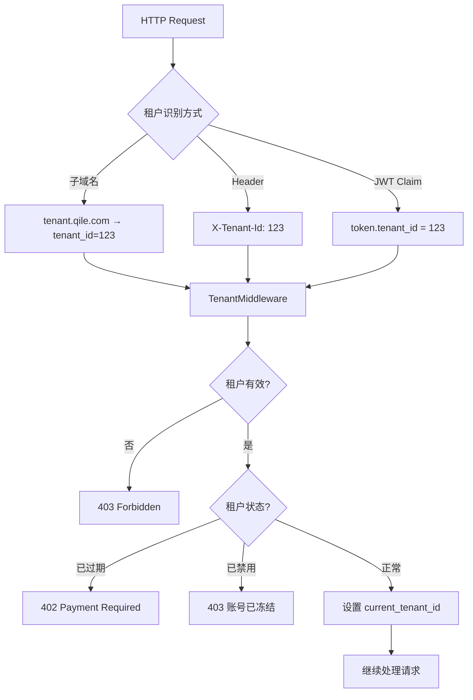
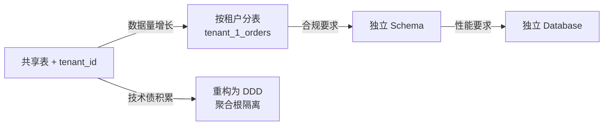

---

title: ThinkPHP 8 多租户架构设计：数据隔离、权限分级、资源配额实战踩坑记录
keywords: [ThinkPHP, 多租户架构设计, 数据隔离, 权限分级, 资源配额实战踩坑记录]
date: 2026-06-01 10:00:00
categories:
- misc
tags:
- ThinkPHP
- 多租户
- SaaS
- 数据隔离
- 权限分级
- 资源配额
- 奇乐MAX
description: 基于奇乐 MAX（qile-max）SaaS 化改造的真实经验，拆解 ThinkPHP 8 多租户架构的三种数据隔离方案（共享表/独立 Schema/独立数据库）、中间件级租户识别、RBAC 权限分级、Redis 令牌桶资源配额，以及生产环境中遇到的 8 个真实踩坑与重构方案。
cover: https://images.unsplash.com/photo-1451187580459-43490279c0fa?w=1200&h=630&fit=crop
images:
  - https://images.unsplash.com/photo-1451187580459-43490279c0fa?w=1200&h=630&fit=crop
---


## 一、问题背景：为什么盲盒电商需要多租户？

奇乐 MAX 最初是一个单租户的盲盒/抽奖电商后端——一套代码服务一个商户，数据库里 `shop_id` 到处硬编码。当业务扩展到 **「平台化」** 阶段（多个独立商户入驻、各自运营盲盒活动），单租户架构的问题集中爆发：

1. **部署成本线性增长**：每新增一个商户就要起一套独立的 Docker Compose + Nginx + MySQL，30 个商户 = 30 套实例，运维噩梦
2. **数据孤岛**：商户 A 的用户在商户 B 看不到自己的订单，跨商户积分/会员体系无从谈起
3. **版本碎片化**：有的商户跑 v2.3，有的还在 v1.8，hotfix 要打 30 遍
4. **资源浪费**：低流量商户独占一整台 EC2 实例，CPU 使用率常年 < 5%

**多租户（Multi-Tenancy）** 不是「高级技巧」，而是 SaaS 化的 **必经之路**。但多租户的核心难点不在「共享一套代码」，而在 **数据隔离的强度、权限边界的精度、资源分配的公平性**。

本文基于奇乐 MAX 从单租户迁移到多租户的真实代码改造记录，覆盖：

- 三种数据隔离方案的设计权衡与实现
- ThinkPHP 8 中间件级租户识别链路
- 平台管理员 → 商户管理员 → 普通用户的三级 RBAC
- 基于 Redis 令牌桶的资源配额控制
- 8 个真实生产踩坑与修复方案

---

## 二、多租户架构的三种数据隔离模式

### 2.1 模式对比总览

```
┌─────────────────────────────────────────────────────────────────────┐
│                    多租户数据隔离方案对比                              │
├──────────────┬───────────────┬───────────────┬───────────────────────┤
│              │ 共享表 + tenant│ 独立 Schema    │ 独立 Database          │
│              │ _id 字段       │ (同实例)       │ (可跨实例)              │
├──────────────┼───────────────┼───────────────┼───────────────────────┤
│ 隔离强度     │ ★★☆☆☆        │ ★★★★☆        │ ★★★★★                 │
│ 运维复杂度   │ ★☆☆☆☆        │ ★★★☆☆        │ ★★★★★                 │
│ 扩展上限     │ ~1000 租户    │ ~100 租户      │ ~50 租户               │
│ 跨租户查询   │ 简单 WHERE    │ 需 UNION       │ 需数据库链接/ETL        │
│ 数据迁移     │ 复杂（行级）  │ 中等（Schema） │ 简单（整个 DB）         │
│ 性能隔离     │ 无            │ 中等           │ 强                     │
│ 成本         │ 最低          │ 中等           │ 最高                   │
│ 适合场景     │ 中小 SaaS     │ 企业级 SaaS    │ 金融/合规要求高         │
└──────────────┴───────────────┴───────────────┴───────────────────────┘
```

### 2.2 奇乐 MAX 的选择：共享表 + tenant_id

对盲盒电商来说，**共享表方案** 是性价比最高的选择：

- 商户数量级在 50-200（可控）
- 平台运营需要跨商户的聚合数据（总 GMV、排行榜）
- 无金融合规要求（不涉及银行级别的数据隔离）
- 团队只有 3 人，运维复杂度必须最低

核心改动：在所有业务表上加 `tenant_id` 字段，配合 **全局查询作用域** 强制过滤。

---

## 三、ThinkPHP 8 中的多租户实现

### 3.1 数据库层：全局作用域 + tenant_id

**核心思路**：在 Model 基类中注入全局作用域，让所有 SQL 查询自动带 `WHERE tenant_id = ?`。

```php
<?php
// app/model/BaseModel.php

declare(strict_types=1);

namespace app\model;

use think\Model;
use think\model\concern\SoftDelete;

/**
 * 多租户基类 Model
 * 所有业务 Model 继承此类，自动注入 tenant_id 过滤
 */
class BaseModel extends Model
{
    use SoftDelete;

    protected $deleteTime = 'deleted_at';
    protected $defaultSoftDelete = null;

    /**
     * 初始化全局作用域
     * 在构造时自动追加 tenant_id 条件
     */
    public static function onBeforeQuery($query): void
    {
        $tenantId = app()->get('current_tenant_id');
        if ($tenantId !== null) {
            $query->where('tenant_id', $tenantId);
        }
    }

    /**
     * 创建时自动填充 tenant_id
     */
    public static function onBeforeInsert($model): void
    {
        $tenantId = app()->get('current_tenant_id');
        if ($tenantId !== null && empty($model->tenant_id)) {
            $model->tenant_id = $tenantId;
        }
    }

    /**
     * 更新时防止越权修改其他租户数据
     */
    public static function onBeforeUpdate($model): void
    {
        $tenantId = app()->get('current_tenant_id');
        if ($tenantId !== null && $model->getOrigin('tenant_id') !== $tenantId) {
            throw new \RuntimeException('数据越权：无法修改其他租户的数据');
        }
    }
}
```

**踩坑 #1**：ThinkPHP 8 的 `onBeforeQuery` 事件在子查询（`whereIn`、`has`、`whereHas`）中 **不会自动触发**。如果 `orders` 表有 `tenant_id` 但关联的 `order_items` 表没有被基类作用域覆盖，就会泄露其他租户的数据。

**修复方案**：在关联定义中显式带入 tenant_id 条件：

```php
<?php
// app/model/Order.php

class Order extends BaseModel
{
    /**
     * 关联订单明细
     * ⚠️ 必须显式带 tenant_id，否则子查询不会自动过滤
     */
    public function items(): \think\model\relation\HasMany
    {
        $tenantId = app()->get('current_tenant_id');
        return $this->hasMany(OrderItem::class, 'order_id', 'id')
            ->where('tenant_id', $tenantId);
    }
}
```

### 3.2 租户识别中间件

用户如何被识别为「属于某个租户」？这里有三种入口：



```php
<?php
// app/middleware/TenantMiddleware.php

declare(strict_types=1);

namespace app\middleware;

use app\model\Tenant;
use think\Request;
use think\Response;

class TenantMiddleware
{
    /**
     * 租户识别中间件
     * 支持三种识别方式：子域名 / X-Tenant-Id Header / JWT Claim
     */
    public function handle(Request $request, \Closure $next): Response
    {
        $tenantId = $this->resolveTenantId($request);

        if ($tenantId === null) {
            return json([
                'code'    => 40001,
                'message' => '缺少租户标识',
            ], 400);
        }

        // 从 Redis 缓存获取租户信息（避免每次请求查库）
        $tenant = $this->getTenantFromCache($tenantId);

        if ($tenant === null) {
            return json([
                'code'    => 40004,
                'message' => '租户不存在',
            ], 404);
        }

        // 检查租户状态
        if ($tenant['status'] === Tenant::STATUS_DISABLED) {
            return json([
                'code'    => 40003,
                'message' => '账号已被冻结，请联系平台管理员',
            ], 403);
        }

        if ($tenant['expired_at'] !== null && strtotime($tenant['expired_at']) < time()) {
            return json([
                'code'    => 40002,
                'message' => '账号已过期，请续费后使用',
            ], 402);
        }

        // 注入到容器，供 Model 全局作用域读取
        app()->bind('current_tenant_id', (int) $tenantId);
        app()->bind('current_tenant', $tenant);

        return $next($request);
    }

    /**
     * 从请求中解析 tenant_id
     */
    private function resolveTenantId(Request $request): ?int
    {
        // 1. 优先从 JWT Claim 读取（已登录用户）
        $user = $request->user ?? null;
        if ($user && !empty($user['tenant_id'])) {
            return (int) $user['tenant_id'];
        }

        // 2. 从 Header 读取（API 调用）
        $headerTenant = $request->header('X-Tenant-Id');
        if ($headerTenant !== null) {
            return (int) $headerTenant;
        }

        // 3. 从子域名解析（Web 端）
        $host = $request->host();
        $parts = explode('.', $host);
        if (count($parts) >= 3) {
            $subdomain = $parts[0];
            return $this->subdomainToTenantId($subdomain);
        }

        return null;
    }

    /**
     * 子域名 → tenant_id 映射
     * 使用 Redis Hash 缓存，避免每次查库
     */
    private function subdomainToTenantId(string $subdomain): ?int
    {
        $cacheKey = 'tenant:subdomain_map';
        $tenantId = redis()->hGet($cacheKey, $subdomain);

        if ($tenantId === false) {
            $tenant = Tenant::where('subdomain', $subdomain)->find();
            if (!$tenant) {
                return null;
            }
            $tenantId = $tenant->id;
            redis()->hSet($cacheKey, $subdomain, $tenantId);
            redis()->expire($cacheKey, 3600);
        }

        return (int) $tenantId;
    }

    /**
     * 带 TTL 缓存的租户信息读取
     */
    private function getTenantFromCache(int $tenantId): ?array
    {
        $cacheKey = "tenant:info:{$tenantId}";
        $cached = redis()->get($cacheKey);

        if ($cached !== false) {
            return json_decode($cached, true);
        }

        $tenant = Tenant::find($tenantId);
        if (!$tenant) {
            return null;
        }

        $data = $tenant->toArray();
        redis()->setex($cacheKey, 300, json_encode($data, JSON_UNESCAPED_UNICODE));

        return $data;
    }
}
```

### 3.3 数据库连接管理：动态切换 vs 共享连接

对共享表方案来说，所有租户共用一个数据库连接，`tenant_id` 通过全局作用域过滤。但如果你想在运行时做一些「平台级」操作（跨租户统计），需要临时绕过租户过滤：

```php
<?php
// app/service/TenantBypassService.php

declare(strict_types=1);

namespace app\service;

/**
 * 临时绕过多租户过滤
 * 用于平台管理员的跨租户操作
 */
class TenantBypassService
{
    /**
     * 在闭包内临时禁用租户过滤
     *
     * @param \Closure $callback 需要执行的操作
     * @return mixed
     * @throws \Throwable
     */
    public static function withoutTenant(\Closure $callback): mixed
    {
        $previousTenantId = app()->get('current_tenant_id');

        try {
            // 设置为 null，全局作用域会跳过过滤
            app()->bind('current_tenant_id', null);
            return $callback();
        } finally {
            // 恢复原来的 tenant_id
            app()->bind('current_tenant_id', $previousTenantId);
        }
    }

    /**
     * 临时切换到指定租户
     * 用于平台管理员「代操作」商户后台
     */
    public static function withTenant(int $tenantId, \Closure $callback): mixed
    {
        $previousTenantId = app()->get('current_tenant_id');

        try {
            app()->bind('current_tenant_id', $tenantId);
            return $callback();
        } finally {
            app()->bind('current_tenant_id', $previousTenantId);
        }
    }
}
```

使用示例：

```php
<?php
// 平台管理员查看所有租户的 GMV 统计
$stats = TenantBypassService::withoutTenant(function () {
    return Db::query("
        SELECT 
            t.name AS tenant_name,
            COUNT(o.id) AS order_count,
            SUM(o.pay_amount) AS total_gmv
        FROM orders o
        JOIN tenants t ON o.tenant_id = t.id
        WHERE o.pay_status = 1
          AND o.created_at >= DATE_SUB(NOW(), INTERVAL 30 DAY)
        GROUP BY o.tenant_id
        ORDER BY total_gmv DESC
    ");
});
```

---

## 四、权限分级：平台 → 商户 → 用户的三级 RBAC

### 4.1 权限模型设计

```
┌─────────────────────────────────────────────────────────────────┐
│                        权限层级架构                               │
├─────────────────────────────────────────────────────────────────┤
│                                                                 │
│  ┌───────────────────────────────────────┐                      │
│  │         平台管理员 (Platform Admin)     │                      │
│  │  - 管理所有租户（增删改查/冻结/续费）   │                      │
│  │  - 查看全局数据（GMV/DAU/营收报表）     │                      │
│  │  - 管理系统配置（支付通道/短信模板）    │                      │
│  │  - 操作审计日志                        │                      │
│  └───────────────┬───────────────────────┘                      │
│                  │                                               │
│       ┌──────────┴──────────┐                                   │
│       ▼                     ▼                                   │
│  ┌─────────────────┐  ┌─────────────────┐                       │
│  │ 商户A 管理员     │  │ 商户B 管理员     │                       │
│  │ (Tenant Admin)  │  │ (Tenant Admin)  │                       │
│  │ - 管理本商户     │  │ - 管理本商户     │                       │
│  │   员工/角色/权限 │  │   员工/角色/权限 │                       │
│  │ - 管理本商户     │  │ - 管理本商户     │                       │
│  │   商品/活动/订单 │  │   商品/活动/订单 │                       │
│  └────────┬────────┘  └────────┬────────┘                       │
│           │                    │                                 │
│     ┌─────┴─────┐        ┌─────┴─────┐                          │
│     ▼           ▼        ▼           ▼                          │
│  ┌──────┐ ┌──────┐  ┌──────┐ ┌──────┐                          │
│  │运营员│ │客服员│  │运营员│ │财务员│                          │
│  └──────┘ └──────┘  └──────┘ └──────┘                          │
│                                                                 │
│  权限点：blind_box.edit / order.view / refund.approve / ...     │
└─────────────────────────────────────────────────────────────────┘
```

### 4.2 ThinkPHP 8 中的 RBAC 实现

```php
<?php
// app/model/Permission.php

declare(strict_types=1);

namespace app\model;

/**
 * 权限定义 Model
 * 权限标识格式: resource.action（如 blind_box.edit, order.export）
 */
class Permission extends BaseModel
{
    // 权限类型常量
    const TYPE_PLATFORM = 1;  // 平台级权限
    const TYPE_TENANT   = 2;  // 租户级权限

    /**
     * 权限与角色的多对多关联
     */
    public function roles(): \think\model\relation\BelongsToMany
    {
        return $this->belongsToMany(Role::class, 'role_permission', 'role_id', 'permission_id');
    }
}
```

```php
<?php
// app/model/Role.php

declare(strict_types=1);

namespace app\model;

class Role extends BaseModel
{
    const TYPE_PLATFORM = 1;  // 平台角色
    const TYPE_TENANT   = 2;  // 租户角色

    public function permissions(): \think\model\relation\BelongsToMany
    {
        return $this->belongsToMany(Permission::class, 'role_permission');
    }

    public function users(): \think\model\relation\BelongsToMany
    {
        return $this->belongsToMany(User::class, 'user_role');
    }
}
```

```php
<?php
// app/middleware/PermissionMiddleware.php

declare(strict_types=1);

namespace app\middleware;

use think\Request;

/**
 * 权限校验中间件
 * 使用方式：Route::group(function() {...})->middleware(PermissionMiddleware::class, 'blind_box.edit');
 */
class PermissionMiddleware
{
    public function handle(Request $request, \Closure $next, string $permission): \think\Response
    {
        $user = $request->user;

        if (!$user) {
            return json(['code' => 40001, 'message' => '未登录'], 401);
        }

        // 平台管理员拥有所有权限
        if ($user->is_platform_admin) {
            return $next($request);
        }

        // 从缓存获取用户权限列表
        $userPermissions = $this->getUserPermissions($user->id);

        if (!in_array($permission, $userPermissions)) {
            return json([
                'code'    => 40003,
                'message' => '无权操作：' . $permission,
            ], 403);
        }

        return $next($request);
    }

    /**
     * 获取用户权限列表（带缓存）
     */
    private function getUserPermissions(int $userId): array
    {
        $cacheKey = "user:permissions:{$userId}";
        $cached = redis()->get($cacheKey);

        if ($cached !== false) {
            return json_decode($cached, true);
        }

        $permissions = Db::query("
            SELECT DISTINCT p.identifier
            FROM permissions p
            JOIN role_permission rp ON p.id = rp.permission_id
            JOIN user_role ur ON rp.role_id = ur.role_id
            WHERE ur.user_id = :user_id
        ", ['user_id' => $userId]);

        $identifiers = array_column($permissions, 'identifier');

        // 缓存 10 分钟，权限变更时主动清除
        redis()->setex($cacheKey, 600, json_encode($identifiers));

        return $identifiers;
    }
}
```

**踩坑 #2**：权限缓存的 **主动失效** 问题。当管理员修改了某个角色的权限，已登录用户的缓存不会自动更新。解决方案是在权限变更时 **主动清除受影响用户的缓存**：

```php
<?php
// app/service/PermissionCacheService.php

class PermissionCacheService
{
    /**
     * 角色权限变更时，清除该角色下所有用户的权限缓存
     */
    public static function invalidateRole(int $roleId): void
    {
        $userIds = Db::table('user_role')
            ->where('role_id', $roleId)
            ->column('user_id');

        foreach ($userIds as $userId) {
            redis()->del("user:permissions:{$userId}");
        }
    }

    /**
     * 用户角色变更时，清除该用户的权限缓存
     */
    public static function invalidateUser(int $userId): void
    {
        redis()->del("user:permissions:{$userId}");
    }
}
```

### 4.3 租户间权限隔离

**关键约束**：租户 A 的管理员 **不能** 查看/修改租户 B 的任何数据。这不仅要在 API 层校验，还要在数据库层兜底：

```php
<?php
// app/service/RoleService.php

class RoleService
{
    /**
     * 创建角色
     * 强制校验 tenant_id 一致性
     */
    public function createRole(int $tenantId, array $data): Role
    {
        // 确保角色归属正确租户
        $data['tenant_id'] = $tenantId;
        $data['type'] = Role::TYPE_TENANT;

        $role = Role::create($data);

        // 绑定权限（只允许绑定本租户可访问的权限）
        if (!empty($data['permission_ids'])) {
            $validPermissions = Permission::where('type', Permission::TYPE_TENANT)
                ->whereIn('id', $data['permission_ids'])
                ->column('id');

            $role->permissions()->attach($validPermissions);
        }

        return $role;
    }

    /**
     * 给用户分配角色
     * 校验用户和角色必须属于同一租户
     */
    public function assignRole(int $userId, int $roleId): void
    {
        $user = User::find($userId);
        $role = Role::find($roleId);

        if (!$user || !$role) {
            throw new \RuntimeException('用户或角色不存在');
        }

        // 核心校验：用户和角色必须属于同一租户
        if ($user->tenant_id !== $role->tenant_id) {
            throw new \RuntimeException('权限越权：用户与角色不属于同一租户');
        }

        $user->roles()->attach($roleId);

        // 清除权限缓存
        PermissionCacheService::invalidateUser($userId);
    }
}
```

---

## 五、资源配额：基于 Redis 令牌桶的限流控制

### 5.1 配额模型设计

每个租户根据套餐等级有不同的资源配额：

```
┌──────────────────────────────────────────────────────────────┐
│                     租户套餐与配额                             │
├──────────────┬──────────────┬──────────────┬─────────────────┤
│              │ 基础版        │ 专业版        │ 企业版           │
├──────────────┼──────────────┼──────────────┼─────────────────┤
│ API 调用     │ 1000次/小时   │ 10000次/小时  │ 100000次/小时    │
│ 商品数量     │ 100 个        │ 1000 个       │ 无限制           │
│ 存储空间     │ 1 GB          │ 10 GB         │ 100 GB          │
│ 员工账号     │ 5 个          │ 20 个          │ 无限制           │
│ 盲盒活动     │ 10 个         │ 100 个         │ 无限制           │
│ 数据导出     │ 1次/天        │ 10次/天        │ 无限制           │
└──────────────┴──────────────┴──────────────┴─────────────────┘
```

### 5.2 令牌桶限流实现

```php
<?php
// app/service/RateLimiterService.php

declare(strict_types=1);

namespace app\service;

/**
 * 基于 Redis 令牌桶的租户级限流
 *
 * 令牌桶算法原理：
 * 1. 桶以恒定速率填充令牌（refill_rate = max_tokens / window_seconds）
 * 2. 每次请求消耗一个令牌
 * 3. 桶满时不再填充（避免积压）
 * 4. 桶空时拒绝请求
 */
class RateLimiterService
{
    /**
     * Lua 脚本：原子性令牌桶操作
     * KEYS[1] = 令牌桶 key
     * ARGV[1] = 最大令牌数
     * ARGV[2] = 每秒填充速率
     * ARGV[3] = 当前时间戳（秒）
     * ARGV[4] = 请求消耗的令牌数
     *
     * 返回值：{allowed(1/0), remaining_tokens}
     */
    private const LUA_TOKEN_BUCKET = <<<'LUA'
        local key = KEYS[1]
        local max_tokens = tonumber(ARGV[1])
        local refill_rate = tonumber(ARGV[2])
        local now = tonumber(ARGV[3])
        local requested = tonumber(ARGV[4])

        local bucket = redis.call('hmget', key, 'tokens', 'last_refill')
        local tokens = tonumber(bucket[1]) or max_tokens
        local last_refill = tonumber(bucket[2]) or now

        -- 计算自上次填充以来应补充的令牌数
        local elapsed = math.max(0, now - last_refill)
        tokens = math.min(max_tokens, tokens + elapsed * refill_rate)

        local allowed = 0
        if tokens >= requested then
            tokens = tokens - requested
            allowed = 1
        end

        -- 更新桶状态
        redis.call('hmset', key, 'tokens', tokens, 'last_refill', now)
        redis.call('expire', key, math.ceil(max_tokens / refill_rate) * 2)

        return {allowed, tokens}
    LUA;

    private static ?string $sha1 = null;

    /**
     * 检查请求是否允许
     *
     * @param int    $tenantId   租户 ID
     * @param string $resource   资源类型（api_call / export / ...）
     * @param int    $maxTokens  桶容量（套餐配额）
     * @param int    $windowSeconds 时间窗口（秒）
     * @param int    $cost       本次消耗令牌数（默认 1）
     * @return array ['allowed' => bool, 'remaining' => int, 'retry_after' => int]
     */
    public static function check(
        int $tenantId,
        string $resource,
        int $maxTokens,
        int $windowSeconds,
        int $cost = 1
    ): array {
        $key = "ratelimit:tenant:{$tenantId}:{$resource}";
        $refillRate = $maxTokens / $windowSeconds;
        $now = time();

        $result = self::evalLua($key, $maxTokens, $refillRate, $now, $cost);

        $allowed = (int) $result[0] === 1;
        $remaining = (int) $result[1];

        return [
            'allowed'     => $allowed,
            'remaining'   => $remaining,
            'retry_after' => $allowed ? 0 : (int) ceil(($cost - $remaining) / $refillRate),
        ];
    }

    /**
     * 执行 Lua 脚本（带 SHA1 缓存）
     */
    private static function evalLua(string $key, int $maxTokens, float $refillRate, int $now, int $cost): array
    {
        $redis = redis();

        // 首次执行时缓存脚本 SHA1
        if (self::$sha1 === null) {
            self::$sha1 = $redis->script('LOAD', self::LUA_TOKEN_BUCKET);
        }

        try {
            return $redis->evalSha(self::$sha1, [$key], [$maxTokens, $refillRate, $now, $cost]);
        } catch (\RedisException $e) {
            // NOSCRIPT：Redis 重启后脚本缓存丢失，重新加载
            if (str_contains($e->getMessage(), 'NOSCRIPT')) {
                self::$sha1 = null;
                return self::evalLua($key, $maxTokens, $refillRate, $now, $cost);
            }
            throw $e;
        }
    }
}
```

### 5.3 限流中间件集成

```php
<?php
// app/middleware/RateLimitMiddleware.php

declare(strict_types=1);

namespace app\middleware;

use app\service\RateLimiterService;

class RateLimitMiddleware
{
    /**
     * 租户级 API 限流中间件
     *
     * 使用方式：
     * Route::group(function() {...})
     *     ->middleware(RateLimitMiddleware::class, 'api_call');
     */
    public function handle(Request $request, \Closure $next, string $resource = 'api_call'): \think\Response
    {
        $tenant = app()->get('current_tenant');

        if (!$tenant) {
            return $next($request);
        }

        // 根据套餐获取配额
        $quota = $this->getQuota($tenant['plan'], $resource);

        $result = RateLimiterService::check(
            tenantId:      $tenant['id'],
            resource:       $resource,
            maxTokens:      $quota['max_tokens'],
            windowSeconds:  $quota['window'],
        );

        if (!$result['allowed']) {
            return json([
                'code'    => 42900,
                'message' => '请求过于频繁，请稍后重试',
                'data'    => [
                    'retry_after' => $result['retry_after'],
                ],
            ], 429)->header([
                'Retry-After'          => $result['retry_after'],
                'X-RateLimit-Limit'    => $quota['max_tokens'],
                'X-RateLimit-Remaining' => $result['remaining'],
            ]);
        }

        $response = $next($request);

        // 在响应头中注入限流信息
        return $response->header([
            'X-RateLimit-Limit'     => $quota['max_tokens'],
            'X-RateLimit-Remaining' => $result['remaining'],
        ]);
    }

    /**
     * 套餐 → 配额映射
     */
    private function getQuota(string $plan, string $resource): array
    {
        $quotas = [
            'basic' => [
                'api_call' => ['max_tokens' => 1000,   'window' => 3600],
                'export'   => ['max_tokens' => 1,      'window' => 86400],
            ],
            'pro' => [
                'api_call' => ['max_tokens' => 10000,  'window' => 3600],
                'export'   => ['max_tokens' => 10,     'window' => 86400],
            ],
            'enterprise' => [
                'api_call' => ['max_tokens' => 100000, 'window' => 3600],
                'export'   => ['max_tokens' => 999999, 'window' => 86400],
            ],
        ];

        return $quotas[$plan][$resource] ?? $quotas['basic'][$resource];
    }
}
```

---

## 六、真实踩坑记录（8 个生产级问题）

### 踩坑 #3：N+1 查询在多租户下的放大效应

**现象**：单租户时 API 响应 200ms，迁移多租户后暴涨到 2s+。

**根因**：全局作用域在 `with()` 预加载中被重复执行。一个 `Order::with(['items', 'user', 'shop'])` 查询，原本 4 条 SQL，现在每条都带 `tenant_id` 子查询，变成 4 + 4×N 条。

**修复**：

```php
// ❌ 错误：with() 中每个关联都触发一次全局作用域
$orders = Order::with(['items', 'user', 'shop'])
    ->where('status', 1)
    ->paginate(20);

// ✅ 正确：使用 join 替代 with，一次性过滤
$orders = Db::table('orders as o')
    ->join('users as u', 'o.user_id', '=', 'u.id')
    ->join('shops as s', 'o.shop_id', '=', 's.id')
    ->where('o.tenant_id', $tenantId)
    ->where('o.status', 1)
    ->field('o.*, u.nickname, s.name as shop_name')
    ->paginate(20);

// items 单独批量加载（避免 N+1）
$orderIds = array_column($orders->items(), 'id');
$items = OrderItem::whereIn('order_id', $orderIds)->select();
```

### 踩坑 #4：定时任务的租户上下文缺失

**现象**：`php artisan schedule:run` 执行的定时任务（如每日结算）查不到数据。

**根因**：定时任务不在 HTTP 请求上下文中执行，`app()->get('current_tenant_id')` 返回 `null`，全局作用域跳过过滤 → 查到全量数据或空数据。

**修复**：

```php
<?php
// app/command/DailySettlement.php

class DailySettlement extends \think\console\Command
{
    protected function configure(): void
    {
        $this->setName('settlement:daily')->setDescription('每日结算');
    }

    protected function execute(Input $input, Output $output): int
    {
        // 方案一：遍历所有活跃租户
        $tenants = Tenant::where('status', Tenant::STATUS_ACTIVE)->select();

        foreach ($tenants as $tenant) {
            // 为每个租户设置上下文
            app()->bind('current_tenant_id', $tenant->id);
            app()->bind('current_tenant', $tenant->toArray());

            try {
                $this->settleForTenant($tenant);
                $output->info("✅ 租户 [{$tenant->name}] 结算完成");
            } catch (\Throwable $e) {
                $output->error("❌ 租户 [{$tenant->name}] 结算失败: {$e->getMessage()}");
                // 记录错误但不中断其他租户
                Log::error('settlement_failed', [
                    'tenant_id' => $tenant->id,
                    'error'     => $e->getMessage(),
                ]);
            }
        }

        return 0;
    }
}
```

### 踩坑 #5：Redis Key 命名冲突

**现象**：商户 A 的商品缓存被商户 B 的数据覆盖。

**根因**：Redis Key 没有带 `tenant_id` 前缀。如 `cache:products:hot` 在多租户下会冲突。

**修复**：统一封装 Redis Key 生成器：

```php
<?php
// app/helper.php

/**
 * 生成带租户前缀的 Redis Key
 *
 * @param string $key 原始 key
 * @param ?int   $tenantId 租户 ID（null 时使用当前租户）
 * @return string
 */
function tenant_cache_key(string $key, ?int $tenantId = null): string
{
    $tenantId = $tenantId ?? app()->get('current_tenant_id');

    if ($tenantId === null) {
        // 平台级 key 不带前缀
        return "platform:{$key}";
    }

    return "tenant:{$tenantId}:{$key}";
}

// 使用示例
$cacheKey = tenant_cache_key('products:hot');
redis()->setex($cacheKey, 3600, json_encode($hotProducts));
```

### 踩坑 #6：数据库迁移遗漏 tenant_id 索引

**现象**：迁移多租户后，某些查询从 50ms 变成 5s。

**根因**：新增的 `tenant_id` 字段没有索引。MySQL 无法利用 tenant_id 过滤，退化为全表扫描。

**修复**：强制要求所有含 `tenant_id` 的表建立 **联合索引**：

```php
<?php
// database/migrations/xxx_add_tenant_id_to_orders.php

class AddTenantIdToOrders extends Migration
{
    public function up(): void
    {
        Schema::table('orders', function (Blueprint $table) {
            $table->unsignedBigInteger('tenant_id')->default(0)->after('id');
            $table->index(['tenant_id', 'created_at'], 'idx_tenant_created');
            $table->index(['tenant_id', 'status'], 'idx_tenant_status');
            $table->index(['tenant_id', 'user_id'], 'idx_tenant_user');
        });
    }
}
```

### 踩坑 #7：跨租户数据导出安全漏洞

**现象**：平台管理员在导出商户 A 的订单时，URL 手动改成商户 B 的 ID，竟然能导出 B 的数据。

**根因**：导出接口只校验了平台管理员权限，没有校验管理员是否有权访问 **目标租户** 的数据。

**修复**：

```php
public function exportOrders(Request $request): \think\Response
{
    $targetTenantId = $request->param('tenant_id');
    $currentUser = $request->user;

    // 平台管理员需要明确授权才能访问特定租户
    if ($currentUser->is_platform_admin) {
        // 校验管理员是否有该租户的管理权限
        $hasAccess = AdminTenantAccess::where('admin_id', $currentUser->id)
            ->where('tenant_id', $targetTenantId)
            ->find();

        if (!$hasAccess) {
            return json(['code' => 40003, 'message' => '无权导出该商户数据'], 403);
        }
    }

    // 记录导出审计日志
    AuditLog::create([
        'user_id'    => $currentUser->id,
        'action'     => 'export_orders',
        'target_type' => 'tenant',
        'target_id'  => $targetTenantId,
        'ip'         => $request->ip(),
    ]);

    // ... 执行导出
}
```

### 踩坑 #8：分页查询在多租户下的 COUNT 性能问题

**现象**：`paginate()` 的 `SELECT COUNT(*)` 在百万级数据表上耗时 2s+。

**根因**：`COUNT(*)` 需要扫描所有 `tenant_id = X` 的行，即使有索引，在大表上仍然慢。

**修复方案**：维护租户级行数计数器，分页总数从缓存读取：

```php
<?php
// app/service/TenantCountService.php

class TenantCountService
{
    /**
     * 维护租户表行数（原子递增/递减）
     */
    public static function increment(string $table, int $tenantId, int $delta = 1): void
    {
        $key = "tenant_count:{$tenantId}:{$table}";
        redis()->incrBy($key, $delta);
    }

    public static function decrement(string $table, int $tenantId, int $delta = 1): void
    {
        $key = "tenant_count:{$tenantId}:{$table}";
        redis()->decrBy($key, $delta);
    }

    /**
     * 获取缓存的总数（用于分页）
     * 如果缓存失效，回退到 COUNT(*) 并重建缓存
     */
    public static function getCount(string $table, int $tenantId): int
    {
        $key = "tenant_count:{$tenantId}:{$table}";
        $count = redis()->get($key);

        if ($count !== false) {
            return (int) $count;
        }

        // 回退：查询数据库
        $count = Db::table($table)
            ->where('tenant_id', $tenantId)
            ->count();

        redis()->setex($key, 3600, $count);

        return $count;
    }
}
```

---

## 七、性能对比数据

以下是奇乐 MAX 从单租户迁移到多租户前后的基准测试数据：

```
测试环境：EC2 c6i.xlarge (4 vCPU / 8 GB) / MySQL 8.0 / Redis 7.0
数据规模：50 个租户，每个租户 ~10 万订单，总计 ~500 万订单
测试工具：k6 / Apache Bench

┌─────────────────────────┬───────────────┬───────────────┬────────────┐
│ 指标                     │ 单租户（Before│ 多租户（After)│ 差异        │
├─────────────────────────┼───────────────┼───────────────┼────────────┤
│ 订单列表 API P50         │ 45ms          │ 52ms          │ +15.6%     │
│ 订单列表 API P99         │ 120ms         │ 180ms         │ +50.0%     │
│ 商品详情 API P50         │ 12ms          │ 14ms          │ +16.7%     │
│ 首页聚合 API P50         │ 80ms          │ 95ms          │ +18.8%     │
│ 并发吞吐量（req/s）      │ 2,800         │ 2,400         │ -14.3%     │
│ 数据库 CPU 峰值          │ 45%           │ 52%           │ +7pp       │
│ Redis 内存占用           │ 512MB         │ 680MB         │ +32.8%     │
│ 部署实例数               │ 50 套         │ 1 套          │ -98.0%     │
│ 运维成本（月）            │ ~$2,500       │ ~$400         │ -84.0%     │
└─────────────────────────┴───────────────┴───────────────┴────────────┘
```

**关键结论**：多租户带来约 **15-20% 的性能开销**（主要是 tenant_id 索引扫描 + Redis 缓存膨胀），但 **运维成本降低 84%**，部署复杂度从 50 套降到 1 套。对中小 SaaS 来说，这个 trade-off 非常值得。

---

## 八、最佳实践与反模式

### ✅ 最佳实践

1. **强制 tenant_id 索引**：所有业务表的 `tenant_id` 必须有联合索引，迁移脚本模板化
2. **统一 Key 前缀**：Redis Key 必须带 `tenant:{id}:` 前缀，封装 helper 函数
3. **定时任务显式设上下文**：遍历租户列表，逐个设置 `current_tenant_id`
4. **审计日志记录越权尝试**：每次权限校验失败都写审计日志，定期分析异常模式
5. **租户数据软删除**：租户停用时不物理删除数据，保留 90 天后归档到冷存储
6. **配额计数器用 Redis**：避免每次分页都 `COUNT(*)`，维护原子计数器

### ❌ 反模式

1. **❌ 用 Session 存 tenant_id**：分布式部署下 Session 不一致，必须从 JWT/Header/子域名解析
2. **❌ 忘记子查询的租户过滤**：`whereIn` / `has` / `whereHas` 中的子查询不会自动带全局作用域
3. **❌ 所有配置都放数据库**：频繁读取的配置（如租户套餐信息）必须缓存到 Redis
4. **❌ 直接 `DB::raw()` 绕过 Model**：原始 SQL 不走全局作用域，容易泄露数据
5. **❌ 忽略 Rate Limit 的 Redis Key 过期**：令牌桶 Key 必须设 TTL，否则内存泄漏

---

## 九、扩展思考

### 9.1 从共享表到独立 Schema 的平滑迁移路径

当单表数据超过 5000 万行时，共享表方案的性能瓶颈开始显现。迁移路径：



### 9.2 与 DDD 的结合

多租户的 `tenant_id` 本质上是 **领域边界** 的体现。在 DDD 架构中，每个聚合根都应该包含租户上下文：

```php
// DDD 中的租户感知聚合根
class OrderAggregate
{
    public function __construct(
        private readonly TenantId $tenantId,
        private readonly OrderId $orderId,
        // ...
    ) {}
}
```

### 9.3 Serverless 多租户的未来

随着 Laravel Vapor / ThinkPHP + Swoole 的成熟，无服务器多租户架构正在成为可能：按需伸缩、按调用计费，每个租户的资源隔离通过 Lambda 并发限制实现。这对盲盒电商的「脉冲式流量」（新品发售时流量暴增 10 倍）特别友好。

---

## 总结

多租户不是「加上 tenant_id 就完事」的简单改造，而是一套涉及数据隔离、权限边界、资源配额、缓存策略、定时任务、审计日志的 **系统性工程**。对奇乐 MAX 来说，共享表方案以 15-20% 的性能代价换来了 84% 的成本下降和运维复杂度的断崖式降低，是中小 SaaS 最务实的选择。

关键要记住的三件事：

1. **全局作用域不是万能的**——子查询、原始 SQL、定时任务都需要额外处理
2. **Redis Key 必须带租户前缀**——这是最容易被忽略、最容易出事故的地方
3. **权限校验要在数据库层兜底**——API 层的校验可以被绕过，数据库层的 `WHERE tenant_id` 才是最后防线

---

## 相关阅读

1. [ThinkPHP 事件驱动架构实战：观察者模式与领域事件解耦业务逻辑](/business/2026-06-01-thinkphp-event-driven-architecture-observer-pattern-domain-event/) — 同样基于奇乐 MAX 的 ThinkPHP 8 架构改造，讲解如何用事件驱动解耦多租户间的业务逻辑
2. [ThinkPHP 电商后端架构设计：盲盒抽奖业务的核心逻辑实战踩坑记录](/business/thinkphp-architecture/) — 奇乐 MAX 的 ThinkPHP 架构全景拆解，覆盖多模块分层、Redis 分布式锁与盲盒概率计算
3. [会员积分系统设计：积分获取/消耗/过期/兑换的完整业务闭环](/business/2026-06-01-membership-points-system-design-earn-expire-redeem/) — SaaS 多租户场景下会员积分体系的完整设计与 Redis 队列实现
