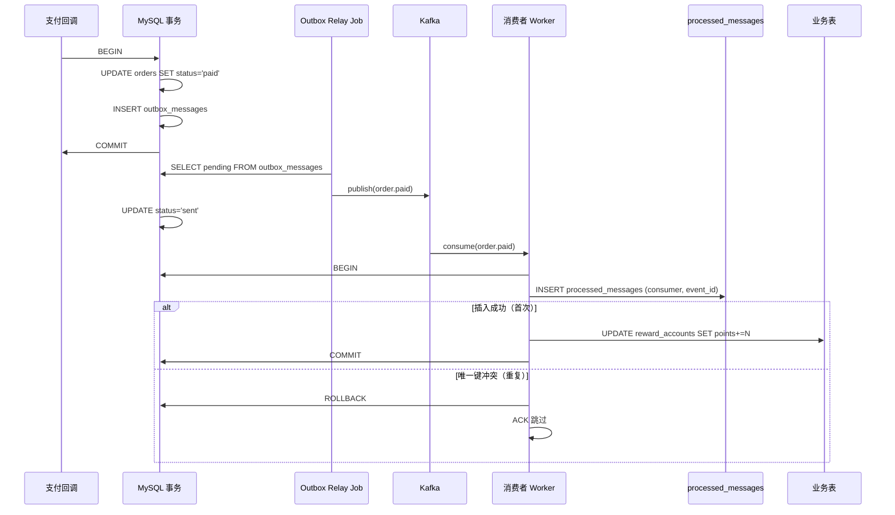

在 Laravel 订单系统里，我最不信的一句话就是“这条消息只会消费一次”。Kafka rebalance、消费者重启、手动重放，都会把 `OrderPaid` 再送一遍。真正可靠的方案不是追求 MQ 恰好一次，而是让**重复消息只生效一次**。

我最后固定下来的做法只有三层：**Outbox 保证可靠投递，Inbox/去重表保证消费者不重复执行业务，状态机保证误重放也推不动状态。**

## 一、最终架构

```text
支付回调
   |
   v
orders + payments + outbox_messages  (同事务)
   |
   v
Outbox Relay
   |
   v
Kafka: order.paid
   |
   +-------------+-------------+
   |             |             |
   v             v             v
库存消费者     积分消费者     通知消费者
   |             |             |
   v             v             v
processed_messages / inbox_records
   |
   v
业务表更新 + 状态流转 + 补偿记录
```

## 二、发送侧先写 Outbox

最危险的写法是订单改成已支付后直接发 MQ。数据库成功、MQ 失败时，下游永远不知道这次支付。

```php
<?php

DB::transaction(function () use ($order, $payment) {
    $order->update([
        'status' => 'paid',
        'paid_at' => $payment->paid_at,
    ]);

    DB::table('outbox_messages')->insert([
        'event_id' => (string) Str::uuid(),
        'topic' => 'order.paid',
        'aggregate_id' => (string) $order->id,
        'payload' => json_encode([
            'order_id' => $order->id,
            'user_id' => $order->user_id,
            'amount' => $order->paid_amount,
        ], JSON_UNESCAPED_UNICODE),
        'status' => 'pending',
        'created_at' => now(),
        'updated_at' => now(),
    ]);
});
```

### Outbox Messages 建表 DDL

先给出完整的建表语句，`event_id` 是全局唯一标识，`status` 控制投递生命周期：

```sql
CREATE TABLE `outbox_messages` (
    `id`          BIGINT UNSIGNED NOT NULL AUTO_INCREMENT,
    `event_id`    CHAR(36)        NOT NULL COMMENT 'UUID，全局去重键',
    `topic`       VARCHAR(128)    NOT NULL COMMENT '目标 MQ topic',
    `aggregate_id` VARCHAR(64)    NOT NULL COMMENT '聚合根 ID，用于 Kafka partition key',
    `payload`     JSON            NOT NULL,
    `headers`     JSON            DEFAULT NULL COMMENT '可选附加头：schema_version 等',
    `status`      ENUM('pending','sent','failed') NOT NULL DEFAULT 'pending',
    `retry_count` TINYINT UNSIGNED NOT NULL DEFAULT 0,
    `last_error`  TEXT            DEFAULT NULL,
    `created_at`  TIMESTAMP       NOT NULL DEFAULT CURRENT_TIMESTAMP,
    `sent_at`     TIMESTAMP       NULL DEFAULT NULL,
    PRIMARY KEY (`id`),
    UNIQUE KEY `uk_event_id` (`event_id`),
    INDEX `idx_status_created` (`status`, `created_at`),
    INDEX `idx_aggregate` (`aggregate_id`)
) ENGINE=InnoDB DEFAULT CHARSET=utf8mb4 COMMENT='Outbox 发件箱';
```

然后由 Relay Job 扫描 `pending` 并投递。即使进程挂掉，消息还在库里，可补发、可审计、可追 `event_id`。

### Outbox Relay Job 完整实现

```php
<?php

namespace App\Jobs;

use Illuminate\Bus\Queueable;
use Illuminate\Contracts\Queue\ShouldQueue;
use Illuminate\Foundation\Bus\Dispatchable;
use Illuminate\Queue\InteractsWithQueue;
use Illuminate\Queue\SerializesModels;
use Illuminate\Support\Facades\DB;
use Illuminate\Support\Facades\Log;

class OutboxRelayJob implements ShouldQueue
{
    use Dispatchable, InteractsWithQueue, Queueable, SerializesModels;

    public int $tries = 3;
    public int $timeout = 60;

    public function handle(): void
    {
        $messages = DB::table('outbox_messages')
            ->where('status', 'pending')
            ->where('created_at', '<', now()->subSeconds(5)) // 避免抢刚写入的事务
            ->orderBy('id')
            ->limit(100)
            ->lockForUpdate()
            ->get();

        foreach ($messages as $msg) {
            try {
                \Kafka::publish(
                    topic: $msg->topic,
                    key: $msg->aggregate_id,
                    body: $msg->payload,
                    headers: array_merge(
                        json_decode($msg->headers ?? '{}', true),
                        ['event_id' => $msg->event_id]
                    ),
                );

                DB::table('outbox_messages')
                    ->where('id', $msg->id)
                    ->update([
                        'status' => 'sent',
                        'sent_at' => now(),
                    ]);
            } catch (\Throwable $e) {
                DB::table('outbox_messages')
                    ->where('id', $msg->id)
                    ->update([
                        'status'   => DB::raw("IF(retry_count >= 5, 'failed', 'pending')"),
                        'retry_count' => DB::raw('retry_count + 1'),
                        'last_error' => $e->getMessage(),
                    ]);

                Log::error('Outbox relay failed', [
                    'event_id' => $msg->event_id,
                    'error'    => $e->getMessage(),
                ]);
            }
        }
    }
}
```

配合 `app/Console/Kernel.php` 每 10 秒调度一次：

```php
$schedule->job(OutboxRelayJob::class)->everyTenSeconds();
```

### 流程时序图



## 三、消费侧用唯一键抢幂等

### processed_messages 建表 DDL

```sql
CREATE TABLE `processed_messages` (
    `id`           BIGINT UNSIGNED NOT NULL AUTO_INCREMENT,
    `consumer`     VARCHAR(64) NOT NULL COMMENT '消费者标识，如 reward-order-paid',
    `message_id`   VARCHAR(64) NOT NULL COMMENT '对应 outbox_messages.event_id',
    `status`       ENUM('processing','completed','failed') NOT NULL DEFAULT 'processing',
    `payload`      JSON        DEFAULT NULL COMMENT '保留原始消息，方便排障',
    `result`       JSON        DEFAULT NULL COMMENT '处理结果摘要',
    `processed_at` TIMESTAMP   NOT NULL DEFAULT CURRENT_TIMESTAMP,
    PRIMARY KEY (`id`),
    UNIQUE KEY `uk_consumer_message` (`consumer`, `message_id`),
    INDEX `idx_message_id` (`message_id`)
) ENGINE=InnoDB DEFAULT CHARSET=utf8mb4 COMMENT='Inbox 消费去重表';
```

"先查有没有处理过"在并发下不稳，两个 worker 可能同时查到空结果。要直接抢唯一键：

```php
Schema::create('processed_messages', function (Blueprint $table) {
    $table->id();
    $table->string('consumer', 64);
    $table->string('message_id', 64);
    $table->timestamp('processed_at');
    $table->unique(['consumer', 'message_id']);
});
```

### 幂等消费者中间件

把去重逻辑抽成 Laravel 中间件/Listener，避免每个消费者都写重复代码：

```php
<?php

namespace App\Messages;

use Illuminate\Support\Facades\DB;

class IdempotentConsumer
{
    /**
     * @param string   $consumer  消费者标识
     * @param string   $messageId 消息 event_id
     * @param \Closure $callback  实际业务逻辑
     */
    public function handle(string $consumer, string $messageId, \Closure $callback): void
    {
        DB::transaction(function () use ($consumer, $messageId, $callback) {
            $inserted = DB::table('processed_messages')->insertOrIgnore([
                'consumer'     => $consumer,
                'message_id'   => $messageId,
                'status'       => 'processing',
                'processed_at' => now(),
            ]);

            if ($inserted === 0) {
                // 已处理过，直接跳过
                return;
            }

            $result = $callback();

            DB::table('processed_messages')
                ->where('consumer', $consumer)
                ->where('message_id', $messageId)
                ->update([
                    'status' => 'completed',
                    'result' => json_encode($result ?? ['ok' => true]),
                ]);
        });
    }
}
```

使用示例：

```php
// 在消费者 Job 中
app(IdempotentConsumer::class)->handle(
    consumer: 'reward-order-paid',
    messageId: $message['event_id'],
    callback: function () use ($message) {
        DB::table('reward_accounts')
            ->where('user_id', $message['user_id'])
            ->increment('points', (int) floor($message['amount'] / 10));
        return ['points_added' => floor($message['amount'] / 10)];
    }
);
```

处理消息时，把去重写入和业务更新放进同一事务：

```php
<?php

DB::transaction(function () use ($message) {
    $inserted = DB::table('processed_messages')->insertOrIgnore([
        'consumer' => 'reward-order-paid',
        'message_id' => $message['event_id'],
        'processed_at' => now(),
    ]);

    if ($inserted === 0) {
        return;
    }

    DB::table('reward_accounts')
        ->where('user_id', $message['user_id'])
        ->increment('points', (int) floor($message['amount'] / 10));
});
```

这张表本质上就是消费者的 Inbox。严格一点时，我会额外保留原始 payload 和处理结果，方便排障。

## 四、状态机做最后一道保险

就算去重表失效，核心状态也不能被重复推进：

```php
$affected = DB::table('orders')
    ->where('id', $message['order_id'])
    ->where('fulfillment_status', 'pending')
    ->update([
        'fulfillment_status' => 'reserved',
        'updated_at' => now(),
    ]);

if ($affected === 0) {
    return;
}
```

这类 `pending -> reserved` 的条件更新，能挡住脚本误重放和人工补投。

## 五、重放也要可控

我不会让运维直接改库补消息，而是保留按 `event_id` 重放的入口：

```php
<?php

$message = DB::table('outbox_messages')->where('event_id', $eventId)->first();

Kafka::publish(
    topic: $message->topic,
    key: $message->aggregate_id,
    body: $message->payload,
    headers: ['event_id' => $message->event_id, 'replay' => '1'],
);
```

真正成熟的系统，不是“不会出错”，而是**出错后还能安全重放**。

## 六、我踩过的坑

### 1. 只用 Redis `SETNX`

它适合短期防抖，不适合最终幂等。TTL 过期、主从切换、键淘汰后，旧消息还是可能重新生效。

### 2. 用 `order_id` 当去重键

同一订单会触发积分、通知、返佣等多个消费者，只用 `order_id` 会互相误伤。后来统一改成 `consumer + event_id`。

### 3. 去重表和业务表不在同一事务

先写去重表、后执行业务，一旦业务失败，这条消息就被"永久吞掉"。这是线上最隐蔽也最伤的一类问题。

+**正确做法**：将 `insertOrIgnore` 和业务更新放在同一个 `DB::transaction` 中，确保要么一起成功，要么一起回滚。

+```php
+// ❌ 错误示范：先写去重表，再执行业务，中间如果业务抛异常消息就被吞了
+DB::table('processed_messages')->insertOrIgnore([...]);
+DB::table('reward_accounts')->where(...)->increment('points', 100); // 这行如果失败呢？
+
+// ✅ 正确做法：同一个事务
+DB::transaction(function () use ($message) {
+    $inserted = DB::table('processed_messages')->insertOrIgnore([...]);
+    if ($inserted === 0) return;
+    DB::table('reward_accounts')->where(...)->increment('points', 100);
+});
+```

### 4. Outbox 消息堆积不清理

上线初期没有清理策略，`outbox_messages` 三个月膨胀到 800 万行，Relay 扫描越来越慢。后来加上定时归档：

```php
// 每天凌晨清理 7 天前已投递消息
$schedule->call(function () {
    DB::table('outbox_messages')
        ->where('status', 'sent')
        ->where('sent_at', '<', now()->subDays(7))
        ->delete();
})->dailyAt('03:00');
```

### 5. event_id 碰撞导致消息丢失

早期用 `Str::random(16)` 生成 event_id，理论上存在碰撞风险。改为 UUID v4 后再未出现。**event_id 建议用 UUID，永远不要用自增 ID 或短随机串。**

### 6. consumer 名称改了但去重表没清

某次重构把消费者标识从 `reward-order-paid` 改成 `order-paid-reward`，导致所有历史消息的 event_id 对新 consumer 来说都是"未处理"，触发了大面积重复发积分。后来的规范是：**consumer 名称一旦确定不允许变更，若必须改需要做历史数据迁移。**

### 7. 大 payload 导致 Kafka 消息超过 `max.request.size`

一次需求把 SKU 图片 URL 数组塞进了 outbox payload，单条消息超过 Kafka 默认的 1MB 限制，Relay 不断重试直至消息进入 `failed` 状态。解法：**payload 只放 ID 引用，详情由消费者反查数据库或走 HTTP。**

## 七、三种方案对比

| 维度 | Outbox 模式 | Inbox/去重表 | 纯幂等键（Redis SETNX） |
|------|------------|-------------|----------------------|
| **保障层次** | 发送端可靠投递 | 消费端去重 | 短期防抖 |
| **持久化** | 数据库行 | 数据库行 | 内存/TTL |
| **TTL 过期风险** | 无 | 无 | 有，键过期后重复消息可生效 |
| **适合场景** | 业务事件发布 | 消费端幂等 | 接口防重提交 |
| **运维复杂度** | 需要 Relay 调度 | 需要索引维护 | 低 |
| **可观测性** | 高，可查 payload 和投递状态 | 高，可查处理结果 | 低，仅知道 key 存在与否 |
| **主从切换影响** | 无 | 无 | Redis 主从异步复制可能丢键 |
| **推荐搭配** | ✓ 搭配 Inbox 使用 | ✓ 搭配 Outbox 使用 | 仅作补充，不作主力 |

实际生产中，我的建议是：**Outbox + Inbox/去重表 + 状态机条件更新，三层缺一不可**。Redis SETNX 只适合做接口级的短期防抖（比如支付回调接口 30 秒内去重），不能替代持久化去重。

## 八、结论

这套方案落地后，我们做过 broker rebalance 和消费者滚动发布演练，重复投递明显增加，但库存、积分、通知都没有再出现双写。我的经验很直接：**Outbox 解决可靠投递，Inbox 解决重复消费，状态机解决误重放。三层一起上，Laravel 的消息系统才算真正能扛生产。**

## 相关阅读

- [Saga 编排模式深度实战：Choreography vs Orchestration vs Temporal——Laravel 分布式事务的三种实现路线对比](/categories/架构/Saga-编排模式深度实战-Choreography-vs-Orchestration-vs-Temporal-Laravel分布式事务的三种实现路线对比/)
- [Eventual Consistency 实战：最终一致性在电商场景中的工程化——反压、冲突解决与用户感知延迟](/categories/架构/Eventual-Consistency-实战-最终一致性在电商场景中的工程化-反压冲突解决与用户感知延迟/)
- [Kafka + Debezium CDC 实战：数据库变更事件流——与 Laravel Event Sourcing 的互补架构设计](/categories/架构/2026-06-03-Kafka-Debezium-CDC-实战-数据库变更事件流-Laravel互补架构/)