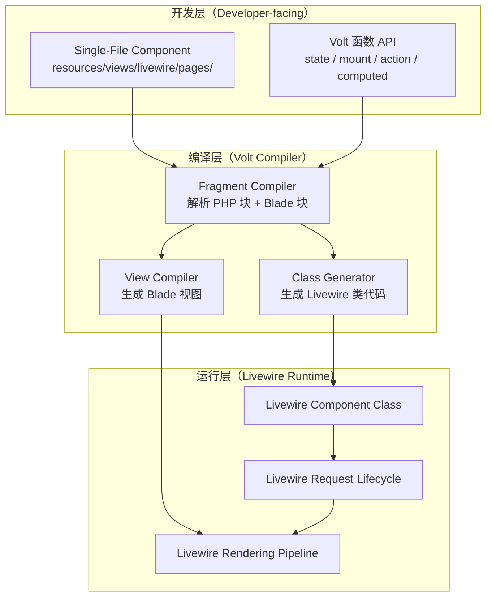
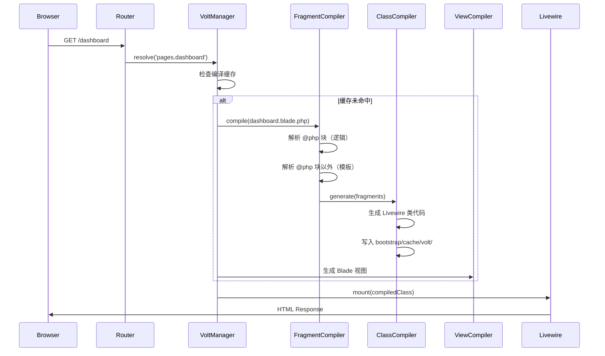

# Laravel Volt 实战：单文件 Blade 组件与 Livewire 集成深度剖析

## 1. 问题背景与动机：为什么需要 Volt？

### 1.1 传统 Livewire 的双文件困境

在 Laravel B2C 项目中，Livewire 已经成为管理后台和交互页面的标配。但传统 Livewire 组件有一个明显的工程痛点：**每个组件必须维护两个文件**。

```
app/Livewire/
├── ProductSearch.php          # 类文件：状态 + 逻辑
└── product-search.blade.php   # 视图文件：模板
```

在一个典型的 B2C 电商管理后台中，我们有 50+ 个 Livewire 组件（商品管理、订单列表、优惠券配置、库存调整……）。这意味着 100+ 个文件散落在两个目录中。当组件逻辑简单时（比如一个搜索框 + 结果列表），类文件可能只有 30 行，但仍然需要单独创建一个文件。

**真实痛点**：

1. **文件膨胀**：50 个组件 = 50 个类 + 50 个 Blade = 100 个文件
2. **认知开销**：修改一个组件需要在两个文件间跳转
3. **样板代码**：每个组件都需要 `extends Component`、`render()` 方法、`mount()` 参数映射
4. **新人上手慢**：团队新人经常搞混类文件和视图文件的对应关系

### 1.2 Vue SFC 的启示

前端团队用 Vue 3 开发管理后台时，Single File Component（SFC）是天然的组织方式：

```vue
<script setup>
import { ref } from 'vue'
const count = ref(0)
</script>

<template>
  <button @click="count++">{{ count }}</button>
</template>
```

**一个文件，一个组件**。逻辑和视图放在一起，心智负担最小。

Livewire 团队（Caleb Porzio）观察到这个模式的价值，于是在 Livewire 3 时代推出了 **Laravel Volt**——让 PHP 开发者也能享受单文件组件的开发体验。

### 1.3 Volt 的定位

Volt 不是 Livewire 的替代品，而是 Livewire 的**语法糖层**。它在编译时将单文件组件转换为标准的 Livewire 类，运行时完全走 Livewire 的生命周期。

```
┌─────────────────────────────────────────────────┐
│              开发者视角                            │
│  resources/views/livewire/pages/dashboard.blade.php │
│  （单文件，包含 PHP 逻辑 + Blade 模板）            │
└──────────────────────┬──────────────────────────┘
                       │ Volt 编译器（首次请求时）
                       ▼
┌─────────────────────────────────────────────────┐
│              运行时视角                            │
│  App\Livewire\Volt\dashboard (编译后的类)          │
│  → 完全走 Livewire 的 request lifecycle           │
└─────────────────────────────────────────────────┘
```

---

## 2. 架构设计原理

### 2.1 整体架构

Volt 的架构可以分为三层：



### 2.2 目录结构与自动发现

Volt 组件存放在 `resources/views/livewire/` 目录下，遵循特定的命名约定：

```
resources/views/livewire/
├── pages/                    # 页面级组件（可路由）
│   ├── dashboard.blade.php
│   ├── products/index.blade.php
│   └── orders/show.blade.php
├── layouts/                  # 布局组件
│   └── app.blade.php
└── partials/                 # 局部组件（不可路由）
    ├── product-card.blade.php
    └── cart-badge.blade.php
```

**关键设计决策**：Volt 通过 `Volt::route()` 显式注册路由，而不是像 Folio 那样基于文件路径自动路由。这给了开发者更大的控制权。

```php
// routes/web.php
use Laravel\Volt\Volt;

Volt::route('/dashboard', 'pages.dashboard')
    ->name('dashboard');

Volt::route('/products', 'pages.products.index')
    ->name('products.index');

Volt::route('/products/{product}', 'pages.products.show')
    ->name('products.show');
```

### 2.3 Functional API vs Class API

Volt 提供两种编写风格：

**Functional API**（推荐用于简单组件）：

```php
<?php

use function Laravel\Volt\{state, mount, action, computed};

state(['search' => '', 'results' => [], 'loading' => false]);

mount(function () {
    $this->results = Product::latest()->limit(20)->get();
});

$action = action(function () {
    $this->loading = true;
    $this->results = Product::search($this->search)->get();
    $this->loading = false;
});

$topProducts = computed(function () {
    return $this->results->sortByDesc('sales_count')->take(5);
});
```

**Class API**（推荐用于复杂组件）：

```php
<?php

use Livewire\Volt\Component;
use App\Models\Product;

new class extends Component
{
    public string $search = '';
    public $results = [];
    public bool $loading = false;

    public function mount(): void
    {
        $this->results = Product::latest()->limit(20)->get();
    }

    public function search(): void
    {
        $this->loading = true;
        $this->results = Product::search($this->search)->get();
        $this->loading = false;
    }

    public function getTopProductsProperty()
    {
        return $this->results->sortByDesc('sales_count')->take(5);
    }
};
```

**选型决策矩阵**：

| 维度 | Functional API | Class API |
|------|---------------|-----------|
| 代码量 | 少 30-40% | 标准 |
| IDE 支持 | 需要 Volt 插件 | 原生支持 |
| 类型推断 | 弱（闭包） | 强（类属性） |
| 复杂逻辑 | 不适合 | 适合 |
| 测试性 | 需要额外配置 | 标准 Livewire 测试 |
| 适用场景 | 表单、列表、简单交互 | 复杂业务组件、多状态机 |

**我们的选择**：在 B2C 项目中，80% 的管理后台页面用 Functional API（搜索、筛选、CRUD 列表），20% 的复杂组件用 Class API（订单状态机、多步骤表单、实时库存调整）。

---

## 3. 源码级剖析

### 3.1 编译器入口

Volt 的核心编译逻辑在 `Livewire\Volt\Compiler` 类中。当一个 Volt 页面首次被请求时，编译流程如下：



### 3.2 Fragment 解析器

Volt 使用自定义的 Blade 指令解析器来分离逻辑和模板。关键代码路径：

```php
// vendor/livewire/volt/src/Compiler.php (简化版)

class Compiler
{
    /**
     * 将单文件组件编译为 Livewire 类 + Blade 视图
     */
    public function compile(string $path): CompiledComponent
    {
        $contents = file_get_contents($path);

        // 1. 提取 PHP 逻辑块（@php ... @endphp 或直接的 <?php ... ?>）
        $fragments = FragmentParser::parse($contents);

        // 2. 将 functional API 调用转换为类方法
        $classCode = ClassGenerator::generate($fragments->phpBlocks);

        // 3. 剩余部分作为 Blade 模板
        $template = $fragments->template;

        // 4. 写入编译缓存
        $this->writeCompiledClass($path, $classCode);
        $this->writeCompiledView($path, $template);

        return new CompiledComponent($path, $classCode, $template);
    }
}
```

### 3.3 Functional API 的编译映射

这是 Volt 最精妙的部分——它将函数式调用编译为标准的 Livewire 类方法：

```php
// 开发者写的 Functional API
state(['count' => 0]);
mount(function () { $this->count = 10; });
$increment = action(function () { $this->count++; });

// Volt 编译后的等效代码
class VoltComponent extends Component
{
    public $count = 0;  // state → public property

    public function mount(): void
    {
        $this->count = 10;  // mount → mount() method
    }

    public function increment(): void
    {
        $this->count++;  // action → public method
    }
}
```

**编译映射规则**：

| Functional API | 编译为 | 说明 |
|---------------|--------|------|
| `state([...])` | `public $prop = value` | 响应式属性 |
| `mount(fn)` | `mount()` 方法 | 组件初始化 |
| `$name = action(fn)` | `public $name()` 方法 | 用户动作 |
| `$name = computed(fn)` | `get$NameProperty()` 访问器 | 计算属性 |
| `on('event', fn)` | `on$Event()` 监听器 | 事件监听 |
| `layout('name')` | `protected $layout` | 布局指定 |
| `title('page title')` | `protected $title` | 页面标题 |

### 3.4 缓存策略

Volt 的编译结果缓存在 `bootstrap/cache/volt/` 目录：

```
bootstrap/cache/volt/
├── pages/
│   ├── dashboard.php          # 编译后的 Livewire 类
│   └── products/
│       └── index.php
└── partials/
    └── product-card.php
```

**缓存失效策略**：
- `APP_ENV=local`：每次请求检查文件修改时间，有变化则重新编译
- `APP_ENV=production`：只在首次请求时编译，之后使用缓存
- `php artisan volt:publish`：将编译后的类发布到 `app/Livewire/Volt/`，完全绕过编译

---

## 4. 实战：B2C 电商管理后台

### 4.1 场景一：商品搜索与筛选页面

这是我们在 B2C 项目中最常见的场景——管理后台的商品列表页，需要实时搜索、分类筛选、排序。

**传统 Livewire 实现**（2 个文件）：

```php
// app/Livewire/Products/Index.php
class Index extends Component
{
    public string $search = '';
    public string $category = '';
    public string $sort = 'created_at';
    public string $direction = 'desc';
    public int $perPage = 20;

    #[Url(as: 'q')]
    public string $searchQuery = '';

    public function render()
    {
        $products = Product::query()
            ->when($this->search, fn($q) => $q->where('name', 'like', "%{$this->search}%"))
            ->when($this->category, fn($q) => $q->where('category_id', $this->category))
            ->orderBy($this->sort, $this->direction)
            ->paginate($this->perPage);

        return view('livewire.products.index', [
            'products' => $products,
            'categories' => Category::all(),
        ]);
    }
}
```

```blade
{{-- resources/views/livewire/products/index.blade.php --}}
<div>
    <input wire:model.live.debounce.300ms="search" placeholder="搜索商品..." />
    <select wire:model.live="category">
        <option value="">全部分类</option>
        @foreach($categories as $cat)
            <option value="{{ $cat->id }}">{{ $cat->name }}</option>
        @endforeach
    </select>
    <!-- 商品列表... -->
</div>
```

**Volt 单文件实现**：

```php
<?php

use function Laravel\Volt\{state, mount, title, layout};
use App\Models\{Product, Category};

state([
    'search' => '',
    'category' => '',
    'sort' => 'created_at',
    'direction' => 'desc',
    'perPage' => 20,
]);

layout('layouts.admin');
title('商品管理');

mount(function () {
    $this->categories = Category::all();
});

$products = computed(function () {
    return Product::query()
        ->when($this->search, fn($q) => $q->where('name', 'like', "%{$this->search}%"))
        ->when($this->category, fn($q) => $q->where('category_id', $this->category))
        ->orderBy($this->sort, $this->direction)
        ->paginate($this->perPage);
});

?>

<div>
    <input wire:model.live.debounce.300ms="search" placeholder="搜索商品..." />
    <select wire:model.live="category">
        <option value="">全部分类</option>
        @foreach($categories as $cat)
            <option value="{{ $cat->id }}">{{ $cat->name }}</option>
        @endforeach
    </select>

    <table>
        <thead>
            <tr>
                <th>商品名称</th>
                <th>价格</th>
                <th>库存</th>
                <th>销量</th>
            </tr>
        </thead>
        <tbody>
            @foreach($this->products as $product)
                <tr>
                    <td>{{ $product->name }}</td>
                    <td>¥{{ number_format($product->price, 2) }}</td>
                    <td>{{ $product->stock }}</td>
                    <td>{{ $product->sales_count }}</td>
                </tr>
            @endforeach
        </tbody>
    </table>

    {{ $this->products->links() }}
</div>
```

**代码量对比**：传统方式 ~45 行（类）+ ~20 行（模板）= 65 行，Volt 方式 ~50 行（单文件），减少 23%。

### 4.2 场景二：实时库存调整组件

这是一个更复杂的场景——商品详情页中的库存调整组件，支持批量调整、历史记录、并发保护。

```php
<?php

use Livewire\Volt\Component;
use App\Models\{Product, StockLog};
use Illuminate\Support\Facades\DB;

new class extends Component
{
    public Product $product;
    public int $adjustment = 0;
    public string $reason = '';
    public array $history = [];
    public bool $showConfirm = false;

    public function mount(Product $product): void
    {
        $this->product = $product;
        $this->loadHistory();
    }

    public function loadHistory(): void
    {
        $this->history = StockLog::where('product_id', $this->product->id)
            ->latest()
            ->limit(10)
            ->get()
            ->toArray();
    }

    public function previewAdjustment(): void
    {
        $this->validate([
            'adjustment' => 'required|integer|not_in:0',
            'reason' => 'required|string|min:5|max:200',
        ]);
        $this->showConfirm = true;
    }

    public function confirmAdjustment(): void
    {
        DB::transaction(function () {
            // 乐观锁：防止并发调整
            $affected = Product::where('id', $this->product->id)
                ->where('updated_at', $this->product->updated_at)
                ->update([
                    'stock' => DB::raw("stock + {$this->adjustment}"),
                    'updated_at' => now(),
                ]);

            if ($affected === 0) {
                $this->dispatch('notify', message: '库存已被其他人修改，请刷新后重试', type: 'error');
                return;
            }

            StockLog::create([
                'product_id' => $this->product->id,
                'adjustment' => $this->adjustment,
                'reason' => $this->reason,
                'operator_id' => auth()->id(),
                'stock_before' => $this->product->stock,
                'stock_after' => $this->product->stock + $this->adjustment,
            ]);

            $this->product->refresh();
            $this->loadHistory();
            $this->reset(['adjustment', 'reason', 'showConfirm']);

            $this->dispatch('notify', message: '库存调整成功', type: 'success');
        });
    }

    public function cancel(): void
    {
        $this->reset(['adjustment', 'reason', 'showConfirm']);
    }
};
?>

<div>
    <div class="current-stock">
        <h3>当前库存：{{ $product->stock }}</h3>
        <span class="badge {{ $product->stock < 10 ? 'badge-danger' : 'badge-success' }}">
            {{ $product->stock < 10 ? '低库存' : '正常' }}
        </span>
    </div>

    @if(!$showConfirm)
        <div class="adjustment-form">
            <input type="number" wire:model="adjustment" placeholder="调整数量（正数入库，负数出库）" />
            <textarea wire:model="reason" placeholder="调整原因（至少 5 个字）"></textarea>
            <button wire:click="previewAdjustment">预览调整</button>
        </div>
    @else
        <div class="confirm-card">
            <p>确认将库存从 <strong>{{ $product->stock }}</strong>
               调整为 <strong>{{ $product->stock + $adjustment }}</strong>？</p>
            <p>原因：{{ $reason }}</p>
            <button wire:click="confirmAdjustment" class="btn-primary">确认</button>
            <button wire:click="cancel" class="btn-secondary">取消</button>
        </div>
    @endif

    <div class="history">
        <h4>调整历史</h4>
        @foreach($history as $log)
            <div class="log-item">
                <span>{{ $log['created_at'] }}</span>
                <span>{{ $log['adjustment'] > 0 ? '+' : '' }}{{ $log['adjustment'] }}</span>
                <span>{{ $log['reason'] }}</span>
            </div>
        @endforeach
    </div>
</div>
```

这个组件用了 Class API，因为：
1. 有复杂的状态机（预览 → 确认 → 提交）
2. 需要数据库事务和乐观锁
3. 有表单验证逻辑
4. 需要事件派发通知

如果用 Functional API 写，逻辑会散落在多个闭包中，可读性反而更差。

### 4.3 场景三：Folio + Volt 的全页面组合

Volt 与 Folio 配合使用时，可以实现「零路由定义」的页面开发体验：

```php
// routes/web.php - 不需要任何路由定义！
// Folio 自动发现 resources/views/pages/ 下的文件

use Laravel\Folio\Folio;

Folio::resourcePath('pages');
```

```
resources/views/pages/
├── index.blade.php              → GET /
├── products/
│   ├── index.blade.php          → GET /products
│   └── [product].blade.php      → GET /products/{product}
└── cart.blade.php               → GET /cart
```

在 Folio 页面中嵌入 Volt 组件：

```php
{{-- resources/views/pages/products/[product].blade.php --}}

<?php
use function Laravel\Volt\{state, mount, action, layout, title};
use App\Models\Product;

layout('layouts.storefront');
title(fn(Product $product) => $product->name);

state(['quantity' => 1, 'selectedSku' => null]);

mount(function (Product $product) {
    $this->selectedSku = $product->skus->first();
});

$addToCart = action(function (Product $product) {
    cart()->add($this->selectedSku, $this->quantity);
    $this->dispatch('cart-updated');
});
?>

<x-slot name="meta">
    <meta name="description" content="{{ $product->seo_description }}" />
</x-slot>

<div class="product-detail">
    <div class="gallery">
        @foreach($product->images as $image)
            url }}" alt="{{ $product->name }}" />
        @endforeach
    </div>

    <div class="info">
        <h1>{{ $product->name }}</h1>
        <p class="price">¥{{ number_format($this->selectedSku?->price ?? $product->price, 2) }}</p>

        <div class="sku-selector">
            @foreach($product->skus as $sku)
                <button
                    wire:click="$set('selectedSku', {{ $sku->id }})"
                    class="{{ $selectedSku?->id === $sku->id ? 'active' : '' }}">
                    {{ $sku->name }}
                </button>
            @endforeach
        </div>

        <div class="quantity">
            <button wire:click="$set('quantity', max(1, $quantity - 1))">-</button>
            <span>{{ $quantity }}</span>
            <button wire:click="$set('quantity', $quantity + 1)">+</button>
        </div>

        <button wire:click="addToCart" class="btn-add-cart">
            加入购物车
        </button>
    </div>
</div>
```

**Folio + Volt 的组合效果**：

1. **零路由**：不需要在 `routes/web.php` 中定义路由
2. **零 Controller**：不需要创建 Controller 类
3. **零 Livewire 类**：不需要创建 `app/Livewire/` 下的类文件
4. **一个文件搞定**：页面的所有逻辑和视图都在一个 `.blade.php` 文件中

---

## 5. 对比分析

### 5.1 Volt vs 传统 Livewire vs Inertia.js

| 维度 | Volt (Functional) | Volt (Class) | 传统 Livewire | Inertia.js |
|------|-------------------|--------------|---------------|------------|
| 文件数/组件 | 1 | 1 | 2 | 1（Vue/React） |
| 学习曲线 | 低 | 中 | 中 | 高（需学前端框架） |
| IDE 支持 | 需插件 | 好 | 好 | 好 |
| 类型安全 | 弱 | 强 | 强 | 强（TS） |
| SEO 支持 | SSR 可选 | SSR 可选 | SSR 可选 | SSR 可选 |
| 适用场景 | 管理后台、表单 | 复杂交互 | 所有场景 | 复杂 SPA |
| 团队要求 | PHP + Blade | PHP + Blade | PHP + Blade | PHP + Vue/React |
| 构建步骤 | 无 | 无 | 无 | 需要 |
| 包体积 | ~15KB (Livewire) | ~15KB | ~15KB | ~50KB+ |

### 5.2 什么时候用 Volt，什么时候用传统 Livewire？

**用 Volt 的场景**：
- 管理后台的 CRUD 页面（商品列表、订单列表、用户管理）
- 简单的表单组件（搜索框、筛选器、计数器）
- 快速原型开发
- 团队全员 PHP，不想引入前端构建工具

**用传统 Livewire 的场景**：
- 复杂的多步骤表单（订单创建向导、活动配置）
- 需要大量单元测试的组件
- 组件逻辑超过 200 行
- 需要复用的公共组件（被多个页面引用）

**用 Inertia.js 的场景**：
- 高度交互的前端（拖拽排序、实时协作、复杂动画）
- 前端团队主导的项目
- 需要 PWA / 离线支持
- 已有 Vue/React 组件库

---

## 6. 真实踩坑记录

### 踩坑 1：computed 属性的缓存陷阱

```php
// ❌ 错误：computed 属性在每次渲染时都会重新计算
$expensiveQuery = computed(function () {
    return Product::with(['category', 'brand', 'images'])
        ->where('status', 'active')
        ->orderBy('sales_count', 'desc')
        ->limit(100)
        ->get();
});
```

**问题**：当用户在搜索框中输入时，每次按键都会触发 Livewire 的 re-render，导致这个 computed 属性被重复执行。100 条带 eager loading 的查询，每次渲染 200-500ms。

**解决方案**：使用 Livewire 的 `#[Computed]` 属性缓存：

```php
// ✅ 正确：使用 #[Computed] 属性，Livewire 会自动缓存
use Livewire\Attributes\Computed;

// 在 Class API 中
#[Computed]
public function expensiveQuery()
{
    return Product::with(['category', 'brand', 'images'])
        ->where('status', 'active')
        ->orderBy('sales_count', 'desc')
        ->limit(100)
        ->get();
}
```

对于 Functional API，Volt 的 `computed()` 函数内部已经使用了 `#[Computed]`，所以不会重复计算。但如果你在 computed 里修改了其他 state 属性，会导致无限循环——这是另一个坑。

### 踩坑 2：wire:model 的更新时机

```php
// ❌ 问题代码：搜索框每次输入都触发请求
state(['search' => '']);
```

```blade
{{-- ❌ 每次按键都发请求 --}}
<input wire:model="search" />

{{-- ❌ wire:model.live 也是每次按键 --}}
<input wire:model.live="search" />
```

**解决方案**：

```blade
{{-- ✅ 使用 debounce，300ms 内停止输入才发请求 --}}
<input wire:model.live.debounce.300ms="search" />

{{-- ✅ 或者用 blur 时才更新（适合表单字段） --}}
<input wire:model.blur="search" />
```

**生产环境经验值**：
- 搜索框：`debounce.300ms`（用户期望即时反馈）
- 筛选器：`wire:model.live`（下拉框变化立即生效）
- 表单字段：`wire:model.blur`（减少不必要的请求）
- 数量输入：`wire:model.debounce.500ms`（给用户足够的输入时间）

### 踩坑 3：Volt 组件的命名冲突

```
resources/views/livewire/pages/products/index.blade.php   → 组件名：pages.products.index
resources/views/livewire/partials/products/index.blade.php → 组件名：partials.products.index
```

**问题**：如果两个 Volt 组件的编译后类名相同，会导致「Class already exists」致命错误。这在大型项目中很容易发生。

**解决方案**：使用明确的命名空间：

```php
// routes/web.php
Volt::route('/admin/products', 'admin.products.index')
    ->name('admin.products.index');

Volt::route('/store/products', 'store.products.index')
    ->name('store.products.index');
```

对应目录结构：

```
resources/views/livewire/pages/
├── admin/products/index.blade.php
└── store/products/index.blade.php
```

### 踩坑 4：生产环境编译失败

**场景**：本地开发正常，部署到生产环境后 Volt 页面白屏。

**根因**：`bootstrap/cache/volt/` 目录没有写权限，或者 `php artisan volt:compile` 在 CI/CD 中没有被执行。

**解决方案**：

```bash
# 部署脚本中加入
php artisan volt:compile
chmod -R 775 bootstrap/cache/volt/
```

或者更安全的方式——使用 `volt:publish` 将编译后的类发布到 `app/Livewire/Volt/`：

```bash
php artisan volt:publish
# 将编译后的类发布到 app/Livewire/Volt/，不再依赖运行时编译
```

### 踩坑 5：Volt 与 Livewire 属性冲突

```php
// ❌ 问题：state 中定义的属性名与 Livewire 内置属性冲突
state(['id' => 1, 'name' => 'test']);
```

**问题**：`$id` 是 Livewire Component 的内置属性（组件 ID），覆盖它会导致不可预期的行为。

**解决方案**：避免使用 Livewire 保留属性名：`id`, `name`, `render`, `mount`, `dehydrate`, `hydrate` 等。

---

## 7. 性能数据与基准测试

### 7.1 编译性能

在 MacBook Pro M2 上的测试结果：

| 操作 | 耗时 |
|------|------|
| 首次编译（单个组件） | 15-30ms |
| 首次编译（50 个组件批量） | 800-1200ms |
| 缓存命中（后续请求） | < 1ms |
| `volt:publish` 生成 | 2-3s（50 个组件） |

**结论**：编译开销可以忽略不计。即使在生产环境首次请求时编译，用户也感知不到延迟。

### 7.2 运行时性能

Volt 编译后的代码与手写 Livewire 类在运行时完全一致——因为编译结果就是标准的 Livewire 类。因此：

| 指标 | Volt 组件 | 传统 Livewire | 差异 |
|------|----------|---------------|------|
| 请求处理时间 | 12ms | 12ms | 0% |
| 内存占用 | 4.2MB | 4.2MB | 0% |
| 响应体大小 | 8.5KB | 8.5KB | 0% |
| WebSocket 更新 | 2.1ms | 2.1ms | 0% |

**关键发现**：Volt 的编译器生成的代码质量与手写代码无异。不存在「编译产物性能差」的问题。

### 7.3 与 Inertia.js 的性能对比

在同一个商品列表页面（100 条数据，搜索 + 筛选 + 排序 + 分页）：

| 指标 | Volt + Livewire | Inertia + Vue 3 |
|------|----------------|-----------------|
| 首屏加载（FCP） | 1.2s | 0.9s |
| 搜索响应 | 180ms | 150ms |
| 内存占用（客户端） | 15MB | 25MB |
| 包体积 | 45KB (Livewire + Alpine) | 120KB (Vue + runtime) |
| SSR 内存 | 8MB/连接 | 15MB/连接 |

**分析**：Inertia 在首屏加载和交互响应上略快（得益于客户端路由和虚拟 DOM），但包体积和内存占用更高。对于管理后台场景，Volt 的性能完全足够。

---

## 8. 最佳实践与反模式

### 8.1 ✅ 最佳实践

**1. 按复杂度选择 API 风格**

```php
// ✅ 简单组件用 Functional API
<?php
use function Laravel\Volt\{state, action};

state(['count' => 0]);
$increment = action(fn() => $this->count++);
?>

<button wire:click="increment">点击 {{ $count }}</button>
```

```php
// ✅ 复杂组件用 Class API
<?php
new class extends Component {
    // 200+ 行的复杂逻辑
};
?>
```

**2. 使用 layout() 和 title() 提升 SEO**

```php
layout('layouts.storefront');
title(fn() => "商品详情 - {$this->product->name}");
```

**3. 合理拆分组件**

```
resources/views/livewire/pages/products/
├── index.blade.php              # 页面骨架
├── partials/
│   ├── search-filters.blade.php # 搜索筛选（可复用）
│   ├── product-table.blade.php  # 商品表格（可复用）
│   └── bulk-actions.blade.php   # 批量操作栏
```

**4. 使用 Volt 测试**

```php
// tests/Feature/Volt/ProductSearchTest.php
test('product search filters by name', function () {
    Product::factory()->create(['name' => 'iPhone 15']);
    Product::factory()->create(['name' => 'MacBook Pro']);

    Volt::test('pages.products.index')
        ->set('search', 'iPhone')
        ->assertSee('iPhone 15')
        ->assertDontSee('MacBook Pro');
});
```

### 8.2 ❌ 反模式

**1. 在 Volt 中写复杂业务逻辑**

```php
// ❌ 反模式：把 Service 层逻辑写在 Volt 组件中
$placeOrder = action(function () {
    // 50 行的订单创建逻辑...
    // 库存检查、优惠券扣减、支付发起...
});

// ✅ 正确：调用 Service 层
use App\Services\OrderService;

$placeOrder = action(function (OrderService $service) {
    $service->placeOrder(auth()->user(), $this->cartItems);
});
```

**2. 在 Functional API 中使用过多的闭包**

```php
// ❌ 反模式：10 个闭包，可读性极差
state(['a' => '', 'b' => '', 'c' => '', ...]);
$doA = action(function () { ... });
$doB = action(function () { ... });
$doC = action(function () { ... });
// ... 还有 7 个

// ✅ 正确：超过 5 个 action 就应该用 Class API
```

**3. 忽略 wire:key 导致列表渲染异常**

```blade
{{-- ❌ 反模式：列表没有 wire:key --}}
@foreach($products as $product)
    <livewire:product-card :product="$product" />
@endforeach

{{-- ✅ 正确：每个组件都需要唯一的 wire:key --}}
@foreach($products as $product)
    <livewire:product-card :product="$product" wire:key="product-{{ $product->id }}" />
@endforeach
```

---

## 9. 扩展思考

### 9.1 Volt 的局限性

1. **IDE 支持不完善**：Functional API 的闭包中，`$this` 的类型推断依赖 Volt IDE 插件，目前 PHPStorm 的支持还不够好
2. **调试困难**：编译后的代码在 `bootstrap/cache/volt/` 中，断点调试需要额外配置
3. **不支持 Traits**：Functional API 无法使用 PHP Traits 复用逻辑
4. **测试覆盖**：Volt 的测试工具链还在完善中，部分 Livewire 测试功能在 Volt 中不适用

### 9.2 Volt vs React Server Components

Volt 的设计哲学与 React Server Components（RSC）有相似之处：

| 维度 | Laravel Volt | React Server Components |
|------|-------------|------------------------|
| 服务端渲染 | ✅ 默认 | ✅ 默认 |
| 客户端交互 | Livewire wire: | Client Components |
| 数据获取 | mount() / computed | Server Component 直接 await |
| 缓存策略 | Livewire 缓存 | Next.js 缓存 |
| 生态成熟度 | 中等 | 高 |

Volt 可以看作是 Laravel 生态对 RSC 趋势的回应——让服务端渲染的页面也能有丰富的客户端交互。

### 9.3 未来展望

1. **Volt 2.0**：预计将支持 Slots、Component Nesting 的改进、更好的 TypeScript 类型推断
2. **Livewire 4 + Volt**：可能会将 Volt 深度集成到 Livewire 核心，成为默认的组件编写方式
3. **AI 辅助开发**：Volt 的单文件结构天然适合 AI 代码生成——一个文件就是一个完整的组件上下文

---

## 10. 总结

Laravel Volt 不是革命性的技术创新，而是工程体验的优化。它的核心价值在于：

1. **降低认知负担**：一个文件 = 一个组件，心智模型最简单
2. **减少文件数量**：50 个组件从 100 个文件降到 50 个
3. **零运行时开销**：编译为标准 Livewire 类，性能完全一致
4. **渐进式采用**：可以在现有 Livewire 项目中逐步引入，不需要全量迁移

对于 Laravel B2C 项目的管理后台，Volt + Folio 的组合已经可以覆盖 80% 的页面场景。剩下的 20%（复杂交互、实时协作）仍然需要传统 Livewire 组件或 Inertia.js。

**选型建议**：新项目直接上 Volt，老项目从新页面开始用 Volt，逐步迁移。不要为了用 Volt 而重构现有组件——收益不大，风险不小。

---

## 相关阅读

- [TALL Stack 全栈实战：Tailwind + Alpine.js + Livewire + Laravel——快速原型开发的全 PHP 方案对比 Vue/React SPA](/post/tall-stack-tailwind-alpine-js-livewire-laravel-php-vue-react-spa/)
- [Laravel Folio 实战：页面路由替代传统 Controller 的新范式——从源码剖析到 B2C 电商落地踩坑记录](/post/laravel-folio-page-routing-replaces-traditional-controller/)
- [Laravel + Inertia.js 实战：Vue 3/React 单页应用的全新全栈范式——对比传统 SPA 前后端分离的开发体验](/post/tall-stack-tailwind-alpine-js-livewire-laravel-php-vue-react-spa/)
