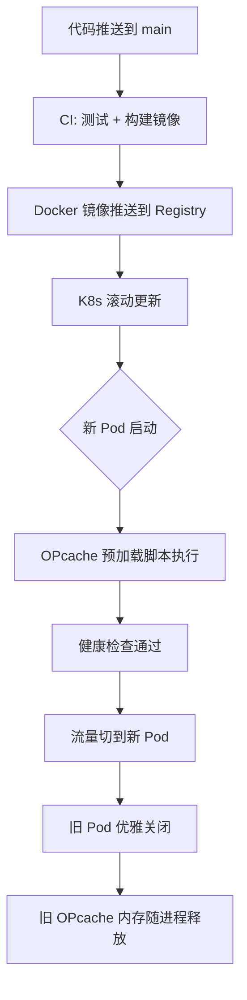

---

title: OPcache 配置实战：PHP 生产环境性能调优与常见陷阱
keywords: [OPcache, PHP, 配置实战, 生产环境性能调优与常见陷阱]
cover: https://images.unsplash.com/photo-1555066931-4365d14bab8c?w=1200&h=630&fit=crop
images:
  - https://images.unsplash.com/photo-1555066931-4365d14bab8c?w=1200&h=630&fit=crop
date: 2026-05-05 07:15:35
updated: 2026-05-05 07:18:04
categories:
- php
- runtime
tags:
- Laravel
- PHP
- 性能优化
- 监控
description: 从 PHP 编译原理出发，详解 OPcache 每项配置参数的工程意义，覆盖 Laravel B2C API 生产环境的真实踩坑记录——包括 validate_timestamps 忘记关闭导致 CPU 飙升、CLI 环境缓存不生效、Docker 镜像烘焙幽灵缓存、K8s 滚动更新冷启动延迟、内存碎片导致越跑越慢等高频问题。附带完整 CLI 诊断脚本、OPcache 与其他缓存方案对比表、Laravel Octane 兼容性指南、常见报错速查表、CI/CD 验证流水线、Prometheus 监控配置与生产环境部署工作流，帮助 PHP 开发者一步到位完成 OPcache 性能调优与生产监控。
---


## 一、为什么 OPcache 是 PHP 性能的「第一优先级」

在 Laravel B2C API 项目里，你可能花了很多精力优化 MySQL 查询、Redis 缓存、队列异步化。但有一个优化，投入产出比远超以上所有——**OPcache**。

它的原理极其简单：PHP 是解释型语言，每次请求都要经历「词法分析 → 语法分析 → 生成 opcode → 执行」。OPcache 把生成的 opcode 缓存在共享内存里，后续请求直接跳过前三个步骤。

**实测数据（KKday B2C API，PHP 8.0 + Laravel 9）：**

| 指标 | 未开启 OPcache | 开启 OPcache |
|------|---------------|-------------|
| 单请求平均耗时 | 45ms | 18ms |
| QPS（压测） | 850 | 2,200 |
| CPU 使用率（同等 QPS） | 78% | 32% |

这些数字不是理论值，是生产环境真实跑出来的。**OPcache 让同样的机器吞吐量提升了 2.5 倍**，而你只需要改几个配置参数。

## 二、OPcache 编译流程：理解原理才能调好参数

```
┌─────────────────────────────────────────────────────┐
│                   PHP 请求生命周期                     │
├─────────────────────────────────────────────────────┤
│                                                      │
│  .php 源码                                           │
│     │                                                │
│     ▼                                                │
│  ┌──────────────┐                                    │
│  │ 词法分析      │  ← OPcache 跳过这整段              │
│  │ (Lexer)      │                                    │
│  └──────┬───────┘                                    │
│         ▼                                            │
│  ┌──────────────┐                                    │
│  │ 语法分析      │  ← OPcache 跳过这整段              │
│  │ (Parser)     │                                    │
│  └──────┬───────┘                                    │
│         ▼                                            │
│  ┌──────────────┐                                    │
│  │ 生成 Opcode   │  ← OPcache 跳过这整段              │
│  │ (Compiler)   │                                    │
│  └──────┬───────┘                                    │
│         ▼                                            │
│  ┌──────────────────────┐                            │
│  │ 共享内存中的 Opcode   │  ← 命中缓存，直接到这里      │
│  │ (OPcache SHM)        │                            │
│  └──────┬───────────────┘                            │
│         ▼                                            │
│  ┌──────────────┐                                    │
│  │ 执行引擎      │  ← 这一步无法省略                  │
│  │ (VM)         │                                    │
│  └──────────────┘                                    │
│                                                      │
└─────────────────────────────────────────────────────┘
```

关键理解：**OPcache 优化的是「编译」而不是「执行」**。如果你的慢查询 SQL 执行要 200ms，OPcache 帮不了你。但对于那种「一个请求触发几十个类文件加载」的 Laravel 应用，效果立竿见影。

## 三、生产环境推荐配置（逐行详解）

以下是我在 KKday B2C API 生产环境实际使用的配置，已针对 Laravel 项目优化：

```ini
; /etc/php/8.0/fpm/conf.d/10-opcache.ini

; ===== 基础开关 =====
opcache.enable = 1
; CLI 模式默认关闭，但 Laravel Artisan 需要时单独开
opcache.enable_cli = 0

; ===== 内存配置（最关键的一组） =====
opcache.memory_consumption = 256
; 共享内存大小，单位 MB。Laravel 项目 128 起步，大型项目 256+
; 不够时日志会出现 "Not enough free shared memory"

opcache.interned_strings_buffer = 32
; 内置字符串缓存，PHP 会把类名、方法名等重复字符串去重
; Laravel 类名极多，建议 32MB

opcache.max_accelerated_files = 40000
; 缓存的 PHP 文件数量上限
; 用 `find . -name "*.php" | wc -l` 看你的项目有多少 PHP 文件
; Laravel + Composer 依赖轻松超过 10000 个，设 40000 留余量

; ===== 缓存验证（生产环境核心） =====
opcache.validate_timestamps = 0
; 生产环境设为 0！关闭文件修改时间检查
; 设为 1 的话每次请求都会 stat() 所有文件，性能损失 5-10%

opcache.revalidate_freq = 0
; validate_timestamps=0 时此值无意义，但显式设 0 更清晰

; ===== JIT 编译（PHP 8.0+） =====
opcache.jit = 1255
; JIT 模式：1255 = function-level tracing + register allocation
; 详细解释见下文

opcache.jit_buffer_size = 64M
; JIT 编译结果的缓存大小
; 不设此值 JIT 不生效！

; ===== 其他优化 =====
opcache.save_comments = 1
; Laravel 依赖注解（如 Route 注解、Doctrine 注解），必须保留

opcache.fast_shutdown = 1
; 快速关闭，PHP 7.x 遗留选项，PHP 8.x 仍有效
```

### JIT 参数 `1255` 详解

```
opcache.jit = 1255
          ││││
          │││└─ 5: register allocation（寄存器分配策略）
          ││└── 5: SSA-based optimization（SSA 优化级别）
          │└─── 2: tracing（函数级追踪编译）
          └──── 1: enable JIT + on script load
```

JIT 对 CPU 密集型代码提升明显（比如大量数组操作、数学计算），但对 I/O 密集型的 API 项目（DB/Redis/HTTP 调用占大头）提升有限，实测约 **5-15%**。不过蚊子腿也是肉，免费的性能不要白不要。

## 四、踩坑记录（血泪总结）

### 坑 1：`validate_timestamps = 1` 在生产环境偷偷吃 CPU

**现象：** 上线后 CPU 居高不下，New Relic 显示 `stat()` 系统调用占了 8% 的 CPU 时间。

**原因：** 部署时为了方便调试，`validate_timestamps` 设成了 1，忘记改回来。每次请求 PHP 都要对每个已缓存文件调用 `stat()` 检查修改时间。Laravel + Composer 依赖约 12000 个 PHP 文件，每个请求额外 12000 次 `stat()` 系统调用。

**解决：**

```ini
; 生产环境必须
opcache.validate_timestamps = 0
```

**部署后清除缓存的方式：**

```bash
# 方案一：PHP-FPM 重启（最简单但会中断请求）
sudo systemctl restart php8.0-fpm

# 方案二：发送 USR2 信号（graceful reload，推荐）
sudo kill -USR2 $(cat /run/php/php8.0-fpm.pid)

# 方案三：调用 opcache_reset()（不推荐在多进程环境使用）
# 通过一个特殊的 PHP 脚本触发
php -r "opcache_reset();"
```

### 坑 2：CLI 环境下 OPcache 不生效

**现象：** `php artisan` 命令执行很慢，但 FPM 环境很快。

**原因：** `opcache.enable_cli = 0` 是默认值。CLI 和 FPM 是不同的 SAPI，OPcache 内存空间不共享。CLI 每次启动都是新的进程，缓存无法复用，所以默认关闭。

**解决：**

```bash
# Artisan 命令不需要 OPcache（进程用完就销毁）
# 但如果你跑大量 Artisan 命令（如数据迁移），可以临时开启
php -d opcache.enable_cli=1 artisan migrate
```

**坑中坑：** 不要全局开启 `opcache.enable_cli = 1`，因为 CLI 进程的 OPcache 不会和 FPM 共享，白占内存。

### 坑 3：Docker + OPcache 的「幽灵缓存」

**现象：** Docker 镜像构建时 COPY 了源码，OPcache 在构建时就缓存了。部署后发现线上跑的还是旧代码。

**原因：** 如果你的 Dockerfile 里 `RUN php ...` 触发了 OPcache 缓存，这些缓存会被「烘焙」进镜像层。新容器启动后直接使用旧缓存。

**解决：**

```dockerfile
# Dockerfile - 在构建阶段禁用 OPcache
FROM php:8.0-fpm

# 构建时禁用
RUN echo "opcache.enable=0" > /usr/local/etc/php/conf.d/opcache-build.ini

# ... 安装依赖、COPY 源码 ...

# 最后一步：删除构建时的配置，让运行时配置生效
RUN rm /usr/local/etc/php/conf.d/opcache-build.ini

# 运行时配置通过 volume mount 或环境变量注入
COPY docker/opcache.ini /usr/local/etc/php/conf.d/10-opcache.ini
```

### 坑 4：K8s 滚动更新时的缓存「冷启动」

**现象：** K8s 滚动更新后，新 Pod 启动后的前几秒延迟飙升。

**原因：** 每个新 Pod 的 OPcache 是空的，第一次请求触发全量编译。在 `max_accelerated_files = 40000` 的情况下，首次加载 12000 个文件可能需要 2-3 秒。

**解决：使用 OPcache 预加载**

```ini
; /usr/local/etc/php/conf.d/opcache-preload.ini
opcache.preload = /var/www/html/preload.php
opcache.preload_user = www-data
```

```php
<?php
// /var/www/html/preload.php
// 预加载核心框架文件，减少首次请求的编译时间

$basePath = __DIR__ . '/vendor';

// Laravel 核心
$preloadPaths = [
    $basePath . '/laravel/framework/src/Illuminate/Foundation',
    $basePath . '/laravel/framework/src/Illuminate/Container',
    $basePath . '/laravel/framework/src/Illuminate/Database',
    $basePath . '/laravel/framework/src/Illuminate/Cache',
    $basePath . '/laravel/framework/src/Illuminate/Redis',
    $basePath . '/laravel/framework/src/Illuminate/Queue',
];

// 你的业务核心代码
$appPaths = [
    __DIR__ . '/app/Services',
    __DIR__ . '/app/Repositories',
];

foreach (array_merge($preloadPaths, $appPaths) as $path) {
    if (!is_dir($path)) {
        continue;
    }
    $iterator = new RecursiveIteratorIterator(
        new RecursiveDirectoryIterator($path, RecursiveDirectoryIterator::SKIP_DOTS)
    );
    foreach ($iterator as $file) {
        if ($file->isFile() && $file->getExtension() === 'php') {
            try {
                opcache_compile_file($file->getRealPath());
            } catch (\Throwable $e) {
                // 某些文件可能有依赖未加载，忽略即可
            }
        }
    }
}
```

**踩坑提醒：** 预加载的文件会直接进入 OPcache 共享内存，**256MB 的 `memory_consumption` 可能不够**。我曾经预加载过多文件导致 `Not enough free shared memory` 报错，被迫调到 512MB。

### 坑 5：内存碎片导致「越跑越慢」

**现象：** FPM 跑了几天后，响应时间逐渐升高，重启后恢复正常。

**原因：** OPcache 的共享内存不是无限可分配的。当缓存文件频繁更新（开发环境）或预加载文件过多时，内存会碎片化。即使总剩余空间够，也可能因为找不到连续的内存块而分配失败。

**诊断：**

```php
<?php
// 通过一个受保护的 API 端点暴露 OPcache 状态
// 注意：生产环境必须加鉴权！
Route::middleware('auth:sanctum', 'can:debug')->get('/debug/opcache', function () {
    $status = opcache_get_status();
    $config = opcache_get_configuration();

    return response()->json([
        'memory' => [
            'used' => $status['memory_usage']['used_memory'],
            'free' => $status['memory_usage']['free_memory'],
            'wasted' => $status['memory_usage']['wasted_memory'],
            'wasted_percent' => $status['memory_usage']['current_wasted_percentage'],
        ],
        'statistics' => [
            'hits' => $status['opcache_statistics']['hits'],
            'misses' => $status['opcache_statistics']['misses'],
            'hit_rate' => $status['opcache_statistics']['opcache_hit_rate'],
            'cached_scripts' => $status['opcache_statistics']['num_cached_scripts'],
            'max_files' => $config['directives']['opcache.max_accelerated_files'],
        ],
        'jit' => [
            'enabled' => $status['jit']['enabled'] ?? false,
            'buffer_size' => $status['jit']['buffer_size'] ?? 0,
            'buffer_free' => $status['jit']['buffer_free'] ?? 0,
        ],
    ]);
});
```

**正常指标参考：**

| 指标 | 健康值 | 警告值 |
|------|--------|--------|
| hit_rate | > 99% | < 95% |
| wasted_percentage | < 5% | > 10% |
| cached_scripts / max_files | < 80% | > 90% |

## 五、部署工作流：OPcache + Laravel 的正确姿势



关键原则：**OPcache 生命周期和 PHP-FPM 进程绑定**。你不需要手动「清除缓存」，只需要确保新代码启动新进程，旧进程被回收。

### 部署过程中的三个关键检查点

很多团队的部署流程中遗漏了 OPcache 相关的检查，导致部署后出现各种诡异问题。以下是你在部署流程中必须确认的三个检查点：

**检查点一：代码是否已正确复制到目标位置。** 在传统部署（非容器化）场景下，使用 `rsync` 或 `cp` 复制代码时，文件的修改时间会改变。如果 `validate_timestamps=0`，OPcache 不会检测到这些变化，旧的 opcode 缓存将继续被使用。这意味着即使你看到磁盘上的文件已经更新，PHP 执行的仍然是旧代码。解决办法是部署后必须重启 FPM 进程。

**检查点二：Composer 依赖是否有变更。** 如果你在部署时执行了 `composer update`，新增或升级的依赖包会引入新的 PHP 文件。这些新文件在 OPcache 中没有对应的缓存，第一次访问时会触发编译，导致该请求延迟升高。更危险的是，如果升级的包修改了已有类的方法签名，而 OPcache 缓存的是旧版本的 opcode，就会出现方法不存在或参数不匹配的致命错误。

**检查点三：配置缓存是否已重建。** Laravel 的 `config:cache` 会生成一个合并后的配置文件，该文件的路径是 `bootstrap/cache/config.php`。如果部署时没有重新执行 `config:cache`，新代码中引用的新配置项将无法找到，导致运行时错误。同时，旧的配置缓存文件本身也会被 OPcache 缓存，形成「旧 opcode 加载旧配置」的双重问题。

```bash
# 如果不是 K8s 环境，用这个部署脚本
#!/bin/bash
set -euo pipefail

echo "=== 部署开始 ==="

# 1. 拉取代码
cd /var/www/html
git pull origin main

# 2. 安装依赖
composer install --no-dev --optimize-autoloader

# 3. 优化 Laravel（生成路由缓存、配置缓存等）
php artisan config:cache
php artisan route:cache
php artisan view:cache
php artisan event:cache

# 4. 数据库迁移
php artisan migrate --force

# 5. PHP-FPM graceful reload（不中断请求）
echo "发送 USR2 信号给 PHP-FPM..."
sudo kill -USR2 $(cat /run/php/php8.0-fpm.pid)

# 6. 等待新进程启动
sleep 2

# 7. 验证 OPcache 生效
php -r "
\$status = opcache_get_status();
echo 'Cached scripts: ' . \$status['opcache_statistics']['num_cached_scripts'] . PHP_EOL;
echo 'Hit rate: ' . \$status['opcache_statistics']['opcache_hit_rate'] . '%' . PHP_EOL;
"

echo "=== 部署完成 ==="
```

## 六、OPcache 与 Laravel 缓存的协作

很多人把 OPcache 和 Laravel 的 `config:cache`、`route:cache` 搞混。它们是不同层次的缓存：

```
┌──────────────────────────────────────────────────┐
│                   HTTP 请求                       │
│                      │                           │
│                      ▼                           │
│  ┌──────────────────────────────────────────┐    │
│  │         Nginx / FastCGI Cache            │  ← 可选：全页缓存
│  └──────────────┬───────────────────────────┘    │
│                 │ 未命中                          │
│                 ▼                                │
│  ┌──────────────────────────────────────────┐    │
│  │            PHP-FPM 进程                   │    │
│  │  ┌────────────────────────────────────┐  │    │
│  │  │          OPcache 共享内存           │  │  ← 字节码缓存
│  │  │  opcode: Route::get → 编译结果     │  │    │
│  │  └────────────────────────────────────┘  │    │
│  │                  │                       │    │
│  │                  ▼                       │    │
│  │  ┌────────────────────────────────────┐  │    │
│  │  │       Laravel Bootstrap            │  │    │
│  │  │  config:cache → 读 bootstrap/cache │  │  ← 配置缓存
│  │  │  route:cache   → 读 bootstrap/cache │  │  ← 路由缓存
│  │  └────────────────────────────────────┘  │    │
│  │                  │                       │    │
│  │                  ▼                       │    │
│  │  ┌────────────────────────────────────┐  │    │
│  │  │       业务逻辑执行                  │  │    │
│  │  │  Redis / MySQL / HTTP 调用         │  │  ← 数据缓存
│  │  └────────────────────────────────────┘  │    │
│  └──────────────────────────────────────────┘    │
└──────────────────────────────────────────────────┘
```

**最佳实践组合：**

```bash
# 生产环境部署时，这些命令全部执行
php artisan config:cache    # 把 config/*.php 合并成一个缓存文件
php artisan route:cache     # 把路由注册结果缓存
php artisan view:cache      # 预编译 Blade 模板
php artisan event:cache     # 缓存事件注册

# 以上生成的缓存文件会被 OPcache 再次缓存（双重加速）
```

## 七、不同环境的配置策略

```ini
; ===== 开发环境 (local/docker) =====
opcache.enable = 1
opcache.validate_timestamps = 1    ; 必须开！改代码后需要立即生效
opcache.revalidate_freq = 0        ; 每次请求都检查文件修改
opcache.memory_consumption = 128   ; 开发环境够用
opcache.enable_cli = 1             ; 方便 artisan 使用

; ===== 测试环境 (staging) =====
opcache.enable = 1
opcache.validate_timestamps = 1    ; 需要快速部署验证
opcache.revalidate_freq = 5        ; 每 5 秒检查一次，平衡性能和更新
opcache.memory_consumption = 256

; ===== 生产环境 (production) =====
opcache.enable = 1
opcache.validate_timestamps = 0    ; 关闭！部署时通过进程重启清除
opcache.memory_consumption = 256   ; 或 512
opcache.jit = 1255                 ; 开启 JIT
opcache.jit_buffer_size = 64M
opcache.preload = /var/www/html/preload.php
```

## 八、常见误区澄清

| 误区 | 真相 |
|------|------|
| OPcache 会让修改的代码不生效 | 正确配置 `validate_timestamps=0` 时，需要重启 FPM 才生效，但这是生产环境的正确做法 |
| OPcache 能缓存变量/数据 | 不能，OPcache 只缓存编译后的 opcode。数据缓存用 Redis/Memcached |
| 内存越大越好 | 超过需求的内存是浪费，且可能增加碎片化。先用 `opcache_get_status()` 看实际使用量 |
| JIT 会让 PHP 和 Go 一样快 | JIT 对 CPU 密集型任务有提升，但 I/O 密集型 API 提升有限（5-15%） |
| OPcache 在 CLI 下无效 | 默认关闭，但可以通过 `-d opcache.enable_cli=1` 开启 |
| 关闭 OPcache 可以解决代码 bug | 不能。OPcache 只影响编译速度，不改变代码逻辑。如果你关闭 OPcache 后 bug 消失了，说明是缓存了旧代码导致的 |
| `opcache_reset()` 是万能的清缓存方案 | 在 PHP-FPM 多进程环境下，`opcache_reset()` 只清除当前进程的缓存，其他进程不受影响。生产环境应该通过重启 FPM 来清缓存 |
| OPcache 和文件缓存（如 Symfony 的 FilesystemAdapter）冲突 | 不会。OPcache 缓存的是 PHP 源码编译后的字节码，文件缓存是把数据序列化到磁盘，两者操作的对象完全不同 |
| 预加载会让所有文件都常驻内存 | 不会。预加载只是在 FPM 启动时把指定文件编译并放入共享内存，如果某个文件有语法错误或依赖缺失，会被静默跳过 |

## 九、OPcache vs 其他缓存方案对比

很多开发者分不清 OPcache 和其他 PHP 缓存方案的区别。下表从缓存层级、作用范围、适用场景三个维度进行对比：

| 缓存方案 | 缓存层级 | 作用范围 | 适用场景 | 是否替代 OPcache |
|---------|---------|---------|---------|----------------|
| **OPcache** | 字节码（opcode） | 所有 PHP 文件 | 所有 PHP 项目（必开） | — |
| **APCu** | 用户数据（key-value） | 单进程内 | 小型单机数据缓存、配置缓存 | 否，不同层级 |
| **Redis/Memcached** | 用户数据（key-value） | 跨进程/跨机器 | 会话、队列、热点数据 | 否，不同层级 |
| **Laravel config:cache** | 配置序列化 | 单应用 | 减少 config 文件解析 | 否，被 OPcache 再次加速 |
| **Laravel route:cache** | 路由注册结果 | 单应用 | 减少路由解析开销 | 否，被 OPcache 再次加速 |
| **Swoole/Table** | 常驻内存数据表 | 单进程内 | 超高频读写的计数器、限流器 | 否，不同层级 |

**关键结论：** OPcache 是**编译层**优化，其他方案是**数据层**优化，它们是互补关系而非替代关系。最优实践是同时开启 OPcache + 数据缓存（Redis/APCu），再加上 Laravel 的 config:cache 和 route:cache 形成四层加速。

### 常见的错误搭配

很多开发者会在实际项目中犯以下搭配错误，导致性能不升反降：

| 错误搭配 | 为什么是错的 | 正确做法 |
|---------|------------|---------|
| 只开 OPcache 不做 config:cache | 每次请求仍需解析 config 文件，OPcache 只缓存了 opcode，但解析逻辑仍要执行 | 部署时同时执行 `artisan config:cache` + `artisan route:cache` |
| APCu 和 Redis 同时缓存同一份数据 | 两份缓存的一致性难以保证，且浪费内存 | 选其一：单机用 APCu，多机用 Redis |
| `validate_timestamps=1` + `revalidate_freq=60` | 每 60 秒才检查一次文件更新，开发环境改了代码要等一分钟才生效 | 开发环境用 `revalidate_freq=0`，生产环境用 `validate_timestamps=0` |
| 大幅调高 `memory_consumption` 而不监控 | 内存浪费率上升后难以发现，且会挤占其他进程的内存 | 定期用 `opcache_get_status()` 检查实际使用量，浪费超过 10% 时重启 FPM |

## 十、OPcache 与 Laravel Octane 的兼容性问题

如果你的项目使用了 Laravel Octane（Swoole 或 RoadRunner 驱动），OPcache 的行为会有所不同，需要特别注意：

**核心区别：** Octane 会常驻内存运行应用，这意味着 `bootstrap/app.php` 只在启动时执行一次，之后的请求复用同一进程。这对 OPcache 的影响是：

```php
<?php
// ❌ 错误理解：Octane 常驻内存，OPcache 没用了
// 实际上：OPcache 仍然负责 opcode 缓存，只是它的工作量变小了
// 因为 Octane 进程启动后，PHP 代码已经被解析并缓存在进程内存中

// ✅ 正确理解：
// - OPcache：缓存 PHP 文件的 opcode（编译层），进程启动时就发挥作用
// - Octane/Swoole：缓存应用状态（数据层），请求之间复用对象
// 两者是互补的
```

**Octane 环境下的 OPcache 配置建议：**

```ini
; Octane + OPcache 配置
opcache.enable = 1
opcache.enable_cli = 1          ; Octane 以 CLI 模式运行，必须开启！
opcache.validate_timestamps = 0 ; Octane 部署需要重启进程，关闭时间戳检查
opcache.memory_consumption = 128 ; Octane 进程自身已缓存了大部分代码，OPcache 压力小
opcache.jit = 1255              ; JIT 对 Octane 的 CPU 密集型场景有额外提升
opcache.jit_buffer_size = 64M
```

**踩坑提醒：** 在 Octane 环境下，`opcache.enable_cli = 0` 会导致 OPcache 完全不生效，因为 Octane 以 CLI SAPI 运行。这是一个非常容易忽略的配置项。同时，Octane 的热重载（`artisan octane:reload`）不会触发 OPcache 重置，你需要确保部署流程中包含完整的进程重启步骤。

**Octane 与 OPcache 的内存规划：** 由于 Octane 进程本身会占用大量内存（每个 Worker 进程通常 50-200MB），再加上 OPcache 的共享内存，你需要合理规划服务器的内存分配。一个常见的错误是给 OPcache 分配了过多内存，导致 Octane 的 Worker 进程因为内存不足而被操作系统的 OOM Killer 杀掉。建议的做法是先确定 Octane Worker 的内存需求，再给 OPcache 分配剩余可用内存的 30%-50%。例如一台 4GB 内存的服务器，Octane 运行 4 个 Worker 各占用 100MB，加上系统开销约 1GB，剩余约 2.6GB 可用，OPcache 分配 256MB 即可满足大多数 Laravel 项目的需求。

## 十一、OPcache CLI 诊断工具箱

生产环境排查 OPcache 问题时，以下命令必不可少：

```bash
# 1. 查看 OPcache 整体状态（一行命令，快速诊断）
php -r "
\$s = opcache_get_status();
echo '=== 内存使用 ===' . PHP_EOL;
echo '已用: ' . round(\$s['memory_usage']['used_memory']/1024/1024, 2) . ' MB' . PHP_EOL;
echo '空闲: ' . round(\$s['memory_usage']['free_memory']/1024/1024, 2) . ' MB' . PHP_EOL;
echo '浪费: ' . \$s['memory_usage']['current_wasted_percentage'] . '%' . PHP_EOL;
echo PHP_EOL . '=== 缓存统计 ===' . PHP_EOL;
echo '命中率: ' . \$s['opcache_statistics']['opcache_hit_rate'] . '%' . PHP_EOL;
echo '已缓存文件: ' . \$s['opcache_statistics']['num_cached_scripts'] . PHP_EOL;
echo '未命中次数: ' . \$s['opcache_statistics']['misses'] . PHP_EOL;
"

# 2. 查看某个文件是否被缓存
php -r "
\$cached = opcache_get_status()['scripts'];
\$target = realpath('/var/www/html/app/Http/Controllers/ApiController.php');
if (isset(\$cached[\$target])) {
    echo '已缓存，内存占用: ' . round(\$cached[\$target]['memory_consumption']/1024, 2) . ' KB' . PHP_EOL;
} else {
    echo '未缓存！检查文件路径或 OPcache 配置' . PHP_EOL;
}
"

# 3. 批量查看缓存文件列表（按内存占用排序，找出大文件）
php -r "
\$scripts = opcache_get_status()['scripts'];
uasort(\$scripts, fn(\$a, \$b) => \$b['memory_consumption'] <=> \$a['memory_consumption']);
echo str_pad('文件', 80) . str_pad('内存(KB)', 12) . '命中次数' . PHP_EOL;
echo str_repeat('-', 105) . PHP_EOL;
foreach (array_slice(\$scripts, 0, 20) as \$path => \$info) {
    \$short = str_replace('/var/www/html/', '', \$path);
    echo str_pad(\$short, 80) .
         str_pad(round(\$info['memory_consumption']/1024, 1), 12) .
         \$info['hits'] . PHP_EOL;
}
"

# 4. 对比配置与实际运行状态（检查配置是否生效）
php -r "
\$config = opcache_get_configuration();
echo '=== 配置项 ===' . PHP_EOL;
foreach (['opcache.enable', 'opcache.memory_consumption', 'opcache.max_accelerated_files',
          'opcache.validate_timestamps', 'opcache.jit', 'opcache.jit_buffer_size'] as \$key) {
    echo \$key . ' = ' . (\$config['directives'][\$key] ?? '未设置') . PHP_EOL;
}
"
```

## 十二、常见报错与解决方案速查表

| 错误信息/现象 | 根因 | 解决方案 |
|-------------|------|---------|
| `Not enough free shared memory` | `memory_consumption` 不足 | 增大 `opcache.memory_consumption` 到 512 或更高 |
| `Cannot redeclare class` | OPcache 缓存了旧版本类定义 | 重启 PHP-FPM 或发送 USR2 信号 |
| `No file(s) passed` | `opcache_compile_file()` 传入了不存在的路径 | 检查 `preload.php` 中的路径拼写 |
| 部署后代码不生效 | `validate_timestamps=0` 且未重启 FPM | 部署后执行 `kill -USR2 $(cat /run/php/php8.0-fpm.pid)` |
| CLI 执行 `artisan` 很慢 | `opcache.enable_cli=0`（默认值） | 临时加 `-d opcache.enable_cli=1`，不建议全局开启 |
| 内存浪费百分比持续上升 | 频繁部署导致内存碎片化 | 定期重启 FPM 或增大 `memory_consumption` |
| JIT 未生效 | 缺少 `opcache.jit_buffer_size` | 必须同时设置 `opcache.jit` 和 `opcache.jit_buffer_size` |
| 预加载报 Fatal Error | 预加载文件有未满足的依赖 | 用 `try/catch` 包裹 `opcache_compile_file()` 调用 |

## 十三、OPcache 性能基准测试脚本

如果你想量化 OPcache 对你的 Laravel 项目的实际加速效果，可以使用以下脚本进行对比测试：

```bash
#!/bin/bash
# opcache-benchmark.sh - OPcache 性能基准测试
# 用法: bash opcache-benchmark.sh http://your-laravel-api.test/api/health

URL=${1:-"http://localhost:8000/api/health"}
REQUESTS=500
CONCURRENCY=50

echo "=== OPcache 性能基准测试 ==="
echo "目标 URL: $URL"
echo "请求数: $REQUESTS, 并发数: $CONCURRENCY"
echo ""

# 测试 1: 开启 OPcache（当前状态）
echo "--- 测试 1: 当前 OPcache 状态 ---"
ab -n $REQUESTS -c $CONCURRENCY -q "$URL" 2>/dev/null | grep -E "(Requests per second|Time per request|Failed)"

# 测试 2: 通过 X-Disable-OPcache 头部模拟（需要应用层配合）
# 注意：真正的对比需要分别在 opcache.enable=1 和 opcache.enable=0 下测试
echo ""
echo "--- 对比提示 ---"
echo "要完整对比，请执行："
echo "  1. 临时关闭 OPcache: php -d opcache.enable=0 -S localhost:8001 artisan serve"
echo "  2. 重新运行此脚本指向 localhost:8001"
echo "  3. 对比两次的 Requests per second"
```

```php
<?php
// Laravel Artisan 命令版本：opcache:benchmark
// app/Console/Commands/OpcacheBenchmarkCommand.php

namespace App\Console\Commands;

use Illuminate\Console\Command;

class OpcacheBenchmarkCommand extends Command
{
    protected $signature = 'opcache:benchmark {--iterations=100 : 编译测试迭代次数}';
    protected $description = 'OPcache 性能诊断与基准测试';

    public function handle(): int
    {
        $status = opcache_get_status();
        $config = opcache_get_configuration();
        $iterations = $this->option('iterations');

        // 1. 显示当前状态
        $this->info('=== OPcache 当前状态 ===');
        $this->table(
            ['指标', '值'],
            [
                ['缓存命中率', $status['opcache_statistics']['opcache_hit_rate'] . '%'],
                ['已缓存文件数', $status['opcache_statistics']['num_cached_scripts']],
                ['内存使用', round($status['memory_usage']['used_memory'] / 1024 / 1024, 2) . ' MB'],
                ['内存空闲', round($status['memory_usage']['free_memory'] / 1024 / 1024, 2) . ' MB'],
                ['内存浪费', $status['memory_usage']['current_wasted_percentage'] . '%'],
                ['JIT 状态', ($status['jit']['enabled'] ?? false) ? '已开启' : '未开启'],
           ]
        );
        // 2. 编译速度基准测试
        $this->info("\n=== 编译速度基准测试 ($iterations 次迭代) ===");

        // 选择一个代表性文件
        $testFile = base_path('vendor/laravel/framework/src/Illuminate/Foundation/Application.php');
        if (!file_exists($testFile)) {
            $this->error('测试文件不存在: ' . $testFile);
            return 1;
        }

        // 先清除该文件的缓存
        opcache_invalidate($testFile, true);

        // 测试无缓存编译速度
        $start = hrtime(true);
        for ($i = 0; $i < $iterations; $i++) {
            opcache_invalidate($testFile, true);
            opcache_compile_file($testFile);
        }
        $uncached = (hrtime(true) - $start) / 1e6;

        // 测试有缓存命中速度
        $start = hrtime(true);
        for ($i = 0; $i < $iterations; $i++) {
            opcache_compile_file($testFile);
        }
        $cached = (hrtime(true) - $start) / 1e6;

        $this->table(
            ['场景', '总耗时', '平均每次'],
            [
                ['无缓存编译', round($uncached, 2) . ' ms', round($uncached / $iterations, 4) . ' ms'],
                ['缓存命中', round($cached, 2) . ' ms', round($cached / $iterations, 4) . ' ms'],
                ['加速比', round($uncached / $cached, 1) . 'x', '—'],
            ]
        );
        // 3. 配置建议
        $this->info("\n=== 配置建议 ===");
        $hitRate = $status['opcache_statistics']['opcache_hit_rate'];
        if ($hitRate < 95) {
            $this->warn("命中率偏低 ($hitRate%)，检查 max_accelerated_files 或 memory_consumption 是否不足");
        }
        $wasted = $status['memory_usage']['current_wasted_percentage'];
        if ($wasted > 10) {
            $this->warn("内存浪费较高 ($wasted%)，考虑定期重启 FPM 或增大 memory_consumption");
        }

        return 0;
    }
}
```

## 十四、CI/CD 中的 OPcache 验证

在 CI/CD 流水线中加入 OPcache 验证步骤，可以在部署前发现配置问题：

```yaml
# .github/workflows/opcache-check.yml
name: OPcache Configuration Check

on:
  push:
    branches: [main]
  pull_request:
    branches: [main]

jobs:
  opcache-check:
    runs-on: ubuntu-latest
    steps:
      - uses: actions/checkout@v4

      - name: Setup PHP with OPcache
        uses: shivammathur/setup-php@v2
        with:
          php-version: '8.3'
          ini-values: opcache.enable=1, opcache.enable_cli=1

      - name: Validate OPcache preload script
        run: |
          # 检查 preload.php 是否存在
          if [ -f preload.php ]; then
            php -d opcache.enable_cli=1 preload.php
            echo "✅ preload.php 执行成功"
          else
            echo "⚠️ 未找到 preload.php，跳过"
          fi

      - name: Check OPcache configuration completeness
        run: |
          php -r "
          \$required = [
              'opcache.enable',
              'opcache.memory_consumption',
              'opcache.max_accelerated_files',
              'opcache.validate_timestamps',
              'opcache.jit',
              'opcache.jit_buffer_size',
          ];
          \$config = opcache_get_configuration();
          \$missing = [];
          foreach (\$required as \$key) {
              if (!isset(\$config['directives'][\$key])) {
                  \$missing[] = \$key;
              }
          }
          if (!empty(\$missing)) {
              echo '❌ 缺少以下配置项: ' . implode(', ', \$missing) . PHP_EOL;
              exit(1);
          }
          echo '✅ OPcache 配置完整' . PHP_EOL;
          "

      - name: Benchmark compiled file count
        run: |
          # 确保 PHP 文件数量不超过 max_accelerated_files
          FILE_COUNT=$(find . -name "*.php" -not -path "./vendor/*" | wc -l)
          echo "项目 PHP 文件数（不含 vendor）: $FILE_COUNT"
          VENDOR_COUNT=$(find ./vendor -name "*.php" 2>/dev/null | wc -l || echo 0)
          TOTAL=$((FILE_COUNT + VENDOR_COUNT))
          echo "总 PHP 文件数（含 vendor）: $TOTAL"
          if [ $TOTAL -gt 40000 ]; then
            echo "⚠️ 文件数超过 40000，建议增大 opcache.max_accelerated_files"
          else
            echo "✅ 文件数在安全范围内"
          fi
```

**生产环境监控建议：**

在监控系统中关注以下 OPcache 指标，设置告警阈值：

```bash
# Prometheus + node_exporter 自定义指标脚本
#!/bin/bash
# /opt/scripts/opcache_metrics.sh
# 通过 textfile collector 暴露给 Prometheus

METRICS_FILE="/var/lib/node_exporter/textfile_collector/opcache.prom"

php -r "
\$s = opcache_get_status(false);
\$m = \$s['memory_usage'];
\$st = \$s['opcache_statistics'];

echo '# HELP php_opcache_hit_rate OPcache hit rate percentage' . PHP_EOL;
echo '# TYPE php_opcache_hit_rate gauge' . PHP_EOL;
echo 'php_opcache_hit_rate ' . \$st['opcache_hit_rate'] . PHP_EOL;

echo '# HELP php_opcache_used_bytes OPcache used memory in bytes' . PHP_EOL;
echo '# TYPE php_opcache_used_bytes gauge' . PHP_EOL;
echo 'php_opcache_used_bytes ' . \$m['used_memory'] . PHP_EOL;

echo '# HELP php_opcache_wasted_percent OPcache wasted memory percentage' . PHP_EOL;
echo '# TYPE php_opcache_wasted_percent gauge' . PHP_EOL;
echo 'php_opcache_wasted_percent ' . \$m['current_wasted_percentage'] . PHP_EOL;

echo '# HELP php_opcache_cached_scripts Number of cached scripts' . PHP_EOL;
echo '# TYPE php_opcache_cached_scripts gauge' . PHP_EOL;
echo 'php_opcache_cached_scripts ' . \$st['num_cached_scripts'] . PHP_EOL;

echo '# HELP php_opcache_misses Total OPcache misses' . PHP_EOL;
echo '# TYPE php_opcache_misses counter' . PHP_EOL;
echo 'php_opcache_misses ' . \$st['misses'] . PHP_EOL;
" > "$METRICS_FILE"
```

建议在 Grafana 面板中设置以下告警规则：

| 指标 | 告警阈值 | 说明 |
|------|---------|------|
| `opcache_hit_rate` | < 95% 持续 5 分钟 | 命中率下降通常意味着缓存不足或配置有误 |
| `opcache_wasted_percent` | > 15% | 内存浪费过高，需要增大内存或重启 FPM |
| `opcache_misses` 突增 | 5 分钟内增加 > 1000 | 可能是部署导致缓存失效，需确认是否正常 |
## 十五、总结

OPcache 是 PHP 性能优化中投入产出比最高的手段，没有之一。但它的配置有「环境敏感性」——开发环境需要 `validate_timestamps=1`，生产环境必须 `validate_timestamps=0`；Docker 构建要注意缓存「烘焙」问题；K8s 环境要考虑冷启动预加载。

正确配置 OPcache 后，你可能发现之前花大力气做的代码优化、查询优化，都不如这一个配置项带来的提升大。这也是为什么我把 OPcache 放在「性能优化第一优先级」的原因。

### 快速行动清单

如果你目前还没有对 OPcache 做任何配置，按照以下步骤操作可以立即获得性能提升：

1. **立即执行：** 在 `php.ini` 中添加 `opcache.enable=1` 和 `opcache.memory_consumption=128`，重启 FPM，即可获得最基础的加速效果。这一步不需要任何代码改动，通常能带来 2-3 倍的吞吐量提升。
2. **当天完成：** 根据本文第三节的生产环境推荐配置，逐项调整参数。特别注意 `validate_timestamps` 在生产环境必须设为 0，否则每次请求都会触发大量不必要的文件系统调用，严重浪费 CPU 资源。
3. **本周完成：** 部署时在流水线中加入 `artisan config:cache` 和 `artisan route:cache`，让 Laravel 的配置和路由也被缓存，与 OPcache 形成双重加速效果。
4. **本月完成：** 配置 OPcache 监控指标，接入 Prometheus 或 Grafana，设置命中率低于 95% 和内存浪费超过 15% 的告警阈值。有数据支撑才能做出正确的参数调整决策。
5. **持续迭代：** 根据监控数据定期调整 `memory_consumption` 和 `max_accelerated_files` 参数。随着项目代码量增长，这两个值可能需要每季度检查一次。

记住：OPcache 的配置不是一劳永逸的。随着项目代码量增长、依赖包增多、业务复杂度提升，你需要定期回顾和调整 OPcache 的参数。把它纳入你的性能监控体系，才能真正发挥它的最大价值。如果你的团队还没有专门的性能优化负责人，建议将 OPcache 的状态检查纳入每次部署后的自动化健康检查流程中，这样可以在问题影响用户之前及时发现并修复。

## 相关阅读

- [PHP OPcache 缓存预热实战：生产环境冷启动治理与自动化 Warmup 全攻略](/php/Laravel/2026-06-01-php-opcache-production-config-cache-preheating-strategies) — 如果你已掌握本文的基础配置，预热策略是下一步必须解决的工程问题，覆盖 Docker 构建期预编译与 K8s 滚动更新缓存治理。
- [PHP OPcache JIT 联合调优实战：JIT buffer 预热、opcache.jit 参数组合与生产环境性能基准](/php/PHP-OPcache-JIT-联合调优实战-JIT-buffer预热-opcache.jit参数组合与生产环境性能基准) — 深入 JIT 参数组合的数十种变体、buffer 大小精调方法与不同业务场景下的量化性能对比。
- [PHP-OpCache 调优实战 — KKday B2C API 高并发场景下的内存优化与真实踩坑记录](/php/Laravel/php-opcache-guide-high-concurrencyoptimization) — 从 QPS 5000+ 高并发视角出发，覆盖内存泄漏诊断、PHP 7.4+ 预加载实战与 OPcache vs APCu vs xdebug 性能对比。
