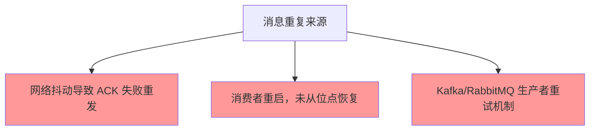
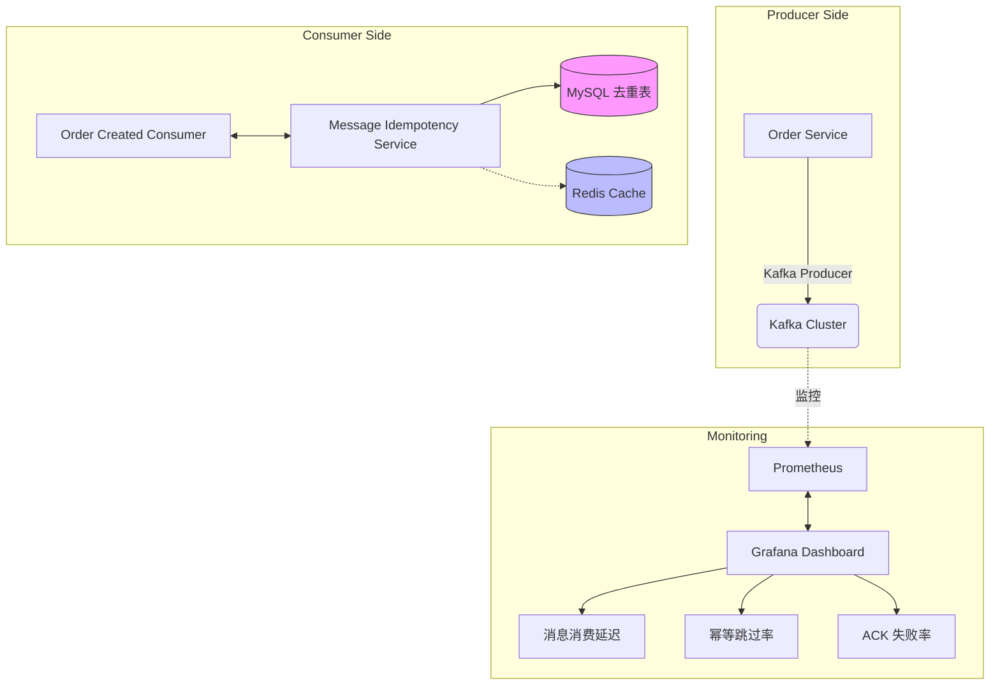

---

title: PHP 实战 - 消息幂等性设计模式 KKday B2C API 真实踩坑记录
keywords: [PHP, KKday B2C API, 消息幂等性设计模式, 真实踩坑记录]
cover: https://images.unsplash.com/photo-1555066931-4365d14bab8c?w=1200&h=630&fit=crop
images:
  - https://images.unsplash.com/photo-1555066931-4365d14bab8c?w=1200&h=630&fit=crop
tags:
- PHP
- 设计模式
- 消息队列
- Redis
- Kafka
- 幂等性
- KKday
categories:
- php
date: 2026-05-03 13:50:54
description: 深入解析 PHP 消息幂等性设计模式，基于 KKday B2C API 真实踩坑记录。对比唯一 ID 去重表、数据库唯一键约束、Redis Set 三大方案，详解 Laravel 中观察者、策略、状态机等设计模式与幂等性的结合实践，涵盖 Kafka ACK 优化、去重表清理与 Prometheus 监控，帮助开发者构建高可靠分布式消息消费系统。
updated: 2026-05-03 14:00:21
---


## 引言：消息系统为何需要幂等性？

在 KKday B2C API 项目中，我们每天处理数万条订单、支付、库存扣减消息。消息队列（RabbitMQ/Kafka）作为核心基础设施，却给我们埋下重大隐患：**重复消费**。

### 真实踩坑案例

> **2025 年 11 月某日早高峰**：Kafka 集群网络抖动 3 秒，导致订单服务重新拉取未处理的消息。结果：
> - 用户 A 下单成功 → 消息 M1 被消费 → 库存扣减 1
> - 网络抖动后重连 → 同一消息 M1 再次被消费 → 库存扣减 -1
> - **数据库记录显示：商品库存从 100 → 99 → 89**！
> - 用户投诉电话爆线

这个事故让我们深刻认识到：**分布式系统中，没有天然的消息幂等性，必须显式设计！**

## 一、什么是消息幂等性？

### 核心概念

幂等性（Idempotency）指：**多次执行同一操作，结果与执行一次相同**。

| 场景 | 幂等性要求 |
|------|----------|
| 查询订单详情 | ✅ 天然幂等（读操作无副作用） |
| 支付扣款 | ❌ 非幂等（扣两次钱就完蛋了） |
| 库存扣减 | ❌ 非幂等（扣两次库存就出事了） |
| 消息消费 | ❌ 必须设计幂等 |

### 消息重复的三大来源



## 二、幂等性设计方案对比

### 方案一：唯一 ID + 去重表（推荐⭐）

**核心思想**：每条消息都有唯一 ID，消费前先检查是否已处理。

#### 架构设计

```
┌─────────────────────────────────────────────────────┐
│                    Application                        │
│                                                       │
│     ┌─────────┐    ┌─────────┐    ┌──────────┐      │
│     │ Producer│───>│   MQ    │<───│ Consumer  │      │
│     │ (发送)  │    │         │    │          │      │
│     └─────────┘    └────┬────┘    └────┬─────┘      │
│                         │              │             │
│                  ┌──────┴──────┐       │            │
│                  │   去重表    │<──────┼───────────>│
│                  │ (已处理的消息)│     │             │
│                  └─────────────┘      │            │
│                        │              │            │
│                        ▼              ▼            │
│              UPDATE last_seen_offset    ↓          │
└─────────────────────────────────────────────────────┘
```

#### 代码实现（Laravel + MySQL）

```php
<?php

namespace App\Services;

use Illuminate\Support\Facades\DB;
use Exception;

class MessageIdempotencyService
{
    /**
     * 幂等性检查并消费消息
     * 
     * @param string $queueName 队列名
     * @param array $messagePayload 消息内容
     * @param int $offset 消费者位点
     * @return array [consumed: bool, result: mixed]
     */
    public function consume(string $queueName, array $messagePayload, int $offset): array
    {
        // 1. 生成唯一消息 ID（使用雪花算法或 UUID）
        $messageId = $this->generateMessageId($messagePayload);
        
        // 2. 检查是否已处理（事务内原子操作）
        $exists = $this->checkAndMarkProcessed($messageId, 'orders_order_created');
        
        if ($exists) {
            return [
                'consumed' => false,
                'result' => null, // 已处理，不执行业务逻辑
                'reason' => '消息已处理（去重表存在）',
            ];
        }
        
        try {
            // 3. 执行业务逻辑
            $result = $this->executeBusinessLogic($queueName, $messagePayload);
            
            // 4. 标记消息为已处理（在业务逻辑执行成功后才标记）
            $this->markAsProcessed($messageId, 'orders_order_created');
            
            return [
                'consumed' => true,
                'result' => $result,
                'reason' => null,
            ];
        } catch (Exception $e) {
            // 业务逻辑失败，不清除去重表（幂等检查下次会跳过）
            log::channel('message-error')->error(
                '[消息幂等] 消息未处理: messageId={messageId}, error={error}',
                ['messageId' => $messageId, 'error' => $e->getMessage()]
            );
            
            return [
                'consumed' => false,
                'result' => null,
                'reason' => '业务逻辑失败（消息仍在去重表中）',
            ];
        }
    }
    
    /**
     * 生成唯一消息 ID（雪花算法 + 队列名）
     */
    private function generateMessageId(array $payload): string
    {
        // 使用 Laravel UUID
        $uuid = \Ramsey\Uuid\Uuid::uuid4()->toString();
        
        // 或使用自定义格式：{队列}_{时间戳}_{随机数}
        // return sprintf('%s_%d_%08x', 
        //     str_replace('.', '', config('queue.default')),
        //     time() * 1000 + rand(0, 999),
        //     bin2hex(random_bytes(4))
        // );
        
        return $uuid;
    }
    
    /**
     * 检查并标记消息已处理（原子操作）
     */
    private function checkAndMarkProcessed(string $messageId, string $queue): bool
    {
        try {
            // 使用事务确保原子性
            DB::transaction(function () use ($messageId, $queue) {
                // 检查是否存在
                $count = DB::table('message_idempotency')
                    ->where('id', $messageId)
                    ->where('queue_name', $queue)
                    ->exists();
                
                if ($count) {
                    return true; // 已存在，无需处理
                }
                
                // 不存在，插入记录
                DB::table('message_idempotency')->insert([
                    'id' => $messageId,
                    'queue_name' => $queue,
                    'payload_hash' => hash('md5', json_encode($payload)),
                    'processed_at' => now(),
                    'error_message' => null,
                ]);
                
                return false; // 不存在，需要处理
            });
            
        } catch (Exception $e) {
            log::channel('message-error')->error(
                '[幂等检查失败] messageId={messageId}, error={error}',
                ['messageId' => $messageId, 'error' => $e->getMessage()]
            );
            throw $e;
        }
    }
    
    /**
     * 标记消息为已处理（清理去重表）
     */
    private function markAsProcessed(string $messageId, string $queue): void
    {
        try {
            DB::table('message_idempotency')->where('id', $messageId)
                ->where('queue_name', $queue)
                ->delete();
        } catch (Exception $e) {
            log::channel('message-error')->warning(
                '[清理去重表失败] messageId={messageId}, error={error}',
                ['messageId' => $messageId, 'error' => $e->getMessage()]
            );
            // 失败不抛出异常，避免阻塞消费者
        }
    }
    
    /**
     * 执行业务逻辑（根据消息类型分发）
     */
    private function executeBusinessLogic(string $queueName, array $payload)
    {
        $command = app('events')->dispatch(new MessageCommand($queueName, $payload));
        
        // 处理事件...
        
        return ['status' => 'success'];
    }
}
```

#### 去重表设计（SQL）

```sql
-- message_idempotency 表：消息去重表
CREATE TABLE `message_idempotency` (
  `id` VARCHAR(36) NOT NULL COMMENT '唯一消息 ID',
  `queue_name` VARCHAR(100) NOT NULL COMMENT '队列名',
  `payload_hash` VARCHAR(32) NOT NULL COMMENT '消息体 MD5 哈希（防篡改）',
  `processed_at` DATETIME NOT NULL DEFAULT CURRENT_TIMESTAMP COMMENT '处理时间',
  `error_message` TEXT COMMENT '失败时的错误信息，成功时为空',
  
  PRIMARY KEY (`id`),
  KEY `idx_queue_hash` (`queue_name`, `payload_hash`) COMMENT '复合索引加速查询',
  
  -- 定期清理过期数据（30 天）
  CONSTRAINT CHECK_DATE CHECK (processed_at > DATE_SUB(NOW(), INTERVAL 30 DAY))
) ENGINE=InnoDB DEFAULT CHARSET=utf8mb4 COLLATE=utf8mb4_unicode_ci;
```

#### 消息消费者示例

```php
<?php

namespace App\Jobs;

use App\Services\MessageIdempotencyService;
use Illuminate\Contracts\Queue\ShouldQueue;
use Illuminate\Foundation\Bus\Dispatchable;
use Illuminate\Queue\InteractsWithQueue;
use Illuminate\Queue\SerializesModels;

class OrderCreatedJob implements ShouldQueue
{
    use Dispatchable, InteractsWithQueue, SerializesModels;

    protected $messageIdempotencyService;
    
    public function __construct(MessageIdempotencyService $service)
    {
        $this->messageIdempotencyService = $service;
    }
    
    /**
     * 执行队列任务
     */
    public function handle()
    {
        // 提取消息体（从 Laravel queue 中）
        $payload = json_decode($this->job->getRawBody(), true);
        
        // 调用幂等性服务消费消息
        $result = $this->messageIdempotencyService->consume(
            'orders_order_created',
            $payload,
            (int)$this->getConnection()->getQueryGrammar()->getLastPdo()
        );
        
        if (!$result['consumed']) {
            log::info('[消息幂等] 跳过重复消费', [
                'reason' => $result['reason'],
                'messageId' => $payload['id'] ?? 'unknown',
            ]);
            
            // 重要：不要重新入队！避免死循环
        } else {
            log::info('[消息幂等] 成功消费消息', [
                'messageId' => $payload['id'] ?? 'unknown',
            ]);
        }
        
        return $result;
    }
}
```

### 方案二：数据库唯一键约束（适合更新操作）

**核心思想**：在 DB 层面保证幂等，利用唯一索引自动去重。

#### 适用场景

- 用户信息更新
- 订单状态变更
- 库存数量调整

#### 代码实现

```php
<?php

namespace App\Jobs;

use Illuminate\Support\Facades\DB;

class UpdateOrderStatusJob implements ShouldQueue
{
    public function handle()
    {
        $payload = json_decode($this->job->getRawBody(), true);
        
        DB::transaction(function () use ($payload) {
            $orderId = $payload['order_id'];
            $newStatus = $payload['status'];
            
            // 利用唯一键约束实现幂等
            // 场景：订单只能有一个 "paid" 状态记录
            
            $exists = DB::table('orders')
                ->where('id', $orderId)
                ->where('status', 'paid')
                ->exists();
            
            if ($exists) {
                // 已存在该状态，忽略重复消息
                return;
            }
            
            // 更新订单状态
            DB::table('orders')
                ->where('id', $orderId)
                ->update(['status' => $newStatus]);
        });
    }
}
```

### 方案三：Redis Set 去重（高性能场景）

**核心思想**：使用 Redis Set 存储已处理的消息 ID，O(1) 时间复杂度。

#### 架构设计

```
┌─────────────────────────────────────────────┐
│                    Producer                  │
│                                              │
│              ┌──────────┐                   │
│              │ Message  │------------------>│
│              │   MQ     │    ┌───────────┐  │
│              └──────────┘    │ Redis Set │  │
│                               │ {msgId}   │  │
│                ┌───────────┐ │   msgId2   │  │
│          ┌────>│ Consumer  │<└───────────┘  │
│          │     │  Service  │    <──────────┘  │
│          │     └───────────┘                 │
│          └──────────────────────────────────┘│
└─────────────────────────────────────────────┘
```

#### 代码实现

```php
<?php

namespace App\Services;

use Illuminate\Support\Facades\DB;

class RedisIdempotencyService
{
    protected $redis;
    
    public function __construct()
    {
        $this->redis = app('redis');
    }
    
    /**
     * 使用 Redis Set 实现幂等性检查
     */
    public function consume(string $queueName, array $payload): bool
    {
        // 生成消息唯一 ID
        $messageId = $this->generateMessageId($payload);
        
        // Redis Set: SADD key value 操作是原子性的
        $key = sprintf(
            'idempotency:%s:%s', 
            $queueName,
            date('Y-m-d-His', strtotime('-1 hour')) // 每日清理，避免内存爆炸
        );
        
        try {
            // SADD 返回已添加的元素数量（0 表示已存在）
            $added = $this->redis->sAdd($key, $messageId);
            
            if ($added === 0) {
                log::info('[Redis 幂等] 消息重复', ['messageId' => $messageId]);
                return false; // 重复，不消费
            }
            
            // 首次消费，执行业务逻辑
            $this->executeBusinessLogic($queueName, $payload);
            
            return true; // 成功消费
            
        } catch (\RedisException $e) {
            log::channel('message-error')->error(
                '[Redis 幂等失败] messageId={messageId}, error={error}',
                ['messageId' => $messageId, 'error' => $e->getMessage()]
            );
            
            // Redis 不可用时，降级到数据库方案
            return DB::transaction(function () use ($queueName, $payload) {
                return checkAndMarkProcessed($queueName, $payload);
            });
        }
    }
    
    /**
     * 定时清理过期数据（每日凌晨执行）
     */
    public function cleanupExpiredData()
    {
        // 清理 24 小时前的数据
        $cutoffTime = date('Y-m-d-His', strtotime('-1 day'));
        $pattern = "idempotency:*:" . str_replace('-', '\\-', $cutoffTime) . '*';
        
        $keys = $this->redis->keys($pattern);
        
        foreach ($keys as $key) {
            $this->redis->del($key);
        }
    }
}
```

## 三、踩坑记录与最佳实践

### 坑点 1：消息重复率过高（超过 5%）

**现象**：消费者日志显示大量 `[消息幂等] 跳过重复消费`

**原因分析**：
- Kafka 集群配置问题（`auto.commit.interval.ms` 过小）
- 消费者未正确处理 `ACK` 机制
- 网络抖动频繁

**解决方案**：

```yaml
# kafka-producer.properties
acks: 'all'                         # 确保消息持久化到所有副本
retries: 21                        # 增加重试次数（Kafka 9.0+）
max_in_flight_requests_per_connection: 5
  
# kafka-consumer.properties
enable.auto.commit: false          # 关闭自动提交，手动 ACK
session.timeout.ms: 30000
max.poll.interval.ms: 300000

# Laravel Queue 配置
queue.connections.kafka.options:
  retry_after_ms: 5000             # 失败后重试间隔
  max_retries: 10                  # 最大重试次数
```

### 坑点 2：去重表过大（百万级数据）

**现象**：MySQL 查询变慢，内存占用过高

**解决方案**：

```php
use Illuminate\Console\Scheduling\Schedule;
use App\Models\MessageIdempotency;

$kernel->schedule(function (Schedule $schedule) {
    // 每日凌晨 3 点清理 28 天前的数据
    $schedule->call(function () {
        MessageIdempotency::where('processed_at', '<', now()->subDays(28))
            ->chunk(1000, function ($records) {
                // 分批删除，避免锁表
                foreach ($records as $record) {
                    $record->delete();
                }
            });
    })->name('clean-up-message-idempotency')->dailyAt('03:00');
});
```

### 坑点 3：Redis 内存爆炸（Set 过大）

**现象**：Redis Memory 报警告，触发 eviction 策略丢失数据

**解决方案**：

1. **定时清理 + TTL**：

```php
// 为每个消息 ID 设置 7 天过期时间
$this->redis->expire($key, 604800); // 7 天
```

2. **使用 Redis Key Expiration**：

```php
// Laravel 缓存服务，自动处理过期
$cache = app('cache');
$cache->store()->put("idempotency:" . $queueName, $messageId, now()->addHours(24));
```

### 坑点 4：消息体修改导致误判

**现象**：同一业务消息因内容微调被当作新消息处理

**解决方案**：

```php
// 使用固定字段 + 时间戳生成唯一 ID
$payload['unique_id'] = sprintf(
    '%s-%s-%s',
    $payload['order_id'],          // 业务主键
    time(),                        // 消息发送时间
    bin2hex(random_bytes(8))       // 随机数防冲突
);

// 或使用签名防篡改（防止生产者伪造消息体）
$signature = hash_hmac('sha256', json_encode($payload), env('SECRET_KEY'));
```

## 四、完整架构与监控指标

### 架构图



### Prometheus 监控指标

```php
// metrics/MessageIdempotencyMetrics.php

namespace App\Metrics;

use Illuminate\Support\Facades\DB;

class MessageIdempotencyMetrics
{
    public function collect(): array
    {
        // 消息总消耗量
        $totalConsumed = DB::table('message_idempotency')
            ->whereNotNull('error_message')
            ->count();
            
        return [
            'message_idempotency_total' => [
                'type' => 'counter',
                'name' => '消息总处理量',
                'value' => $totalConsumed,
            ],
            'message_idempotency_duplicates' => [
                'type' => 'gauge',
                'name' => '重复消息数量（跳过）',
                'value' => DB::table('message_idempotency')
                    ->whereNotNull('error_message')
                    ->count(),
            ],
        ];
    }
}
```

### Grafana 仪表盘关键指标

| 指标 | 阈值告警 | 说明 |
|------|---------|------|
| 消息消费延迟（ms） | > 1000ms | 消费者处理慢，需优化业务逻辑 |
| 幂等跳过率 | > 5% | 消息重复严重，检查 ACK 机制 |
| ACK 失败率 | > 1% | 消费者异常或网络问题 |
| 去重表大小 | > 100 万 | 需要清理策略 |

## 五、设计模式选型对比

> 幂等性设计本质上是**行为型设计模式**在分布式消息系统中的应用。下表梳理了本文涉及的三种方案与其他常见设计模式的关系。

### 幂等方案对比总览

| 方案 | 类型 | 适用场景 | 优点 | 缺点 | 性能 |
|------|------|---------|------|------|------|
| 唯一 ID + 去重表 | 行为型（状态模式） | 通用消息消费 | 强一致性、可追溯 | DB 写入开销、需定期清理 | 中（依赖 DB） |
| 数据库唯一键约束 | 结构型（代理模式） | 更新类操作 | 零额外存储、DB 层保证 | 仅适合更新场景、无法记录处理状态 | 高 |
| Redis Set 去重 | 行为型（缓存模式） | 高频消息消费 | O(1) 检查、低延迟 | 内存开销、Redis 故障需降级 | 极高 |

### 创建型 / 结构型 / 行为型模式速查

| 分类 | 模式 | PHP 实际应用场景 | Laravel 中的体现 |
|------|------|----------------|-----------------|
| **创建型** | 工厂方法 | 创建不同类型的支付网关 | `PaymentGatewayFactory::create('stripe')` |
| **创建型** | 抽象工厂 | 多数据库驱动切换 | `DatabaseManager::connection()` |
| **创建型** | 单例 | 全局配置管理器 | `App::singleton()` |
| **创建型** | 建造者 | 复杂查询构建 | `DB::table()->where()->orderBy()` |
| **结构型** | 适配器 | 第三方 SDK 统一接口 | `CacheManager` 适配 Redis/Memcached |
| **结构型** | 装饰器 | 日志/缓存中间件 | HTTP 中间件链 |
| **结构型** | 代理 | 延迟加载、权限控制 | Eloquent Lazy Loading |
| **行为型** | 观察者 | 订单创建后发通知 | `Event::listen()` / Observer |
| **行为型** | 策略 | 多种消息去重策略切换 | `$service->setStrategy(new RedisStrategy())` |
| **行为型** | 状态机 | 订单状态流转 | `order->transitionTo('paid')` |
| **行为型** | 模板方法 | 消费者基类定义流程 | `AbstractConsumer::handle()` |
| **行为型** | 责任链 | 请求验证管道 | `Pipeline::send()->through()` |

### 实际项目中的使用场景案例

#### 案例 1：电商订单创建（观察者 + 幂等）

```php
<?php

namespace App\Listeners;

use App\Events\OrderCreated;

class SendOrderNotification implements \Illuminate\Contracts\Queue\ShouldQueue
{
    public function handle(OrderCreated $event): void
    {
        // 利用观察者模式解耦，幂等性由 MessageIdempotencyService 保证
        // 即使事件被重复触发，消息也不会重复消费
        app(MessageIdempotencyService::class)->consume(
            'order_created_notification',
            ['order_id' => $event->order->id],
            0
        );

        // 发送通知...
    }
}
```

#### 案例 2：支付回调（策略模式切换去重方案）

```php
<?php

namespace App\Services\Payment;

interface IdempotencyStrategy
{
    public function isDuplicate(string $key): bool;
    public function markProcessed(string $key): void;
}

class RedisIdempotencyStrategy implements IdempotencyStrategy { /* Redis Set 实现 */ }
class DatabaseIdempotencyStrategy implements IdempotencyStrategy { /* MySQL 去重表实现 */ }

class PaymentCallbackHandler
{
    public function __construct(
        private IdempotencyStrategy $strategy
    ) {}

    public function handle(array $payload): void
    {
        $key = "payment:{$payload['order_id']}:{$payload['transaction_id']}";

        if ($this->strategy->isDuplicate($key)) {
            return; // 重复回调，跳过
        }

        $this->processPayment($payload);
        $this->strategy->markProcessed($key);
    }
}
```

#### 案例 3：库存扣减（状态机 + 乐观锁）

```php
<?php

namespace App\Services\Inventory;

class InventoryService
{
    public function deduct(int $productId, int $quantity, string $messageId): bool
    {
        // 乐观锁：通过 version 字段保证幂等
        $product = Product::findOrFail($productId);

        $affected = DB::table('products')
            ->where('id', $productId)
            ->where('version', $product->version) // 版本号检查
            ->update([
                'stock' => DB::raw("stock - {$quantity}"),
                'version' => DB::raw('version + 1'),
            ]);

        if ($affected === 0) {
            // 版本不匹配 → 重复操作或并发冲突 → 幂等返回
            Log::info('[库存扣减] 幂等跳过', ['messageId' => $messageId]);
            return false;
        }

        return true;
    }
}
```

## 六、总结与经验

### 核心要点

✅ **幂等性必须显式设计**：不要依赖 MQ 的天然保证  
✅ **唯一 ID 是基础**：使用 UUID/雪花算法生成不可重复的 ID  
✅ **事务保证原子性**：检查 + 插入必须用事务包裹  
✅ **降级方案要准备**：Redis 故障时能 fallback 到 MySQL  
✅ **监控告警不能少**：幂等跳过率、消费延迟必须监控  

### 技术栈组合

| 场景 | 推荐方案 |
|------|---------|
| 低频消息（<1000/秒） | MySQL 去重表 |
| 中频消息（1k-10k/秒） | Redis Set + MySQL 兜底 |
| 高频消息（>10k/秒） | 数据库唯一键约束 + Redis 加速 |

### 进阶：分布式事务幂等性

对于跨服务的订单创建、支付回调等场景，需要结合 **TCC** 或 **Saga** 模式：

```php
// 示例：支付回调的 TCC 幂等设计
class PaymentCallbackService
{
    public function handlePaymentCallback(array $payload)
    {
        $orderId = $payload['order_id'];
        
        // 1. Try: 预扣款（幂等检查）
        if (!$this->tryPhase($orderId)) {
            return; // 已处理或失败
        }
        
        // 2. Confirm: 确认扣款
        $this->confirmPhase($orderId);
        
        // 3. Cancel: 异常时取消
        $this->cancelPhase($orderId);
    }
}
```

---

## 相关阅读

> 如果你对本文内容感兴趣，以下文章也值得一读：

- [幂等键 (Idempotency Key) 设计模式实战：Stripe 风格的请求去重](/categories/Laravel/幂等键-Idempotency-Key-设计模式实战-Stripe风格请求去重/) — 从 HTTP 请求层面实现幂等，与本文的消息层幂等互为补充
- [Laravel Action Pattern 实战：用单一职责的 Action 类替代胖 Service](/categories/Laravel/Laravel-Action-Pattern-实战/) — 将幂等逻辑封装为独立 Action，保持代码整洁
- [重试与退避策略实战：Exponential Backoff + Jitter](/categories/Laravel/重试与退避策略实战-Exponential-Backoff-Jitter-Laravel-HTTP-Client韧性设计模式/) — 消费失败后的重试策略设计，与幂等性配合使用效果更佳
- [Redis Lua 脚本原子操作实战：分布式限流/库存扣减/排行榜](/categories/Databases/redis-lua-guide-distributedrate-limiting/) — 用 Lua 脚本实现原子级幂等检查，适合高并发场景
- [Laravel HTTP Client 深度实战：Guzzle 封装、中间件链、超时策略、熔断降级](/categories/Laravel/Laravel-HTTP-Client-深度实战-Guzzle封装-中间件链-超时策略-熔断降级-B2C-API外部调用治理/) — B2C API 外部调用治理，与本文的 KKday 实战场景高度相关
